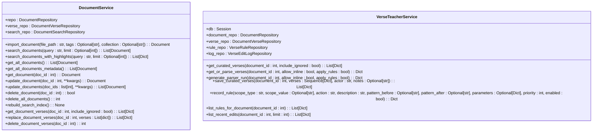
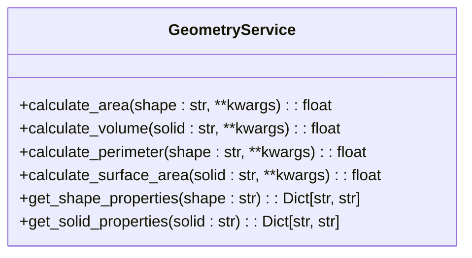

# API Reference

<cite>
**Referenced Files in This Document**   
- [calculation_service.py](file://src/pillars/gematria/services/calculation_service.py)
- [base_calculator.py](file://src/pillars/gematria/services/base_calculator.py)
- [hebrew_calculator.py](file://src/pillars/gematria/services/hebrew_calculator.py)
- [greek_calculator.py](file://src/pillars/gematria/services/greek_calculator.py)
- [tq_calculator.py](file://src/pillars/gematria/services/tq_calculator.py)
- [document_service.py](file://src/pillars/document_manager/services/document_service.py)
- [verse_teacher_service.py](file://src/pillars/document_manager/services/verse_teacher_service.py)
- [chart_storage_service.py](file://src/pillars/astrology/services/chart_storage_service.py)
- [location_lookup.py](file://src/pillars/astrology/services/location_lookup.py)
- [openastro_service.py](file://src/pillars/astrology/services/openastro_service.py)
- [conrune_pair_finder_service.py](file://src/pillars/tq/services/conrune_pair_finder_service.py)
- [geometric_transition_service.py](file://src/pillars/tq/services/geometric_transition_service.py)
- [kamea_grid_service.py](file://src/pillars/tq/services/kamea_grid_service.py)
- [ternary_service.py](file://src/pillars/tq/services/ternary_service.py)
- [ternary_transition_service.py](file://src/pillars/tq/services/ternary_transition_service.py)
</cite>

## Table of Contents
1. [Gematria Pillar](#gematria-pillar)
2. [Document Manager Pillar](#document-manager-pillar)
3. [Astrology Pillar](#astrology-pillar)
4. [TQ Pillar](#tq-pillar)
5. [Geometry Pillar](#geometry-pillar)

## Gematria Pillar

The Gematria pillar provides comprehensive services for calculating and managing gematria values across multiple languages and systems. The architecture follows a service-oriented design with a base calculator class that implements common functionality, and specialized calculators for each gematria system.

```mermaid
classDiagram
class GematriaCalculator {
<<abstract>>
+_letter_values : Dict[str, int]
+__init__()
+_initialize_mapping() : Dict[str, int]
+name : str
+normalize_text(text : str) : str
+calculate(text : str) : int
+get_letter_value(char : str) : int
+get_breakdown(text : str) : list
}
class CalculationService {
+repository : CalculationRepository
+save_calculation(text : str, value : int, calculator : GematriaCalculator, breakdown : List[tuple], notes : str, source : str, tags : List[str], category : str, user_rating : int, is_favorite : bool) : CalculationRecord
+update_calculation(record_id : str, notes : Optional[str], source : Optional[str], tags : Optional[List[str]], category : Optional[str], user_rating : Optional[int], is_favorite : Optional[bool]) : Optional[CalculationRecord]
+delete_calculation(record_id : str) : bool
+get_calculation(record_id : str) : Optional[CalculationRecord]
+search_calculations(query : Optional[str], language : Optional[str], value : Optional[int], tags : Optional[List[str]], favorites_only : bool, limit : int, page : int, summary_only : bool) : List[CalculationRecord]
+get_all_calculations(limit : int) : List[CalculationRecord]
+get_calculations_by_value(value : int) : List[CalculationRecord]
+get_favorite_calculations() : List[CalculationRecord]
+toggle_favorite(record_id : str) : Optional[CalculationRecord]
+get_breakdown_from_record(record : CalculationRecord) : List[tuple]
}
class HebrewGematriaCalculator {
+name : str
+_initialize_mapping() : Dict[str, int]
}
class HebrewSofitCalculator {
+name : str
+_initialize_mapping() : Dict[str, int]
}
class HebrewLetterValueCalculator {
+name : str
+_initialize_mapping() : Dict[str, int]
}
class HebrewOrdinalCalculator {
+name : str
+_initialize_mapping() : Dict[str, int]
}
class HebrewSmallValueCalculator {
+name : str
+_initialize_mapping() : Dict[str, int]
}
class HebrewAtBashCalculator {
+name : str
+_initialize_mapping() : Dict[str, int]
}
class HebrewKolelCalculator {
+name : str
+_initialize_mapping() : Dict[str, int]
+calculate(text : str) : int
}
class HebrewSquareCalculator {
+name : str
+_initialize_mapping() : Dict[str, int]
+calculate(text : str) : int
}
class HebrewCubeCalculator {
+name : str
+_initialize_mapping() : Dict[str, int]
+calculate(text : str) : int
}
class HebrewTriangularCalculator {
+name : str
+_initialize_mapping() : Dict[str, int]
+calculate(text : str) : int
}
class HebrewIntegralReducedCalculator {
+name : str
+_initialize_mapping() : Dict[str, int]
}
class GreekGematriaCalculator {
+name : str
+_initialize_mapping() : Dict[str, int]
}
class GreekLetterValueCalculator {
+name : str
+_initialize_mapping() : Dict[str, int]
}
class GreekOrdinalCalculator {
+name : str
+_initialize_mapping() : Dict[str, int]
}
class GreekSmallValueCalculator {
+name : str
+_initialize_mapping() : Dict[str, int]
}
class GreekKolelCalculator {
+name : str
+_initialize_mapping() : Dict[str, int]
+calculate(text : str) : int
}
class GreekSquareCalculator {
+name : str
+_initialize_mapping() : Dict[str, int]
+calculate(text : str) : int
}
class GreekCubeCalculator {
+name : str
+_initialize_mapping() : Dict[str, int]
+calculate(text : str) : int
}
class GreekTriangularCalculator {
+name : str
+_initialize_mapping() : Dict[str, int]
+calculate(text : str) : int
}
class GreekDigitalCalculator {
+name : str
+_initialize_mapping() : Dict[str, int]
+calculate(text : str) : int
}
class GreekOrdinalSquareCalculator {
+name : str
+_initialize_mapping() : Dict[str, int]
+calculate(text : str) : int
}
class GreekFullValueCalculator {
+name : str
+_initialize_mapping() : Dict[str, int]
}
class GreekReverseSubstitutionCalculator {
+name : str
+_initialize_mapping() : Dict[str, int]
}
class GreekPairMatchingCalculator {
+name : str
+_initialize_mapping() : Dict[str, int]
}
class TQGematriaCalculator {
+name : str
+_initialize_mapping() : Dict[str, int]
}
class TQReducedCalculator {
+name : str
+_initialize_mapping() : Dict[str, int]
+calculate(text : str) : int
}
class TQSquareCalculator {
+name : str
+_initialize_mapping() : Dict[str, int]
+calculate(text : str) : int
}
class TQTriangularCalculator {
+name : str
+_initialize_mapping() : Dict[str, int]
+calculate(text : str) : int
}
class TQPositionCalculator {
+name : str
+_initialize_mapping() : Dict[str, int]
+calculate(text : str) : int
}
GematriaCalculator <|-- HebrewGematriaCalculator
GematriaCalculator <|-- HebrewSofitCalculator
GematriaCalculator <|-- HebrewLetterValueCalculator
GematriaCalculator <|-- HebrewOrdinalCalculator
GematriaCalculator <|-- HebrewSmallValueCalculator
GematriaCalculator <|-- HebrewAtBashCalculator
GematriaCalculator <|-- HebrewKolelCalculator
GematriaCalculator <|-- HebrewSquareCalculator
GematriaCalculator <|-- HebrewCubeCalculator
GematriaCalculator <|-- HebrewTriangularCalculator
GematriaCalculator <|-- HebrewIntegralReducedCalculator
GematriaCalculator <|-- GreekGematriaCalculator
GematriaCalculator <|-- GreekLetterValueCalculator
GematriaCalculator <|-- GreekOrdinalCalculator
GematriaCalculator <|-- GreekSmallValueCalculator
GematriaCalculator <|-- GreekKolelCalculator
GematriaCalculator <|-- GreekSquareCalculator
GematriaCalculator <|-- GreekCubeCalculator
GematriaCalculator <|-- GreekTriangularCalculator
GematriaCalculator <|-- GreekDigitalCalculator
GematriaCalculator <|-- GreekOrdinalSquareCalculator
GematriaCalculator <|-- GreekFullValueCalculator
GematriaCalculator <|-- GreekReverseSubstitutionCalculator
GematriaCalculator <|-- GreekPairMatchingCalculator
GematriaCalculator <|-- TQGematriaCalculator
GematriaCalculator <|-- TQReducedCalculator
GematriaCalculator <|-- TQSquareCalculator
GematriaCalculator <|-- TQTriangularCalculator
GematriaCalculator <|-- TQPositionCalculator
```



**Diagram sources**
- [base_calculator.py](file://src/pillars/gematria/services/base_calculator.py#L7-L107)
- [hebrew_calculator.py](file://src/pillars/gematria/services/hebrew_calculator.py#L6-L800)
- [greek_calculator.py](file://src/pillars/gematria/services/greek_calculator.py#L6-L800)
- [tq_calculator.py](file://src/pillars/gematria/services/tq_calculator.py#L6-L381)

### Calculation Service

The CalculationService class provides a comprehensive interface for managing gematria calculations. It acts as a facade between the application and the underlying repository, handling all CRUD operations for calculation records.

**Section sources**
- [calculation_service.py](file://src/pillars/gematria/services/calculation_service.py#L11-L273)

#### save_calculation

Saves a new calculation record to the database.

**Parameters:**
- `text`: The original text input
- `value`: The calculated gematria value
- `calculator`: The GematriaCalculator instance used for calculation
- `breakdown`: List of (character, value) tuples showing the calculation breakdown
- `notes`: Optional user notes
- `source`: Optional source reference
- `tags`: Optional list of tags
- `category`: Optional user-defined category
- `user_rating`: Optional user rating (0-5)
- `is_favorite`: Boolean flag indicating if the calculation is a favorite

**Returns:** The saved CalculationRecord object

**Exceptions:** None

**Thread Safety:** The service is stateless and thread-safe when used with a thread-safe repository implementation.

**Usage Example:**
```python
calculator = HebrewGematriaCalculator()
value = calculator.calculate("שלום")
breakdown = calculator.get_breakdown("שלום")
record = service.save_calculation(
    text="שלום",
    value=value,
    calculator=calculator,
    breakdown=breakdown,
    tags=["peace", "hebrew"],
    is_favorite=True
)
```

#### update_calculation

Updates an existing calculation's metadata fields.

**Parameters:**
- `record_id`: The ID of the record to update
- `notes`: New notes (if provided)
- `source`: New source (if provided)
- `tags`: New tags (if provided)
- `category`: New category (if provided)
- `user_rating`: New rating (if provided)
- `is_favorite`: New favorite status (if provided)

**Returns:** The updated CalculationRecord object or None if not found

**Exceptions:** None

**Thread Safety:** Thread-safe with thread-safe repository

**Usage Example:**
```python
updated_record = service.update_calculation(
    record_id="123",
    notes="Updated analysis of this word",
    tags=["peace", "unity", "hebrew"]
)
```

#### delete_calculation

Deletes a calculation record by ID.

**Parameters:**
- `record_id`: The ID of the record to delete

**Returns:** True if deletion was successful, False if the record was not found

**Exceptions:** None

**Thread Safety:** Thread-safe with thread-safe repository

**Usage Example:**
```python
success = service.delete_calculation("123")
if success:
    print("Calculation deleted successfully")
```

#### get_calculation

Retrieves a calculation record by ID.

**Parameters:**
- `record_id`: The ID of the record to retrieve

**Returns:** The CalculationRecord object or None if not found

**Exceptions:** None

**Thread Safety:** Thread-safe with thread-safe repository

**Usage Example:**
```python
record = service.get_calculation("123")
if record:
    print(f"Found: {record.text} = {record.value}")
```

#### search_calculations

Searches for calculation records based on various criteria.

**Parameters:**
- `query`: Text search query
- `language`: Filter by language/calculator type
- `value`: Filter by exact gematria value
- `tags`: Filter by tags (any tag matches)
- `favorites_only`: Only return favorite calculations
- `limit`: Maximum number of results to return
- `page`: Page number for pagination (1-indexed)
- `summary_only`: Return lightweight records without full breakdown data

**Returns:** List of matching CalculationRecord objects

**Exceptions:** None

**Thread Safety:** Thread-safe with thread-safe repository

**Usage Example:**
```python
results = service.search_calculations(
    query="love",
    tags=["hebrew"],
    favorites_only=True,
    limit=10
)
```

#### get_all_calculations

Retrieves all calculation records from the database.

**Parameters:**
- `limit`: Maximum number of records to return

**Returns:** List of all CalculationRecord objects (up to limit)

**Exceptions:** None

**Thread Safety:** Thread-safe with thread-safe repository

**Usage Example:**
```python
all_calculations = service.get_all_calculations(limit=1000)
```

#### get_calculations_by_value

Finds all calculations with a specific gematria value.

**Parameters:**
- `value`: The gematria value to search for

**Returns:** List of CalculationRecord objects with the specified value

**Exceptions:** None

**Thread Safety:** Thread-safe with thread-safe repository

**Usage Example:**
```python
calculations_with_value_26 = service.get_calculations_by_value(26)
```

#### get_favorite_calculations

Retrieves all favorite calculation records.

**Returns:** List of favorite CalculationRecord objects

**Exceptions:** None

**Thread Safety:** Thread-safe with thread-safe repository

**Usage Example:**
```python
favorites = service.get_favorite_calculations()
```

#### toggle_favorite

Toggles the favorite status of a calculation.

**Parameters:**
- `record_id`: The ID of the record to toggle

**Returns:** The updated CalculationRecord object or None if not found

**Exceptions:** None

**Thread Safety:** Thread-safe with thread-safe repository

**Usage Example:**
```python
updated_record = service.toggle_favorite("123")
```

#### get_breakdown_from_record

Parses the breakdown JSON from a calculation record.

**Parameters:**
- `record`: The CalculationRecord object containing the breakdown data

**Returns:** List of (character, value) tuples representing the calculation breakdown

**Exceptions:** None (returns empty list on parsing errors)

**Thread Safety:** Thread-safe

**Usage Example:**
```python
breakdown = service.get_breakdown_from_record(record)
for char, value in breakdown:
    print(f"{char}: {value}")
```

### Base Calculator

The GematriaCalculator abstract base class provides common functionality for all gematria systems, including text normalization, character value lookup, and calculation methods.

**Section sources**
- [base_calculator.py](file://src/pillars/gematria/services/base_calculator.py#L7-L107)

#### normalize_text

Removes diacritical marks and accents from text to ensure consistent gematria calculations.

**Parameters:**
- `text`: The input text to normalize

**Returns:** Normalized text with diacritics removed

**Exceptions:** None

**Thread Safety:** Thread-safe

**Usage Example:**
```python
normalized = calculator.normalize_text("שָׁלוֹם")
# Returns "שלום" (without vowel points)
```

#### calculate

Calculates the gematria value of the given text.

**Parameters:**
- `text`: The input text to calculate

**Returns:** The total gematria value

**Exceptions:** None

**Thread Safety:** Thread-safe

**Usage Example:**
```python
value = calculator.calculate("שלום")
# Returns 376
```

#### get_letter_value

Gets the gematria value of a single character.

**Parameters:**
- `char`: Single character to look up

**Returns:** The numeric value or 0 if not found

**Exceptions:** None

**Thread Safety:** Thread-safe

**Usage Example:**
```python
value = calculator.get_letter_value("ש")
# Returns 300
```

#### get_breakdown

Gets a detailed breakdown of each character's value in the text.

**Parameters:**
- `text`: The input text to analyze

**Returns:** List of tuples (character, value) preserving order and duplicates

**Exceptions:** None

**Thread Safety:** Thread-safe

**Usage Example:**
```python
breakdown = calculator.get_breakdown("שלום")
# Returns [('ש', 300), ('ל', 30), ('ו', 6), ('ם', 40)]
```

### Hebrew Calculators

The Hebrew gematria system includes multiple calculation methods, each providing different insights into the numerical significance of Hebrew text.

**Section sources**
- [hebrew_calculator.py](file://src/pillars/gematria/services/hebrew_calculator.py#L6-L800)

#### HebrewGematriaCalculator

Standard Hebrew gematria (Mispar Hechrachi) assigns values to letters based on their position in the alphabet.

**Purpose:** The most common and traditional method of Hebrew gematria, used for biblical exegesis, mysticism, and numerology.

**Instantiation:** `HebrewGematriaCalculator()`

**Lifecycle:** Stateless - can be instantiated once and reused

**Usage Example:**
```python
calculator = HebrewGematriaCalculator()
value = calculator.calculate("יהוה")  # YHWH
# Returns 26
```

#### HebrewSofitCalculator

Hebrew gematria with final letter values (Mispar Sofit) uses special values for letters that appear at the end of words.

**Purpose:** Extends the Hebrew number system beyond 400, allowing representation of larger numbers and revealing deeper layers of meaning.

**Instantiation:** `HebrewSofitCalculator()`

**Lifecycle:** Stateless

**Usage Example:**
```python
calculator = HebrewSofitCalculator()
value = calculator.calculate("מלך")  # Melech (king)
# Returns 570 (using final Kaf value of 500)
```

#### HebrewLetterValueCalculator

Calculates the value of each letter's spelled-out name using final letter values.

**Purpose:** Reveals the spiritual essence of individual letters by considering the full spelling of each letter.

**Instantiation:** `HebrewLetterValueCalculator()`

**Lifecycle:** Stateless

**Usage Example:**
```python
calculator = HebrewLetterValueCalculator()
value = calculator.calculate("אב")  # ab (father)
# Returns 1,243
```

#### HebrewOrdinalCalculator

Assigns each letter a value based on its position in the Hebrew alphabet (1-22).

**Purpose:** Simplified gematria calculations that reveal patterns related to the structural essence of words.

**Instantiation:** `HebrewOrdinalCalculator()`

**Lifecycle:** Stateless

**Usage Example:**
```python
calculator = HebrewOrdinalCalculator()
value = calculator.calculate("משיח")  # Messiah
# Returns 52
```

#### HebrewSmallValueCalculator

Reduces gematria values to single digits by removing zeros (Mispar Katan).

**Purpose:** Rapid calculations that reveal the essential numerical essence of words.

**Instantiation:** `HebrewSmallValueCalculator()`

**Lifecycle:** Stateless

**Usage Example:**
```python
calculator = HebrewSmallValueCalculator()
value = calculator.calculate("שלום")  # peace
# Returns 16 (further reducible to 7)
```

#### HebrewAtBashCalculator

Implements the AtBash substitution cipher that reverses the Hebrew alphabet.

**Purpose:** Ancient Hebrew substitution cipher used to reveal hidden meanings in biblical text.

**Instantiation:** `HebrewAtBashCalculator()`

**Lifecycle:** Stateless

**Usage Example:**
```python
calculator = HebrewAtBashCalculator()
value = calculator.calculate("בבל")  # Babel
# Returns 620 (corresponds to "Sheshach" in Jeremiah)
```

#### HebrewKolelCalculator

Adds 1 for each letter to the standard gematria value (Mispar Kolel).

**Purpose:** Accounts for the "unity" of a word - each letter contributes not just its value but also its presence.

**Instantiation:** `HebrewKolelCalculator()`

**Lifecycle:** Stateless

**Usage Example:**
```python
calculator = HebrewKolelCalculator()
value = calculator.calculate("תורה")  # Torah
# Returns 615 (611 + 4 letters)
```

#### HebrewSquareCalculator

Squares each letter's value before summing (Mispar Merubah).

**Purpose:** Amplifies numerical significance exponentially, representing the "building" of higher dimensional spiritual realities.

**Instantiation:** `HebrewSquareCalculator()`

**Lifecycle:** Stateless

**Usage Example:**
```python
calculator = HebrewSquareCalculator()
value = calculator.calculate("אב")  # ab (father)
# Returns 5 (1² + 2²)
```

#### HebrewCubeCalculator

Cubes each letter's value before summing (Mispar Meshulash).

**Purpose:** Represents the three-dimensional or three-fold nature of reality in Kabbalistic thought.

**Instantiation:** `HebrewCubeCalculator()`

**Lifecycle:** Stateless

**Usage Example:**
```python
calculator = HebrewCubeCalculator()
value = calculator.calculate("אב")  # ab (father)
# Returns 9 (1³ + 2³)
```

#### HebrewTriangularCalculator

Uses triangular numbers for each letter's value (Mispar Kidmi).

**Purpose:** Represents accumulation and progressive growth, symbolizing the building up of spiritual energy.

**Instantiation:** `HebrewTriangularCalculator()`

**Lifecycle:** Stateless

**Usage Example:**
```python
calculator = HebrewTriangularCalculator()
value = calculator.calculate("אב")  # ab (father)
# Returns 4 (T(1) + T(2) = 1 + 3)
```

#### HebrewIntegralReducedCalculator

Calculates integral reduced values (Mispar Mispari).

**Purpose:** Further reduction method that provides additional numerical insights.

**Instantiation:** `HebrewIntegralReducedCalculator()`

**Lifecycle:** Stateless

**Usage Example:**
```python
calculator = HebrewIntegralReducedCalculator()
value = calculator.calculate("example")  # example text
# Returns the integral reduced value
```

### Greek Calculators

The Greek gematria system (isopsephy) provides multiple methods for calculating numerical values of Greek text.

**Section sources**
- [greek_calculator.py](file://src/pillars/gematria/services/greek_calculator.py#L6-L800)

#### GreekGematriaCalculator

Standard Greek isopsephy assigns values to letters of the Greek alphabet.

**Purpose:** Equivalent of Hebrew gematria for Greek text, used in New Testament analysis and classical studies.

**Instantiation:** `GreekGematriaCalculator()`

**Lifecycle:** Stateless

**Usage Example:**
```python
calculator = GreekGematriaCalculator()
value = calculator.calculate("Ἰησοῦς")  # Iēsous (Jesus)
# Returns 888
```

#### GreekLetterValueCalculator

Calculates the isopsephy value of each letter's spelled-out name.

**Purpose:** Advanced technique that considers the "name" of a letter to contain its essential spiritual nature.

**Instantiation:** `GreekLetterValueCalculator()`

**Lifecycle:** Stateless

**Usage Example:**
```python
calculator = GreekLetterValueCalculator()
value = calculator.calculate("αβ")  # ab
# Returns 843
```

#### GreekOrdinalCalculator

Assigns each letter a value based on its position in the extended Greek alphabet (1-27).

**Purpose:** Simplified alternative to standard isopsephy for finding patterns based on alphabetical structure.

**Instantiation:** `GreekOrdinalCalculator()`

**Lifecycle:** Stateless

**Usage Example:**
```python
calculator = GreekOrdinalCalculator()
value = calculator.calculate("Λόγος")  # Logos
# Returns 67
```

#### GreekSmallValueCalculator

Reduces isopsephy values to single digits by removing zeros.

**Purpose:** Quick numerological calculations that find the core numerical essence of words.

**Instantiation:** `GreekSmallValueCalculator()`

**Lifecycle:** Stateless

**Usage Example:**
```python
calculator = GreekSmallValueCalculator()
value = calculator.calculate("Λόγος")  # Logos
# Returns 22 (further reducible to 4)
```

#### GreekKolelCalculator

Adds the number of letters to the standard isopsephy value.

**Purpose:** Greek equivalent of Hebrew Kolel, accounting for the unity of a word.

**Instantiation:** `GreekKolelCalculator()`

**Lifecycle:** Stateless

**Usage Example:**
```python
calculator = GreekKolelCalculator()
value = calculator.calculate("Θεός")  # Theos (God)
# Returns 289 (284 + 5 letters)
```

#### GreekSquareCalculator

Squares each letter's isopsephy value before summing.

**Purpose:** Amplifies numerical significance, representing manifestation on the material plane.

**Instantiation:** `GreekSquareCalculator()`

**Lifecycle:** Stateless

**Usage Example:**
```python
calculator = GreekSquareCalculator()
value = calculator.calculate("Θεός")  # Theos (God)
# Returns 45,006
```

#### GreekCubeCalculator

Cubes each letter's isopsephy value before summing.

**Purpose:** Represents the three-dimensional nature of reality in Pythagorean philosophy.

**Instantiation:** `GreekCubeCalculator()`

**Lifecycle:** Stateless

**Usage Example:**
```python
calculator = GreekCubeCalculator()
value = calculator.calculate("Θεός")  # Theos (God)
# Returns 8,000,000+ (exact value depends on calculation)
```

#### GreekTriangularCalculator

Uses triangular numbers for each letter's isopsephy value.

**Purpose:** Represents the progressive accumulation from 1 to n, symbolizing the building blocks of reality.

**Instantiation:** `GreekTriangularCalculator()`

**Lifecycle:** Stateless

**Usage Example:**
```python
calculator = GreekTriangularCalculator()
value = calculator.calculate("Θεός")  # Theos (God)
# Returns 22,645
```

#### GreekDigitalCalculator

Sums the individual digits of each letter's value.

**Purpose:** Modern Greek numerology that finds the "digital root" of words.

**Instantiation:** `GreekDigitalCalculator()`

**Lifecycle:** Stateless

**Usage Example:**
```python
calculator = GreekDigitalCalculator()
value = calculator.calculate("Λόγος")  # Logos
# Returns 22 (3+7+3+7+2)
```

#### GreekOrdinalSquareCalculator

Calculates sum of squared ordinal values.

**Purpose:** Combines ordinal and square methods for amplified numerical analysis.

**Instantiation:** `GreekOrdinalSquareCalculator()`

**Lifecycle:** Stateless

**Usage Example:**
```python
calculator = GreekOrdinalSquareCalculator()
value = calculator.calculate("αβγ")  # abc
# Returns sum of squared ordinal positions
```

#### GreekFullValueCalculator

Maps letters to their full spelling values (same as GreekLetterValueCalculator).

**Purpose:** Alternative name for the letter value method.

**Instantiation:** `GreekFullValueCalculator()`

**Lifecycle:** Stateless

**Usage Example:**
```python
calculator = GreekFullValueCalculator()
value = calculator.calculate("αβ")  # ab
# Returns 843
```

#### GreekReverseSubstitutionCalculator

Implements Greek reverse substitution (equivalent of Hebrew AtBash).

**Purpose:** Ancient substitution cipher that reverses the Greek alphabet to conceal sacred teachings.

**Instantiation:** `GreekReverseSubstitutionCalculator()`

**Lifecycle:** Stateless

**Usage Example:**
```python
calculator = GreekReverseSubstitutionCalculator()
value = calculator.calculate("αβγ")  # abc
# Returns 2400 (using reverse substitution values)
```

#### GreekPairMatchingCalculator

Implements pair matching substitution (equivalent of Hebrew Albam).

**Purpose:** Pairs first half of alphabet with second half for substitution.

**Instantiation:** `GreekPairMatchingCalculator()`

**Lifecycle:** Stateless

**Usage Example:**
```python
calculator = GreekPairMatchingCalculator()
value = calculator.calculate("αβ")  # ab
# Returns value based on pair matching substitution
```

### TQ Calculators

The TQ (Trigrammaton Qabbalah) system provides English gematria calculations with various transformation methods.

**Section sources**
- [tq_calculator.py](file://src/pillars/gematria/services/tq_calculator.py#L6-L381)

#### TQGematriaCalculator

TQ English gematria assigns unique values (0-25) to the 26 letters of the English alphabet.

**Purpose:** Modern English gematria system based on sacred geometry and Qabalistic principles.

**Instantiation:** `TQGematriaCalculator()`

**Lifecycle:** Stateless

**Usage Example:**
```python
calculator = TQGematriaCalculator()
value = calculator.calculate("LIGHT")
# Returns 24
```

#### TQReducedCalculator

Reduces the TQ value to a single digit by summing digits repeatedly.

**Purpose:** Reveals the essential numerical essence of a word.

**Instantiation:** `TQReducedCalculator()`

**Lifecycle:** Stateless

**Usage Example:**
```python
calculator = TQReducedCalculator()
value = calculator.calculate("LIGHT")
# Returns 6 (2+4)
```

#### TQSquareCalculator

Squares each letter's TQ value before summing.

**Purpose:** Amplifies numerical significance and reveals hidden power dynamics.

**Instantiation:** `TQSquareCalculator()`

**Lifecycle:** Stateless

**Usage Example:**
```python
calculator = TQSquareCalculator()
value = calculator.calculate("LIGHT")
# Returns 212
```

#### TQTriangularCalculator

Uses triangular numbers for each letter's TQ value.

**Purpose:** Reveals the cumulative, progressive nature of word energies.

**Instantiation:** `TQTriangularCalculator()`

**Lifecycle:** Stateless

**Usage Example:**
```python
calculator = TQTriangularCalculator()
value = calculator.calculate("LIGHT")
# Returns 118
```

#### TQPositionCalculator

Multiplies each letter's TQ value by its position in the word.

**Purpose:** Gives more weight to letters appearing later in the word, recognizing that letter order matters.

**Instantiation:** `TQPositionCalculator()`

**Lifecycle:** Stateless

**Usage Example:**
```python
calculator = TQPositionCalculator()
value = calculator.calculate("LIGHT")
# Returns 91
```

## Document Manager Pillar

The Document Manager pillar provides services for managing documents, including import, search, and verse analysis functionality.



**Diagram sources**
- [document_service.py](file://src/pillars/document_manager/services/document_service.py#L18-L257)
- [verse_teacher_service.py](file://src/pillars/document_manager/services/verse_teacher_service.py#L20-L352)

### Document Service

The DocumentService class provides comprehensive document management functionality.

**Section sources**
- [document_service.py](file://src/pillars/document_manager/services/document_service.py#L18-L257)

#### import_document

Imports a document from a file path, parses its content, and saves it to the database.

**Parameters:**
- `file_path`: Path to the file to import
- `tags`: Optional comma-separated tags
- `collection`: Optional collection name

**Returns:** The imported Document object

**Exceptions:** FileNotFoundError if the file doesn't exist

**Thread Safety:** Thread-safe when used with thread-safe database session

**Usage Example:**
```python
document = service.import_document("/path/to/file.txt", tags="poetry,hebrew", collection="sacred_texts")
```

#### search_documents

Searches documents using full-text search.

**Parameters:**
- `query`: Search query string
- `limit`: Maximum number of results to return

**Returns:** List of Document objects matching the query, ordered by relevance

**Exceptions:** None

**Thread Safety:** Thread-safe with thread-safe database session

**Usage Example:**
```python
results = service.search_documents("love", limit=10)
```

#### search_documents_with_highlights

Searches documents and returns results with highlighted text.

**Parameters:**
- `query`: Search query string
- `limit`: Maximum number of results to return

**Returns:** List of dictionaries containing search results with highlights

**Exceptions:** None

**Thread Safety:** Thread-safe with thread-safe database session

**Usage Example:**
```python
results = service.search_documents_with_highlights("peace", limit=5)
```

#### get_all_documents

Retrieves all documents from the database.

**Returns:** List of all Document objects

**Exceptions:** None

**Thread Safety:** Thread-safe with thread-safe database session

**Usage Example:**
```python
all_docs = service.get_all_documents()
```

#### get_all_documents_metadata

Retrieves all documents without loading heavy content fields.

**Returns:** List of Document objects with metadata only

**Exceptions:** None

**Thread Safety:** Thread-safe with thread-safe database session

**Usage Example:**
```python
metadata_only = service.get_all_documents_metadata()
```

#### get_document

Retrieves a document by ID.

**Parameters:**
- `doc_id`: The ID of the document to retrieve

**Returns:** The Document object or None if not found

**Exceptions:** None

**Thread Safety:** Thread-safe with thread-safe database session

**Usage Example:**
```python
document = service.get_document(123)
```

#### update_document

Updates document fields.

**Parameters:**
- `doc_id`: Document ID to update
- `**kwargs`: Fields to update (content, raw_content, title, tags, author, collection)

**Returns:** The updated Document object or None if not found

**Exceptions:** None

**Thread Safety:** Thread-safe with thread-safe database session

**Usage Example:**
```python
updated_doc = service.update_document(123, title="New Title", tags="updated,tags")
```

#### update_documents

Efficiently updates multiple documents.

**Parameters:**
- `doc_ids`: List of Document IDs to update
- `**kwargs`: Fields to update

**Returns:** List of updated Document objects

**Exceptions:** None

**Thread Safety:** Thread-safe with thread-safe database session

**Usage Example:**
```python
updated_docs = service.update_documents([123, 456, 789], collection="updated_collection")
```

#### delete_document

Deletes a document by ID.

**Parameters:**
- `doc_id`: The ID of the document to delete

**Returns:** True if deletion was successful, False if the document was not found

**Exceptions:** None

**Thread Safety:** Thread-safe with thread-safe database session

**Usage Example:**
```python
success = service.delete_document(123)
```

#### delete_all_documents

Deletes all documents from the database and search index.

**Returns:** Number of documents deleted

**Exceptions:** None

**Thread Safety:** Thread-safe with thread-safe database session

**Usage Example:**
```python
count = service.delete_all_documents()
```

#### rebuild_search_index

Rebuilds the search index from the database.

**Returns:** None

**Exceptions:** None

**Thread Safety:** Thread-safe with thread-safe database session

**Usage Example:**
```python
service.rebuild_search_index()
```

#### get_document_verses

Retrieves verses for a document.

**Parameters:**
- `doc_id`: The ID of the document
- `include_ignored`: Whether to include ignored verses

**Returns:** List of verse dictionaries

**Exceptions:** None

**Thread Safety:** Thread-safe with thread-safe database session

**Usage Example:**
```python
verses = service.get_document_verses(123)
```

#### replace_document_verses

Replaces all verses for a document.

**Parameters:**
- `doc_id`: The ID of the document
- `verses`: List of verse dictionaries to save

**Returns:** List of saved verse dictionaries

**Exceptions:** None

**Thread Safety:** Thread-safe with thread-safe database session

**Usage Example:**
```python
new_verses = [{"number": 1, "text": "First verse", "start": 0, "end": 10}, ...]
saved_verses = service.replace_document_verses(123, new_verses)
```

#### delete_document_verses

Deletes all verses for a document.

**Parameters:**
- `doc_id`: The ID of the document

**Returns:** Number of verses deleted

**Exceptions:** None

**Thread Safety:** Thread-safe with thread-safe database session

**Usage Example:**
```python
count = service.delete_document_verses(123)
```

### Verse Teacher Service

The VerseTeacherService class coordinates verse parsing, curated overrides, and heuristics for the Holy Book "teacher" workflow.

**Section sources**
- [verse_teacher_service.py](file://src/pillars/document_manager/services/verse_teacher_service.py#L20-L352)

#### get_curated_verses

Retrieves curated verses for a document.

**Parameters:**
- `document_id`: The ID of the document
- `include_ignored`: Whether to include ignored verses

**Returns:** List of curated verse dictionaries

**Exceptions:** None

**Thread Safety:** Thread-safe with thread-safe database session

**Usage Example:**
```python
curated_verses = service.get_curated_verses(123)
```

#### get_or_parse_verses

Retrieves curated verses if they exist, otherwise generates a parser run.

**Parameters:**
- `document_id`: The ID of the document
- `allow_inline`: Whether to allow inline verse markers
- `apply_rules`: Whether to apply rules to the parsed verses

**Returns:** Dictionary containing verses and metadata

**Exceptions:** None

**Thread Safety:** Thread-safe with thread-safe database session

**Usage Example:**
```python
result = service.get_or_parse_verses(123, allow_inline=True, apply_rules=True)
```

#### generate_parser_run

Generates a parser run for a document.

**Parameters:**
- `document_id`: The ID of the document
- `allow_inline`: Whether to allow inline verse markers
- `apply_rules`: Whether to apply rules to the parsed verses

**Returns:** Dictionary containing parsed verses and metadata

**Exceptions:** None

**Thread Safety:** Thread-safe with thread-safe database session

**Usage Example:**
```python
result = service.generate_parser_run(123, allow_inline=True, apply_rules=True)
```

#### save_curated_verses

Saves curated verses for a document.

**Parameters:**
- `document_id`: The ID of the document
- `verses`: Sequence of verse dictionaries to save
- `actor`: Who performed the action (default: "system")
- `notes`: Optional notes about the change

**Returns:** List of saved verse dictionaries

**Exceptions:** None

**Thread Safety:** Thread-safe with thread-safe database session

**Usage Example:**
```python
verses = [{"number": 1, "text": "First verse", "status": "curated"}, ...]
saved = service.save_curated_verses(123, verses, actor="user123", notes="Manual curation")
```

#### record_rule

Records a new rule for verse processing.

**Parameters:**
- `scope_type`: Scope type ("document", "collection", "global")
- `scope_value`: Scope value (document ID, collection name, or None for global)
- `action`: Action to take ("suppress", "promote", "renumber", "note")
- `description`: Optional description of the rule
- `pattern_before`: Optional regex pattern to match before the verse
- `pattern_after`: Optional regex pattern to match after the verse
- `parameters`: Optional dictionary of parameters for the action
- `priority`: Rule priority (higher numbers processed first)
- `enabled`: Whether the rule is enabled

**Returns:** Dictionary representation of the saved rule

**Exceptions:** None

**Thread Safety:** Thread-safe with thread-safe database session

**Usage Example:**
```python
rule = service.record_rule(
    scope_type="document",
    scope_value="123",
    action="suppress",
    description="Suppress verse numbers in footnotes",
    pattern_before=r"\[Note \d+\]$",
    priority=10,
    enabled=True
)
```

#### list_rules_for_document

Lists all rules applicable to a document.

**Parameters:**
- `document_id`: The ID of the document

**Returns:** List of rule dictionaries

**Exceptions:** None

**Thread Safety:** Thread-safe with thread-safe database session

**Usage Example:**
```python
rules = service.list_rules_for_document(123)
```

#### list_recent_edits

Lists recent edits for a document.

**Parameters:**
- `document_id`: The ID of the document
- `limit`: Maximum number of edits to return

**Returns:** List of edit log dictionaries

**Exceptions:** None

**Thread Safety:** Thread-safe with thread-safe database session

**Usage Example:**
```python
edits = service.list_recent_edits(123, limit=10)
```

## Astrology Pillar

The Astrology pillar provides services for managing and generating astrological charts.

```mermaid
classDiagram
class ChartStorageService {
+_session_factory : ChartSessionFactory
+save_chart(name : str, request : ChartRequest, result : ChartResult, categories : Sequence[str], tags : Sequence[str], description : Optional[str]) : int
+list_recent(limit : int) : List[SavedChartSummary]
+search(text : Optional[str], categories : Optional[Sequence[str]], tags : Optional[Sequence[str]], limit : int) : List[SavedChartSummary]
+load_chart(chart_id : int) : Optional[LoadedChart]
+_serialize_request(request : ChartRequest) : Dict[str, object]
+_deserialize_request(payload : Dict[str, object]) : ChartRequest
+_serialize_event(event : AstrologyEvent) : Dict[str, object]
+_deserialize_event(payload : Dict[str, object]) : AstrologyEvent
+_extract_house_system(request : ChartRequest) : Optional[str]
+_to_summary(record : AstrologyChart) : SavedChartSummary
}
class LocationLookupService {
+API_URL : str
+_session : requests.Session
+search(query : str, count : int, language : str) : List[LocationResult]
+_safe_float(value : Optional[float]) : Optional[float]
}
class OpenAstroService {
+HOUSE_SYSTEM_LABELS : Dict[str, str]
+_logger : logging.Logger
+_default_settings : Dict[str, Any]
+generate_chart(request : ChartRequest) : ChartResult
+list_house_systems() : Dict[str, str]
+default_settings() : Dict[str, Any]
+_build_default_settings() : Dict[str, Any]
+_to_openastro_event(event : AstrologyEvent) : Dict[str, Any]
+_build_chart_result(chart : Any, request : ChartRequest) : ChartResult
+_prime_chart(chart : Any) : None
+_planet_data(chart : Any) : Dict[str, Dict[str, Any]]
+_extract_planet_positions(chart : Any, planet_data : Dict[str, Dict[str, Any]]) : List[PlanetPosition]
+_extract_house_positions(chart : Any) : List[HousePosition]
+_extract_aspects(chart : Any) : Dict[str, Any]
+_maybe_render_svg(chart : Any, include_svg : bool) : Optional[str]
+_extract_raw_payload(chart : Any, planet_data : Dict[str, Dict[str, Any]]) : Dict[str, Any]
}
```



**Diagram sources**
- [chart_storage_service.py](file://src/pillars/astrology/services/chart_storage_service.py#L39-L205)
- [location_lookup.py](file://src/pillars/astrology/services/location_lookup.py#L34-L90)
- [openastro_service.py](file://src/pillars/astrology/services/openastro_service.py#L31-L254)

### Chart Storage Service

The ChartStorageService class provides persistence functionality for astrological charts.

**Section sources**
- [chart_storage_service.py](file://src/pillars/astrology/services/chart_storage_service.py#L39-L205)

#### save_chart

Saves a chart to the database.

**Parameters:**
- `name`: Name of the chart
- `request`: ChartRequest object containing chart parameters
- `result`: ChartResult object containing computed results
- `categories`: Sequence of category names
- `tags`: Sequence of tag names
- `description`: Optional description

**Returns:** The ID of the saved chart

**Exceptions:** None

**Thread Safety:** Thread-safe with thread-safe session factory

**Usage Example:**
```python
chart_id = service.save_chart(
    name="John's Natal Chart",
    request=request,
    result=result,
    categories=["natal", "personal"],
    tags=["placidus", "tropical"],
    description="John Doe's natal chart"
)
```

#### list_recent

Lists recently saved charts.

**Parameters:**
- `limit`: Maximum number of charts to return

**Returns:** List of SavedChartSummary objects

**Exceptions:** None

**Thread Safety:** Thread-safe with thread-safe session factory

**Usage Example:**
```python
recent = service.list_recent(limit=20)
```

#### search

Searches for saved charts.

**Parameters:**
- `text`: Optional text to search in chart names and descriptions
- `categories`: Optional sequence of categories to filter by
- `tags`: Optional sequence of tags to filter by
- `limit`: Maximum number of results to return

**Returns:** List of SavedChartSummary objects

**Exceptions:** None

**Thread Safety:** Thread-safe with thread-safe session factory

**Usage Example:**
```python
results = service.search(text="natal", categories=["personal"], limit=10)
```

#### load_chart

Loads a chart by ID.

**Parameters:**
- `chart_id`: The ID of the chart to load

**Returns:** LoadedChart object or None if not found

**Exceptions:** None

**Thread Safety:** Thread-safe with thread-safe session factory

**Usage Example:**
```python
chart = service.load_chart(123)
if chart:
    print(f"Loaded: {chart.request.primary_event.name}")
```

### Location Lookup Service

The LocationLookupService class queries the Open-Meteo geocoding API for city coordinates.

**Section sources**
- [location_lookup.py](file://src/pillars/astrology/services/location_lookup.py#L34-L90)

#### search

Searches for locations matching a query.

**Parameters:**
- `query`: Search query (city name, etc.)
- `count`: Maximum number of results to return
- `language`: Language for results

**Returns:** List of LocationResult objects

**Exceptions:** LocationLookupError if the API fails or returns no results

**Thread Safety:** Thread-safe with thread-safe requests session

**Usage Example:**
```python
locations = service.search("Jerusalem", count=5)
for loc in locations:
    print(f"{loc.name}: {loc.latitude}, {loc.longitude}")
```

### OpenAstro Service

The OpenAstroService class provides a high-level interface to the OpenAstro2 library for generating astrological charts.

**Section sources**
- [openastro_service.py](file://src/pillars/astrology/services/openastro_service.py#L31-L254)

#### generate_chart

Generates a chart using OpenAstro2.

**Parameters:**
- `request`: ChartRequest object containing chart parameters

**Returns:** ChartResult object containing computed results

**Exceptions:** OpenAstroNotAvailableError if openastro2 is not installed, ChartComputationError if chart generation fails

**Thread Safety:** Thread-safe

**Usage Example:**
```python
result = service.generate_chart(request)
```

#### list_house_systems

Returns a dictionary of supported house systems.

**Returns:** Dictionary mapping house system codes to labels

**Exceptions:** None

**Thread Safety:** Thread-safe

**Usage Example:**
```python
systems = service.list_house_systems()
for code, label in systems.items():
    print(f"{code}: {label}")
```

#### default_settings

Returns a copy of the default OpenAstro settings.

**Returns:** Dictionary containing default settings

**Exceptions:** None

**Thread Safety:** Thread-safe

**Usage Example:**
```python
defaults = service.default_settings()
```

## TQ Pillar

The TQ pillar provides services for ternary-based calculations and geometric transitions.

```mermaid
classDiagram
class ConrunePairFinderService {
+NEGATIVE_SYMBOL : str
+ternary_service : TernaryService
+analyze(difference : int) : Dict[str, object]
+_decimal_to_balanced_ternary(number : int) : str
+_balanced_to_original_ternary(balanced : str) : str
}
class GeometricTransitionService {
+MIN_SIDES : int
+MAX_SIDES : int
+MAX_SKIP_GROUPS : int
+SPECIAL_PATTERNS : Dict[int, List[Dict[str, object]]]
+get_polygon_options() : List[Dict[str, object]]
+build_vertices(sides : int, values : Optional[Sequence[int]]) : List[Vertex]
+generate_skip_groups(vertices : Sequence[Vertex], max_skip : Optional[int]) : List[Dict[str, object]]
+generate_special_sequences(vertices : Sequence[Vertex]) : List[Dict[str, object]]
+_build_transitions(vertices : Sequence[Vertex], skip : int) : List[Transition]
+_build_custom_transition(vertices : Sequence[Vertex], from_index : int, to_index : int) : Transition
+_summarize(transitions : Sequence[Transition]) : Dict[str, object]
+_group_label(skip : int) : str
+_normalize_values(sides : int, values : Optional[Sequence[int]]) : List[int]
+_validate_sides(sides : int) : None
+_polygon_name(sides : int) : str
}
class KameaGridService {
+_grid : Dict[Tuple[int, int], KameaCell]
+_decimal_map : Dict[int, Tuple[int, int]]
+_initialized : bool
+variant : str
+decimal_csv_path : str
+ternary_csv_path : str
+cells : List[KameaCell]
+initialize() : None
+get_cell(x : int, y : int) : Optional[KameaCell]
+get_cell_by_locator(region : int, area : int, cell : int) : Optional[KameaCell]
+get_cell_color(cell : KameaCell) : QColor
+get_quadset(x : int, y : int) : List[KameaCell]
+get_chord_values(decimal_value : int) : List[int]
+_load_grid() : None
+_parse_grid_csv(filepath : str) : Dict[Tuple[int, int], str]
}
class TernaryService {
+decimal_to_ternary(n : int) : str
+ternary_to_decimal(t : str) : int
+conrune_transform(t : str) : str
+reverse_ternary(t : str) : str
}
class TernaryTransitionService {
+TRANSITION_MAP : Dict[Tuple[str, str], str]
+PHILOSOPHY : Dict[str, Dict[str, str]]
+transition(t1 : str, t2 : str) : str
+generate_sequence(start_t : str, modifier_t : str, iterations : int) : List[Tuple[str, str, str]]
+get_digit_info(digit : str) : Dict[str, str]
}
```



**Diagram sources**
- [conrune_pair_finder_service.py](file://src/pillars/tq/services/conrune_pair_finder_service.py#L19-L82)
- [geometric_transition_service.py](file://src/pillars/tq/services/geometric_transition_service.py#L38-L323)
- [kamea_grid_service.py](file://src/pillars/tq/services/kamea_grid_service.py#L11-L220)
- [ternary_service.py](file://src/pillars/tq/services/ternary_service.py#L3-L114)
- [ternary_transition_service.py](file://src/pillars/tq/services/ternary_transition_service.py#L4-L70)

### Conrune Pair Finder Service

The ConrunePairFinderService class computes Conrune pair information based on a target difference.

**Section sources**
- [conrune_pair_finder_service.py](file://src/pillars/tq/services/conrune_pair_finder_service.py#L19-L82)

#### analyze

Analyzes a target difference to find Conrune pairs.

**Parameters:**
- `difference`: Target difference value

**Returns:** Dictionary containing balanced ternary representation, Conrune pairs, and verification information

**Exceptions:** None

**Thread Safety:** Thread-safe

**Usage Example:**
```python
result = service.analyze(7)
print(f"Balanced ternary: {result['balanced']}")
for pair in result['pairs']:
    print(f"{pair.label}: {pair.ternary} ({pair.decimal})")
```

### Geometric Transition Service

The GeometricTransitionService class generates transitions on regular polygons.

**Section sources**
- [geometric_transition_service.py](file://src/pillars/tq/services/geometric_transition_service.py#L38-L323)

#### get_polygon_options

Returns supported polygon side counts for UI selectors.

**Returns:** List of dictionaries containing side counts and names

**Exceptions:** None

**Thread Safety:** Thread-safe

**Usage Example:**
```python
options = service.get_polygon_options()
for option in options:
    print(f"{option['sides']}-sided {option['name']}")
```

#### build_vertices

Constructs ordered vertices with coordinates for a polygon.

**Parameters:**
- `sides`: Number of sides for the polygon
- `values`: Optional sequence of values for the vertices

**Returns:** List of Vertex objects

**Exceptions:** ValueError if sides is outside valid range

**Thread Safety:** Thread-safe

**Usage Example:**
```python
vertices = service.build_vertices(7, [1, 2, 3, 4, 5, 6, 7])
```

#### generate_skip_groups

Generates transition groups keyed by skip value.

**Parameters:**
- `vertices`: Sequence of Vertex objects
- `max_skip`: Optional maximum skip value

**Returns:** List of dictionaries containing skip groups

**Exceptions:** ValueError if invalid parameters

**Thread Safety:** Thread-safe

**Usage Example:**
```python
groups = service.generate_skip_groups(vertices, max_skip=3)
```

#### generate_special_sequences

Returns predefined transition sets for particular polygons.

**Parameters:**
- `vertices`: Sequence of Vertex objects

**Returns:** List of dictionaries containing special sequences

**Exceptions:** None

**Thread Safety:** Thread-safe

**Usage Example:**
```python
sequences = service.generate_special_sequences(vertices)
```

### Kamea Grid Service

The KameaGridService class manages the 27x27 Kamea Grid.

**Section sources**
- [kamea_grid_service.py](file://src/pillars/tq/services/kamea_grid_service.py#L11-L220)

#### initialize

Initializes the grid by loading from CSV files.

**Returns:** None

**Exceptions:** Exception if initialization fails

**Thread Safety:** Not thread-safe - should be initialized once before multi-threaded use

**Usage Example:**
```python
service.initialize()
```

#### get_cell

Returns the cell at Cartesian coordinates.

**Parameters:**
- `x`: X coordinate
- `y`: Y coordinate

**Returns:** KameaCell object or None if not found

**Exceptions:** None

**Thread Safety:** Thread-safe after initialization

**Usage Example:**
```python
cell = service.get_cell(0, 0)
```

#### get_cell_by_locator

Finds a cell by its Kamea Locator values.

**Parameters:**
- `region`: Region value (0-8)
- `area`: Area value (0-8)
- `cell`: Cell value (0-8)

**Returns:** KameaCell object or None if not found

**Exceptions:** None

**Thread Safety:** Thread-safe after initialization

**Usage Example:**
```python
cell = service.get_cell_by_locator(1, 2, 3)
```

#### get_cell_color

Returns the color for a cell based on Baphomet Physics.

**Parameters:**
- `cell`: KameaCell object

**Returns:** QColor object

**Exceptions:** None

**Thread Safety:** Thread-safe after initialization

**Usage Example:**
```python
color = service.get_cell_color(cell)
```

#### get_quadset

Returns the list of related cells for a coordinate.

**Parameters:**
- `x`: X coordinate
- `y`: Y coordinate

**Returns:** List of related KameaCell objects

**Exceptions:** None

**Thread Safety:** Thread-safe after initialization

**Usage Example:**
```python
quadset = service.get_quadset(1, 2)
```

#### get_chord_values

Returns the list of decimal values forming the Geometric Chord for a given number.

**Parameters:**
- `decimal_value`: Input decimal value

**Returns:** List of decimal values in the chord

**Exceptions:** None

**Thread Safety:** Thread-safe after initialization

**Usage Example:**
```python
values = service.get_chord_values(42)
```

### Ternary Service

The TernaryService class handles decimal-ternary conversions.

**Section sources**
- [ternary_service.py](file://src/pillars/tq/services/ternary_service.py#L3-L114)

#### decimal_to_ternary

Converts a decimal integer to a ternary string.

**Parameters:**
- `n`: Decimal integer

**Returns:** Ternary string representation

**Exceptions:** None

**Thread Safety:** Thread-safe

**Usage Example:**
```python
ternary = service.decimal_to_ternary(42)
# Returns "1120"
```

#### ternary_to_decimal

Converts a ternary string to a decimal integer.

**Parameters:**
- `t`: Ternary string

**Returns:** Decimal integer

**Exceptions:** ValueError if string contains invalid characters

**Thread Safety:** Thread-safe

**Usage Example:**
```python
decimal = service.ternary_to_decimal("1120")
# Returns 42
```

#### conrune_transform

Applies Conrune transformation to a ternary string.

**Parameters:**
- `t`: Ternary string

**Returns:** Transformed ternary string

**Exceptions:** None

**Thread Safety:** Thread-safe

**Usage Example:**
```python
transformed = service.conrune_transform("1120")
# Returns "2210"
```

#### reverse_ternary

Reverses a ternary string.

**Parameters:**
- `t`: Ternary string

**Returns:** Reversed ternary string

**Exceptions:** None

**Thread Safety:** Thread-safe

**Usage Example:**
```python
reversed_t = service.reverse_ternary("1120")
# Returns "0211"
```

### Ternary Transition Service

The TernaryTransitionService class implements the Ternary Transition System.

**Section sources**
- [ternary_transition_service.py](file://src/pillars/tq/services/ternary_transition_service.py#L4-L70)

#### transition

Applies transition between two ternary numbers.

**Parameters:**
- `t1`: First ternary string
- `t2`: Second ternary string

**Returns:** Resulting ternary string

**Exceptions:** None

**Thread Safety:** Thread-safe

**Usage Example:**
```python
result = service.transition("1120", "2011")
```

#### generate_sequence

Generates a sequence of transitions.

**Parameters:**
- `start_t`: Starting ternary string
- `modifier_t`: Modifier ternary string
- `iterations`: Number of iterations

**Returns:** List of tuples (current, modifier, result)

**Exceptions:** None

**Thread Safety:** Thread-safe

**Usage Example:**
```python
sequence = service.generate_sequence("1120", "2011", iterations=5)
```

#### get_digit_info

Gets philosophical information for a ternary digit.

**Parameters:**
- `digit`: Ternary digit ('0', '1', or '2')

**Returns:** Dictionary containing role, meaning, and force

**Exceptions:** None

**Thread Safety:** Thread-safe

**Usage Example:**
```python
info = service.get_digit_info("1")
# Returns {'role': 'One / Single', 'meaning': 'Yang (Vertex)', 'force': 'Outward motion'}
```

## Geometry Pillar

The Geometry pillar provides services for geometric calculations and visualizations.



**Diagram sources**
- [geometry_service.py](file://src/pillars/geometry/services/geometry_service.py)

### Geometry Service

The GeometryService class provides methods for calculating geometric properties.

**Section sources**
- [geometry_service.py](file://src/pillars/geometry/services/geometry_service.py)

#### calculate_area

Calculates the area of a 2D shape.

**Parameters:**
- `shape`: Name of the shape
- `**kwargs`: Shape-specific parameters

**Returns:** Area as float

**Exceptions:** ValueError for invalid shapes or parameters

**Thread Safety:** Thread-safe

**Usage Example:**
```python
area = service.calculate_area("circle", radius=5)
```

#### calculate_volume

Calculates the volume of a 3D solid.

**Parameters:**
- `solid`: Name of the solid
- `**kwargs`: Solid-specific parameters

**Returns:** Volume as float

**Exceptions:** ValueError for invalid solids or parameters

**Thread Safety:** Thread-safe

**Usage Example:**
```python
volume = service.calculate_volume("sphere", radius=5)
```

#### calculate_perimeter

Calculates the perimeter of a 2D shape.

**Parameters:**
- `shape`: Name of the shape
- `**kwargs`: Shape-specific parameters

**Returns:** Perimeter as float

**Exceptions:** ValueError for invalid shapes or parameters

**Thread Safety:** Thread-safe

**Usage Example:**
```python
perimeter = service.calculate_perimeter("rectangle", width=4, height=6)
```

#### calculate_surface_area

Calculates the surface area of a 3D solid.

**Parameters:**
- `solid`: Name of the solid
- `**kwargs`: Solid-specific parameters

**Returns:** Surface area as float

**Exceptions:** ValueError for invalid solids or parameters

**Thread Safety:** Thread-safe

**Usage Example:**
```python
surface_area = service.calculate_surface_area("cube", side=4)
```

#### get_shape_properties

Returns properties of a 2D shape.

**Parameters:**
- `shape`: Name of the shape

**Returns:** Dictionary of shape properties

**Exceptions:** ValueError for invalid shapes

**Thread Safety:** Thread-safe

**Usage Example:**
```python
properties = service.get_shape_properties("triangle")
```

#### get_solid_properties

Returns properties of a 3D solid.

**Parameters:**
- `solid`: Name of the solid

**Returns:** Dictionary of solid properties

**Exceptions:** ValueError for invalid solids

**Thread Safety:** Thread-safe

**Usage Example:**
```python
properties = service.get_solid_properties("tetrahedron")
```