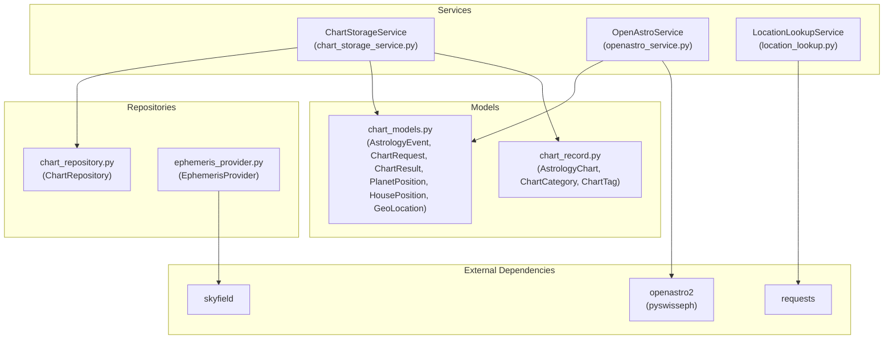
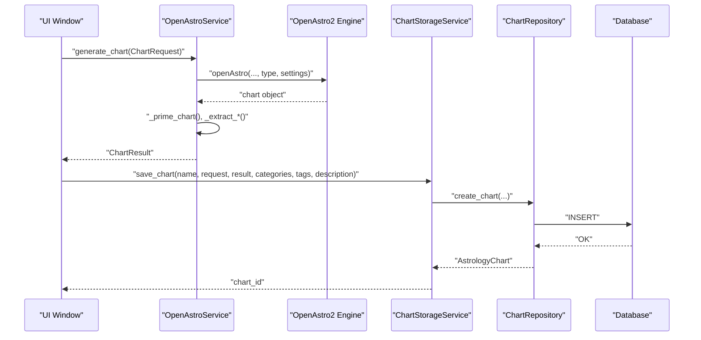
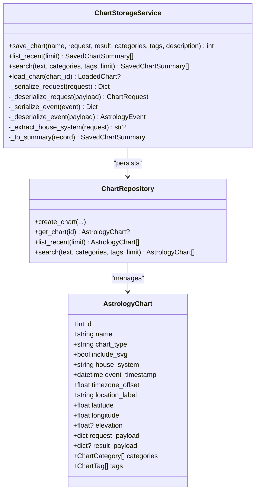
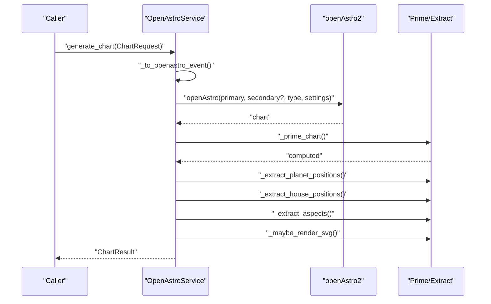
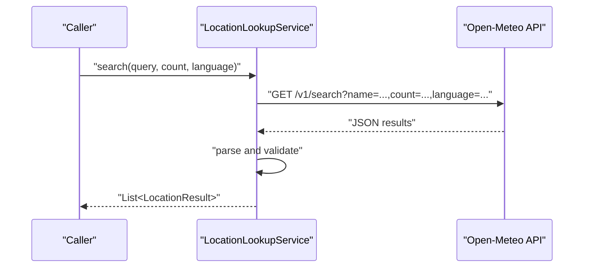
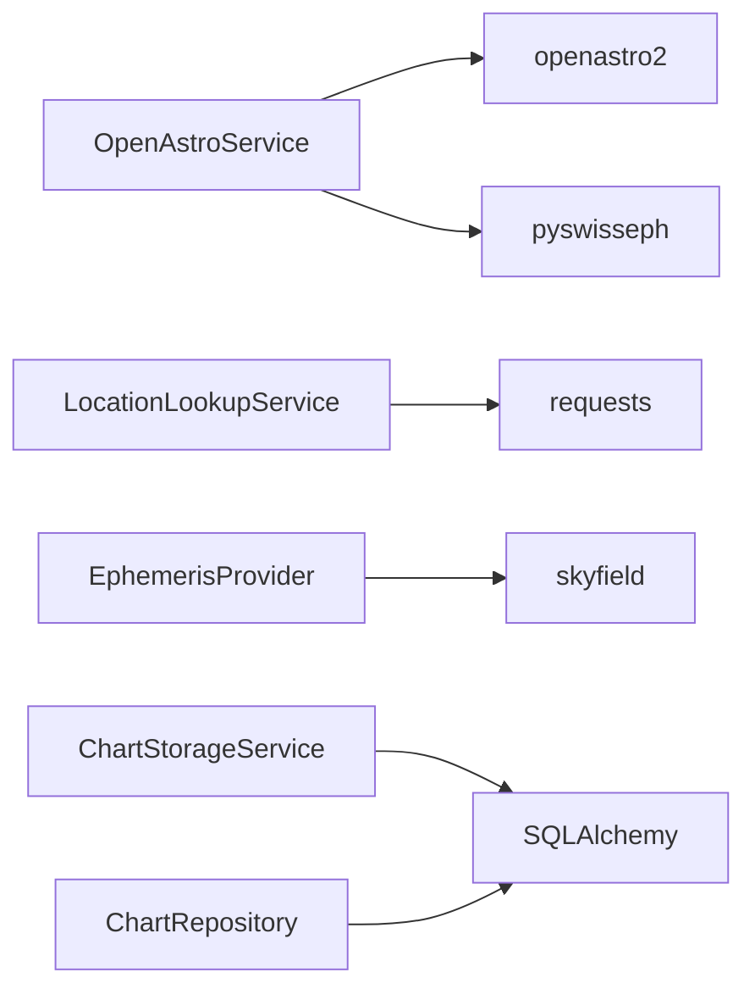

# Astrology API

<cite>
**Referenced Files in This Document**
- [chart_storage_service.py](file://src/pillars/astrology/services/chart_storage_service.py)
- [openastro_service.py](file://src/pillars/astrology/services/openastro_service.py)
- [location_lookup.py](file://src/pillars/astrology/services/location_lookup.py)
- [chart_models.py](file://src/pillars/astrology/models/chart_models.py)
- [chart_record.py](file://src/pillars/astrology/models/chart_record.py)
- [chart_repository.py](file://src/pillars/astrology/repositories/chart_repository.py)
- [ephemeris_provider.py](file://src/pillars/astrology/repositories/ephemeris_provider.py)
- [requirements.txt](file://requirements.txt)
- [test_chart_storage_service.py](file://test/test_chart_storage_service.py)
- [test_astrology_service.py](file://test/test_astrology_service.py)
</cite>

## Table of Contents
1. [Introduction](#introduction)
2. [Project Structure](#project-structure)
3. [Core Components](#core-components)
4. [Architecture Overview](#architecture-overview)
5. [Detailed Component Analysis](#detailed-component-analysis)
6. [Dependency Analysis](#dependency-analysis)
7. [Performance Considerations](#performance-considerations)
8. [Troubleshooting Guide](#troubleshooting-guide)
9. [Conclusion](#conclusion)
10. [Appendices](#appendices)

## Introduction
This document describes the Astrology pillar’s service layer APIs for:
- Managing natal charts, transit data, and cosmic calendar entries via ChartStorageService
- Interfacing with the OpenAstro2 engine for celestial calculations, ephemeris data access, and planetary position computations using pyswisseph
- Resolving geographic coordinates via LocationLookupService

It specifies persistence and retrieval operations, time zone handling, ephemeris file dependencies, accuracy tolerances, and provides usage examples for generating natal charts, calculating planetary transits, and resolving location coordinates. It also covers initialization requirements for astronomical data files and performance considerations for batch calculations.

## Project Structure
The Astrology pillar organizes its service layer under src/pillars/astrology/services and related models and repositories under src/pillars/astrology/models and src/pillars/astrology/repositories. Tests reside under test/ and test/.

**Diagram sources**
- [chart_storage_service.py](file://src/pillars/astrology/services/chart_storage_service.py#L1-L205)
- [openastro_service.py](file://src/pillars/astrology/services/openastro_service.py#L1-L254)
- [location_lookup.py](file://src/pillars/astrology/services/location_lookup.py#L1-L90)
- [chart_models.py](file://src/pillars/astrology/models/chart_models.py#L1-L133)
- [chart_record.py](file://src/pillars/astrology/models/chart_record.py#L1-L99)
- [chart_repository.py](file://src/pillars/astrology/repositories/chart_repository.py#L1-L139)
- [ephemeris_provider.py](file://src/pillars/astrology/repositories/ephemeris_provider.py#L1-L68)
- [requirements.txt](file://requirements.txt#L1-L40)

**Section sources**
- [chart_storage_service.py](file://src/pillars/astrology/services/chart_storage_service.py#L1-L205)
- [openastro_service.py](file://src/pillars/astrology/services/openastro_service.py#L1-L254)
- [location_lookup.py](file://src/pillars/astrology/services/location_lookup.py#L1-L90)
- [chart_models.py](file://src/pillars/astrology/models/chart_models.py#L1-L133)
- [chart_record.py](file://src/pillars/astrology/models/chart_record.py#L1-L99)
- [chart_repository.py](file://src/pillars/astrology/repositories/chart_repository.py#L1-L139)
- [ephemeris_provider.py](file://src/pillars/astrology/repositories/ephemeris_provider.py#L1-L68)
- [requirements.txt](file://requirements.txt#L1-L40)

## Core Components
- ChartStorageService: Persists and retrieves natal charts, transit data, and cosmic calendar entries. Handles serialization of ChartRequest and ChartResult, and manages categories/tags.
- OpenAstroService: Wraps OpenAstro2 to compute charts, extract positions, houses, aspects, and optional SVG rendering. Provides default settings and house system validation.
- LocationLookupService: Resolves place names to coordinates using the Open-Meteo geocoding API, returning elevation and timezone identifiers.

**Section sources**
- [chart_storage_service.py](file://src/pillars/astrology/services/chart_storage_service.py#L1-L205)
- [openastro_service.py](file://src/pillars/astrology/services/openastro_service.py#L1-L254)
- [location_lookup.py](file://src/pillars/astrology/services/location_lookup.py#L1-L90)

## Architecture Overview
The service layer orchestrates between UI windows and external engines:
- UI builds ChartRequest and passes it to OpenAstroService to produce ChartResult.
- ChartStorageService persists ChartResult and serializes ChartRequest for later retrieval.
- LocationLookupService resolves user-provided place names to GeoLocation.
- EphemerisProvider loads astronomical ephemeris data for precise planetary positions.

**Diagram sources**
- [openastro_service.py](file://src/pillars/astrology/services/openastro_service.py#L64-L139)
- [chart_storage_service.py](file://src/pillars/astrology/services/chart_storage_service.py#L48-L116)
- [chart_repository.py](file://src/pillars/astrology/repositories/chart_repository.py#L21-L60)

## Detailed Component Analysis

### ChartStorageService
Responsibilities:
- Save charts with metadata, serialized request, and result payload
- List recent charts and search by text, categories, and tags
- Load charts back into memory with original request and metadata
- Serialize/deserialize ChartRequest and ChartResult for persistence

Key operations:
- save_chart(name, request, result, categories, tags, description) -> int
- list_recent(limit) -> List[SavedChartSummary]
- search(text, categories, tags, limit) -> List[SavedChartSummary]
- load_chart(chart_id) -> Optional[LoadedChart]

Data models involved:
- ChartRequest, ChartResult, AstrologyEvent, GeoLocation
- AstrologyChart (persistence model)

Serialization behavior:
- Request payload includes chart_type, include_svg, settings, and serialized events
- Result payload includes normalized positions, houses, aspects, optional SVG, and raw payload

Time zone handling:
- Uses resolved_timezone_offset() from AstrologyEvent to persist timezone offset

House system extraction:
- Extracts house_system from request.settings.astrocfg for indexing and filtering

**Section sources**
- [chart_storage_service.py](file://src/pillars/astrology/services/chart_storage_service.py#L48-L205)
- [chart_models.py](file://src/pillars/astrology/models/chart_models.py#L33-L133)
- [chart_record.py](file://src/pillars/astrology/models/chart_record.py#L37-L73)
- [chart_repository.py](file://src/pillars/astrology/repositories/chart_repository.py#L21-L107)

#### Class Diagram

**Diagram sources**
- [chart_storage_service.py](file://src/pillars/astrology/services/chart_storage_service.py#L48-L205)
- [chart_repository.py](file://src/pillars/astrology/repositories/chart_repository.py#L21-L107)
- [chart_record.py](file://src/pillars/astrology/models/chart_record.py#L37-L73)

### OpenAstroService
Responsibilities:
- Wrap OpenAstro2 to compute charts
- Convert AstrologyEvent to engine kwargs
- Extract planet positions, house cusps, aspects, and optional SVG
- Provide default settings and house system labels
- Raise structured errors for missing dependencies and computation failures

Public API:
- generate_chart(request) -> ChartResult
- list_house_systems() -> Dict[str, str]
- default_settings() -> Dict[str, Any]

Default settings:
- Language, house system (Placidus), zodiactype (tropical), postype (geo), and rounding flags

Error handling:
- OpenAstroNotAvailableError when openastro2 is not installed
- ChartComputationError for engine failures

Accuracy and ephemeris:
- Relies on openastro2’s underlying ephemeris (pyswisseph) for positions
- EphemerisProvider loads skyfield ephemeris data for precise calculations

**Section sources**
- [openastro_service.py](file://src/pillars/astrology/services/openastro_service.py#L1-L254)
- [chart_models.py](file://src/pillars/astrology/models/chart_models.py#L33-L133)
- [ephemeris_provider.py](file://src/pillars/astrology/repositories/ephemeris_provider.py#L1-L68)

#### Sequence Diagram: Chart Generation

**Diagram sources**
- [openastro_service.py](file://src/pillars/astrology/services/openastro_service.py#L64-L139)

### LocationLookupService
Responsibilities:
- Resolve place names to coordinates via Open-Meteo geocoding API
- Return elevation and timezone identifier along with location label
- Validate and normalize results

Public API:
- search(query, count, language) -> List[LocationResult]

Error handling:
- Raises LocationLookupError for invalid queries, network errors, or empty results

**Section sources**
- [location_lookup.py](file://src/pillars/astrology/services/location_lookup.py#L1-L90)

#### Sequence Diagram: Location Resolution

**Diagram sources**
- [location_lookup.py](file://src/pillars/astrology/services/location_lookup.py#L42-L83)

### EphemerisProvider and Accuracy
- EphemerisProvider is a singleton that loads ephemeris data (de421.bsp or de441.bsp) using Skyfield
- It attempts to locate ephemeris files in common locations and falls back to downloading a smaller dataset if needed
- Accuracy depends on the underlying ephemeris file; larger datasets (e.g., de441) offer higher fidelity for long-term predictions

Initialization:
- Call is_loaded() to check readiness before performing calculations
- The loader runs in a background thread to avoid blocking startup

**Section sources**
- [ephemeris_provider.py](file://src/pillars/astrology/repositories/ephemeris_provider.py#L1-L68)

## Dependency Analysis
External dependencies and their roles:
- openastro2: Provides the OpenAstro2 engine for chart computation and position extraction
- pyswisseph: Underlying ephemeris engine used by OpenAstro2
- requests: HTTP client for geocoding API
- skyfield: Loads ephemeris files for precise astronomical calculations
- SQLAlchemy: ORM for chart persistence

**Diagram sources**
- [openastro_service.py](file://src/pillars/astrology/services/openastro_service.py#L1-L254)
- [location_lookup.py](file://src/pillars/astrology/services/location_lookup.py#L1-L90)
- [ephemeris_provider.py](file://src/pillars/astrology/repositories/ephemeris_provider.py#L1-L68)
- [chart_storage_service.py](file://src/pillars/astrology/services/chart_storage_service.py#L1-L205)
- [chart_repository.py](file://src/pillars/astrology/repositories/chart_repository.py#L1-L139)
- [requirements.txt](file://requirements.txt#L1-L40)

**Section sources**
- [requirements.txt](file://requirements.txt#L1-L40)
- [openastro_service.py](file://src/pillars/astrology/services/openastro_service.py#L1-L254)
- [location_lookup.py](file://src/pillars/astrology/services/location_lookup.py#L1-L90)
- [ephemeris_provider.py](file://src/pillars/astrology/repositories/ephemeris_provider.py#L1-L68)
- [chart_storage_service.py](file://src/pillars/astrology/services/chart_storage_service.py#L1-L205)
- [chart_repository.py](file://src/pillars/astrology/repositories/chart_repository.py#L1-L139)

## Performance Considerations
- Batch chart generation:
  - Prefer reusing a single OpenAstroService instance across multiple requests to minimize initialization overhead
  - Avoid frequent creation of new sessions; reuse session factories where appropriate
- Persistence:
  - Use ChartRepository bulk operations where applicable (e.g., batch inserts) to reduce round-trips
  - Index frequently queried fields (name, location_label, categories/tags) in the database
- Network calls:
  - Cache LocationLookupService results when repeatedly resolving the same place names
  - Apply rate limiting and timeouts to geocoding requests
- Ephemeris loading:
  - Ensure EphemerisProvider is initialized early and reused; avoid repeated reloads
  - Choose an appropriate ephemeris file size based on accuracy needs and storage constraints
- Rendering:
  - Disable SVG generation for batch operations unless required to reduce CPU and memory usage

[No sources needed since this section provides general guidance]

## Troubleshooting Guide
Common issues and resolutions:
- Missing openastro2 dependency:
  - Symptom: OpenAstroNotAvailableError raised during service construction
  - Resolution: Install openastro2 via pip as specified in requirements
- Chart computation failures:
  - Symptom: ChartComputationError wrapping engine exceptions
  - Resolution: Verify settings (e.g., house system), timezone offsets, and that the ephemeris is loaded
- Geocoding failures:
  - Symptom: LocationLookupError for empty query, network errors, or empty results
  - Resolution: Ensure query is non-empty, network connectivity is available, and retry with adjusted count/language
- Ephemeris not loaded:
  - Symptom: EphemerisProvider.is_loaded() returns False
  - Resolution: Place de421.bsp or de441.bsp in a recognized path or allow automatic download; confirm Skyfield can access the file

**Section sources**
- [openastro_service.py](file://src/pillars/astrology/services/openastro_service.py#L23-L30)
- [openastro_service.py](file://src/pillars/astrology/services/openastro_service.py#L52-L58)
- [openastro_service.py](file://src/pillars/astrology/services/openastro_service.py#L141-L152)
- [location_lookup.py](file://src/pillars/astrology/services/location_lookup.py#L42-L83)
- [ephemeris_provider.py](file://src/pillars/astrology/repositories/ephemeris_provider.py#L1-L68)

## Conclusion
The Astrology pillar’s service layer cleanly separates concerns:
- ChartStorageService handles persistence and retrieval of natal/transit charts with robust serialization and categorization
- OpenAstroService encapsulates OpenAstro2 integration, exposing a stable API for chart generation and data extraction
- LocationLookupService provides reliable geographic coordinate resolution
- EphemerisProvider ensures accurate astronomical computations through Skyfield and pyswisseph

By following the initialization steps and performance recommendations, developers can build scalable applications for natal chart generation, transit calculations, and geographic coordinate resolution.

[No sources needed since this section summarizes without analyzing specific files]

## Appendices

### API Definitions

- ChartStorageService
  - save_chart(name, request, result, categories=[], tags=[], description=None) -> int
  - list_recent(limit=20) -> List[SavedChartSummary]
  - search(text=None, categories=None, tags=None, limit=50) -> List[SavedChartSummary]
  - load_chart(chart_id) -> Optional[LoadedChart]

- OpenAstroService
  - generate_chart(request) -> ChartResult
  - list_house_systems() -> Dict[str, str]
  - default_settings() -> Dict[str, Any]

- LocationLookupService
  - search(query, count=7, language="en") -> List[LocationResult]

- Data Models
  - AstrologyEvent: name, timestamp, location(GeoLocation), timezone_offset, metadata
  - ChartRequest: primary_event, chart_type="Radix", reference_event=None, include_svg=True, settings=None
  - ChartResult: chart_type, planet_positions, house_positions, aspect_summary, svg_document=None, raw_payload
  - GeoLocation: name, latitude, longitude, elevation=0.0, country_code=None
  - PlanetPosition: name, degree, sign_index=None
  - HousePosition: number, degree

**Section sources**
- [chart_storage_service.py](file://src/pillars/astrology/services/chart_storage_service.py#L48-L205)
- [openastro_service.py](file://src/pillars/astrology/services/openastro_service.py#L64-L139)
- [location_lookup.py](file://src/pillars/astrology/services/location_lookup.py#L42-L83)
- [chart_models.py](file://src/pillars/astrology/models/chart_models.py#L9-L133)

### Examples

- Generate a natal chart
  - Build GeoLocation and AstrologyEvent
  - Create ChartRequest with chart_type="Radix"
  - Call OpenAstroService.generate_chart(request) to obtain ChartResult
  - Persist with ChartStorageService.save_chart(name, request, result, categories, tags, description)

- Calculate planetary transits
  - Prepare a primary natal event and a reference transit event
  - Construct ChartRequest with reference_event set
  - Generate ChartResult via OpenAstroService.generate_chart(request)
  - Optionally enable SVG rendering for visualization

- Resolve location coordinates
  - Call LocationLookupService.search(query, count, language)
  - Use the first LocationResult to populate GeoLocation for AstrologyEvent

**Section sources**
- [test_astrology_service.py](file://test/test_astrology_service.py#L10-L46)
- [test_chart_storage_service.py](file://test/test_chart_storage_service.py#L48-L93)
- [openastro_service.py](file://src/pillars/astrology/services/openastro_service.py#L64-L139)
- [chart_storage_service.py](file://src/pillars/astrology/services/chart_storage_service.py#L48-L116)
- [location_lookup.py](file://src/pillars/astrology/services/location_lookup.py#L42-L83)

### Initialization Requirements

- Install dependencies
  - Ensure openastro2 and pyswisseph are available as per requirements.txt

- Ephemeris files
  - Place de421.bsp or de441.bsp in a recognized path or allow Skyfield to download automatically
  - Verify EphemerisProvider.is_loaded() before running calculations

- Time zone handling
  - Provide timezone_offset on AstrologyEvent or rely on resolved_timezone_offset() derived from timestamp.tzinfo

**Section sources**
- [requirements.txt](file://requirements.txt#L1-L40)
- [ephemeris_provider.py](file://src/pillars/astrology/repositories/ephemeris_provider.py#L36-L68)
- [chart_models.py](file://src/pillars/astrology/models/chart_models.py#L43-L51)

### Accuracy and Tolerances
- Accuracy depends on the chosen ephemeris file; larger files (e.g., de441) generally improve long-term precision
- Default settings include tropical zodiactype and Placidus house system; adjust as needed for specific use cases
- For batch calculations, disable SVG generation to reduce computational overhead

**Section sources**
- [openastro_service.py](file://src/pillars/astrology/services/openastro_service.py#L106-L118)
- [ephemeris_provider.py](file://src/pillars/astrology/repositories/ephemeris_provider.py#L36-L68)