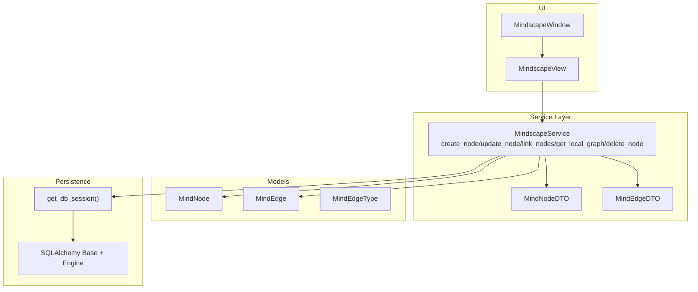
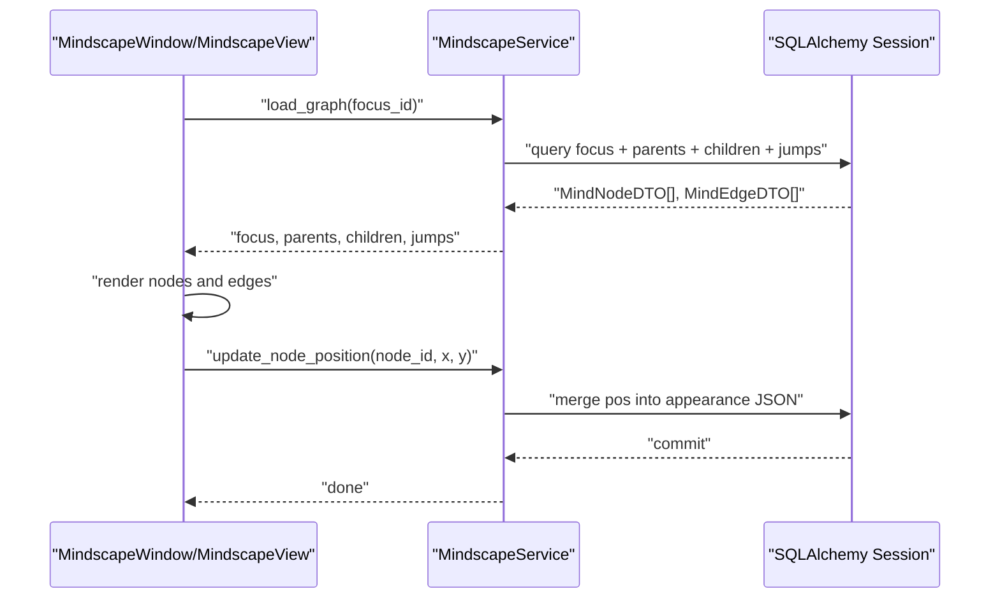
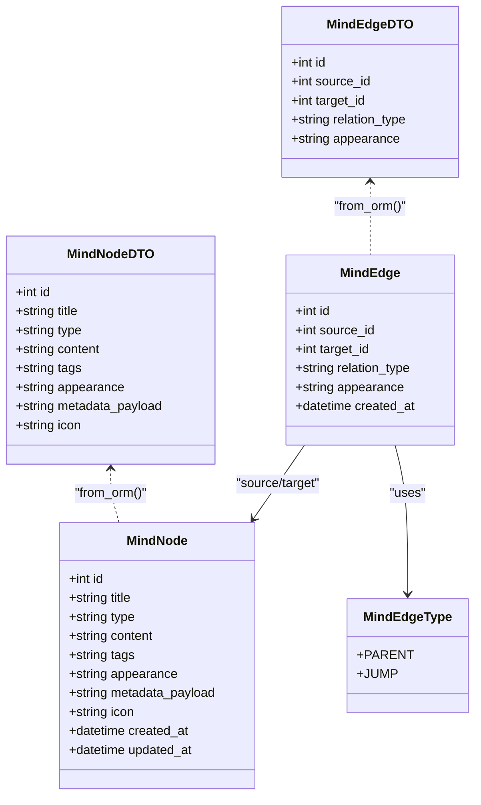
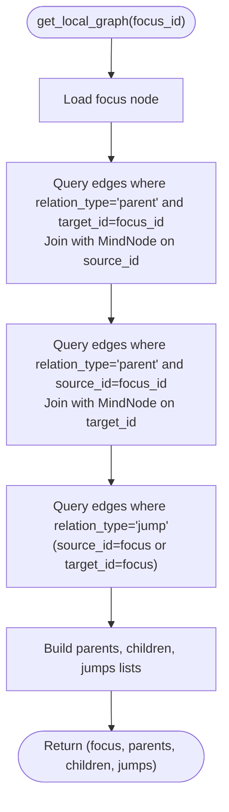
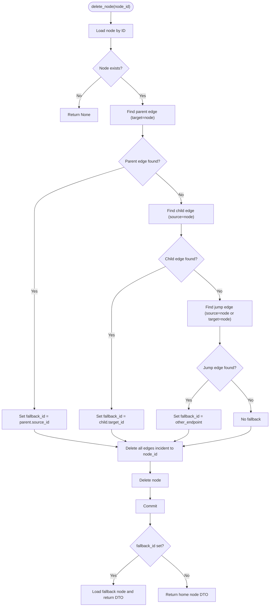
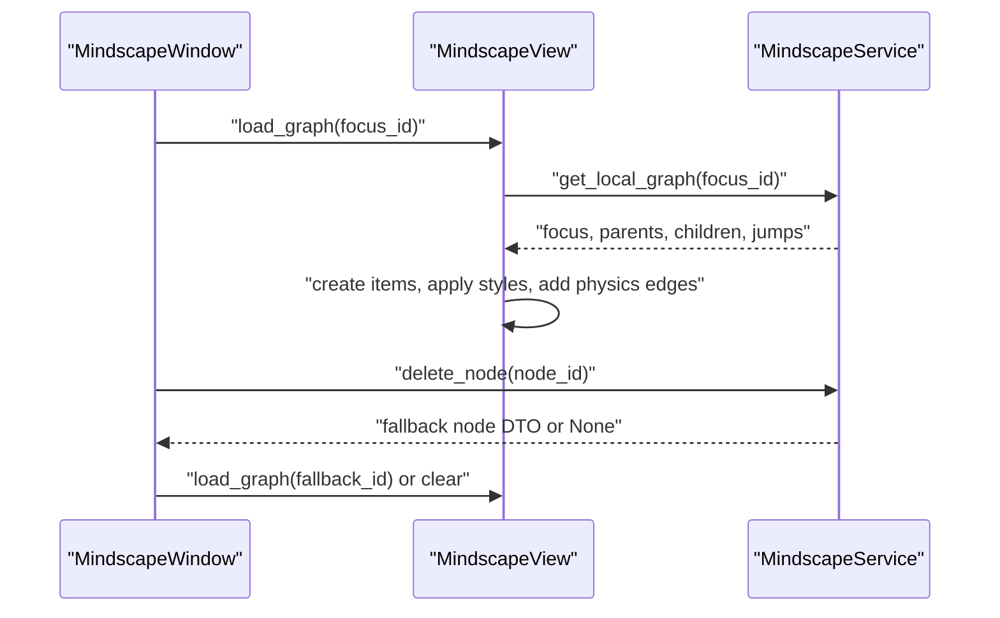
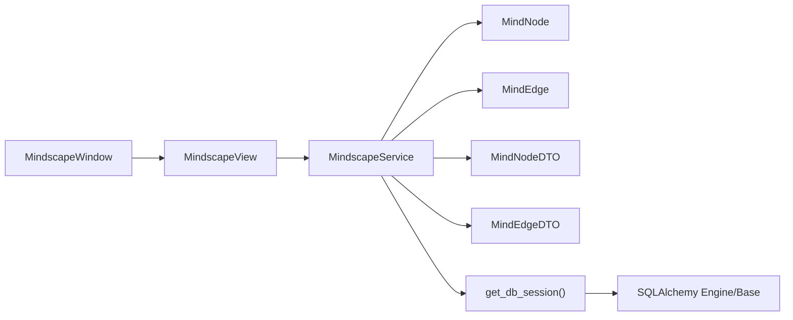

# Mindscape Service API

<cite>
**Referenced Files in This Document**
- [mindscape_service.py](file://src/pillars/document_manager/services/mindscape_service.py)
- [mindscape.py](file://src/pillars/document_manager/models/mindscape.py)
- [database.py](file://src/shared/database.py)
- [mindscape_view.py](file://src/pillars/document_manager/ui/mindscape_view.py)
- [mindscape_window.py](file://src/pillars/document_manager/ui/mindscape_window.py)
- [verify_mindscape_service.py](file://tests/verify_mindscape_service.py)
- [test_graph_persistence.py](file://test/test_graph_persistence.py)
- [test_search_panel.py](file://test/test_search_panel.py)
- [test_wipe.py](file://test/test_wipe.py)
- [wipe_mindscape.py](file://scripts/wipe_mindscape.py)
</cite>

## Table of Contents
1. [Introduction](#introduction)
2. [Project Structure](#project-structure)
3. [Core Components](#core-components)
4. [Architecture Overview](#architecture-overview)
5. [Detailed Component Analysis](#detailed-component-analysis)
6. [Dependency Analysis](#dependency-analysis)
7. [Performance Considerations](#performance-considerations)
8. [Troubleshooting Guide](#troubleshooting-guide)
9. [Conclusion](#conclusion)
10. [Appendices](#appendices)

## Introduction
This document describes the Mindscape Service API that powers the graph-based knowledge representation system. It focuses on the MindscapeService class and its methods for creating and updating nodes, linking nodes with different relation types, traversing the graph locally around a focus node, and deleting nodes with a robust fallback strategy. It also documents the MindNodeDTO and MindEdgeDTO data transfer objects, the underlying SQLAlchemy models, and how the UI integrates with the service for rendering and interaction.

## Project Structure
The Mindscape Service resides in the document manager pillar and interacts with shared database utilities and the UI layer.

**Diagram sources**
- [mindscape_service.py](file://src/pillars/document_manager/services/mindscape_service.py#L61-L304)
- [mindscape.py](file://src/pillars/document_manager/models/mindscape.py#L11-L52)
- [database.py](file://src/shared/database.py#L1-L53)
- [mindscape_view.py](file://src/pillars/document_manager/ui/mindscape_view.py#L50-L167)
- [mindscape_window.py](file://src/pillars/document_manager/ui/mindscape_window.py#L1-L200)

**Section sources**
- [mindscape_service.py](file://src/pillars/document_manager/services/mindscape_service.py#L61-L304)
- [mindscape.py](file://src/pillars/document_manager/models/mindscape.py#L11-L52)
- [database.py](file://src/shared/database.py#L1-L53)
- [mindscape_view.py](file://src/pillars/document_manager/ui/mindscape_view.py#L50-L167)
- [mindscape_window.py](file://src/pillars/document_manager/ui/mindscape_window.py#L1-L200)

## Core Components
- MindscapeService: Orchestrates graph operations, persistence, and traversal.
- DTOs: MindNodeDTO and MindEdgeDTO encapsulate node and edge data for transport.
- Models: MindNode, MindEdge, MindEdgeType define the graph schema.
- Persistence: SQLAlchemy session management via get_db_session().
- UI Integration: MindscapeView and MindscapeWindow coordinate rendering and user actions.

**Section sources**
- [mindscape_service.py](file://src/pillars/document_manager/services/mindscape_service.py#L61-L304)
- [mindscape.py](file://src/pillars/document_manager/models/mindscape.py#L11-L52)
- [database.py](file://src/shared/database.py#L1-L53)
- [mindscape_view.py](file://src/pillars/document_manager/ui/mindscape_view.py#L50-L167)
- [mindscape_window.py](file://src/pillars/document_manager/ui/mindscape_window.py#L1-L200)

## Architecture Overview
The service uses a transactional context to manage database sessions and exposes CRUD-like operations for nodes and edges, plus traversal logic for local neighborhoods. The UI loads the graph around a focus node, renders nodes and edges, and updates positions back to the database.

**Diagram sources**
- [mindscape_view.py](file://src/pillars/document_manager/ui/mindscape_view.py#L50-L167)
- [mindscape_service.py](file://src/pillars/document_manager/services/mindscape_service.py#L61-L121)

## Detailed Component Analysis

### Data Models and DTOs
- MindNode: Stores node identity, type, content, tags, appearance, metadata payload, and timestamps.
- MindEdge: Stores source and target node IDs, relation type, and edge appearance.
- MindEdgeType: Enumerates relation types: parent and jump.
- MindNodeDTO: Transport object for node data (id, title, type, content, tags, appearance, metadata_payload, icon).
- MindEdgeDTO: Transport object for edge data (id, source_id, target_id, relation_type, appearance).

**Diagram sources**
- [mindscape.py](file://src/pillars/document_manager/models/mindscape.py#L11-L52)
- [mindscape_service.py](file://src/pillars/document_manager/services/mindscape_service.py#L15-L60)

**Section sources**
- [mindscape.py](file://src/pillars/document_manager/models/mindscape.py#L11-L52)
- [mindscape_service.py](file://src/pillars/document_manager/services/mindscape_service.py#L15-L60)

### API Methods

#### create_node
- Purpose: Create a new node with customizable appearance and metadata.
- Parameters:
  - title: string
  - type: string (default "concept")
  - content: string (optional)
  - tags: list (optional)
  - appearance: dict (optional)
  - metadata_payload: dict (optional)
  - icon: string (optional)
- Behavior:
  - Serializes tags, appearance, and metadata_payload to JSON.
  - Adds and commits the node, then refreshes it.
  - Returns a MindNodeDTO.
- Notes:
  - Tags default to an empty JSON list.
  - Appearance and metadata_payload default to null JSON when not provided.

**Section sources**
- [mindscape_service.py](file://src/pillars/document_manager/services/mindscape_service.py#L65-L80)

#### update_node
- Purpose: Update node properties (title, content, tags, appearance, metadata_payload).
- Parameters:
  - node_id: int
  - data: dict containing any subset of the above fields
- Behavior:
  - Loads node by ID.
  - Updates provided fields, serializing lists/dicts to JSON where applicable.
  - Commits and refreshes the node.
  - Returns a MindNodeDTO.

**Section sources**
- [mindscape_service.py](file://src/pillars/document_manager/services/mindscape_service.py#L81-L101)

#### update_node_style
- Purpose: Update only the appearance JSON of a node.
- Parameters:
  - node_id: int
  - appearance: dict
- Behavior:
  - Loads node by ID.
  - Serializes appearance to JSON and commits.

**Section sources**
- [mindscape_service.py](file://src/pillars/document_manager/services/mindscape_service.py#L103-L108)

#### update_node_position
- Purpose: Update the position stored inside the node’s appearance JSON.
- Parameters:
  - node_id: int
  - x: float
  - y: float
- Behavior:
  - Loads node by ID.
  - Parses appearance JSON (defaults to empty dict if invalid).
  - Sets "pos" to rounded coordinates and re-serializes.
  - Commits.

**Section sources**
- [mindscape_service.py](file://src/pillars/document_manager/services/mindscape_service.py#L109-L121)

#### link_nodes
- Purpose: Establish a relationship between two nodes.
- Parameters:
  - source_id: int
  - target_id: int
  - relation_type: string ("parent" or "jump")
- Behavior:
  - Creates a MindEdge with the given relation type.
  - Commits and refreshes the edge.
  - Returns the created edge.

**Section sources**
- [mindscape_service.py](file://src/pillars/document_manager/services/mindscape_service.py#L173-L183)

#### get_local_graph
- Purpose: Retrieve the contextual graph neighborhood centered on a focus node.
- Parameters:
  - focus_id: int
- Returns:
  - focus_node: MindNodeDTO
  - parents: List[Tuple[MindNodeDTO, MindEdgeDTO]]
  - children: List[Tuple[MindNodeDTO, MindEdgeDTO]]
  - jumps: List[Tuple[MindNodeDTO, MindEdgeDTO]]
- Traversal logic:
  - Parents: Edges where relation_type is parent and target_id equals focus_id; join with MindNode to get source node.
  - Children: Edges where relation_type is parent and source_id equals focus_id; join with MindNode to get target node.
  - Jumps: Edges where relation_type is jump and either source_id or target_id equals focus_id; resolve the other node.

**Diagram sources**
- [mindscape_service.py](file://src/pillars/document_manager/services/mindscape_service.py#L185-L242)

**Section sources**
- [mindscape_service.py](file://src/pillars/document_manager/services/mindscape_service.py#L185-L242)

#### delete_node
- Purpose: Delete a node and its incident edges, then suggest a fallback focus node.
- Parameters:
  - node_id: int
- Fallback strategy (in order):
  - Parent: If there is a parent edge pointing to the deleted node, use the parent’s source node.
  - Child: If there is a child edge originating from the deleted node, use the child’s target node.
  - Jump: If there is a jump edge connected to the deleted node, use the other endpoint.
  - Root: Otherwise, return the home node (earliest node by ID).
- Behavior:
  - Determines fallback before deletion.
  - Deletes all edges incident to the node.
  - Deletes the node.
  - Commits.
  - Returns the fallback node DTO if found; otherwise returns the home node DTO.

**Diagram sources**
- [mindscape_service.py](file://src/pillars/document_manager/services/mindscape_service.py#L244-L296)

**Section sources**
- [mindscape_service.py](file://src/pillars/document_manager/services/mindscape_service.py#L244-L296)

#### Additional Utilities
- get_home_node: Returns the earliest node by ID or None if empty.
- wipe_database: Deletes all edges then all nodes (nuclear option).
- update_edge_style: Updates edge appearance JSON.
- update_edge: Updates edge relation_type and/or appearance.
- get_edge: Retrieves a single edge DTO by ID.
- find_node_by_document_id: Searches for a document node by document_id embedded in metadata_payload.

**Section sources**
- [mindscape_service.py](file://src/pillars/document_manager/services/mindscape_service.py#L122-L172)
- [mindscape_service.py](file://src/pillars/document_manager/services/mindscape_service.py#L297-L304)

### UI Integration and Rendering
- MindscapeView:
  - Loads the local graph for a focus node.
  - Renders nodes and edges, applying appearance JSON styles.
  - Initializes physics simulation and allows interactive dragging.
- MindscapeWindow:
  - Provides context menus for adding parent, child, or jump links.
  - Handles node deletion and refocuses to a fallback node if available.

**Diagram sources**
- [mindscape_view.py](file://src/pillars/document_manager/ui/mindscape_view.py#L50-L167)
- [mindscape_window.py](file://src/pillars/document_manager/ui/mindscape_window.py#L577-L621)
- [mindscape_service.py](file://src/pillars/document_manager/services/mindscape_service.py#L244-L296)

**Section sources**
- [mindscape_view.py](file://src/pillars/document_manager/ui/mindscape_view.py#L50-L167)
- [mindscape_window.py](file://src/pillars/document_manager/ui/mindscape_window.py#L480-L527)
- [mindscape_window.py](file://src/pillars/document_manager/ui/mindscape_window.py#L577-L621)

## Dependency Analysis
- MindscapeService depends on SQLAlchemy Session and the Mindscape models.
- DTOs are thin wrappers around ORM objects for safe transport.
- UI components depend on the service for data and on the database for persistence.

**Diagram sources**
- [mindscape_service.py](file://src/pillars/document_manager/services/mindscape_service.py#L61-L304)
- [mindscape.py](file://src/pillars/document_manager/models/mindscape.py#L11-L52)
- [database.py](file://src/shared/database.py#L1-L53)
- [mindscape_view.py](file://src/pillars/document_manager/ui/mindscape_view.py#L50-L167)
- [mindscape_window.py](file://src/pillars/document_manager/ui/mindscape_window.py#L1-L200)

**Section sources**
- [mindscape_service.py](file://src/pillars/document_manager/services/mindscape_service.py#L61-L304)
- [mindscape.py](file://src/pillars/document_manager/models/mindscape.py#L11-L52)
- [database.py](file://src/shared/database.py#L1-L53)
- [mindscape_view.py](file://src/pillars/document_manager/ui/mindscape_view.py#L50-L167)
- [mindscape_window.py](file://src/pillars/document_manager/ui/mindscape_window.py#L1-L200)

## Performance Considerations
- Queries:
  - get_local_graph performs joins and filters for parents, children, and jumps. These are straightforward but can grow with graph size.
  - find_node_by_document_id uses a LIKE pattern on metadata_payload; this is not indexed and may be slow on large graphs.
- Serialization:
  - JSON serialization of appearance and metadata occurs on write/update operations. Keep these dicts small to reduce storage overhead.
- Position updates:
  - update_node_position parses and writes appearance JSON on every move; consider batching updates in the UI if frequent dragging occurs.
- Recommendations:
  - Add indexes on MindEdge(source_id), MindEdge(target_id), MindEdge(relation_type) and MindNode(type) for improved traversal performance.
  - Consider caching frequently accessed nodes or edges in memory for hot paths.
  - For large graphs, avoid frequent full rebuilds of the view; reuse existing items and only add/remove as needed.

[No sources needed since this section provides general guidance]

## Troubleshooting Guide
- Node not found:
  - Operations that accept node_id will return None or fail gracefully if the node does not exist. Verify IDs and existence before invoking operations.
- JSON parsing errors:
  - update_node_position attempts to parse appearance JSON; malformed JSON will fall back to an empty dict. Ensure appearance is valid JSON.
- Deletion and refocus:
  - delete_node determines fallback in a strict order (parent > child > jump > root). If the graph is disconnected, it may return the home node. Confirm graph connectivity if refocus is unexpected.
- Persistence:
  - Tests demonstrate successful persistence of position and metadata payloads. If persistence fails, verify database initialization and session lifecycle.

**Section sources**
- [mindscape_service.py](file://src/pillars/document_manager/services/mindscape_service.py#L109-L121)
- [mindscape_service.py](file://src/pillars/document_manager/services/mindscape_service.py#L244-L296)
- [test_graph_persistence.py](file://test/test_graph_persistence.py#L2-L27)
- [test_search_panel.py](file://test/test_search_panel.py#L2-L42)

## Conclusion
The Mindscape Service provides a focused API for building and navigating a graph-based knowledge system. It supports creating nodes with rich metadata, linking them with parent and jump relations, traversing local neighborhoods, and deleting nodes with a thoughtful fallback strategy. The UI integrates tightly with the service to render and interact with the graph, while the underlying SQLAlchemy models and JSON-serialized fields enable flexible styling and metadata.

[No sources needed since this section summarizes without analyzing specific files]

## Appendices

### API Reference Summary

- create_node(title, type="concept", content=None, tags=None, appearance=None, metadata_payload=None, icon=None) -> MindNodeDTO
- update_node(node_id, data) -> MindNodeDTO
- update_node_style(node_id, appearance)
- update_node_position(node_id, x, y)
- link_nodes(source_id, target_id, relation_type="parent") -> MindEdge
- get_local_graph(focus_id) -> (MindNodeDTO, List[Tuple], List[Tuple], List[Tuple])
- delete_node(node_id) -> Optional[MindNodeDTO]
- get_home_node() -> Optional[MindNodeDTO]
- update_edge_style(edge_id, appearance)
- update_edge(edge_id, data) -> MindEdgeDTO
- get_edge(edge_id) -> MindEdgeDTO
- find_node_by_document_id(doc_id) -> Optional[MindNodeDTO]
- wipe_database()

**Section sources**
- [mindscape_service.py](file://src/pillars/document_manager/services/mindscape_service.py#L65-L183)
- [mindscape_service.py](file://src/pillars/document_manager/services/mindscape_service.py#L185-L304)

### Example Workflows

- Creating a concept node:
  - Call create_node with title and optional type/content/tags/appearance/metadata_payload/icon.
  - Persisted as a MindNode with serialized JSON fields.

- Linking a parent-child relationship:
  - Create a child node.
  - Call link_nodes(parent_id, child_id, "parent").
  - The child is reachable from the parent in get_local_graph under children.

- Retrieving a local knowledge graph:
  - Call get_local_graph(focus_id).
  - Use focus, parents, children, and jumps to render the view.

- Implementing a graph-based navigation workflow:
  - On node selection, load the local graph centered on the selected node.
  - Allow users to add parent/child/jump links via context menus.
  - On deletion, use delete_node to remove the node and refocus to a fallback.

**Section sources**
- [verify_mindscape_service.py](file://tests/verify_mindscape_service.py#L10-L46)
- [mindscape_view.py](file://src/pillars/document_manager/ui/mindscape_view.py#L50-L167)
- [mindscape_window.py](file://src/pillars/document_manager/ui/mindscape_window.py#L480-L527)
- [mindscape_window.py](file://src/pillars/document_manager/ui/mindscape_window.py#L577-L621)

### Data Persistence and JSON Serialization
- SQLAlchemy session management:
  - get_db_session() provides a context-managed session.
  - mindscape_service_context() yields a MindscapeService bound to a session.
- JSON fields:
  - tags, appearance, and metadata_payload are stored as JSON strings in the database.
  - Tests confirm persistence and retrieval of position and metadata payloads.

**Section sources**
- [database.py](file://src/shared/database.py#L1-L53)
- [mindscape_service.py](file://src/pillars/document_manager/services/mindscape_service.py#L65-L121)
- [test_graph_persistence.py](file://test/test_graph_persistence.py#L2-L27)
- [test_search_panel.py](file://test/test_search_panel.py#L2-L42)

### Cleanup and Wiping
- wipe_database() deletes all edges then all nodes.
- Scripts and tests demonstrate wiping functionality.

**Section sources**
- [mindscape_service.py](file://src/pillars/document_manager/services/mindscape_service.py#L122-L129)
- [test_wipe.py](file://test/test_wipe.py#L2-L24)
- [wipe_mindscape.py](file://scripts/wipe_mindscape.py#L1-L21)