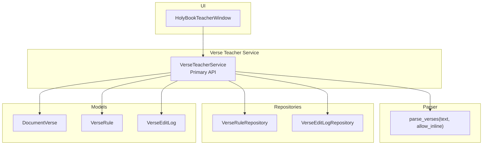
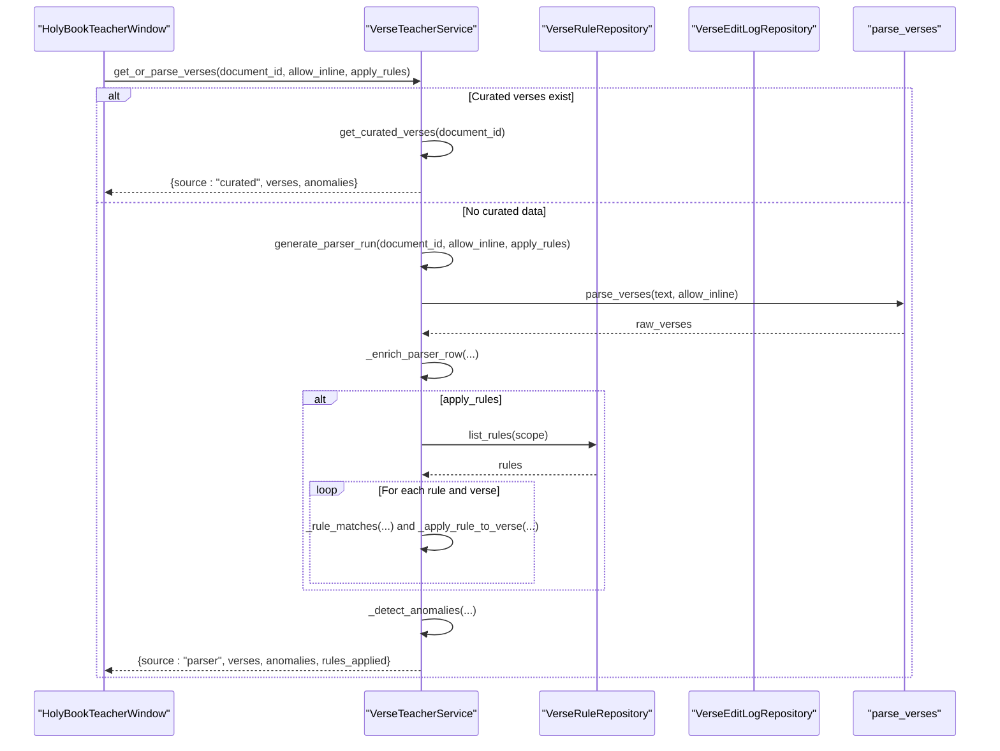
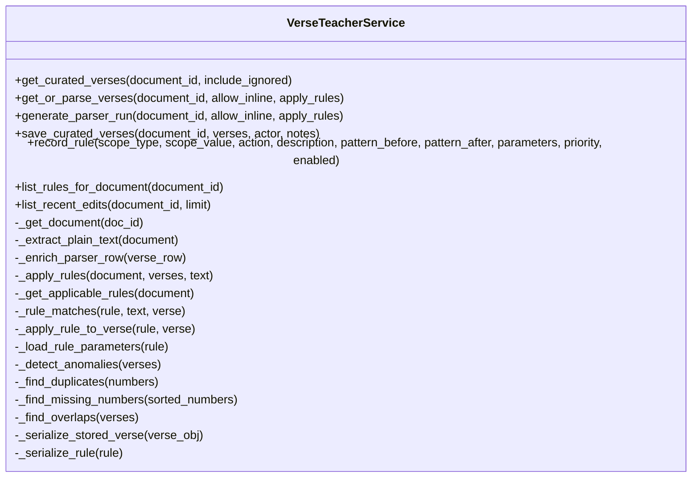
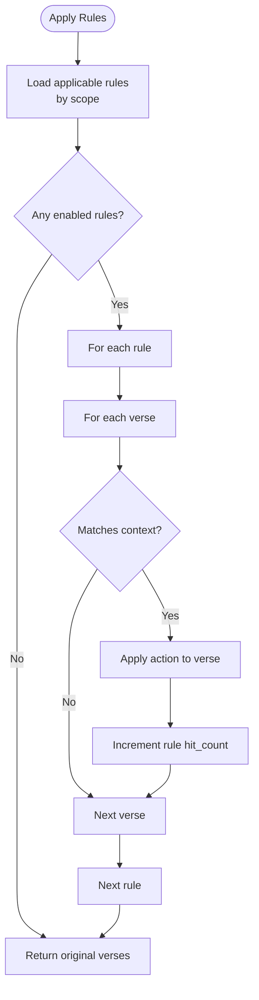
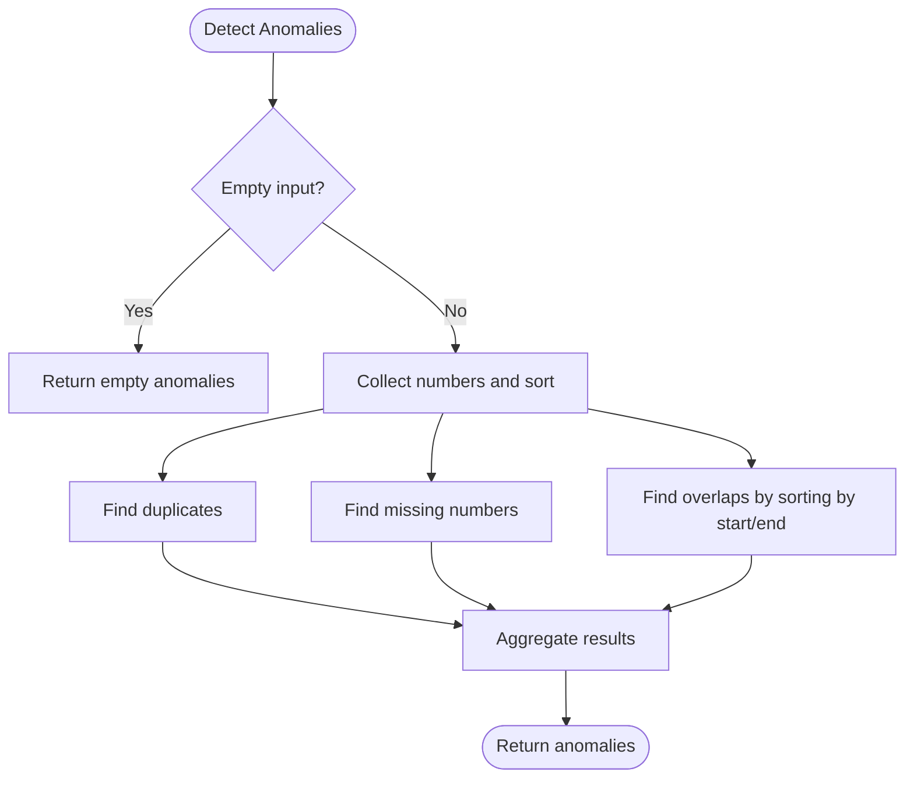
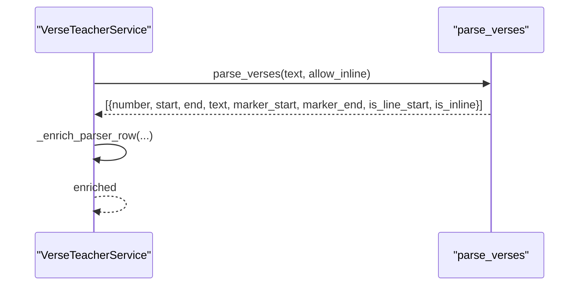
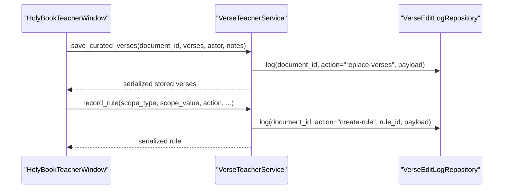
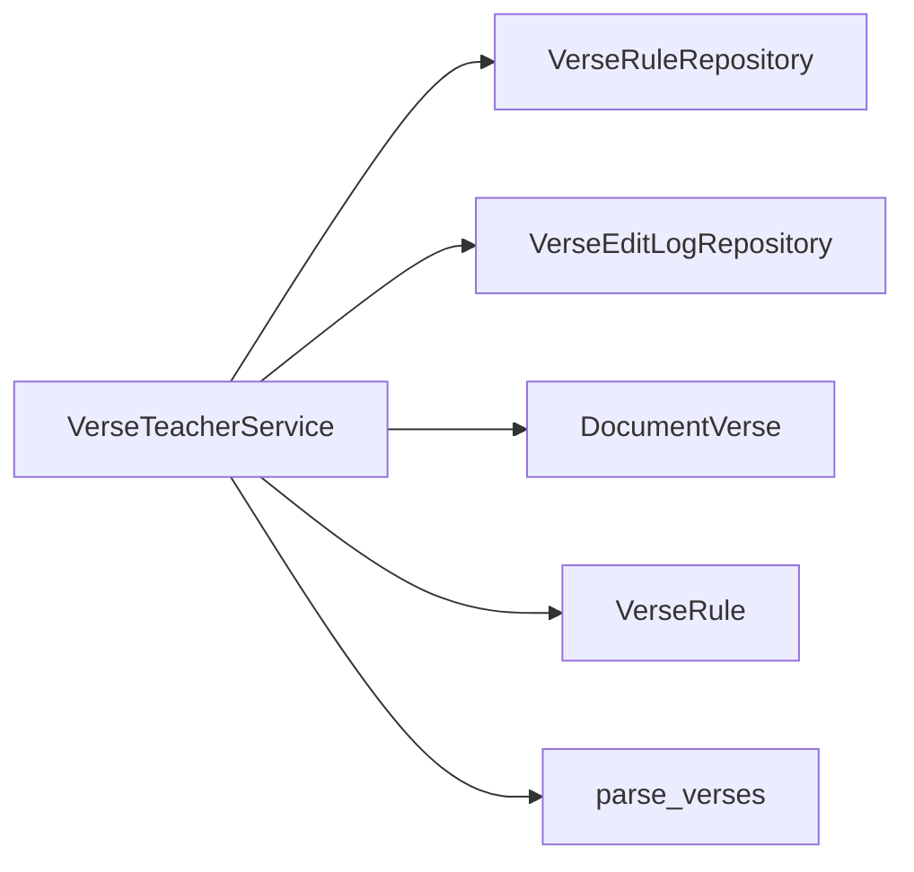

# Verse Teacher Service API

<cite>
**Referenced Files in This Document**
- [verse_teacher_service.py](file://src/pillars/document_manager/services/verse_teacher_service.py)
- [verse_parser.py](file://src/pillars/gematria/utils/verse_parser.py)
- [verse_rule_repository.py](file://src/pillars/document_manager/repositories/verse_rule_repository.py)
- [verse_edit_log_repository.py](file://src/pillars/document_manager/repositories/verse_edit_log_repository.py)
- [document_verse.py](file://src/pillars/document_manager/models/document_verse.py)
- [holy_book_teacher_window.py](file://src/pillars/gematria/ui/holy_book_teacher_window.py)
- [HOLY_BOOK_TEACHER_HELP.md](file://Docs/HOLY_BOOK_TEACHER_HELP.md)
</cite>

## Table of Contents
1. [Introduction](#introduction)
2. [Project Structure](#project-structure)
3. [Core Components](#core-components)
4. [Architecture Overview](#architecture-overview)
5. [Detailed Component Analysis](#detailed-component-analysis)
6. [Dependency Analysis](#dependency-analysis)
7. [Performance Considerations](#performance-considerations)
8. [Troubleshooting Guide](#troubleshooting-guide)
9. [Conclusion](#conclusion)
10. [Appendices](#appendices)

## Introduction
This document describes the Verse Teacher Service API that powers the Holy Book teacher functionality. It focuses on:
- Retrieving curated verse divisions
- Executing the primary entry point that returns curated data or parser results
- Running the verse parsing pipeline with rule application
- Persisting curated data with edit logging
- Creating transformation rules with different scopes and actions
- Listing rules for a document
- The rule application engine and anomaly detection
- Confidence scoring
- Integration with the verse parser utility and the edit logging system

The documentation is structured to be accessible to both developers and users who want to understand how to parse, curate, and manage verse divisions for “Holy Book” documents.

## Project Structure
The Verse Teacher Service lives in the document manager pillar and integrates with:
- The verse parser utility
- Repositories for rules and edit logs
- The UI teacher window for interactive curation

**Diagram sources**
- [verse_teacher_service.py](file://src/pillars/document_manager/services/verse_teacher_service.py#L1-L352)
- [verse_parser.py](file://src/pillars/gematria/utils/verse_parser.py#L1-L107)
- [verse_rule_repository.py](file://src/pillars/document_manager/repositories/verse_rule_repository.py#L1-L62)
- [verse_edit_log_repository.py](file://src/pillars/document_manager/repositories/verse_edit_log_repository.py#L1-L45)
- [document_verse.py](file://src/pillars/document_manager/models/document_verse.py#L1-L104)
- [holy_book_teacher_window.py](file://src/pillars/gematria/ui/holy_book_teacher_window.py#L1-L788)

**Section sources**
- [verse_teacher_service.py](file://src/pillars/document_manager/services/verse_teacher_service.py#L1-L352)
- [verse_parser.py](file://src/pillars/gematria/utils/verse_parser.py#L1-L107)
- [verse_rule_repository.py](file://src/pillars/document_manager/repositories/verse_rule_repository.py#L1-L62)
- [verse_edit_log_repository.py](file://src/pillars/document_manager/repositories/verse_edit_log_repository.py#L1-L45)
- [document_verse.py](file://src/pillars/document_manager/models/document_verse.py#L1-L104)
- [holy_book_teacher_window.py](file://src/pillars/gematria/ui/holy_book_teacher_window.py#L1-L788)

## Core Components
- VerseTeacherService: Orchestrates curated retrieval, parser runs, rule application, anomaly detection, and persistence.
- VerseRuleRepository: CRUD and listing of rules with priority ordering and hit counting.
- VerseEditLogRepository: Audit logging for edits and rule creation.
- DocumentVerse and VerseRule models: Data structures persisted to the database.
- HolyBookTeacherWindow: UI that drives the service and enables curation.

Key responsibilities:
- get_curated_verses: Load stored, curated verses for a document.
- get_or_parse_verses: Prefer curated data; otherwise run the parser and apply rules.
- generate_parser_run: Execute the parser, enrich results, optionally apply rules, detect anomalies.
- save_curated_verses: Persist curated data and log the action.
- record_rule: Create rules with scope and action; log creation.
- list_rules_for_document: Retrieve applicable rules for a document.
- Anomaly detection: Duplicate numbers, missing numbers, overlaps.
- Confidence scoring: Assign confidence based on line-start vs inline markers.

**Section sources**
- [verse_teacher_service.py](file://src/pillars/document_manager/services/verse_teacher_service.py#L33-L147)
- [verse_rule_repository.py](file://src/pillars/document_manager/repositories/verse_rule_repository.py#L1-L62)
- [verse_edit_log_repository.py](file://src/pillars/document_manager/repositories/verse_edit_log_repository.py#L1-L45)
- [document_verse.py](file://src/pillars/document_manager/models/document_verse.py#L1-L104)
- [holy_book_teacher_window.py](file://src/pillars/gematria/ui/holy_book_teacher_window.py#L1-L788)

## Architecture Overview
The service coordinates between the parser, rule engine, and persistence layers. The UI invokes service methods to load, edit, and save curated data.

**Diagram sources**
- [verse_teacher_service.py](file://src/pillars/document_manager/services/verse_teacher_service.py#L37-L113)
- [verse_rule_repository.py](file://src/pillars/document_manager/repositories/verse_rule_repository.py#L20-L33)
- [verse_parser.py](file://src/pillars/gematria/utils/verse_parser.py#L6-L107)
- [holy_book_teacher_window.py](file://src/pillars/gematria/ui/holy_book_teacher_window.py#L185-L214)

## Detailed Component Analysis

### VerseTeacherService API
Public methods:
- get_curated_verses(document_id, include_ignored=True) -> List[Dict]
- get_or_parse_verses(document_id, allow_inline=True, apply_rules=True) -> Dict
- generate_parser_run(document_id, allow_inline=True, apply_rules=True) -> Dict
- save_curated_verses(document_id, verses, actor="system", notes=None) -> List[Dict]
- record_rule(scope_type, scope_value, action, description="", pattern_before=None, pattern_after=None, parameters=None, priority=0, enabled=True) -> Dict
- list_rules_for_document(document_id) -> List[Dict]
- list_recent_edits(document_id, limit=50)

Internal helpers:
- _get_document(doc_id)
- _extract_plain_text(document)
- _enrich_parser_row(verse_row)
- _apply_rules(document, verses, text) -> Tuple[List[Dict], List[Dict]]
- _get_applicable_rules(document)
- _rule_matches(rule, text, verse) -> bool
- _apply_rule_to_verse(rule, verse)
- _load_rule_parameters(rule) -> Dict
- _detect_anomalies(verses) -> Dict
- _find_duplicates(numbers) -> List[int]
- _find_missing_numbers(sorted_numbers) -> List[int]
- _find_overlaps(verses) -> List[Dict]
- _serialize_stored_verse(verse_obj) -> Dict
- _serialize_rule(rule) -> Dict

**Diagram sources**
- [verse_teacher_service.py](file://src/pillars/document_manager/services/verse_teacher_service.py#L33-L345)

**Section sources**
- [verse_teacher_service.py](file://src/pillars/document_manager/services/verse_teacher_service.py#L33-L345)

### Rule Application Engine
The rule engine applies transformations based on surrounding text context:
- Scopes: document, collection, global
- Patterns: before/after regex around the marker
- Actions: suppress, promote, renumber, note
- Priority: higher priority rules are applied first
- Hit counting: tracks how often a rule matched

**Diagram sources**
- [verse_teacher_service.py](file://src/pillars/document_manager/services/verse_teacher_service.py#L186-L212)
- [verse_rule_repository.py](file://src/pillars/document_manager/repositories/verse_rule_repository.py#L20-L33)

**Section sources**
- [verse_teacher_service.py](file://src/pillars/document_manager/services/verse_teacher_service.py#L186-L254)
- [verse_rule_repository.py](file://src/pillars/document_manager/repositories/verse_rule_repository.py#L20-L61)

### Anomaly Detection
The system detects:
- Duplicate numbers
- Missing numbers in sequence
- Overlapping ranges

**Diagram sources**
- [verse_teacher_service.py](file://src/pillars/document_manager/services/verse_teacher_service.py#L263-L311)

**Section sources**
- [verse_teacher_service.py](file://src/pillars/document_manager/services/verse_teacher_service.py#L263-L311)

### Confidence Scoring
Confidence is assigned during enrichment:
- Line-start markers receive higher confidence
- Inline markers receive lower confidence

**Section sources**
- [verse_teacher_service.py](file://src/pillars/document_manager/services/verse_teacher_service.py#L165-L184)

### Integration with the Verse Parser Utility
The parser extracts numbered verses from plain text:
- Recognizes markers at line start or optionally inline
- Applies heuristics to accept inline markers when appropriate
- Produces start/end spans and marker spans

**Diagram sources**
- [verse_teacher_service.py](file://src/pillars/document_manager/services/verse_teacher_service.py#L60-L68)
- [verse_parser.py](file://src/pillars/gematria/utils/verse_parser.py#L6-L107)

**Section sources**
- [verse_parser.py](file://src/pillars/gematria/utils/verse_parser.py#L6-L107)
- [verse_teacher_service.py](file://src/pillars/document_manager/services/verse_teacher_service.py#L60-L68)

### Edit Logging and Audit Trail
Saving curated verses and rule creation are logged:
- save_curated_verses logs replace-verses
- record_rule logs create-rule with scope and action
- list_recent_edits retrieves recent actions

**Diagram sources**
- [verse_teacher_service.py](file://src/pillars/document_manager/services/verse_teacher_service.py#L78-L138)
- [verse_edit_log_repository.py](file://src/pillars/document_manager/repositories/verse_edit_log_repository.py#L15-L35)
- [holy_book_teacher_window.py](file://src/pillars/gematria/ui/holy_book_teacher_window.py#L276-L295)

**Section sources**
- [verse_teacher_service.py](file://src/pillars/document_manager/services/verse_teacher_service.py#L78-L138)
- [verse_edit_log_repository.py](file://src/pillars/document_manager/repositories/verse_edit_log_repository.py#L15-L45)
- [holy_book_teacher_window.py](file://src/pillars/gematria/ui/holy_book_teacher_window.py#L276-L295)

## Dependency Analysis
- VerseTeacherService depends on:
  - VerseRuleRepository for rule CRUD and listing
  - VerseEditLogRepository for audit logging
  - DocumentVerse and VerseRule models for serialization and persistence
  - parse_verses from the parser utility

**Diagram sources**
- [verse_teacher_service.py](file://src/pillars/document_manager/services/verse_teacher_service.py#L11-L29)
- [verse_rule_repository.py](file://src/pillars/document_manager/repositories/verse_rule_repository.py#L1-L62)
- [verse_edit_log_repository.py](file://src/pillars/document_manager/repositories/verse_edit_log_repository.py#L1-L45)
- [document_verse.py](file://src/pillars/document_manager/models/document_verse.py#L1-L104)
- [verse_parser.py](file://src/pillars/gematria/utils/verse_parser.py#L1-L107)

**Section sources**
- [verse_teacher_service.py](file://src/pillars/document_manager/services/verse_teacher_service.py#L11-L29)
- [verse_rule_repository.py](file://src/pillars/document_manager/repositories/verse_rule_repository.py#L1-L62)
- [verse_edit_log_repository.py](file://src/pillars/document_manager/repositories/verse_edit_log_repository.py#L1-L45)
- [document_verse.py](file://src/pillars/document_manager/models/document_verse.py#L1-L104)
- [verse_parser.py](file://src/pillars/gematria/utils/verse_parser.py#L1-L107)

## Performance Considerations
- Rule application loops over rules and verses; keep rule sets minimal and scoped appropriately.
- Anomaly detection sorts and scans arrays; keep input lists reasonable in size.
- Regex matching for rule patterns is bounded by context windows around markers.
- Consider caching or memoizing repeated rule evaluations if performance becomes a bottleneck.

[No sources needed since this section provides general guidance]

## Troubleshooting Guide
Common issues and resolutions:
- No curated data shown: Ensure the document has curated verses saved; otherwise the parser will run.
- Off-by-a-few characters: Use the UI’s “Jump to Document” and “Set Start/End from Editor Selection” to refine offsets.
- Rule not applied: Verify scope type and that patterns match the context before/after the marker.
- Inline markers causing false positives: Use “Ignore Verse” or create a rule with suppress action and appropriate patterns.
- Saving curated data fails: Check database connectivity and permissions; verify the payload is non-empty.

**Section sources**
- [holy_book_teacher_window.py](file://src/pillars/gematria/ui/holy_book_teacher_window.py#L542-L566)
- [HOLY_BOOK_TEACHER_HELP.md](file://Docs/HOLY_BOOK_TEACHER_HELP.md#L74-L84)

## Conclusion
The Verse Teacher Service provides a robust pipeline for parsing, curating, and validating verse divisions. It integrates a flexible rule engine, anomaly detection, and audit logging to support reliable, repeatable curation workflows for “Holy Book” documents.

[No sources needed since this section summarizes without analyzing specific files]

## Appendices

### API Reference

- get_curated_verses(document_id, include_ignored=True) -> List[Dict]
  - Retrieves stored, curated verses for a document.
  - Returns a list of serialized verse objects.

- get_or_parse_verses(document_id, allow_inline=True, apply_rules=True) -> Dict
  - If curated data exists, returns it with anomalies and empty rules_applied.
  - Otherwise, runs the parser and applies rules, returning enriched verses and anomalies.

- generate_parser_run(document_id, allow_inline=True, apply_rules=True) -> Dict
  - Executes the parser, enriches results, optionally applies rules, and detects anomalies.
  - Returns a payload with source, verses, anomalies, and rules_applied.

- save_curated_verses(document_id, verses, actor="system", notes=None) -> List[Dict]
  - Persists curated verses and logs the replace-verses action.
  - Returns the stored, serialized verses.

- record_rule(scope_type, scope_value, action, description="", pattern_before=None, pattern_after=None, parameters=None, priority=0, enabled=True) -> Dict
  - Creates a rule with scope and action; logs create-rule.
  - Returns the serialized rule.

- list_rules_for_document(document_id) -> List[Dict]
  - Lists applicable rules for a document (document, collection, global).

- list_recent_edits(document_id, limit=50)
  - Lists recent audit log entries for a document.

**Section sources**
- [verse_teacher_service.py](file://src/pillars/document_manager/services/verse_teacher_service.py#L33-L147)
- [verse_rule_repository.py](file://src/pillars/document_manager/repositories/verse_rule_repository.py#L20-L33)
- [verse_edit_log_repository.py](file://src/pillars/document_manager/repositories/verse_edit_log_repository.py#L37-L45)

### Example Workflows

- Parsing biblical text
  - Use get_or_parse_verses with allow_inline toggled to test permissive parsing.
  - Inspect anomalies and adjust inline markers as needed.

- Creating a rule to suppress false positive verse detections
  - From the UI, right-click a problematic verse and choose “Create Rule From This.”
  - Provide before/after patterns and select action “suppress.”
  - Save and re-run to confirm suppression.

- Analyzing parsing anomalies
  - Review the “Parser Findings” panel for duplicates, missing numbers, and overlaps.
  - Adjust boundaries or create rules to resolve issues.

- Implementing a verse curation workflow
  - Run a fresh parser, edit in the UI (confirm, edit text, merge, split, renumber, ignore), then save curated verses.
  - Use Undo/Redo to experiment safely.

**Section sources**
- [holy_book_teacher_window.py](file://src/pillars/gematria/ui/holy_book_teacher_window.py#L276-L339)
- [HOLY_BOOK_TEACHER_HELP.md](file://Docs/HOLY_BOOK_TEACHER_HELP.md#L1-L84)