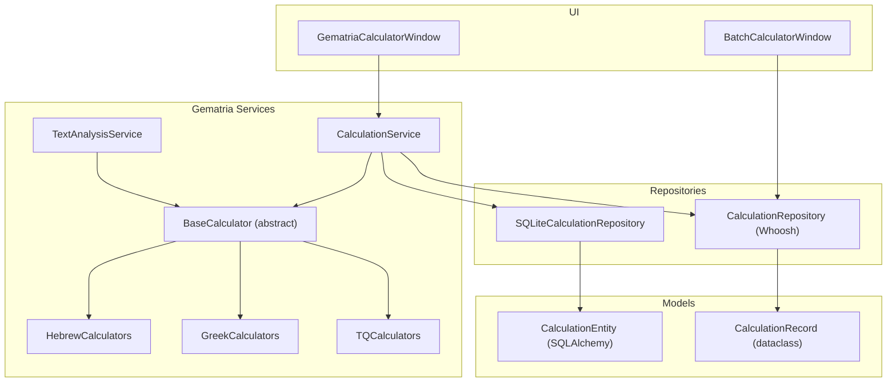
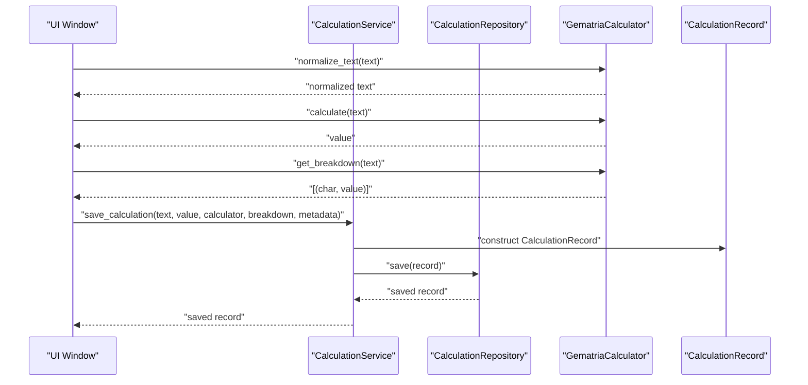
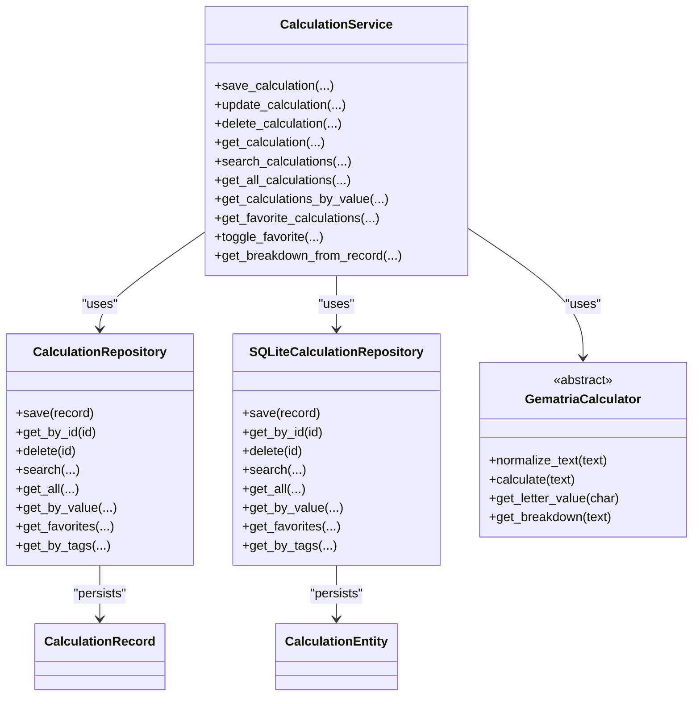

# Calculation Service

<cite>
**Referenced Files in This Document**
- [calculation_service.py](file://src/pillars/gematria/services/calculation_service.py)
- [base_calculator.py](file://src/pillars/gematria/services/base_calculator.py)
- [calculation_repository.py](file://src/pillars/gematria/repositories/calculation_repository.py)
- [sqlite_calculation_repository.py](file://src/pillars/gematria/repositories/sqlite_calculation_repository.py)
- [calculation_entity.py](file://src/pillars/gematria/models/calculation_entity.py)
- [calculation_record.py](file://src/pillars/gematria/models/calculation_record.py)
- [hebrew_calculator.py](file://src/pillars/gematria/services/hebrew_calculator.py)
- [greek_calculator.py](file://src/pillars/gematria/services/greek_calculator.py)
- [tq_calculator.py](file://src/pillars/gematria/services/tq_calculator.py)
- [gematria_calculator_window.py](file://src/pillars/gematria/ui/gematria_calculator_window.py)
- [batch_calculator_window.py](file://src/pillars/gematria/ui/batch_calculator_window.py)
- [text_analysis_service.py](file://src/pillars/gematria/services/text_analysis_service.py)
- [test_calculation_service.py](file://test/pillars/gematria/test_calculation_service.py)
</cite>

## Table of Contents
1. [Introduction](#introduction)
2. [Project Structure](#project-structure)
3. [Core Components](#core-components)
4. [Architecture Overview](#architecture-overview)
5. [Detailed Component Analysis](#detailed-component-analysis)
6. [Dependency Analysis](#dependency-analysis)
7. [Performance Considerations](#performance-considerations)
8. [Troubleshooting Guide](#troubleshooting-guide)
9. [Conclusion](#conclusion)
10. [Appendices](#appendices)

## Introduction
This document provides API documentation for the CalculationService class, the central orchestrator of the Gematria pillar. It explains how CalculationService coordinates calculation requests across Hebrew, Greek, and English/TQ systems, persists results, and integrates with UI components. It also covers thread-safe batch processing, error handling, and performance considerations for large-scale text processing.

## Project Structure
The Gematria pillar organizes calculation logic into services, calculators, repositories, and models. The CalculationService sits at the service layer, delegating persistence to repositories and leveraging calculators for value computation and breakdowns.

**Diagram sources**
- [calculation_service.py](file://src/pillars/gematria/services/calculation_service.py#L1-L273)
- [base_calculator.py](file://src/pillars/gematria/services/base_calculator.py#L1-L107)
- [calculation_repository.py](file://src/pillars/gematria/repositories/calculation_repository.py#L1-L329)
- [sqlite_calculation_repository.py](file://src/pillars/gematria/repositories/sqlite_calculation_repository.py#L1-L143)
- [calculation_entity.py](file://src/pillars/gematria/models/calculation_entity.py#L1-L92)
- [calculation_record.py](file://src/pillars/gematria/models/calculation_record.py#L1-L89)
- [gematria_calculator_window.py](file://src/pillars/gematria/ui/gematria_calculator_window.py#L1-L500)
- [batch_calculator_window.py](file://src/pillars/gematria/ui/batch_calculator_window.py#L1-L619)
- [text_analysis_service.py](file://src/pillars/gematria/services/text_analysis_service.py#L1-L185)

**Section sources**
- [calculation_service.py](file://src/pillars/gematria/services/calculation_service.py#L1-L273)
- [calculation_repository.py](file://src/pillars/gematria/repositories/calculation_repository.py#L1-L329)
- [sqlite_calculation_repository.py](file://src/pillars/gematria/repositories/sqlite_calculation_repository.py#L1-L143)
- [calculation_entity.py](file://src/pillars/gematria/models/calculation_entity.py#L1-L92)
- [calculation_record.py](file://src/pillars/gematria/models/calculation_record.py#L1-L89)
- [gematria_calculator_window.py](file://src/pillars/gematria/ui/gematria_calculator_window.py#L1-L500)
- [batch_calculator_window.py](file://src/pillars/gematria/ui/batch_calculator_window.py#L1-L619)
- [text_analysis_service.py](file://src/pillars/gematria/services/text_analysis_service.py#L1-L185)

## Core Components
- CalculationService: Orchestrates saving, updating, deleting, retrieving, searching, and toggling favorites for gematria calculations. It serializes breakdowns and normalizes text via calculators.
- BaseCalculator: Abstract base defining normalize_text, calculate, get_letter_value, and get_breakdown. Concrete calculators implement letter mappings for Hebrew, Greek, and English/TQ systems.
- Repositories: CalculationRepository (Whoosh) and SQLiteCalculationRepository (SQLAlchemy) provide persistence and search capabilities.
- Models: CalculationRecord (dataclass) and CalculationEntity (SQLAlchemy) define persisted structures and JSON serialization for breakdowns.
- UI Integration: GematriaCalculatorWindow and BatchCalculatorWindow integrate CalculationService and repositories for interactive and batch processing.

**Section sources**
- [calculation_service.py](file://src/pillars/gematria/services/calculation_service.py#L1-L273)
- [base_calculator.py](file://src/pillars/gematria/services/base_calculator.py#L1-L107)
- [calculation_repository.py](file://src/pillars/gematria/repositories/calculation_repository.py#L1-L329)
- [sqlite_calculation_repository.py](file://src/pillars/gematria/repositories/sqlite_calculation_repository.py#L1-L143)
- [calculation_record.py](file://src/pillars/gematria/models/calculation_record.py#L1-L89)
- [calculation_entity.py](file://src/pillars/gematria/models/calculation_entity.py#L1-L92)
- [gematria_calculator_window.py](file://src/pillars/gematria/ui/gematria_calculator_window.py#L1-L500)
- [batch_calculator_window.py](file://src/pillars/gematria/ui/batch_calculator_window.py#L1-L619)

## Architecture Overview
CalculationService delegates to repositories for persistence and uses calculators for normalization and value computation. UI windows coordinate user actions and feed data to the service.

**Diagram sources**
- [gematria_calculator_window.py](file://src/pillars/gematria/ui/gematria_calculator_window.py#L443-L500)
- [calculation_service.py](file://src/pillars/gematria/services/calculation_service.py#L23-L79)
- [base_calculator.py](file://src/pillars/gematria/services/base_calculator.py#L30-L107)
- [calculation_repository.py](file://src/pillars/gematria/repositories/calculation_repository.py#L67-L117)
- [calculation_record.py](file://src/pillars/gematria/models/calculation_record.py#L1-L89)

## Detailed Component Analysis

### CalculationService API
Responsibilities:
- Persist calculations with normalized text, computed value, breakdown, and metadata.
- Update metadata fields without altering core calculation data.
- Retrieve, search, and manage favorites.
- Parse breakdown JSON back to tuples robustly.

Key methods:
- save_calculation(text, value, calculator, breakdown, notes="", source="", tags=None, category="", user_rating=0, is_favorite=False) -> CalculationRecord
- update_calculation(record_id, notes=None, source=None, tags=None, category=None, user_rating=None, is_favorite=None) -> Optional[CalculationRecord]
- delete_calculation(record_id) -> bool
- get_calculation(record_id) -> Optional[CalculationRecord]
- search_calculations(query=None, language=None, value=None, tags=None, favorites_only=False, limit=100, page=1, summary_only=True) -> List[CalculationRecord]
- get_all_calculations(limit=1000) -> List[CalculationRecord]
- get_calculations_by_value(value) -> List[CalculationRecord]
- get_favorite_calculations() -> List[CalculationRecord]
- toggle_favorite(record_id) -> Optional[CalculationRecord]
- get_breakdown_from_record(record) -> List[tuple]

Behavior highlights:
- Breakdown serialization uses a list of dicts with "char" and "value" keys, then stored as JSON.
- Normalized text is derived from calculator.normalize_text to remove diacritics and accents.
- Search supports text, language, exact value, tags, favorites, pagination, and summary-only mode.
- get_breakdown_from_record handles malformed JSON gracefully by returning an empty list.

Error handling:
- Parsing breakdown JSON exceptions are caught and return empty breakdown to avoid crashes.
- Repository exceptions propagate to callers; UI should catch and report errors.

Integration points:
- Works with CalculationRepository (Whoosh) and SQLiteCalculationRepository (SQLAlchemy).
- Uses GematriaCalculator for normalization and breakdown.

**Section sources**
- [calculation_service.py](file://src/pillars/gematria/services/calculation_service.py#L23-L273)
- [calculation_repository.py](file://src/pillars/gematria/repositories/calculation_repository.py#L156-L228)
- [sqlite_calculation_repository.py](file://src/pillars/gematria/repositories/sqlite_calculation_repository.py#L75-L143)
- [calculation_record.py](file://src/pillars/gematria/models/calculation_record.py#L1-L89)
- [test_calculation_service.py](file://test/pillars/gematria/test_calculation_service.py#L56-L134)

### Gematria Calculators (Hebrew, Greek, English/TQ)
- BaseCalculator defines normalize_text, calculate, get_letter_value, and get_breakdown.
- Hebrew calculators include standard, sofitt, letter value, ordinal, small value, AtBash, Kolel, Square, Cube, Triangular, and others.
- Greek calculators include standard, letter value, ordinal, small value, Kolel, Square, Cube, Triangular, Digital, Reverse Substitution, Pair Matching, and others.
- English/TQ calculators include TQ, TQ Reduced, TQ Square, TQ Triangular, and TQ Position.

Normalization:
- Removes diacritical marks using Unicode normalization (NFD/ NFC) to ensure consistent comparisons.

Breakdown:
- Returns ordered list of (char, value) tuples for UI display and persistence.

**Section sources**
- [base_calculator.py](file://src/pillars/gematria/services/base_calculator.py#L30-L107)
- [hebrew_calculator.py](file://src/pillars/gematria/services/hebrew_calculator.py#L1-L1098)
- [greek_calculator.py](file://src/pillars/gematria/services/greek_calculator.py#L1-L888)
- [tq_calculator.py](file://src/pillars/gematria/services/tq_calculator.py#L1-L381)

### Repositories and Models
- CalculationRepository (Whoosh):
  - Stores text, normalized_text, value, language, method, timestamps, notes, source, tags, breakdown, character_count, user_rating, is_favorite, category, related_ids.
  - Supports search across text, notes, and source; filters by language, exact value, tags, favorites; pagination; and summary-only records.
- SQLiteCalculationRepository:
  - Uses SQLAlchemy ORM with CalculationEntity; supports save/get/delete/search with tags filtering and summary-only behavior.
- CalculationRecord:
  - Dataclass with fields for core calculation data, metadata, breakdown JSON, counts, and related IDs.
- CalculationEntity:
  - SQLAlchemy model mapping to gematria_calculations table with JSON fields for tags and breakdown.

**Section sources**
- [calculation_repository.py](file://src/pillars/gematria/repositories/calculation_repository.py#L1-L329)
- [sqlite_calculation_repository.py](file://src/pillars/gematria/repositories/sqlite_calculation_repository.py#L1-L143)
- [calculation_record.py](file://src/pillars/gematria/models/calculation_record.py#L1-L89)
- [calculation_entity.py](file://src/pillars/gematria/models/calculation_entity.py#L1-L92)

### UI Integration

#### GematriaCalculatorWindow
- Allows selecting Hebrew, Greek, or English/TQ calculators.
- Calculates total value and breakdown, displays results, and enables saving via CalculationService.save_calculation.
- Supports “All Methods” mode to compare values across calculators for a language.

Integration path:
- Calls calculator.calculate and calculator.get_breakdown.
- Invokes CalculationService.save_calculation with notes/tags collected from dialogs.

**Section sources**
- [gematria_calculator_window.py](file://src/pillars/gematria/ui/gematria_calculator_window.py#L292-L500)
- [calculation_service.py](file://src/pillars/gematria/services/calculation_service.py#L23-L79)

#### BatchCalculatorWindow
- Imports CSV/TSV/Excel/LibreOffice spreadsheets.
- Processes rows in a background QThread (BatchProcessThread) to avoid UI blocking.
- For each row, extracts word/text, optional notes/tags, and calculates with all calculators for the selected language.
- Saves each calculation via CalculationRepository.save.

Thread safety:
- Uses signals/slots to update UI safely from worker thread.
- Provides stop mechanism to cancel processing.

**Section sources**
- [batch_calculator_window.py](file://src/pillars/gematria/ui/batch_calculator_window.py#L1-L619)
- [calculation_repository.py](file://src/pillars/gematria/repositories/calculation_repository.py#L67-L117)

### Text Analysis Service
- Provides find_value_matches, calculate_text, calculate_stats, and parse_verses.
- Uses calculators to compute values and supports optional numeric face values.

**Section sources**
- [text_analysis_service.py](file://src/pillars/gematria/services/text_analysis_service.py#L1-L185)

## Dependency Analysis
CalculationService depends on:
- Repositories for persistence and search.
- BaseCalculator-derived calculators for normalization and value computation.
- Models for structured data exchange.

**Diagram sources**
- [calculation_service.py](file://src/pillars/gematria/services/calculation_service.py#L1-L273)
- [calculation_repository.py](file://src/pillars/gematria/repositories/calculation_repository.py#L1-L329)
- [sqlite_calculation_repository.py](file://src/pillars/gematria/repositories/sqlite_calculation_repository.py#L1-L143)
- [base_calculator.py](file://src/pillars/gematria/services/base_calculator.py#L1-L107)
- [calculation_record.py](file://src/pillars/gematria/models/calculation_record.py#L1-L89)
- [calculation_entity.py](file://src/pillars/gematria/models/calculation_entity.py#L1-L92)

**Section sources**
- [calculation_service.py](file://src/pillars/gematria/services/calculation_service.py#L1-L273)
- [calculation_repository.py](file://src/pillars/gematria/repositories/calculation_repository.py#L1-L329)
- [sqlite_calculation_repository.py](file://src/pillars/gematria/repositories/sqlite_calculation_repository.py#L1-L143)
- [base_calculator.py](file://src/pillars/gematria/services/base_calculator.py#L1-L107)
- [calculation_record.py](file://src/pillars/gematria/models/calculation_record.py#L1-L89)
- [calculation_entity.py](file://src/pillars/gematria/models/calculation_entity.py#L1-L92)

## Performance Considerations
- Large-scale text processing:
  - Use summary_only=True in repository.search to minimize payload size for listing views.
  - Prefer pagination with limit/page to cap results.
  - Use get_calculations_by_value and get_by_tags to narrow searches.
- Thread-safe batch processing:
  - BatchCalculatorWindow runs calculations in a separate QThread and emits signals for progress updates, avoiding UI freezes.
  - Use stop() to cancel ongoing processing.
- Encoding and normalization:
  - BaseCalculator.normalize_text removes diacritics to ensure consistent comparisons and reduce false mismatches.
- Persistence:
  - Whoosh index is efficient for multi-field text search; ensure index_dir is writable and consider moving to SSD for large datasets.
  - SQLAlchemy repository supports efficient queries with ordering and limits.

[No sources needed since this section provides general guidance]

## Troubleshooting Guide
Common issues and resolutions:
- Invalid inputs:
  - Ensure text is non-empty before calling calculators; UI windows validate input and clear results when empty.
- Unsupported ciphers:
  - Only calculators registered in the UI are selectable; ensure the desired calculator is included in the calculators list passed to windows.
- Encoding failures:
  - BaseCalculator.normalize_text uses Unicode normalization; if unexpected characters appear, verify input encoding and ensure UTF-8.
- Malformed breakdown JSON:
  - CalculationService.get_breakdown_from_record returns an empty list if JSON parsing fails, preventing crashes.
- Repository errors:
  - Whoosh writer exceptions are raised; wrap calls in try/except and inform users.
  - SQLAlchemy session exceptions are rolled back automatically; inspect logs for details.

**Section sources**
- [gematria_calculator_window.py](file://src/pillars/gematria/ui/gematria_calculator_window.py#L341-L392)
- [calculation_service.py](file://src/pillars/gematria/services/calculation_service.py#L241-L273)
- [calculation_repository.py](file://src/pillars/gematria/repositories/calculation_repository.py#L114-L117)
- [sqlite_calculation_repository.py](file://src/pillars/gematria/repositories/sqlite_calculation_repository.py#L22-L33)
- [test_calculation_service.py](file://test/pillars/gematria/test_calculation_service.py#L123-L134)

## Conclusion
CalculationService is the central coordinator for gematria calculations across Hebrew, Greek, and English/TQ systems. It integrates cleanly with calculators for normalization and value computation, persists results via repositories, and powers both interactive and batch UI workflows. Its design emphasizes robustness, thread-safety for large-scale processing, and flexible search/filtering for analysis.

[No sources needed since this section summarizes without analyzing specific files]

## Appendices

### Practical Integration Examples

- Saving a single calculation from UI:
  - UI collects text, notes, tags, and selects a calculator.
  - Calls CalculationService.save_calculation with calculator and breakdown.
  - See [gematria_calculator_window.py](file://src/pillars/gematria/ui/gematria_calculator_window.py#L443-L500) and [calculation_service.py](file://src/pillars/gematria/services/calculation_service.py#L23-L79).

- Batch processing from spreadsheet:
  - UI imports CSV/TSV/Excel/LibreOffice, selects language, and starts BatchProcessThread.
  - Thread iterates rows, computes values with all calculators, and saves via CalculationRepository.
  - See [batch_calculator_window.py](file://src/pillars/gematria/ui/batch_calculator_window.py#L1-L619) and [calculation_repository.py](file://src/pillars/gematria/repositories/calculation_repository.py#L67-L117).

- Searching and filtering:
  - Use CalculationService.search_calculations with query, language, value, tags, favorites_only, limit, page, summary_only.
  - See [calculation_service.py](file://src/pillars/gematria/services/calculation_service.py#L151-L188) and [calculation_repository.py](file://src/pillars/gematria/repositories/calculation_repository.py#L156-L228).

- Text analysis helpers:
  - Use TextAnalysisService.find_value_matches and calculate_stats for scanning and statistics.
  - See [text_analysis_service.py](file://src/pillars/gematria/services/text_analysis_service.py#L1-L185).

**Section sources**
- [gematria_calculator_window.py](file://src/pillars/gematria/ui/gematria_calculator_window.py#L443-L500)
- [batch_calculator_window.py](file://src/pillars/gematria/ui/batch_calculator_window.py#L1-L619)
- [calculation_service.py](file://src/pillars/gematria/services/calculation_service.py#L151-L188)
- [calculation_repository.py](file://src/pillars/gematria/repositories/calculation_repository.py#L156-L228)
- [text_analysis_service.py](file://src/pillars/gematria/services/text_analysis_service.py#L1-L185)