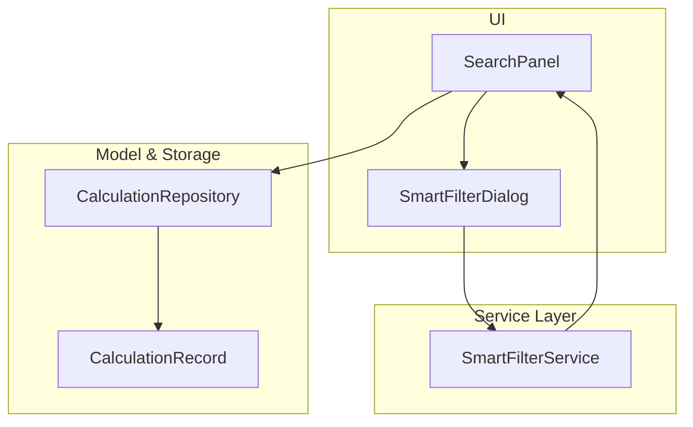
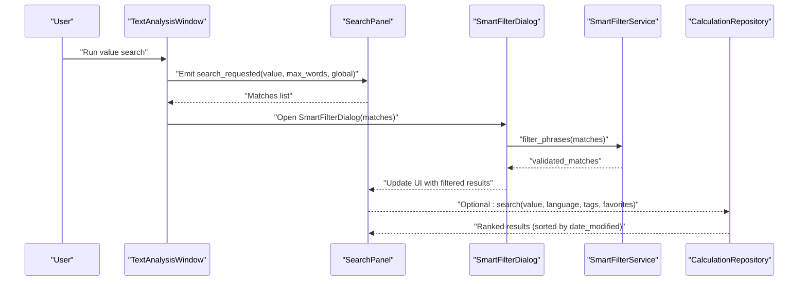
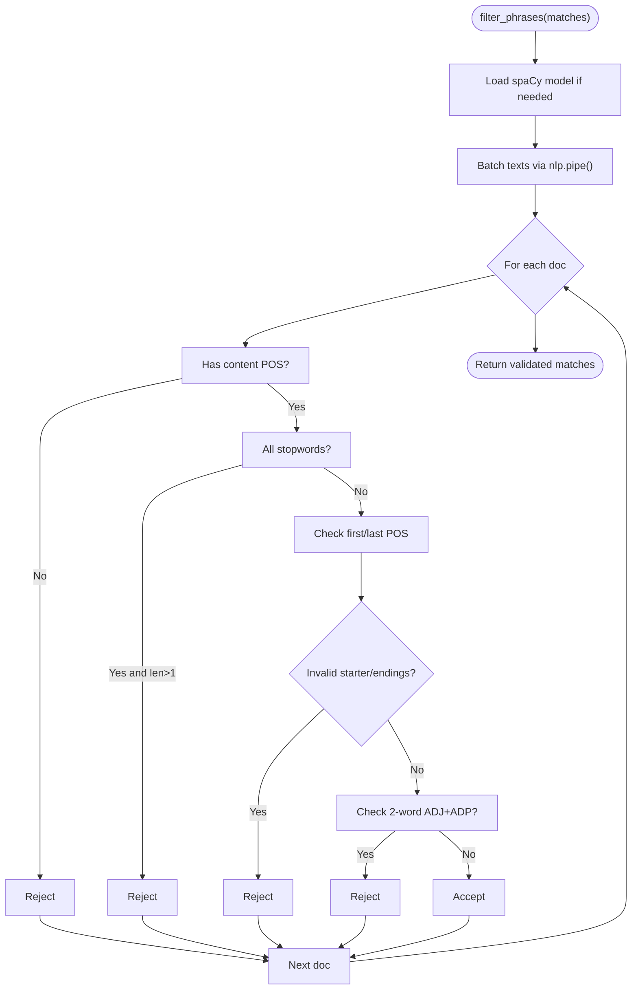
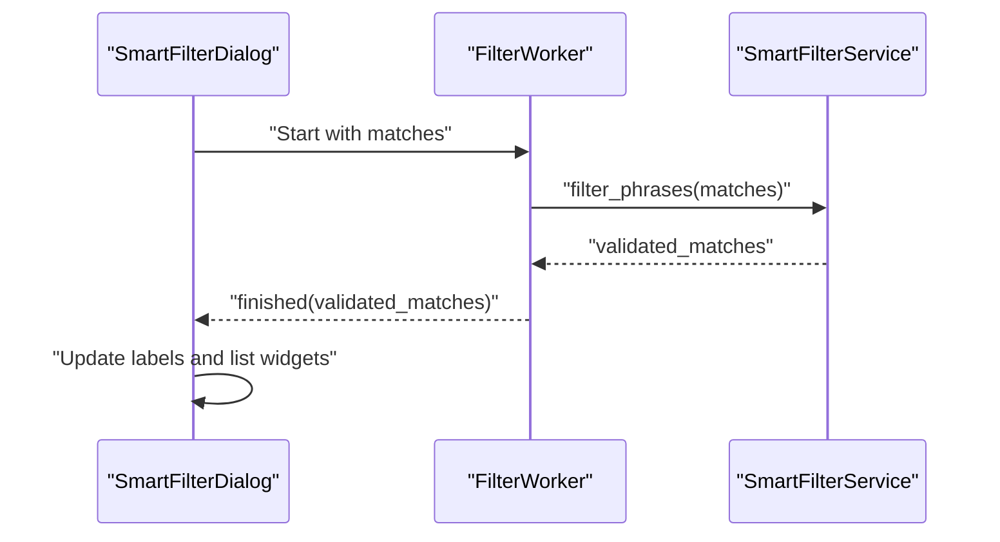
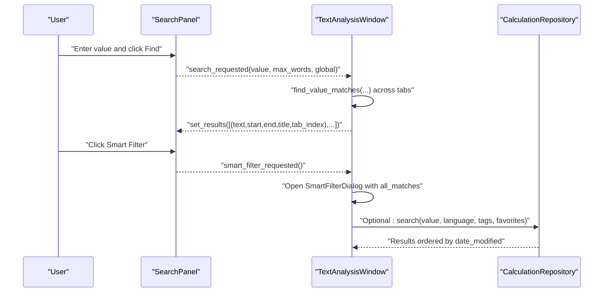
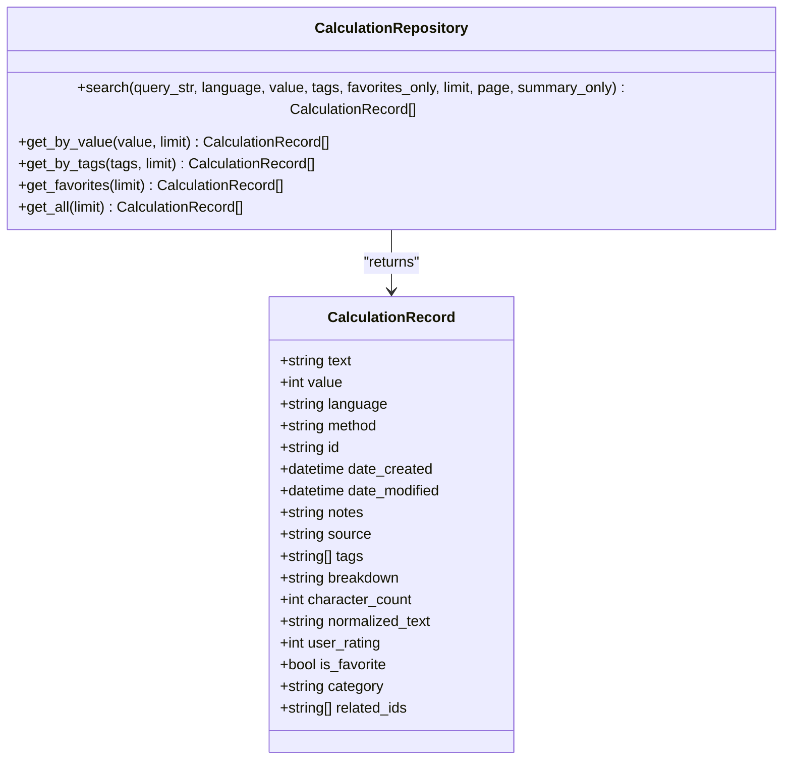
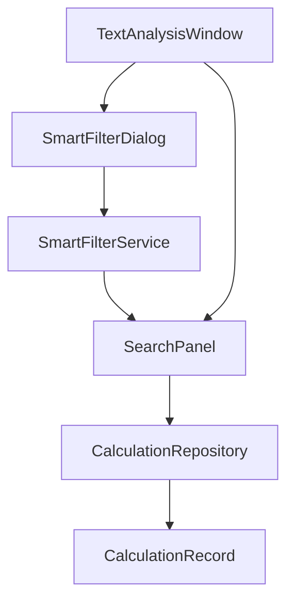

# Smart Filter Service

<cite>
**Referenced Files in This Document**
- [smart_filter_service.py](file://src/pillars/gematria/services/smart_filter_service.py)
- [smart_filter_dialog.py](file://src/pillars/gematria/ui/text_analysis/smart_filter_dialog.py)
- [search_panel.py](file://src/pillars/gematria/ui/text_analysis/search_panel.py)
- [main_window.py](file://src/pillars/gematria/ui/text_analysis/main_window.py)
- [calculation_record.py](file://src/pillars/gematria/models/calculation_record.py)
- [calculation_repository.py](file://src/pillars/gematria/repositories/calculation_repository.py)
- [calculation_service.py](file://src/pillars/gematria/services/calculation_service.py)
- [base_calculator.py](file://src/pillars/gematria/services/base_calculator.py)
- [hebrew_calculator.py](file://src/pillars/gematria/services/hebrew_calculator.py)
</cite>

## Table of Contents
1. [Introduction](#introduction)
2. [Project Structure](#project-structure)
3. [Core Components](#core-components)
4. [Architecture Overview](#architecture-overview)
5. [Detailed Component Analysis](#detailed-component-analysis)
6. [Dependency Analysis](#dependency-analysis)
7. [Performance Considerations](#performance-considerations)
8. [Troubleshooting Guide](#troubleshooting-guide)
9. [Conclusion](#conclusion)
10. [Appendices](#appendices)

## Introduction
This document describes the Smart Filter Service used to refine and rank candidate matches during gematria text analysis. It focuses on:
- Filtering methods for phrase quality and grammatical coherence
- Scoring and ranking based on numerical significance, frequency, and contextual relevance
- Integration with CalculationRecord models and repository/search layers
- Boolean logic in filter composition
- Examples of complex queries for research scenarios
- Performance implications and optimization strategies for large datasets

Important note: The repository implements a SmartFilterService that validates candidate phrases using linguistic heuristics and spaCy. However, the repository does not include explicit by_value_range(), by_cipher_method(), or by_significance_score() methods on a SmartFilterService. Instead, the system provides:
- A SmartFilterService that filters raw matches using POS-based heuristics
- A CalculationRepository/Search layer that supports value-based and metadata-based filtering
- A CalculationRecord model that stores metadata suitable for ranking and filtering

Accordingly, this document documents the available APIs and how to compose filters and rankings using the existing components.

## Project Structure
The Smart Filter pipeline spans UI, service, and repository layers:
- UI: SearchPanel and SmartFilterDialog orchestrate user-driven filtering
- Service: SmartFilterService performs NLP-based phrase validation
- Model: CalculationRecord defines persisted fields for filtering and ranking
- Repository: CalculationRepository provides Whoosh-backed search with boolean composition

**Diagram sources**
- [smart_filter_service.py](file://src/pillars/gematria/services/smart_filter_service.py#L1-L102)
- [smart_filter_dialog.py](file://src/pillars/gematria/ui/text_analysis/smart_filter_dialog.py#L1-L119)
- [search_panel.py](file://src/pillars/gematria/ui/text_analysis/search_panel.py#L1-L192)
- [calculation_record.py](file://src/pillars/gematria/models/calculation_record.py#L1-L89)
- [calculation_repository.py](file://src/pillars/gematria/repositories/calculation_repository.py#L1-L329)

**Section sources**
- [smart_filter_service.py](file://src/pillars/gematria/services/smart_filter_service.py#L1-L102)
- [smart_filter_dialog.py](file://src/pillars/gematria/ui/text_analysis/smart_filter_dialog.py#L1-L119)
- [search_panel.py](file://src/pillars/gematria/ui/text_analysis/search_panel.py#L1-L192)
- [calculation_record.py](file://src/pillars/gematria/models/calculation_record.py#L1-L89)
- [calculation_repository.py](file://src/pillars/gematria/repositories/calculation_repository.py#L1-L329)

## Core Components
- SmartFilterService: Validates candidate phrases using POS tags and punctuation/stopword rules. Returns a subset of matches considered “valid.”
- SmartFilterDialog: UI wrapper around SmartFilterService that runs filtering in a background thread and displays before/after lists.
- SearchPanel: Provides user controls for value-based search and triggers SmartFilter.
- CalculationRecord: Data model for persisted gematria calculations with fields suitable for filtering and ranking.
- CalculationRepository: Whoosh-backed repository exposing search with boolean composition and sorting.

Key APIs and behaviors:
- SmartFilterService.filter_phrases(): Accepts a list of matches and returns validated matches.
- CalculationRepository.search(): Supports boolean composition of filters (language, value, tags, favorites).
- CalculationService.search_calculations(): Thin wrapper delegating to repository.search().
- CalculationRecord: Fields include value, language, method, tags, user_rating, is_favorite, category, normalized_text, and others.

**Section sources**
- [smart_filter_service.py](file://src/pillars/gematria/services/smart_filter_service.py#L1-L102)
- [smart_filter_dialog.py](file://src/pillars/gematria/ui/text_analysis/smart_filter_dialog.py#L1-L119)
- [search_panel.py](file://src/pillars/gematria/ui/text_analysis/search_panel.py#L1-L192)
- [calculation_record.py](file://src/pillars/gematria/models/calculation_record.py#L1-L89)
- [calculation_repository.py](file://src/pillars/gematria/repositories/calculation_repository.py#L156-L228)
- [calculation_service.py](file://src/pillars/gematria/services/calculation_service.py#L151-L187)

## Architecture Overview
The Smart Filter workflow integrates UI, NLP validation, and persisted data:

**Diagram sources**
- [main_window.py](file://src/pillars/gematria/ui/text_analysis/main_window.py#L253-L308)
- [search_panel.py](file://src/pillars/gematria/ui/text_analysis/search_panel.py#L120-L131)
- [smart_filter_dialog.py](file://src/pillars/gematria/ui/text_analysis/smart_filter_dialog.py#L81-L100)
- [smart_filter_service.py](file://src/pillars/gematria/services/smart_filter_service.py#L29-L51)
- [calculation_repository.py](file://src/pillars/gematria/repositories/calculation_repository.py#L156-L228)

## Detailed Component Analysis

### SmartFilterService
SmartFilterService validates candidate phrases using spaCy and POS-based heuristics:
- Loads model lazily and disables named entity recognition for speed.
- Processes batches of texts using spaCy’s pipe.
- Applies validity checks:
  - Must contain at least one content word (POS in noun/verb/adjective/proper noun/number).
  - Rejects all-stopword sequences.
  - Rejects phrases starting or ending with coordinating/subordinating particles, punctuation, determiners, adpositions, pronouns.
  - Rejects specific patterns like adjective + adposition at length 2.

**Diagram sources**
- [smart_filter_service.py](file://src/pillars/gematria/services/smart_filter_service.py#L17-L102)

**Section sources**
- [smart_filter_service.py](file://src/pillars/gematria/services/smart_filter_service.py#L17-L102)

### SmartFilterDialog
SmartFilterDialog wraps SmartFilterService and runs filtering in a background thread:
- Initializes status and progress indicators
- Starts a worker thread that invokes SmartFilterService.filter_phrases()
- Updates UI with counts and filtered list
- Exports filtered results to a text file

**Diagram sources**
- [smart_filter_dialog.py](file://src/pillars/gematria/ui/text_analysis/smart_filter_dialog.py#L1-L119)
- [smart_filter_service.py](file://src/pillars/gematria/services/smart_filter_service.py#L29-L51)

**Section sources**
- [smart_filter_dialog.py](file://src/pillars/gematria/ui/text_analysis/smart_filter_dialog.py#L1-L119)

### SearchPanel and TextAnalysisWindow Integration
SearchPanel emits signals for search requests and SmartFilter. TextAnalysisWindow coordinates:
- Running value-based searches across documents
- Passing matches to SmartFilterDialog
- Highlighting results in the active tab

**Diagram sources**
- [search_panel.py](file://src/pillars/gematria/ui/text_analysis/search_panel.py#L120-L131)
- [main_window.py](file://src/pillars/gematria/ui/text_analysis/main_window.py#L253-L308)
- [calculation_repository.py](file://src/pillars/gematria/repositories/calculation_repository.py#L156-L228)

**Section sources**
- [search_panel.py](file://src/pillars/gematria/ui/text_analysis/search_panel.py#L1-L192)
- [main_window.py](file://src/pillars/gematria/ui/text_analysis/main_window.py#L253-L308)

### CalculationRecord and Repository
CalculationRecord encapsulates persisted gematria entries with fields suitable for filtering and ranking:
- Core: text, value, language, method
- Metadata: id, date_created, date_modified
- Additional: notes, source, tags, breakdown, character_count, normalized_text
- Organization: user_rating, is_favorite, category, related_ids

CalculationRepository.search() composes Whoosh queries with boolean logic:
- Text search across text, normalized_text, notes, source
- Exact term filters: language, value
- Multi-term OR over tags
- Boolean is_favorite
- Sorting by date_modified descending

**Diagram sources**
- [calculation_record.py](file://src/pillars/gematria/models/calculation_record.py#L1-L89)
- [calculation_repository.py](file://src/pillars/gematria/repositories/calculation_repository.py#L156-L228)

**Section sources**
- [calculation_record.py](file://src/pillars/gematria/models/calculation_record.py#L1-L89)
- [calculation_repository.py](file://src/pillars/gematria/repositories/calculation_repository.py#L156-L228)
- [calculation_service.py](file://src/pillars/gematria/services/calculation_service.py#L151-L187)

## Dependency Analysis
- SmartFilterService depends on spaCy and operates independently of the repository layer.
- SmartFilterDialog depends on SmartFilterService and runs in the UI thread via a background worker.
- SearchPanel and TextAnalysisWindow coordinate UI events and delegate to services and repositories.
- CalculationRepository exposes a Whoosh-backed search interface with boolean composition.

**Diagram sources**
- [smart_filter_service.py](file://src/pillars/gematria/services/smart_filter_service.py#L1-L102)
- [smart_filter_dialog.py](file://src/pillars/gematria/ui/text_analysis/smart_filter_dialog.py#L1-L119)
- [search_panel.py](file://src/pillars/gematria/ui/text_analysis/search_panel.py#L1-L192)
- [main_window.py](file://src/pillars/gematria/ui/text_analysis/main_window.py#L253-L308)
- [calculation_repository.py](file://src/pillars/gematria/repositories/calculation_repository.py#L156-L228)
- [calculation_record.py](file://src/pillars/gematria/models/calculation_record.py#L1-L89)

**Section sources**
- [smart_filter_service.py](file://src/pillars/gematria/services/smart_filter_service.py#L1-L102)
- [smart_filter_dialog.py](file://src/pillars/gematria/ui/text_analysis/smart_filter_dialog.py#L1-L119)
- [search_panel.py](file://src/pillars/gematria/ui/text_analysis/search_panel.py#L1-L192)
- [main_window.py](file://src/pillars/gematria/ui/text_analysis/main_window.py#L253-L308)
- [calculation_repository.py](file://src/pillars/gematria/repositories/calculation_repository.py#L156-L228)
- [calculation_record.py](file://src/pillars/gematria/models/calculation_record.py#L1-L89)

## Performance Considerations
- SmartFilterService uses spaCy’s pipe() for batch processing and sets n_process=1 to avoid multiprocessing issues in UI threads. For large batches, consider increasing batch_size and running off the UI thread.
- CalculationRepository.search() sorts by date_modified and uses Whoosh’s And/Or composition. For large indexes, ensure appropriate schema fields are indexed and sortable.
- Favor exact-term filters (language, value) and keyword tags for efficient Whoosh queries.
- Pagination via page and limit reduces memory footprint for large result sets.

[No sources needed since this section provides general guidance]

## Troubleshooting Guide
Common issues and resolutions:
- spaCy model not installed: SmartFilterService.load_model() logs and raises on failure. Install the required model and ensure it is available.
- Empty filtered results: Verify that matches contain content words and do not violate edge/start rules.
- Whoosh index errors: Ensure the index directory exists and is readable/writable. Recreate index if schema mismatches occur.
- Large dataset slowness: Use pagination, exact-term filters, and avoid overly broad text queries.

**Section sources**
- [smart_filter_service.py](file://src/pillars/gematria/services/smart_filter_service.py#L17-L28)
- [calculation_repository.py](file://src/pillars/gematria/repositories/calculation_repository.py#L137-L141)

## Conclusion
The Smart Filter Service provides robust phrase validation using POS heuristics and integrates cleanly with the UI and repository layers. While explicit by_value_range(), by_cipher_method(), and by_significance_score() methods are not present, the system offers:
- A SmartFilterService.filter_phrases() API for NLP-based phrase validation
- A CalculationRepository.search() API supporting boolean composition and sorting
- A CalculationRecord model with rich metadata for downstream filtering and ranking

These components enable researchers to build complex queries and ranking strategies tailored to their needs.

[No sources needed since this section summarizes without analyzing specific files]

## Appendices

### API Reference: SmartFilterService
- filter_phrases(matches): Validates candidate phrases and returns a subset considered valid.
  - Parameters:
    - matches: List of tuples (text, start, end, doc_title, tab_index)
  - Returns:
    - List of validated matches
  - Behavior:
    - Lazy-loads spaCy model
    - Batch-processes texts via pipe
    - Applies POS-based validity checks

**Section sources**
- [smart_filter_service.py](file://src/pillars/gematria/services/smart_filter_service.py#L29-L51)

### API Reference: CalculationRepository
- search(query_str=None, language=None, value=None, tags=None, favorites_only=False, limit=100, page=1, summary_only=True): Compose filters with boolean logic and return results.
  - Parameters:
    - query_str: Free-text search across text, normalized_text, notes, source
    - language: Exact term filter
    - value: Exact integer value filter
    - tags: List of tags (OR semantics)
    - favorites_only: Boolean filter
    - limit/page: Pagination
    - summary_only: Lightweight records if True
  - Returns:
    - List of CalculationRecord
  - Sorting:
    - Results sorted by date_modified descending

**Section sources**
- [calculation_repository.py](file://src/pillars/gematria/repositories/calculation_repository.py#L156-L228)

### API Reference: CalculationService
- search_calculations(...): Delegates to repository.search() with the same parameters.
- get_calculations_by_value(value): Returns all records with the specified value.

**Section sources**
- [calculation_service.py](file://src/pillars/gematria/services/calculation_service.py#L151-L187)
- [calculation_service.py](file://src/pillars/gematria/services/calculation_service.py#L201-L211)

### Extending Filter Types for Custom Research Needs
To extend filtering and ranking:
- Add new fields to CalculationRecord (e.g., frequency, significance_score) and update repository schema accordingly.
- Introduce new repository filters (e.g., by_value_range()) by adding new query conditions and updating search().
- Implement custom ranking logic by post-processing repository results (e.g., sort by user_rating, tags, or computed fields).
- For cipher-based filtering, leverage existing language/method fields or introduce new fields and corresponding UI controls.

**Section sources**
- [calculation_record.py](file://src/pillars/gematria/models/calculation_record.py#L1-L89)
- [calculation_repository.py](file://src/pillars/gematria/repositories/calculation_repository.py#L156-L228)
- [base_calculator.py](file://src/pillars/gematria/services/base_calculator.py#L1-L107)
- [hebrew_calculator.py](file://src/pillars/gematria/services/hebrew_calculator.py#L1-L120)

### Examples of Complex Queries
Below are example workflows using the existing APIs. Replace placeholders with actual values.

- Filter by value and language, then Smart Filter:
  - Step 1: Use repository.search(value=<value>, language=<language>, favorites_only=False)
  - Step 2: Pass the resulting CalculationRecord list to SmartFilterDialog for NLP validation
  - Step 3: Export filtered results

- Filter by tags (OR semantics) and favorites:
  - Use repository.search(tags=["tag1","tag2"], favorites_only=True) to combine tag matches with favorites

- Combine value and tags:
  - Use repository.search(value=<value>, tags=["tagA","tagB"]) to intersect exact value with tag matches

- Rank by recency and metadata:
  - repository.search(...) returns results sorted by date_modified descending
  - Enhance ranking by post-processing results (e.g., boost by user_rating or category)

**Section sources**
- [calculation_repository.py](file://src/pillars/gematria/repositories/calculation_repository.py#L156-L228)
- [smart_filter_dialog.py](file://src/pillars/gematria/ui/text_analysis/smart_filter_dialog.py#L81-L100)