# 2D Shape API

<cite>
**Referenced Files in This Document**   
- [base_shape.py](file://src/pillars/geometry/services/base_shape.py)
- [circle_shape.py](file://src/pillars/geometry/services/circle_shape.py)
- [polygon_shape.py](file://src/pillars/geometry/services/polygon_shape.py)
- [triangle_shape.py](file://src/pillars/geometry/services/triangle_shape.py)
- [square_shape.py](file://src/pillars/geometry/services/square_shape.py)
- [quadrilateral_shape.py](file://src/pillars/geometry/services/quadrilateral_shape.py)
- [ellipse_shape.py](file://src/pillars/geometry/services/ellipse_shape.py)
- [annulus_shape.py](file://src/pillars/geometry/services/annulus_shape.py)
- [crescent_shape.py](file://src/pillars/geometry/services/crescent_shape.py)
- [rose_curve_shape.py](file://src/pillars/geometry/services/rose_curve_shape.py)
- [vesica_piscis_shape.py](file://src/pillars/geometry/services/vesica_piscis_shape.py)
</cite>

## Table of Contents
1. [Introduction](#introduction)
2. [BaseShape Foundation](#baseshape-foundation)
3. [CircleShape](#circleshape)
4. [PolygonShape](#polygonshape)
5. [TriangleShape](#triangleshape)
6. [SquareShape](#squareshape)
7. [QuadrilateralShape](#quadrilateralshape)
8. [EllipseShape](#ellipseshape)
9. [AnnulusShape](#annulushape)
10. [CrescentShape](#crescentshape)
11. [RoseCurveShape](#rosecurvesshape)
12. [VesicaPiscisShape](#vesicapiscisshape)
13. [Coordinate System and Units](#coordinate-system-and-units)
14. [Examples](#examples)
15. [Edge Cases and Numerical Stability](#edge-cases-and-numerical-stability)

## Introduction
This document provides comprehensive API documentation for the 2D shape services in the Geometry pillar. The system is built around a hierarchical class structure with `GeometricShape` as the abstract base class. All 2D shapes inherit from this foundation, implementing standardized methods for property calculation, drawing instructions, and label positioning. The API supports a wide range of geometric forms from basic shapes like circles and triangles to complex configurations like crescents, rose curves, and intersecting circle geometries.

**Section sources**
- [base_shape.py](file://src/pillars/geometry/services/base_shape.py)

## BaseShape Foundation
The `GeometricShape` class serves as the foundational abstract base class for all 2D shapes in the Geometry pillar. It defines the core interface and common functionality that all specialized shapes inherit and implement.


**Diagram sources**
- [base_shape.py](file://src/pillars/geometry/services/base_shape.py#L18-L143)

The `ShapeProperty` dataclass represents a calculable property of a shape with attributes for display name, internal key, current value, unit suffix, read-only status, and display precision. The `GeometricShape` class manages a dictionary of these properties and provides methods for property manipulation and validation.

Key methods include:
- `calculate_from_property`: Calculates all other properties from a given property value
- `get_drawing_instructions`: Returns instructions for rendering the shape
- `get_label_positions`: Returns positions for labels in the viewport
- `set_property` and `get_property`: Methods for property value manipulation

All concrete shape classes must implement the abstract methods `_init_properties`, `name`, `description`, `calculate_from_property`, `get_drawing_instructions`, and `get_label_positions`.

**Section sources**
- [base_shape.py](file://src/pillars/geometry/services/base_shape.py#L1-L143)

## CircleShape
The `CircleShape` class represents a perfect circle with bidirectional property calculations. It supports calculations from any of its fundamental properties: radius, diameter, circumference, or area.


**Diagram sources**
- [circle_shape.py](file://src/pillars/geometry/services/circle_shape.py#L7-L234)

The CircleShape implements 10 properties:
- **Editable properties**: radius, diameter, circumference, area, central_angle_deg, arc_length, chord_length, sagitta
- **Calculated properties**: sector_area, segment_area

When any editable property is set, all other properties are automatically recalculated. The class also supports chord-related calculations including arc length, chord length, sagitta (chord height), sector area, and segment area when a central angle is provided.


**Diagram sources**
- [circle_shape.py](file://src/pillars/geometry/services/circle_shape.py#L84-L143)

**Section sources**
- [circle_shape.py](file://src/pillars/geometry/services/circle_shape.py#L1-L234)

## PolygonShape
The `RegularPolygonShape` class represents regular polygons with n equal sides and angles. It provides comprehensive calculations for various polygon metrics.


**Diagram sources**
- [polygon_shape.py](file://src/pillars/geometry/services/polygon_shape.py#L17-L267)

The PolygonShape supports:
- Configurable number of sides (minimum 3)
- Special names for common polygons (Triangle, Square, Pentagon, etc.)
- Calculations from side length, perimeter, area, apothem, circumradius, or diagonal lengths
- Automatic diagonal detection and visualization for polygons with 5+ sides

Key properties include:
- **Editable**: side, perimeter, area, apothem, circumradius, diagonal lengths
- **Calculated**: wedge_area, incircle_circumference, circumcircle_circumference, interior_angle, exterior_angle

The class uses trigonometric relationships to calculate all properties:
- Apothem = side / (2 × tan(π/n))
- Area = (n × side × apothem) / 2
- Circumradius = side / (2 × sin(π/n))
- Interior angle = ((n-2) × 180) / n


**Diagram sources**
- [polygon_shape.py](file://src/pillars/geometry/services/polygon_shape.py#L130-L189)

**Section sources**
- [polygon_shape.py](file://src/pillars/geometry/services/polygon_shape.py#L1-L267)

## TriangleShape
The `TriangleShape` module provides multiple specialized triangle classes, each implementing specific geometric constraints and calculations.


**Diagram sources**
- [triangle_shape.py](file://src/pillars/geometry/services/triangle_shape.py#L94-L1238)

The module includes specialized triangle classes:
- **EquilateralTriangleShape**: All sides equal, all angles 60°
- **RightTriangleShape**: One 90° angle, supports multiple input combinations
- **IsoscelesTriangleShape**: Two equal legs with base/apex metrics
- **ScaleneTriangleShape**: Three unequal sides
- **AcuteTriangleShape**: All angles less than 90°
- **ObtuseTriangleShape**: One angle greater than 90°
- **HeronianTriangleShape**: Integer sides and integer area
- **IsoscelesRightTriangleShape**: 45°-45°-90° triangle with √2 proportions
- **ThirtySixtyNinetyTriangleShape**: 30°-60°-90° triangle with 1:√3:2 ratios
- **GoldenTriangleShape**: Isosceles triangle with golden ratio sides (72°-72°-36°)
- **TriangleSolverShape**: General-purpose solver supporting SSS, SAS, ASA/AAS, and SSA relationships

The base functionality uses Heron's formula for area calculation and the Law of Cosines for angle calculations. The `TriangleSolution` dataclass encapsulates all computed metrics for a triangle.


**Diagram sources**
- [triangle_shape.py](file://src/pillars/geometry/services/triangle_shape.py#L46-L84)

**Section sources**
- [triangle_shape.py](file://src/pillars/geometry/services/triangle_shape.py#L1-L1238)

## SquareShape
The `SquareShape` and `RectangleShape` classes provide calculations for quadrilateral shapes with right angles.


**Diagram sources**
- [square_shape.py](file://src/pillars/geometry/services/square_shape.py#L7-L273)

The `SquareShape` class supports bidirectional calculations from any of its properties:
- Side length
- Perimeter
- Area
- Diagonal

The relationships are:
- Perimeter = 4 × side
- Area = side²
- Diagonal = side × √2

The `RectangleShape` class supports more complex resolution logic, allowing calculation from various combinations of length, width, area, perimeter, and diagonal.


**Diagram sources**
- [square_shape.py](file://src/pillars/geometry/services/square_shape.py#L47-L70)

**Section sources**
- [square_shape.py](file://src/pillars/geometry/services/square_shape.py#L1-L273)

## QuadrilateralShape
The `QuadrilateralShape` module provides specialized classes for various types of quadrilaterals, each implementing specific geometric constraints.

```mermaid
classDiagram
class ParallelogramShape {
+_points : Optional[Tuple[Tuple[float, float], ...]]
+_init_properties()
+calculate_from_property(property_key, value)
+_resolve()
}
class RhombusShape {
+_points : Optional[Tuple[Tuple[float, float], ...]]
+_init_properties()
+calculate_from_property(property_key, value)
+_resolve()
}
class TrapezoidShape {
+_points : Optional[Tuple[Tuple[float, float], ...]]
+_init_properties()
+calculate_from_property(property_key, value)
+_resolve()
}
class IsoscelesTrapezoidShape {
+_points : Optional[Tuple[Tuple[float, float], ...]]
+_init_properties()
+calculate_from_property(property_key, value)
+_resolve()
}
class _BaseAdjacentEqualShape {
+convex : bool
+_points : Optional[Tuple[Tuple[float, float], ...]]
+_init_properties()
+calculate_from_property(property_key, value)
+_solve_geometry()
}
class KiteShape {
+convex = True
}
class DeltoidShape {
+convex = False
}
class CyclicQuadrilateralShape {
+_points : Optional[Tuple[Tuple[float, float], ...]]
+_init_properties()
+calculate_from_property(property_key, value)
+_resolve()
}
class TangentialQuadrilateralShape {
+_points : Optional[Tuple[Tuple[float, float], ...]]
+_init_properties()
+calculate_from_property(property_key, value)
+_resolve()
}
class BicentricQuadrilateralShape {
+_points : Optional[Tuple[Tuple[float, float], ...]]
+_init_properties()
+calculate_from_property(property_key, value)
+_resolve()
}
class QuadrilateralSolverShape {
+_points : Optional[Tuple[Tuple[float, float], ...]]
+_init_properties()
+calculate_from_property(property_key, value)
+_resolve()
}
GeometricShape <|-- ParallelogramShape
GeometricShape <|-- RhombusShape
GeometricShape <|-- TrapezoidShape
GeometricShape <|-- IsoscelesTrapezoidShape
GeometricShape <|-- _BaseAdjacentEqualShape
_BaseAdjacentEqualShape <|-- KiteShape
_BaseAdjacentEqualShape <|-- DeltoidShape
GeometricShape <|-- CyclicQuadrilateralShape
GeometricShape <|-- TangentialQuadrilateralShape
GeometricShape <|-- BicentricQuadrilateralShape
GeometricShape <|-- QuadrilateralSolverShape
```



**Diagram sources**
- [quadrilateral_shape.py](file://src/pillars/geometry/services/quadrilateral_shape.py#L89-L1175)

The module includes:
- **ParallelogramShape**: Opposite sides parallel, supports base, side, height, and angle calculations
- **RhombusShape**: All sides equal, supports diagonal and angle relationships
- **TrapezoidShape**: One pair of parallel sides, supports major/minor bases, height, and leg calculations
- **IsoscelesTrapezoidShape**: Congruent legs with equal base angles
- **KiteShape**: Two pairs of adjacent equal edges (convex)
- **DeltoidShape**: Concave dart/deltoid configuration
- **CyclicQuadrilateralShape**: Vertices on a common circumcircle, uses Brahmagupta's formula for area
- **TangentialQuadrilateralShape**: Admits an incircle (Pitot's Theorem: a+c = b+d)
- **BicentricQuadrilateralShape**: Both cyclic and tangential (Fuss' Theorem)
- **QuadrilateralSolverShape**: General solver using diagonals and included angle

Each class implements specific geometric constraints and validation rules to ensure the shape properties are consistent with the mathematical definitions.

**Section sources**
- [quadrilateral_shape.py](file://src/pillars/geometry/services/quadrilateral_shape.py#L1-L1175)

## EllipseShape
The `EllipseShape` class represents an oval shape defined by its semi-major and semi-minor axes.


**Diagram sources**
- [ellipse_shape.py](file://src/pillars/geometry/services/ellipse_shape.py#L8-L200)

The EllipseShape supports:
- Semi-major axis (a) and semi-minor axis (b)
- Major axis (2a) and minor axis (2b)
- Area calculation: π × a × b
- Perimeter approximation using Ramanujan's formula
- Eccentricity: √(1 - (b²/a²))
- Focal distance: √(a² - b²)

The class automatically ensures that the semi-major axis is always the larger of the two axes, swapping values if necessary.


**Diagram sources**
- [ellipse_shape.py](file://src/pillars/geometry/services/ellipse_shape.py#L75-L96)

**Section sources**
- [ellipse_shape.py](file://src/pillars/geometry/services/ellipse_shape.py#L1-L200)

## AnnulusShape
The `AnnulusShape` class represents a ring-shaped object bounded by two concentric circles.


**Diagram sources**
- [annulus_shape.py](file://src/pillars/geometry/services/annulus_shape.py#L8-L219)

The AnnulusShape supports:
- Outer radius (R) and inner radius (r)
- Ring width (R - r)
- Outer and inner diameters
- Ring area: π × (R² - r²)
- Outer and inner circumferences
- Radius ratio (R/r)

The class enforces the constraint that the outer radius must be greater than the inner radius, and both must be positive.


**Diagram sources**
- [annulus_shape.py](file://src/pillars/geometry/services/annulus_shape.py#L76-L105)

**Section sources**
- [annulus_shape.py](file://src/pillars/geometry/services/annulus_shape.py#L1-L219)

## CrescentShape
The `CrescentShape` class represents a lune formed by two intersecting circles of different sizes.


**Diagram sources**
- [crescent_shape.py](file://src/pillars/geometry/services/crescent_shape.py#L8-L274)

The CrescentShape supports:
- Outer radius (R) and inner radius (r)
- Center offset (d) between the two circles
- Outer and inner diameters
- Intersection area (overlap)
- Crescent area (outer circle minus overlap)
- Crescent perimeter (sum of relevant arcs)

The class handles three geometric cases:
1. **Disjoint circles** (d ≥ R + r): No intersection, crescent is the entire outer circle
2. **One circle inside the other** (d ≤ |R - r|): Complete overlap, crescent is an annulus-like shape
3. **Intersecting circles**: Partial overlap, crescent has a complex perimeter

```mermaid
flowchart TD
Start([Set Property]) --> Validate["Validate Value > 0"]
Validate --> |Outer Radius| CheckInner["Check R > r"]
Validate --> |Inner Radius| CheckOuter["Check r < R"]
Validate --> |Offset| CheckValid["Check Valid Offset"]
CheckInner --> |Valid| Update["Update Metrics"]
CheckOuter --> |Valid| Update
CheckValid --> |Valid| Update
Update --> |d >= R+r| Case1["Case 1: Disjoint"]
Update --> |d <= |R-r|| Case2["Case 2: One Inside Other"]
Update --> |Otherwise| Case3["Case 3: Intersecting"]
Case1 --> Perimeter["Perimeter = 2πR"]
Case2 --> Perimeter2["Perimeter = 2πR + 2πr"]
Case3 --> Perimeter3["Perimeter = Outer Arc + Inner Arc"]
Perimeter --> UpdateProps["Update Properties"]
Perimeter2 --> UpdateProps
Perimeter3 --> UpdateProps
UpdateProps --> Success["Return True"]
```

**Diagram sources**
- [crescent_shape.py](file://src/pillars/geometry/services/crescent_shape.py#L70-L107)

**Section sources**
- [crescent_shape.py](file://src/pillars/geometry/services/crescent_shape.py#L1-L274)

## RoseCurveShape
The `RoseCurveShape` class represents a rhodonea curve defined by the polar equation r = a × cos(kθ).


**Diagram sources**
- [rose_curve_shape.py](file://src/pillars/geometry/services/rose_curve_shape.py#L8-L137)

The RoseCurveShape supports:
- Amplitude (a): Controls the size of the petals
- Harmonic (k): Controls the number and symmetry of petals
- Petal count: k if k is odd, 2k if k is even
- Max radius: Equal to the amplitude
- Total area: 0.5 × a² × petal_count

The curve is generated by sampling points along the polar equation r = a × cos(kθ) for θ from 0 to 2π.


**Diagram sources**
- [rose_curve_shape.py](file://src/pillars/geometry/services/rose_curve_shape.py#L56-L71)

**Section sources**
- [rose_curve_shape.py](file://src/pillars/geometry/services/rose_curve_shape.py#L1-L137)

## VesicaPiscisShape
The `VesicaPiscisShape` class represents the lens-shaped intersection of two congruent circles.


**Diagram sources**
- [vesica_piscis_shape.py](file://src/pillars/geometry/services/vesica_piscis_shape.py#L8-L224)

The VesicaPiscisShape supports:
- Circle radius (r)
- Diameter (2r)
- Center separation (d)
- Lens height: 2 × √(r² - (d/2)²)
- Lens area: Calculated using circle intersection formula
- Perimeter: Sum of two circular arcs
- Apex angle: 2 × arccos(d/(2r))

The class enforces that the separation distance must be between 0 and 2r (the diameter).


**Diagram sources**
- [vesica_piscis_shape.py](file://src/pillars/geometry/services/vesica_piscis_shape.py#L67-L90)

**Section sources**
- [vesica_piscis_shape.py](file://src/pillars/geometry/services/vesica_piscis_shape.py#L1-L224)

## Coordinate System and Units
The 2D shape services use a standardized coordinate system and unit conventions across all shape implementations.

### Coordinate System
- **Cartesian coordinate system** with origin at (0,0)
- **X-axis**: Positive to the right, negative to the left
- **Y-axis**: Positive upward, negative downward
- All shape coordinates are relative to the origin
- Shapes are typically centered at the origin when possible

### Angle Units
- **Radians**: Used internally for all trigonometric calculations
- **Degrees**: Used for user-facing properties and display
- Conversion: degrees = radians × (180/π), radians = degrees × (π/180)
- All angle properties are displayed in degrees with the unit symbol "°"

### Precision and Tolerance
- **Display precision**: 4 decimal places by default (configurable per property)
- **Numerical tolerance**: 1e-7 for floating-point comparisons
- **Validation**: All geometric properties must be positive (value > 0)
- **Edge case handling**: Degenerate cases return appropriate values or None

### Units
- **Linear units**: "units" (generic unit, can be interpreted as cm, inches, etc.)
- **Area units**: "units²" 
- **Angle units**: "°" for degrees
- Unit strings are included in property definitions for display purposes

**Section sources**
- [base_shape.py](file://src/pillars/geometry/services/base_shape.py#L13-L15)
- [circle_shape.py](file://src/pillars/geometry/services/circle_shape.py#L24-L49)
- [polygon_shape.py](file://src/pillars/geometry/services/polygon_shape.py#L60-L109)

## Examples
This section provides practical examples of using the 2D shape API for common operations.

### Creating and Using a Circle
```python
# Create a circle and set its radius
circle = CircleShape()
circle.set_property("radius", 5.0)

# Retrieve calculated properties
area = circle.get_property("area")  # Returns π × 25
circumference = circle.get_property("circumference")  # Returns 10π
diameter = circle.get_property("diameter")  # Returns 10.0

# Alternative: Create a circle from circumference
circle2 = CircleShape()
circle2.set_property("circumference", 31.4159)
radius = circle2.get_property("radius")  # Returns approximately 5.0
```

### Creating a Regular Hexagon
```python
# Create a regular hexagon with 6 sides
hexagon = RegularPolygonShape(num_sides=6)
hexagon.set_property("side", 4.0)

# Get various properties
perimeter = hexagon.get_property("perimeter")  # Returns 24.0
area = hexagon.get_property("area")  # Returns approximately 41.57
apothem = hexagon.get_property("apothem")  # Returns approximately 3.46
circumradius = hexagon.get_property("circumradius")  # Returns 4.0
```

### Solving a Right Triangle
```python
# Create a right triangle and set two sides
right_triangle = RightTriangleShape()
right_triangle.set_property("base", 3.0)
right_triangle.set_property("height", 4.0)

# The hypotenuse and other properties are automatically calculated
hypotenuse = right_triangle.get_property("hypotenuse")  # Returns 5.0
area = right_triangle.get_property("area")  # Returns 6.0
perimeter = right_triangle.get_property("perimeter")  # Returns 12.0

# Alternatively, solve from hypotenuse and one leg
right_triangle2 = RightTriangleShape()
right_triangle2.set_property("hypotenuse", 10.0)
right_triangle2.set_property("base", 6.0)
# The height is automatically calculated as 8.0
```

### Working with an Annulus
```python
# Create an annulus with outer and inner radii
annulus = AnnulusShape()
annulus.set_property("outer_radius", 8.0)
annulus.set_property("inner_radius", 5.0)

# Calculate ring properties
ring_area = annulus.get_property("area")  # Returns π × (64 - 25)
ring_width = annulus.get_property("ring_width")  # Returns 3.0
radius_ratio = annulus.get_property("radius_ratio")  # Returns 1.6

# Alternative: Create from outer radius and ring width
annulus2 = AnnulusShape()
annulus2.set_property("outer_radius", 10.0)
annulus2.set_property("ring_width", 3.0)
# The inner radius is automatically calculated as 7.0
```

### Generating a Rose Curve
```python
# Create a rose curve with 5 petals
rose = RoseCurveShape()
rose.set_property("amplitude", 4.0)
rose.set_property("k_value", 5.0)  # Odd k gives k petals

# Get curve properties
petal_count = rose.get_property("petal_count")  # Returns 5.0
total_area = rose.get_property("total_area")  # Returns 0.5 × 16 × 5 = 40.0

# Create a rose curve with 8 petals (k=4, even)
rose2 = RoseCurveShape()
rose2.set_property("amplitude", 3.0)
rose2.set_property("k_value", 4.0)  # Even k gives 2k petals
petal_count2 = rose2.get_property("petal_count")  # Returns 8.0
```

**Section sources**
- [circle_shape.py](file://src/pillars/geometry/services/circle_shape.py#L84-L143)
- [polygon_shape.py](file://src/pillars/geometry/services/polygon_shape.py#L130-L189)
- [triangle_shape.py](file://src/pillars/geometry/services/triangle_shape.py#L430-L513)
- [annulus_shape.py](file://src/pillars/geometry/services/annulus_shape.py#L76-L105)
- [rose_curve_shape.py](file://src/pillars/geometry/services/rose_curve_shape.py#L56-L71)

## Edge Cases and Numerical Stability
This section addresses edge cases and numerical stability considerations in the 2D shape calculations.

### Degenerate Polygons
- **Minimum sides**: Regular polygons require at least 3 sides (n ≥ 3)
- **Invalid side lengths**: For triangles, the sum of any two sides must be greater than the third side
- **Zero or negative values**: All geometric properties must be positive (value > 0)
- **Collinear points**: For polygons, vertices must not be collinear in a way that creates zero area

### Numerical Stability
- **Floating-point precision**: Calculations use double-precision floating-point arithmetic
- **Tolerance threshold**: 1e-7 is used for equality comparisons to handle floating-point errors
- **Domain restrictions**: Trigonometric functions include clamping to valid domains (e.g., arcsin input clamped to [-1,1])
- **Division by zero**: Checks are implemented to prevent division by zero in formulas

### Special Cases
- **Circle with zero radius**: Returns None for area, circumference, and other derived properties
- **Annulus with equal radii**: Invalid configuration, returns False for calculations
- **Crescent with offset ≥ R + r**: Circles are disjoint, crescent is the entire outer circle
- **Vesica Piscis with zero separation**: Circles are concentric, lens is a full circle
- **Rose curve with k = 0**: Treated as k = 1 (single petal)

### Error Handling
- **Invalid input**: Methods return False for invalid inputs (non-positive values, invalid geometric constraints)
- **Property validation**: The `validate_value` method in the base class checks for positive values
- **Graceful degradation**: When exact calculations are not possible, the system returns None for affected properties rather than throwing exceptions
- **Consistent state**: After a failed calculation, the shape maintains its previous valid state

```mermaid
flowchart TD
Start([Operation]) --> ValidateInput["Validate Input Values"]
ValidateInput --> |Invalid| HandleInvalid["Return False, Preserve State"]
ValidateInput --> |Valid| CheckConstraints["Check Geometric Constraints"]
CheckConstraints --> |Violated| HandleConstraint["Return False, Preserve State"]
CheckConstraints --> |Satisfied| PerformCalculation["Perform Calculation"]
PerformCalculation --> |Success| UpdateState["Update Properties, Return True"]
PerformCalculation --> |Numerical Issue| HandleNumerical["Set Affected Properties to None"]
HandleNumerical --> ReturnPartial["Return True with Partial Results"]
```

**Diagram sources**
- [base_shape.py](file://src/pillars/geometry/services/base_shape.py#L133-L137)
- [triangle_shape.py](file://src/pillars/geometry/services/triangle_shape.py#L22-L23)
- [annulus_shape.py](file://src/pillars/geometry/services/annulus_shape.py#L82-L83)
- [crescent_shape.py](file://src/pillars/geometry/services/crescent_shape.py#L77-L78)

**Section sources**
- [base_shape.py](file://src/pillars/geometry/services/base_shape.py#L122-L137)
- [triangle_shape.py](file://src/pillars/geometry/services/triangle_shape.py#L22-L23)
- [annulus_shape.py](file://src/pillars/geometry/services/annulus_shape.py#L82-L83)
- [crescent_shape.py](file://src/pillars/geometry/services/crescent_shape.py#L77-L78)
- [vesica_piscis_shape.py](file://src/pillars/geometry/services/vesica_piscis_shape.py#L105-L108)