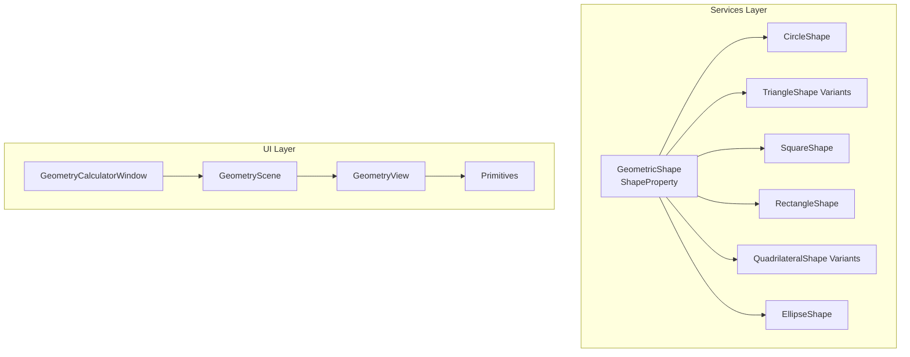
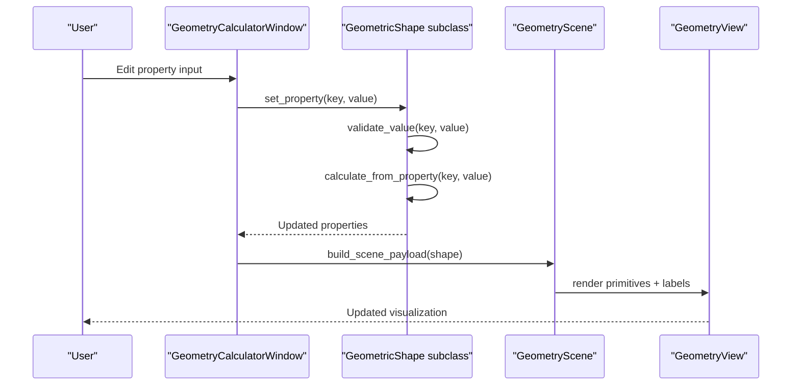
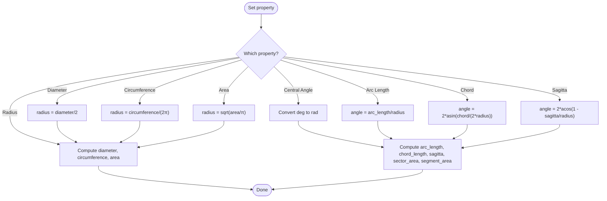
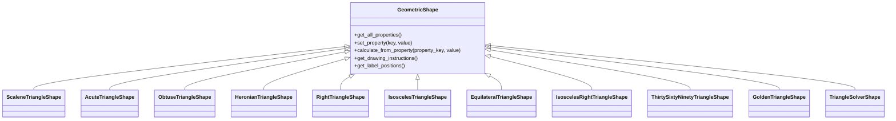
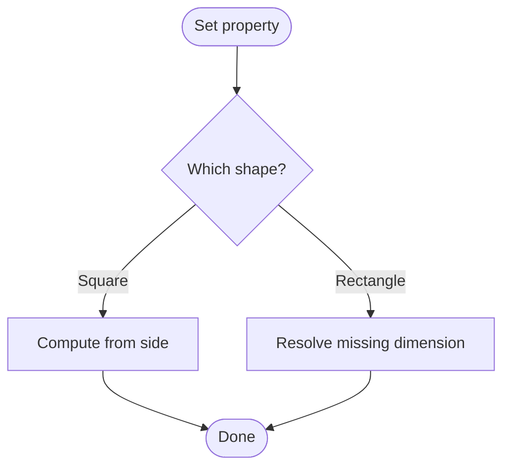
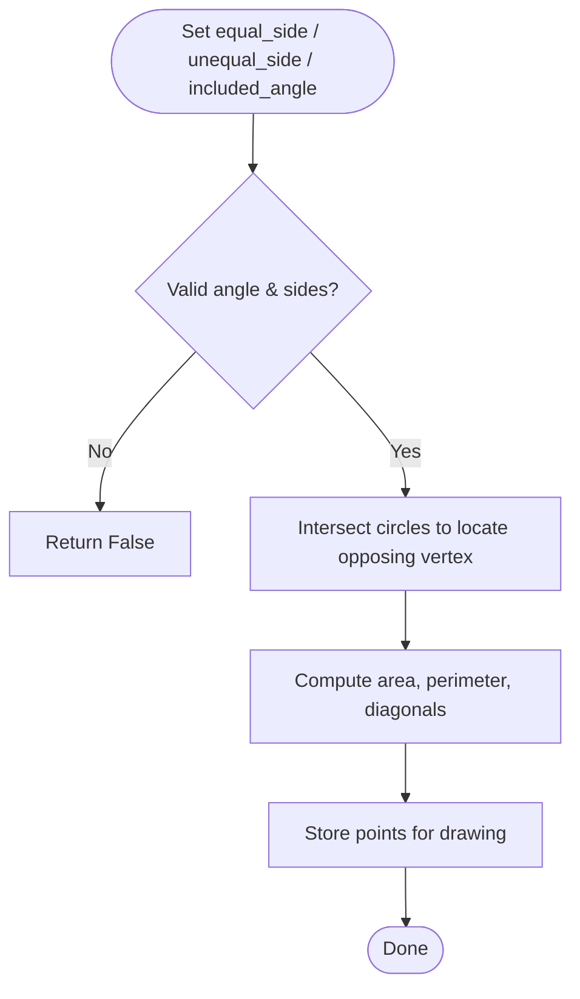
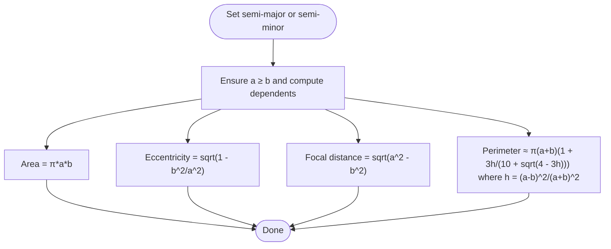
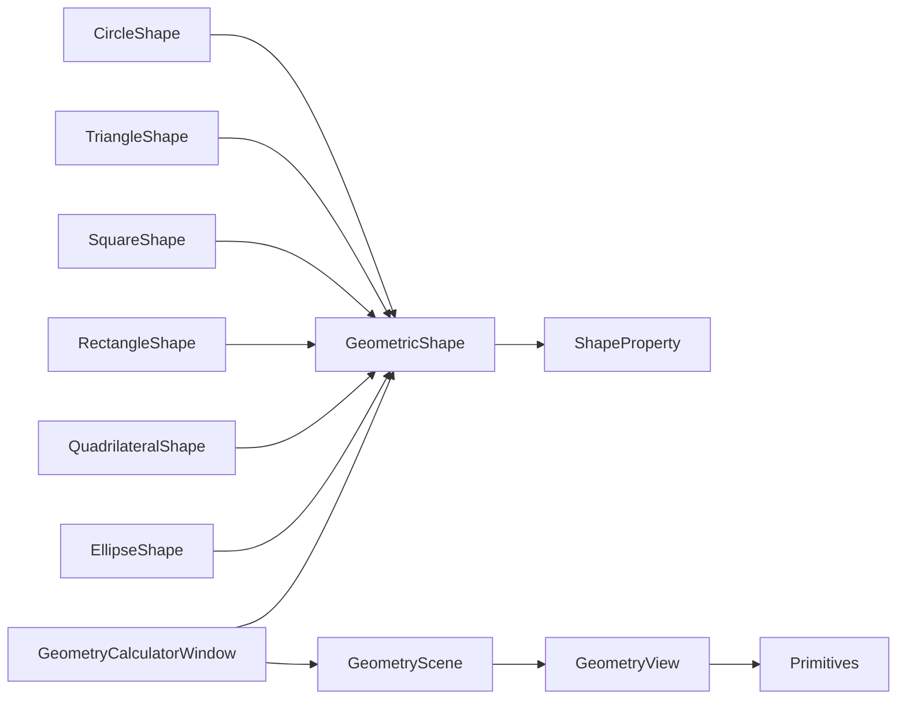

# Basic Shapes

<cite>
**Referenced Files in This Document**
- [base_shape.py](file://src/pillars/geometry/services/base_shape.py)
- [circle_shape.py](file://src/pillars/geometry/services/circle_shape.py)
- [triangle_shape.py](file://src/pillars/geometry/services/triangle_shape.py)
- [square_shape.py](file://src/pillars/geometry/services/square_shape.py)
- [quadrilateral_shape.py](file://src/pillars/geometry/services/quadrilateral_shape.py)
- [ellipse_shape.py](file://src/pillars/geometry/services/ellipse_shape.py)
- [geometry_calculator_window.py](file://src/pillars/geometry/ui/geometry_calculator_window.py)
- [primitives.py](file://src/pillars/geometry/ui/primitives.py)
</cite>

## Table of Contents
1. [Introduction](#introduction)
2. [Project Structure](#project-structure)
3. [Core Components](#core-components)
4. [Architecture Overview](#architecture-overview)
5. [Detailed Component Analysis](#detailed-component-analysis)
6. [Dependency Analysis](#dependency-analysis)
7. [Performance Considerations](#performance-considerations)
8. [Troubleshooting Guide](#troubleshooting-guide)
9. [Conclusion](#conclusion)
10. [Appendices](#appendices)

## Introduction
This document provides API documentation for fundamental 2D geometric shapes implemented in the geometry services module. It covers:
- CircleShape with radius-based calculations for area, circumference, diameter, and chord metrics (arc length, sagitta, sector/segment area)
- TriangleShape implementations including SSS (side-side-side), SAS (side-angle-side), and right triangle solvers with angle and side derivation
- SquareShape and RectangleShape with bidirectional property solving for side, area, perimeter, and diagonal
- QuadrilateralShape variants (kite, dart) with adjacent equal side logic
- EllipseShape with semi-major/minor axes, eccentricity, and Ramanujan’s approximation for perimeter
It also explains the coordinate system (Cartesian), unit handling, and numerical precision considerations, and provides examples for shape initialization, property solving, and drawing instructions.

## Project Structure
The geometry shapes are implemented as classes inheriting from a common base, exposing a uniform API for property management, calculation, and visualization.

**Diagram sources**
- [base_shape.py](file://src/pillars/geometry/services/base_shape.py#L1-L143)
- [circle_shape.py](file://src/pillars/geometry/services/circle_shape.py#L1-L234)
- [triangle_shape.py](file://src/pillars/geometry/services/triangle_shape.py#L1-L1238)
- [square_shape.py](file://src/pillars/geometry/services/square_shape.py#L1-L273)
- [quadrilateral_shape.py](file://src/pillars/geometry/services/quadrilateral_shape.py#L1-L1175)
- [ellipse_shape.py](file://src/pillars/geometry/services/ellipse_shape.py#L1-L200)
- [geometry_calculator_window.py](file://src/pillars/geometry/ui/geometry_calculator_window.py#L1-L800)
- [primitives.py](file://src/pillars/geometry/ui/primitives.py#L1-L120)

**Section sources**
- [base_shape.py](file://src/pillars/geometry/services/base_shape.py#L1-L143)
- [geometry_calculator_window.py](file://src/pillars/geometry/ui/geometry_calculator_window.py#L1-L200)

## Core Components
- ShapeProperty: Defines a calculable property with name, internal key, value, unit, readonly flag, and precision.
- GeometricShape: Abstract base class providing property lifecycle, validation, and drawing/label APIs.

Key behaviors:
- Properties are initialized in subclasses via _init_properties().
- calculate_from_property(property_key, value) drives bidirectional solving.
- set_property(key, value) validates and triggers recalculation.
- get_drawing_instructions() returns viewport-ready data.
- get_label_positions() returns label text and positions for the viewport.

**Section sources**
- [base_shape.py](file://src/pillars/geometry/services/base_shape.py#L1-L143)

## Architecture Overview
The system follows a service-driven architecture:
- Services implement shape-specific calculations and expose a consistent API.
- UI binds to shape instances, updating inputs and rendering viewport visuals.

**Diagram sources**
- [geometry_calculator_window.py](file://src/pillars/geometry/ui/geometry_calculator_window.py#L1-L250)
- [base_shape.py](file://src/pillars/geometry/services/base_shape.py#L85-L143)
- [primitives.py](file://src/pillars/geometry/ui/primitives.py#L1-L120)

## Detailed Component Analysis

### CircleShape
- Properties: radius, diameter, circumference, area, central_angle_deg, arc_length, chord_length, sagitta, sector_area (readonly), segment_area (readonly)
- Bidirectional solving:
  - From radius: compute diameter, circumference, area, and chord metrics if angle is known
  - From diameter: convert to radius
  - From circumference: compute radius
  - From area: compute radius
  - From central_angle_deg: compute arc_length, chord_length, sagitta, sector_area, segment_area
  - From arc_length: derive central_angle_deg and chord metrics
  - From chord_length: derive central_angle_deg and chord metrics (with validity checks)
  - From sagitta: derive central_angle_deg and chord metrics (with validity checks)
- Drawing instructions include center, radius, optional chord endpoints, and flags to show radius/diameter lines.
- Label positions include radius, diameter, area, circumference, and chord/angle when applicable.

**Diagram sources**
- [circle_shape.py](file://src/pillars/geometry/services/circle_shape.py#L84-L143)
- [circle_shape.py](file://src/pillars/geometry/services/circle_shape.py#L203-L234)

**Section sources**
- [circle_shape.py](file://src/pillars/geometry/services/circle_shape.py#L1-L234)

### TriangleShape Implementations
- SSS (Scalene, Acute, Obtuse, Heronian): Three sides define angles, heights, inradius, circumradius, incircle/circumcircle circumference, and area/perimeter via Heron’s formula and cosine law.
- Right Triangle: Two sides or one side plus area; derives hypotenuse, perimeter, area, inradius, circumradius.
- Isosceles Triangle: Base and leg or height; derives missing dimension and full solution.
- Specialized triangles:
  - Equilateral: side ↔ height ↔ perimeter ↔ area ↔ inradius ↔ circumradius
  - Isosceles Right (45-45-90): leg ↔ hypotenuse ↔ area/perimeter/inradius/circumradius
  - 30-60-90: short_leg ↔ long_leg ↔ hypotenuse ↔ area/perimeter/inradius/circumradius
  - Golden Triangle: equal_leg ↔ base ↔ height ↔ angles ↔ area/perimeter/inradius/circumradius
- General Triangle Solver: accepts sides/angles using SSS, SAS, ASA/AAS, or SSA relationships with ambiguity handling.

**Diagram sources**
- [triangle_shape.py](file://src/pillars/geometry/services/triangle_shape.py#L1-L1238)
- [base_shape.py](file://src/pillars/geometry/services/base_shape.py#L1-L143)

**Section sources**
- [triangle_shape.py](file://src/pillars/geometry/services/triangle_shape.py#L1-L1238)

### SquareShape and RectangleShape
- SquareShape: side ↔ perimeter ↔ area ↔ diagonal
- RectangleShape: bidirectional solving among length, width, area, perimeter, diagonal; resolves missing dimension when two of {area, perimeter, diagonal} and one dimension are known.

**Diagram sources**
- [square_shape.py](file://src/pillars/geometry/services/square_shape.py#L47-L71)
- [square_shape.py](file://src/pillars/geometry/services/square_shape.py#L162-L221)
- [square_shape.py](file://src/pillars/geometry/services/square_shape.py#L222-L273)

**Section sources**
- [square_shape.py](file://src/pillars/geometry/services/square_shape.py#L1-L273)

### QuadrilateralShape Variants (Kite, Dart)
- Adjacent equal side logic: equal_side, unequal_side, included_angle_deg drive area, perimeter, and diagonal computation via circle intersections and distance formulas.
- KiteShape: convex configuration
- DeltoidShape: concave (dart) configuration

**Diagram sources**
- [quadrilateral_shape.py](file://src/pillars/geometry/services/quadrilateral_shape.py#L623-L714)
- [quadrilateral_shape.py](file://src/pillars/geometry/services/quadrilateral_shape.py#L716-L747)

**Section sources**
- [quadrilateral_shape.py](file://src/pillars/geometry/services/quadrilateral_shape.py#L623-L747)

### EllipseShape
- Properties: semi-major axis (a), semi-minor axis (b), major axis (2a), minor axis (2b), area, perimeter (Ramanujan approximation), eccentricity, focal distance
- Bidirectional solving: setting either axis reconciles ordering and computes dependents

**Diagram sources**
- [ellipse_shape.py](file://src/pillars/geometry/services/ellipse_shape.py#L75-L115)
- [ellipse_shape.py](file://src/pillars/geometry/services/ellipse_shape.py#L139-L186)

**Section sources**
- [ellipse_shape.py](file://src/pillars/geometry/services/ellipse_shape.py#L1-L200)

## Dependency Analysis
- All shapes inherit from GeometricShape and use ShapeProperty for consistent property definitions.
- UI binds to shape instances, retrieving drawing instructions and labels to render the viewport.
- Primitives define the visualization model used by the scene.

**Diagram sources**
- [base_shape.py](file://src/pillars/geometry/services/base_shape.py#L1-L143)
- [geometry_calculator_window.py](file://src/pillars/geometry/ui/geometry_calculator_window.py#L1-L200)
- [primitives.py](file://src/pillars/geometry/ui/primitives.py#L1-L120)

**Section sources**
- [base_shape.py](file://src/pillars/geometry/services/base_shape.py#L1-L143)
- [geometry_calculator_window.py](file://src/pillars/geometry/ui/geometry_calculator_window.py#L1-L200)
- [primitives.py](file://src/pillars/geometry/ui/primitives.py#L1-L120)

## Performance Considerations
- All shapes implement lightweight arithmetic and trigonometric computations suitable for interactive UIs.
- Numerical stability is ensured by clamping trigonometric arguments and using epsilon comparisons for degeneracies.
- Drawing routines precompute points (e.g., ellipse sampling) and reuse geometric formulas.

[No sources needed since this section provides general guidance]

## Troubleshooting Guide
Common issues and resolutions:
- Invalid inputs: All shapes validate positivity for lengths and angles (e.g., triangle angles must be within (0,180)).
- Degenerate cases:
  - Circle chord/sagitta must satisfy 0 < chord ≤ 2*radius and 0 < sagitta < 2*radius
  - Rectangle diagonal must exceed both length and width
  - Ellipse axes must satisfy a ≥ b and positive values
- Ambiguous triangle cases (SSA) are handled with explicit checks and may yield multiple solutions; the solver selects a valid configuration.
- UI synchronization: Editing a property triggers recalculation; avoid circular updates by guarding the update flag during programmatic changes.

**Section sources**
- [circle_shape.py](file://src/pillars/geometry/services/circle_shape.py#L118-L141)
- [square_shape.py](file://src/pillars/geometry/services/square_shape.py#L190-L211)
- [ellipse_shape.py](file://src/pillars/geometry/services/ellipse_shape.py#L160-L186)
- [triangle_shape.py](file://src/pillars/geometry/services/triangle_shape.py#L1144-L1223)

## Conclusion
The geometry services provide a cohesive, extensible framework for 2D shape calculations with consistent property semantics, robust validation, and integrated visualization. The documented shapes cover essential Euclidean forms with bidirectional solving and precise drawing instructions, enabling interactive exploration and educational use.

[No sources needed since this section summarizes without analyzing specific files]

## Appendices

### Coordinate System and Units
- Coordinate system: Cartesian (x, y) with origin at shape center for most shapes.
- Units: All lengths use a unit suffix; angles are degrees; areas use squared units; precision controlled per property.

**Section sources**
- [base_shape.py](file://src/pillars/geometry/services/base_shape.py#L7-L16)
- [circle_shape.py](file://src/pillars/geometry/services/circle_shape.py#L18-L82)
- [ellipse_shape.py](file://src/pillars/geometry/services/ellipse_shape.py#L23-L74)

### Example Workflows

- Initialize a shape and set a property:
  - Create a shape instance (e.g., CircleShape)
  - Call set_property("radius", value) to trigger bidirectional solving
  - Retrieve computed properties via get_all_properties()

- Drawing instructions:
  - Call get_drawing_instructions() to receive viewport data
  - UI composes primitives and labels from the returned dictionary

- UI integration:
  - GeometryCalculatorWindow constructs property inputs from shape properties
  - On change, it calls set_property and refreshes the viewport

**Section sources**
- [base_shape.py](file://src/pillars/geometry/services/base_shape.py#L85-L143)
- [geometry_calculator_window.py](file://src/pillars/geometry/ui/geometry_calculator_window.py#L190-L226)
- [primitives.py](file://src/pillars/geometry/ui/primitives.py#L1-L120)