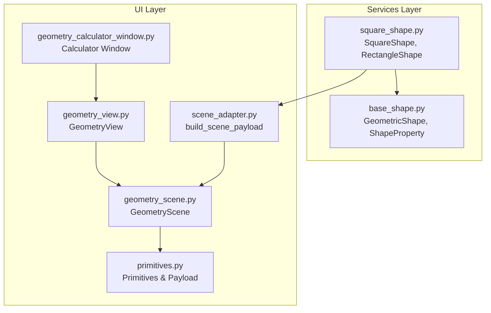
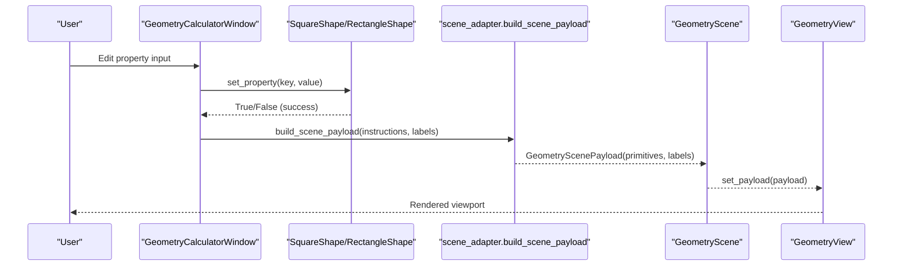
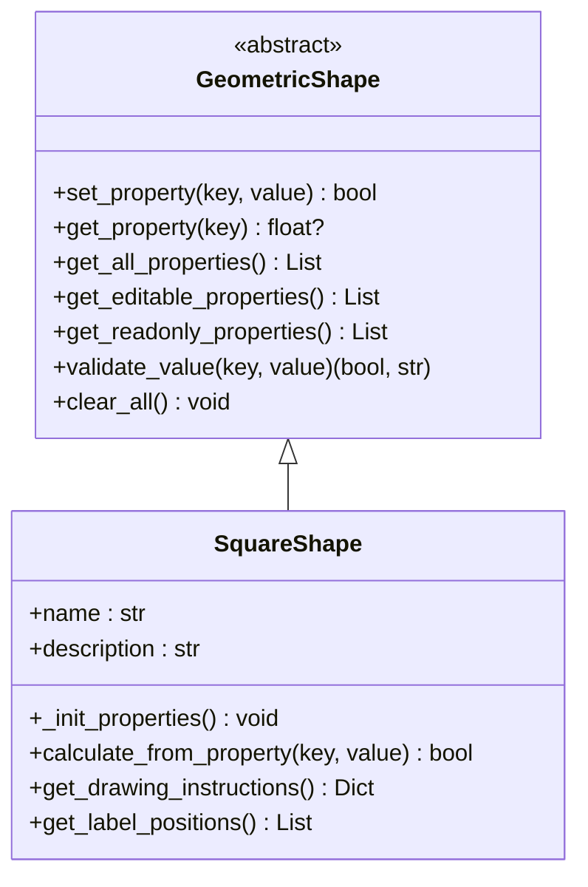
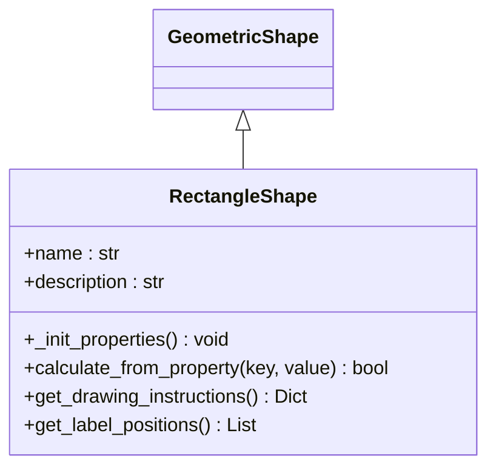
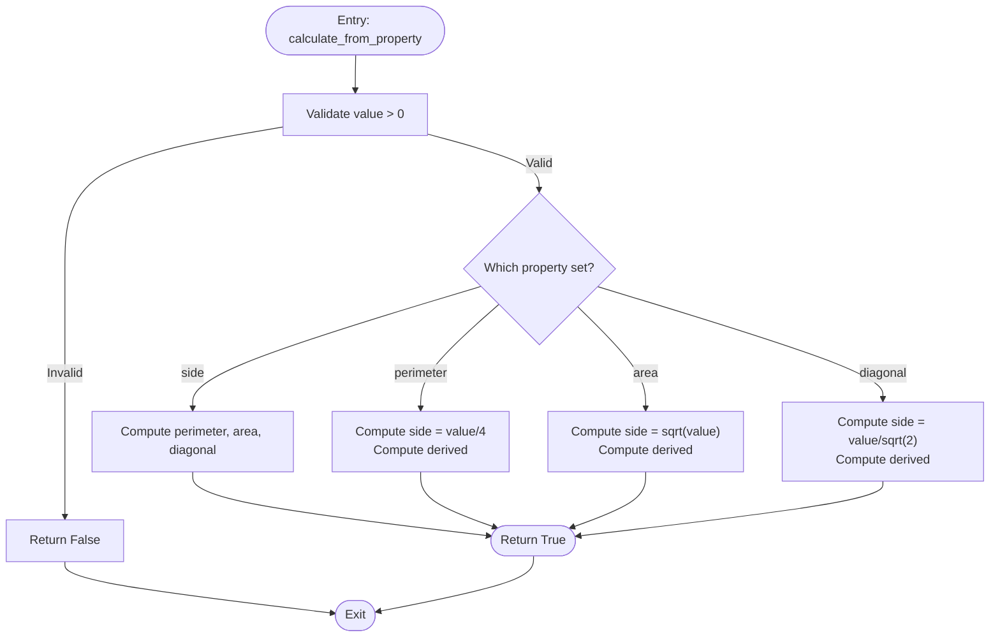
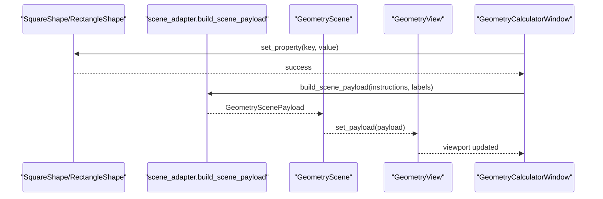
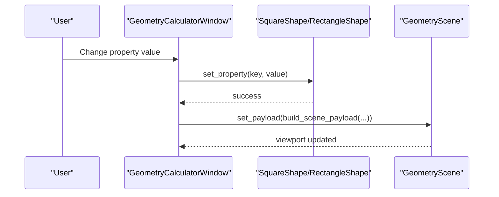
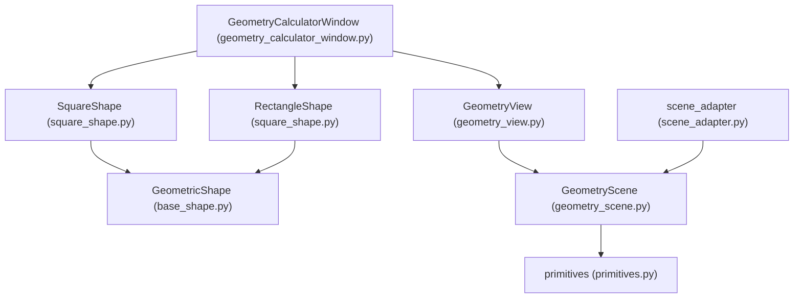

# Square and Rectangle Shapes

<cite>
**Referenced Files in This Document**
- [square_shape.py](file://src/pillars/geometry/services/square_shape.py)
- [base_shape.py](file://src/pillars/geometry/services/base_shape.py)
- [geometry_calculator_window.py](file://src/pillars/geometry/ui/geometry_calculator_window.py)
- [geometry_view.py](file://src/pillars/geometry/ui/geometry_view.py)
- [geometry_scene.py](file://src/pillars/geometry/ui/geometry_scene.py)
- [scene_adapter.py](file://src/pillars/geometry/ui/scene_adapter.py)
- [primitives.py](file://src/pillars/geometry/ui/primitives.py)
- [verify_geometry_fixes.py](file://tests/verify_geometry_fixes.py)
- [shape_detection_service.py](file://src/pillars/geometry/services/shape_detection_service.py)
</cite>

## Table of Contents
1. [Introduction](#introduction)
2. [Project Structure](#project-structure)
3. [Core Components](#core-components)
4. [Architecture Overview](#architecture-overview)
5. [Detailed Component Analysis](#detailed-component-analysis)
6. [Dependency Analysis](#dependency-analysis)
7. [Performance Considerations](#performance-considerations)
8. [Troubleshooting Guide](#troubleshooting-guide)
9. [Conclusion](#conclusion)
10. [Appendices](#appendices)

## Introduction
This document provides API documentation for SquareShape and RectangleShape implementations within the geometry pillar. It explains bidirectional property solving, inheritance from the base geometric shape abstraction, specialization for right-angled, equilateral (square) and rectangular cases, coordinate generation, aspect ratio preservation, and integration with the GeometryView and GeometryScene for rendering. It also covers dynamic resizing in UI components, floating-point precision handling, input validation, and extensibility for future quadrilateral variants.

## Project Structure
The geometry subsystem is organized around a service layer (shapes) and a UI layer (calculator window, view, scene, and primitives). SquareShape and RectangleShape live in the services layer and expose a unified API for property-driven computation and rendering.

**Diagram sources**
- [square_shape.py](file://src/pillars/geometry/services/square_shape.py#L1-L273)
- [base_shape.py](file://src/pillars/geometry/services/base_shape.py#L1-L143)
- [geometry_calculator_window.py](file://src/pillars/geometry/ui/geometry_calculator_window.py#L1-L800)
- [geometry_view.py](file://src/pillars/geometry/ui/geometry_view.py#L1-L281)
- [geometry_scene.py](file://src/pillars/geometry/ui/geometry_scene.py#L1-L710)
- [scene_adapter.py](file://src/pillars/geometry/ui/scene_adapter.py#L1-L347)
- [primitives.py](file://src/pillars/geometry/ui/primitives.py#L1-L120)

**Section sources**
- [square_shape.py](file://src/pillars/geometry/services/square_shape.py#L1-L273)
- [base_shape.py](file://src/pillars/geometry/services/base_shape.py#L1-L143)
- [geometry_calculator_window.py](file://src/pillars/geometry/ui/geometry_calculator_window.py#L1-L800)
- [geometry_view.py](file://src/pillars/geometry/ui/geometry_view.py#L1-L281)
- [geometry_scene.py](file://src/pillars/geometry/ui/geometry_scene.py#L1-L710)
- [scene_adapter.py](file://src/pillars/geometry/ui/scene_adapter.py#L1-L347)
- [primitives.py](file://src/pillars/geometry/ui/primitives.py#L1-L120)

## Core Components
- SquareShape: Implements bidirectional property solving for a square. Given any one of side, area, perimeter, or diagonal, it computes the remaining properties and generates drawing instructions and label positions.
- RectangleShape: Implements bidirectional property solving for a rectangle. It resolves missing dimensions from combinations of length, width, area, perimeter, and diagonal, then computes dependent properties and rendering primitives.
- GeometricShape: Abstract base class defining the property model, validation, and the contract for shape calculators.
- GeometryCalculatorWindow: UI that binds shape properties to input fields, validates and updates the shape, and renders the result in the viewport.
- GeometryView and GeometryScene: Rendering infrastructure that displays primitives and labels, supports overlays, and integrates with the calculator window.
- scene_adapter: Converts shape drawing instructions into structured primitives and labels for the scene.

Key APIs:
- SquareShape.calculate_from_property(property_key, value)
- RectangleShape.calculate_from_property(property_key, value)
- GeometricShape.set_property(key, value)
- GeometricShape.get_drawing_instructions()
- GeometricShape.get_label_positions()
- GeometryCalculatorWindow._on_property_changed(key, text)
- GeometryScene.set_payload(payload)

**Section sources**
- [square_shape.py](file://src/pillars/geometry/services/square_shape.py#L1-L273)
- [base_shape.py](file://src/pillars/geometry/services/base_shape.py#L1-L143)
- [geometry_calculator_window.py](file://src/pillars/geometry/ui/geometry_calculator_window.py#L1-L800)
- [geometry_view.py](file://src/pillars/geometry/ui/geometry_view.py#L1-L281)
- [geometry_scene.py](file://src/pillars/geometry/ui/geometry_scene.py#L1-L710)
- [scene_adapter.py](file://src/pillars/geometry/ui/scene_adapter.py#L1-L347)

## Architecture Overview
The system follows a clean separation of concerns:
- Services compute properties and produce drawing instructions.
- UI binds inputs to shape properties and triggers re-rendering.
- Scene adapters translate instructions into primitives and labels.
- GeometryScene renders primitives and manages overlays and themes.

**Diagram sources**
- [geometry_calculator_window.py](file://src/pillars/geometry/ui/geometry_calculator_window.py#L1-L800)
- [square_shape.py](file://src/pillars/geometry/services/square_shape.py#L1-L273)
- [scene_adapter.py](file://src/pillars/geometry/ui/scene_adapter.py#L1-L347)
- [geometry_scene.py](file://src/pillars/geometry/ui/geometry_scene.py#L1-L710)
- [geometry_view.py](file://src/pillars/geometry/ui/geometry_view.py#L1-L281)

## Detailed Component Analysis

### SquareShape API
- Purpose: Bidirectional property solver for squares with four equal sides and right angles.
- Properties: side, perimeter, area, diagonal.
- Solving logic:
  - From side: compute perimeter, area, diagonal.
  - From perimeter: compute side, then derived values.
  - From area: compute side, then derived values.
  - From diagonal: compute side, then derived values.
- Drawing instructions: centered square polygon with optional diagonal overlays.
- Labels: side, area, diagonal positioned near the shape.

**Diagram sources**
- [base_shape.py](file://src/pillars/geometry/services/base_shape.py#L1-L143)
- [square_shape.py](file://src/pillars/geometry/services/square_shape.py#L1-L115)

**Section sources**
- [square_shape.py](file://src/pillars/geometry/services/square_shape.py#L1-L115)
- [base_shape.py](file://src/pillars/geometry/services/base_shape.py#L1-L143)

### RectangleShape API
- Purpose: Bidirectional property solver for rectangles with opposite sides equal and right angles.
- Properties: length, width, perimeter, area, diagonal.
- Solving logic:
  - Given any one dimension and one dependent property (area, perimeter, diagonal), derive the other dimension.
  - Once both dimensions are known, compute perimeter, area, and diagonal.
- Drawing instructions: centered rectangle polygon with optional diagonal overlays.
- Labels: length, width, area, diagonal positioned near the shape.

**Diagram sources**
- [base_shape.py](file://src/pillars/geometry/services/base_shape.py#L1-L143)
- [square_shape.py](file://src/pillars/geometry/services/square_shape.py#L116-L273)

**Section sources**
- [square_shape.py](file://src/pillars/geometry/services/square_shape.py#L116-L273)
- [base_shape.py](file://src/pillars/geometry/services/base_shape.py#L1-L143)

### Bidirectional Property Solving Details
- Square:
  - side = f(perimeter), side = f(area), side = f(diagonal)
  - Derived: perimeter = 4 × side, area = side², diagonal = side × √2
- Rectangle:
  - Resolve missing dimension from combinations of length/width with area/perimeter/diagonal.
  - Derived: perimeter = 2 × (length + width), area = length × width, diagonal = sqrt(length² + width²)

**Diagram sources**
- [square_shape.py](file://src/pillars/geometry/services/square_shape.py#L47-L115)

**Section sources**
- [square_shape.py](file://src/pillars/geometry/services/square_shape.py#L47-L115)

### Rendering Pipeline and Integration
- Drawing instructions: Both shapes return polygon instructions with optional diagonal overlays.
- Scene adapter: Translates drawing instructions into primitives and labels.
- GeometryScene: Renders primitives, labels, axes, and supports overlays and themes.
- GeometryView: Provides viewport controls (zoom, fit, measurement mode).
- Calculator window: Binds inputs to shape properties and triggers updates.

**Diagram sources**
- [square_shape.py](file://src/pillars/geometry/services/square_shape.py#L72-L115)
- [scene_adapter.py](file://src/pillars/geometry/ui/scene_adapter.py#L1-L347)
- [geometry_scene.py](file://src/pillars/geometry/ui/geometry_scene.py#L1-L710)
- [geometry_view.py](file://src/pillars/geometry/ui/geometry_view.py#L1-L281)
- [geometry_calculator_window.py](file://src/pillars/geometry/ui/geometry_calculator_window.py#L1-L800)

**Section sources**
- [scene_adapter.py](file://src/pillars/geometry/ui/scene_adapter.py#L1-L347)
- [geometry_scene.py](file://src/pillars/geometry/ui/geometry_scene.py#L1-L710)
- [geometry_view.py](file://src/pillars/geometry/ui/geometry_view.py#L1-L281)
- [geometry_calculator_window.py](file://src/pillars/geometry/ui/geometry_calculator_window.py#L1-L800)

### Dynamic Resizing in UI Components
- The calculator window creates property input fields for all shape properties and connects signals to update the shape and viewport.
- The viewport supports zoom, fit-to-bounds, and measurement mode toggles.
- The scene derives bounds from primitives and fits the view accordingly.

**Diagram sources**
- [geometry_calculator_window.py](file://src/pillars/geometry/ui/geometry_calculator_window.py#L1-L800)
- [geometry_scene.py](file://src/pillars/geometry/ui/geometry_scene.py#L1-L710)
- [scene_adapter.py](file://src/pillars/geometry/ui/scene_adapter.py#L1-L347)

**Section sources**
- [geometry_calculator_window.py](file://src/pillars/geometry/ui/geometry_calculator_window.py#L1-L800)
- [geometry_view.py](file://src/pillars/geometry/ui/geometry_view.py#L1-L281)
- [geometry_scene.py](file://src/pillars/geometry/ui/geometry_scene.py#L1-L710)

### Floating-Point Precision and Validation
- Positive-value validation: All geometric properties must be greater than zero.
- Tests demonstrate tolerance checks for rectangle solving (e.g., width derived from area and length).
- Scene bounds and overlays use numeric computations; tolerance is handled via built-in math functions.

**Section sources**
- [base_shape.py](file://src/pillars/geometry/services/base_shape.py#L122-L138)
- [verify_geometry_fixes.py](file://tests/verify_geometry_fixes.py#L1-L81)

### Extensibility for Future Quadrilateral Variants
- SquareShape and RectangleShape inherit from GeometricShape, enabling consistent property modeling and rendering.
- The scene adapter supports polygon primitives and diagonal overlays, facilitating extension to other quadrilaterals (e.g., parallelograms, rhombuses) by adding new shape classes and drawing instruction types.

**Section sources**
- [base_shape.py](file://src/pillars/geometry/services/base_shape.py#L1-L143)
- [scene_adapter.py](file://src/pillars/geometry/ui/scene_adapter.py#L98-L141)

## Dependency Analysis
- SquareShape and RectangleShape depend on GeometricShape for property management and validation.
- UI components depend on shape calculators for property updates and on scene adapter for rendering.
- GeometryScene depends on primitives to render shapes and labels.

**Diagram sources**
- [base_shape.py](file://src/pillars/geometry/services/base_shape.py#L1-L143)
- [square_shape.py](file://src/pillars/geometry/services/square_shape.py#L1-L273)
- [geometry_calculator_window.py](file://src/pillars/geometry/ui/geometry_calculator_window.py#L1-L800)
- [geometry_view.py](file://src/pillars/geometry/ui/geometry_view.py#L1-L281)
- [geometry_scene.py](file://src/pillars/geometry/ui/geometry_scene.py#L1-L710)
- [scene_adapter.py](file://src/pillars/geometry/ui/scene_adapter.py#L1-L347)
- [primitives.py](file://src/pillars/geometry/ui/primitives.py#L1-L120)

**Section sources**
- [base_shape.py](file://src/pillars/geometry/services/base_shape.py#L1-L143)
- [square_shape.py](file://src/pillars/geometry/services/square_shape.py#L1-L273)
- [geometry_calculator_window.py](file://src/pillars/geometry/ui/geometry_calculator_window.py#L1-L800)
- [geometry_view.py](file://src/pillars/geometry/ui/geometry_view.py#L1-L281)
- [geometry_scene.py](file://src/pillars/geometry/ui/geometry_scene.py#L1-L710)
- [scene_adapter.py](file://src/pillars/geometry/ui/scene_adapter.py#L1-L347)
- [primitives.py](file://src/pillars/geometry/ui/primitives.py#L1-L120)

## Performance Considerations
- Property resolution is O(1) per shape; minimal overhead.
- Scene rendering uses Qt primitives; performance scales with number of primitives and labels.
- Tolerance checks and numeric operations are lightweight; avoid excessive re-renders by debouncing input events in the UI.

## Troubleshooting Guide
- Invalid input values: Ensure all geometric properties are positive; negative or zero values are rejected.
- Rectangle solving failures: Verify that derived dimensions satisfy constraints (e.g., diagonal > length/width).
- UI not updating: Confirm that the calculator window’s property change handler invokes shape.set_property and scene.set_payload.
- Overlays not visible: Toggle “Labels” and “Axes” in the calculator window’s display controls.

**Section sources**
- [base_shape.py](file://src/pillars/geometry/services/base_shape.py#L122-L138)
- [geometry_calculator_window.py](file://src/pillars/geometry/ui/geometry_calculator_window.py#L1-L800)
- [geometry_scene.py](file://src/pillars/geometry/ui/geometry_scene.py#L1-L710)

## Conclusion
SquareShape and RectangleShape provide robust, bidirectional property solvers for squares and rectangles, integrated seamlessly with the geometry UI stack. Their design leverages a common base class, consistent property modeling, and a clear rendering pipeline. The system supports dynamic resizing, precise validation, and extensibility for additional quadrilateral variants.

## Appendices

### API Reference Summary

- SquareShape
  - Methods: calculate_from_property, get_drawing_instructions, get_label_positions
  - Properties: side, perimeter, area, diagonal
  - Notes: Uses algebraic formulas for side, perimeter, area, diagonal.

- RectangleShape
  - Methods: calculate_from_property, get_drawing_instructions, get_label_positions
  - Properties: length, width, perimeter, area, diagonal
  - Notes: Resolves missing dimension from combinations of length/width with area/perimeter/diagonal.

- GeometricShape
  - Methods: set_property, get_property, get_all_properties, get_editable_properties, get_readonly_properties, validate_value, clear_all
  - Notes: Enforces positive values for geometric properties.

- GeometryCalculatorWindow
  - Responsibilities: Creates property inputs, validates and updates shape, builds scene payload, and controls viewport.

- GeometryScene and scene_adapter
  - Responsibilities: Convert drawing instructions to primitives and labels; manage overlays and themes; derive bounds and render.

**Section sources**
- [square_shape.py](file://src/pillars/geometry/services/square_shape.py#L1-L273)
- [base_shape.py](file://src/pillars/geometry/services/base_shape.py#L1-L143)
- [geometry_calculator_window.py](file://src/pillars/geometry/ui/geometry_calculator_window.py#L1-L800)
- [geometry_scene.py](file://src/pillars/geometry/ui/geometry_scene.py#L1-L710)
- [scene_adapter.py](file://src/pillars/geometry/ui/scene_adapter.py#L1-L347)

### Example: Dynamic Resizing in UI
- The calculator window wires property inputs to shape.set_property and triggers scene updates.
- The viewport supports zoom and fit-to-bounds operations.

**Section sources**
- [geometry_calculator_window.py](file://src/pillars/geometry/ui/geometry_calculator_window.py#L1-L800)
- [geometry_view.py](file://src/pillars/geometry/ui/geometry_view.py#L1-L281)

### Example: Integration with Shape Detection
- Shape detection service can instantiate SquareShape or RectangleShape from detected quadrilateral points and set properties accordingly.

**Section sources**
- [shape_detection_service.py](file://src/pillars/geometry/services/shape_detection_service.py#L102-L138)