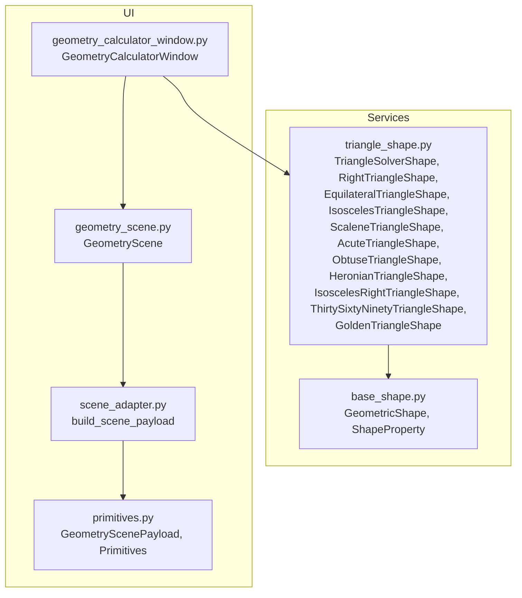
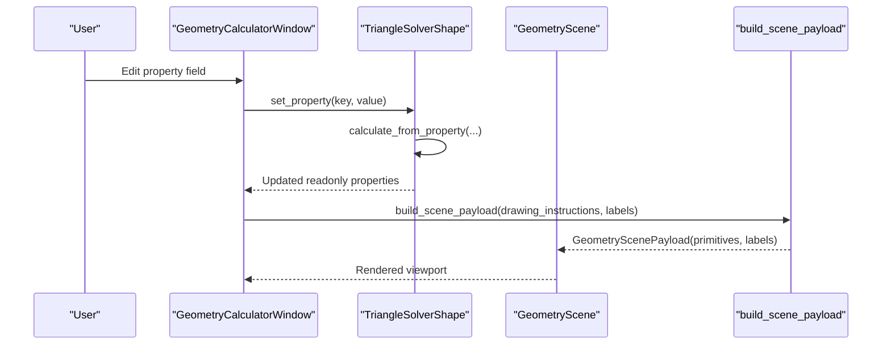
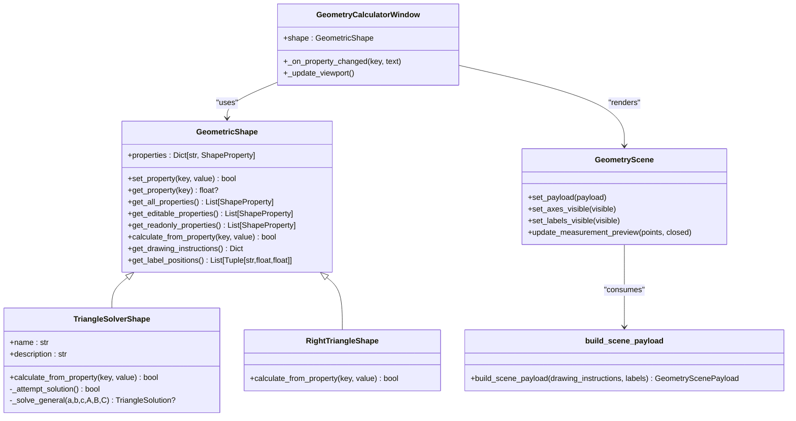
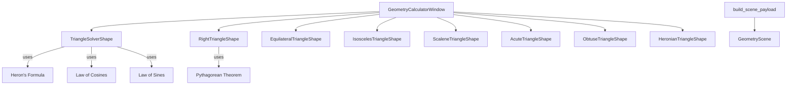

# Triangle Shape

<cite>
**Referenced Files in This Document**
- [triangle_shape.py](file://src/pillars/geometry/services/triangle_shape.py)
- [base_shape.py](file://src/pillars/geometry/services/base_shape.py)
- [geometry_calculator_window.py](file://src/pillars/geometry/ui/geometry_calculator_window.py)
- [geometry_scene.py](file://src/pillars/geometry/ui/geometry_scene.py)
- [scene_adapter.py](file://src/pillars/geometry/ui/scene_adapter.py)
- [primitives.py](file://src/pillars/geometry/ui/primitives.py)
</cite>

## Table of Contents
1. [Introduction](#introduction)
2. [Project Structure](#project-structure)
3. [Core Components](#core-components)
4. [Architecture Overview](#architecture-overview)
5. [Detailed Component Analysis](#detailed-component-analysis)
6. [Dependency Analysis](#dependency-analysis)
7. [Performance Considerations](#performance-considerations)
8. [Troubleshooting Guide](#troubleshooting-guide)
9. [Conclusion](#conclusion)
10. [Appendices](#appendices)

## Introduction
This document provides comprehensive API documentation for TriangleShape implementations within the geometry pillar. It focuses on solvers for SSS (side-side-side), SAS (side-angle-side), and right-triangle configurations, and explains how the service computes missing angles and sides using the Law of Cosines, Law of Sines, and Pythagorean theorem. It also documents property solving logic for area (via Heron’s formula), perimeter, heights, and internal angles. Integration with GeometryScene for coordinate-based rendering and interaction is described, along with usage examples for ambiguous cases (e.g., SSA), floating-point tolerance handling, triangle inequality validation, error handling for invalid configurations, and performance considerations for repeated calculations in UI contexts.

## Project Structure
The triangle-related logic resides in the geometry services module, while the UI integrates with a scene adapter and a visualization scene.

**Diagram sources**
- [triangle_shape.py](file://src/pillars/geometry/services/triangle_shape.py#L1-L1238)
- [base_shape.py](file://src/pillars/geometry/services/base_shape.py#L1-L143)
- [geometry_calculator_window.py](file://src/pillars/geometry/ui/geometry_calculator_window.py#L1-L800)
- [scene_adapter.py](file://src/pillars/geometry/ui/scene_adapter.py#L1-L347)
- [geometry_scene.py](file://src/pillars/geometry/ui/geometry_scene.py#L1-L710)
- [primitives.py](file://src/pillars/geometry/ui/primitives.py#L1-L120)

**Section sources**
- [triangle_shape.py](file://src/pillars/geometry/services/triangle_shape.py#L1-L1238)
- [base_shape.py](file://src/pillars/geometry/services/base_shape.py#L1-L143)
- [geometry_calculator_window.py](file://src/pillars/geometry/ui/geometry_calculator_window.py#L1-L800)
- [scene_adapter.py](file://src/pillars/geometry/ui/scene_adapter.py#L1-L347)
- [geometry_scene.py](file://src/pillars/geometry/ui/geometry_scene.py#L1-L710)
- [primitives.py](file://src/pillars/geometry/ui/primitives.py#L1-L120)

## Core Components
- TriangleSolverShape: General-purpose solver accepting sides and angles using SSS, SAS, ASA/AAS, and SSA relationships. Handles ambiguous cases (SSA) by computing both possible triangles and returning a solution consistent with the input constraints.
- RightTriangleShape: Specialized solver for right triangles using Pythagorean theorem and basic trigonometry. Supports combinations like two sides, or one side plus area.
- EquilateralTriangleShape: Fully constrained (1-DoF) solver using side length to compute all other properties.
- IsoscelesTriangleShape: Uses base and equal legs or height to resolve geometry and derive angles and radii.
- ScaleneTriangleShape, AcuteTriangleShape, ObtuseTriangleShape, HeronianTriangleShape: Subclasses of SSS-driven solvers with additional validation constraints.
- IsoscelesRightTriangleShape, ThirtySixtyNinetyTriangleShape, GoldenTriangleShape: Specialized families leveraging known ratios.

Key computation utilities:
- Heron’s formula for area and semi-perimeter.
- Law of Cosines for missing sides and angles.
- Law of Sines for missing sides and angles.
- Pythagorean theorem for right triangles.

**Section sources**
- [triangle_shape.py](file://src/pillars/geometry/services/triangle_shape.py#L1-L1238)
- [base_shape.py](file://src/pillars/geometry/services/base_shape.py#L1-L143)

## Architecture Overview
The TriangleShape subsystem is built around a common base class that defines properties and calculation contracts. The UI layer connects a calculator window to a scene that renders primitives produced by a scene adapter.

**Diagram sources**
- [geometry_calculator_window.py](file://src/pillars/geometry/ui/geometry_calculator_window.py#L1-L800)
- [triangle_shape.py](file://src/pillars/geometry/services/triangle_shape.py#L1047-L1238)
- [scene_adapter.py](file://src/pillars/geometry/ui/scene_adapter.py#L1-L347)
- [geometry_scene.py](file://src/pillars/geometry/ui/geometry_scene.py#L1-L710)

## Detailed Component Analysis

### TriangleSolverShape (General Solver)
- Purpose: Accepts sides and angles and solves for missing values using SSS, SAS, ASA/AAS, and SSA.
- Inputs validated:
  - Side lengths must be positive.
  - Angles must be within (0, 180).
- Computation pipeline:
  - If three sides provided, compute via Heron’s formula and Law of Cosines.
  - SAS: Use Law of Cosines to find the third side, then Law of Cosines/Sines for angles.
  - ASA/AAS: Compute missing angle (sum to 180), then Law of Sines to scale sides.
  - SSA: Compute candidate angles using Law of Sines; both acute and obtuse candidates are considered; select the valid triangle consistent with constraints.
- Outputs: side_a, side_b, side_c, angle_a_deg, angle_b_deg, angle_c_deg, area, perimeter, inradius, circumradius.

Ambiguous Case Handling (SSA):
- Computes sine of candidate angle from Law of Sines; generates both acute and obtuse candidates.
- Validates that the third angle is positive and the sum equals 180.
- Applies Law of Sines to compute all sides consistently.

Floating-Point Tolerance:
- Clamping of cosine arguments to [-1, 1] prevents numerical errors.
- Small epsilon used in triangle inequality checks.

Error Handling:
- Raises ValueError for invalid side triplets.
- Returns early with cleared solution when constraints are violated.

**Section sources**
- [triangle_shape.py](file://src/pillars/geometry/services/triangle_shape.py#L1047-L1238)

### RightTriangleShape (Pythagorean and Trigonometric)
- Supported inputs: two sides, or one side plus area.
- Solves using:
  - Pythagorean theorem for hypotenuse.
  - Area formula to derive missing dimension.
  - Perimeter and basic trigonometric relations.
- Robustness:
  - Checks inequalities for existence of solutions.
  - Iterative propagation to ensure derived values are consistent.

**Section sources**
- [triangle_shape.py](file://src/pillars/geometry/services/triangle_shape.py#L355-L560)

### SSS-Based Shapes (Equilateral, Isosceles, Scalene, Acute, Obtuse, Heronian)
- EquilateralTriangleShape: Fully constrained; any single property determines all others via known formulas.
- IsoscelesTriangleShape: Uses base and equal legs or height to compute the third dimension and angles.
- ScaleneTriangleShape: Standard SSS solver with strict inequality validation.
- AcuteTriangleShape: Adds angle validation to ensure all angles are less than 90°.
- ObtuseTriangleShape: Ensures at least one angle exceeds 90°.
- HeronianTriangleShape: Adds integer-area and integer-sides flag using tolerance checks.

Validation and Geometry:
- Triangle inequality enforced with epsilon.
- Heights computed from area and sides.
- Inradius and circumradius derived from area and semi-perimeter.

**Section sources**
- [triangle_shape.py](file://src/pillars/geometry/services/triangle_shape.py#L210-L354)
- [triangle_shape.py](file://src/pillars/geometry/services/triangle_shape.py#L562-L704)
- [triangle_shape.py](file://src/pillars/geometry/services/triangle_shape.py#L706-L784)

### Specialized Triangles
- IsoscelesRightTriangleShape: Uses 45-45-90 ratios to compute hypotenuse and area.
- ThirtySixtyNinetyTriangleShape: Uses 30-60-90 ratios to compute sides and area.
- GoldenTriangleShape: Uses golden ratio to compute base and height.

**Section sources**
- [triangle_shape.py](file://src/pillars/geometry/services/triangle_shape.py#L869-L957)
- [triangle_shape.py](file://src/pillars/geometry/services/triangle_shape.py#L959-L1045)

### Property Solving Logic
- Area: Heron’s formula using semi-perimeter.
- Perimeter: Sum of sides.
- Heights: Derived from area and respective bases.
- Internal angles: Law of Cosines for angles; sum-to-180 constraint.
- Radii:
  - Inradius: area / semi-perimeter.
  - Circumradius: abc / (4 × area).

**Section sources**
- [triangle_shape.py](file://src/pillars/geometry/services/triangle_shape.py#L46-L84)
- [triangle_shape.py](file://src/pillars/geometry/services/triangle_shape.py#L1047-L1238)

### Integration with GeometryScene and UI
- GeometryCalculatorWindow:
  - Creates property inputs bound to shape properties.
  - Updates UI fields and triggers shape calculations.
  - Manages viewport overlays and camera controls.
- Scene Adapter:
  - Translates drawing instructions into structured primitives.
  - Builds GeometryScenePayload with primitives and labels.
- GeometryScene:
  - Renders primitives, axes, labels, and temporary measurement overlays.
  - Emits measurement events and supports interactive highlights.

**Diagram sources**
- [base_shape.py](file://src/pillars/geometry/services/base_shape.py#L1-L143)
- [triangle_shape.py](file://src/pillars/geometry/services/triangle_shape.py#L1047-L1238)
- [geometry_calculator_window.py](file://src/pillars/geometry/ui/geometry_calculator_window.py#L1-L800)
- [geometry_scene.py](file://src/pillars/geometry/ui/geometry_scene.py#L1-L710)
- [scene_adapter.py](file://src/pillars/geometry/ui/scene_adapter.py#L1-L347)

## Dependency Analysis
- TriangleSolverShape depends on:
  - Heron’s formula and Law of Cosines/Law of Sines for computations.
  - Clamp and epsilon utilities for numerical stability.
  - Validation of triangle inequality and angle constraints.
- UI integration:
  - GeometryCalculatorWindow drives shape updates and triggers viewport refresh.
  - Scene adapter converts drawing instructions to primitives.
  - GeometryScene renders primitives and manages overlays.

**Diagram sources**
- [triangle_shape.py](file://src/pillars/geometry/services/triangle_shape.py#L1-L1238)
- [geometry_calculator_window.py](file://src/pillars/geometry/ui/geometry_calculator_window.py#L1-L800)
- [scene_adapter.py](file://src/pillars/geometry/ui/scene_adapter.py#L1-L347)
- [geometry_scene.py](file://src/pillars/geometry/ui/geometry_scene.py#L1-L710)

**Section sources**
- [triangle_shape.py](file://src/pillars/geometry/services/triangle_shape.py#L1-L1238)
- [geometry_calculator_window.py](file://src/pillars/geometry/ui/geometry_calculator_window.py#L1-L800)
- [scene_adapter.py](file://src/pillars/geometry/ui/scene_adapter.py#L1-L347)
- [geometry_scene.py](file://src/pillars/geometry/ui/geometry_scene.py#L1-L710)

## Performance Considerations
- Repeated calculations in UI:
  - Use the updater flag in the calculator window to prevent circular updates when synchronizing UI fields.
  - Batch updates by deferring viewport refresh until after all property changes are applied.
- Numerical stability:
  - Clamp cosine arguments to [-1, 1] to avoid domain errors.
  - Use epsilon in triangle inequality checks to avoid false negatives due to floating-point noise.
- Rendering:
  - Scene rebuilds are efficient; avoid frequent unnecessary rebuilds by updating only changed primitives.
  - Measurement preview recalculations are lightweight; keep the number of temporary items minimal.

[No sources needed since this section provides general guidance]

## Troubleshooting Guide
Common issues and resolutions:
- Invalid triangle inequality:
  - Symptom: Solver returns no solution or clears state.
  - Cause: Side lengths violate triangle inequality or negative values.
  - Resolution: Ensure sides satisfy a + b > c, a + c > b, b + c > a with epsilon tolerance.
- Ambiguous SSA case:
  - Symptom: Two possible triangles; solver selects one consistent with constraints.
  - Cause: Given side-angle pair allows two solutions.
  - Resolution: Verify which solution matches your problem context; adjust inputs accordingly.
- Angle out of range:
  - Symptom: Invalid angle input rejected.
  - Cause: Angles must be strictly between 0 and 180 degrees.
  - Resolution: Enter valid angles within the allowed range.
- Floating-point precision:
  - Symptom: Near-zero values causing instability.
  - Cause: Numerical noise near boundaries.
  - Resolution: Rely on clamp and epsilon utilities; avoid extremely small differences.

**Section sources**
- [triangle_shape.py](file://src/pillars/geometry/services/triangle_shape.py#L22-L24)
- [triangle_shape.py](file://src/pillars/geometry/services/triangle_shape.py#L1145-L1224)
- [geometry_calculator_window.py](file://src/pillars/geometry/ui/geometry_calculator_window.py#L1-L800)

## Conclusion
TriangleShape provides robust, modular solvers for common triangle configurations, integrating seamlessly with the UI and rendering pipeline. It supports SSS, SAS, ASA/AAS, and SSA scenarios, with careful handling of ambiguous cases and numerical stability. The design cleanly separates computation from visualization, enabling responsive UI updates and precise coordinate-based rendering.

[No sources needed since this section summarizes without analyzing specific files]

## Appendices

### API Reference: TriangleSolverShape
- Inputs:
  - side_a, side_b, side_c (positive floats)
  - angle_a_deg, angle_b_deg, angle_c_deg (strictly between 0 and 180)
- Outputs:
  - area, perimeter, inradius, circumradius, and all sides/angles
- Behavior:
  - Attempts solution using SSS, SAS, ASA/AAS, or SSA.
  - Returns None when insufficient information; clears solution on invalid constraints.

**Section sources**
- [triangle_shape.py](file://src/pillars/geometry/services/triangle_shape.py#L1047-L1238)

### API Reference: RightTriangleShape
- Inputs:
  - base, height, hypotenuse (positive floats)
  - area (positive float)
- Outputs:
  - All derived properties via Pythagorean theorem and area relations.

**Section sources**
- [triangle_shape.py](file://src/pillars/geometry/services/triangle_shape.py#L355-L560)

### UI Integration Notes
- GeometryCalculatorWindow:
  - Binds property inputs to shape properties.
  - Updates viewport via scene adapter and GeometryScene.
- GeometryScene:
  - Renders primitives and labels; supports overlays and measurement previews.

**Section sources**
- [geometry_calculator_window.py](file://src/pillars/geometry/ui/geometry_calculator_window.py#L1-L800)
- [geometry_scene.py](file://src/pillars/geometry/ui/geometry_scene.py#L1-L710)
- [scene_adapter.py](file://src/pillars/geometry/ui/scene_adapter.py#L1-L347)
- [primitives.py](file://src/pillars/geometry/ui/primitives.py#L1-L120)