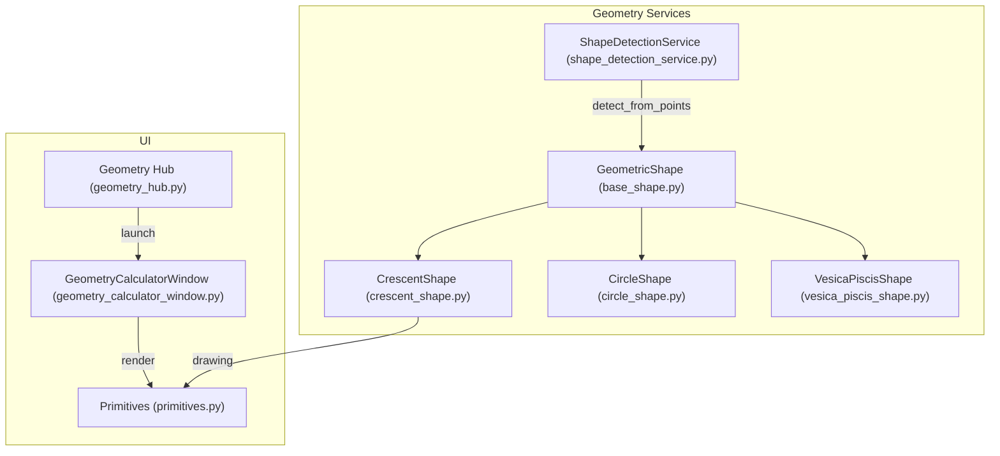
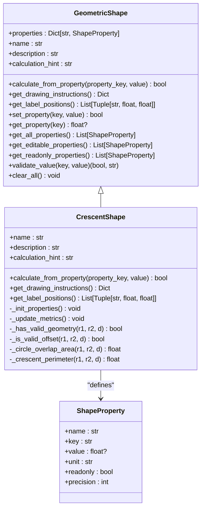
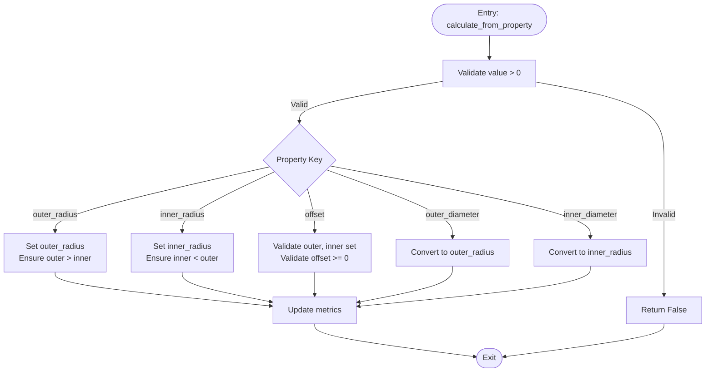
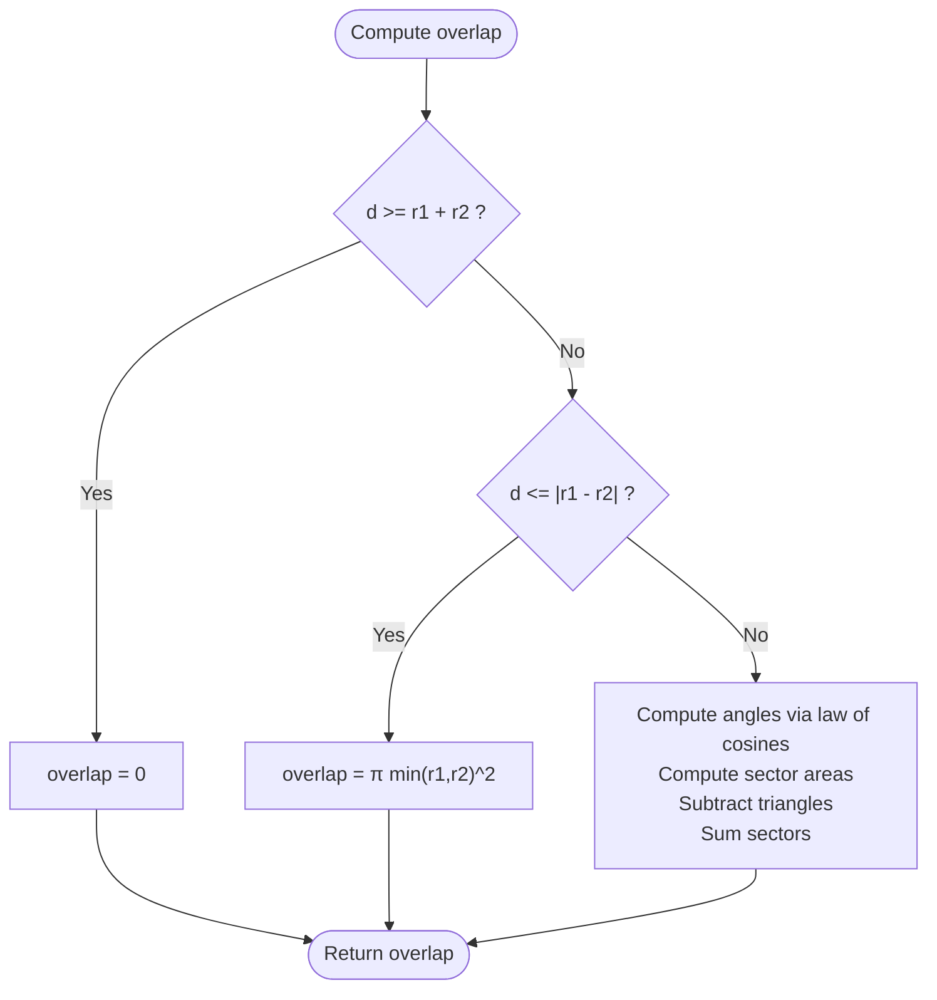
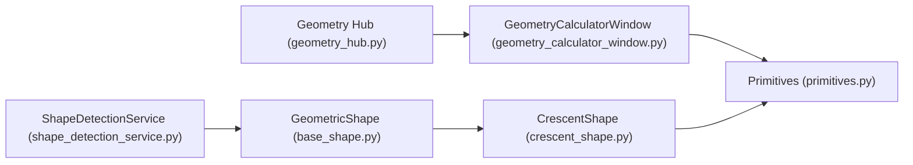

# Crescent Shapes (Lunes)

<cite>
**Referenced Files in This Document**
- [crescent_shape.py](file://src/pillars/geometry/services/crescent_shape.py)
- [base_shape.py](file://src/pillars/geometry/services/base_shape.py)
- [circle_shape.py](file://src/pillars/geometry/services/circle_shape.py)
- [vesica_piscis_shape.py](file://src/pillars/geometry/services/vesica_piscis_shape.py)
- [shape_detection_service.py](file://src/pillars/geometry/services/shape_detection_service.py)
- [geometry_hub.py](file://src/pillars/geometry/ui/geometry_hub.py)
- [geometry_calculator_window.py](file://src/pillars/geometry/ui/geometry_calculator_window.py)
- [primitives.py](file://src/pillars/geometry/ui/primitives.py)
</cite>

## Table of Contents
1. [Introduction](#introduction)
2. [Project Structure](#project-structure)
3. [Core Components](#core-components)
4. [Architecture Overview](#architecture-overview)
5. [Detailed Component Analysis](#detailed-component-analysis)
6. [Dependency Analysis](#dependency-analysis)
7. [Performance Considerations](#performance-considerations)
8. [Troubleshooting Guide](#troubleshooting-guide)
9. [Conclusion](#conclusion)
10. [Appendices](#appendices)

## Introduction
This document provides comprehensive API documentation for CrescentShape, a geometric shape representing a lune formed by subtracting an offset inner circle from an outer circle. It covers input parameters, validation rules, mathematical derivations for area and perimeter, drawing instructions, labeling, and integration points with the broader geometry system. It also outlines use cases in lunar phase modeling, symbolic emblems, and geometric art, along with guidance on numerical robustness and pattern recognition via shape detection.

## Project Structure
CrescentShape is implemented as a service module within the geometry pillar. It integrates with the base shape abstraction, UI windows for interactive calculation, and a shape detection service for pattern recognition from point data.

**Diagram sources**
- [crescent_shape.py](file://src/pillars/geometry/services/crescent_shape.py#L1-L274)
- [base_shape.py](file://src/pillars/geometry/services/base_shape.py#L1-L143)
- [circle_shape.py](file://src/pillars/geometry/services/circle_shape.py#L1-L234)
- [vesica_piscis_shape.py](file://src/pillars/geometry/services/vesica_piscis_shape.py#L1-L224)
- [shape_detection_service.py](file://src/pillars/geometry/services/shape_detection_service.py#L1-L158)
- [geometry_hub.py](file://src/pillars/geometry/ui/geometry_hub.py#L1-L200)
- [geometry_calculator_window.py](file://src/pillars/geometry/ui/geometry_calculator_window.py#L1-L200)
- [primitives.py](file://src/pillars/geometry/ui/primitives.py#L1-L120)

**Section sources**
- [crescent_shape.py](file://src/pillars/geometry/services/crescent_shape.py#L1-L274)
- [base_shape.py](file://src/pillars/geometry/services/base_shape.py#L1-L143)
- [geometry_hub.py](file://src/pillars/geometry/ui/geometry_hub.py#L150-L189)

## Core Components
- CrescentShape: Implements lune geometry with two radii and a center offset, computes overlap area, crescent area, and perimeter, and generates drawing instructions and labels.
- GeometricShape: Base class defining the property model, validation, and calculation contract.
- CircleShape: Reference implementation for circular computations and segment areas.
- VesicaPiscisShape: Alternative lens-shaped intersection useful for comparison and validation.
- ShapeDetectionService: Pattern recognition from point sets for shape classification.
- UI Integration: GeometryCalculatorWindow renders properties and visualization; primitives define scene payload.

**Section sources**
- [crescent_shape.py](file://src/pillars/geometry/services/crescent_shape.py#L1-L274)
- [base_shape.py](file://src/pillars/geometry/services/base_shape.py#L1-L143)
- [circle_shape.py](file://src/pillars/geometry/services/circle_shape.py#L1-L234)
- [vesica_piscis_shape.py](file://src/pillars/geometry/services/vesica_piscis_shape.py#L1-L224)
- [shape_detection_service.py](file://src/pillars/geometry/services/shape_detection_service.py#L1-L158)
- [geometry_calculator_window.py](file://src/pillars/geometry/ui/geometry_calculator_window.py#L1-L200)
- [primitives.py](file://src/pillars/geometry/ui/primitives.py#L1-L120)

## Architecture Overview
CrescentShape adheres to the GeometricShape contract, exposing a set of ShapeProperty entries and implementing calculate_from_property, get_drawing_instructions, and get_label_positions. The UI binds to these properties and invokes rendering via a scene payload.

**Diagram sources**
- [base_shape.py](file://src/pillars/geometry/services/base_shape.py#L1-L143)
- [crescent_shape.py](file://src/pillars/geometry/services/crescent_shape.py#L1-L274)

## Detailed Component Analysis

### CrescentShape API
- Properties
  - outer_radius, inner_radius, offset: editable inputs.
  - outer_diameter, inner_diameter: derived from radii.
  - intersection_area, crescent_area, perimeter: readonly computed values.
- Validation
  - Positive values enforced.
  - Geometry validity requires outer > inner and a valid offset.
  - Offset validation allows non-negative offsets; the implementation currently accepts any non-negative offset.
- Calculations
  - Overlap area computed using circular segment subtraction.
  - Crescent area equals outer circle area minus overlap.
  - Perimeter computed as arc-length sums depending on configuration (disjoint, nested, intersecting).
- Drawing Instructions
  - Composite drawing with difference boolean operation between outer and inner circles.
  - Optional dashed outline of the inner circle for reference.
- Labeling
  - Labels for radii, offset, and crescent area positioned near geometry.

**Diagram sources**
- [crescent_shape.py](file://src/pillars/geometry/services/crescent_shape.py#L70-L108)
- [crescent_shape.py](file://src/pillars/geometry/services/crescent_shape.py#L109-L131)
- [crescent_shape.py](file://src/pillars/geometry/services/crescent_shape.py#L140-L144)

**Section sources**
- [crescent_shape.py](file://src/pillars/geometry/services/crescent_shape.py#L23-L68)
- [crescent_shape.py](file://src/pillars/geometry/services/crescent_shape.py#L70-L108)
- [crescent_shape.py](file://src/pillars/geometry/services/crescent_shape.py#L109-L131)
- [crescent_shape.py](file://src/pillars/geometry/services/crescent_shape.py#L132-L182)
- [crescent_shape.py](file://src/pillars/geometry/services/crescent_shape.py#L183-L274)

### Mathematical Derivations

- Overlap Area (Two Circles)
  - Disjoint (distance >= sum radii): overlap = 0.
  - One inside the other (distance <= |r1 - r2|): overlap = area of smaller circle.
  - Intersecting: compute angles using law of cosines, then subtract triangle areas from circular sectors.
- Crescent Area
  - Crescent area = π r1^2 − overlap area.
- Perimeter
  - Disjoint: perimeter = circumference of outer circle.
  - One inside the other: perimeter = sum of outer and inner circumferences.
  - Intersecting: perimeter = (outer arc length) + (inner arc length), where arcs correspond to the non-overlapping portions.

**Diagram sources**
- [crescent_shape.py](file://src/pillars/geometry/services/crescent_shape.py#L145-L162)

**Section sources**
- [crescent_shape.py](file://src/pillars/geometry/services/crescent_shape.py#L145-L182)

### Input Parameters and Validation
- Primary circle: center at origin, radius r1 (outer_radius).
- Secondary circle: center at (d, 0), radius r2 (inner_radius).
- Constraints:
  - r1 > r2 (outer greater than inner).
  - d >= 0 (non-negative offset).
  - Values must be positive.

Validation behavior:
- Positive value enforcement occurs before any geometric checks.
- Geometry validity requires r1 > r2 and a valid offset.
- Offset validation currently accepts any non-negative value.

**Section sources**
- [crescent_shape.py](file://src/pillars/geometry/services/crescent_shape.py#L70-L108)
- [crescent_shape.py](file://src/pillars/geometry/services/crescent_shape.py#L132-L144)

### Area Derivation Using Circular Segments
- The overlap area is derived from circular segments:
  - Sector area minus triangle area for each circle.
  - Angles computed from distance and radii using the law of cosines.
- Crescent area is simply the outer circle area minus the overlap.

**Section sources**
- [crescent_shape.py](file://src/pillars/geometry/services/crescent_shape.py#L145-L162)

### Bounding Box and Arc Orientation
- Bounding box is implicitly handled by the scene rendering pipeline; the UI composes a scene payload with primitives and labels.
- Arc orientation:
  - The perimeter computation distinguishes between disjoint, nested, and intersecting cases.
  - In intersecting configuration, the outer arc corresponds to the major segment and the inner arc to the minor segment.

**Section sources**
- [crescent_shape.py](file://src/pillars/geometry/services/crescent_shape.py#L163-L182)
- [geometry_calculator_window.py](file://src/pillars/geometry/ui/geometry_calculator_window.py#L1-L200)
- [primitives.py](file://src/pillars/geometry/ui/primitives.py#L1-L120)

### Use Cases
- Lunar phase modeling: CrescentShape can represent waxing/waning crescents with adjustable radii and offset.
- Symbolic emblems: The crescent form appears in cultural and religious contexts; the shape supports asymmetric configurations via offset.
- Geometric art: The boolean difference operation enables artistic compositions with filled regions and borders.

[No sources needed since this section provides general guidance]

### Constructing Asymmetric Crescents and Exporting Path Data
- Construction:
  - Set outer_radius, inner_radius, and offset to desired values.
  - The shape validates inputs and computes derived properties.
- Rendering:
  - get_drawing_instructions returns a composite payload with a boolean difference operation and optional dashed inner-circle outline.
  - The UI builds a scene payload and renders the shape.
- Export:
  - The drawing instructions are dictionaries suitable for downstream rendering systems.

**Section sources**
- [crescent_shape.py](file://src/pillars/geometry/services/crescent_shape.py#L183-L249)
- [geometry_calculator_window.py](file://src/pillars/geometry/ui/geometry_calculator_window.py#L1-L200)
- [primitives.py](file://src/pillars/geometry/ui/primitives.py#L1-L120)

### Numerical Robustness and Edge Cases
- Near-tangency:
  - When d ≈ r1 + r2, overlap approaches zero; the implementation treats this as disjoint.
- Small lunes:
  - When d is close to r1 − r2, the inner circle is nearly inside the outer; overlap approaches π r2^2.
- Degeneracies:
  - Negative or zero values are rejected early.
  - Equal radii with non-zero offset are allowed; the shape remains valid.

**Section sources**
- [crescent_shape.py](file://src/pillars/geometry/services/crescent_shape.py#L145-L182)

### Integration with Shape Detection Service
- The shape detection service classifies point sets into specific shapes (triangles, quadrilaterals, polygons).
- While CrescentShape is not directly detected from points, the detection service can be used to recognize simpler geometric patterns in datasets that include crescent-like features.

**Section sources**
- [shape_detection_service.py](file://src/pillars/geometry/services/shape_detection_service.py#L1-L158)

## Dependency Analysis
CrescentShape depends on the base shape abstraction and contributes to the geometry hub’s shape catalog. The UI integrates via the geometry calculator window and scene primitives.

**Diagram sources**
- [base_shape.py](file://src/pillars/geometry/services/base_shape.py#L1-L143)
- [crescent_shape.py](file://src/pillars/geometry/services/crescent_shape.py#L1-L274)
- [geometry_hub.py](file://src/pillars/geometry/ui/geometry_hub.py#L150-L189)
- [geometry_calculator_window.py](file://src/pillars/geometry/ui/geometry_calculator_window.py#L1-L200)
- [primitives.py](file://src/pillars/geometry/ui/primitives.py#L1-L120)
- [shape_detection_service.py](file://src/pillars/geometry/services/shape_detection_service.py#L1-L158)

**Section sources**
- [geometry_hub.py](file://src/pillars/geometry/ui/geometry_hub.py#L150-L189)
- [geometry_calculator_window.py](file://src/pillars/geometry/ui/geometry_calculator_window.py#L1-L200)

## Performance Considerations
- All computations are constant-time arithmetic and trigonometric operations.
- The boolean difference operation in rendering is handled by the scene pipeline; performance depends on the underlying renderer.
- For large-scale rendering or repeated recomputations, cache derived properties and avoid redundant updates.

[No sources needed since this section provides general guidance]

## Troubleshooting Guide
- Invalid inputs:
  - Ensure all values are positive and outer_radius > inner_radius.
  - The shape rejects non-positive values and invalid geometry combinations.
- Unexpected zero or large areas:
  - Verify offset placement; near-tangency or near-nesting conditions can produce extreme ratios.
- Rendering artifacts:
  - Confirm the scene payload includes the boolean difference primitive and appropriate pens/brushes.

**Section sources**
- [crescent_shape.py](file://src/pillars/geometry/services/crescent_shape.py#L70-L108)
- [crescent_shape.py](file://src/pillars/geometry/services/crescent_shape.py#L132-L182)
- [geometry_calculator_window.py](file://src/pillars/geometry/ui/geometry_calculator_window.py#L1-L200)

## Conclusion
CrescentShape provides a robust, validated implementation of lune geometry with clear inputs, accurate area and perimeter computations, and integrated rendering support. Its design aligns with the geometry framework, enabling seamless UI integration and potential pattern recognition workflows.

[No sources needed since this section summarizes without analyzing specific files]

## Appendices

### API Reference Summary
- Methods
  - calculate_from_property(property_key, value) -> bool
  - get_drawing_instructions() -> Dict
  - get_label_positions() -> List[Tuple[str, float, float]]
- Properties (editable)
  - outer_radius, inner_radius, offset
- Properties (derived)
  - outer_diameter, inner_diameter, intersection_area, crescent_area, perimeter

**Section sources**
- [crescent_shape.py](file://src/pillars/geometry/services/crescent_shape.py#L23-L68)
- [crescent_shape.py](file://src/pillars/geometry/services/crescent_shape.py#L70-L108)
- [crescent_shape.py](file://src/pillars/geometry/services/crescent_shape.py#L183-L249)