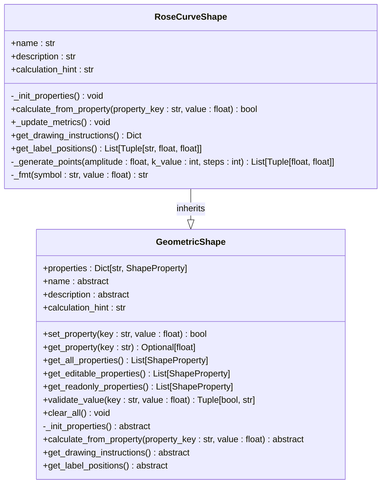
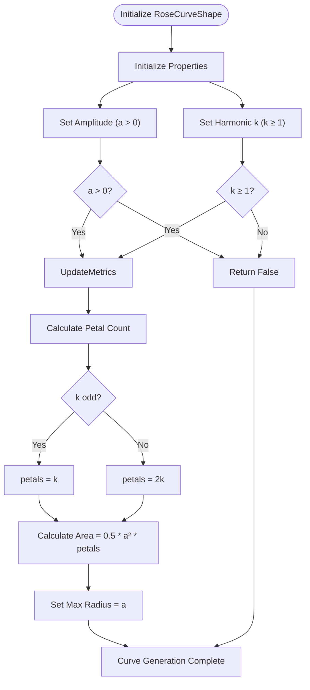
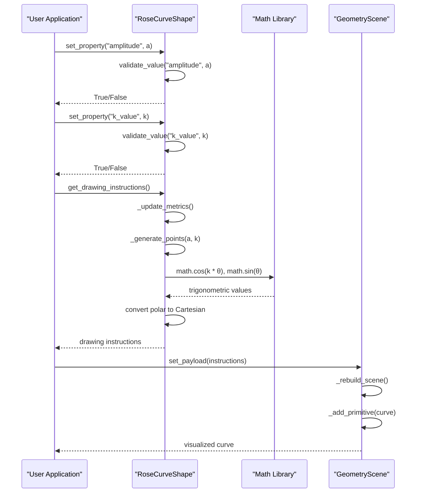
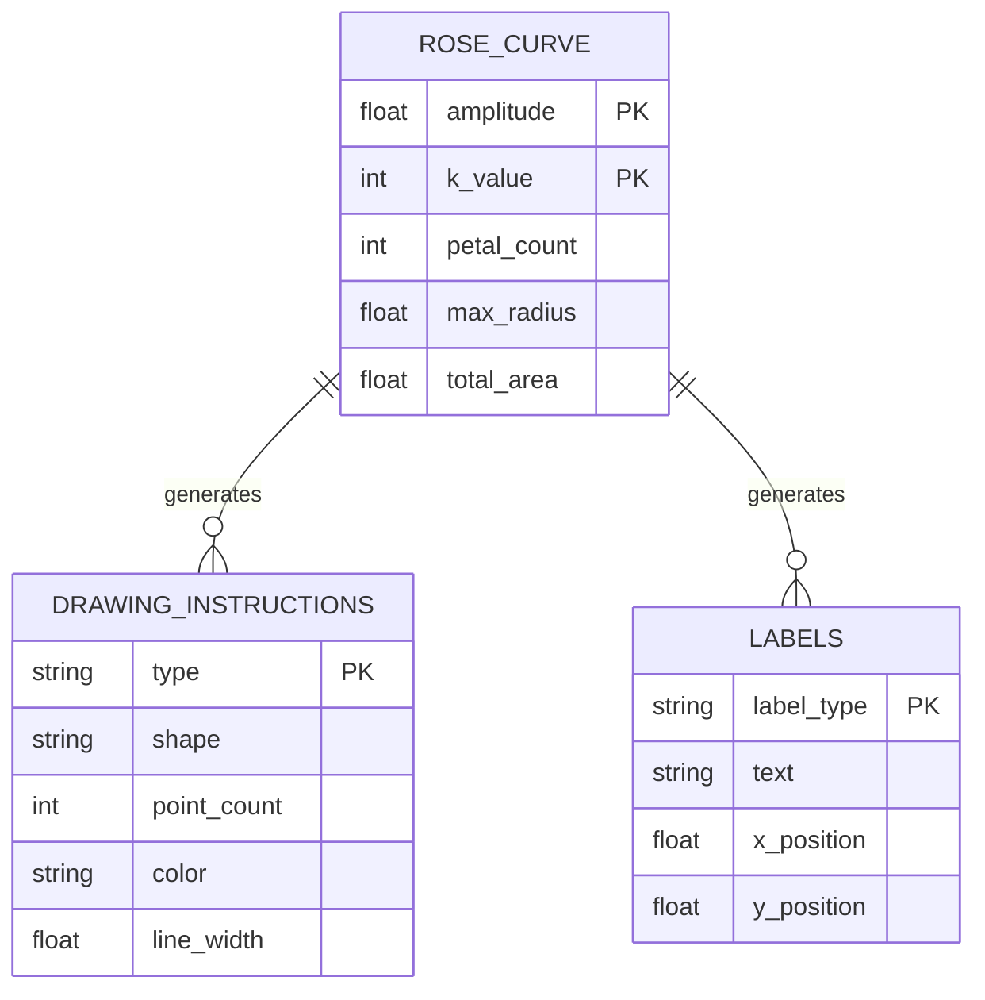
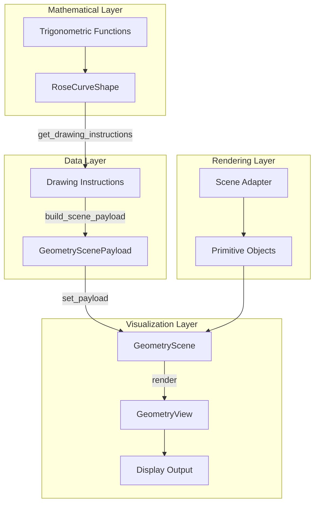
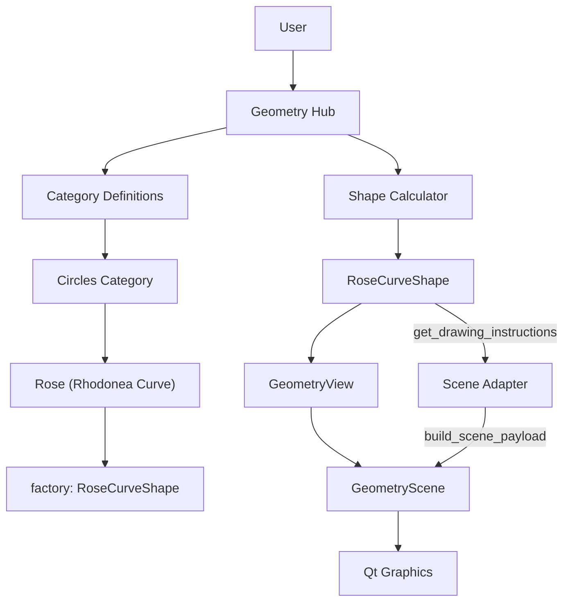

# Rose Curves

<cite>
**Referenced Files in This Document**   
- [rose_curve_shape.py](file://src/pillars/geometry/services/rose_curve_shape.py)
- [geometry_view.py](file://src/pillars/geometry/ui/geometry_view.py)
- [scene_adapter.py](file://src/pillars/geometry/ui/scene_adapter.py)
- [geometry_scene.py](file://src/pillars/geometry/ui/geometry_scene.py)
- [base_shape.py](file://src/pillars/geometry/services/base_shape.py)
- [primitives.py](file://src/pillars/geometry/ui/primitives.py)
- [geometry_hub.py](file://src/pillars/geometry/ui/geometry_hub.py)
</cite>

## Table of Contents
1. [Introduction](#introduction)
2. [Mathematical Foundation](#mathematical-foundation)
3. [Core Properties and Parameters](#core-properties-and-parameters)
4. [Numerical Stability and Sampling](#numerical-stability-and-sampling)
5. [Return Values and Output](#return-values-and-output)
6. [Visualization Pipeline](#visualization-pipeline)
7. [Usage Examples](#usage-examples)
8. [Integration with Geometry Hub](#integration-with-geometry-hub)
9. [Conclusion](#conclusion)

## Introduction

The RoseCurveShape class is a specialized geometric shape generator that creates rose (rhodonea) curves based on polar coordinate equations. These curves are characterized by their petal-like patterns and are widely used in mathematical art, sacred geometry, and harmonic visualizations. The implementation follows the standard polar equations r = a * cos(kθ) and r = a * sin(kθ), where the parameter k determines the symmetry and petal count of the resulting curve.

This API documentation provides comprehensive details on the mathematical foundation, parameter constraints, numerical considerations, and integration methods for generating and visualizing rose curves within the Geometry Hub framework.

**Section sources**
- [rose_curve_shape.py](file://src/pillars/geometry/services/rose_curve_shape.py#L1-L21)
- [geometry_hub.py](file://src/pillars/geometry/ui/geometry_hub.py#L152-L187)

## Mathematical Foundation

Rose curves are defined by the polar equations r = a * cos(kθ) and r = a * sin(kθ), where:
- r represents the radial distance from the origin
- θ represents the angular coordinate
- a is the amplitude parameter that controls the size of the curve
- k is the harmonic parameter that determines the symmetry and petal count

The parameter k plays a crucial role in determining the curve's symmetry:
- When k is an odd integer, the curve exhibits k-fold rotational symmetry with exactly k petals
- When k is an even integer, the curve exhibits 2k-fold rotational symmetry with exactly 2k petals
- For rational values of k = p/q (in reduced form), the curve completes after tracing 2πq radians
- For irrational values of k, the curve never closes and densely fills the annular region between r = 0 and r = a

The implementation uses the cosine variant (r = a * cos(kθ)) as the primary equation, which produces curves symmetric about the x-axis. The sine variant would produce identical curves rotated by π/(2k) radians.



**Diagram sources**
- [rose_curve_shape.py](file://src/pillars/geometry/services/rose_curve_shape.py#L8-L137)
- [base_shape.py](file://src/pillars/geometry/services/base_shape.py#L18-L143)

**Section sources**
- [rose_curve_shape.py](file://src/pillars/geometry/services/rose_curve_shape.py#L9-L21)

## Core Properties and Parameters

The RoseCurveShape class exposes several key properties that control the generation and appearance of rose curves:

### Input Parameters

**Amplitude (a)**
- **Key**: amplitude
- **Unit**: units
- **Constraint**: a > 0
- **Description**: Controls the maximum radial distance from the origin, determining the overall size of the curve

**Harmonic (k)**
- **Key**: k_value
- **Unit**: dimensionless
- **Constraint**: k ≥ 1 (integer values only)
- **Description**: Determines the number of petals and rotational symmetry of the curve

### Derived Properties

**Petal Count**
- **Key**: petal_count
- **Unit**: count
- **Read-only**: Yes
- **Calculation**: k if k is odd, 2k if k is even
- **Description**: The number of distinct petals in the rose curve

**Max Radius**
- **Key**: max_radius
- **Unit**: units
- **Read-only**: Yes
- **Calculation**: Equal to the amplitude (a)
- **Description**: The maximum distance from the origin reached by the curve

**Total Area**
- **Key**: total_area
- **Unit**: units²
- **Read-only**: Yes
- **Calculation**: 0.5 * a² * petals
- **Description**: The total area enclosed by all petals of the curve

The parameter validation ensures that both amplitude and k_value are positive, with k_value being constrained to integer values greater than or equal to 1. This prevents mathematical inconsistencies and ensures stable curve generation.



**Diagram sources**
- [rose_curve_shape.py](file://src/pillars/geometry/services/rose_curve_shape.py#L23-L54)
- [rose_curve_shape.py](file://src/pillars/geometry/services/rose_curve_shape.py#L56-L71)

**Section sources**
- [rose_curve_shape.py](file://src/pillars/geometry/services/rose_curve_shape.py#L23-L86)

## Numerical Stability and Sampling

The implementation addresses several numerical considerations to ensure stable and accurate curve generation:

### Angular Sampling Density

The curve is generated by sampling points along the angular coordinate θ at regular intervals. The implementation uses a fixed number of steps (default: 1200) to ensure smooth rendering:

- Minimum steps: 360 (ensures at least 1 degree resolution)
- Default steps: 1200 (provides approximately 0.3 degree resolution)
- Higher step counts produce smoother curves but increase computational cost

The sampling interval Δθ = 2π / total_steps ensures complete coverage of the polar coordinate system over the interval [0, 2π].

### Trigonometric Evaluation

The implementation carefully handles trigonometric evaluations to maintain numerical stability:

- Uses standard math.cos() and math.sin() functions from Python's math module
- Computes radius = amplitude * cos(k * θ) for each angular sample
- Converts polar coordinates (r, θ) to Cartesian coordinates (x, y) using:
  - x = r * cos(θ)
  - y = r * sin(θ)

Special attention is paid to cases where the radius becomes negative, which is mathematically valid in polar coordinates and results in points being plotted in the opposite direction from the origin.

### Floating-Point Precision

The implementation manages floating-point precision issues by:

- Using double-precision floating-point arithmetic throughout
- Rounding the k_value parameter to the nearest integer to prevent fractional harmonics
- Setting appropriate precision (4 decimal places) for display values
- Handling edge cases where amplitude or k_value are not properly set



**Diagram sources**
- [rose_curve_shape.py](file://src/pillars/geometry/services/rose_curve_shape.py#L107-L116)
- [scene_adapter.py](file://src/pillars/geometry/ui/scene_adapter.py#L19-L54)
- [geometry_scene.py](file://src/pillars/geometry/ui/geometry_scene.py#L440-L463)

**Section sources**
- [rose_curve_shape.py](file://src/pillars/geometry/services/rose_curve_shape.py#L107-L116)

## Return Values and Output

The RoseCurveShape class provides multiple methods for accessing the generated curve data:

### Drawing Instructions

The `get_drawing_instructions()` method returns a dictionary containing all information needed to render the curve:

- **Type**: "composite" (indicating multiple primitives)
- **Primitives**: List containing a single polyline primitive
  - **Shape**: "polyline"
  - **Points**: List of (x, y) coordinate tuples
  - **Pen**: Styling information (color: rose pink (236, 72, 153), width: 2.0)

When no valid parameters are set, returns {"type": "empty"} to indicate an empty curve.

### Vertex Arrays

The generated points are returned as a list of coordinate tuples through the `_generate_points()` method:

- Each point is represented as (x, y) in Cartesian coordinates
- The number of points is determined by the steps parameter (minimum 360, default 1200)
- Points are generated in order of increasing θ from 0 to 2π

### Labels and Metadata

The `get_label_positions()` method returns a list of tuples containing label information:

- **Amplitude label**: "a = [value]" positioned at (0.7a, 0.2)
- **Harmonic label**: "k = [value]" positioned at (-0.7a, 0.2)
- **Petal count label**: "petals = [value]" positioned at (0, 0.3a)
- **Area label**: "A = [value]" positioned at (0, -0.3a)

The `_fmt()` utility method formats these labels with appropriate precision, removing trailing zeros and decimal points.

### Rotational Symmetry

The rotational symmetry order is derived from the k_value parameter:

- For odd k: k-fold rotational symmetry
- For even k: 2k-fold rotational symmetry

This information is not directly returned but can be inferred from the petal_count property.



**Diagram sources**
- [rose_curve_shape.py](file://src/pillars/geometry/services/rose_curve_shape.py#L87-L104)
- [rose_curve_shape.py](file://src/pillars/geometry/services/rose_curve_shape.py#L118-L136)
- [primitives.py](file://src/pillars/geometry/ui/primitives.py#L96-L106)

**Section sources**
- [rose_curve_shape.py](file://src/pillars/geometry/services/rose_curve_shape.py#L87-L136)

## Visualization Pipeline

The rose curve visualization is achieved through a pipeline that converts mathematical data into graphical primitives:

### Scene Adapter Pattern

The `build_scene_payload()` function in scene_adapter.py converts the legacy drawing dictionary format into structured primitives:

- Translates "polyline" shapes into PolygonPrimitive objects
- Processes pen styling (color, width, dashed)
- Calculates bounding boxes for proper scene framing
- Suggests appropriate grid spacing based on curve dimensions

### Geometry Scene Rendering

The GeometryScene class renders the curve using Qt's QGraphics framework:

- **Primitives**: The curve is rendered as a polyline using LinePrimitive objects
- **Styling**: Rose pink color (236, 72, 153) with 2.0 width
- **Coordinate System**: Cartesian coordinates with origin at center
- **Scaling**: Automatic scaling to fit the scene bounds
- **Axes**: Optional Cartesian axes for reference

### View Integration

The GeometryView class provides user interaction capabilities:

- **Zooming**: Supports zoom in/out via wheel events or buttons
- **Panning**: Middle-click drag for navigation
- **Measurement**: Click-based distance measurement mode
- **Selection**: Rubber-band selection for multiple items

The visualization automatically adjusts to show the complete curve with appropriate padding around the bounds.



**Diagram sources**
- [scene_adapter.py](file://src/pillars/geometry/ui/scene_adapter.py#L19-L54)
- [geometry_scene.py](file://src/pillars/geometry/ui/geometry_scene.py#L104-L112)
- [geometry_view.py](file://src/pillars/geometry/ui/geometry_view.py#L50-L67)

**Section sources**
- [scene_adapter.py](file://src/pillars/geometry/ui/scene_adapter.py#L19-L54)
- [geometry_scene.py](file://src/pillars/geometry/ui/geometry_scene.py#L104-L112)
- [geometry_view.py](file://src/pillars/geometry/ui/geometry_view.py#L50-L67)

## Usage Examples

The RoseCurveShape class can be used to generate various types of curves for different applications:

### Floral Patterns

```python
# Create a 5-petal rose (k=5, odd)
rose = RoseCurveShape()
rose.set_property("amplitude", 5.0)
rose.set_property("k_value", 5.0)
# Results in 5 petals with 5-fold symmetry
```

### Sacred Geometry Motifs

```python
# Create a 12-petal rose (k=6, even)
rose = RoseCurveShape()
rose.set_property("amplitude", 4.0)
rose.set_property("k_value", 6.0)
# Results in 12 petals with 12-fold symmetry
```

### Harmonic Visualizations

```python
# Create a 3-petal rose for harmonic studies
rose = RoseCurveShape()
rose.set_property("amplitude", 3.0)
rose.set_property("k_value", 3.0)
# Results in 3 petals representing triadic harmony
```

### Dynamic Curve Generation

```python
# Generate a series of curves with increasing k values
for k in range(1, 9):
    rose = RoseCurveShape()
    rose.set_property("amplitude", 4.0)
    rose.set_property("k_value", k)
    # Each curve will have k or 2k petals depending on parity
```

These examples demonstrate how simple parameter changes can create dramatically different visual patterns, making rose curves versatile for artistic and mathematical applications.

**Section sources**
- [rose_curve_shape.py](file://src/pillars/geometry/services/rose_curve_shape.py#L82-L83)
- [rose_curve_shape.py](file://src/pillars/geometry/services/rose_curve_shape.py#L118-L132)

## Integration with Geometry Hub

The RoseCurveShape class is fully integrated into the Geometry Hub application:

### UI Registration

The curve generator is registered in the Geometry Hub's category system under "Circles" with the following properties:

- **Name**: "Rose (Rhodonea Curve)"
- **Summary**: "Amplitude and harmonic-driven petal curves"
- **Factory**: RoseCurveShape class reference

### Parameter Interface

The UI exposes the following controls:

- **Amplitude slider/input**: For setting the a parameter (a > 0)
- **Harmonic input**: For setting the k parameter (k ≥ 1)
- **Read-only displays**: Showing petal count, max radius, and total area
- **Visual feedback**: Real-time curve updates as parameters change

### Visualization Context

The curve appears in the main geometry view with:

- **Default styling**: Rose pink stroke (236, 72, 153)
- **Interactive controls**: Zoom, pan, and measurement tools
- **Coordinate system**: Centered origin with optional axes
- **Labeling**: Automatic placement of parameter labels

The integration allows users to explore the mathematical properties of rose curves through immediate visual feedback, making it an effective educational and creative tool.



**Diagram sources**
- [geometry_hub.py](file://src/pillars/geometry/ui/geometry_hub.py#L152-L187)
- [geometry_view.py](file://src/pillars/geometry/ui/geometry_view.py#L20-L46)
- [geometry_scene.py](file://src/pillars/geometry/ui/geometry_scene.py#L69-L99)

**Section sources**
- [geometry_hub.py](file://src/pillars/geometry/ui/geometry_hub.py#L152-L187)

## Conclusion

The RoseCurveShape class provides a robust implementation of polar coordinate-based rose curves with comprehensive parameter control and visualization capabilities. By implementing the standard equations r = a * cos(kθ) and r = a * sin(kθ), it enables the generation of mathematically accurate curves with predictable petal counts and symmetries.

Key features include:
- Precise control over amplitude (a > 0) and harmonic (k ≥ 1) parameters
- Automatic calculation of petal count, max radius, and total area
- High-resolution sampling for smooth curve rendering
- Integration with the Geometry Hub's visualization framework
- Support for various applications including floral patterns, sacred geometry, and harmonic studies

The implementation demonstrates a clean separation between mathematical computation and visual representation, following object-oriented design principles through inheritance from the GeometricShape base class. This architecture allows for easy extension and integration within the broader geometry processing ecosystem.