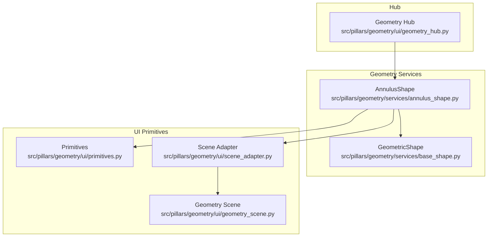
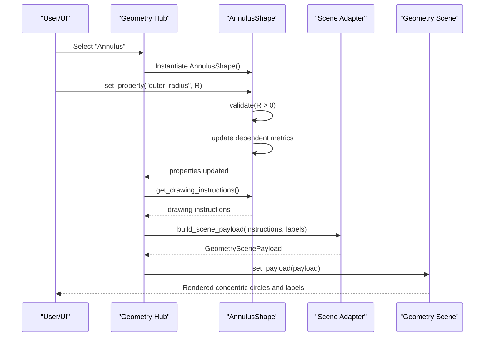
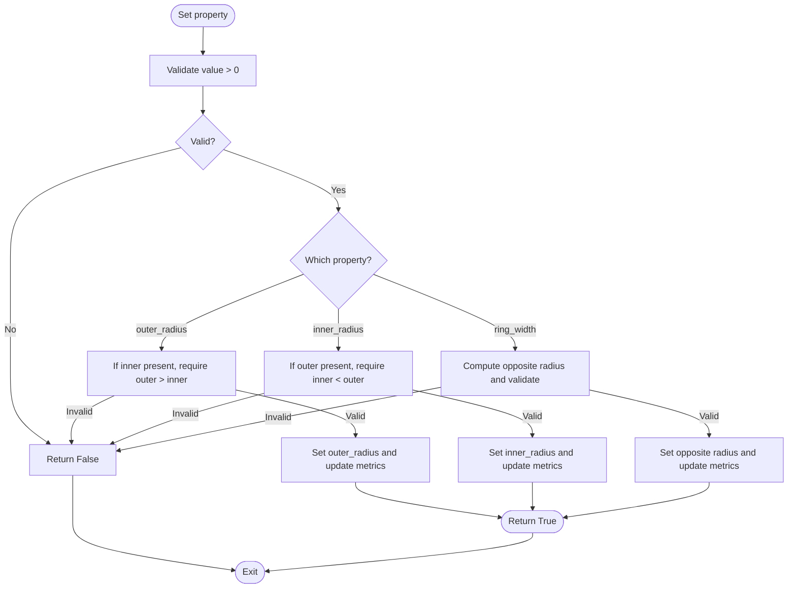
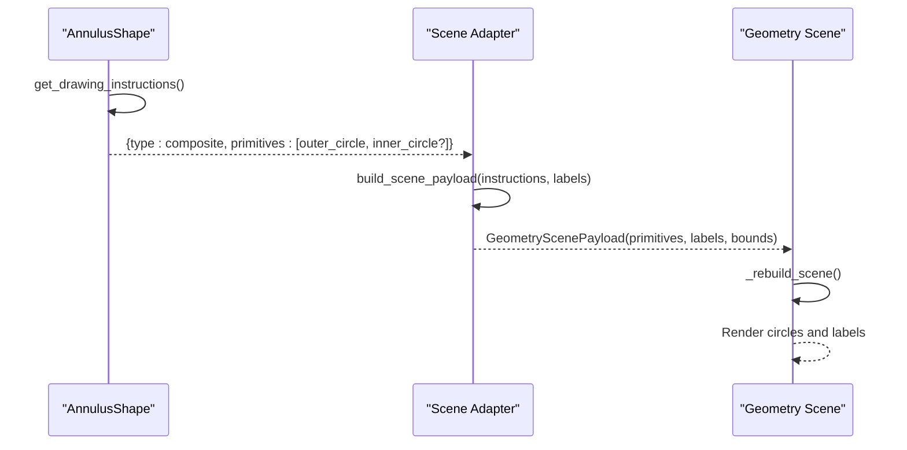
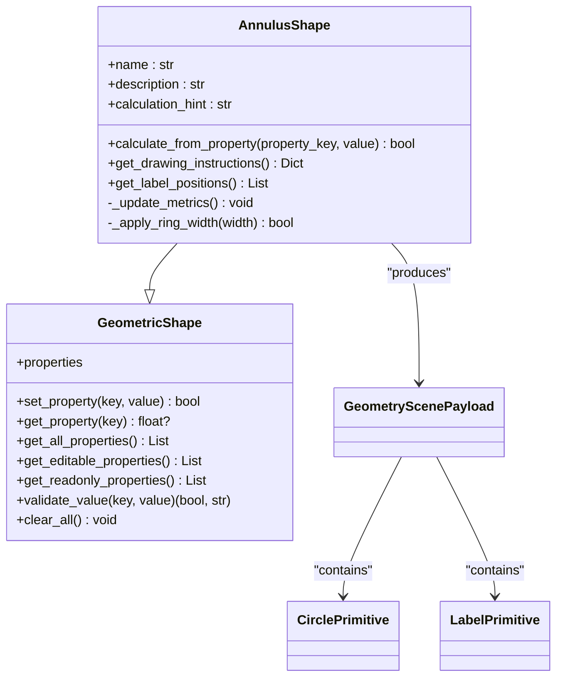
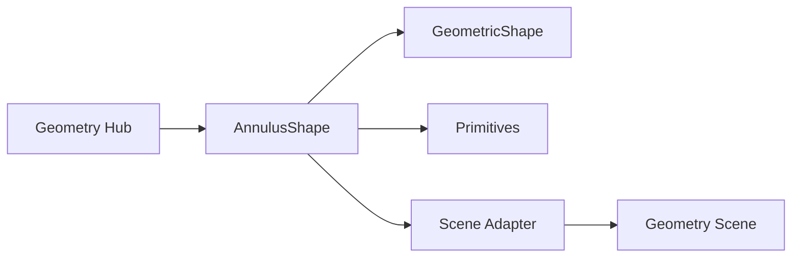

# Annulus Shape

<cite>
**Referenced Files in This Document**
- [annulus_shape.py](file://src/pillars/geometry/services/annulus_shape.py)
- [base_shape.py](file://src/pillars/geometry/services/base_shape.py)
- [primitives.py](file://src/pillars/geometry/ui/primitives.py)
- [scene_adapter.py](file://src/pillars/geometry/ui/scene_adapter.py)
- [geometry_scene.py](file://src/pillars/geometry/ui/geometry_scene.py)
- [geometry_hub.py](file://src/pillars/geometry/ui/geometry_hub.py)
</cite>

## Table of Contents
1. [Introduction](#introduction)
2. [Project Structure](#project-structure)
3. [Core Components](#core-components)
4. [Architecture Overview](#architecture-overview)
5. [Detailed Component Analysis](#detailed-component-analysis)
6. [Dependency Analysis](#dependency-analysis)
7. [Performance Considerations](#performance-considerations)
8. [Troubleshooting Guide](#troubleshooting-guide)
9. [Conclusion](#conclusion)
10. [Appendices](#appendices)

## Introduction
This document provides API documentation for the AnnulusShape class, which models concentric circular geometry (a ring) defined by an outer radius and an inner radius. It covers initialization parameters, validation rules, derived metrics (area and circumference), labeling and drawing instructions, and integration with the rendering pipeline. Practical examples illustrate modeling sacred geometry rings, planetary orbits, and symbolic mandala layers. Edge cases such as zero-width rings and floating-point precision are addressed.

## Project Structure
The AnnulusShape resides in the geometry services module and integrates with UI primitives and scene adapters to render concentric circles and labels.

**Diagram sources**
- [annulus_shape.py](file://src/pillars/geometry/services/annulus_shape.py#L1-L219)
- [base_shape.py](file://src/pillars/geometry/services/base_shape.py#L1-L143)
- [primitives.py](file://src/pillars/geometry/ui/primitives.py#L1-L120)
- [scene_adapter.py](file://src/pillars/geometry/ui/scene_adapter.py#L1-L347)
- [geometry_scene.py](file://src/pillars/geometry/ui/geometry_scene.py#L1-L710)
- [geometry_hub.py](file://src/pillars/geometry/ui/geometry_hub.py#L1-L200)

**Section sources**
- [annulus_shape.py](file://src/pillars/geometry/services/annulus_shape.py#L1-L219)
- [base_shape.py](file://src/pillars/geometry/services/base_shape.py#L1-L143)
- [primitives.py](file://src/pillars/geometry/ui/primitives.py#L1-L120)
- [scene_adapter.py](file://src/pillars/geometry/ui/scene_adapter.py#L1-L347)
- [geometry_scene.py](file://src/pillars/geometry/ui/geometry_scene.py#L1-L710)
- [geometry_hub.py](file://src/pillars/geometry/ui/geometry_hub.py#L1-L200)

## Core Components
- AnnulusShape: Implements concentric ring geometry with validation and derived metrics.
- GeometricShape: Base class defining property model, validation, and calculation contract.
- Primitives: Data structures for rendering circles, labels, and scene payloads.
- Scene Adapter: Converts drawing instructions into structured primitives and labels.
- Geometry Scene: Renders primitives and labels into a Qt-based scene.
- Geometry Hub: Exposes AnnulusShape in the UI.

Key responsibilities:
- Validation: Ensures non-negative radii and outer_radius > inner_radius.
- Derived Metrics: Computes area, outer/inner circumference, ring width, and radius ratio.
- Drawing Instructions: Emits composite primitives for concentric circles and labels.
- Rendering Pipeline: Integrates with scene adapter and geometry scene.

**Section sources**
- [annulus_shape.py](file://src/pillars/geometry/services/annulus_shape.py#L1-L219)
- [base_shape.py](file://src/pillars/geometry/services/base_shape.py#L1-L143)
- [primitives.py](file://src/pillars/geometry/ui/primitives.py#L1-L120)
- [scene_adapter.py](file://src/pillars/geometry/ui/scene_adapter.py#L1-L347)
- [geometry_scene.py](file://src/pillars/geometry/ui/geometry_scene.py#L1-L710)
- [geometry_hub.py](file://src/pillars/geometry/ui/geometry_hub.py#L150-L180)

## Architecture Overview
The AnnulusShape follows a property-driven calculation model. It validates inputs, updates dependent properties, and produces drawing instructions consumed by the scene adapter and rendered by the geometry scene.

**Diagram sources**
- [geometry_hub.py](file://src/pillars/geometry/ui/geometry_hub.py#L150-L180)
- [annulus_shape.py](file://src/pillars/geometry/services/annulus_shape.py#L76-L118)
- [scene_adapter.py](file://src/pillars/geometry/ui/scene_adapter.py#L19-L54)
- [geometry_scene.py](file://src/pillars/geometry/ui/geometry_scene.py#L104-L120)

## Detailed Component Analysis

### AnnulusShape API
- Initialization parameters
  - outer_radius: float, non-negative; required to compute dependent metrics.
  - inner_radius: float, non-negative; must be strictly less than outer_radius.
- Validation rules
  - Non-negative values enforced for radii.
  - outer_radius must be greater than inner_radius.
  - Zero-width rings (outer_radius equals inner_radius) are considered invalid for derived metrics.
- Derived metrics
  - Ring width: outer_radius - inner_radius (computed when both radii are valid).
  - Area: π * (outer_radius^2 - inner_radius^2) (computed when both radii are valid and inner > 0).
  - Outer circumference: 2 * π * outer_radius.
  - Inner circumference: 2 * π * inner_radius.
  - Radius ratio: outer_radius / inner_radius (computed when inner > 0).
- Property synchronization
  - Setting outer_radius updates inner-dependent values and recalculates derived metrics.
  - Setting inner_radius updates outer-dependent values and recalculates derived metrics.
  - Setting ring_width updates the opposite radius accordingly and recalculates derived metrics.
- Centroid
  - Always at origin (0, 0) for concentric rings.
- Floating-point precision
  - Display precision controlled via ShapeProperty precision.
  - Numerical stability ensured by early exits when values are None or invalid.
- Edge cases
  - If either radius is None, dependent properties are cleared.
  - If inner_radius is 0, inner circumference and ratio are cleared; area computed as π * outer_radius^2.
  - If outer_radius equals inner_radius, derived metrics are cleared (zero-width ring).

**Diagram sources**
- [annulus_shape.py](file://src/pillars/geometry/services/annulus_shape.py#L76-L126)
- [base_shape.py](file://src/pillars/geometry/services/base_shape.py#L122-L138)

**Section sources**
- [annulus_shape.py](file://src/pillars/geometry/services/annulus_shape.py#L76-L158)
- [base_shape.py](file://src/pillars/geometry/services/base_shape.py#L122-L138)

### Rendering and Labeling
- Drawing instructions
  - Returns a composite with two circles when outer_radius is set:
    - Outer circle centered at origin with configured pen and brush.
    - Inner circle centered at origin with configured pen and brush (when inner > 0).
- Label positions
  - Displays labels for outer radius, inner radius, ring width, area, and radius ratio at computed offsets.
- Scene adapter
  - Translates drawing instructions into structured primitives and labels.
  - Computes bounds and suggests grid spacing for the scene.
- Geometry scene
  - Renders primitives and labels, manages axes and measurement overlays.

**Diagram sources**
- [annulus_shape.py](file://src/pillars/geometry/services/annulus_shape.py#L159-L215)
- [scene_adapter.py](file://src/pillars/geometry/ui/scene_adapter.py#L19-L54)
- [geometry_scene.py](file://src/pillars/geometry/ui/geometry_scene.py#L440-L500)

**Section sources**
- [annulus_shape.py](file://src/pillars/geometry/services/annulus_shape.py#L159-L215)
- [scene_adapter.py](file://src/pillars/geometry/ui/scene_adapter.py#L19-L54)
- [geometry_scene.py](file://src/pillars/geometry/ui/geometry_scene.py#L440-L500)

### Integration with UI and Rendering
- Geometry Hub exposes AnnulusShape in the UI menu.
- The hub instantiates AnnulusShape and routes user inputs to set_property.
- Drawing instructions are passed to the scene adapter, which builds a payload for the geometry scene.

**Diagram sources**
- [base_shape.py](file://src/pillars/geometry/services/base_shape.py#L1-L143)
- [annulus_shape.py](file://src/pillars/geometry/services/annulus_shape.py#L1-L219)
- [primitives.py](file://src/pillars/geometry/ui/primitives.py#L1-L120)
- [geometry_scene.py](file://src/pillars/geometry/ui/geometry_scene.py#L1-L710)

**Section sources**
- [geometry_hub.py](file://src/pillars/geometry/ui/geometry_hub.py#L150-L180)
- [annulus_shape.py](file://src/pillars/geometry/services/annulus_shape.py#L1-L219)
- [primitives.py](file://src/pillars/geometry/ui/primitives.py#L1-L120)
- [geometry_scene.py](file://src/pillars/geometry/ui/geometry_scene.py#L1-L710)

## Dependency Analysis
- Coupling
  - AnnulusShape depends on GeometricShape for property model and validation.
  - Rendering depends on primitives, scene adapter, and geometry scene.
- Cohesion
  - AnnulusShape encapsulates all ring-related calculations and drawing logic.
- External dependencies
  - math for π and arithmetic.
  - PyQt6 for UI scene rendering (geometry_scene).
- Potential circular dependencies
  - None observed; services depend on UI primitives, but not vice versa.

**Diagram sources**
- [annulus_shape.py](file://src/pillars/geometry/services/annulus_shape.py#L1-L219)
- [base_shape.py](file://src/pillars/geometry/services/base_shape.py#L1-L143)
- [primitives.py](file://src/pillars/geometry/ui/primitives.py#L1-L120)
- [scene_adapter.py](file://src/pillars/geometry/ui/scene_adapter.py#L1-L347)
- [geometry_scene.py](file://src/pillars/geometry/ui/geometry_scene.py#L1-L710)
- [geometry_hub.py](file://src/pillars/geometry/ui/geometry_hub.py#L150-L180)

**Section sources**
- [annulus_shape.py](file://src/pillars/geometry/services/annulus_shape.py#L1-L219)
- [base_shape.py](file://src/pillars/geometry/services/base_shape.py#L1-L143)
- [primitives.py](file://src/pillars/geometry/ui/primitives.py#L1-L120)
- [scene_adapter.py](file://src/pillars/geometry/ui/scene_adapter.py#L1-L347)
- [geometry_scene.py](file://src/pillars/geometry/ui/geometry_scene.py#L1-L710)
- [geometry_hub.py](file://src/pillars/geometry/ui/geometry_hub.py#L150-L180)

## Performance Considerations
- Complexity
  - Property updates are O(1) with constant-time metric recomputation.
- Numerical stability
  - Early exits when radii are None or invalid prevent unnecessary computations.
  - Zero-width rings are explicitly rejected for derived metrics to avoid degenerate cases.
- Rendering
  - Scene bounds and grid spans are computed from primitives to optimize layout and zoom.

[No sources needed since this section provides general guidance]

## Troubleshooting Guide
Common issues and resolutions:
- Setting outer_radius ≤ inner_radius
  - Symptom: Validation fails and returns False.
  - Resolution: Ensure outer_radius > inner_radius.
- Setting inner_radius ≥ outer_radius
  - Symptom: Validation fails and returns False.
  - Resolution: Ensure inner_radius < outer_radius.
- Setting ring_width ≤ 0
  - Symptom: Validation fails and returns False.
  - Resolution: Ensure ring_width > 0; alternatively set outer_radius or inner_radius directly.
- Zero-width ring (outer_radius equals inner_radius)
  - Symptom: Derived metrics (area, ring width, radius ratio) are cleared.
  - Resolution: Use non-zero ring width; or model as a single circle if appropriate.
- Floating-point precision
  - Symptom: Displayed values appear rounded.
  - Resolution: Adjust ShapeProperty precision as needed; values are computed using standard arithmetic.

**Section sources**
- [annulus_shape.py](file://src/pillars/geometry/services/annulus_shape.py#L76-L126)
- [base_shape.py](file://src/pillars/geometry/services/base_shape.py#L122-L138)

## Conclusion
AnnulusShape provides a robust, validated, and synchronized model for concentric circular geometry. It cleanly separates concerns between property validation, derived metric computation, and rendering instructions, enabling seamless integration with the UI pipeline. Its design accommodates edge cases and maintains numerical stability while offering practical capabilities for modeling rings in sacred geometry, planetary orbits, and symbolic mandalas.

[No sources needed since this section summarizes without analyzing specific files]

## Appendices

### Practical Examples
- Sacred geometry rings
  - Model a mandala with multiple concentric bands by setting distinct outer and inner radii for each band.
- Planetary orbits
  - Represent orbital distances by assigning outer_radius as orbital radius and inner_radius as a small offset for visualization clarity.
- Symbolic mandala layers
  - Use ring widths to encode symbolic meaning; derive area to quantify proportional emphasis.

[No sources needed since this section provides general guidance]