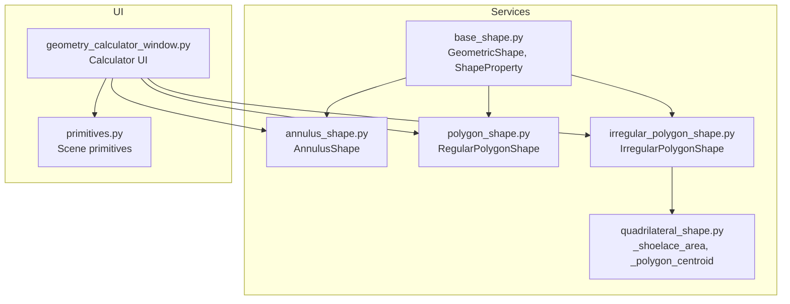
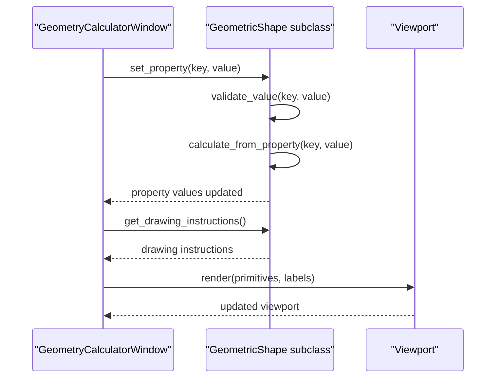
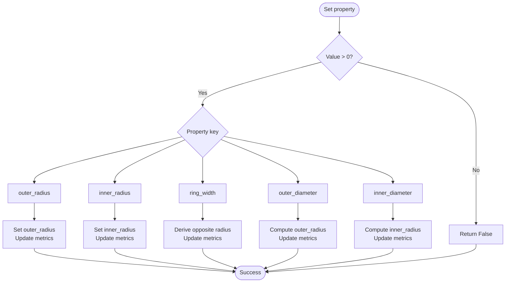
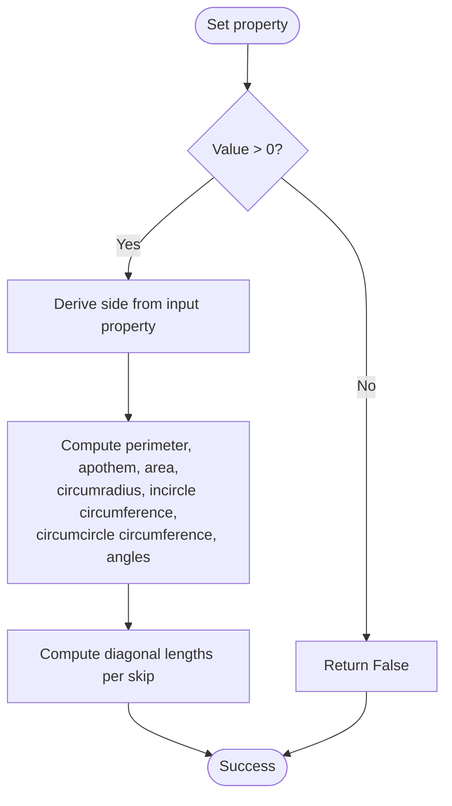
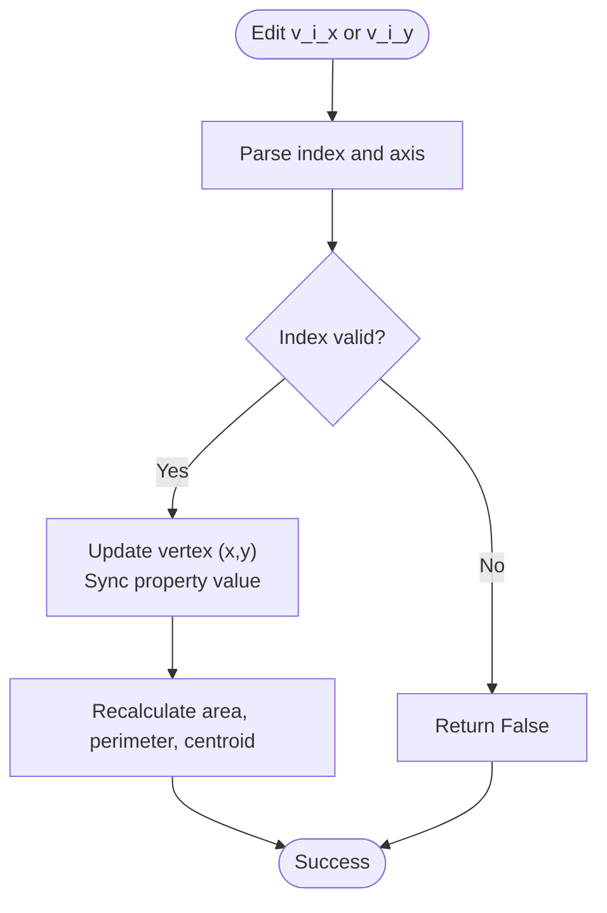
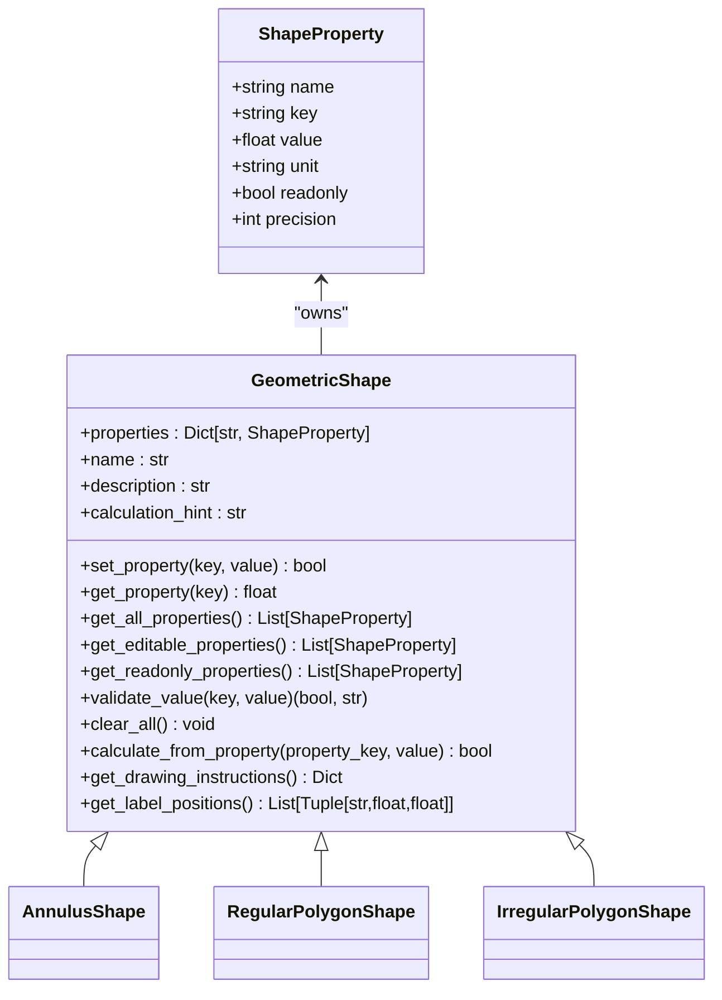

# Composite Shapes

<cite>
**Referenced Files in This Document**
- [base_shape.py](file://src/pillars/geometry/services/base_shape.py)
- [annulus_shape.py](file://src/pillars/geometry/services/annulus_shape.py)
- [polygon_shape.py](file://src/pillars/geometry/services/polygon_shape.py)
- [irregular_polygon_shape.py](file://src/pillars/geometry/services/irregular_polygon_shape.py)
- [quadrilateral_shape.py](file://src/pillars/geometry/services/quadrilateral_shape.py)
- [geometry_calculator_window.py](file://src/pillars/geometry/ui/geometry_calculator_window.py)
- [primitives.py](file://src/pillars/geometry/ui/primitives.py)
</cite>

## Table of Contents
1. [Introduction](#introduction)
2. [Project Structure](#project-structure)
3. [Core Components](#core-components)
4. [Architecture Overview](#architecture-overview)
5. [Detailed Component Analysis](#detailed-component-analysis)
6. [Dependency Analysis](#dependency-analysis)
7. [Performance Considerations](#performance-considerations)
8. [Troubleshooting Guide](#troubleshooting-guide)
9. [Conclusion](#conclusion)
10. [Appendices](#appendices)

## Introduction
This document provides API documentation for composite 2D geometry shapes focused on:
- AnnulusShape: ring geometry with inner and outer radius, computing area, perimeter, and centroid.
- RegularPolygonShape: n-sided regular polygon with side, apothem, circumradius, and diagonal calculations, including dynamic property generation for diagonal skips.
- IrregularPolygonShape: arbitrary vertex-defined polygons with dynamic coordinate properties (v0_x, v0_y, etc.), area via shoelace formula, perimeter, and centroid.

It explains property synchronization between vertex coordinates and derived metrics, edge case handling for degenerate polygons, and numerical precision considerations. It also includes examples for creating concentric rings, sacred geometry patterns, and custom polygonal regions.

## Project Structure
The geometry service layer defines reusable shape calculators and a base abstraction. The UI integrates these shapes into a live calculator with real-time updates and visualization.

**Diagram sources**
- [base_shape.py](file://src/pillars/geometry/services/base_shape.py#L1-L143)
- [annulus_shape.py](file://src/pillars/geometry/services/annulus_shape.py#L1-L219)
- [polygon_shape.py](file://src/pillars/geometry/services/polygon_shape.py#L1-L267)
- [irregular_polygon_shape.py](file://src/pillars/geometry/services/irregular_polygon_shape.py#L1-L147)
- [quadrilateral_shape.py](file://src/pillars/geometry/services/quadrilateral_shape.py#L1-L80)
- [geometry_calculator_window.py](file://src/pillars/geometry/ui/geometry_calculator_window.py#L1-L200)
- [primitives.py](file://src/pillars/geometry/ui/primitives.py#L1-L120)

**Section sources**
- [base_shape.py](file://src/pillars/geometry/services/base_shape.py#L1-L143)
- [annulus_shape.py](file://src/pillars/geometry/services/annulus_shape.py#L1-L219)
- [polygon_shape.py](file://src/pillars/geometry/services/polygon_shape.py#L1-L267)
- [irregular_polygon_shape.py](file://src/pillars/geometry/services/irregular_polygon_shape.py#L1-L147)
- [quadrilateral_shape.py](file://src/pillars/geometry/services/quadrilateral_shape.py#L1-L80)
- [geometry_calculator_window.py](file://src/pillars/geometry/ui/geometry_calculator_window.py#L1-L200)
- [primitives.py](file://src/pillars/geometry/ui/primitives.py#L1-L120)

## Core Components
- ShapeProperty: A typed descriptor for shape properties with name, key, value, unit, readonly flag, and precision.
- GeometricShape: Abstract base class defining the shape contract, including property initialization, calculation entry points, drawing instructions, and label positioning.

Key responsibilities:
- Define editable vs readonly properties.
- Validate inputs and propagate updates.
- Compute derived metrics consistently.
- Provide drawing instructions and label positions for visualization.

**Section sources**
- [base_shape.py](file://src/pillars/geometry/services/base_shape.py#L1-L143)

## Architecture Overview
The calculator UI binds to a shape instance, populating property inputs from the shape’s property registry. On user input, the shape recalculates dependent values and updates the viewport with drawing instructions and labels.

**Diagram sources**
- [geometry_calculator_window.py](file://src/pillars/geometry/ui/geometry_calculator_window.py#L1-L200)
- [base_shape.py](file://src/pillars/geometry/services/base_shape.py#L85-L143)

## Detailed Component Analysis

### AnnulusShape (Ring Geometry)
AnnulusShape models a ring defined by inner and outer radii. It computes dependent metrics and provides drawing instructions and labels.

- Properties
  - outer_radius, inner_radius: editable radii.
  - ring_width: computed width (outer - inner).
  - outer_diameter, inner_diameter: computed diameters.
  - outer_circumference, inner_circumference: computed circumferences.
  - area: computed ring area.
  - radius_ratio: computed ratio outer/inner.

- Calculation flow
  - Setting either outer_radius or inner_radius triggers metric updates.
  - ring_width can be set directly; the shape derives the opposite radius accordingly.
  - Derived metrics are recomputed when any dependent value changes.

- Drawing and labeling
  - get_drawing_instructions returns a composite of concentric circles.
  - get_label_positions places labels for R, r, width, area, and ratio.

- Edge cases and validation
  - Non-positive values are rejected.
  - When inner >= outer, dependent metrics are cleared.
  - If either radius is missing, dependent values are cleared.

**Diagram sources**
- [annulus_shape.py](file://src/pillars/geometry/services/annulus_shape.py#L76-L126)
- [annulus_shape.py](file://src/pillars/geometry/services/annulus_shape.py#L128-L158)

**Section sources**
- [annulus_shape.py](file://src/pillars/geometry/services/annulus_shape.py#L1-L219)

### RegularPolygonShape (n-Sided Symmetry)
RegularPolygonShape computes properties for regular polygons with n sides, including side length, apothem, circumradius, area, perimeter, and diagonals.

- Properties
  - side, perimeter, area, apothem, circumradius.
  - incircle_circumference, circumcircle_circumference.
  - interior_angle, exterior_angle.
  - Dynamic diagonal_skip_k properties for k from 2 to floor(n/2).

- Calculation flow
  - calculate_from_property accepts any single property and derives all others:
    - From side: compute perimeter, apothem, area, circumradius, angles, and diagonal lengths.
    - From perimeter: derive side.
    - From area: derive side using inverse area formula.
    - From apothem: derive side using apothem formula.
    - From circumradius: derive side using circumradius formula.
    - From diagonal_skip_k: derive side using trigonometric relation.
  - Diagonal lengths are computed from circumradius and skip indices.

- Drawing and labeling
  - get_drawing_instructions generates polygon points on a circumcircle and builds diagonal groups with distinct colors.
  - get_label_positions places labels for side, area, and n.

- Dynamic diagonal generation
  - On initialization, diagonal_skip_k properties are created for valid skips.
  - The mapping between skip and property key is maintained internally.

- Edge cases and validation
  - Numerical checks prevent division by zero when computing side from diagonal properties.
  - Minimum sides enforced to 3.

**Diagram sources**
- [polygon_shape.py](file://src/pillars/geometry/services/polygon_shape.py#L130-L189)
- [polygon_shape.py](file://src/pillars/geometry/services/polygon_shape.py#L230-L267)

**Section sources**
- [polygon_shape.py](file://src/pillars/geometry/services/polygon_shape.py#L1-L267)

### IrregularPolygonShape (Arbitrary Vertices)
IrregularPolygonShape supports arbitrary polygons defined by a list of vertices. It dynamically generates coordinate properties and computes derived metrics.

- Properties
  - area, perimeter, centroid_x, centroid_y, num_vertices: readonly computed values.
  - Dynamic v0_x, v0_y, v1_x, v1_y, ...: editable coordinate properties synced to current vertex list.

- Vertex synchronization
  - set_points updates internal vertex list and regenerates coordinate properties.
  - Old stale coordinate properties are removed when vertex count decreases.
  - num_vertices is updated automatically.

- Calculation flow
  - Editing a v_i_x or v_i_y coordinate updates the vertex list and recalculates:
    - Area via shoelace formula.
    - Perimeter by summing edge distances.
    - Centroid via polygon centroid computation.
  - For fewer than 3 vertices, area and perimeter are zero.

- Drawing and labeling
  - get_drawing_instructions returns a polygon primitive if valid.
  - get_label_positions places area label near centroid and optional vertex indices.

- Edge cases and numerical precision
  - Shoelace area and centroid computation guard against degenerate cases using epsilon thresholds.
  - Perimeter uses Euclidean distance between consecutive vertices.

**Diagram sources**
- [irregular_polygon_shape.py](file://src/pillars/geometry/services/irregular_polygon_shape.py#L77-L101)
- [irregular_polygon_shape.py](file://src/pillars/geometry/services/irregular_polygon_shape.py#L103-L124)
- [quadrilateral_shape.py](file://src/pillars/geometry/services/quadrilateral_shape.py#L21-L49)

**Section sources**
- [irregular_polygon_shape.py](file://src/pillars/geometry/services/irregular_polygon_shape.py#L1-L147)
- [quadrilateral_shape.py](file://src/pillars/geometry/services/quadrilateral_shape.py#L1-L80)

## Dependency Analysis
- Base abstractions
  - ShapeProperty encapsulates property metadata and formatting.
  - GeometricShape defines the contract for all shapes, including property lifecycle and validation.

- Shape implementations
  - AnnulusShape depends on math and base_shape.
  - RegularPolygonShape depends on math and base_shape; it generates dynamic diagonal properties.
  - IrregularPolygonShape depends on base_shape and shared utilities for area and centroid.

- UI integration
  - GeometryCalculatorWindow binds to a shape instance, rendering property inputs and updating the viewport with drawing instructions and labels.

**Diagram sources**
- [base_shape.py](file://src/pillars/geometry/services/base_shape.py#L1-L143)
- [annulus_shape.py](file://src/pillars/geometry/services/annulus_shape.py#L1-L219)
- [polygon_shape.py](file://src/pillars/geometry/services/polygon_shape.py#L1-L267)
- [irregular_polygon_shape.py](file://src/pillars/geometry/services/irregular_polygon_shape.py#L1-L147)

**Section sources**
- [base_shape.py](file://src/pillars/geometry/services/base_shape.py#L1-L143)
- [annulus_shape.py](file://src/pillars/geometry/services/annulus_shape.py#L1-L219)
- [polygon_shape.py](file://src/pillars/geometry/services/polygon_shape.py#L1-L267)
- [irregular_polygon_shape.py](file://src/pillars/geometry/services/irregular_polygon_shape.py#L1-L147)

## Performance Considerations
- RegularPolygonShape
  - Computation complexity is constant per property update; trigonometric operations are lightweight.
  - Diagonal generation scales with number of skips (up to floor(n/2)); acceptable for typical n.

- IrregularPolygonShape
  - Area and centroid via shoelace formula: O(n).
  - Perimeter: O(n).
  - Vertex synchronization removes stale properties and adds new ones; cost proportional to change in vertex count.

- Numerical stability
  - Epsilon thresholds prevent division by near-zero values and handle degenerate cases.
  - Trigonometric computations use standard math library routines.

[No sources needed since this section provides general guidance]

## Troubleshooting Guide
Common issues and resolutions:
- Invalid property values
  - Ensure all geometric properties are positive; negative or zero values are rejected.
  - For AnnulusShape, inner radius must be less than outer radius; otherwise dependent metrics are cleared.

- Degenerate polygons
  - IrregularPolygonShape treats fewer than 3 vertices as degenerate; area and perimeter are zero until corrected.

- Diagonal derivation edge cases
  - RegularPolygonShape guards against division by zero when deriving side from diagonal_skip_k; ensure skip is valid for the given n.

- Vertex synchronization
  - After reducing vertex count, stale v_i_x/v_i_y properties are removed; re-addition occurs automatically when new vertices are introduced.

**Section sources**
- [base_shape.py](file://src/pillars/geometry/services/base_shape.py#L122-L143)
- [annulus_shape.py](file://src/pillars/geometry/services/annulus_shape.py#L76-L126)
- [polygon_shape.py](file://src/pillars/geometry/services/polygon_shape.py#L130-L189)
- [irregular_polygon_shape.py](file://src/pillars/geometry/services/irregular_polygon_shape.py#L53-L76)

## Conclusion
The composite 2D geometry API provides robust, extensible calculators for rings, regular polygons, and arbitrary polygons. It enforces consistent validation, synchronizes vertex coordinates with derived metrics, and offers precise numerical handling. The UI integrates these shapes seamlessly, enabling interactive exploration of concentric rings, sacred geometry patterns, and custom polygonal regions.

[No sources needed since this section summarizes without analyzing specific files]

## Appendices

### API Reference: AnnulusShape
- Properties
  - outer_radius: editable float.
  - inner_radius: editable float.
  - ring_width: computed float.
  - outer_diameter: computed float.
  - inner_diameter: computed float.
  - outer_circumference: computed float.
  - inner_circumference: computed float.
  - area: computed float.
  - radius_ratio: computed float.

- Methods
  - calculate_from_property(property_key, value): updates dependent metrics; returns success.
  - get_drawing_instructions(): returns composite drawing instructions.
  - get_label_positions(): returns label positions for visualization.

**Section sources**
- [annulus_shape.py](file://src/pillars/geometry/services/annulus_shape.py#L23-L74)
- [annulus_shape.py](file://src/pillars/geometry/services/annulus_shape.py#L76-L126)
- [annulus_shape.py](file://src/pillars/geometry/services/annulus_shape.py#L128-L158)
- [annulus_shape.py](file://src/pillars/geometry/services/annulus_shape.py#L159-L215)

### API Reference: RegularPolygonShape
- Properties
  - side, perimeter, area, apothem, circumradius: editable/computed.
  - incircle_circumference, circumcircle_circumference: computed.
  - interior_angle, exterior_angle: computed.
  - diagonal_skip_k: editable/computed for k in [2..floor(n/2)].

- Methods
  - calculate_from_property(property_key, value): derives all properties from one input.
  - get_drawing_instructions(): returns polygon points and diagonal groups.
  - get_label_positions(): returns label positions.

**Section sources**
- [polygon_shape.py](file://src/pillars/geometry/services/polygon_shape.py#L52-L118)
- [polygon_shape.py](file://src/pillars/geometry/services/polygon_shape.py#L130-L189)
- [polygon_shape.py](file://src/pillars/geometry/services/polygon_shape.py#L191-L229)
- [polygon_shape.py](file://src/pillars/geometry/services/polygon_shape.py#L230-L267)

### API Reference: IrregularPolygonShape
- Properties
  - area, perimeter, centroid_x, centroid_y, num_vertices: computed.
  - v0_x, v0_y, v1_x, v1_y, ...: editable coordinate properties.

- Methods
  - set_points(points): sets vertices and regenerates properties.
  - calculate_from_property(property_key, value): updates coordinate and recalculates metrics.
  - get_drawing_instructions(): returns polygon primitive.
  - get_label_positions(): returns label positions.

**Section sources**
- [irregular_polygon_shape.py](file://src/pillars/geometry/services/irregular_polygon_shape.py#L37-L46)
- [irregular_polygon_shape.py](file://src/pillars/geometry/services/irregular_polygon_shape.py#L47-L76)
- [irregular_polygon_shape.py](file://src/pillars/geometry/services/irregular_polygon_shape.py#L77-L102)
- [irregular_polygon_shape.py](file://src/pillars/geometry/services/irregular_polygon_shape.py#L103-L124)
- [irregular_polygon_shape.py](file://src/pillars/geometry/services/irregular_polygon_shape.py#L125-L147)

### UI Integration Notes
- The calculator window creates property inputs for all properties and updates the viewport on changes.
- Drawing instructions are rendered using scene primitives; labels are positioned relative to computed centroids and circumradii.

**Section sources**
- [geometry_calculator_window.py](file://src/pillars/geometry/ui/geometry_calculator_window.py#L120-L200)
- [primitives.py](file://src/pillars/geometry/ui/primitives.py#L1-L120)

### Examples

- Creating concentric rings
  - Use AnnulusShape with increasing outer_radius while keeping inner_radius fixed to produce nested rings.
  - Alternatively, use RegularPolygonShape with many sides to approximate circular rings and vary circumradius for concentric layers.

- Sacred geometry patterns
  - RegularPolygonShape with n=5 (pentagon), n=6 (hexagon), n=8 (octagon), and n=10 (decagon) to explore golden ratio and 10-fold symmetries.
  - Combine multiple instances with aligned centers and varying radii to form overlapping patterns.

- Custom polygonal regions
  - Use IrregularPolygonShape to define arbitrary regions by editing v0_x, v0_y, v1_x, v1_y, etc.
  - Adjust vertices incrementally to refine shapes; derived area, perimeter, and centroid update automatically.

[No sources needed since this section provides general guidance]