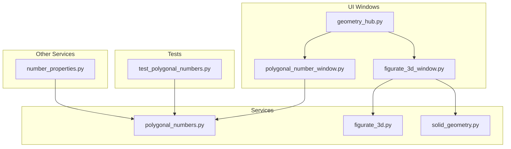
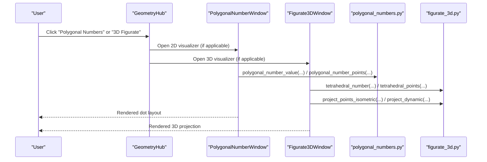
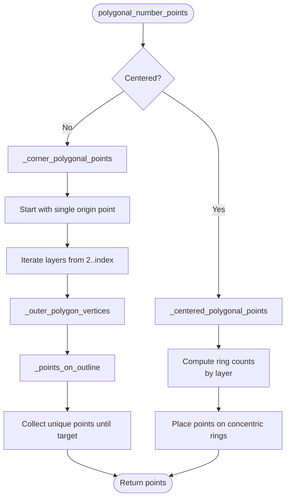
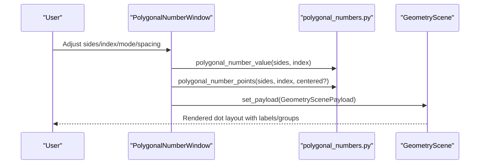
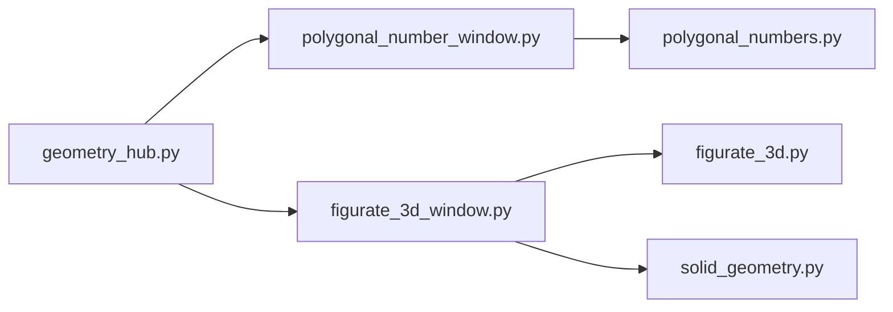

# Figurate Mathematics API

<cite>
**Referenced Files in This Document**
- [polygonal_numbers.py](file://src/pillars/geometry/services/polygonal_numbers.py)
- [figurate_3d.py](file://src/pillars/geometry/services/figurate_3d.py)
- [solid_geometry.py](file://src/pillars/geometry/services/solid_geometry.py)
- [polygonal_number_window.py](file://src/pillars/geometry/ui/polygonal_number_window.py)
- [figurate_3d_window.py](file://src/pillars/geometry/ui/figurate_3d_window.py)
- [geometry_hub.py](file://src/pillars/geometry/ui/geometry_hub.py)
- [test_polygonal_numbers.py](file://test/test_polygonal_numbers.py)
- [number_properties.py](file://src/pillars/tq/services/number_properties.py)
</cite>

## Table of Contents
1. [Introduction](#introduction)
2. [Project Structure](#project-structure)
3. [Core Components](#core-components)
4. [Architecture Overview](#architecture-overview)
5. [Detailed Component Analysis](#detailed-component-analysis)
6. [Dependency Analysis](#dependency-analysis)
7. [Performance Considerations](#performance-considerations)
8. [Troubleshooting Guide](#troubleshooting-guide)
9. [Conclusion](#conclusion)
10. [Appendices](#appendices)

## Introduction
This document provides API documentation for figurate number systems in both 2D and 3D. It focuses on:
- PolygonalNumbers service for generating triangular, square, pentagonal, and higher-order polygonal number sequences with closed-form formulas and coordinate generation.
- Figurate3D service for computing tetrahedral, square pyramidal, octahedral, cubic, centered cubic, stellated octahedron, centered icosahedral, and centered dodecahedral numbers, including volume-based and layer-based generation algorithms.
- Methods for checking membership in polygonal sequences, deriving indices, and generating coordinate representations of figurate solids.
- Practical examples of mapping numerical sequences to geometric forms and integrating with visualization tools.
- Numerical stability and performance optimization guidance for large sequence values.

## Project Structure
The figurate mathematics API is implemented in dedicated services and exposed through interactive UI windows. The services are pure Python modules that expose functions for computation and rendering, while the UI windows orchestrate user interaction and visualization.

**Diagram sources**
- [polygonal_numbers.py](file://src/pillars/geometry/services/polygonal_numbers.py#L1-L308)
- [figurate_3d.py](file://src/pillars/geometry/services/figurate_3d.py#L1-L739)
- [solid_geometry.py](file://src/pillars/geometry/services/solid_geometry.py#L1-L156)
- [polygonal_number_window.py](file://src/pillars/geometry/ui/polygonal_number_window.py#L1-L479)
- [figurate_3d_window.py](file://src/pillars/geometry/ui/figurate_3d_window.py#L1-L515)
- [geometry_hub.py](file://src/pillars/geometry/ui/geometry_hub.py#L1-L200)
- [test_polygonal_numbers.py](file://test/test_polygonal_numbers.py#L1-L61)
- [number_properties.py](file://src/pillars/tq/services/number_properties.py#L127-L192)

**Section sources**
- [polygonal_numbers.py](file://src/pillars/geometry/services/polygonal_numbers.py#L1-L308)
- [figurate_3d.py](file://src/pillars/geometry/services/figurate_3d.py#L1-L739)
- [polygonal_number_window.py](file://src/pillars/geometry/ui/polygonal_number_window.py#L1-L479)
- [figurate_3d_window.py](file://src/pillars/geometry/ui/figurate_3d_window.py#L1-L515)
- [geometry_hub.py](file://src/pillars/geometry/ui/geometry_hub.py#L1-L200)
- [test_polygonal_numbers.py](file://test/test_polygonal_numbers.py#L1-L61)
- [number_properties.py](file://src/pillars/tq/services/number_properties.py#L127-L192)

## Core Components
- PolygonalNumbers service (2D)
  - Closed-form computation of polygonal numbers and centered polygonal numbers.
  - Coordinate generation for both corner-grown (gnomon) and concentric ring layouts.
  - Star number generation and generalized star numbers.
- Figurate3D service (3D)
  - Formulas and coordinate generators for tetrahedral, square pyramidal, octahedral, cubic, centered cubic, stellated octahedron, centered icosahedral, and centered dodecahedral numbers.
  - Isometric projection and dynamic camera projection for 2D visualization.
  - Layer coloring and helper utilities for 3D-to-2D mapping.

**Section sources**
- [polygonal_numbers.py](file://src/pillars/geometry/services/polygonal_numbers.py#L11-L307)
- [figurate_3d.py](file://src/pillars/geometry/services/figurate_3d.py#L14-L738)

## Architecture Overview
The API is structured as a layered system:
- Services: Pure computation modules exposing functions for figurate number generation and geometric projections.
- UI Windows: Interactive viewers that consume service APIs, manage user controls, and render visualizations.
- Integration Hub: Central launcher that opens UI windows and routes user actions to appropriate tools.

**Diagram sources**
- [geometry_hub.py](file://src/pillars/geometry/ui/geometry_hub.py#L1210-L1240)
- [polygonal_number_window.py](file://src/pillars/geometry/ui/polygonal_number_window.py#L1-L479)
- [figurate_3d_window.py](file://src/pillars/geometry/ui/figurate_3d_window.py#L1-L515)
- [polygonal_numbers.py](file://src/pillars/geometry/services/polygonal_numbers.py#L11-L307)
- [figurate_3d.py](file://src/pillars/geometry/services/figurate_3d.py#L14-L738)

## Detailed Component Analysis

### PolygonalNumbers Service (2D)
- Purpose: Compute polygonal and centered polygonal numbers and generate coordinate layouts.
- Key formulas:
  - Standard polygonal number: P(s, n) = ((s - 2)n^2 - (s - 4)n) / 2
  - Centered polygonal number: C(s, n) = s * n * (n - 1) / 2 + 1
  - Star number: S(n) = 6 * n * (n - 1) + 1
  - Generalized star number: S(p, n) = p * n * (n - 1) + 1
- Generation modes:
  - Corner-grown (gnomon growth) for standard polygonal numbers.
  - Concentric rings for centered polygonal numbers.
  - Star numbers constructed from centered polygons plus ray triangles.
- Output:
  - Numeric values for given sides and index.
  - Coordinate lists for dot layouts with optional spacing and rotation.
  - Outer polygon outline points for a given index.

**Diagram sources**
- [polygonal_numbers.py](file://src/pillars/geometry/services/polygonal_numbers.py#L31-L181)

**Section sources**
- [polygonal_numbers.py](file://src/pillars/geometry/services/polygonal_numbers.py#L11-L307)
- [test_polygonal_numbers.py](file://test/test_polygonal_numbers.py#L1-L61)

### Figurate3D Service (3D)
- Purpose: Compute and visualize 3D figurate numbers with isometric and dynamic projections.
- Supported sequences:
  - Tetrahedral numbers and points (triangular layers stacked vertically).
  - Square pyramidal numbers and points (square layers stacked).
  - Octahedral numbers and points (two square pyramids joined at base).
  - Cubic numbers and points (n x n x n lattice).
  - Centered cubic numbers and points (interlaced cubes).
  - Stellated octahedron (two intersecting tetrahedra).
  - Centered icosahedral numbers and points (geodesic sphere construction).
  - Centered dodecahedral numbers and points (face-filling construction).
- Projections:
  - Isometric projection for static 2D view.
  - Dynamic camera projection with yaw/pitch for interactive 3D-like views.
- Utilities:
  - Layer detection helper for 3D-to-2D mapping.
  - Solid geometry helpers for surface area and volume computations.

```mermaid
classDiagram
class IsometricProjection {
+isometric_project(x, y, z) (x2d, y2d)
+project_points_isometric(points_3d) points_2d
}
class Tetrahedral {
+tetrahedral_number(n) int
+tetrahedral_points(n, spacing) points_3d
}
class SquarePyramidal {
+square_pyramidal_number(n) int
+square_pyramidal_points(n, spacing) points_3d
}
class Octahedral {
+octahedral_number(n) int
+octahedral_points(n, spacing) points_3d
}
class Cubic {
+cubic_number(n) int
+cubic_points(n, spacing) points_3d
}
class CenteredCubic {
+centered_cubic_number(n) int
+centered_cubic_points(n, spacing) points_3d
}
class StellatedOctahedron {
+stellated_octahedron_number(n) int
+stellated_octahedron_points(n, spacing) points_3d
}
class Icosahedral {
+icosahedral_number(n) int
+icosahedral_points(n, spacing) points_3d
}
class Dodecahedral {
+dodecahedral_number(n) int
+dodecahedral_points(n, spacing) points_3d
}
IsometricProjection <.. Tetrahedral : "projection"
IsometricProjection <.. SquarePyramidal : "projection"
IsometricProjection <.. Octahedral : "projection"
IsometricProjection <.. Cubic : "projection"
IsometricProjection <.. CenteredCubic : "projection"
IsometricProjection <.. StellatedOctahedron : "projection"
IsometricProjection <.. Icosahedral : "projection"
IsometricProjection <.. Dodecahedral : "projection"
```

**Diagram sources**
- [figurate_3d.py](file://src/pillars/geometry/services/figurate_3d.py#L14-L738)

**Section sources**
- [figurate_3d.py](file://src/pillars/geometry/services/figurate_3d.py#L14-L738)
- [solid_geometry.py](file://src/pillars/geometry/services/solid_geometry.py#L1-L156)

### UI Integration and Visualization
- PolygonalNumberWindow
  - Exposes controls for sides, index, mode (polygonal, centered, star), and spacing.
  - Renders dot layouts with optional labels and grouping.
  - Integrates with GeometryScene/View for interactive selection and connections.
- Figurate3DWindow
  - Provides shape selection (tetrahedral, pyramidal, octahedral, cubic, centered cubic, stellated octahedron, centered icosahedral, centered dodecahedral).
  - Supports dynamic camera rotation and layer coloring by z-depth.
  - Projects 3D points to 2D using isometric or dynamic projection.

**Diagram sources**
- [polygonal_number_window.py](file://src/pillars/geometry/ui/polygonal_number_window.py#L347-L408)
- [polygonal_numbers.py](file://src/pillars/geometry/services/polygonal_numbers.py#L11-L307)

**Section sources**
- [polygonal_number_window.py](file://src/pillars/geometry/ui/polygonal_number_window.py#L1-L479)
- [figurate_3d_window.py](file://src/pillars/geometry/ui/figurate_3d_window.py#L1-L515)
- [geometry_hub.py](file://src/pillars/geometry/ui/geometry_hub.py#L1210-L1240)

## Dependency Analysis
- Internal dependencies:
  - UI windows depend on service modules for computation and projection.
  - Solid geometry helpers support 3D computations and visualization.
- External dependencies:
  - Qt (PyQt6) for UI components and graphics view.
  - Math library for trigonometric and arithmetic operations.

**Diagram sources**
- [polygonal_number_window.py](file://src/pillars/geometry/ui/polygonal_number_window.py#L1-L479)
- [figurate_3d_window.py](file://src/pillars/geometry/ui/figurate_3d_window.py#L1-L515)
- [geometry_hub.py](file://src/pillars/geometry/ui/geometry_hub.py#L1-L200)
- [polygonal_numbers.py](file://src/pillars/geometry/services/polygonal_numbers.py#L1-L308)
- [figurate_3d.py](file://src/pillars/geometry/services/figurate_3d.py#L1-L739)
- [solid_geometry.py](file://src/pillars/geometry/services/solid_geometry.py#L1-L156)

**Section sources**
- [polygonal_number_window.py](file://src/pillars/geometry/ui/polygonal_number_window.py#L1-L479)
- [figurate_3d_window.py](file://src/pillars/geometry/ui/figurate_3d_window.py#L1-L515)
- [geometry_hub.py](file://src/pillars/geometry/ui/geometry_hub.py#L1-L200)

## Performance Considerations
- 2D polygonal generation:
  - Corner-grown generation iterates outlines and collects unique points; complexity scales with the number of points generated.
  - Concentric ring generation scales linearly with the number of points per layer and number of layers.
  - Spacing and rotation parameters influence point distribution density and uniqueness checks.
- 3D figurate generation:
  - Cubic and centered cubic generators use nested loops over n^3 points; performance degrades cubically with n.
  - Octahedral and stellated octahedron generators combine multiple pyramids or tetrahedra; deduplication is performed to avoid overlaps.
  - Isometric and dynamic projections are O(m) where m is the number of points.
- Numerical stability:
  - Integer division is used for closed-form formulas to avoid floating-point errors.
  - Deduplication rounds coordinates to mitigate floating-point precision issues during projections and intersections.
- Recommendations:
  - Limit n for cubic and centered cubic to keep runtime reasonable.
  - Use layer coloring and selective rendering for large datasets.
  - Cache computed values for repeated queries within a session.

[No sources needed since this section provides general guidance]

## Troubleshooting Guide
- Unexpected point counts:
  - Verify index and sides parameters are within supported ranges.
  - For corner-grown layouts, ensure spacing is positive and index is at least 1.
- Overlapping or missing points:
  - Unique point checks rely on rounding keys; adjust spacing or reduce n to minimize collisions.
- 3D rendering artifacts:
  - Confirm camera angles and projection parameters are valid.
  - For stellated octahedron, deduplication removes overlapping points; expect fewer points than naive summation.
- Membership testing:
  - Use dedicated polygonal number checks to validate whether a number belongs to a polygonal family and derive the index.

**Section sources**
- [polygonal_numbers.py](file://src/pillars/geometry/services/polygonal_numbers.py#L11-L307)
- [figurate_3d.py](file://src/pillars/geometry/services/figurate_3d.py#L14-L738)
- [number_properties.py](file://src/pillars/tq/services/number_properties.py#L127-L192)

## Conclusion
The figurate mathematics API provides a cohesive set of 2D and 3D figurate number services with clear formulas, coordinate generation, and visualization integrations. The PolygonalNumbers service supports standard and centered polygonal sequences with flexible layouts, while the Figurate3D service offers rich 3D solids with isometric and dynamic projections. Together with UI windows and integration hubs, the API enables intuitive exploration and mapping of numerical sequences to geometric forms, with practical performance and stability considerations.

[No sources needed since this section summarizes without analyzing specific files]

## Appendices

### API Reference: PolygonalNumbers (2D)
- polygonal_number_value(sides: int, index: int) -> int
  - Computes the nth polygonal number for a polygon with s sides using the closed form.
- centered_polygonal_value(sides: int, index: int) -> int
  - Computes the nth centered polygonal number for a polygon with s sides using the closed form.
- polygonal_number_points(sides: int, index: int, spacing: float = 1.0, centered: bool = False, rotation: float = 0.0) -> List[Tuple[float, float]]
  - Generates dot coordinates for polygonal or centered polygonal numbers with optional spacing and rotation.
- polygonal_outline_points(sides: int, index: int, spacing: float = 1.0, rotation: float = 0.0) -> List[Tuple[float, float]]
  - Returns the outer polygon outline points for the given polygonal number order.
- max_radius(spacing: float, index: int) -> float
  - Maximum radius used by the generator for concentric layouts.
- star_number_value(index: int) -> int
  - Computes the star number (centered hexagram) for a given index.
- generalized_star_number_value(points_count: int, index: int) -> int
  - Computes the generalized star number for a p-gram at a given index.
- star_number_points(index: int, spacing: float = 1.0, rotation: float = 0.0) -> List[Tuple[float, float]]
  - Generates dot coordinates for star numbers (centered hexagrams).
- generalized_star_number_points(points_count: int, index: int, spacing: float = 1.0, rotation: float = 0.0) -> List[Tuple[float, float]]
  - Generates dot coordinates for generalized star numbers (centered p-grams).

**Section sources**
- [polygonal_numbers.py](file://src/pillars/geometry/services/polygonal_numbers.py#L11-L307)

### API Reference: Figurate3D (3D)
- isometric_project(x: float, y: float, z: float) -> Tuple[float, float]
  - Projects 3D coordinates to 2D isometric view.
- project_points_isometric(points_3d: List[Tuple[float, float, float]]) -> List[Tuple[float, float]]
  - Projects a list of 3D points to 2D isometric coordinates.
- project_dynamic(points_3d: List[Tuple[float, float, float]], yaw_deg: float, pitch_deg: float) -> List[Tuple[float, float]]
  - Projects points using dynamic Yaw/Pitch angles for interactive 3D-like views.
- get_layer_for_point(point_3d: Tuple[float, float, float], spacing: float = 1.0) -> int
  - Determines which layer (z-level) a point belongs to.
- tetrahedral_number(n: int) -> int
- tetrahedral_points(n: int, spacing: float = 1.0) -> List[Tuple[float, float, float]]
- square_pyramidal_number(n: int) -> int
- square_pyramidal_points(n: int, spacing: float = 1.0) -> List[Tuple[float, float, float]]
- octahedral_number(n: int) -> int
- octahedral_points(n: int, spacing: float = 1.0) -> List[Tuple[float, float, float]]
- cubic_number(n: int) -> int
- cubic_points(n: int, spacing: float = 1.0) -> List[Tuple[float, float, float]]
- centered_cubic_number(n: int) -> int
- centered_cubic_points(n: int, spacing: float = 1.0) -> List[Tuple[float, float, float]]
- stellated_octahedron_number(n: int) -> int
- stellated_octahedron_points(n: int, spacing: float = 1.0) -> List[Tuple[float, float, float]]
- icosahedral_number(n: int) -> int
- icosahedral_points(n: int, spacing: float = 1.0) -> List[Tuple[float, float, float]]
- dodecahedral_number(n: int) -> int
- dodecahedral_points(n: int, spacing: float = 1.0) -> List[Tuple[float, float, float]]

**Section sources**
- [figurate_3d.py](file://src/pillars/geometry/services/figurate_3d.py#L14-L738)

### Integration Examples
- Opening the 2D visualizer from the geometry hub:
  - The hub provides buttons to open the PolygonalNumberWindow and Figurate3DWindow.
- Programmatic control:
  - The PolygonalNumberWindow exposes controls for sides, index, mode, and spacing; changing these triggers re-rendering.
  - The Figurate3DWindow supports dynamic camera rotation and toggles for labels and layer coloring.

**Section sources**
- [geometry_hub.py](file://src/pillars/geometry/ui/geometry_hub.py#L1210-L1240)
- [polygonal_number_window.py](file://src/pillars/geometry/ui/polygonal_number_window.py#L204-L303)
- [figurate_3d_window.py](file://src/pillars/geometry/ui/figurate_3d_window.py#L250-L363)

### Membership Testing and Indices
- Polygonal membership:
  - The number_properties service computes discriminants and solves for indices to determine whether a number belongs to a polygonal family and to report the index.
- Centered polygonal membership:
  - Similar discriminant-based approach determines centered polygonal families and indices.

**Section sources**
- [number_properties.py](file://src/pillars/tq/services/number_properties.py#L127-L192)