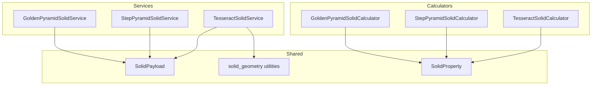
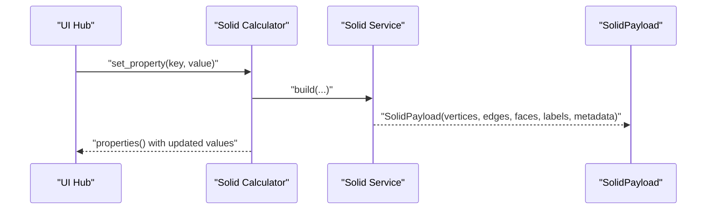
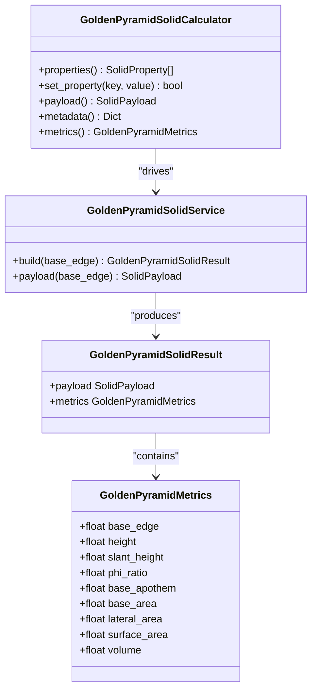
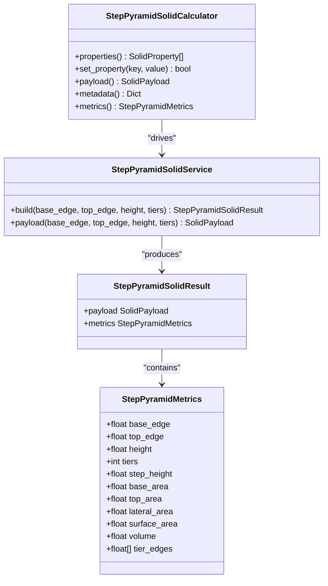
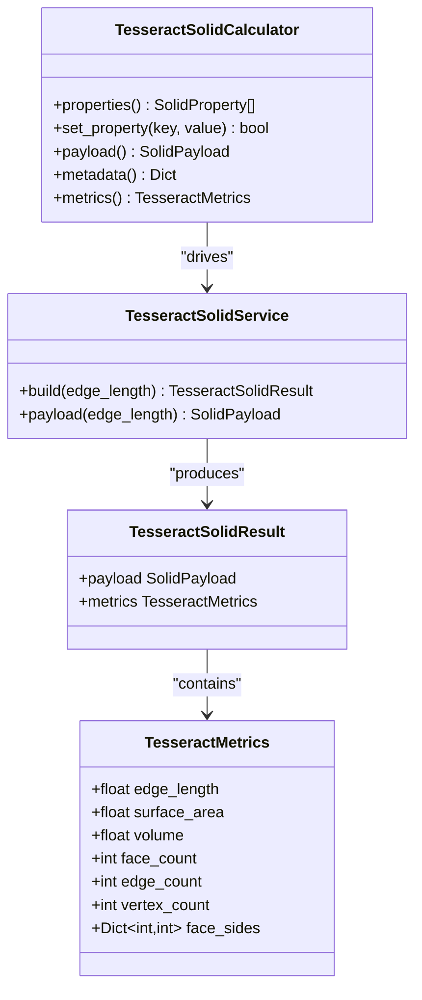
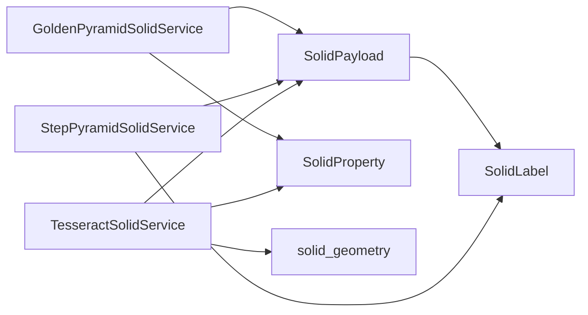

# Sacred Geometry Constructs API

<cite>
**Referenced Files in This Document**
- [golden_pyramid_solid.py](file://src/pillars/geometry/services/golden_pyramid_solid.py)
- [step_pyramid_solid.py](file://src/pillars/geometry/services/step_pyramid_solid.py)
- [tesseract_solid.py](file://src/pillars/geometry/services/tesseract_solid.py)
- [solid_geometry.py](file://src/pillars/geometry/services/solid_geometry.py)
- [solid_payload.py](file://src/pillars/geometry/shared/solid_payload.py)
- [solid_property.py](file://src/pillars/geometry/services/solid_property.py)
- [geometry_hub.py](file://src/pillars/geometry/ui/geometry_hub.py)
- [test_tesseract_solid.py](file://test/test_tesseract_solid.py)
- [test_sacred_pyramids.py](file://test/test_sacred_pyramids.py)
</cite>

## Table of Contents
1. [Introduction](#introduction)
2. [Project Structure](#project-structure)
3. [Core Components](#core-components)
4. [Architecture Overview](#architecture-overview)
5. [Detailed Component Analysis](#detailed-component-analysis)
6. [Dependency Analysis](#dependency-analysis)
7. [Performance Considerations](#performance-considerations)
8. [Troubleshooting Guide](#troubleshooting-guide)
9. [Conclusion](#conclusion)
10. [Appendices](#appendices)

## Introduction
This document specifies the API for three sacred geometry constructs:
- GoldenPyramidSolid: phi-proportioned square pyramid with base-to-height ratios, face angles, and energetic proportioning.
- StepPyramidSolid: ziggurat-style stepped pyramid with configurable tiers, setbacks, and alignment properties.
- TesseractSolid: 4D hypercube representation with 3D Schlegel projection, wireframe visualization, and scaling controls.

It covers mathematical foundations, projection methods, rendering parameters, and practical usage patterns. It also addresses floating-point precision in golden ratio calculations and performance considerations for 4D transformations.

## Project Structure
The geometry subsystem organizes solids as services and calculators that produce SolidPayload objects consumed by viewers and UI hubs. Shared utilities provide vector math and mesh construction helpers.

**Diagram sources**
- [golden_pyramid_solid.py](file://src/pillars/geometry/services/golden_pyramid_solid.py#L67-L119)
- [step_pyramid_solid.py](file://src/pillars/geometry/services/step_pyramid_solid.py#L152-L164)
- [tesseract_solid.py](file://src/pillars/geometry/services/tesseract_solid.py#L85-L134)
- [solid_payload.py](file://src/pillars/geometry/shared/solid_payload.py#L12-L52)
- [solid_geometry.py](file://src/pillars/geometry/services/solid_geometry.py#L11-L156)
- [solid_property.py](file://src/pillars/geometry/services/solid_property.py#L8-L21)

**Section sources**
- [golden_pyramid_solid.py](file://src/pillars/geometry/services/golden_pyramid_solid.py#L1-L212)
- [step_pyramid_solid.py](file://src/pillars/geometry/services/step_pyramid_solid.py#L1-L268)
- [tesseract_solid.py](file://src/pillars/geometry/services/tesseract_solid.py#L1-L220)
- [solid_payload.py](file://src/pillars/geometry/shared/solid_payload.py#L1-L52)
- [solid_geometry.py](file://src/pillars/geometry/services/solid_geometry.py#L1-L156)
- [solid_property.py](file://src/pillars/geometry/services/solid_property.py#L1-L21)

## Core Components
- GoldenPyramidSolidService: Builds a square pyramid aligned to the golden ratio with base edge, height, slant height, and volume computed from the golden ratio.
- GoldenPyramidSolidCalculator: Exposes editable properties and computes derived metrics; accepts base_edge, height, slant_height, or volume to drive the model.
- StepPyramidSolidService: Builds a terraced stepped pyramid with configurable base_edge, top_edge, height, and tiers; computes lateral area, surface area, and volume.
- StepPyramidSolidCalculator: Exposes editable properties and validates constraints; accepts base_edge, top_edge, height, or tiers.
- TesseractSolidService: Builds a Schlegel projection of a tesseract (hypercube) with paired shells and connectors; computes surface area and volume.
- TesseractSolidCalculator: Controls edge_length, surface_area, or volume; scales the model while preserving topology.
- SolidPayload: Standardized mesh container with vertices, edges, faces, labels, metadata, and suggested_scale.
- SolidProperty: Describes a metric exposed by calculators with name, key, unit, value, precision, and editability.
- solid_geometry utilities: Vector math, polygon area, face normal, surface area, volume, edges extraction, face centroid, angle around axis.

**Section sources**
- [golden_pyramid_solid.py](file://src/pillars/geometry/services/golden_pyramid_solid.py#L67-L211)
- [step_pyramid_solid.py](file://src/pillars/geometry/services/step_pyramid_solid.py#L152-L268)
- [tesseract_solid.py](file://src/pillars/geometry/services/tesseract_solid.py#L85-L220)
- [solid_payload.py](file://src/pillars/geometry/shared/solid_payload.py#L12-L52)
- [solid_property.py](file://src/pillars/geometry/services/solid_property.py#L8-L21)
- [solid_geometry.py](file://src/pillars/geometry/services/solid_geometry.py#L11-L156)

## Architecture Overview
The API follows a clean separation of concerns:
- Services construct SolidPayload meshes from parameters.
- Calculators manage editable properties and derive metrics.
- Utilities provide reusable math helpers.
- UI integrates solids via a hub configuration.

**Diagram sources**
- [geometry_hub.py](file://src/pillars/geometry/ui/geometry_hub.py#L874-L879)
- [golden_pyramid_solid.py](file://src/pillars/geometry/services/golden_pyramid_solid.py#L116-L144)
- [step_pyramid_solid.py](file://src/pillars/geometry/services/step_pyramid_solid.py#L162-L193)
- [tesseract_solid.py](file://src/pillars/geometry/services/tesseract_solid.py#L132-L161)

## Detailed Component Analysis

### GoldenPyramidSolid
- Mathematical foundation:
  - Golden ratio φ = (1 + √5)/2.
  - Base edge determines height via a derived factor based on φ.
  - Slant height equals φ × (base_edge/2).
  - Surface area and volume computed from base area, lateral area, and height.
- API:
  - build(base_edge): returns SolidPayload and GoldenPyramidMetrics.
  - payload(base_edge): convenience to get SolidPayload.
  - GoldenPyramidSolidCalculator exposes:
    - Properties: base_edge, height, slant_height, phi_ratio, base_apothem, base_area, lateral_area, surface_area, volume.
    - set_property accepts base_edge, height, slant_height, or volume.
- Rendering parameters:
  - Vertices define a square base centered at z = ±h/2 and an apex at z = h/2.
  - Edges connect base corners to apex and outline base.
  - Faces include base and four triangular sides.
  - Labels annotate base edge, height, and φ.
  - suggested_scale set to base_edge.

**Diagram sources**
- [golden_pyramid_solid.py](file://src/pillars/geometry/services/golden_pyramid_solid.py#L67-L211)

**Section sources**
- [golden_pyramid_solid.py](file://src/pillars/geometry/services/golden_pyramid_solid.py#L11-L45)
- [golden_pyramid_solid.py](file://src/pillars/geometry/services/golden_pyramid_solid.py#L67-L119)
- [golden_pyramid_solid.py](file://src/pillars/geometry/services/golden_pyramid_solid.py#L121-L211)
- [test_sacred_pyramids.py](file://test/test_sacred_pyramids.py#L14-L36)

### StepPyramidSolid
- Mathematical foundation:
  - Interpolates edge sizes across tiers from base_edge to top_edge.
  - Computes step_height = height / tiers.
  - Lateral area sums contributions from each tier’s perimeter.
  - Volume sums squared edge sizes weighted by step_height.
- API:
  - build(base_edge, top_edge, height, tiers): returns SolidPayload and StepPyramidMetrics.
  - payload(base_edge, top_edge, height, tiers): convenience to get SolidPayload.
  - StepPyramidSolidCalculator exposes:
    - Properties: base_edge, top_edge, height, tiers, step_height, base_area, top_area, lateral_area, surface_area, volume.
    - set_property accepts base_edge, top_edge (with constraint), height, or tiers.
- Rendering parameters:
  - Vertices placed on stacked squares at z-levels determined by step_height.
  - Edges connect base corners to apex and connect adjacent corners vertically.
  - Faces include bottom base, top cap, and four trapezoidal lateral faces per tier.
  - Labels annotate base edge, top edge, and tier count.
  - suggested_scale set to max(base_edge, height).

**Diagram sources**
- [step_pyramid_solid.py](file://src/pillars/geometry/services/step_pyramid_solid.py#L152-L268)

**Section sources**
- [step_pyramid_solid.py](file://src/pillars/geometry/services/step_pyramid_solid.py#L119-L164)
- [step_pyramid_solid.py](file://src/pillars/geometry/services/step_pyramid_solid.py#L166-L268)

### TesseractSolid
- Mathematical foundation:
  - A tesseract is a 4D cube with 16 vertices, 32 edges, and 24 square faces.
  - The implementation builds two cubes (outer and inner) and connects corresponding vertices to form 12 connecting square faces.
  - Schlegel projection flattens the 4D structure into 3D by scaling and retaining face/edge connectivity.
  - Surface area and volume computed from the constructed mesh.
- API:
  - build(edge_length): returns SolidPayload and TesseractMetrics.
  - payload(edge_length): convenience to get SolidPayload.
  - TesseractSolidCalculator exposes:
    - Properties: edge_length, surface_area, volume, face_count, edge_count, vertex_count.
    - set_property accepts edge_length, surface_area, or volume; scaling preserves topology.
- Rendering parameters:
  - Vertices include outer and inner cubes with inner scaled to 0.5.
  - Faces include outer faces, inner faces, and connector faces linking outer to inner.
  - Labels annotate edge length.
  - suggested_scale set to edge_length.

**Diagram sources**
- [tesseract_solid.py](file://src/pillars/geometry/services/tesseract_solid.py#L85-L220)

**Section sources**
- [tesseract_solid.py](file://src/pillars/geometry/services/tesseract_solid.py#L19-L66)
- [tesseract_solid.py](file://src/pillars/geometry/services/tesseract_solid.py#L85-L134)
- [tesseract_solid.py](file://src/pillars/geometry/services/tesseract_solid.py#L136-L220)
- [test_tesseract_solid.py](file://test/test_tesseract_solid.py#L9-L28)
- [test_tesseract_solid.py](file://test/test_tesseract_solid.py#L30-L49)

### Projection Methods and Rendering Parameters
- GoldenPyramidSolid:
  - No 4D projection; standard 3D mesh with labeled dimensions.
- StepPyramidSolid:
  - No 4D projection; standard 3D mesh with labeled dimensions.
- TesseractSolid:
  - Schlegel projection: constructs a 3D representation by scaling vertices and computing derived metrics.
  - Wireframe visualization: edges and faces retained; labels indicate edge length.

**Section sources**
- [tesseract_solid.py](file://src/pillars/geometry/services/tesseract_solid.py#L85-L134)
- [solid_geometry.py](file://src/pillars/geometry/services/solid_geometry.py#L77-L107)

## Dependency Analysis
- Services depend on SolidPayload and SolidLabel for mesh assembly.
- GoldenPyramidSolidService depends on SolidProperty for calculator integration.
- TesseractSolidService depends on solid_geometry utilities for surface area and volume computation.
- Calculators depend on SolidProperty for property metadata and value management.

**Diagram sources**
- [golden_pyramid_solid.py](file://src/pillars/geometry/services/golden_pyramid_solid.py#L67-L119)
- [step_pyramid_solid.py](file://src/pillars/geometry/services/step_pyramid_solid.py#L152-L164)
- [tesseract_solid.py](file://src/pillars/geometry/services/tesseract_solid.py#L85-L134)
- [solid_geometry.py](file://src/pillars/geometry/services/solid_geometry.py#L77-L107)
- [solid_property.py](file://src/pillars/geometry/services/solid_property.py#L8-L21)

**Section sources**
- [solid_payload.py](file://src/pillars/geometry/shared/solid_payload.py#L12-L52)
- [solid_property.py](file://src/pillars/geometry/services/solid_property.py#L8-L21)
- [solid_geometry.py](file://src/pillars/geometry/services/solid_geometry.py#L77-L107)

## Performance Considerations
- Floating-point precision in golden ratio calculations:
  - The golden ratio φ is computed from sqrt(5); repeated use of floating-point arithmetic can accumulate small errors. Prefer precomputed constants and consistent precision across calculations.
  - For high-volume rendering or repeated recalculations, cache intermediate factors (e.g., height factor) to avoid redundant sqrt and division operations.
- 4D transformations and projections:
  - Tesseract builds rely on vector math and mesh construction. For large-scale or frequent updates, reuse computed base metrics (e.g., base edge length, surface area, volume) to avoid recomputation.
  - When scaling, compute a single scale factor and apply to all vertices once rather than recalculating per metric.
- Mesh stability:
  - Ensure edges are deduplicated (as done by extracting edges from faces) to prevent redundant rendering work.
  - Use suggested_scale to normalize viewer zoom and reduce unnecessary rescaling.

[No sources needed since this section provides general guidance]

## Troubleshooting Guide
- GoldenPyramidSolid:
  - Invalid base_edge raises an error; ensure positive values.
  - Derived metrics (height, slant_height, volume) are computed from base_edge and φ; verify expected ratios using tests.
- StepPyramidSolid:
  - top_edge must be less than base_edge; otherwise, dimension validation fails.
  - tiers must be positive; invalid inputs are rejected.
- TesseractSolid:
  - edge_length must be positive; otherwise, an error is raised.
  - Calculator scaling by surface_area or volume uses derived base metrics; ensure non-zero base values before scaling.

**Section sources**
- [golden_pyramid_solid.py](file://src/pillars/geometry/services/golden_pyramid_solid.py#L70-L75)
- [step_pyramid_solid.py](file://src/pillars/geometry/services/step_pyramid_solid.py#L90-L96)
- [tesseract_solid.py](file://src/pillars/geometry/services/tesseract_solid.py#L88-L92)
- [test_sacred_pyramids.py](file://test/test_sacred_pyramids.py#L14-L36)
- [test_tesseract_solid.py](file://test/test_tesseract_solid.py#L9-L28)

## Conclusion
The Sacred Geometry Constructs API provides robust, mathematically grounded builders and calculators for phi-proportioned pyramids, stepped ziggurats, and 4D hypercubes. It emphasizes consistent labeling, standardized mesh payloads, and calculators that expose editable properties with derived metrics. Integration with the UI hub enables interactive exploration and educational visualization for meditation and study.

[No sources needed since this section summarizes without analyzing specific files]

## Appendices

### API Reference Tables

- GoldenPyramidSolidService
  - Methods:
    - build(base_edge: float) -> GoldenPyramidSolidResult
    - payload(base_edge: float) -> SolidPayload
  - Output fields: vertices, edges, faces, labels, metadata, suggested_scale
  - Metadata keys: base_edge, height, slant_height, phi_ratio, base_apothem, base_area, lateral_area, surface_area, volume

- GoldenPyramidSolidCalculator
  - Properties:
    - base_edge, height, slant_height, phi_ratio, base_apothem, base_area, lateral_area, surface_area, volume
  - Methods:
    - properties() -> List[SolidProperty]
    - set_property(key: str, value: Optional[float]) -> bool
    - payload() -> Optional[SolidPayload]
    - metadata() -> Dict[str, float]
    - metrics() -> Optional[GoldenPyramidMetrics]

- StepPyramidSolidService
  - Methods:
    - build(base_edge: float, top_edge: float, height: float, tiers: int) -> StepPyramidSolidResult
    - payload(base_edge: float, top_edge: float, height: float, tiers: int) -> SolidPayload
  - Output fields: vertices, edges, faces, labels, metadata, suggested_scale
  - Metadata keys: base_edge, top_edge, height, tiers, step_height, base_area, top_area, lateral_area, surface_area, volume, tier_edges

- StepPyramidSolidCalculator
  - Properties:
    - base_edge, top_edge, height, tiers, step_height, base_area, top_area, lateral_area, surface_area, volume
  - Methods:
    - properties() -> List[SolidProperty]
    - set_property(key: str, value: Optional[float]) -> bool
    - payload() -> Optional[SolidPayload]
    - metadata() -> Dict[str, float]
    - metrics() -> Optional[StepPyramidMetrics]

- TesseractSolidService
  - Methods:
    - build(edge_length: float) -> TesseractSolidResult
    - payload(edge_length: float) -> SolidPayload
  - Output fields: vertices, edges, faces, labels, metadata, suggested_scale
  - Metadata keys: edge_length, surface_area, volume, face_count, edge_count, vertex_count, face_sides

- TesseractSolidCalculator
  - Properties:
    - edge_length, surface_area, volume, face_count, edge_count, vertex_count
  - Methods:
    - properties() -> List[SolidProperty]
    - set_property(key: str, value: float | None) -> bool
    - payload() -> SolidPayload | None
    - metadata() -> Dict[str, float]
    - metrics() -> TesseractMetrics | None

**Section sources**
- [golden_pyramid_solid.py](file://src/pillars/geometry/services/golden_pyramid_solid.py#L67-L211)
- [step_pyramid_solid.py](file://src/pillars/geometry/services/step_pyramid_solid.py#L152-L268)
- [tesseract_solid.py](file://src/pillars/geometry/services/tesseract_solid.py#L85-L220)

### Integration with UI and Educational Workflows
- UI Hub integration:
  - The geometry hub registers entries for Golden Pyramid and Step Pyramid, enabling selection and interactive editing.
  - Tesseract is registered under a “Hypercube” category with a summary indicating Schlegel projection.
- Symbolic interpretations and visualization:
  - GoldenPyramidSolid labels include base edge, height, and φ, supporting meditative contemplation of sacred proportions.
  - StepPyramidSolid labels include base edge, top edge, and tier count, aiding visualization of stepped ascent.
  - Tesseract labels include edge length, supporting dimensional awareness exercises.

**Section sources**
- [geometry_hub.py](file://src/pillars/geometry/ui/geometry_hub.py#L874-L879)
- [geometry_hub.py](file://src/pillars/geometry/ui/geometry_hub.py#L828-L841)