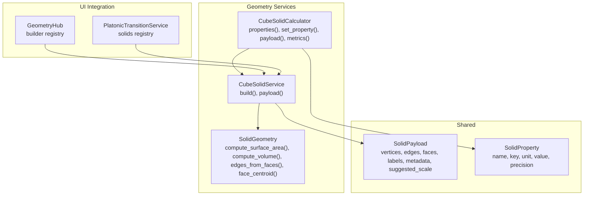
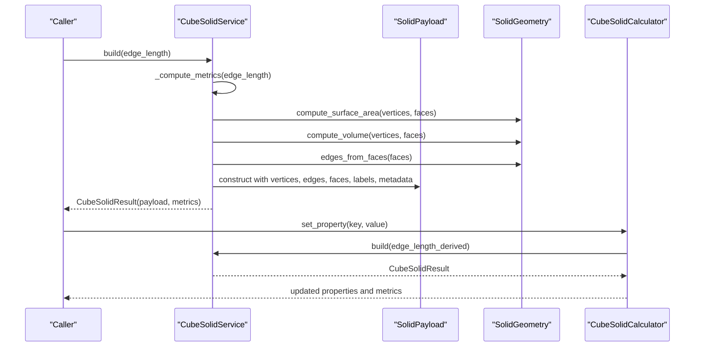
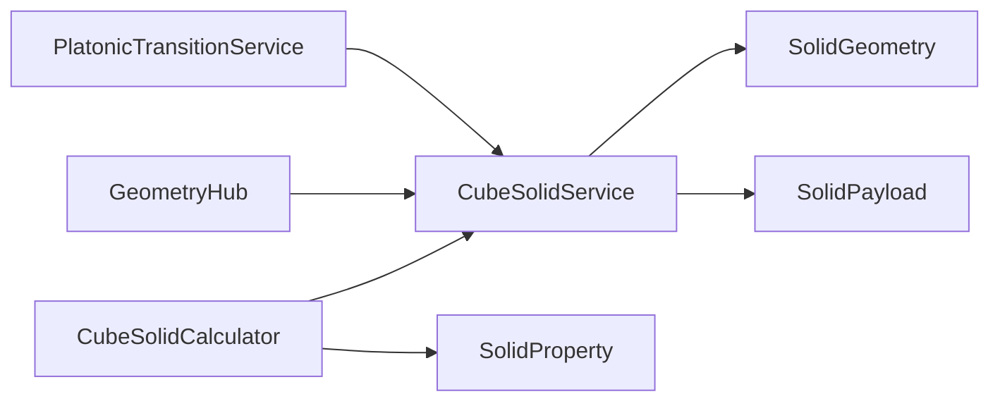

# Cube Solid API

<cite>
**Referenced Files in This Document**
- [cube_solid.py](file://src/pillars/geometry/services/cube_solid.py)
- [solid_geometry.py](file://src/pillars/geometry/services/solid_geometry.py)
- [solid_payload.py](file://src/pillars/geometry/shared/solid_payload.py)
- [solid_property.py](file://src/pillars/geometry/services/solid_property.py)
- [geometry_hub.py](file://src/pillars/geometry/ui/geometry_hub.py)
- [platonic_transition_service.py](file://src/pillars/tq/services/platonic_transition_service.py)
- [test_platonic_solids.py](file://test/test_platonic_solids.py)
</cite>

## Table of Contents
1. [Introduction](#introduction)
2. [Project Structure](#project-structure)
3. [Core Components](#core-components)
4. [Architecture Overview](#architecture-overview)
5. [Detailed Component Analysis](#detailed-component-analysis)
6. [Dependency Analysis](#dependency-analysis)
7. [Performance Considerations](#performance-considerations)
8. [Troubleshooting Guide](#troubleshooting-guide)
9. [Conclusion](#conclusion)
10. [Appendices](#appendices)

## Introduction
This document describes the Cube Solid API, focusing on the construction of a cube from six square faces, axis-aligned orientation, and precise vertex coordinate generation based on edge length. It covers computed metrics (volume, surface area, inradius, circumradius, face diagonal, space diagonal), methods for extracting faces and edges, center point computation, dual transformation via SolidGeometry, and stellation behavior. It also provides usage examples for creating unit cubes, computing face centers, and integrating with 3D scene graphs. Vertex indexing follows a consistent right-hand rule, face ordering adheres to ±X, ±Y, ±Z, and alignment is with the global coordinate system. Numerical precision and optimization strategies for batch rendering are addressed.

## Project Structure
The Cube Solid API resides in the geometry pillar under services and shared modules. The primary implementation is in the cube service, with shared data structures and geometry utilities.

**Diagram sources**
- [cube_solid.py](file://src/pillars/geometry/services/cube_solid.py#L114-L151)
- [solid_geometry.py](file://src/pillars/geometry/services/solid_geometry.py#L77-L117)
- [solid_payload.py](file://src/pillars/geometry/shared/solid_payload.py#L12-L52)
- [solid_property.py](file://src/pillars/geometry/services/solid_property.py#L8-L21)
- [geometry_hub.py](file://src/pillars/geometry/ui/geometry_hub.py#L840-L860)
- [platonic_transition_service.py](file://src/pillars/tq/services/platonic_transition_service.py#L72-L102)

**Section sources**
- [cube_solid.py](file://src/pillars/geometry/services/cube_solid.py#L1-L151)
- [solid_geometry.py](file://src/pillars/geometry/services/solid_geometry.py#L1-L156)
- [solid_payload.py](file://src/pillars/geometry/shared/solid_payload.py#L1-L52)
- [solid_property.py](file://src/pillars/geometry/services/solid_property.py#L1-L21)

## Core Components
- CubeSolidService: Builds a SolidPayload for a cube given an edge length, computes metrics, and attaches labels and metadata.
- CubeSolidCalculator: Bidirectional calculator that derives edge length from any solid property and updates derived metrics and labels accordingly.
- SolidGeometry: Provides utilities for surface area, volume, edges from faces, face centroid, and vector operations.
- SolidPayload: Shared data structure containing vertices, edges, faces, labels, metadata, and suggested scale.
- SolidProperty: Shared data structure describing a metric exposed by calculators.

Key responsibilities:
- Construction: Six square faces aligned to global axes, consistent right-hand vertex ordering.
- Metrics: Volume, surface area, inradius, circumradius, face diagonal, space diagonal, and associated circumferences.
- Extraction: Edges and faces are generated from face definitions; centroids computed via SolidGeometry.
- Dual and stellation: The dual of a cube is an octahedron; stellation behavior is documented conceptually.

**Section sources**
- [cube_solid.py](file://src/pillars/geometry/services/cube_solid.py#L114-L258)
- [solid_geometry.py](file://src/pillars/geometry/services/solid_geometry.py#L46-L117)
- [solid_payload.py](file://src/pillars/geometry/shared/solid_payload.py#L12-L52)
- [solid_property.py](file://src/pillars/geometry/services/solid_property.py#L8-L21)

## Architecture Overview
The Cube Solid API composes a SolidPayload from base geometry and scales it according to edge length. Metrics are computed using shared SolidGeometry utilities and attached to the payload and calculator properties.

**Diagram sources**
- [cube_solid.py](file://src/pillars/geometry/services/cube_solid.py#L114-L258)
- [solid_geometry.py](file://src/pillars/geometry/services/solid_geometry.py#L77-L117)

## Detailed Component Analysis

### CubeSolidService
Responsibilities:
- Build a SolidPayload for a cube with axis-aligned faces and consistent vertex ordering.
- Compute metrics scaled by edge length using base constants.
- Attach labels and metadata for visualization and UI.

Construction details:
- Base vertices form a unit cube centered at origin with axis-aligned faces.
- Faces are defined in a consistent order: ±X, ±Y, ±Z.
- Edges are derived from faces.
- Metrics include face area, surface area, volume, face diagonal, space diagonal, inradius, midradius, circumradius, and associated circumferences.

Methods:
- build(edge_length): Validates positive edge length, computes metrics, constructs SolidPayload, and returns a CubeSolidResult.
- payload(edge_length): Convenience method returning only the SolidPayload.

Vertex indexing and face ordering:
- Vertices are indexed consistently with a right-hand rule.
- Face ordering follows ±X, ±Y, ±Z to align with global coordinate system.

Numerical precision:
- Diagonal calculations use Euclidean distance between vertices.
- Scaling preserves exact ratios; derived quantities are computed from base constants.

Dual transformation:
- The dual of a cube is an octahedron. While the cube service does not directly compute the octahedron, the dual relationship is implied by the geometric duality of Platonic solids.

Stellation behavior:
- Stellation involves extending faces until they meet. For a cube, this yields a stellated octahedron (two interlocking tetrahedra). This behavior is documented conceptually and not computed by the cube service.

Integration with scene graphs:
- The SolidPayload produced by the service can be integrated into 3D scenes via UI hubs and transition services.

**Section sources**
- [cube_solid.py](file://src/pillars/geometry/services/cube_solid.py#L22-L151)
- [solid_geometry.py](file://src/pillars/geometry/services/solid_geometry.py#L94-L117)

### CubeSolidCalculator
Responsibilities:
- Expose a set of SolidProperty descriptors for cube metrics.
- Derive edge length from any given property using power-law scaling.
- Maintain a cached result and update properties accordingly.

Key behaviors:
- Property definitions enumerate keys, labels, units, precision, and power exponents.
- Solvers compute derived edge length from a target value using base constants and power scaling.
- Properties are updated and emitted through the calculator’s API.

Usage:
- Initialize with a default edge length.
- Call set_property(key, value) to update the model and recompute metrics.
- Retrieve payload(), metadata(), and metrics() for downstream consumption.

**Section sources**
- [cube_solid.py](file://src/pillars/geometry/services/cube_solid.py#L153-L258)
- [solid_property.py](file://src/pillars/geometry/services/solid_property.py#L8-L21)

### SolidGeometry Utilities
Responsibilities:
- Provide vector operations (add, subtract, scale, dot, cross, length, normalize).
- Compute polygon area and face normal.
- Compute surface area and volume from vertices and faces.
- Extract edges from faces and compute face centroid.
- Compute angle around an axis for orientation analysis.

Relevance to Cube Solid:
- Surface area and volume are computed from the cube’s vertices and faces.
- Edges are derived from face definitions.
- Face centroid is available for labeling and center computations.

**Section sources**
- [solid_geometry.py](file://src/pillars/geometry/services/solid_geometry.py#L11-L156)

### SolidPayload
Responsibilities:
- Encapsulate geometry data and metadata for rendering.
- Provide bounds computation for scene fitting.

Fields:
- vertices: List of 3D points.
- edges: List of vertex index pairs.
- faces: List of face vertex index sequences.
- labels: List of text labels with positions.
- metadata: Dictionary of computed metrics and parameters.
- suggested_scale: Suggested scale hint for visualization.

**Section sources**
- [solid_payload.py](file://src/pillars/geometry/shared/solid_payload.py#L12-L52)

### Integration Points
- GeometryHub: Registers builders for Platonic solids, including the cube.
- PlatonicTransitionService: Uses builders to produce geometry payloads for transitions.

**Section sources**
- [geometry_hub.py](file://src/pillars/geometry/ui/geometry_hub.py#L840-L860)
- [platonic_transition_service.py](file://src/pillars/tq/services/platonic_transition_service.py#L72-L102)

## Dependency Analysis
The cube service depends on SolidGeometry for metric computations and on shared data structures for payload construction. The calculator depends on the service and SolidProperty for property management.

**Diagram sources**
- [cube_solid.py](file://src/pillars/geometry/services/cube_solid.py#L114-L258)
- [solid_geometry.py](file://src/pillars/geometry/services/solid_geometry.py#L77-L117)
- [solid_payload.py](file://src/pillars/geometry/shared/solid_payload.py#L12-L52)
- [solid_property.py](file://src/pillars/geometry/services/solid_property.py#L8-L21)
- [geometry_hub.py](file://src/pillars/geometry/ui/geometry_hub.py#L840-L860)
- [platonic_transition_service.py](file://src/pillars/tq/services/platonic_transition_service.py#L72-L102)

**Section sources**
- [cube_solid.py](file://src/pillars/geometry/services/cube_solid.py#L114-L258)
- [solid_geometry.py](file://src/pillars/geometry/services/solid_geometry.py#L77-L117)
- [solid_payload.py](file://src/pillars/geometry/shared/solid_payload.py#L12-L52)
- [solid_property.py](file://src/pillars/geometry/services/solid_property.py#L8-L21)
- [geometry_hub.py](file://src/pillars/geometry/ui/geometry_hub.py#L840-L860)
- [platonic_transition_service.py](file://src/pillars/tq/services/platonic_transition_service.py#L72-L102)

## Performance Considerations
- Batch rendering: Reuse computed metrics and edges to minimize recomputation when rendering multiple instances.
- Scaling: Use power-law scaling for derived quantities to avoid repeated distance calculations.
- Edge extraction: Precompute edges from faces once per base definition and reuse.
- Numerical stability: Prefer squared distances when comparing near-zero cross products to reduce floating-point noise.
- Vector operations: Utilize vector normalization carefully; avoid unnecessary normalization when magnitudes are known.

[No sources needed since this section provides general guidance]

## Troubleshooting Guide
Common issues and resolutions:
- Non-positive edge length: The service raises an error for non-positive values. Ensure edge_length > 0.
- Unexpected orientation: Verify face ordering and vertex indices follow the documented ±X, ±Y, ±Z scheme.
- Incorrect metrics: Confirm that base constants are used consistently and that scaling applies the correct power for each metric.
- Integration problems: Ensure SolidPayload fields are populated (vertices, edges, faces) and metadata includes expected keys.

**Section sources**
- [cube_solid.py](file://src/pillars/geometry/services/cube_solid.py#L118-L121)

## Conclusion
The Cube Solid API provides a robust, axis-aligned cube generator with precise vertex coordinates, comprehensive metric computation, and seamless integration into 3D scenes. Its design emphasizes scalability, numerical stability, and clear separation of concerns between geometry computation, payload construction, and property management.

[No sources needed since this section summarizes without analyzing specific files]

## Appendices

### API Reference

- CubeSolidService
  - build(edge_length: float = 1.0) -> CubeSolidResult
    - Validates edge_length > 0.
    - Computes metrics and constructs SolidPayload with vertices, edges, faces, labels, and metadata.
    - Returns CubeSolidResult(payload, metrics).
  - payload(edge_length: float = 1.0) -> SolidPayload
    - Convenience method returning only the SolidPayload.

- CubeSolidCalculator
  - properties() -> List[SolidProperty]
    - Returns the list of SolidProperty descriptors.
  - set_property(key: str, value: Optional[float]) -> bool
    - Updates the model by deriving edge length from the given property and recomputing metrics.
  - payload() -> Optional[SolidPayload]
    - Returns the current SolidPayload if available.
  - metadata() -> Dict[str, float]
    - Returns the current SolidPayload metadata if available.
  - metrics() -> Optional[CubeMetrics]
    - Returns the current CubeMetrics if available.

- SolidGeometry
  - compute_surface_area(vertices, faces) -> float
  - compute_volume(vertices, faces) -> float
  - edges_from_faces(faces) -> List[Tuple[int, int]]
  - face_centroid(vertices, face) -> Vec3

- SolidPayload
  - vertices: List[Vec3]
  - edges: List[Tuple[int, int]]
  - faces: List[Face]
  - labels: List[SolidLabel]
  - metadata: dict
  - suggested_scale: Optional[float]

- SolidProperty
  - name: str
  - key: str
  - unit: str
  - value: Optional[float]
  - precision: int

### Usage Examples

- Creating a unit cube:
  - Use CubeSolidService.build(edge_length=1.0) to obtain a SolidPayload with unit cube geometry and metrics.

- Computing face centers:
  - Use SolidGeometry.face_centroid(vertices, face) for each face to compute face centers.

- Integrating with 3D scene graphs:
  - Register the cube builder in GeometryHub or PlatonicTransitionService to produce payloads for scene rendering.

- Dual transformation:
  - The dual of a cube is an octahedron. Use the octahedron builder similarly to render the dual.

- Stellation behavior:
  - Conceptually, stellating a cube yields a stellated octahedron (two interlocking tetrahedra). This is documented for conceptual completeness.

**Section sources**
- [cube_solid.py](file://src/pillars/geometry/services/cube_solid.py#L114-L151)
- [solid_geometry.py](file://src/pillars/geometry/services/solid_geometry.py#L109-L117)
- [geometry_hub.py](file://src/pillars/geometry/ui/geometry_hub.py#L840-L860)
- [platonic_transition_service.py](file://src/pillars/tq/services/platonic_transition_service.py#L72-L102)
- [test_platonic_solids.py](file://test/test_platonic_solids.py#L18-L18)

### Vertex Indexing and Face Ordering
- Vertex indexing:
  - Follows a consistent right-hand rule for the unit cube centered at origin.
- Face ordering:
  - Faces are ordered as ±X, ±Y, ±Z to align with the global coordinate system.
- Alignment:
  - The cube is axis-aligned with respect to the global coordinate system.

**Section sources**
- [cube_solid.py](file://src/pillars/geometry/services/cube_solid.py#L22-L40)

### Numerical Precision and Optimization Strategies
- Diagonal calculations:
  - Face diagonal and space diagonal are computed using Euclidean distance between vertices.
- Scaling:
  - Derived quantities are scaled using power-law relationships from base constants.
- Optimization:
  - Precompute edges from faces once.
  - Reuse computed metrics across renders.
  - Avoid redundant normalization when magnitudes are known.

**Section sources**
- [cube_solid.py](file://src/pillars/geometry/services/cube_solid.py#L42-L60)
- [solid_geometry.py](file://src/pillars/geometry/services/solid_geometry.py#L94-L117)