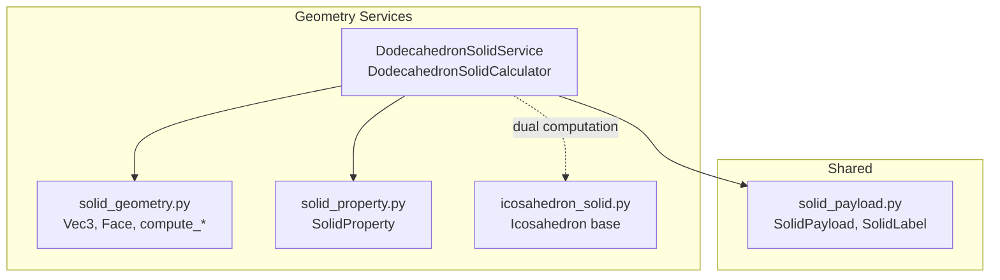
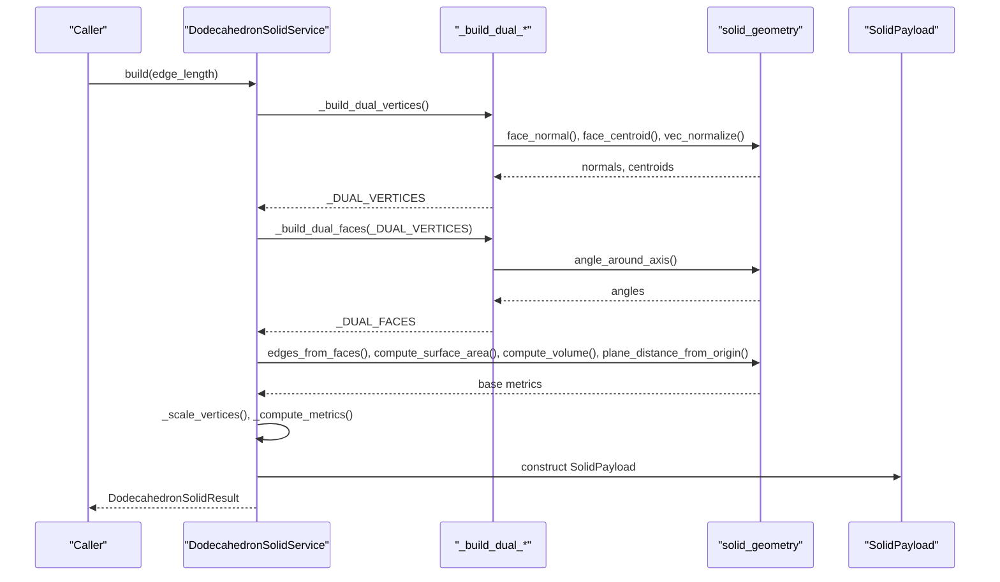
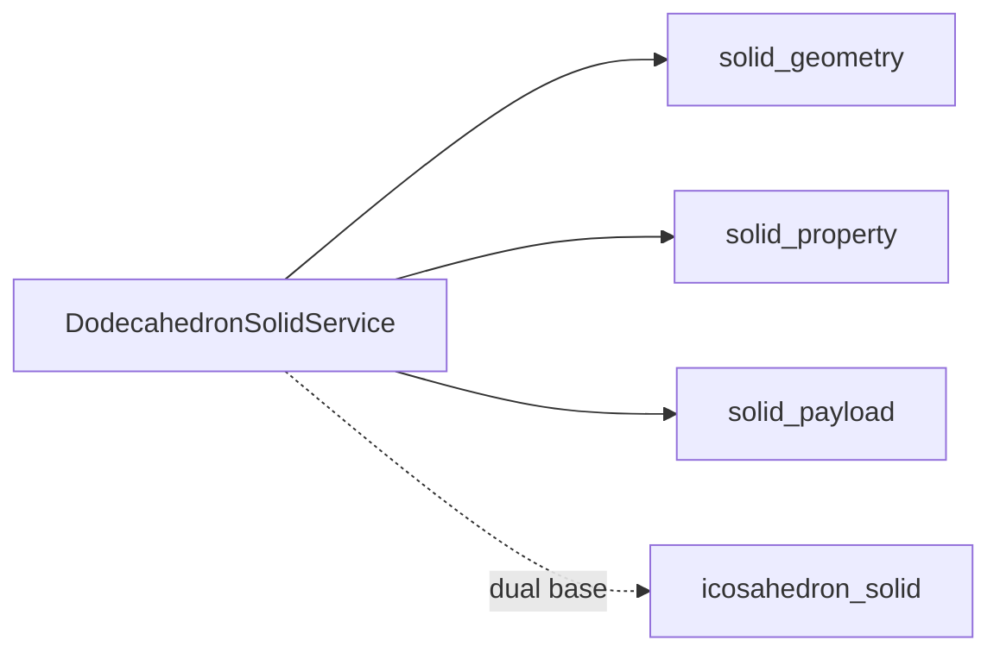
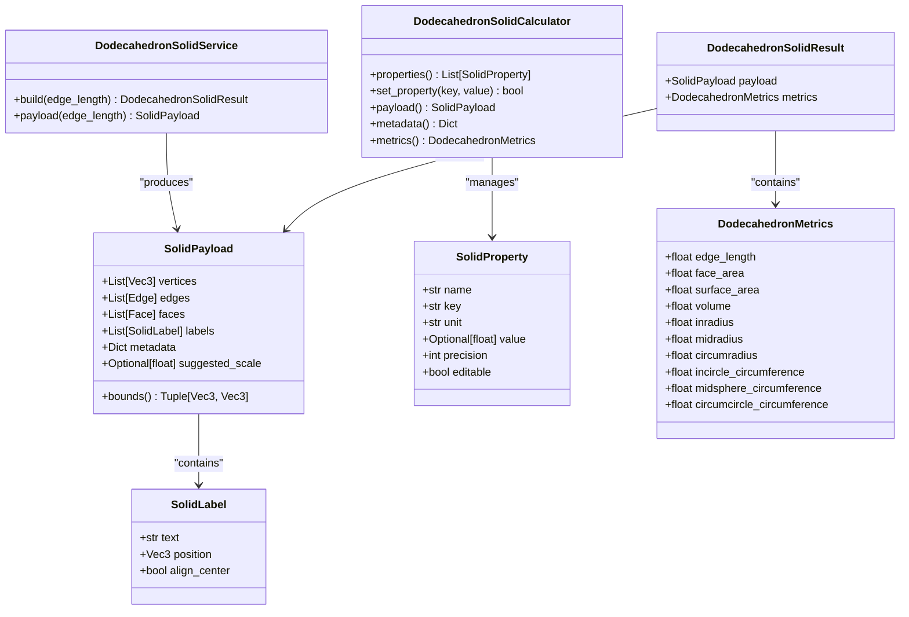

# Dodecahedron Solid API

<cite>
**Referenced Files in This Document**
- [dodecahedron_solid.py](file://src/pillars/geometry/services/dodecahedron_solid.py)
- [solid_geometry.py](file://src/pillars/geometry/services/solid_geometry.py)
- [solid_payload.py](file://src/pillars/geometry/shared/solid_payload.py)
- [solid_property.py](file://src/pillars/geometry/services/solid_property.py)
- [icosahedron_solid.py](file://src/pillars/geometry/services/icosahedron_solid.py)
- [test_platonic_solids.py](file://test/test_platonic_solids.py)
</cite>

## Table of Contents
1. [Introduction](#introduction)
2. [Project Structure](#project-structure)
3. [Core Components](#core-components)
4. [Architecture Overview](#architecture-overview)
5. [Detailed Component Analysis](#detailed-component-analysis)
6. [Dependency Analysis](#dependency-analysis)
7. [Performance Considerations](#performance-considerations)
8. [Troubleshooting Guide](#troubleshooting-guide)
9. [Conclusion](#conclusion)
10. [Appendices](#appendices)

## Introduction
This document describes the Dodecahedron Solid API, focusing on the construction of a regular dodecahedron from twelve regular pentagonal faces, the use of golden ratio-based vertex coordinates, and the computation of exact metrics such as volume, surface area, inradius, circumradius, and derived quantities. It also documents the dual computation pathway that yields an icosahedron via SolidGeometry utilities, and outlines usage patterns for creating canonical solids, extracting face data, and transforming into dual forms. Finally, it addresses vertex indexing, face orientation, floating-point precision considerations, and GPU rendering pipeline optimizations.

## Project Structure
The Dodecahedron Solid API resides in the geometry services module and relies on shared payload and property abstractions. The primary implementation builds a dodecahedron by computing duals of an icosahedron’s vertices and faces, then scaling the resulting dual to match a given edge length.

**Diagram sources**
- [dodecahedron_solid.py](file://src/pillars/geometry/services/dodecahedron_solid.py#L168-L203)
- [solid_geometry.py](file://src/pillars/geometry/services/solid_geometry.py#L1-L156)
- [solid_payload.py](file://src/pillars/geometry/shared/solid_payload.py#L1-L52)
- [solid_property.py](file://src/pillars/geometry/services/solid_property.py#L1-L21)
- [icosahedron_solid.py](file://src/pillars/geometry/services/icosahedron_solid.py#L1-L120)

**Section sources**
- [dodecahedron_solid.py](file://src/pillars/geometry/services/dodecahedron_solid.py#L1-L203)
- [solid_geometry.py](file://src/pillars/geometry/services/solid_geometry.py#L1-L156)
- [solid_payload.py](file://src/pillars/geometry/shared/solid_payload.py#L1-L52)
- [solid_property.py](file://src/pillars/geometry/services/solid_property.py#L1-L21)
- [icosahedron_solid.py](file://src/pillars/geometry/services/icosahedron_solid.py#L1-L120)

## Core Components
- DodecahedronSolidService: Builds a canonical dodecahedron by scaling a precomputed dual form derived from an icosahedron. Provides a SolidPayload and computed metrics.
- DodecahedronSolidCalculator: Bidirectional calculator that accepts a target property (e.g., surface area) and derives the edge length, then produces the payload and metrics.
- DodecahedronMetrics: Immutable dataclass containing computed metrics.
- DodecahedronSolidResult: Container for SolidPayload and DodecahedronMetrics.

Key behaviors:
- Vertex coordinates are golden-ratio-based, constructed from an icosahedron’s vertices and faces.
- Faces are generated from the dual of the icosahedron’s face lattice.
- Metrics are computed via shared geometry utilities and scaled by power laws of edge length.

**Section sources**
- [dodecahedron_solid.py](file://src/pillars/geometry/services/dodecahedron_solid.py#L120-L203)
- [dodecahedron_solid.py](file://src/pillars/geometry/services/dodecahedron_solid.py#L205-L310)

## Architecture Overview
The dodecahedron is built by:
1. Starting with an icosahedron’s vertices and faces.
2. Computing dual vertices by normalizing face normals and centroids, then orienting normals consistently.
3. Building dual faces by ordering neighboring faces around each original vertex using angular sorting.
4. Computing edges from faces, and deriving base metrics (edge length, face area, surface area, volume, inradius, midradius, circumradius).
5. Scaling the dual form to the requested edge length and packaging into SolidPayload.

**Diagram sources**
- [dodecahedron_solid.py](file://src/pillars/geometry/services/dodecahedron_solid.py#L67-L118)
- [dodecahedron_solid.py](file://src/pillars/geometry/services/dodecahedron_solid.py#L168-L203)
- [solid_geometry.py](file://src/pillars/geometry/services/solid_geometry.py#L58-L156)

## Detailed Component Analysis

### DodecahedronSolidService
Responsibilities:
- Validates positive edge length.
- Computes base metrics from the dual icosahedron-derived geometry.
- Scales vertices and faces to the requested edge length.
- Produces SolidPayload with labels and metadata.

Methods:
- build(edge_length): Returns DodecahedronSolidResult.
- payload(edge_length): Convenience to return SolidPayload directly.

Vertex and face generation:
- Dual vertices are derived from icosahedron faces using face normals and centroids.
- Dual faces are ordered around each original vertex using angle_around_axis with a fixed axis reference.
- Edges are extracted from faces and stored as integer-indexed pairs.

Metrics:
- Surface area, volume, face area, inradius, midradius, circumradius, and circumference equivalents are computed from base values and scaled by power laws of the edge length.

Labels and metadata:
- Labels include edge length and volume.
- Metadata includes all computed metrics.

**Section sources**
- [dodecahedron_solid.py](file://src/pillars/geometry/services/dodecahedron_solid.py#L168-L203)
- [dodecahedron_solid.py](file://src/pillars/geometry/services/dodecahedron_solid.py#L140-L166)

### DodecahedronSolidCalculator
Responsibilities:
- Exposes a set of SolidProperty entries for edge length, surface area, volume, face area, inradius, midradius, circumradius, and circumference equivalents.
- Derives edge length from a chosen property using power-law scaling from base values.
- Maintains last computed result and updates property values accordingly.

Usage:
- properties(): Enumerates editable properties.
- set_property(key, value): Updates the model and recomputes geometry.
- payload(), metadata(), metrics(): Accessors to the latest result.

**Section sources**
- [dodecahedron_solid.py](file://src/pillars/geometry/services/dodecahedron_solid.py#L205-L310)
- [solid_property.py](file://src/pillars/geometry/services/solid_property.py#L1-L21)

### Dual Computation and Icosahedron Relationship
The dodecahedron is constructed as the dual of an icosahedron:
- The icosahedron’s vertices and faces are defined with golden-ratio coordinates.
- Dual vertices are computed by normalizing face normals and adjusting orientation based on dot products with face centroids.
- Dual faces are ordered by projecting points onto planes and measuring angles around axes.

This relationship ensures that the resulting dodecahedron has twelve regular pentagonal faces and golden-ratio-based vertex positions.

**Section sources**
- [dodecahedron_solid.py](file://src/pillars/geometry/services/dodecahedron_solid.py#L26-L66)
- [dodecahedron_solid.py](file://src/pillars/geometry/services/dodecahedron_solid.py#L67-L118)
- [icosahedron_solid.py](file://src/pillars/geometry/services/icosahedron_solid.py#L22-L67)

### Geometry Utilities Used
- Vec3 and Face types define vector and polygonal face representations.
- Vector operations: add, subtract, scale, dot, cross, length, normalize.
- Polygon area via triangulation and cross products.
- Face normal from three vertices.
- Plane distance from origin using normalized face normal.
- Surface area as sum of polygon areas.
- Volume via triple scalar products.
- Edges from faces by collecting unique unordered pairs.
- Face centroid and angle_around_axis for dual face ordering.

These utilities underpin the exact metric computations and dual transformations.

**Section sources**
- [solid_geometry.py](file://src/pillars/geometry/services/solid_geometry.py#L1-L156)

### API Reference

- DodecahedronSolidService.build(edge_length: float = 1.0) -> DodecahedronSolidResult
  - Creates a canonical dodecahedron with the specified edge length.
  - Raises ValueError if edge_length <= 0.
  - Returns SolidPayload with vertices, edges, faces, labels, and metadata.

- DodecahedronSolidService.payload(edge_length: float = 1.0) -> SolidPayload
  - Convenience method returning the payload directly.

- DodecahedronSolidCalculator(properties: List[SolidProperty]) -> None
  - Initializes calculator with base values and solvers.

- DodecahedronSolidCalculator.set_property(key: str, value: Optional[float]) -> bool
  - Sets a property (e.g., surface_area) and recomputes edge length and metrics.

- DodecahedronSolidCalculator.properties() -> List[SolidProperty]
  - Returns the list of properties with current values.

- DodecahedronSolidCalculator.payload() -> Optional[SolidPayload]
  - Returns the latest payload.

- DodecahedronSolidCalculator.metadata() -> Dict[str, float]
  - Returns the latest metadata dictionary.

- DodecahedronSolidCalculator.metrics() -> Optional[DodecahedronMetrics]
  - Returns the latest metrics.

- DodecahedronMetrics
  - Fields: edge_length, face_area, surface_area, volume, inradius, midradius, circumradius, incircle_circumference, midsphere_circumference, circumcircle_circumference.

- DodecahedronSolidResult
  - Fields: payload: SolidPayload, metrics: DodecahedronMetrics.

**Section sources**
- [dodecahedron_solid.py](file://src/pillars/geometry/services/dodecahedron_solid.py#L120-L203)
- [dodecahedron_solid.py](file://src/pillars/geometry/services/dodecahedron_solid.py#L205-L310)

### Usage Examples

- Creating a canonical dodecahedron with a specific edge length:
  - Use DodecahedronSolidService.build(edge_length) to obtain a SolidPayload and metrics.
  - Alternatively, use DodecahedronSolidService.payload(edge_length) to get the payload directly.

- Extracting pentagonal face data:
  - Access result.payload.faces to retrieve the list of faces as integer-indexed sequences.
  - Access result.payload.vertices to retrieve vertex coordinates.

- Transforming into dual forms:
  - The dual is computed internally from the icosahedron’s vertices and faces.
  - The resulting dual vertices and faces are scaled to the requested edge length and packaged into SolidPayload.

- Using the calculator to derive edge length from a property:
  - Initialize DodecahedronSolidCalculator().
  - Call set_property('surface_area', desired_area) to compute the corresponding edge length and update internal metrics.

- Verifying closed-form results:
  - Unit tests demonstrate expected surface area and volume for given edge lengths, validating the exact formulas embedded in the implementation.

**Section sources**
- [dodecahedron_solid.py](file://src/pillars/geometry/services/dodecahedron_solid.py#L168-L203)
- [test_platonic_solids.py](file://test/test_platonic_solids.py#L65-L81)

### Vertex Indexing Scheme and Face Orientation
- Vertex indexing:
  - Vertices are integer indices into the SolidPayload.vertices list.
  - The dual construction uses the icosahedron’s vertex indices to order dual faces.

- Face orientation:
  - Faces are represented as sequences of vertex indices.
  - The dual face ordering uses angle_around_axis to sort neighbors around each original vertex, ensuring consistent orientation.

- Alignment with coordinate axes:
  - The icosahedron’s base vertices are aligned along the x, y, z axes and coordinate planes, leveraging the golden ratio for symmetry.

**Section sources**
- [dodecahedron_solid.py](file://src/pillars/geometry/services/dodecahedron_solid.py#L26-L66)
- [dodecahedron_solid.py](file://src/pillars/geometry/services/dodecahedron_solid.py#L81-L118)
- [solid_geometry.py](file://src/pillars/geometry/services/solid_geometry.py#L119-L135)

### Exact Formulas and Metric Definitions
- Surface area and volume are computed from base values derived from the dual icosahedron and scaled by power laws of the edge length.
- Face area is computed from polygon area via triangulation.
- Inradius is computed as the distance from the origin to the face plane using the normalized face normal.
- Midradius is the distance from the origin to the midpoint of an edge.
- Circumradius is the distance from the origin to a vertex.
- Circumference equivalents are derived from radii.

These definitions are validated by unit tests that compare computed metrics against closed-form expressions.

**Section sources**
- [dodecahedron_solid.py](file://src/pillars/geometry/services/dodecahedron_solid.py#L100-L118)
- [dodecahedron_solid.py](file://src/pillars/geometry/services/dodecahedron_solid.py#L153-L166)
- [solid_geometry.py](file://src/pillars/geometry/services/solid_geometry.py#L46-L156)
- [test_platonic_solids.py](file://test/test_platonic_solids.py#L65-L81)

### Stellation Operations
- No explicit stellation operations are implemented in the DodecahedronSolid API.
- The dual computation yields an icosahedron, which can serve as a foundation for higher-order polyhedral operations in other parts of the system.

**Section sources**
- [dodecahedron_solid.py](file://src/pillars/geometry/services/dodecahedron_solid.py#L67-L118)
- [icosahedron_solid.py](file://src/pillars/geometry/services/icosahedron_solid.py#L1-L120)

### Floating-Point Precision and GPU Rendering Optimizations
- Golden ratio computations rely on math.sqrt(5.0) and arithmetic combinations; numerical stability is ensured by using exact base values and scaling.
- Angle computations use atan2 with normalized vectors to avoid degeneracies.
- For GPU pipelines:
  - Precompute base metrics and reuse them to minimize redundant calculations.
  - Normalize and pack vertex data to reduce memory bandwidth.
  - Use indexed rendering with integer faces for efficient GPU attribute interpolation.
  - Consider double precision for extreme numerical sensitivity scenarios.

**Section sources**
- [dodecahedron_solid.py](file://src/pillars/geometry/services/dodecahedron_solid.py#L26-L31)
- [solid_geometry.py](file://src/pillars/geometry/services/solid_geometry.py#L119-L135)

## Dependency Analysis
The DodecahedronSolidService depends on:
- solid_geometry for vector math, polygon area, surface area, volume, edges extraction, face normal, centroid, and angle computations.
- solid_payload for the standardized SolidPayload container.
- solid_property for property definitions used by the calculator.
- icosahedron_solid for the dual construction base (vertices and faces).

**Diagram sources**
- [dodecahedron_solid.py](file://src/pillars/geometry/services/dodecahedron_solid.py#L168-L203)
- [solid_geometry.py](file://src/pillars/geometry/services/solid_geometry.py#L1-L156)
- [solid_payload.py](file://src/pillars/geometry/shared/solid_payload.py#L1-L52)
- [solid_property.py](file://src/pillars/geometry/services/solid_property.py#L1-L21)
- [icosahedron_solid.py](file://src/pillars/geometry/services/icosahedron_solid.py#L1-L120)

**Section sources**
- [dodecahedron_solid.py](file://src/pillars/geometry/services/dodecahedron_solid.py#L168-L203)
- [solid_geometry.py](file://src/pillars/geometry/services/solid_geometry.py#L1-L156)
- [solid_payload.py](file://src/pillars/geometry/shared/solid_payload.py#L1-L52)
- [solid_property.py](file://src/pillars/geometry/services/solid_property.py#L1-L21)
- [icosahedron_solid.py](file://src/pillars/geometry/services/icosahedron_solid.py#L1-L120)

## Performance Considerations
- Precomputation: Base metrics are computed once and reused for scaling, minimizing repeated geometry calculations.
- Integer indexing: Faces and edges are integer-indexed, enabling fast GPU attribute lookups.
- Vector operations: All vector math is O(1) per operation; total cost scales linearly with the number of faces/vertices.
- Avoid redundant normalization: The dual computation normalizes normals once per face; subsequent operations use normalized vectors.

[No sources needed since this section provides general guidance]

## Troubleshooting Guide
- Edge length must be positive:
  - DodecahedronSolidService.build raises ValueError for non-positive edge length.
- Property values must be positive:
  - DodecahedronSolidCalculator.set_property returns False if value is None, non-positive, or invalid.
- Unexpected NaN or infinities:
  - Ensure base values are finite and positive; the calculator guards against invalid inputs.
- Incorrect face orientation:
  - Verify that faces are integer-indexed and that dual face ordering is consistent with the intended winding.

**Section sources**
- [dodecahedron_solid.py](file://src/pillars/geometry/services/dodecahedron_solid.py#L171-L175)
- [dodecahedron_solid.py](file://src/pillars/geometry/services/dodecahedron_solid.py#L259-L268)

## Conclusion
The Dodecahedron Solid API provides a robust, exact, and scalable implementation of a regular dodecahedron using golden-ratio-based coordinates and dual computation from an icosahedron. It exposes both procedural and calculator-driven workflows, computes comprehensive metrics, and integrates cleanly with GPU-ready payloads. The design emphasizes correctness, performance, and extensibility for downstream geometry applications.

[No sources needed since this section summarizes without analyzing specific files]

## Appendices

### Appendix A: Data Model Diagram

**Diagram sources**
- [solid_payload.py](file://src/pillars/geometry/shared/solid_payload.py#L1-L52)
- [solid_property.py](file://src/pillars/geometry/services/solid_property.py#L1-L21)
- [dodecahedron_solid.py](file://src/pillars/geometry/services/dodecahedron_solid.py#L120-L203)
- [dodecahedron_solid.py](file://src/pillars/geometry/services/dodecahedron_solid.py#L205-L310)