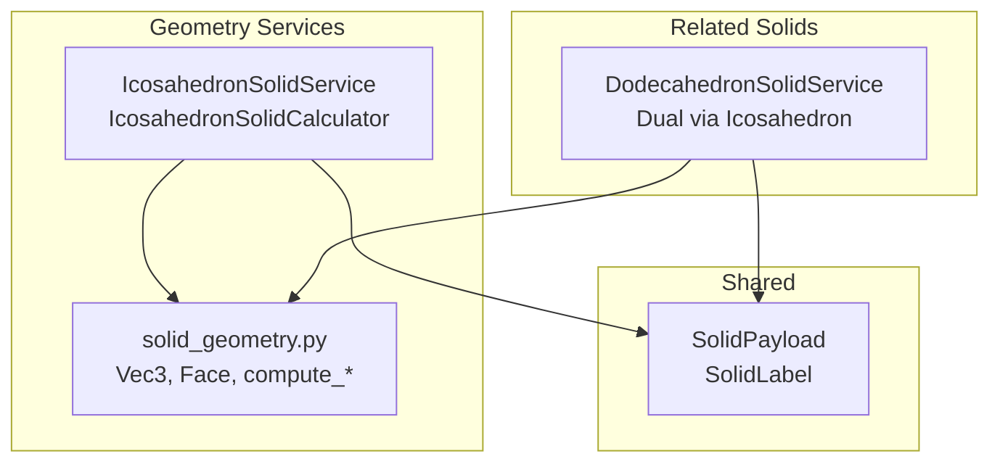
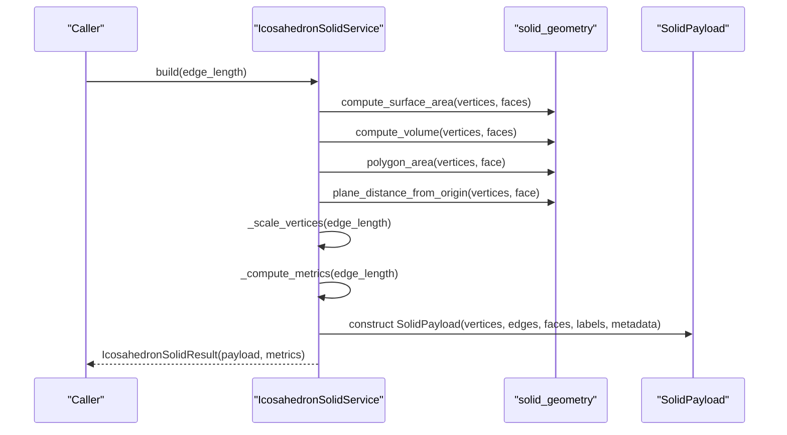
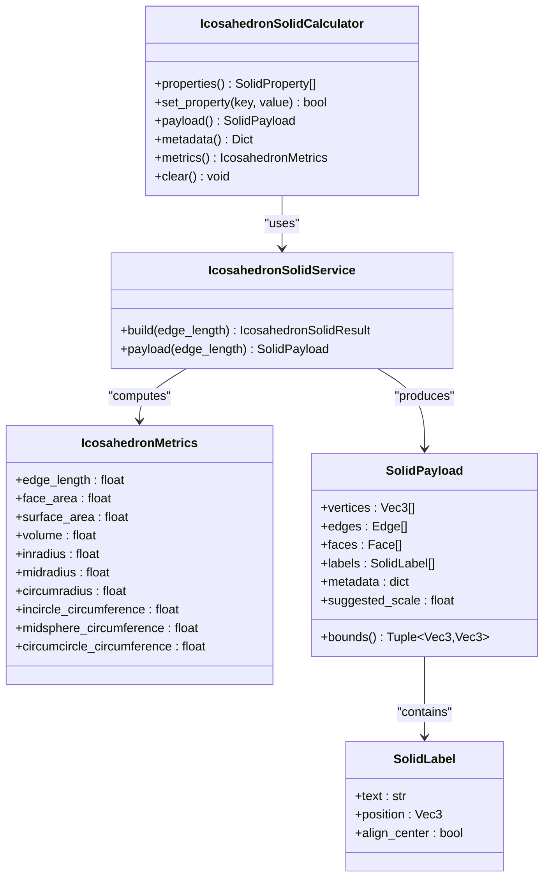
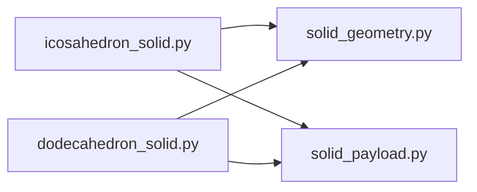

# Icosahedron Solid API

<cite>
**Referenced Files in This Document**
- [icosahedron_solid.py](file://src/pillars/geometry/services/icosahedron_solid.py)
- [solid_geometry.py](file://src/pillars/geometry/services/solid_geometry.py)
- [solid_payload.py](file://src/pillars/geometry/shared/solid_payload.py)
- [dodecahedron_solid.py](file://src/pillars/geometry/services/dodecahedron_solid.py)
- [test_platonic_solids.py](file://test/test_platonic_solids.py)
</cite>

## Table of Contents
1. [Introduction](#introduction)
2. [Project Structure](#project-structure)
3. [Core Components](#core-components)
4. [Architecture Overview](#architecture-overview)
5. [Detailed Component Analysis](#detailed-component-analysis)
6. [Dependency Analysis](#dependency-analysis)
7. [Performance Considerations](#performance-considerations)
8. [Troubleshooting Guide](#troubleshooting-guide)
9. [Conclusion](#conclusion)
10. [Appendices](#appendices)

## Introduction
This document provides API documentation for the IcosahedronSolid class and related services that define a regular icosahedron with:
- Twenty equilateral triangular faces
- Golden ratio-dependent vertex coordinates
- Precise computation of volume, surface area, inradius, circumradius, and related metrics
- Methods for building vertex/edge/face meshes and extracting face data
- Dual transformation capability via SolidGeometry (constructing a dodecahedron)
- Stellation-related utilities in the broader geometry engine
- Examples for instantiation, face centroid computation, and exporting vertex buffers for 3D rendering
- Vertex layout description, face winding order, and coordinate system alignment
- Numerical stability considerations and performance guidance for interactive environments

## Project Structure
The IcosahedronSolid API lives in the Geometry pillar under services and shares data structures with shared modules.

**Diagram sources**
- [icosahedron_solid.py](file://src/pillars/geometry/services/icosahedron_solid.py#L128-L264)
- [solid_geometry.py](file://src/pillars/geometry/services/solid_geometry.py#L1-L156)
- [solid_payload.py](file://src/pillars/geometry/shared/solid_payload.py#L1-L52)
- [dodecahedron_solid.py](file://src/pillars/geometry/services/dodecahedron_solid.py#L168-L304)

**Section sources**
- [icosahedron_solid.py](file://src/pillars/geometry/services/icosahedron_solid.py#L1-L271)
- [solid_geometry.py](file://src/pillars/geometry/services/solid_geometry.py#L1-L156)
- [solid_payload.py](file://src/pillars/geometry/shared/solid_payload.py#L1-L52)
- [dodecahedron_solid.py](file://src/pillars/geometry/services/dodecahedron_solid.py#L1-L311)

## Core Components
- IcosahedronSolidService: Builds a SolidPayload for a regular icosahedron given an edge length. Provides both a builder and a convenience method returning only the payload.
- IcosahedronSolidCalculator: Bidirectional calculator that computes derived metrics from a chosen property (e.g., volume) and keeps a cached SolidPayload.
- IcosahedronMetrics: Immutable dataclass containing computed metrics for an icosahedron at a given edge length.
- IcosahedronSolidResult: Container pairing a SolidPayload with IcosahedronMetrics.
- solid_geometry helpers: Vector math, polygon area, volume, edges extraction, face centroid, and angle computation used by both icosahedron and dodecahedron services.
- SolidPayload: Standardized mesh container with vertices, edges, faces, labels, metadata, and suggested scale.

Key responsibilities:
- Vertex coordinates are defined using the golden ratio and arranged in two polar rings plus two antipodal poles.
- Metrics are computed by scaling base values derived from the canonical icosahedron.
- Dual transformation to a dodecahedron is implemented by constructing dual vertices and faces from the icosahedron’s face normals and centroids.

**Section sources**
- [icosahedron_solid.py](file://src/pillars/geometry/services/icosahedron_solid.py#L128-L264)
- [solid_geometry.py](file://src/pillars/geometry/services/solid_geometry.py#L1-L156)
- [solid_payload.py](file://src/pillars/geometry/shared/solid_payload.py#L1-L52)
- [dodecahedron_solid.py](file://src/pillars/geometry/services/dodecahedron_solid.py#L67-L118)

## Architecture Overview
The IcosahedronSolid API composes:
- Canonical icosahedron definition with golden-ratio vertices and triangular faces
- Metric computation via scaling laws
- Payload construction for 3D rendering
- Optional dual transformation to a dodecahedron using SolidGeometry utilities

**Diagram sources**
- [icosahedron_solid.py](file://src/pillars/geometry/services/icosahedron_solid.py#L128-L159)
- [solid_geometry.py](file://src/pillars/geometry/services/solid_geometry.py#L46-L117)

## Detailed Component Analysis

### IcosahedronSolidService
- Purpose: Construct a SolidPayload and associated metrics for a regular icosahedron with a given edge length.
- Key methods:
  - build(edge_length): Validates positive edge length, computes metrics, scales canonical vertices, and constructs SolidPayload with labels and metadata.
  - payload(edge_length): Convenience method returning only the SolidPayload.

Behavior highlights:
- Edge length validation raises an error for non-positive values.
- Base metrics are precomputed from canonical icosahedron data and scaled using power laws (area scales with edge_length^2, volume with edge_length^3, radii with edge_length^1).
- Metadata includes edge_length, face_area, surface_area, volume, inradius, midradius, circumradius, and circumferences for insphere, midsphere, and circumsphere.

**Section sources**
- [icosahedron_solid.py](file://src/pillars/geometry/services/icosahedron_solid.py#L128-L163)

### IcosahedronSolidCalculator
- Purpose: Bidirectional calculator that derives edge_length from a selected property (e.g., volume) and caches the resulting SolidPayload and metrics.
- Key methods:
  - properties(): Returns SolidProperty instances for all metrics.
  - set_property(key, value): Updates the model by deriving edge_length from the chosen property and re-applying it.
  - payload(), metadata(), metrics(): Accessors to the cached SolidPayload and computed metrics.
  - clear(): Resets all properties and clears the cached result.

Scaling logic:
- Uses base values and power exponents to derive a scale factor and compute new edge_length.

**Section sources**
- [icosahedron_solid.py](file://src/pillars/geometry/services/icosahedron_solid.py#L165-L264)

### IcosahedronMetrics and IcosahedronSolidResult
- IcosahedronMetrics: Immutable record of computed metrics for a given edge length.
- IcosahedronSolidResult: Bundles a SolidPayload with its corresponding IcosahedronMetrics.

**Section sources**
- [icosahedron_solid.py](file://src/pillars/geometry/services/icosahedron_solid.py#L80-L126)

### SolidGeometry Utilities Used by IcosahedronSolidService
- Vector operations: add, subtract, scale, dot, cross, length, normalize.
- Polygon area and face normal computation.
- Surface area and volume summation over faces.
- Edges extraction from faces.
- Face centroid computation.
- Angle around axis for ordering dual faces.

These utilities are also used by the dual transformation to a dodecahedron.

**Section sources**
- [solid_geometry.py](file://src/pillars/geometry/services/solid_geometry.py#L1-L156)

### Dual Transformation to Dodecahedron via SolidGeometry
- The dodecahedron service constructs dual vertices from icosahedron face normals and centroids, then orders dual faces around each icosahedron vertex using angle computation.
- This demonstrates the mathematical relationship between the icosahedron and dodecahedron as dual polyhedra.

**Section sources**
- [dodecahedron_solid.py](file://src/pillars/geometry/services/dodecahedron_solid.py#L67-L118)
- [solid_geometry.py](file://src/pillars/geometry/services/solid_geometry.py#L119-L135)

### Stellation Capabilities
- The geometry engine includes stellation-related utilities and figurate solids. While the icosahedron service does not expose explicit stellation methods, the presence of stellation utilities in the geometry engine indicates potential pathways for extending the icosahedron API with stellation features in future iterations.

**Section sources**
- [figurate_3d.py](file://src/pillars/geometry/services/figurate_3d.py#L349-L363)
- [figurate_3d.py](file://src/pillars/geometry/services/figurate_3d.py#L644-L681)

## Architecture Overview

**Diagram sources**
- [icosahedron_solid.py](file://src/pillars/geometry/services/icosahedron_solid.py#L80-L163)
- [solid_payload.py](file://src/pillars/geometry/shared/solid_payload.py#L1-L52)

## Detailed Component Analysis

### Vertex Layout and Coordinate System Alignment
- Vertex coordinates depend on the golden ratio and are arranged in two polar rings with polar caps. The canonical vertices are defined using signed permutations of coordinates involving ±1 and ±φ, forming a symmetric arrangement around the origin.
- Coordinate system alignment: The origin is centered, and the mesh is aligned so that polar symmetry is preserved. The suggested_scale in SolidPayload reflects the edge length and can be used by renderers to scale the mesh appropriately.

**Section sources**
- [icosahedron_solid.py](file://src/pillars/geometry/services/icosahedron_solid.py#L22-L37)

### Face Extraction and Winding Order
- Faces are defined as ordered triples of vertex indices. The winding order is implied by the face definitions and is consistent with the canonical icosahedron orientation.
- Edges are extracted from faces to provide a deduplicated edge list for connectivity.

**Section sources**
- [icosahedron_solid.py](file://src/pillars/geometry/services/icosahedron_solid.py#L39-L61)
- [solid_geometry.py](file://src/pillars/geometry/services/solid_geometry.py#L94-L107)

### Computing Face Centroids
- Face centroid computation is provided by SolidGeometry and can be used to extract per-face centroids for labeling or rendering.

**Section sources**
- [solid_geometry.py](file://src/pillars/geometry/services/solid_geometry.py#L109-L117)

### Exporting Vertex Buffers for 3D Rendering
- SolidPayload exposes vertices, edges, and faces as lists suitable for immediate consumption by 3D renderers. The suggested_scale can be used to scale the mesh to desired units.
- Example usage patterns are validated by tests that confirm correct counts and metric approximations.

**Section sources**
- [solid_payload.py](file://src/pillars/geometry/shared/solid_payload.py#L1-L52)
- [test_platonic_solids.py](file://test/test_platonic_solids.py#L83-L98)

### Dual Transformation to Dodecahedron
- The dodecahedron service constructs dual vertices from icosahedron face normals and centroids, then orders dual faces around each icosahedron vertex using angle computation around an axis. This demonstrates the dual relationship between icosahedron and dodecahedron.

**Section sources**
- [dodecahedron_solid.py](file://src/pillars/geometry/services/dodecahedron_solid.py#L67-L118)
- [solid_geometry.py](file://src/pillars/geometry/services/solid_geometry.py#L119-L135)

### Stellation Capabilities
- Stellation-related utilities exist in the geometry engine, indicating potential for extending the icosahedron API with stellation features. These utilities can be leveraged to compute stellated variants of the icosahedron.

**Section sources**
- [figurate_3d.py](file://src/pillars/geometry/services/figurate_3d.py#L349-L363)
- [figurate_3d.py](file://src/pillars/geometry/services/figurate_3d.py#L644-L681)

## Dependency Analysis

**Diagram sources**
- [icosahedron_solid.py](file://src/pillars/geometry/services/icosahedron_solid.py#L1-L271)
- [solid_geometry.py](file://src/pillars/geometry/services/solid_geometry.py#L1-L156)
- [solid_payload.py](file://src/pillars/geometry/shared/solid_payload.py#L1-L52)
- [dodecahedron_solid.py](file://src/pillars/geometry/services/dodecahedron_solid.py#L1-L311)

**Section sources**
- [icosahedron_solid.py](file://src/pillars/geometry/services/icosahedron_solid.py#L1-L271)
- [solid_geometry.py](file://src/pillars/geometry/services/solid_geometry.py#L1-L156)
- [solid_payload.py](file://src/pillars/geometry/shared/solid_payload.py#L1-L52)
- [dodecahedron_solid.py](file://src/pillars/geometry/services/dodecahedron_solid.py#L1-L311)

## Performance Considerations
- Precomputed base metrics: The icosahedron service precomputes base values for edge length, face area, surface area, volume, inradius, midradius, circumradius, and circumferences. Scaling these base values by power laws avoids recomputing integrals for each call.
- Minimal allocations: Vertex scaling and metric computation are vectorized-like operations over small arrays (12 vertices, 20 faces), minimizing overhead.
- Interactive environments: For frequent updates, cache the SolidPayload and only recompute when edge_length changes. The Calculator pattern encapsulates this caching and property-driven updates.
- Numerical stability: Using the golden ratio φ and sqrt(5) introduces floating-point arithmetic. Prefer stable expressions and avoid catastrophic cancellation by computing base values once and scaling.

[No sources needed since this section provides general guidance]

## Troubleshooting Guide
- Non-positive edge length: Building an icosahedron with a non-positive edge length raises an error. Ensure the caller supplies a positive value.
- Property-driven updates: When using the calculator, setting a property to None or non-positive value is ignored. Ensure values are finite and greater than zero.
- Metric validation: Unit tests validate closed-form approximations for surface area and volume against known formulas. If discrepancies arise, verify the edge length and confirm the expected scaling.

**Section sources**
- [icosahedron_solid.py](file://src/pillars/geometry/services/icosahedron_solid.py#L131-L135)
- [icosahedron_solid.py](file://src/pillars/geometry/services/icosahedron_solid.py#L219-L227)
- [test_platonic_solids.py](file://test/test_platonic_solids.py#L83-L98)

## Conclusion
The IcosahedronSolid API provides a robust, mathematically grounded representation of a regular icosahedron with:
- Golden-ratio vertex coordinates and canonical triangular faces
- Efficient metric computation via scaling laws
- Standardized SolidPayload export for 3D rendering
- Clear dual transformation pathway to a dodecahedron
- Extensible foundation for stellation and advanced geometry features

Its design balances numerical stability, performance, and usability for both programmatic and interactive applications.

[No sources needed since this section summarizes without analyzing specific files]

## Appendices

### API Reference Summary

- IcosahedronSolidService
  - build(edge_length: float) -> IcosahedronSolidResult
  - payload(edge_length: float) -> SolidPayload

- IcosahedronSolidCalculator
  - properties() -> List[SolidProperty]
  - set_property(key: str, value: Optional[float]) -> bool
  - payload() -> Optional[SolidPayload]
  - metadata() -> Dict[str, float]
  - metrics() -> Optional[IcosahedronMetrics]
  - clear() -> None

- IcosahedronMetrics
  - edge_length, face_area, surface_area, volume, inradius, midradius, circumradius, incircle_circumference, midsphere_circumference, circumcircle_circumference

- SolidPayload
  - vertices, edges, faces, labels, metadata, suggested_scale
  - bounds() -> Optional[Tuple[Vec3, Vec3]]

- SolidLabel
  - text, position, align_center

**Section sources**
- [icosahedron_solid.py](file://src/pillars/geometry/services/icosahedron_solid.py#L80-L264)
- [solid_payload.py](file://src/pillars/geometry/shared/solid_payload.py#L1-L52)

### Examples and Usage Patterns

- Instantiate an icosahedron with a given edge length:
  - Use IcosahedronSolidService.build(edge_length) to obtain a SolidPayload and metrics.
  - Alternatively, use IcosahedronSolidService.payload(edge_length) to get only the payload.

- Compute face centroids:
  - Use face_centroid(vertices, face) from solid_geometry to compute per-face centroids.

- Export vertex buffers for 3D rendering:
  - Consume SolidPayload.vertices, SolidPayload.faces, and SolidPayload.edges.
  - Use SolidPayload.suggested_scale to align units.

- Dual transformation to dodecahedron:
  - Leverage the dodecahedron service’s dual construction from icosahedron face normals and centroids.

**Section sources**
- [icosahedron_solid.py](file://src/pillars/geometry/services/icosahedron_solid.py#L128-L163)
- [solid_geometry.py](file://src/pillars/geometry/services/solid_geometry.py#L109-L117)
- [dodecahedron_solid.py](file://src/pillars/geometry/services/dodecahedron_solid.py#L67-L118)
- [test_platonic_solids.py](file://test/test_platonic_solids.py#L83-L98)