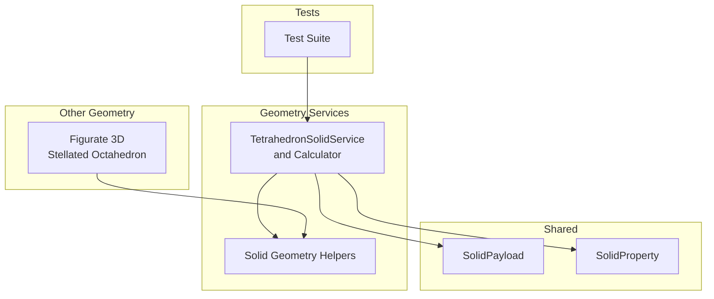
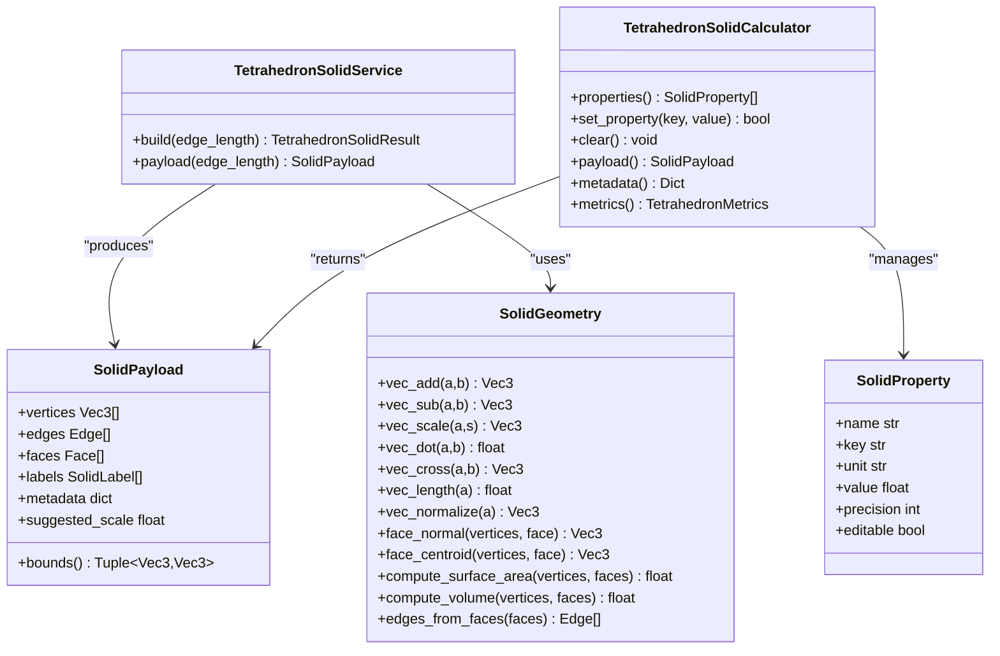
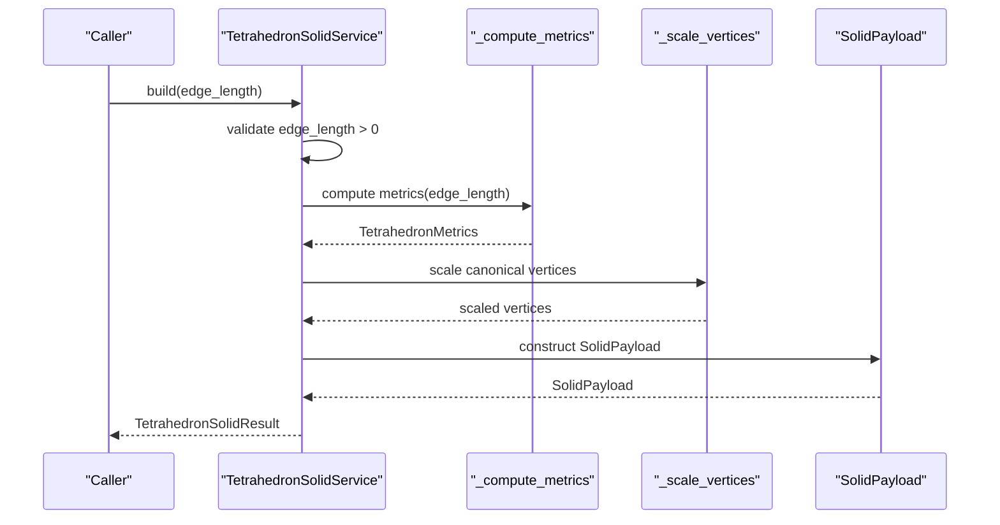
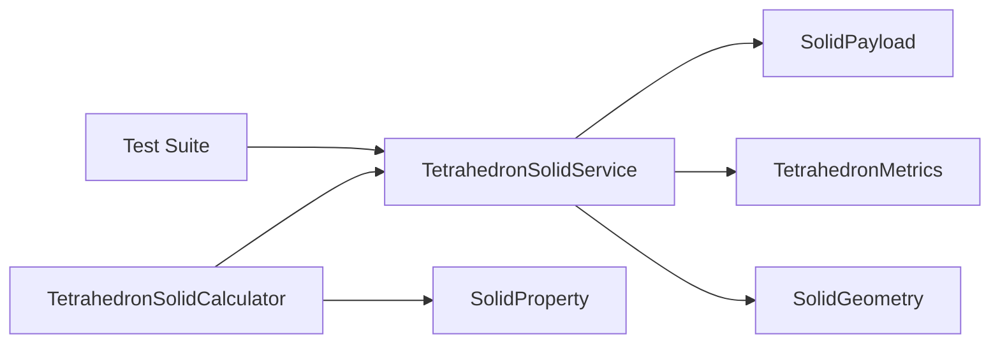

# Tetrahedron Solid API

<cite>
**Referenced Files in This Document**
- [tetrahedron_solid.py](file://src/pillars/geometry/services/tetrahedron_solid.py)
- [solid_geometry.py](file://src/pillars/geometry/services/solid_geometry.py)
- [solid_payload.py](file://src/pillars/geometry/shared/solid_payload.py)
- [solid_property.py](file://src/pillars/geometry/services/solid_property.py)
- [test_tetrahedron_solid.py](file://test/test_tetrahedron_solid.py)
- [figurate_3d.py](file://src/pillars/geometry/services/figurate_3d.py)
</cite>

## Table of Contents
1. [Introduction](#introduction)
2. [Project Structure](#project-structure)
3. [Core Components](#core-components)
4. [Architecture Overview](#architecture-overview)
5. [Detailed Component Analysis](#detailed-component-analysis)
6. [Dependency Analysis](#dependency-analysis)
7. [Performance Considerations](#performance-considerations)
8. [Troubleshooting Guide](#troubleshooting-guide)
9. [Conclusion](#conclusion)
10. [Appendices](#appendices)

## Introduction
This document provides API documentation for the TetrahedronSolid class suite, focusing on the equilateral tetrahedron’s geometric construction, canonical vertex embedding, derived metrics, and integration points for rendering and transformations. It also covers methods for computing face normals, centroids, and extracting edge vectors, along with guidance on dual computation and stellation operations. Symmetry group, orientation conventions, and vertex indexing order are clarified, and practical performance notes are included for real-time applications.

## Project Structure
The tetrahedron solid implementation resides under the geometry pillar and integrates with shared payload and geometry utilities.

**Diagram sources**
- [tetrahedron_solid.py](file://src/pillars/geometry/services/tetrahedron_solid.py#L60-L101)
- [solid_geometry.py](file://src/pillars/geometry/services/solid_geometry.py#L11-L156)
- [solid_payload.py](file://src/pillars/geometry/shared/solid_payload.py#L12-L52)
- [solid_property.py](file://src/pillars/geometry/services/solid_property.py#L8-L21)
- [test_tetrahedron_solid.py](file://test/test_tetrahedron_solid.py#L1-L72)
- [figurate_3d.py](file://src/pillars/geometry/services/figurate_3d.py#L366-L410)

**Section sources**
- [tetrahedron_solid.py](file://src/pillars/geometry/services/tetrahedron_solid.py#L60-L101)
- [solid_geometry.py](file://src/pillars/geometry/services/solid_geometry.py#L11-L156)
- [solid_payload.py](file://src/pillars/geometry/shared/solid_payload.py#L12-L52)
- [solid_property.py](file://src/pillars/geometry/services/solid_property.py#L8-L21)
- [test_tetrahedron_solid.py](file://test/test_tetrahedron_solid.py#L1-L72)
- [figurate_3d.py](file://src/pillars/geometry/services/figurate_3d.py#L366-L410)

## Core Components
- TetrahedronSolidService: Builds a canonical tetrahedron with a fixed base edge length and scales it to the requested edge length. Produces a SolidPayload and associated metrics.
- TetrahedronSolidCalculator: Bidirectional calculator that updates properties from any supported input (edge length, surface area, volume, height, face area, inradius, midradius, circumradius, and circumference equivalents).
- SolidPayload: Shared container for vertices, edges, faces, labels, metadata, and suggested scale.
- SolidProperty: Lightweight descriptor for calculator properties.
- Solid geometry helpers: Vector math, face normal, centroid, surface area, and volume utilities.

Key capabilities:
- Vertex coordinates from canonical embedding scaled to arbitrary edge length.
- Closed-form formulas for height, face area, surface area, volume, inradius, midradius, circumradius, and related circumferences.
- Methods to compute face normals, centroids, and extract edges.
- Integration with SolidGeometry for surface area/volume computation and vector utilities.
- Tests validating correctness and robustness.

**Section sources**
- [tetrahedron_solid.py](file://src/pillars/geometry/services/tetrahedron_solid.py#L60-L101)
- [tetrahedron_solid.py](file://src/pillars/geometry/services/tetrahedron_solid.py#L103-L192)
- [solid_geometry.py](file://src/pillars/geometry/services/solid_geometry.py#L11-L156)
- [solid_payload.py](file://src/pillars/geometry/shared/solid_payload.py#L12-L52)
- [solid_property.py](file://src/pillars/geometry/services/solid_property.py#L8-L21)
- [test_tetrahedron_solid.py](file://test/test_tetrahedron_solid.py#L1-L72)

## Architecture Overview
The API exposes two primary entry points:
- Service-based construction for building a SolidPayload with computed metrics.
- Calculator-based property-driven updates for interactive geometry editing.

**Diagram sources**
- [tetrahedron_solid.py](file://src/pillars/geometry/services/tetrahedron_solid.py#L60-L101)
- [tetrahedron_solid.py](file://src/pillars/geometry/services/tetrahedron_solid.py#L103-L192)
- [solid_geometry.py](file://src/pillars/geometry/services/solid_geometry.py#L11-L156)
- [solid_payload.py](file://src/pillars/geometry/shared/solid_payload.py#L12-L52)
- [solid_property.py](file://src/pillars/geometry/services/solid_property.py#L8-L21)

## Detailed Component Analysis

### TetrahedronSolidService
Responsibilities:
- Validates positive edge length.
- Computes closed-form metrics.
- Scales canonical vertices to the requested edge length.
- Assembles SolidPayload with labels and metadata.
- Exposes convenience payload accessor.

Key methods and behaviors:
- build(edge_length): Returns a TetrahedronSolidResult containing SolidPayload and TetrahedronMetrics.
- payload(edge_length): Convenience method returning only the SolidPayload.

Canonical embedding and scaling:
- Base vertices are defined in a canonical configuration centered at origin with a fixed base edge length.
- Scaling factor equals requested edge length divided by the base edge length.

Metrics:
- Height, face area, surface area, volume, inradius, midradius, circumradius, and circumference equivalents are computed using closed forms.

Labels and metadata:
- Labels include edge length and volume annotations.
- Metadata includes all computed metrics for downstream use.

**Section sources**
- [tetrahedron_solid.py](file://src/pillars/geometry/services/tetrahedron_solid.py#L60-L101)
- [tetrahedron_solid.py](file://src/pillars/geometry/services/tetrahedron_solid.py#L194-L229)

### TetrahedronSolidCalculator
Responsibilities:
- Maintains a set of SolidProperty descriptors keyed by metric names.
- Provides bidirectional conversion from any supported property to edge length and updates all derived properties accordingly.
- Stores last computed result and exposes payload/metrics/metadata.

Supported inputs:
- Edge length, surface area, volume, height, face area, inradius, midradius, circumradius, and circumference equivalents.

Validation:
- Rejects non-positive values and invalid keys.
- Ensures finite results.

Integration:
- Uses TetrahedronSolidService.build internally to compute metrics and payload.

**Section sources**
- [tetrahedron_solid.py](file://src/pillars/geometry/services/tetrahedron_solid.py#L103-L192)

### SolidPayload and SolidProperty
SolidPayload:
- Encapsulates vertices, edges, faces, labels, metadata, and suggested scale.
- Provides bounds extraction for rendering scale hints.

SolidProperty:
- Describes a single metric with name, key, unit, value, precision, and editability.

**Section sources**
- [solid_payload.py](file://src/pillars/geometry/shared/solid_payload.py#L12-L52)
- [solid_property.py](file://src/pillars/geometry/services/solid_property.py#L8-L21)

### Solid Geometry Utilities
Vector math and geometry helpers:
- Vector arithmetic: add, subtract, scale, dot, cross, length, normalize.
- Polygon area and face normal computation.
- Plane distance from origin using face normal.
- Surface area and volume computation from vertices and faces.
- Edge extraction from faces.
- Face centroid computation.
- Angle around axis for ordering dual faces.

These utilities support:
- Computing face normals and centroids.
- Extracting edges from face definitions.
- Verifying surface area/volume consistency.

**Section sources**
- [solid_geometry.py](file://src/pillars/geometry/services/solid_geometry.py#L11-L156)

### Dual Computation and Stellation Operations
- Dual computation for tetrahedron: The dual of a regular tetrahedron is another regular tetrahedron. The repository demonstrates dual computation patterns for other Platonic solids (e.g., dodecahedron) using face normals and centroids, which can be adapted to tetrahedron dualization.
- Stellation operations: The repository includes stellation-related utilities and a stellated octahedron construction that combines two intersecting tetrahedra (one inverted). While not a direct tetrahedron stellation, it illustrates how tetrahedra can be combined and transformed for higher-order polyhedral forms.

Note: The tetrahedron dualization and stellation APIs are not implemented in the referenced files. The above describes patterns present in the codebase that can be extended to tetrahedron-specific operations.

**Section sources**
- [solid_geometry.py](file://src/pillars/geometry/services/solid_geometry.py#L58-L75)
- [solid_geometry.py](file://src/pillars/geometry/services/solid_geometry.py#L109-L117)
- [figurate_3d.py](file://src/pillars/geometry/services/figurate_3d.py#L366-L410)

## Architecture Overview

**Diagram sources**
- [tetrahedron_solid.py](file://src/pillars/geometry/services/tetrahedron_solid.py#L60-L101)
- [tetrahedron_solid.py](file://src/pillars/geometry/services/tetrahedron_solid.py#L194-L229)

## Detailed Component Analysis

### Geometric Construction and Canonical Embedding
- Canonical vertices are defined in a symmetric configuration centered at the origin.
- The base edge length is fixed; the caller-specified edge length determines a uniform scaling factor.
- Faces and edges are defined as fixed index sets over the four vertices.

Vertex indexing and winding:
- Face indices are provided as triples over vertex indices.
- Winding order is defined by the face tuples; the repository does not enforce a global CCW convention, but the face definitions imply a consistent orientation.

Orientation conventions:
- The canonical embedding is symmetric; no explicit alignment to a specific axis is enforced in the tetrahedron service. Orientation can be achieved via translation or rotation elsewhere in the pipeline.

Symmetry group:
- The canonical embedding corresponds to the full octahedral symmetry group O_h, which is the symmetry group of the regular tetrahedron. The repository does not expose a dedicated symmetry group enumeration for the tetrahedron.

**Section sources**
- [tetrahedron_solid.py](file://src/pillars/geometry/services/tetrahedron_solid.py#L11-L32)
- [tetrahedron_solid.py](file://src/pillars/geometry/services/tetrahedron_solid.py#L194-L203)

### Formulas and Metrics
Closed-form expressions for an equilateral tetrahedron with edge length a:
- Height h = sqrt(2/3) * a
- Face area A_face = sqrt(3)/4 * a^2
- Surface area A = 4 * A_face
- Volume V = a^3 / (6 * sqrt(2))
- Inradius r_in = sqrt(6)/12 * a
- Midradius r_m = sqrt(2)/4 * a
- Circumradius R = sqrt(6)/4 * a
- Incircle circumference = 2 * pi * r_in
- Midsphere circumference = 2 * pi * r_m
- Circumcircle circumference = 2 * pi * R

These formulas are implemented in the metrics computation routine and validated by tests.

**Section sources**
- [tetrahedron_solid.py](file://src/pillars/geometry/services/tetrahedron_solid.py#L206-L229)
- [test_tetrahedron_solid.py](file://test/test_tetrahedron_solid.py#L12-L30)

### Methods for Face Normals, Centroid, and Edges
- Face normal: Computed from three face vertices using vector cross product.
- Face centroid: Averaged vertex positions for a given face.
- Edge extraction: Derived from faces by iterating cyclically over face indices and collecting unique undirected edges.

These utilities are provided by SolidGeometry and are used by the tetrahedron service to assemble payloads and metadata.

**Section sources**
- [solid_geometry.py](file://src/pillars/geometry/services/solid_geometry.py#L58-L75)
- [solid_geometry.py](file://src/pillars/geometry/services/solid_geometry.py#L109-L117)
- [solid_geometry.py](file://src/pillars/geometry/services/solid_geometry.py#L94-L107)

### Integration with SolidGeometry for Dual Computation
- Dual computation for other Platonic solids is demonstrated using face normals and centroids. The same pattern can be applied to tetrahedron dualization:
  - Compute face normals for each face.
  - Normalize normals to unit vectors.
  - Optionally flip normals based on orientation relative to face centroids.
  - Order dual vertices around axes to reconstruct dual faces.

This pattern is illustrated in the dodecahedron dual computation and can be adapted for tetrahedron.

**Section sources**
- [solid_geometry.py](file://src/pillars/geometry/services/solid_geometry.py#L58-L75)
- [solid_geometry.py](file://src/pillars/geometry/services/solid_geometry.py#L119-L134)
- [figurate_3d.py](file://src/pillars/geometry/services/figurate_3d.py#L366-L410)

### Stellation Operations
- Stellation-related utilities and a stellated octahedron construction demonstrate combining two intersecting tetrahedra (one inverted) to produce higher-order polyhedral forms.
- While not a direct tetrahedron stellation, this shows how tetrahedra can be combined for complex geometries.

**Section sources**
- [figurate_3d.py](file://src/pillars/geometry/services/figurate_3d.py#L366-L410)

### Example Workflows

#### Instantiate a tetrahedron with a specified edge length
- Use the service to build a SolidPayload and metrics.
- Access the payload for rendering or pass it to downstream systems.

Example path references:
- [build](file://src/pillars/geometry/services/tetrahedron_solid.py#L64-L95)
- [payload](file://src/pillars/geometry/services/tetrahedron_solid.py#L98-L100)

#### Transform into dual form (another tetrahedron)
- Compute face normals and centroids for the original tetrahedron.
- Normalize normals and reorder dual vertices to reconstruct dual faces.
- The dual of a regular tetrahedron is another regular tetrahedron.

Example path references:
- [face_normal](file://src/pillars/geometry/services/solid_geometry.py#L58-L65)
- [face_centroid](file://src/pillars/geometry/services/solid_geometry.py#L109-L117)
- [angle_around_axis](file://src/pillars/geometry/services/solid_geometry.py#L119-L134)

#### Export vertex data for 3D rendering
- Use the SolidPayload.vertices and SolidPayload.faces to feed a 3D renderer.
- Optionally compute normals per face using SolidGeometry.face_normal for lighting.

Example path references:
- [SolidPayload](file://src/pillars/geometry/shared/solid_payload.py#L12-L52)
- [face_normal](file://src/pillars/geometry/services/solid_geometry.py#L58-L65)

## Dependency Analysis

**Diagram sources**
- [tetrahedron_solid.py](file://src/pillars/geometry/services/tetrahedron_solid.py#L60-L101)
- [tetrahedron_solid.py](file://src/pillars/geometry/services/tetrahedron_solid.py#L103-L192)
- [solid_geometry.py](file://src/pillars/geometry/services/solid_geometry.py#L11-L156)
- [solid_payload.py](file://src/pillars/geometry/shared/solid_payload.py#L12-L52)
- [solid_property.py](file://src/pillars/geometry/services/solid_property.py#L8-L21)
- [test_tetrahedron_solid.py](file://test/test_tetrahedron_solid.py#L1-L72)

**Section sources**
- [tetrahedron_solid.py](file://src/pillars/geometry/services/tetrahedron_solid.py#L60-L101)
- [tetrahedron_solid.py](file://src/pillars/geometry/services/tetrahedron_solid.py#L103-L192)
- [solid_geometry.py](file://src/pillars/geometry/services/solid_geometry.py#L11-L156)
- [solid_payload.py](file://src/pillars/geometry/shared/solid_payload.py#L12-L52)
- [solid_property.py](file://src/pillars/geometry/services/solid_property.py#L8-L21)
- [test_tetrahedron_solid.py](file://test/test_tetrahedron_solid.py#L1-L72)

## Performance Considerations
- Real-time applications:
  - Precompute and cache metrics when the edge length is constant to avoid repeated math operations.
  - Use vectorized operations where applicable (not currently implemented) to reduce Python overhead.
  - Prefer SolidGeometry utilities for bulk operations (e.g., computing surface area or volume) rather than manual loops.
- Floating-point stability:
  - Height computation involves sqrt(2/3); ensure numerical checks avoid near-zero cross products when computing normals.
  - When extracting edges, prefer normalized edge tuples to prevent duplicates and reduce memory footprint.
  - For rendering, consider precomputing face normals to avoid recomputation per frame.

[No sources needed since this section provides general guidance]

## Troubleshooting Guide
Common issues and resolutions:
- Non-positive edge length:
  - The service raises a ValueError for non-positive inputs. Ensure callers validate inputs before invoking build.
  - Reference: [build](file://src/pillars/geometry/services/tetrahedron_solid.py#L64-L67)
- Invalid property inputs:
  - Calculator rejects negative or zero values and unsupported keys. Verify property keys and values.
  - Reference: [set_property](file://src/pillars/geometry/services/tetrahedron_solid.py#L145-L156)
- Metric mismatches:
  - Tests validate closed-form metrics. If discrepancies arise, recheck edge length and ensure consistent units.
  - Reference: [test_metrics_match_closed_form](file://test/test_tetrahedron_solid.py#L12-L30)

**Section sources**
- [tetrahedron_solid.py](file://src/pillars/geometry/services/tetrahedron_solid.py#L64-L67)
- [tetrahedron_solid.py](file://src/pillars/geometry/services/tetrahedron_solid.py#L145-L156)
- [test_tetrahedron_solid.py](file://test/test_tetrahedron_solid.py#L12-L30)

## Conclusion
The TetrahedronSolid API provides a robust, mathematically sound construction of equilateral tetrahedra with comprehensive metrics and payload integration. It supports property-driven updates, vector utilities for normals and centroids, and offers patterns for dual computation and stellation. By leveraging the provided service and calculator, developers can efficiently instantiate, transform, and render tetrahedra while maintaining correctness and performance.

[No sources needed since this section summarizes without analyzing specific files]

## Appendices

### API Reference Summary

- TetrahedronSolidService
  - build(edge_length): Returns SolidPayload and metrics.
  - payload(edge_length): Returns SolidPayload only.
  - References: [build](file://src/pillars/geometry/services/tetrahedron_solid.py#L64-L95), [payload](file://src/pillars/geometry/services/tetrahedron_solid.py#L98-L100)

- TetrahedronSolidCalculator
  - properties(): Property descriptors.
  - set_property(key, value): Updates properties and recomputes metrics.
  - clear(), payload(), metadata(), metrics(): Accessors.
  - References: [properties](file://src/pillars/geometry/services/tetrahedron_solid.py#L142-L144), [set_property](file://src/pillars/geometry/services/tetrahedron_solid.py#L145-L156), [payload](file://src/pillars/geometry/services/tetrahedron_solid.py#L162-L164), [metadata](file://src/pillars/geometry/services/tetrahedron_solid.py#L165-L169), [metrics](file://src/pillars/geometry/services/tetrahedron_solid.py#L170-L172)

- SolidGeometry utilities
  - face_normal, face_centroid, edges_from_faces, compute_surface_area, compute_volume, angle_around_axis.
  - References: [solid_geometry](file://src/pillars/geometry/services/solid_geometry.py#L58-L75), [solid_geometry](file://src/pillars/geometry/services/solid_geometry.py#L109-L117), [solid_geometry](file://src/pillars/geometry/services/solid_geometry.py#L94-L107), [solid_geometry](file://src/pillars/geometry/services/solid_geometry.py#L119-L134)

- SolidPayload and SolidProperty
  - References: [SolidPayload](file://src/pillars/geometry/shared/solid_payload.py#L12-L52), [SolidProperty](file://src/pillars/geometry/services/solid_property.py#L8-L21)

- Tests
  - References: [test_tetrahedron_solid](file://test/test_tetrahedron_solid.py#L1-L72)