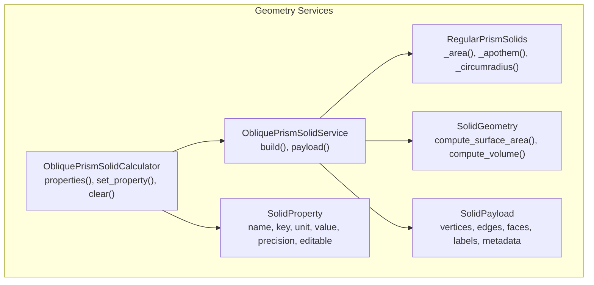
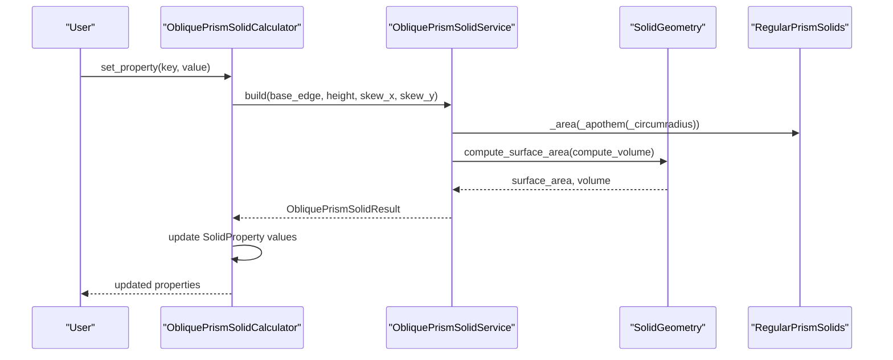
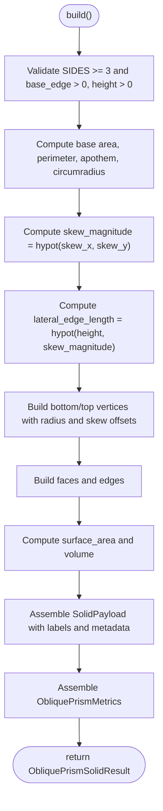
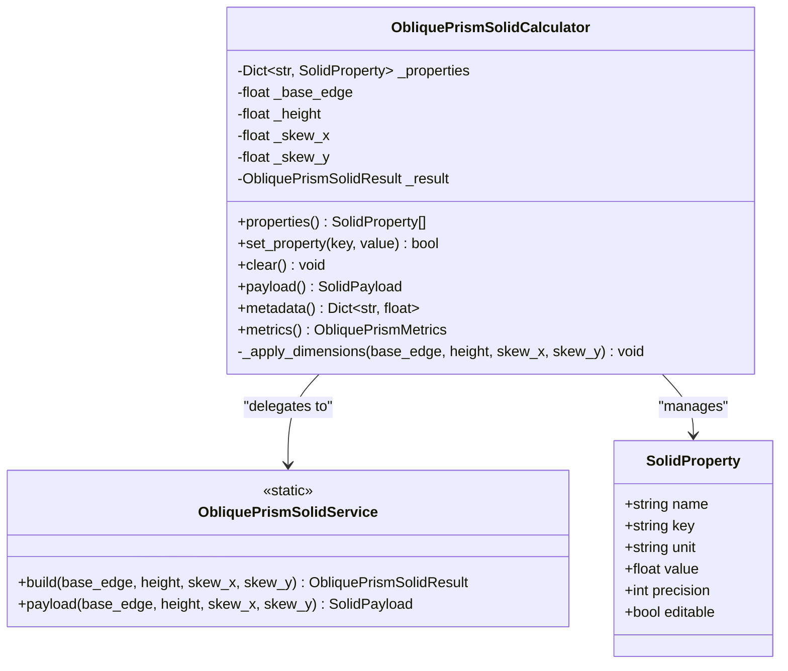
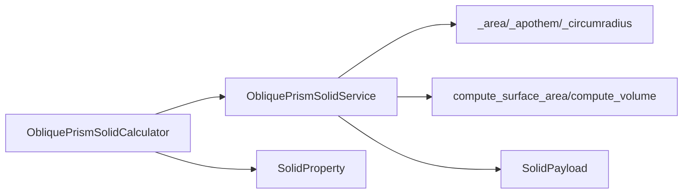

# Oblique Prisms

<cite>
**Referenced Files in This Document**
- [oblique_prism_solid.py](file://src/pillars/geometry/services/oblique_prism_solid.py)
- [solid_geometry.py](file://src/pillars/geometry/services/solid_geometry.py)
- [regular_prism_solids.py](file://src/pillars/geometry/services/regular_prism_solids.py)
- [solid_payload.py](file://src/pillars/geometry/shared/solid_payload.py)
- [solid_property.py](file://src/pillars/geometry/services/solid_property.py)
- [geometry_hub.py](file://src/pillars/geometry/ui/geometry_hub.py)
- [test_prism_variants.py](file://test/test_prism_variants.py)
</cite>

## Table of Contents
1. [Introduction](#introduction)
2. [Project Structure](#project-structure)
3. [Core Components](#core-components)
4. [Architecture Overview](#architecture-overview)
5. [Detailed Component Analysis](#detailed-component-analysis)
6. [Dependency Analysis](#dependency-analysis)
7. [Performance Considerations](#performance-considerations)
8. [Troubleshooting Guide](#troubleshooting-guide)
9. [Conclusion](#conclusion)
10. [Appendices](#appendices)

## Introduction
This document provides API documentation for ObliquePrismSolidService and ObliquePrismSolidCalculator. It explains the build method parameters, how skew parameters create lateral displacement in the top base, and how this affects lateral_edge_length and volume calculations. It also documents the ObliquePrismMetrics output fields and describes how ObliquePrismSolidService (computation) relates to ObliquePrismSolidCalculator (interactive property management). Practical examples show constructing a skewed hexagonal prism and modifying skew values interactively. Edge cases such as zero or negative dimensions and degenerate skews are addressed.

## Project Structure
The oblique prism functionality resides in the geometry pillar under services and shared modules. The primary implementation is in the oblique prism service module, with supporting geometry utilities and shared payload structures.

**Diagram sources**
- [oblique_prism_solid.py](file://src/pillars/geometry/services/oblique_prism_solid.py#L40-L121)
- [oblique_prism_solid.py](file://src/pillars/geometry/services/oblique_prism_solid.py#L160-L259)
- [regular_prism_solids.py](file://src/pillars/geometry/services/regular_prism_solids.py#L36-L46)
- [solid_geometry.py](file://src/pillars/geometry/services/solid_geometry.py#L77-L91)
- [solid_payload.py](file://src/pillars/geometry/shared/solid_payload.py#L12-L27)
- [solid_property.py](file://src/pillars/geometry/services/solid_property.py#L8-L18)

**Section sources**
- [oblique_prism_solid.py](file://src/pillars/geometry/services/oblique_prism_solid.py#L1-L121)
- [oblique_prism_solid.py](file://src/pillars/geometry/services/oblique_prism_solid.py#L160-L259)

## Core Components
- ObliquePrismSolidService: Computes geometry and metrics for a right regular prism skewed by lateral offsets. Provides build() and payload() methods.
- ObliquePrismSolidCalculator: Interactive calculator that exposes SolidProperty entries for bidirectional updates and maintains ObliquePrismSolidResult internally.

Key responsibilities:
- ObliquePrismSolidService.build(): Validates inputs, computes base metrics, constructs vertices/edges/faces, computes surface area and volume, and returns SolidPayload and ObliquePrismMetrics.
- ObliquePrismSolidCalculator: Exposes editable properties (base_edge, height, skew_x, skew_y) and a read-only volume property. On change, recomputes metrics and updates property values.

**Section sources**
- [oblique_prism_solid.py](file://src/pillars/geometry/services/oblique_prism_solid.py#L40-L121)
- [oblique_prism_solid.py](file://src/pillars/geometry/services/oblique_prism_solid.py#L160-L259)

## Architecture Overview
The system separates computation (service) from interactive editing (calculator). The calculator delegates to the service for geometry and metrics, then propagates computed values back into its property model.

**Diagram sources**
- [oblique_prism_solid.py](file://src/pillars/geometry/services/oblique_prism_solid.py#L40-L121)
- [oblique_prism_solid.py](file://src/pillars/geometry/services/oblique_prism_solid.py#L160-L259)
- [solid_geometry.py](file://src/pillars/geometry/services/solid_geometry.py#L77-L91)
- [regular_prism_solids.py](file://src/pillars/geometry/services/regular_prism_solids.py#L36-L46)

## Detailed Component Analysis

### ObliquePrismSolidService
- Purpose: Generate a skewed hexagonal prism geometry and compute metrics.
- Build method parameters:
  - base_edge: positive float, default 2.0
  - height: positive float, default 4.0
  - skew_x: lateral offset in X, default 0.75
  - skew_y: lateral offset in Y, default 0.35
- Validation:
  - SIDES must be at least 3.
  - base_edge and height must be positive.
- Computed metrics:
  - Base area/perimeter/apothem/circumradius from regular polygon formulas.
  - skew_magnitude = hypot(skew_x, skew_y).
  - lateral_edge_length = hypot(height, skew_magnitude).
  - Surface area and volume via geometry helpers.
- Output:
  - SolidPayload with vertices, edges, faces, labels, and metadata.
  - ObliquePrismMetrics with sides, base_edge, height, skew_x, skew_y, skew_magnitude, base_area, base_perimeter, base_apothem, base_circumradius, lateral_edge_length, lateral_area, surface_area, volume.

**Diagram sources**
- [oblique_prism_solid.py](file://src/pillars/geometry/services/oblique_prism_solid.py#L40-L121)
- [solid_geometry.py](file://src/pillars/geometry/services/solid_geometry.py#L77-L91)
- [regular_prism_solids.py](file://src/pillars/geometry/services/regular_prism_solids.py#L36-L46)

**Section sources**
- [oblique_prism_solid.py](file://src/pillars/geometry/services/oblique_prism_solid.py#L40-L121)

### ObliquePrismSolidCalculator
- Purpose: Interactive property management for oblique prisms.
- Properties:
  - base_edge, height, skew_x, skew_y (editable)
  - skew_magnitude (computed, read-only)
  - lateral_edge_length, base_area, base_perimeter, lateral_area, surface_area, volume (computed, read-only)
- Behavior:
  - set_property(key, value): Updates internal dimensions or volume, triggers recompute.
  - clear(): Resets defaults and clears properties.
  - properties(): Returns SolidProperty instances with current values.
  - payload()/metadata()/metrics(): Accessor to last computed result.

**Diagram sources**
- [oblique_prism_solid.py](file://src/pillars/geometry/services/oblique_prism_solid.py#L160-L259)
- [solid_property.py](file://src/pillars/geometry/services/solid_property.py#L8-L18)

**Section sources**
- [oblique_prism_solid.py](file://src/pillars/geometry/services/oblique_prism_solid.py#L160-L259)

### ObliquePrismMetrics
Fields:
- sides: number of sides (constant for this service)
- base_edge, height
- skew_x, skew_y, skew_magnitude
- base_area, base_perimeter, base_apothem, base_circumradius
- lateral_edge_length
- lateral_area, surface_area, volume

These fields are populated by the service and exposed to the calculator for display and interaction.

**Section sources**
- [oblique_prism_solid.py](file://src/pillars/geometry/services/oblique_prism_solid.py#L16-L32)

### Relationship Between Service and Calculator
- The calculator holds a reference to the service’s build method and invokes it whenever dimensions or volume change.
- The calculator updates its SolidProperty values from the resulting metrics.
- The UI binds to the calculator’s properties to enable interactive editing.

**Section sources**
- [geometry_hub.py](file://src/pillars/geometry/ui/geometry_hub.py#L980-L987)
- [oblique_prism_solid.py](file://src/pillars/geometry/services/oblique_prism_solid.py#L160-L259)

## Dependency Analysis
- ObliquePrismSolidService depends on:
  - RegularPrismSolids for base polygon metrics (_area, _apothem, _circumradius)
  - SolidGeometry for surface area and volume
  - SolidPayload for structured geometry output
- ObliquePrismSolidCalculator depends on:
  - ObliquePrismSolidService for recomputation
  - SolidProperty for property descriptors

**Diagram sources**
- [oblique_prism_solid.py](file://src/pillars/geometry/services/oblique_prism_solid.py#L40-L121)
- [oblique_prism_solid.py](file://src/pillars/geometry/services/oblique_prism_solid.py#L160-L259)
- [regular_prism_solids.py](file://src/pillars/geometry/services/regular_prism_solids.py#L36-L46)
- [solid_geometry.py](file://src/pillars/geometry/services/solid_geometry.py#L77-L91)
- [solid_payload.py](file://src/pillars/geometry/shared/solid_payload.py#L12-L27)
- [solid_property.py](file://src/pillars/geometry/services/solid_property.py#L8-L18)

**Section sources**
- [oblique_prism_solid.py](file://src/pillars/geometry/services/oblique_prism_solid.py#L40-L121)
- [oblique_prism_solid.py](file://src/pillars/geometry/services/oblique_prism_solid.py#L160-L259)

## Performance Considerations
- Vertex count scales with sides: 2 × sides for bottom and top rings.
- Face and edge counts are O(sides).
- Surface area and volume computations iterate over faces; complexity is O(faces × face_vertices).
- Repeated recomputation occurs on property changes; caching results minimizes redundant work.

[No sources needed since this section provides general guidance]

## Troubleshooting Guide
Common issues and resolutions:
- Zero or negative base_edge or height:
  - The service raises an error for invalid dimensions.
  - The calculator ignores non-positive values for base_edge and height.
- Negative or zero volume:
  - The calculator validates base_area before updating height from volume.
- Degenerate skews:
  - skew_magnitude is computed as hypot(skew_x, skew_y); extreme values increase lateral_edge_length and alter lateral_area proportionally.
- Unexpected geometry:
  - Verify sides constant and base_edge is positive; confirm skew offsets are within expected ranges.

**Section sources**
- [oblique_prism_solid.py](file://src/pillars/geometry/services/oblique_prism_solid.py#L52-L63)
- [oblique_prism_solid.py](file://src/pillars/geometry/services/oblique_prism_solid.py#L195-L214)

## Conclusion
ObliquePrismSolidService and ObliquePrismSolidCalculator provide a robust foundation for computing and interacting with skewed hexagonal prisms. The service encapsulates geometry and metrics computation, while the calculator offers a user-friendly interface for adjusting dimensions and observing derived properties. Proper validation and clear separation of concerns ensure predictable behavior across edge cases.

[No sources needed since this section summarizes without analyzing specific files]

## Appendices

### API Reference: ObliquePrismSolidService
- build(base_edge=2.0, height=4.0, skew_x=0.75, skew_y=0.35) -> ObliquePrismSolidResult
  - Validates SIDES ≥ 3 and base_edge > 0, height > 0.
  - Computes base metrics, skew magnitude, lateral edge length, surface area, and volume.
  - Returns SolidPayload and ObliquePrismMetrics.
- payload(base_edge=2.0, height=4.0, skew_x=0.75, skew_y=0.35) -> SolidPayload
  - Convenience wrapper around build().

**Section sources**
- [oblique_prism_solid.py](file://src/pillars/geometry/services/oblique_prism_solid.py#L40-L121)

### API Reference: ObliquePrismSolidCalculator
- __init__(base_edge=2.0, height=4.0, skew_x=0.75, skew_y=0.35)
- properties() -> List[SolidProperty]
- set_property(key: str, value: Optional[float]) -> bool
  - Accepts edits for base_edge, height, skew_x, skew_y.
  - Accepts volume updates; recalculates height accordingly.
- clear() -> None
- payload() -> Optional[SolidPayload]
- metadata() -> Dict[str, float]
- metrics() -> Optional[ObliquePrismMetrics]

**Section sources**
- [oblique_prism_solid.py](file://src/pillars/geometry/services/oblique_prism_solid.py#L160-L259)

### Example: Constructing a Skewed Hexagonal Prism
- Use the service’s build() method with desired base_edge, height, skew_x, skew_y.
- Retrieve SolidPayload and ObliquePrismMetrics from the result.
- The service computes skew_magnitude, lateral_edge_length, lateral_area, surface_area, and volume.

**Section sources**
- [oblique_prism_solid.py](file://src/pillars/geometry/services/oblique_prism_solid.py#L40-L121)
- [test_prism_variants.py](file://test/test_prism_variants.py#L14-L33)

### Example: Interactively Modifying Skew Values
- Instantiate ObliquePrismSolidCalculator with defaults.
- Call set_property('skew_x', new_value) and/or set_property('skew_y', new_value).
- Observe skew_magnitude update automatically.
- Optionally set property 'volume' to adjust height while preserving base area.

**Section sources**
- [oblique_prism_solid.py](file://src/pillars/geometry/services/oblique_prism_solid.py#L160-L259)
- [test_prism_variants.py](file://test/test_prism_variants.py#L35-L51)

### Relationship to UI
- The geometry hub registers the oblique prism builder and calculator for interactive use.

**Section sources**
- [geometry_hub.py](file://src/pillars/geometry/ui/geometry_hub.py#L980-L987)