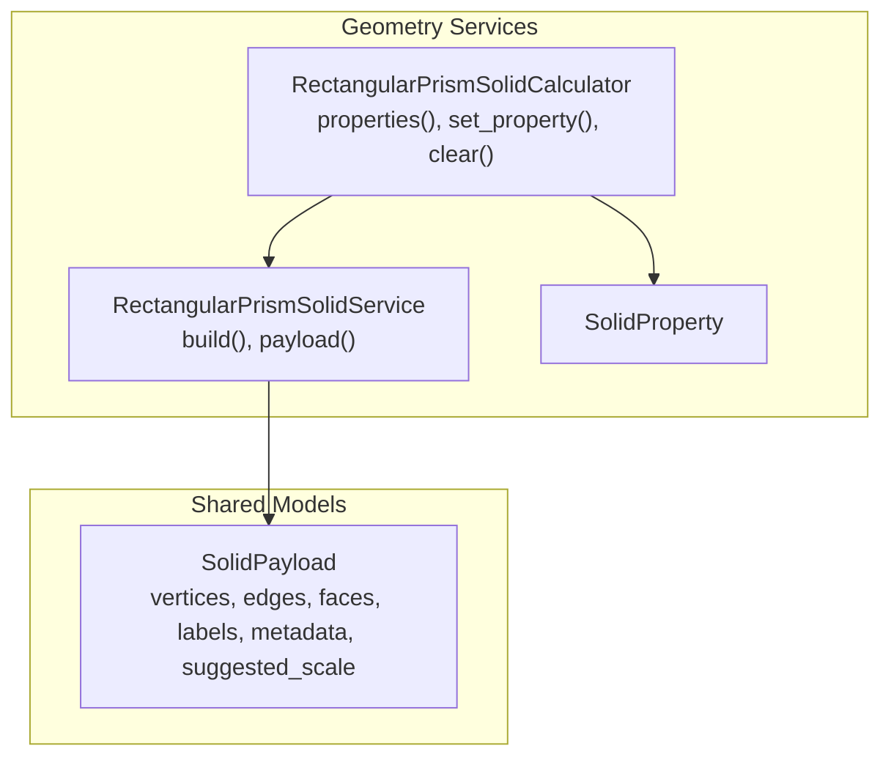
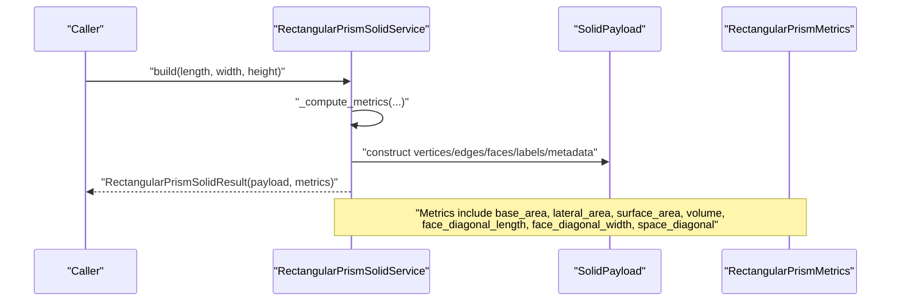
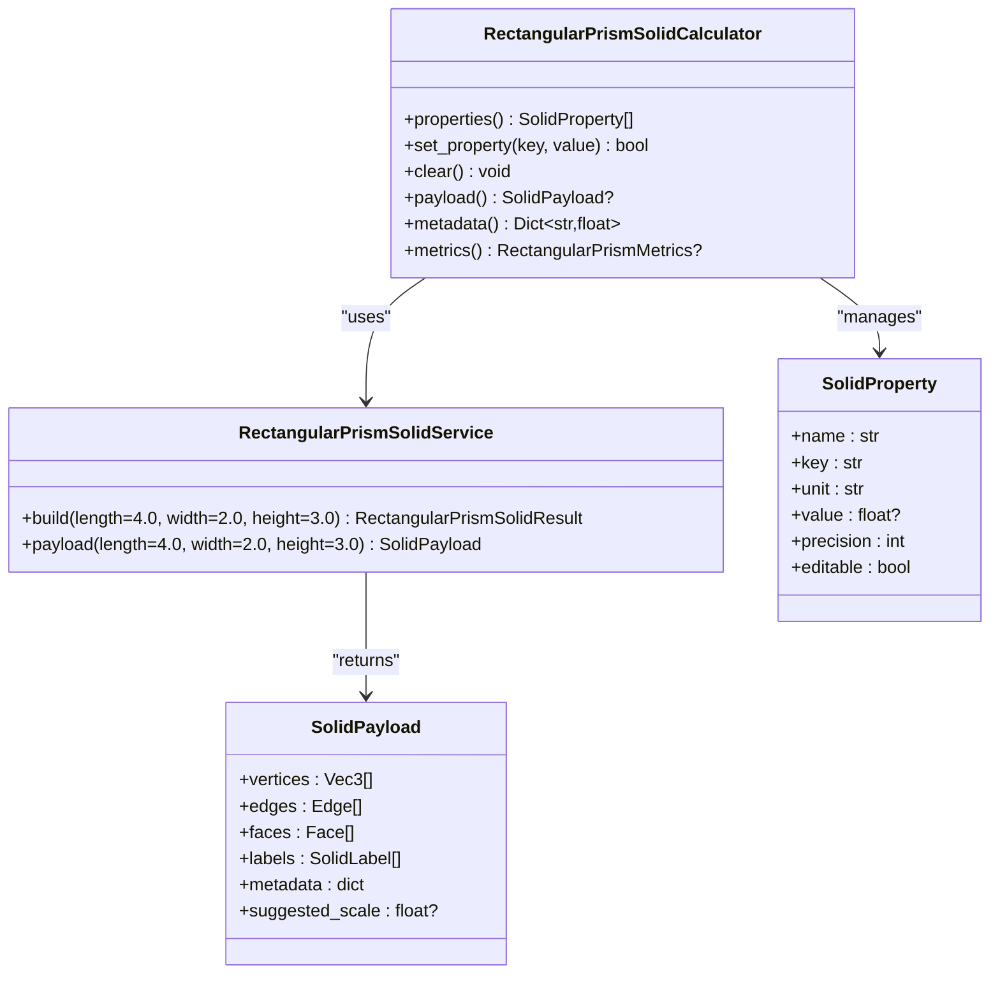

# Rectangular Prisms

<cite>
**Referenced Files in This Document**
- [rectangular_prism_solid.py](file://src/pillars/geometry/services/rectangular_prism_solid.py)
- [solid_property.py](file://src/pillars/geometry/services/solid_property.py)
- [solid_payload.py](file://src/pillars/geometry/shared/solid_payload.py)
- [test_rectangular_prism.py](file://test/test_rectangular_prism.py)
- [geometry_hub.py](file://src/pillars/geometry/ui/geometry_hub.py)
</cite>

## Table of Contents
1. [Introduction](#introduction)
2. [Project Structure](#project-structure)
3. [Core Components](#core-components)
4. [Architecture Overview](#architecture-overview)
5. [Detailed Component Analysis](#detailed-component-analysis)
6. [Dependency Analysis](#dependency-analysis)
7. [Performance Considerations](#performance-considerations)
8. [Troubleshooting Guide](#troubleshooting-guide)
9. [Conclusion](#conclusion)

## Introduction
This document provides API documentation for the rectangular prism solid computation and interactive calculator components. It focuses on:
- Construction of an axis-aligned right rectangular prism with orthogonal faces
- The build method parameters and defaults
- The RectangularPrismMetrics output fields
- How the interactive calculator manages properties and recalculates volume-driven height
- Examples for building a standard rectangular prism and computing spatial diagonals
- Edge cases such as zero or negative dimensions and degenerate boxes

## Project Structure
The rectangular prism functionality lives under the geometry pillar’s services and shared modules:
- Computation and payload generation: src/pillars/geometry/services/rectangular_prism_solid.py
- Shared property model: src/pillars/geometry/services/solid_property.py
- Shared payload model: src/pillars/geometry/shared/solid_payload.py
- Tests validating metrics and calculator behavior: test/test_rectangular_prism.py
- UI integration entry in the geometry hub: src/pillars/geometry/ui/geometry_hub.py

**Diagram sources**
- [rectangular_prism_solid.py](file://src/pillars/geometry/services/rectangular_prism_solid.py#L92-L126)
- [rectangular_prism_solid.py](file://src/pillars/geometry/services/rectangular_prism_solid.py#L128-L223)
- [solid_property.py](file://src/pillars/geometry/services/solid_property.py#L8-L21)
- [solid_payload.py](file://src/pillars/geometry/shared/solid_payload.py#L12-L52)

**Section sources**
- [rectangular_prism_solid.py](file://src/pillars/geometry/services/rectangular_prism_solid.py#L1-L230)
- [solid_property.py](file://src/pillars/geometry/services/solid_property.py#L1-L21)
- [solid_payload.py](file://src/pillars/geometry/shared/solid_payload.py#L1-L52)

## Core Components
- RectangularPrismSolidService: Stateless builder that computes metrics and constructs a SolidPayload for an axis-aligned right rectangular prism.
- RectangularPrismSolidCalculator: Interactive calculator that exposes properties and allows bidirectional updates, including volume-driven height recalculation.

Key responsibilities:
- Service: Validates dimensions, computes closed-form metrics, builds vertex/edge/face topology, and attaches labels/metadata.
- Calculator: Manages SolidProperty entries, applies dimension changes, and updates derived metrics accordingly.

**Section sources**
- [rectangular_prism_solid.py](file://src/pillars/geometry/services/rectangular_prism_solid.py#L92-L126)
- [rectangular_prism_solid.py](file://src/pillars/geometry/services/rectangular_prism_solid.py#L128-L223)

## Architecture Overview
The system separates computation from presentation/UI:
- RectangularPrismSolidService performs all geometry and metric computations and returns a RectangularPrismSolidResult containing SolidPayload and RectangularPrismMetrics.
- RectangularPrismSolidCalculator holds and updates SolidProperty instances, triggers recomputation via the service, and surfaces derived metrics.

**Diagram sources**
- [rectangular_prism_solid.py](file://src/pillars/geometry/services/rectangular_prism_solid.py#L33-L54)
- [rectangular_prism_solid.py](file://src/pillars/geometry/services/rectangular_prism_solid.py#L92-L126)

## Detailed Component Analysis

### RectangularPrismSolidService
- Purpose: Build axis-aligned right rectangular prisms centered at origin with orthogonal faces.
- Method: build(length=4.0, width=2.0, height=3.0) -> RectangularPrismSolidResult
  - Validation: raises an error if any dimension is non-positive.
  - Metrics computation: closed-form formulas for base_area, base_perimeter, lateral_area, surface_area, volume, face_diagonal_length, face_diagonal_width, space_diagonal.
  - Geometry: vertices represent the eight corners of the box centered at origin; edges and faces define the six orthogonal faces.
  - Labels: L, W, H labels placed near the appropriate edges.
  - Metadata: includes all computed metrics for downstream consumption.
  - Suggested scale: set to max(length, width, height) to aid visualization scaling.

- Method: payload(length=4.0, width=2.0, height=3.0) -> SolidPayload
  - Convenience wrapper around build() returning only the payload.

- Output: RectangularPrismSolidResult(payload, metrics)

**Section sources**
- [rectangular_prism_solid.py](file://src/pillars/geometry/services/rectangular_prism_solid.py#L33-L54)
- [rectangular_prism_solid.py](file://src/pillars/geometry/services/rectangular_prism_solid.py#L92-L126)

### RectangularPrismSolidCalculator
- Purpose: Interactive property manager for a rectangular prism. Exposes editable length, width, height and derived metrics such as volume, surface area, lateral area, base area/perimeter, face diagonals, and space diagonal.
- Constructor: __init__(length=4.0, width=2.0, height=3.0)
  - Initializes SolidProperty entries with keys and labels.
  - Applies initial dimensions and computes metrics.
- Methods:
  - properties() -> List[SolidProperty]: returns ordered properties.
  - set_property(key, value) -> bool: updates a property; supports length, width, height, and volume. Volume updates compute new height as height = value / (length × width).
  - clear(): resets to defaults and clears property values.
  - payload() -> Optional[SolidPayload]: returns the latest payload.
  - metadata() -> Dict[str, float]: returns the latest payload metadata.
  - metrics() -> Optional[RectangularPrismMetrics]: returns the latest metrics.

- Property definitions include:
  - length, width, height (editable)
  - base_area, base_perimeter, lateral_area, surface_area (derived)
  - volume (editable; drives height recalculation)
  - face_diagonal_length, face_diagonal_width, space_diagonal (derived)

**Section sources**
- [rectangular_prism_solid.py](file://src/pillars/geometry/services/rectangular_prism_solid.py#L128-L223)
- [solid_property.py](file://src/pillars/geometry/services/solid_property.py#L8-L21)

### Data Models and Payload
- RectangularPrismMetrics: frozen dataclass containing:
  - length, width, height
  - base_area, base_perimeter
  - lateral_area, surface_area
  - volume
  - face_diagonal_length, face_diagonal_width
  - space_diagonal

- RectangularPrismSolidResult: container holding payload and metrics.

- SolidPayload: shared model with:
  - vertices, edges, faces
  - labels (text, position)
  - metadata (dict)
  - suggested_scale (float?)

- SolidProperty: shared model with:
  - name, key, unit, value, precision, editable

**Section sources**
- [rectangular_prism_solid.py](file://src/pillars/geometry/services/rectangular_prism_solid.py#L12-L54)
- [rectangular_prism_solid.py](file://src/pillars/geometry/services/rectangular_prism_solid.py#L27-L31)
- [solid_payload.py](file://src/pillars/geometry/shared/solid_payload.py#L12-L52)
- [solid_property.py](file://src/pillars/geometry/services/solid_property.py#L8-L21)

### API Reference

#### RectangularPrismSolidService.build
- Parameters
  - length: positive float; default 4.0
  - width: positive float; default 2.0
  - height: positive float; default 3.0
- Behavior
  - Validates that all dimensions are strictly greater than zero; otherwise raises an error.
  - Computes metrics using closed-form formulas.
  - Builds SolidPayload with:
    - vertices: eight corners centered at origin
    - edges: twelve edges connecting vertices
    - faces: six orthogonal faces
    - labels: L, W, H near edges
    - metadata: all metrics
    - suggested_scale: max(length, width, height)
- Returns
  - RectangularPrismSolidResult(payload, metrics)

- Example usage
  - Construct a standard rectangular prism with default dimensions and retrieve the payload and metrics.

**Section sources**
- [rectangular_prism_solid.py](file://src/pillars/geometry/services/rectangular_prism_solid.py#L92-L126)

#### RectangularPrismSolidService.payload
- Parameters
  - length: positive float; default 4.0
  - width: positive float; default 2.0
  - height: positive float; default 3.0
- Returns
  - SolidPayload for the given dimensions.

**Section sources**
- [rectangular_prism_solid.py](file://src/pillars/geometry/services/rectangular_prism_solid.py#L124-L126)

#### RectangularPrismSolidCalculator
- Constructor
  - __init__(length=4.0, width=2.0, height=3.0)
  - Initializes properties and applies dimensions.
- Methods
  - properties() -> List[SolidProperty]
  - set_property(key: str, value: Optional[float]) -> bool
    - Supports editing length, width, height, and volume.
    - Editing volume recalculates height as height = value / (length × width).
  - clear() -> None
  - payload() -> Optional[SolidPayload]
  - metadata() -> Dict[str, float]
  - metrics() -> Optional[RectangularPrismMetrics]

- Property definitions
  - Editable: length, width, height, volume
  - Derived: base_area, base_perimeter, lateral_area, surface_area, face_diagonal_length, face_diagonal_width, space_diagonal

**Section sources**
- [rectangular_prism_solid.py](file://src/pillars/geometry/services/rectangular_prism_solid.py#L128-L223)
- [solid_property.py](file://src/pillars/geometry/services/solid_property.py#L8-L21)

### Metrics and Outputs
RectangularPrismMetrics includes:
- Dimensions: length, width, height
- Base: base_area, base_perimeter
- Lateral/Surface: lateral_area, surface_area
- Volume: volume
- Face diagonals:
  - face_diagonal_length: diagonal across length-face (length, height)
  - face_diagonal_width: diagonal across width-face (width, height)
- Space diagonal: diagonal through the interior of the box

These are computed using closed-form formulas and mirrored in SolidPayload.metadata and SolidProperty values.

**Section sources**
- [rectangular_prism_solid.py](file://src/pillars/geometry/services/rectangular_prism_solid.py#L33-L54)
- [rectangular_prism_solid.py](file://src/pillars/geometry/services/rectangular_prism_solid.py#L106-L118)

### Examples

#### Constructing a Standard Rectangular Prism
- Use the service to build with defaults or custom dimensions.
- Retrieve the payload and metrics for visualization and inspection.

References:
- [rectangular_prism_solid.py](file://src/pillars/geometry/services/rectangular_prism_solid.py#L92-L126)

#### Computing Spatial Diagonals
- The space diagonal is computed as sqrt(length^2 + width^2 + height^2).
- Tests confirm correctness against math.sqrt and math.hypot.

References:
- [rectangular_prism_solid.py](file://src/pillars/geometry/services/rectangular_prism_solid.py#L33-L54)
- [test_rectangular_prism.py](file://test/test_rectangular_prism.py#L12-L32)

#### Volume-Driven Height Recalculation
- Editing the volume property recalculates height as height = value / (length × width).
- Tests demonstrate updating volume and verifying derived height and volume.

References:
- [rectangular_prism_solid.py](file://src/pillars/geometry/services/rectangular_prism_solid.py#L169-L177)
- [test_rectangular_prism.py](file://test/test_rectangular_prism.py#L34-L49)

### Edge Cases and Degeneracies
- Zero or negative dimensions:
  - The service validates that length, width, and height are strictly positive and raises an error if violated.
  - The calculator rejects None or non-positive values for edits.
- Degenerate boxes:
  - If any dimension becomes zero or negative during updates, the calculator ignores the change and does not apply invalid dimensions.
  - The service will reject invalid inputs early.

References:
- [rectangular_prism_solid.py](file://src/pillars/geometry/services/rectangular_prism_solid.py#L94-L95)
- [rectangular_prism_solid.py](file://src/pillars/geometry/services/rectangular_prism_solid.py#L160-L161)
- [rectangular_prism_solid.py](file://src/pillars/geometry/services/rectangular_prism_solid.py#L200-L201)

## Dependency Analysis
- RectangularPrismSolidService depends on:
  - Internal helpers for metrics and geometry
  - SolidPayload and SolidLabel for output structure
- RectangularPrismSolidCalculator depends on:
  - SolidProperty for property modeling
  - RectangularPrismSolidService for recomputation
- Tests validate:
  - Metric correctness
  - Volume-driven height recalculation

**Diagram sources**
- [rectangular_prism_solid.py](file://src/pillars/geometry/services/rectangular_prism_solid.py#L92-L126)
- [rectangular_prism_solid.py](file://src/pillars/geometry/services/rectangular_prism_solid.py#L128-L223)
- [solid_property.py](file://src/pillars/geometry/services/solid_property.py#L8-L21)
- [solid_payload.py](file://src/pillars/geometry/shared/solid_payload.py#L12-L52)

**Section sources**
- [rectangular_prism_solid.py](file://src/pillars/geometry/services/rectangular_prism_solid.py#L92-L223)
- [solid_property.py](file://src/pillars/geometry/services/solid_property.py#L8-L21)
- [solid_payload.py](file://src/pillars/geometry/shared/solid_payload.py#L12-L52)

## Performance Considerations
- The service performs constant-time computations for metrics and geometry construction.
- The calculator maintains in-memory property values and recomputes upon dimension changes.
- No heavy loops or recursion are present; performance is dominated by floating-point arithmetic.

[No sources needed since this section provides general guidance]

## Troubleshooting Guide
- Non-positive dimensions cause an error in the service build method.
- Editing a property with None or non-positive values is ignored by the calculator.
- If volume editing fails, ensure length and width are both positive so base_area > 0; otherwise, height cannot be derived from volume.

**Section sources**
- [rectangular_prism_solid.py](file://src/pillars/geometry/services/rectangular_prism_solid.py#L94-L95)
- [rectangular_prism_solid.py](file://src/pillars/geometry/services/rectangular_prism_solid.py#L160-L161)
- [rectangular_prism_solid.py](file://src/pillars/geometry/services/rectangular_prism_solid.py#L171-L177)

## Conclusion
The rectangular prism module provides a clean separation between computation and interactive property management:
- RectangularPrismSolidService offers deterministic, validated geometry and metrics.
- RectangularPrismSolidCalculator enables intuitive editing with volume-driven recalculation.
- The design ensures robustness against invalid inputs and provides clear outputs for visualization and analysis.

[No sources needed since this section summarizes without analyzing specific files]