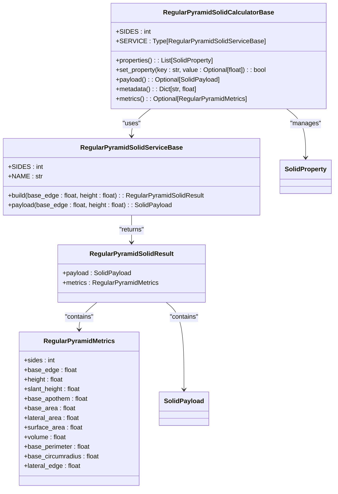
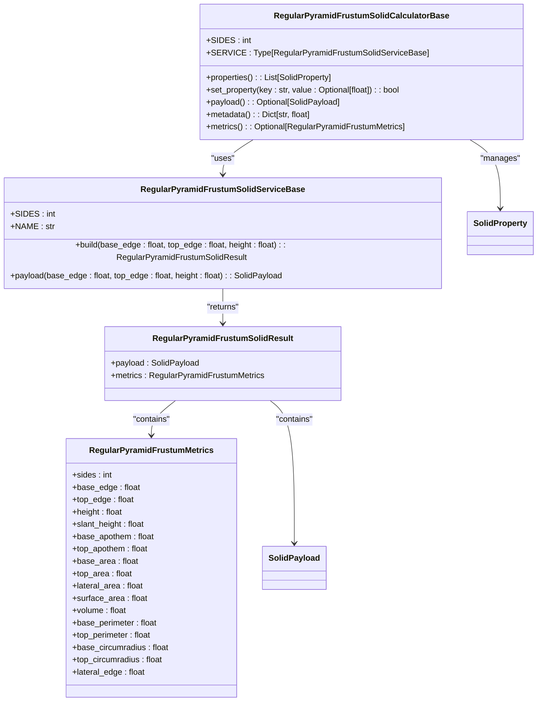
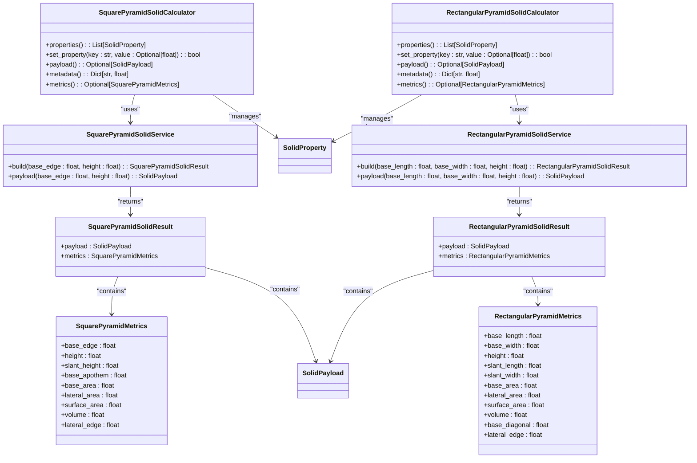
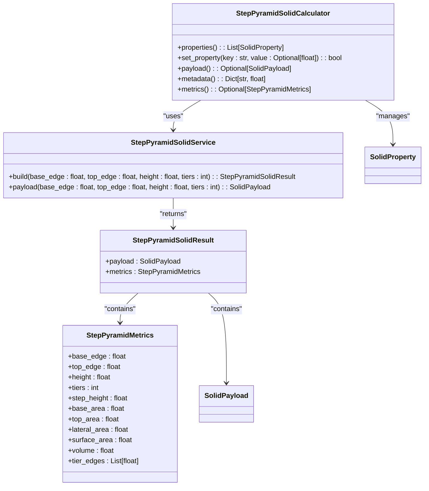
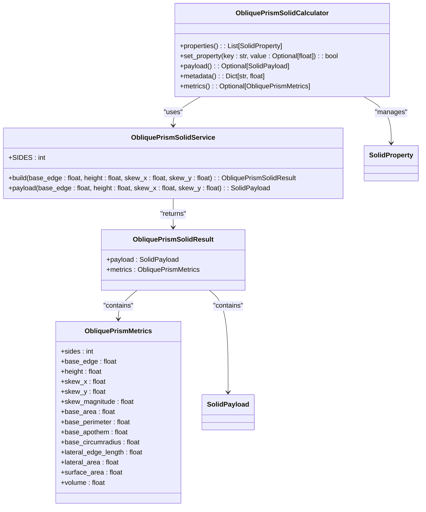
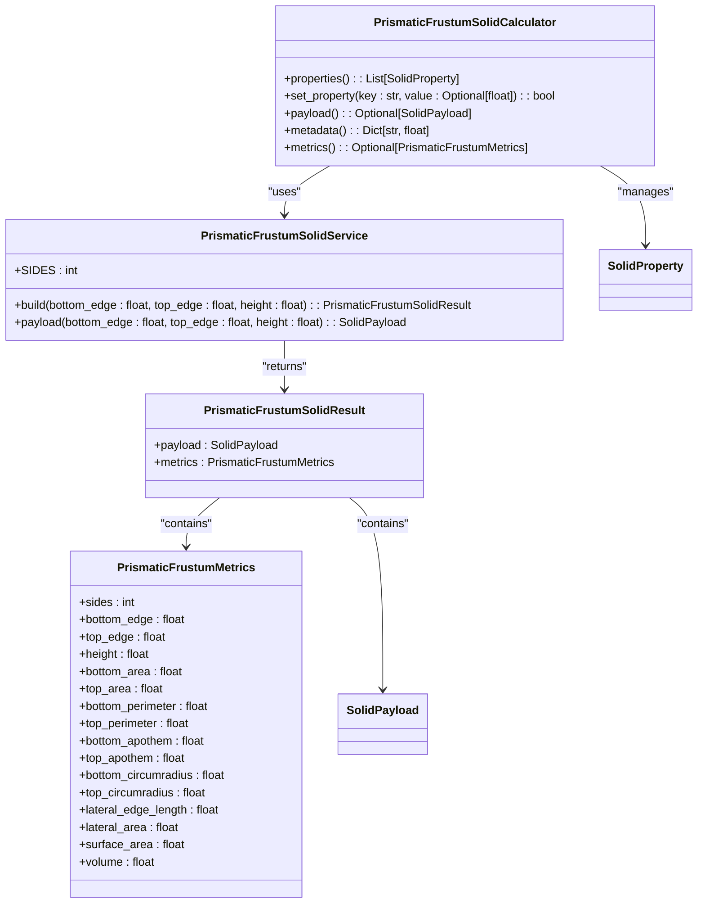
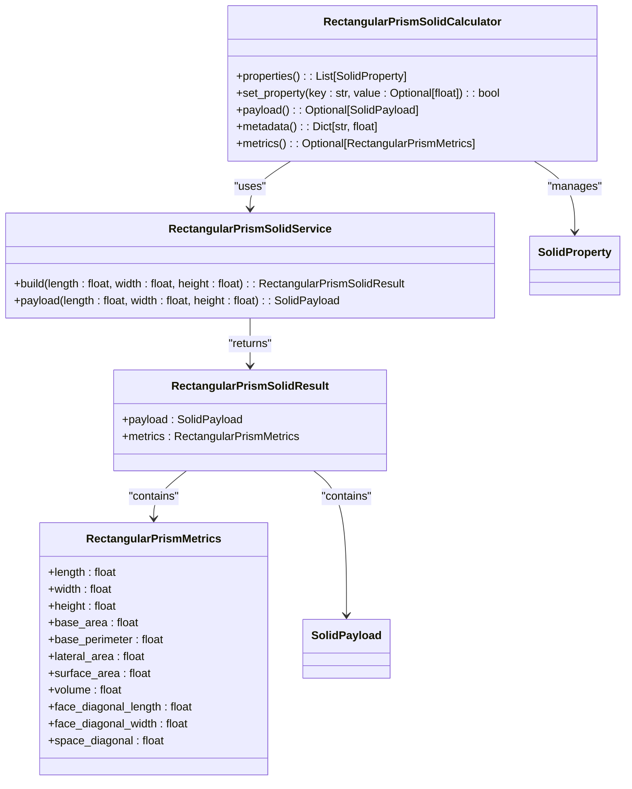
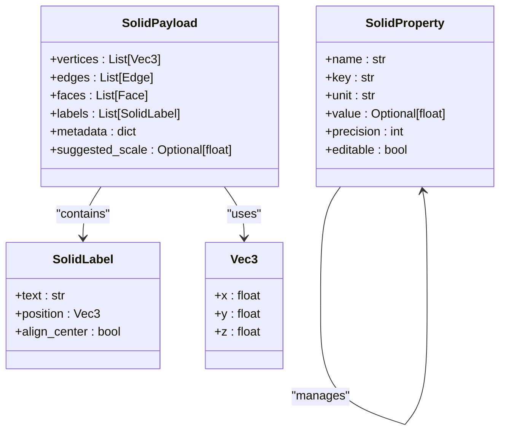
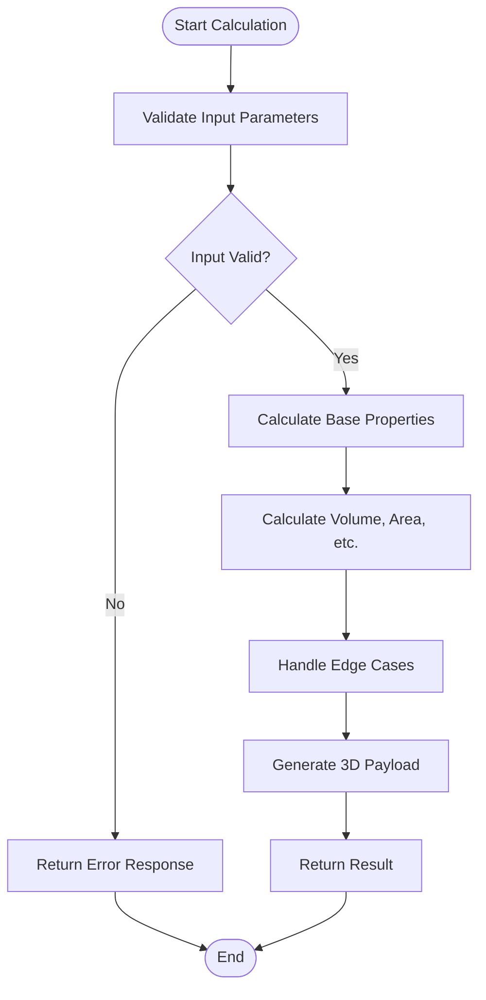

# Pyramids and Prisms API

<cite>
**Referenced Files in This Document**   
- [regular_pyramid_solids.py](file://src/pillars/geometry/services/regular_pyramid_solids.py)
- [regular_pyramid_frustum_solids.py](file://src/pillars/geometry/services/regular_pyramid_frustum_solids.py)
- [square_pyramid_solid.py](file://src/pillars/geometry/services/square_pyramid_solid.py)
- [square_pyramid_frustum_solid.py](file://src/pillars/geometry/services/square_pyramid_frustum_solid.py)
- [rectangular_pyramid_solid.py](file://src/pillars/geometry/services/rectangular_pyramid_solid.py)
- [oblique_prism_solid.py](file://src/pillars/geometry/services/oblique_prism_solid.py)
- [prismatic_frustum_solid.py](file://src/pillars/geometry/services/prismatic_frustum_solid.py)
- [rectangular_prism_solid.py](file://src/pillars/geometry/services/rectangular_prism_solid.py)
- [step_pyramid_solid.py](file://src/pillars/geometry/services/step_pyramid_solid.py)
- [regular_prism_solids.py](file://src/pillars/geometry/services/regular_prism_solids.py)
- [solid_geometry.py](file://src/pillars/geometry/services/solid_geometry.py)
- [solid_payload.py](file://src/pillars/geometry/shared/solid_payload.py)
- [solid_property.py](file://src/pillars/geometry/services/solid_property.py)
</cite>

## Table of Contents
1. [Introduction](#introduction)
2. [Pyramid Geometry Services](#pyramid-geometry-services)
   1. [RegularPyramidSolids](#regularpyramidsolids)
   2. [RegularPyramidFrustumSolids](#regularpyramidfrustumsolids)
   3. [Specialized Pyramid Implementations](#specialized-pyramid-implementations)
   4. [Step Pyramids](#step-pyramids)
3. [Prism Geometry Services](#prism-geometry-services)
   1. [ObliquePrismSolid](#obliqueprismsolid)
   2. [PrismaticFrustumSolid](#prismaticfrustumsolid)
   3. [RectangularPrismSolid](#rectangularprismsolid)
4. [Core Data Structures](#core-data-structures)
5. [Mathematical Calculations](#mathematical-calculations)
6. [Error Handling and Degenerate Cases](#error-handling-and-degenerate-cases)
7. [Examples](#examples)
8. [Conclusion](#conclusion)

## Introduction

The Pyramids and Prisms API provides comprehensive geometric services for creating and analyzing various pyramid and prism solids. The API supports regular n-gonal pyramids and their frustum variants, specialized pyramid types including square and rectangular bases, and prism variants with oblique and truncated forms. Each service provides detailed geometric metrics, 3D payload generation for visualization, and calculator interfaces for interactive dimension manipulation.

The API is designed with a consistent pattern across all geometric types: a service class that generates 3D payloads and computes metrics, and a calculator class that provides a user-friendly interface for bidirectional property updates. All geometric calculations are precise and account for numerical stability, with comprehensive error handling for degenerate cases.

**Section sources**
- [regular_pyramid_solids.py](file://src/pillars/geometry/services/regular_pyramid_solids.py#L1-L314)
- [regular_pyramid_frustum_solids.py](file://src/pillars/geometry/services/regular_pyramid_frustum_solids.py#L1-L332)

## Pyramid Geometry Services

### RegularPyramidSolids

The `RegularPyramidSolids` module provides services for right regular n-gonal pyramids. These pyramids have a regular polygon base with n sides and an apex point directly above the center of the base. The service computes comprehensive geometric metrics including volume, surface area, lateral area, and various dimensional properties.

Key parameters:
- **sides**: Number of sides in the base polygon (minimum 3)
- **base_edge**: Length of each edge in the base polygon
- **height**: Vertical distance from base to apex
- **slant_height**: Distance from base edge midpoint to apex

The implementation uses trigonometric functions to calculate base properties like apothem and circumradius, then derives all other metrics from these fundamental values. The volume is calculated using the standard pyramid formula V = (1/3) × base_area × height.



**Diagram sources **
- [regular_pyramid_solids.py](file://src/pillars/geometry/services/regular_pyramid_solids.py#L17-L81)
- [regular_pyramid_solids.py](file://src/pillars/geometry/services/regular_pyramid_solids.py#L111-L147)

**Section sources**
- [regular_pyramid_solids.py](file://src/pillars/geometry/services/regular_pyramid_solids.py#L1-L314)

### RegularPyramidFrustumSolids

The `RegularPyramidFrustumSolids` module implements services for truncated regular pyramids (frustums). A frustum is created by cutting the top off a pyramid with a plane parallel to the base, resulting in two parallel polygonal faces: a larger base and a smaller top.

Key parameters:
- **sides**: Number of sides in the base and top polygons
- **base_edge**: Length of edges in the bottom base
- **top_edge**: Length of edges in the top base
- **height**: Vertical distance between bases
- **slant_height**: Distance between corresponding base edges

The volume of a pyramid frustum is calculated using the formula V = (h/3) × (A₁ + √(A₁×A₂) + A₂), where A₁ and A₂ are the areas of the bottom and top bases respectively. The lateral surface area is computed as the average of the base perimeters multiplied by the slant height.



**Diagram sources **
- [regular_pyramid_frustum_solids.py](file://src/pillars/geometry/services/regular_pyramid_frustum_solids.py#L17-L92)
- [regular_pyramid_frustum_solids.py](file://src/pillars/geometry/services/regular_pyramid_frustum_solids.py#L135-L175)

**Section sources**
- [regular_pyramid_frustum_solids.py](file://src/pillars/geometry/services/regular_pyramid_frustum_solids.py#L1-L332)

### Specialized Pyramid Implementations

The API includes specialized implementations for common pyramid types with optimized calculations:

#### SquarePyramidSolid
For square-based pyramids, the implementation uses direct geometric relationships rather than trigonometric functions. The slant height is calculated using the Pythagorean theorem: slant_height = √(height² + (base_edge/2)²). The lateral edge (distance from base corner to apex) uses the diagonal: lateral_edge = √(height² + (base_edge×√2/2)²).

#### SquarePyramidFrustumSolid
The square frustum implementation follows the same principles as the general frustum but with simplified calculations for the square base. The lateral surface consists of four trapezoids, and the lateral area is calculated as 2 × (base_edge + top_edge) × slant_height.

#### RectangularPyramidSolid
For rectangular pyramids, there are two different slant heights: one for the length faces and one for the width faces. The slant_length = √(height² + (base_width/2)²) and slant_width = √(height² + (base_length/2)²). The lateral area is the sum of the areas of the four triangular faces.



**Diagram sources **
- [square_pyramid_solid.py](file://src/pillars/geometry/services/square_pyramid_solid.py#L13-L50)
- [square_pyramid_solid.py](file://src/pillars/geometry/services/square_pyramid_solid.py#L86-L115)
- [rectangular_pyramid_solid.py](file://src/pillars/geometry/services/rectangular_pyramid_solid.py#L13-L56)
- [rectangular_pyramid_solid.py](file://src/pillars/geometry/services/rectangular_pyramid_solid.py#L93-L125)

**Section sources**
- [square_pyramid_solid.py](file://src/pillars/geometry/services/square_pyramid_solid.py#L1-L232)
- [square_pyramid_frustum_solid.py](file://src/pillars/geometry/services/square_pyramid_frustum_solid.py#L1-L254)
- [rectangular_pyramid_solid.py](file://src/pillars/geometry/services/rectangular_pyramid_solid.py#L1-L248)

### Step Pyramids

The `StepPyramidSolid` implementation models terraced or stepped pyramids, such as those found in ancient Mesoamerican architecture. Unlike smooth pyramids, step pyramids consist of multiple rectangular prism tiers that decrease in size from base to top.

Key parameters:
- **base_edge**: Length of the bottom tier's edge
- **top_edge**: Length of the top tier's edge
- **height**: Total height of the pyramid
- **tiers**: Number of distinct levels

The volume is calculated as the sum of the volumes of individual tiers: volume = step_height × Σ(edge_i²), where edge_i is the edge length of tier i. The lateral surface area is 4 × step_height × Σ(edges of all tiers except top).



**Diagram sources **
- [step_pyramid_solid.py](file://src/pillars/geometry/services/step_pyramid_solid.py#L12-L116)
- [step_pyramid_solid.py](file://src/pillars/geometry/services/step_pyramid_solid.py#L152-L159)

**Section sources**
- [step_pyramid_solid.py](file://src/pillars/geometry/services/step_pyramid_solid.py#L1-L268)

## Prism Geometry Services

### ObliquePrismSolid

The `ObliquePrismSolid` service creates prisms where the top base is offset horizontally from the bottom base, creating a skewed or leaning prism. Unlike right prisms where lateral edges are perpendicular to the bases, oblique prisms have lateral edges at an angle.

Key parameters:
- **sides**: Number of sides in the regular polygon base
- **base_edge**: Length of edges in the base polygon
- **height**: Vertical distance between bases
- **skew_x**: Horizontal offset in the x-direction
- **skew_y**: Horizontal offset in the y-direction

The volume of an oblique prism is the same as its right counterpart: V = base_area × height, as the horizontal offset does not affect the volume. However, the lateral surface area increases due to the longer lateral edges.



**Diagram sources **
- [oblique_prism_solid.py](file://src/pillars/geometry/services/oblique_prism_solid.py#L17-L32)
- [oblique_prism_solid.py](file://src/pillars/geometry/services/oblique_prism_solid.py#L40-L118)

**Section sources**
- [oblique_prism_solid.py](file://src/pillars/geometry/services/oblique_prism_solid.py#L1-L269)

### PrismaticFrustumSolid

The `PrismaticFrustumSolid` service creates truncated prisms with similar parallel bases of different sizes. This is analogous to the pyramid frustum but for prisms.

Key parameters:
- **sides**: Number of sides in the base and top polygons
- **bottom_edge**: Length of edges in the bottom base
- **top_edge**: Length of edges in the top base
- **height**: Vertical distance between bases

The volume is calculated using the same formula as the pyramid frustum: V = (h/3) × (A₁ + √(A₁×A₂) + A₂), which works for any conical frustum. The lateral surface consists of trapezoidal faces connecting corresponding edges of the two bases.



**Diagram sources **
- [prismatic_frustum_solid.py](file://src/pillars/geometry/services/prismatic_frustum_solid.py#L17-L34)
- [prismatic_frustum_solid.py](file://src/pillars/geometry/services/prismatic_frustum_solid.py#L42-L125)

**Section sources**
- [prismatic_frustum_solid.py](file://src/pillars/geometry/services/prismatic_frustum_solid.py#L1-L276)

### RectangularPrismSolid

The `RectangularPrismSolid` service creates axis-aligned right rectangular prisms (cuboids). This is the most common prism type with six rectangular faces.

Key parameters:
- **length**: Length of the prism
- **width**: Width of the prism
- **height**: Height of the prism

The implementation calculates various diagonal lengths: face diagonals for each pair of dimensions and the space diagonal that spans from one corner to the opposite corner through the interior of the prism.



**Diagram sources **
- [rectangular_prism_solid.py](file://src/pillars/geometry/services/rectangular_prism_solid.py#L13-L25)
- [rectangular_prism_solid.py](file://src/pillars/geometry/services/rectangular_prism_solid.py#L89-L121)

**Section sources**
- [rectangular_prism_solid.py](file://src/pillars/geometry/services/rectangular_prism_solid.py#L1-L230)

## Core Data Structures

The API uses several core data structures to represent geometric information consistently across all services.

### SolidPayload
The `SolidPayload` class contains all the information needed to render a 3D solid:
- **vertices**: List of 3D coordinates (x, y, z) defining the corners
- **edges**: List of pairs of vertex indices defining the lines
- **faces**: List of vertex index sequences defining the surfaces
- **labels**: Text annotations with 3D positions
- **metadata**: Key-value store of calculated metrics
- **suggested_scale**: Recommended scale for visualization

### SolidProperty
The `SolidProperty` class describes a calculable metric:
- **name**: Display name for the property
- **key**: Internal identifier
- **unit**: Unit of measurement
- **value**: Current calculated value
- **precision**: Decimal places for display
- **editable**: Whether users can modify this property

### Metrics Classes
Each geometric type has a corresponding metrics dataclass that contains all calculated properties. These are frozen (immutable) dataclasses that ensure consistency and prevent accidental modification.



**Diagram sources **
- [solid_payload.py](file://src/pillars/geometry/shared/solid_payload.py#L12-L27)
- [solid_property.py](file://src/pillars/geometry/services/solid_property.py#L8-L18)

**Section sources**
- [solid_payload.py](file://src/pillars/geometry/shared/solid_payload.py#L1-L52)
- [solid_property.py](file://src/pillars/geometry/services/solid_property.py#L1-L21)

## Mathematical Calculations

The API implements precise mathematical calculations for all geometric properties, with attention to numerical stability and edge cases.

### Volume Calculations
- **Pyramids**: V = (1/3) × base_area × height
- **Prisms**: V = base_area × height
- **Pyramid Frustums**: V = (h/3) × (A₁ + √(A₁×A₂) + A₂)
- **Prism Frustums**: Same as pyramid frustums

### Surface Area Calculations
- **Pyramids**: surface_area = base_area + lateral_area
- **Prisms**: surface_area = 2 × base_area + lateral_area
- **Lateral Areas**: Calculated based on the specific geometry

### Base Polygon Properties
For regular n-gonal bases:
- **Apothem**: a = edge / (2 × tan(π/n))
- **Circumradius**: R = edge / (2 × sin(π/n))
- **Area**: A = (n × edge²) / (4 × tan(π/n))

The `solid_geometry.py` module provides vector mathematics utilities for more complex calculations, including cross products, dot products, and polygon area calculations using the shoelace formula.



**Diagram sources **
- [solid_geometry.py](file://src/pillars/geometry/services/solid_geometry.py#L77-L91)
- [regular_pyramid_solids.py](file://src/pillars/geometry/services/regular_pyramid_solids.py#L58-L81)
- [regular_prism_solids.py](file://src/pillars/geometry/services/regular_prism_solids.py#L52-L71)

**Section sources**
- [solid_geometry.py](file://src/pillars/geometry/services/solid_geometry.py#L1-L156)
- [regular_pyramid_solids.py](file://src/pillars/geometry/services/regular_pyramid_solids.py#L38-L81)
- [regular_prism_solids.py](file://src/pillars/geometry/services/regular_prism_solids.py#L36-L71)

## Error Handling and Degenerate Cases

The API includes comprehensive error handling for invalid inputs and degenerate cases:

### Input Validation
All services validate inputs and raise `ValueError` for:
- Non-positive dimensions (edges, height, etc.)
- Invalid polygon sides (less than 3)
- For step pyramids: top edge ≥ base edge
- For frustums: non-positive top or bottom edges

### Degenerate Cases
- **Zero height**: Results in degenerate solids with zero volume
- **Equal top and bottom edges in frustums**: Results in a regular prism
- **Single tier step pyramids**: Results in a regular pyramid
- **Skew offsets of zero in oblique prisms**: Results in a right prism

### Numerical Stability
The implementation includes safeguards for numerical stability:
- Checking for division by zero
- Using appropriate epsilon values for floating-point comparisons
- Handling cases where trigonometric functions might produce unstable results

**Section sources**
- [regular_pyramid_solids.py](file://src/pillars/geometry/services/regular_pyramid_solids.py#L119-L122)
- [regular_pyramid_frustum_solids.py](file://src/pillars/geometry/services/regular_pyramid_frustum_solids.py#L143-L146)
- [step_pyramid_solid.py](file://src/pillars/geometry/services/step_pyramid_solid.py#L90-L95)
- [oblique_prism_solid.py](file://src/pillars/geometry/services/oblique_prism_solid.py#L53-L56)

## Examples

### Constructing a Step Pyramid
```python
from src.pillars.geometry.services.step_pyramid_solid import StepPyramidSolidService

# Create a Mayan-style step pyramid
pyramid = StepPyramidSolidService.build(
    base_edge=200.0,    # meters
    top_edge=60.0,     # meters  
    height=120.0,      # meters
    tiers=5            # levels
)

print(f"Volume: {pyramid.metrics.volume:.2f} cubic meters")
print(f"Surface area: {pyramid.metrics.surface_area:.2f} square meters")
```

### Creating a Tapered Frustum
```python
from src.pillars.geometry.services.prismatic_frustum_solid import PrismaticFrustumSolidService

# Create a hexagonal tower with tapered design
frustum = PrismaticFrustumSolidService.build(
    bottom_edge=3.0,   # meters
    top_edge=1.75,     # meters
    height=4.0         # meters
)

print(f"Lateral edge length: {frustum.metrics.lateral_edge_length:.3f} meters")
print(f"Volume: {frustum.metrics.volume:.3f} cubic meters")
```

### Building a Skewed Prism
```python
from src.pillars.geometry.services.oblique_prism_solid import ObliquePrismSolidService

# Create an oblique hexagonal prism
prism = ObliquePrismSolidService.build(
    base_edge=2.0,     # meters
    height=4.0,        # meters
    skew_x=0.75,       # meters
    skew_y=0.35        # meters
)

print(f"Skew magnitude: {prism.metrics.skew_magnitude:.3f} meters")
print(f"Volume: {prism.metrics.volume:.3f} cubic meters")
```

**Section sources**
- [step_pyramid_solid.py](file://src/pillars/geometry/services/step_pyramid_solid.py#L156-L159)
- [prismatic_frustum_solid.py](file://src/pillars/geometry/services/prismatic_frustum_solid.py#L48-L52)
- [oblique_prism_solid.py](file://src/pillars/geometry/services/oblique_prism_solid.py#L48-L51)

## Conclusion

The Pyramids and Prisms API provides a comprehensive, consistent, and mathematically sound framework for creating and analyzing various geometric solids. The API's modular design with base classes and specialized implementations allows for both general n-gonal shapes and optimized calculations for common cases like squares and rectangles.

Key features include:
- Comprehensive metric calculations for volume, surface area, and dimensional properties
- 3D payload generation for visualization and rendering
- Bidirectional calculator interfaces for interactive exploration
- Robust error handling and numerical stability
- Support for both regular and specialized geometric forms

The API is suitable for applications in architecture, engineering, education, and 3D modeling, providing accurate geometric calculations with a clean, intuitive interface.