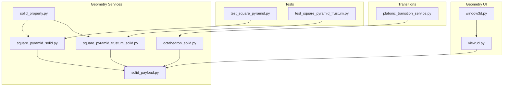
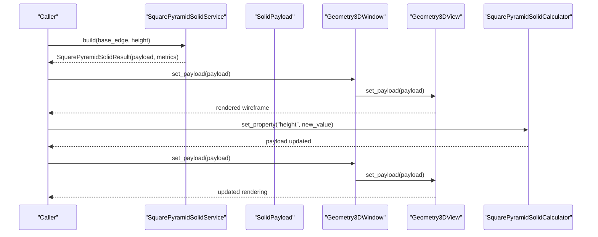
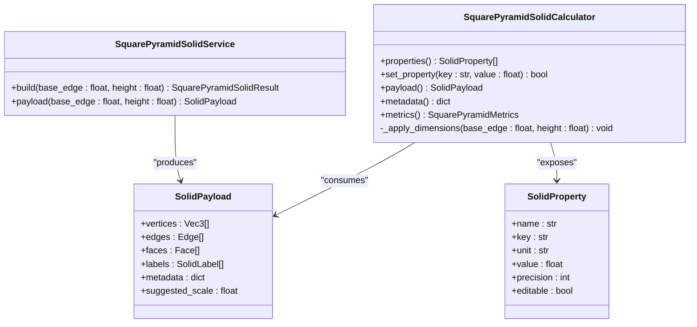
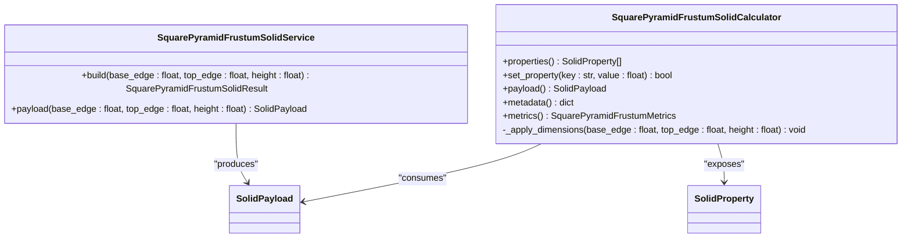
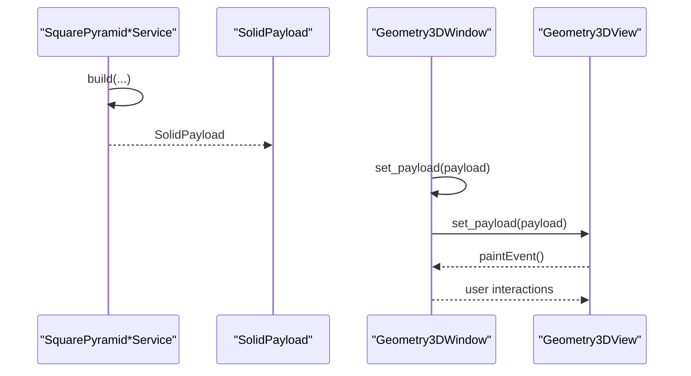
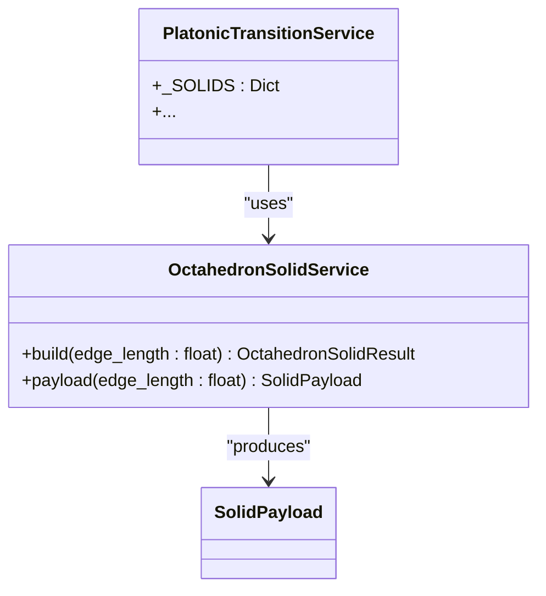
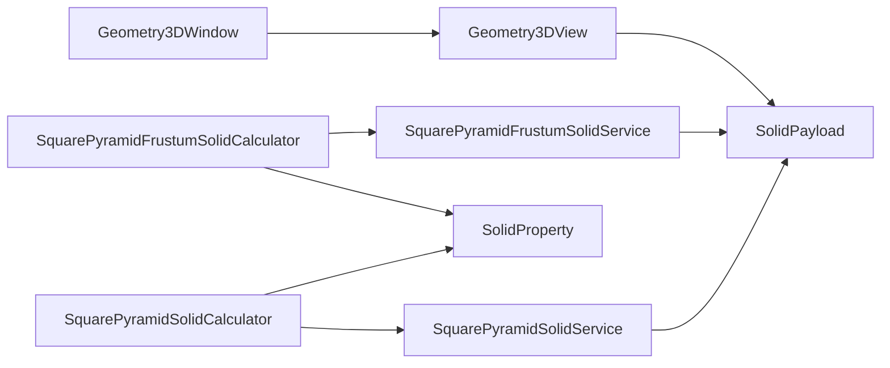

# Square Pyramids

<cite>
**Referenced Files in This Document**
- [square_pyramid_solid.py](file://src/pillars/geometry/services/square_pyramid_solid.py)
- [square_pyramid_frustum_solid.py](file://src/pillars/geometry/services/square_pyramid_frustum_solid.py)
- [solid_payload.py](file://src/pillars/geometry/shared/solid_payload.py)
- [solid_property.py](file://src/pillars/geometry/services/solid_property.py)
- [view3d.py](file://src/pillars/geometry/ui/geometry3d/view3d.py)
- [window3d.py](file://src/pillars/geometry/ui/geometry3d/window3d.py)
- [octahedron_solid.py](file://src/pillars/geometry/services/octahedron_solid.py)
- [platonic_transition_service.py](file://src/pillars/tq/services/platonic_transition_service.py)
- [test_square_pyramid.py](file://test/test_square_pyramid.py)
- [test_square_pyramid_frustum.py](file://test/test_square_pyramid_frustum.py)
</cite>

## Table of Contents
1. [Introduction](#introduction)
2. [Project Structure](#project-structure)
3. [Core Components](#core-components)
4. [Architecture Overview](#architecture-overview)
5. [Detailed Component Analysis](#detailed-component-analysis)
6. [Dependency Analysis](#dependency-analysis)
7. [Performance Considerations](#performance-considerations)
8. [Troubleshooting Guide](#troubleshooting-guide)
9. [Conclusion](#conclusion)
10. [Appendices](#appendices)

## Introduction
This document provides comprehensive API documentation for SquarePyramidSolid and SquarePyramidFrustumSolid implementations. It specifies parameters, computed metrics, and how to integrate with the Geometry3D rendering pipeline and property calculators. Practical examples demonstrate modeling Egyptian-style pyramids, modern architectural forms, and quantum step pyramids. The geometric relationship between square pyramids and octahedrons is explained, along with degenerate cases and prismoidal limits.

## Project Structure
The square pyramid implementations live in the geometry pillar’s services layer and produce SolidPayload objects consumed by the Geometry3D UI. Tests validate correctness and edge cases.

**Diagram sources**
- [square_pyramid_solid.py](file://src/pillars/geometry/services/square_pyramid_solid.py#L1-L232)
- [square_pyramid_frustum_solid.py](file://src/pillars/geometry/services/square_pyramid_frustum_solid.py#L1-L254)
- [solid_payload.py](file://src/pillars/geometry/shared/solid_payload.py#L1-L52)
- [solid_property.py](file://src/pillars/geometry/services/solid_property.py#L1-L21)
- [view3d.py](file://src/pillars/geometry/ui/geometry3d/view3d.py#L1-L298)
- [window3d.py](file://src/pillars/geometry/ui/geometry3d/window3d.py#L1-L807)
- [octahedron_solid.py](file://src/pillars/geometry/services/octahedron_solid.py#L1-L251)
- [platonic_transition_service.py](file://src/pillars/tq/services/platonic_transition_service.py#L1-L370)
- [test_square_pyramid.py](file://test/test_square_pyramid.py#L1-L48)
- [test_square_pyramid_frustum.py](file://test/test_square_pyramid_frustum.py#L1-L59)

**Section sources**
- [square_pyramid_solid.py](file://src/pillars/geometry/services/square_pyramid_solid.py#L1-L232)
- [square_pyramid_frustum_solid.py](file://src/pillars/geometry/services/square_pyramid_frustum_solid.py#L1-L254)
- [solid_payload.py](file://src/pillars/geometry/shared/solid_payload.py#L1-L52)
- [solid_property.py](file://src/pillars/geometry/services/solid_property.py#L1-L21)
- [view3d.py](file://src/pillars/geometry/ui/geometry3d/view3d.py#L1-L298)
- [window3d.py](file://src/pillars/geometry/ui/geometry3d/window3d.py#L1-L807)
- [octahedron_solid.py](file://src/pillars/geometry/services/octahedron_solid.py#L1-L251)
- [platonic_transition_service.py](file://src/pillars/tq/services/platonic_transition_service.py#L1-L370)
- [test_square_pyramid.py](file://test/test_square_pyramid.py#L1-L48)
- [test_square_pyramid_frustum.py](file://test/test_square_pyramid_frustum.py#L1-L59)

## Core Components
- SquarePyramidSolidService: Builds a right square pyramid SolidPayload from base_edge and height, with computed metrics and labels.
- SquarePyramidSolidCalculator: Exposes editable SolidProperty entries for base_edge, height, slant_height, base_apothem, base_area, lateral_area, surface_area, volume, lateral_edge; supports setting properties by value or deriving others.
- SquarePyramidFrustumSolidService: Builds a right square pyramid frustum SolidPayload from base_edge, top_edge, and height, with computed metrics and labels.
- SquarePyramidFrustumSolidCalculator: Exposes editable SolidProperty entries for base_edge, top_edge, height, slant_height, base_area, top_area, lateral_area, surface_area, volume, base_apothem, top_apothem, lateral_edge; supports setting properties by value or deriving others.
- SolidPayload: Shared payload carrying vertices, edges, faces, labels, metadata, and suggested_scale.
- SolidProperty: Shared property descriptor used by calculators.

Key API surfaces:
- Service.build(...) returns SolidPayload and metrics.
- Calculator.set_property(key, value) updates geometry and recalculates dependent properties.
- Geometry3DView accepts SolidPayload and renders wireframe with optional spheres and labels.

**Section sources**
- [square_pyramid_solid.py](file://src/pillars/geometry/services/square_pyramid_solid.py#L86-L120)
- [square_pyramid_solid.py](file://src/pillars/geometry/services/square_pyramid_solid.py#L122-L232)
- [square_pyramid_frustum_solid.py](file://src/pillars/geometry/services/square_pyramid_frustum_solid.py#L95-L133)
- [square_pyramid_frustum_solid.py](file://src/pillars/geometry/services/square_pyramid_frustum_solid.py#L135-L254)
- [solid_payload.py](file://src/pillars/geometry/shared/solid_payload.py#L12-L52)
- [solid_property.py](file://src/pillars/geometry/services/solid_property.py#L8-L21)
- [view3d.py](file://src/pillars/geometry/ui/geometry3d/view3d.py#L62-L118)

## Architecture Overview
The geometry services compute canonical vertex positions and metrics, then package them into SolidPayload. The Geometry3D window displays the payload and allows interactive editing via calculators.

**Diagram sources**
- [square_pyramid_solid.py](file://src/pillars/geometry/services/square_pyramid_solid.py#L86-L120)
- [window3d.py](file://src/pillars/geometry/ui/geometry3d/window3d.py#L85-L106)
- [view3d.py](file://src/pillars/geometry/ui/geometry3d/view3d.py#L62-L118)
- [square_pyramid_solid.py](file://src/pillars/geometry/services/square_pyramid_solid.py#L122-L232)

## Detailed Component Analysis

### SquarePyramidSolid
- Parameters:
  - base_edge: side length of the square base
  - height: perpendicular distance from base to apex
- Computed metrics:
  - slant_height: hypotenuse from apex to midpoint of base edge
  - base_apothem: half base_edge (distance from center to edge midpoint)
  - base_area, lateral_area, surface_area, volume
  - lateral_edge: distance from apex to base corner
- Vertex layout:
  - Base square centered at z = -height/2
  - Apex at z = +height/2
- Edges and faces:
  - Base edges plus four lateral edges connecting base corners to apex
  - Five triangular faces (one base, four lateral)
- Labels:
  - Dimension labels for base_edge and height
- Calculator:
  - Supports setting base_edge, height, slant_height, base_apothem, base_area, volume
  - Derived values update automatically

**Diagram sources**
- [square_pyramid_solid.py](file://src/pillars/geometry/services/square_pyramid_solid.py#L86-L120)
- [square_pyramid_solid.py](file://src/pillars/geometry/services/square_pyramid_solid.py#L122-L232)
- [solid_payload.py](file://src/pillars/geometry/shared/solid_payload.py#L12-L52)
- [solid_property.py](file://src/pillars/geometry/services/solid_property.py#L8-L21)

**Section sources**
- [square_pyramid_solid.py](file://src/pillars/geometry/services/square_pyramid_solid.py#L31-L116)
- [square_pyramid_solid.py](file://src/pillars/geometry/services/square_pyramid_solid.py#L122-L232)
- [test_square_pyramid.py](file://test/test_square_pyramid.py#L12-L48)

### SquarePyramidFrustumSolid
- Parameters:
  - base_edge: side length of bottom square
  - top_edge: side length of top square
  - height: vertical distance between bases
- Computed metrics:
  - slant_height: hypotenuse across apothem difference
  - base_apothem, top_apothem
  - base_area, top_area, lateral_area, surface_area, volume
  - lateral_edge: distance across offset between base and top corners
- Vertex layout:
  - Bottom base centered at z = -height/2
  - Top base centered at z = +height/2
- Edges and faces:
  - Four vertical edges connecting base corners to top
  - Four lateral trapezoidal faces
  - Two square faces (top and bottom)
- Labels:
  - Dimension labels for base_edge, top_edge, height
- Calculator:
  - Supports setting base_edge, top_edge, height, slant_height, base_area, top_area, volume
  - Derived values update automatically

**Diagram sources**
- [square_pyramid_frustum_solid.py](file://src/pillars/geometry/services/square_pyramid_frustum_solid.py#L95-L133)
- [square_pyramid_frustum_solid.py](file://src/pillars/geometry/services/square_pyramid_frustum_solid.py#L135-L254)
- [solid_payload.py](file://src/pillars/geometry/shared/solid_payload.py#L12-L52)
- [solid_property.py](file://src/pillars/geometry/services/solid_property.py#L8-L21)

**Section sources**
- [square_pyramid_frustum_solid.py](file://src/pillars/geometry/services/square_pyramid_frustum_solid.py#L34-L128)
- [square_pyramid_frustum_solid.py](file://src/pillars/geometry/services/square_pyramid_frustum_solid.py#L135-L254)
- [test_square_pyramid_frustum.py](file://test/test_square_pyramid_frustum.py#L12-L59)

### Geometry3D Rendering Pipeline Integration
- SolidPayload carries vertices, edges, faces, labels, and metadata.
- Geometry3DView renders wireframe edges and optional spheres/labels.
- Geometry3DWindow orchestrates UI, property inputs, and payload updates.
- Integration:
  - Call service.build(...) to obtain SolidPayload.
  - Pass payload to Geometry3DWindow.set_payload(...).
  - Optionally attach a calculator to enable interactive editing.

**Diagram sources**
- [square_pyramid_solid.py](file://src/pillars/geometry/services/square_pyramid_solid.py#L86-L120)
- [square_pyramid_frustum_solid.py](file://src/pillars/geometry/services/square_pyramid_frustum_solid.py#L95-L133)
- [window3d.py](file://src/pillars/geometry/ui/geometry3d/window3d.py#L85-L106)
- [view3d.py](file://src/pillars/geometry/ui/geometry3d/view3d.py#L62-L118)

**Section sources**
- [solid_payload.py](file://src/pillars/geometry/shared/solid_payload.py#L12-L52)
- [view3d.py](file://src/pillars/geometry/ui/geometry3d/view3d.py#L62-L118)
- [window3d.py](file://src/pillars/geometry/ui/geometry3d/window3d.py#L85-L106)

### Geometric Relationship to Octahedrons and Transitions
- OctahedronSolidService produces a regular octahedron with edge_length parameter and rich metadata including inradius, midradius, circumradius, and circumferences.
- The PlatonicTransitionService enumerates Platonic solids including octahedron and provides transition utilities that can be used to analyze geometric relationships and transformations among solids.

**Diagram sources**
- [octahedron_solid.py](file://src/pillars/geometry/services/octahedron_solid.py#L108-L138)
- [platonic_transition_service.py](file://src/pillars/tq/services/platonic_transition_service.py#L72-L102)

**Section sources**
- [octahedron_solid.py](file://src/pillars/geometry/services/octahedron_solid.py#L108-L138)
- [platonic_transition_service.py](file://src/pillars/tq/services/platonic_transition_service.py#L72-L102)

## Dependency Analysis
- SquarePyramidSolidService and SquarePyramidFrustumSolidService depend on SolidPayload and SolidLabel for packaging geometry and metadata.
- Calculators depend on SolidProperty to expose editable parameters and derive dependent values.
- Geometry3DView depends on SolidPayload for rendering; Geometry3DWindow manages UI and calculator binding.

**Diagram sources**
- [square_pyramid_solid.py](file://src/pillars/geometry/services/square_pyramid_solid.py#L86-L120)
- [square_pyramid_frustum_solid.py](file://src/pillars/geometry/services/square_pyramid_frustum_solid.py#L95-L133)
- [solid_payload.py](file://src/pillars/geometry/shared/solid_payload.py#L12-L52)
- [solid_property.py](file://src/pillars/geometry/services/solid_property.py#L8-L21)
- [view3d.py](file://src/pillars/geometry/ui/geometry3d/view3d.py#L62-L118)
- [window3d.py](file://src/pillars/geometry/ui/geometry3d/window3d.py#L85-L106)

**Section sources**
- [square_pyramid_solid.py](file://src/pillars/geometry/services/square_pyramid_solid.py#L86-L120)
- [square_pyramid_frustum_solid.py](file://src/pillars/geometry/services/square_pyramid_frustum_solid.py#L95-L133)
- [solid_payload.py](file://src/pillars/geometry/shared/solid_payload.py#L12-L52)
- [solid_property.py](file://src/pillars/geometry/services/solid_property.py#L8-L21)
- [view3d.py](file://src/pillars/geometry/ui/geometry3d/view3d.py#L62-L118)
- [window3d.py](file://src/pillars/geometry/ui/geometry3d/window3d.py#L85-L106)

## Performance Considerations
- All computations are closed-form arithmetic with minimal overhead; suitable for real-time UI updates.
- Geometry3DView performs simple vector projections and drawing; performance scales linearly with vertex count.
- Using suggested_scale in SolidPayload helps maintain consistent viewport scaling across solids.

[No sources needed since this section provides general guidance]

## Troubleshooting Guide
- Invalid dimensions:
  - Both services raise errors for non-positive base_edge/base_apothem, top_edge, or height.
- Calculator constraints:
  - Setting slant_height requires valid apothem difference; setting volume requires non-zero base_edge or height depending on context.
- UI feedback:
  - Geometry3DWindow shows error messages when property edits fail and clears inputs on clear.

**Section sources**
- [square_pyramid_solid.py](file://src/pillars/geometry/services/square_pyramid_solid.py#L90-L96)
- [square_pyramid_frustum_solid.py](file://src/pillars/geometry/services/square_pyramid_frustum_solid.py#L98-L104)
- [square_pyramid_solid.py](file://src/pillars/geometry/services/square_pyramid_solid.py#L150-L184)
- [square_pyramid_frustum_solid.py](file://src/pillars/geometry/services/square_pyramid_frustum_solid.py#L167-L201)
- [window3d.py](file://src/pillars/geometry/ui/geometry3d/window3d.py#L588-L596)

## Conclusion
SquarePyramidSolid and SquarePyramidFrustumSolid provide robust, parameter-driven geometry with comprehensive metrics and clean integration into the Geometry3D pipeline. Their calculators enable interactive exploration, while tests confirm correctness across typical and boundary conditions. The octahedron and transition services contextualize these shapes within broader geometric frameworks.

[No sources needed since this section summarizes without analyzing specific files]

## Appendices

### API Reference: SquarePyramidSolidService
- build(base_edge: float = 1.0, height: float = 1.0) -> SquarePyramidSolidResult
- payload(base_edge: float = 1.0, height: float = 1.0) -> SolidPayload

**Section sources**
- [square_pyramid_solid.py](file://src/pillars/geometry/services/square_pyramid_solid.py#L86-L120)

### API Reference: SquarePyramidSolidCalculator
- properties() -> List[SolidProperty]
- set_property(key: str, value: Optional[float]) -> bool
- payload() -> Optional[SolidPayload]
- metadata() -> Dict[str, float]
- metrics() -> Optional[SquarePyramidMetrics]

**Section sources**
- [square_pyramid_solid.py](file://src/pillars/geometry/services/square_pyramid_solid.py#L122-L232)

### API Reference: SquarePyramidFrustumSolidService
- build(base_edge: float = 2.0, top_edge: float = 1.0, height: float = 1.0) -> SquarePyramidFrustumSolidResult
- payload(base_edge: float = 2.0, top_edge: float = 1.0, height: float = 1.0) -> SolidPayload

**Section sources**
- [square_pyramid_frustum_solid.py](file://src/pillars/geometry/services/square_pyramid_frustum_solid.py#L95-L133)

### API Reference: SquarePyramidFrustumSolidCalculator
- properties() -> List[SolidProperty]
- set_property(key: str, value: Optional[float]) -> bool
- payload() -> Optional[SolidPayload]
- metadata() -> Dict[str, float]
- metrics() -> Optional[SquarePyramidFrustumMetrics]

**Section sources**
- [square_pyramid_frustum_solid.py](file://src/pillars/geometry/services/square_pyramid_frustum_solid.py#L135-L254)

### API Reference: SolidPayload
- vertices: List[Tuple[float, float, float]]
- edges: List[Tuple[int, int]]
- faces: List[List[int]]
- labels: List[SolidLabel]
- metadata: dict
- suggested_scale: Optional[float]

**Section sources**
- [solid_payload.py](file://src/pillars/geometry/shared/solid_payload.py#L12-L52)

### API Reference: SolidProperty
- name: str
- key: str
- unit: str
- value: Optional[float]
- precision: int
- editable: bool

**Section sources**
- [solid_property.py](file://src/pillars/geometry/services/solid_property.py#L8-L21)

### Practical Examples

- Egyptian-style pyramid:
  - Use SquarePyramidSolidService.build(base_edge, height) to model a right square pyramid. The calculator can adjust base_edge or height interactively.
  - Example path: [test_square_pyramid.py](file://test/test_square_pyramid.py#L12-L27)

- Modern architectural form:
  - Use SquarePyramidFrustumSolidService.build(base_edge, top_edge, height) to model stepped or truncated forms. The calculator can adjust base_edge, top_edge, or height.
  - Example path: [test_square_pyramid_frustum.py](file://test/test_square_pyramid_frustum.py#L12-L30)

- Quantum step pyramid:
  - Model a multi-step structure by iteratively building frustum segments with decreasing top_edge and constant height increments.
  - Example path: [square_pyramid_frustum_solid.py](file://src/pillars/geometry/services/square_pyramid_frustum_solid.py#L95-L133)

- Degenerate cases:
  - Flat pyramid: set height close to zero; lateral_area approaches zero, surface_area approaches base_area.
  - Prismoidal limit: as top_edge approaches base_edge, the frustum becomes a prism-like shape; lateral_area approaches perimeter × height.

- Integration with Geometry3D:
  - Obtain SolidPayload from service.build(...)
  - Pass to Geometry3DWindow.set_payload(...)
  - Optionally bind a calculator to enable interactive editing.

**Section sources**
- [test_square_pyramid.py](file://test/test_square_pyramid.py#L12-L48)
- [test_square_pyramid_frustum.py](file://test/test_square_pyramid_frustum.py#L12-L59)
- [square_pyramid_solid.py](file://src/pillars/geometry/services/square_pyramid_solid.py#L86-L120)
- [square_pyramid_frustum_solid.py](file://src/pillars/geometry/services/square_pyramid_frustum_solid.py#L95-L133)
- [window3d.py](file://src/pillars/geometry/ui/geometry3d/window3d.py#L85-L106)

### Volume, Surface Area, and Lateral Edge Formulas
- Right square pyramid:
  - Volume = (base_edge^2 × height) / 3
  - Surface area = base_area + lateral_area = base_edge^2 + 2 × base_edge × slant_height
  - Lateral edge = sqrt(height^2 + (base_edge × sqrt(2)/2)^2)
- Square pyramid frustum:
  - Volume = (height / 3) × (base_edge^2 + base_edge × top_edge + top_edge^2)
  - Surface area = base_area + top_area + lateral_area = base_edge^2 + top_edge^2 + 2 × (base_edge + top_edge) × slant_height
  - Lateral edge = sqrt(height^2 + ((base_edge - top_edge) × sqrt(2)/2)^2)

**Section sources**
- [square_pyramid_solid.py](file://src/pillars/geometry/services/square_pyramid_solid.py#L31-L50)
- [square_pyramid_frustum_solid.py](file://src/pillars/geometry/services/square_pyramid_frustum_solid.py#L34-L59)

### Face Normals and Inertia Tensor
- Face normals:
  - Not currently computed or exposed by the services. If needed, compute per-face using cross products of edge vectors.
- Inertia tensor:
  - Not currently computed or exposed by the services. If needed, compute for a right solid by integrating over the volume using standard formulas.

[No sources needed since this section provides general guidance]

### Collision Detection Integration
- Geometry3DView does not perform collision detection; it renders wireframes.
- For collision detection, use the vertices/faces from SolidPayload to implement spatial queries (e.g., ray-triangle intersection) in your application layer.

[No sources needed since this section provides general guidance]