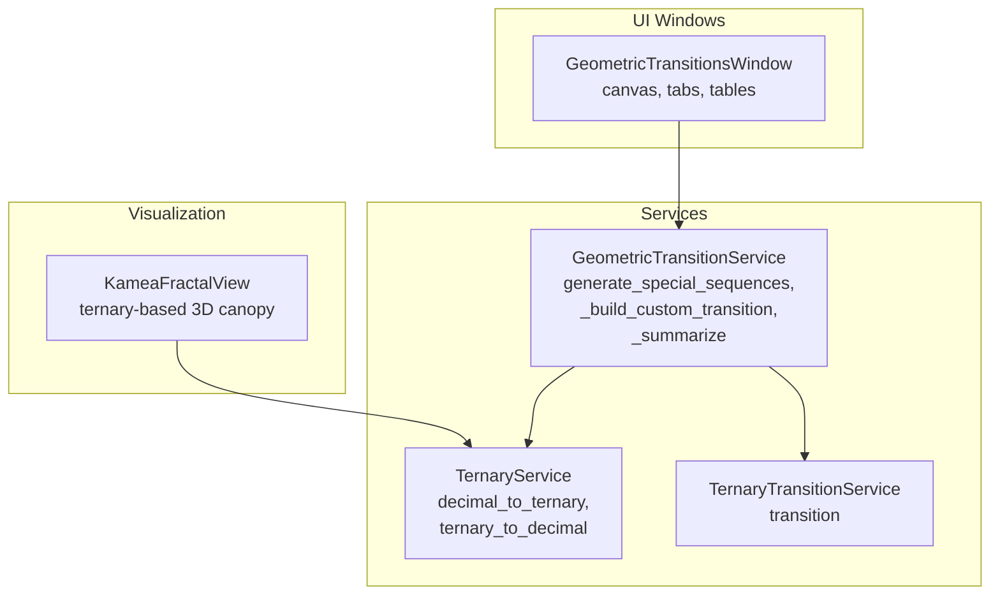
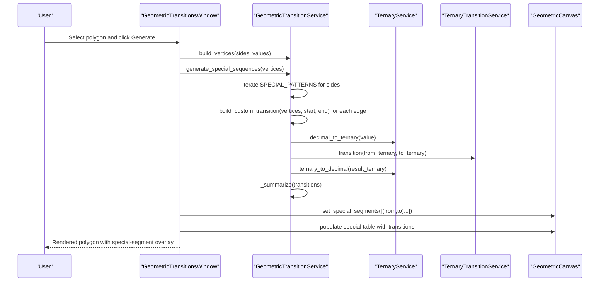
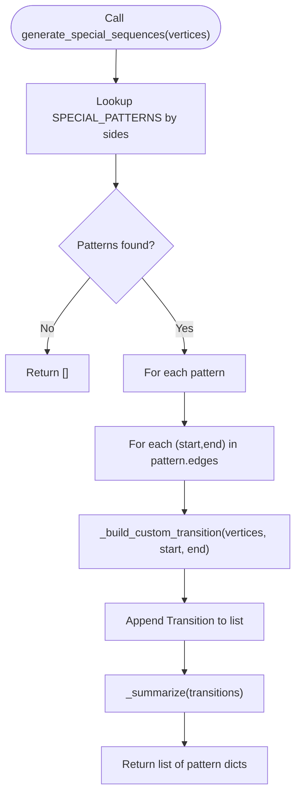
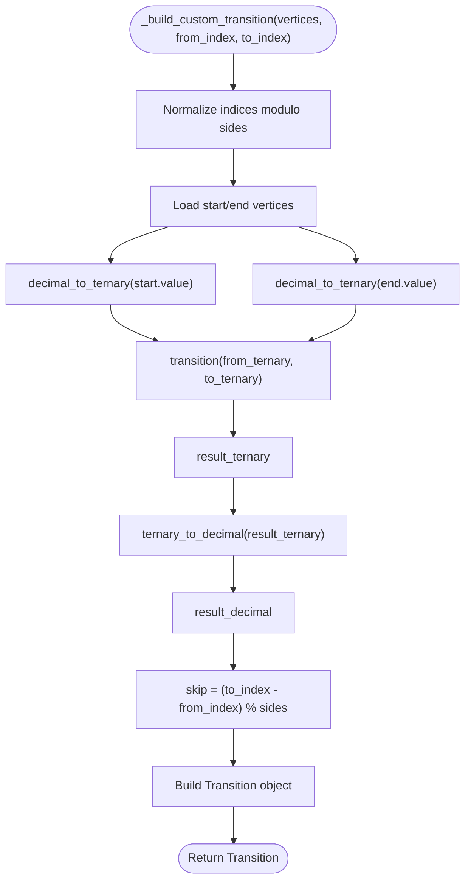
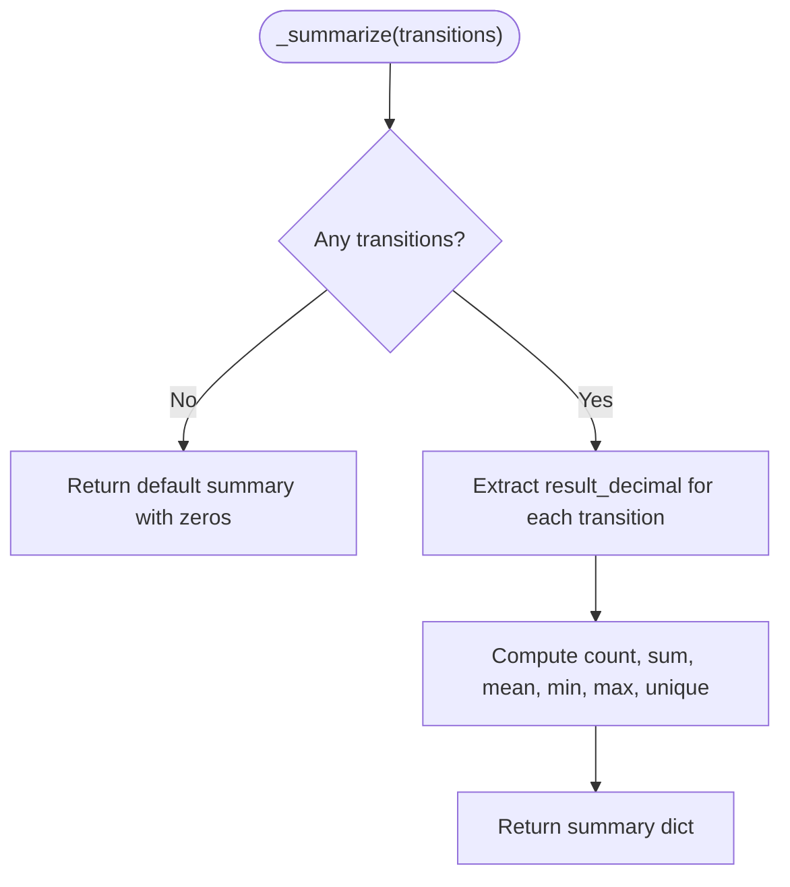
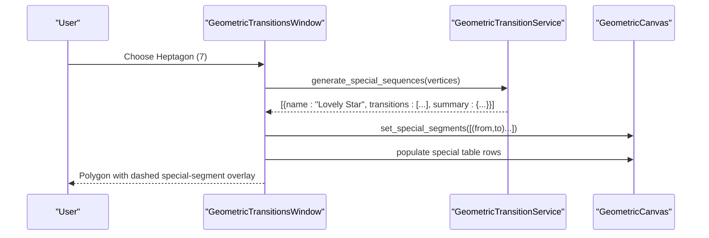
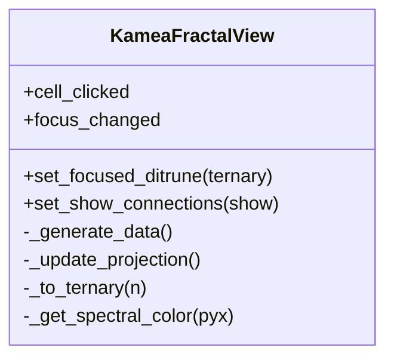
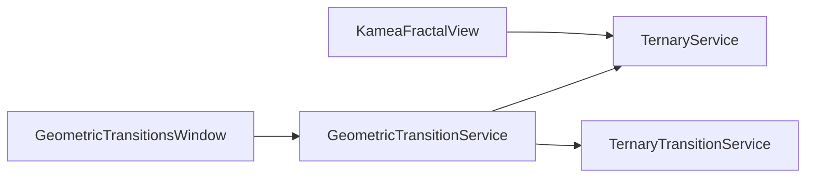

# Special Sequences

<cite>
**Referenced Files in This Document**
- [geometric_transition_service.py](file://src/pillars/tq/services/geometric_transition_service.py)
- [ternary_service.py](file://src/pillars/tq/services/ternary_service.py)
- [ternary_transition_service.py](file://src/pillars/tq/services/ternary_transition_service.py)
- [geometric_transitions_window.py](file://src/pillars/tq/ui/geometric_transitions_window.py)
- [kamea_fractal_view.py](file://src/pillars/tq/ui/kamea_fractal_view.py)
- [The_Kamea_Doctrine.md](file://Docs/kamea/The_Kamea_Doctrine.md)
</cite>

## Table of Contents
1. [Introduction](#introduction)
2. [Project Structure](#project-structure)
3. [Core Components](#core-components)
4. [Architecture Overview](#architecture-overview)
5. [Detailed Component Analysis](#detailed-component-analysis)
6. [Dependency Analysis](#dependency-analysis)
7. [Performance Considerations](#performance-considerations)
8. [Troubleshooting Guide](#troubleshooting-guide)
9. [Conclusion](#conclusion)
10. [Appendices](#appendices)

## Introduction
This document explains the special sequences functionality in the Geometric Transition Service. It focuses on:
- How generate_special_sequences returns predefined geometric patterns for specific polygons (notably heptagons).
- The SPECIAL_PATTERNS dictionary for heptagons, including “Lovely Star,” “Mountain Star,” and “Atomic Star.”
- How _build_custom_transition computes ternary results for non-uniform edge paths and how the result summary is generated.
- Rendering and interpreting a unicursal heptagram (specifically the “Lovely Star”) and its transition metrics.
- Use cases for studying esoteric geometric forms and integrating these patterns into visualization tools such as kamea_fractal_view.py.

## Project Structure
The special sequences feature spans services and UI components:
- Services define the geometric transitions and ternary computation logic.
- UI windows render polygons, highlight transitions, and present special patterns.
- Visualization tools integrate ternary-based geometry into broader Kamea views.

**Diagram sources**
- [geometric_transition_service.py](file://src/pillars/tq/services/geometric_transition_service.py#L38-L323)
- [ternary_service.py](file://src/pillars/tq/services/ternary_service.py#L1-L114)
- [ternary_transition_service.py](file://src/pillars/tq/services/ternary_transition_service.py#L1-L70)
- [geometric_transitions_window.py](file://src/pillars/tq/ui/geometric_transitions_window.py#L1-L875)
- [kamea_fractal_view.py](file://src/pillars/tq/ui/kamea_fractal_view.py#L1-L457)

**Section sources**
- [geometric_transition_service.py](file://src/pillars/tq/services/geometric_transition_service.py#L38-L323)
- [geometric_transitions_window.py](file://src/pillars/tq/ui/geometric_transitions_window.py#L1-L875)
- [kamea_fractal_view.py](file://src/pillars/tq/ui/kamea_fractal_view.py#L1-L457)

## Core Components
- GeometricTransitionService: Provides polygon vertex construction, skip-group generation, and special-sequence generation. It includes SPECIAL_PATTERNS for heptagons and exposes methods to compute transitions and summaries.
- TernaryService: Converts integers to ternary strings and vice versa, and supports transformations used in the system.
- TernaryTransitionService: Applies the ternary transition map to pairs of ternary strings to produce a result digit sequence.
- GeometricTransitionsWindow: UI that builds vertices, generates skip groups, and displays special patterns in a dedicated tab. It renders polygon edges and overlays special-segment paths.
- KameaFractalView: A 3D ternary-based visualization that projects 729 ternary nodes into 3D space and draws hierarchical connections; it complements special sequences by grounding transitions in ternary semantics.

**Section sources**
- [geometric_transition_service.py](file://src/pillars/tq/services/geometric_transition_service.py#L38-L323)
- [ternary_service.py](file://src/pillars/tq/services/ternary_service.py#L1-L114)
- [ternary_transition_service.py](file://src/pillars/tq/services/ternary_transition_service.py#L1-L70)
- [geometric_transitions_window.py](file://src/pillars/tq/ui/geometric_transitions_window.py#L1-L875)
- [kamea_fractal_view.py](file://src/pillars/tq/ui/kamea_fractal_view.py#L1-L457)

## Architecture Overview
The special sequences pipeline connects UI selection to service computation and visualization:

**Diagram sources**
- [geometric_transitions_window.py](file://src/pillars/tq/ui/geometric_transitions_window.py#L297-L540)
- [geometric_transition_service.py](file://src/pillars/tq/services/geometric_transition_service.py#L156-L182)
- [geometric_transition_service.py](file://src/pillars/tq/services/geometric_transition_service.py#L218-L249)
- [geometric_transition_service.py](file://src/pillars/tq/services/geometric_transition_service.py#L250-L272)
- [ternary_service.py](file://src/pillars/tq/services/ternary_service.py#L1-L114)
- [ternary_transition_service.py](file://src/pillars/tq/services/ternary_transition_service.py#L1-L70)

## Detailed Component Analysis

### SPECIAL_PATTERNS and generate_special_sequences
- SPECIAL_PATTERNS is a class-level dictionary keyed by polygon sides. For heptagons (7), it defines three named edge sequences:
  - “Lovely Star”: Unicursal heptagram path 1–4–2–6–3–7–5–1.
  - “Mountain Star”: Alternate heptagram path 1–4–6–2–7–3–5–1.
  - “Atomic Star”: Heptagram path 1–3–5–2–7–4–6–1.
- Each pattern entry includes:
  - name: Human-readable label.
  - description: Informative description of the path.
  - edges: A list of ordered pairs (from_vertex_index, to_vertex_index) using 0-based indices.
- generate_special_sequences:
  - Retrieves patterns for the given number of sides.
  - Iterates edges and converts each (start, end) into a Transition using _build_custom_transition.
  - Aggregates transitions and computes a summary via _summarize.
  - Returns a list of pattern dictionaries, each containing name, description, transitions, and summary.

**Diagram sources**
- [geometric_transition_service.py](file://src/pillars/tq/services/geometric_transition_service.py#L44-L86)
- [geometric_transition_service.py](file://src/pillars/tq/services/geometric_transition_service.py#L156-L182)

**Section sources**
- [geometric_transition_service.py](file://src/pillars/tq/services/geometric_transition_service.py#L44-L86)
- [geometric_transition_service.py](file://src/pillars/tq/services/geometric_transition_service.py#L156-L182)

### _build_custom_transition and ternary computation
- _build_custom_transition computes a Transition for a non-uniform edge (start_index, to_index) that may not follow the skip pattern.
- Steps:
  - Normalize indices modulo sides to wrap around the polygon.
  - Retrieve start and end vertices.
  - Convert start.value and end.value to ternary using TernaryService.decimal_to_ternary.
  - Apply TernaryTransitionService.transition to the two ternary strings.
  - Convert the result back to decimal using TernaryService.ternary_to_decimal.
  - Compute skip_value as (end.index − start.index) modulo sides.
  - Return a Transition with from_index, to_index, from_value, to_value, from_ternary, to_ternary, result_ternary, result_decimal, and skip.

**Diagram sources**
- [geometric_transition_service.py](file://src/pillars/tq/services/geometric_transition_service.py#L218-L249)
- [ternary_service.py](file://src/pillars/tq/services/ternary_service.py#L1-L114)
- [ternary_transition_service.py](file://src/pillars/tq/services/ternary_transition_service.py#L1-L70)

**Section sources**
- [geometric_transition_service.py](file://src/pillars/tq/services/geometric_transition_service.py#L218-L249)
- [ternary_service.py](file://src/pillars/tq/services/ternary_service.py#L1-L114)
- [ternary_transition_service.py](file://src/pillars/tq/services/ternary_transition_service.py#L1-L70)

### Summary computation and result presentation
- _summarize computes:
  - count: Number of transitions.
  - sum_result: Sum of result_decimal across transitions.
  - mean_result: Average of result_decimal.
  - min_result: Minimum result_decimal.
  - max_result: Maximum result_decimal.
  - unique_results: Number of unique result_decimal values.
- The UI integrates this summary into:
  - Skip group tabs (for regular skip groups).
  - Special Patterns tab (for named patterns), including a summary label and a table of transitions.

**Diagram sources**
- [geometric_transition_service.py](file://src/pillars/tq/services/geometric_transition_service.py#L250-L272)
- [geometric_transitions_window.py](file://src/pillars/tq/ui/geometric_transitions_window.py#L542-L556)

**Section sources**
- [geometric_transition_service.py](file://src/pillars/tq/services/geometric_transition_service.py#L250-L272)
- [geometric_transitions_window.py](file://src/pillars/tq/ui/geometric_transitions_window.py#L542-L556)

### Rendering the unicursal heptagram (“Lovely Star”)
- The “Lovely Star” pattern is defined for heptagons (7 sides) and consists of seven edges forming a closed, unicursal heptagram.
- The UI:
  - Builds vertices for the selected polygon.
  - Calls generate_special_sequences to obtain transitions for the “Lovely Star.”
  - Populates a table with transitions and overlays the special segments on the polygon canvas.
  - Displays a summary label with statistics for the pattern.

**Diagram sources**
- [geometric_transitions_window.py](file://src/pillars/tq/ui/geometric_transitions_window.py#L312-L540)
- [geometric_transition_service.py](file://src/pillars/tq/services/geometric_transition_service.py#L156-L182)

**Section sources**
- [geometric_transitions_window.py](file://src/pillars/tq/ui/geometric_transitions_window.py#L312-L540)
- [geometric_transition_service.py](file://src/pillars/tq/services/geometric_transition_service.py#L44-L86)

### Interpreting transition metrics for the “Lovely Star”
- The Special Patterns tab shows:
  - From and To vertex indices.
  - From and To values with their ternary representations.
  - Result (Ternary) and Result (Decimal).
  - A summary label with Count, Sum, Mean Result, Range, and Unique Results.
- These metrics reflect how the ternary transition map transforms the values along the heptagram path. The summary helps compare patterns and identify distribution characteristics.

**Section sources**
- [geometric_transitions_window.py](file://src/pillars/tq/ui/geometric_transitions_window.py#L494-L540)
- [geometric_transition_service.py](file://src/pillars/tq/services/geometric_transition_service.py#L250-L272)

### Use case: studying esoteric geometric forms
- The “Lovely Star,” “Mountain Star,” and “Atomic Star” represent named heptagrammatic paths that can be analyzed for symmetry, closure, and distribution of transition outcomes.
- These patterns are useful for:
  - Exploring closed walks on polygons with non-uniform skips.
  - Investigating ternary transition distributions under constrained edge sequences.
  - Comparing different star configurations for aesthetic or symbolic properties.

**Section sources**
- [geometric_transition_service.py](file://src/pillars/tq/services/geometric_transition_service.py#L44-L86)

### Integration with visualization tools (kamea_fractal_view.py)
- KameaFractalView renders a ternary-based 3D canopy of ditrunes (6-digit ternary numbers) and draws hierarchical connections between levels.
- While not directly computing polygon transitions, it:
  - Uses ternary arithmetic and mappings consistent with the ternary transition system.
  - Projects 3D points onto a 2D scene and supports interactive focus modes and toggles for connections.
- This visualization complements special sequences by anchoring transitions in a broader ternary geometry and dimensional framework described in The Kamea Doctrine.

**Diagram sources**
- [kamea_fractal_view.py](file://src/pillars/tq/ui/kamea_fractal_view.py#L1-L457)

**Section sources**
- [kamea_fractal_view.py](file://src/pillars/tq/ui/kamea_fractal_view.py#L1-L457)
- [The_Kamea_Doctrine.md](file://Docs/kamea/The_Kamea_Doctrine.md#L1-L203)

## Dependency Analysis
- GeometricTransitionService depends on:
  - TernaryService for converting values to and from ternary.
  - TernaryTransitionService for applying the transition map.
- GeometricTransitionsWindow depends on GeometricTransitionService to:
  - Build vertices and special sequences.
  - Populate tables and overlays.
- KameaFractalView depends on ternary conversion utilities and uses ternary strings to compute 3D positions and colors.

**Diagram sources**
- [geometric_transitions_window.py](file://src/pillars/tq/ui/geometric_transitions_window.py#L1-L875)
- [geometric_transition_service.py](file://src/pillars/tq/services/geometric_transition_service.py#L38-L323)
- [ternary_service.py](file://src/pillars/tq/services/ternary_service.py#L1-L114)
- [ternary_transition_service.py](file://src/pillars/tq/services/ternary_transition_service.py#L1-L70)
- [kamea_fractal_view.py](file://src/pillars/tq/ui/kamea_fractal_view.py#L1-L457)

**Section sources**
- [geometric_transitions_window.py](file://src/pillars/tq/ui/geometric_transitions_window.py#L1-L875)
- [geometric_transition_service.py](file://src/pillars/tq/services/geometric_transition_service.py#L38-L323)
- [ternary_service.py](file://src/pillars/tq/services/ternary_service.py#L1-L114)
- [ternary_transition_service.py](file://src/pillars/tq/services/ternary_transition_service.py#L1-L70)
- [kamea_fractal_view.py](file://src/pillars/tq/ui/kamea_fractal_view.py#L1-L457)

## Performance Considerations
- Special sequences involve a fixed number of edges per pattern (e.g., seven edges for heptagrams). Computation cost scales linearly with the number of edges.
- Ternary conversions and transitions are O(k) in the length of the longest ternary string, where k is the number of digits. For typical small polygons, this is negligible.
- UI rendering overlays special segments efficiently by drawing only the required lines and updating labels.

[No sources needed since this section provides general guidance]

## Troubleshooting Guide
- Invalid polygon sides: The service validates sides against configured bounds and raises errors if out of range.
- Missing patterns: If no patterns exist for the selected polygon, generate_special_sequences returns an empty list.
- Non-integer values: The UI sanitizes vertex value inputs; invalid entries default to positional values.
- Empty transitions: _summarize returns neutral defaults when no transitions are provided.

**Section sources**
- [geometric_transition_service.py](file://src/pillars/tq/services/geometric_transition_service.py#L293-L323)
- [geometric_transitions_window.py](file://src/pillars/tq/ui/geometric_transitions_window.py#L297-L341)
- [geometric_transition_service.py](file://src/pillars/tq/services/geometric_transition_service.py#L250-L272)

## Conclusion
The special sequences feature enables the study of named geometric patterns on polygons, particularly heptagrams, by combining polygon vertex construction, non-uniform edge transitions, and ternary arithmetic. The GeometricTransitionsWindow integrates these computations into an interactive visualization, while KameaFractalView anchors the transitions within a broader ternary-based dimensional framework. Together, they support both analytical exploration and aesthetic interpretation of esoteric geometric forms.

[No sources needed since this section summarizes without analyzing specific files]

## Appendices

### Example: Rendering the “Lovely Star” and Metrics
- Steps:
  - Select a heptagon (7 sides) in the UI.
  - Click Generate to build vertices and compute special sequences.
  - Switch to the Special Patterns tab to view the “Lovely Star.”
  - Observe the table of transitions and the summary label.
- Interpretation:
  - The Count equals the number of edges in the pattern.
  - The Sum and Mean Result reflect the aggregate outcome of the ternary transitions along the path.
  - Unique Results indicate diversity in transition outcomes.

**Section sources**
- [geometric_transitions_window.py](file://src/pillars/tq/ui/geometric_transitions_window.py#L312-L540)
- [geometric_transition_service.py](file://src/pillars/tq/services/geometric_transition_service.py#L44-L86)
- [geometric_transition_service.py](file://src/pillars/tq/services/geometric_transition_service.py#L250-L272)