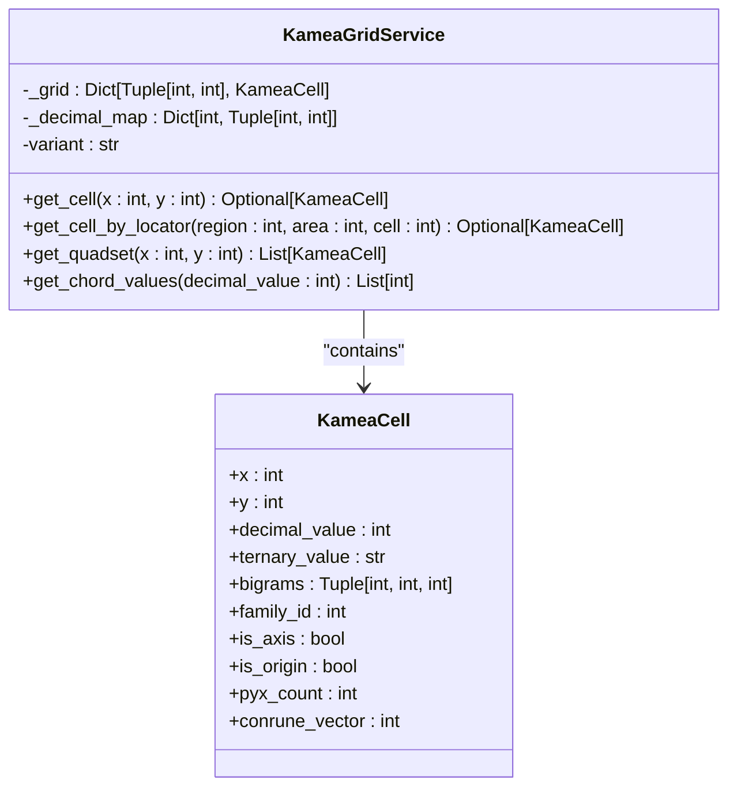
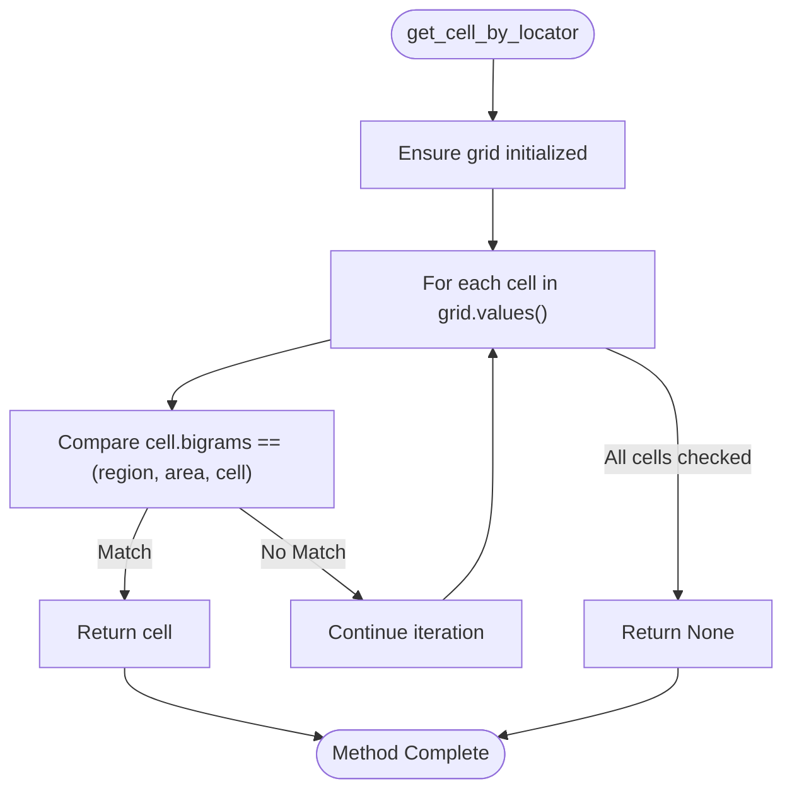
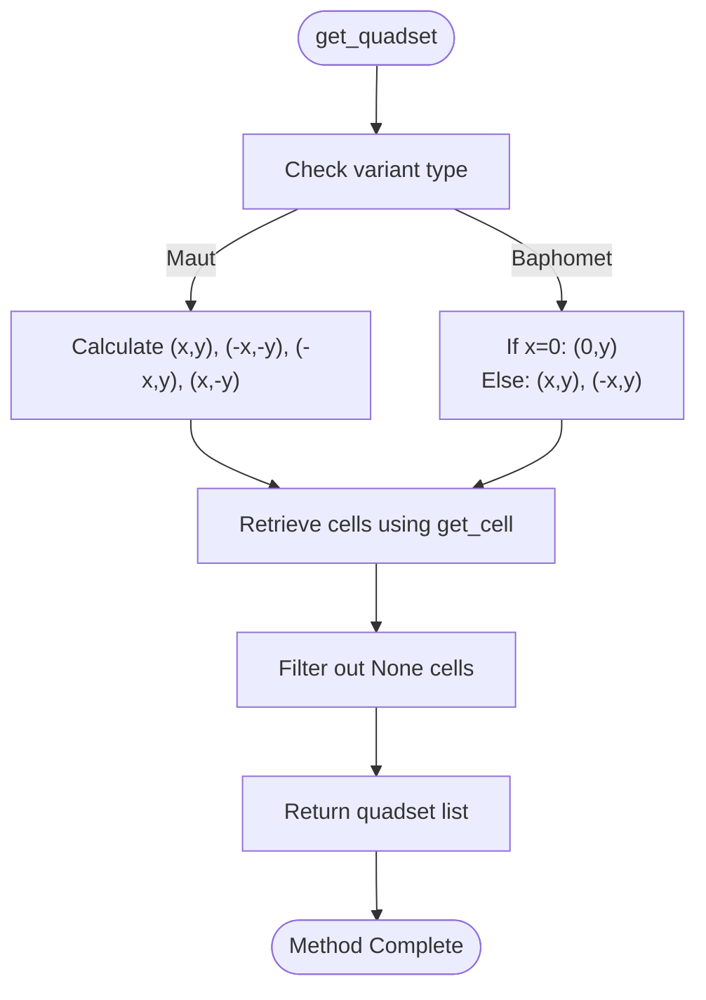
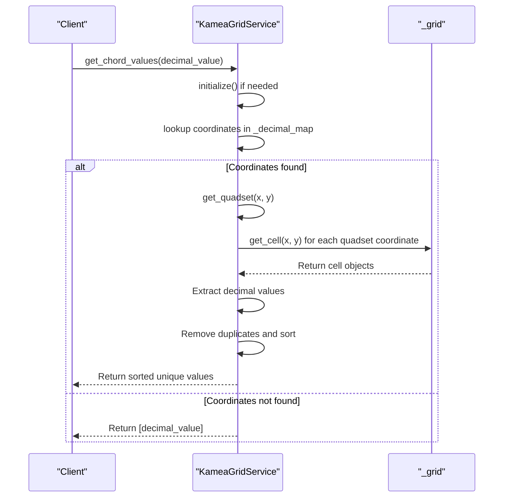

# Grid Query Operations

<cite>
**Referenced Files in This Document**   
- [kamea_grid_service.py](file://src/pillars/tq/services/kamea_grid_service.py)
- [kamea_cell.py](file://src/pillars/tq/models/kamea_cell.py)
- [The_Kamea_Doctrine.md](file://Docs/kamea/The_Kamea_Doctrine.md)
- [ternary_transition_system.md](file://Docs/kamea/ternary_transition_system.md)
- [kamea_grid_view.py](file://src/pillars/tq/ui/kamea_grid_view.py)
- [ternary_sound_widget.py](file://src/pillars/tq/ui/ternary_sound_widget.py)
</cite>

## Table of Contents
1. [Introduction](#introduction)
2. [Core Query Methods](#core-query-methods)
3. [get_cell: O(1) Cartesian Lookup](#get_cell-o1-cartesian-lookup)
4. [get_cell_by_locator: O(N) Bigram Search](#get_cell_by_locator-on-bigram-search)
5. [get_quadset: Variant-Specific Symmetry](#get_quadset-variant-specific-symmetry)
6. [get_chord_values: Coordinate-to-Value Workflow](#get_chord_values-coordinate-to-value-workflow)
7. [Usage Examples and Edge Cases](#usage-examples-and-edge-cases)
8. [Conclusion](#conclusion)

## Introduction
The KameaGridService provides essential query operations for navigating the 27×27 Kamea grid, a foundational component of the Trigrammaton Qabalah (TQ) Engine. This document details four core query methods: `get_cell`, `get_cell_by_locator`, `get_quadset`, and `get_chord_values`. These methods enable efficient spatial navigation, bigram-based searching, symmetry analysis, and geometric chord extraction within the Kamea lattice. The service acts as the Source of Truth by loading validated CSV data and providing optimized access patterns for both Cartesian coordinates and hierarchical locators.

**Section sources**
- [kamea_grid_service.py](file://src/pillars/tq/services/kamea_grid_service.py#L11-L220)

## Core Query Methods
The KameaGridService implements four primary query methods that serve distinct purposes in grid navigation and analysis. These methods provide different access patterns to the 729-cell lattice, supporting both direct coordinate lookup and hierarchical searching. The service maintains two internal data structures: `_grid` for O(1) coordinate access and `_decimal_map` for reverse decimal-to-coordinate lookup. All methods ensure initialization before operation and handle edge cases such as missing cells or invalid coordinates.

**Diagram sources**
- [kamea_grid_service.py](file://src/pillars/tq/services/kamea_grid_service.py#L11-L220)
- [kamea_cell.py](file://src/pillars/tq/models/kamea_cell.py#L4-L59)

## get_cell: O(1) Cartesian Lookup
The `get_cell` method provides O(1) time complexity lookup of cells using Cartesian coordinates (x, y). This method serves as the primary access pattern for spatial navigation within the Kamea grid, enabling efficient traversal and neighbor analysis. The implementation uses a dictionary-based `_grid` structure where the key is a tuple of (x, y) coordinates, allowing constant-time retrieval regardless of grid position.

The method first ensures initialization of the grid data from CSV sources, then performs a direct dictionary lookup using the provided coordinates. This approach is optimal for applications requiring frequent spatial queries, such as visual grid rendering or pathfinding algorithms. The coordinate space ranges from -13 to +13 on both axes, creating a 27×27 grid centered at the origin (0,0).

**Section sources**
- [kamea_grid_service.py](file://src/pillars/tq/services/kamea_grid_service.py#L54-L58)

## get_cell_by_locator: O(N) Bigram Search
The `get_cell_by_locator` method performs an O(N) search through all 729 cells to find a cell matching the specified Kamea Locator values (region, area, cell). This hierarchical search operates on the bigram structure of the ternary representation, where each cell is identified by three nested components: Region (Core Bigram), Area (Body Bigram), and Cell (Skin Bigram).

Despite its linear time complexity, the performance impact is negligible due to the fixed grid size of 729 cells. The method iterates through all cell values in the `_grid` dictionary, comparing the `bigrams` property of each cell against the input parameters. This approach is necessary because there is no direct mapping from bigram values to coordinates, requiring a full scan of the grid.

The search is particularly useful for applications that work with the hierarchical structure of the Kamea, such as family-based analysis or when navigating by the concentric layers of identity described in the Kamea Doctrine.

**Diagram sources**
- [kamea_grid_service.py](file://src/pillars/tq/services/kamea_grid_service.py#L60-L71)
- [kamea_cell.py](file://src/pillars/tq/models/kamea_cell.py#L21-L22)

## get_quadset: Variant-Specific Symmetry
The `get_quadset` method returns related cells based on reflection symmetry, with behavior that varies by grid variant (Maut or Baphomet). This method implements the Quadset Law from the Kamea Doctrine, which states that no number exists in isolation but is gravitationally bound to its reflections.

For the **Maut variant**, the method returns the full quadset of four cells: Identity (x, y), Conrune (-x, -y), Conrune-Reversal (-x, y), and Reversal (x, -y). This creates a complete four-fold particle as described in the doctrine. For the **Baphomet variant**, the method returns only the horizontal reflection pair: (x, y) and (-x, y), with special handling for axis cells where x=0 (returning only the identity).

The implementation first determines the appropriate coordinate transformations based on the variant, then retrieves each cell using the `get_cell` method and filters out any None values. This approach ensures that only valid cells within the grid boundaries are included in the result.

**Diagram sources**
- [kamea_grid_service.py](file://src/pillars/tq/services/kamea_grid_service.py#L77-L101)
- [The_Kamea_Doctrine.md](file://Docs/kamea/The_Kamea_Doctrine.md#L33-L41)

## get_chord_values: Coordinate-to-Value Workflow
The `get_chord_values` method implements a multi-step workflow to extract sorted unique values from a geometric chord. The process begins with a decimal value lookup in the `_decimal_map` to obtain Cartesian coordinates, proceeds to retrieve the quadset using `get_quadset`, and concludes with value extraction and sorting.

The workflow follows these steps:
1. Convert the input decimal value to coordinates using the reverse lookup map
2. Retrieve the quadset of related cells based on the variant-specific symmetry rules
3. Extract decimal values from all valid cells in the quadset
4. Remove duplicates and sort the values in ascending order

This method is particularly useful for applications that need to analyze the geometric relationships between numbers, such as the Amun Sound System which uses chord values for audio synthesis. The result is always a sorted list of unique values, meeting user expectations for a mathematical set.

**Diagram sources**
- [kamea_grid_service.py](file://src/pillars/tq/services/kamea_grid_service.py#L103-L118)
- [ternary_sound_widget.py](file://src/pillars/tq/ui/ternary_sound_widget.py#L325-L329)

## Usage Examples and Edge Cases
The query methods are used in various contexts throughout the application. The `kamea_grid_view` uses `get_quadset` to highlight related cells when a user selects a primary cell, creating visual connections between symmetric elements. The `ternary_sound_widget` uses `get_chord_values` to generate musical sequences from seed numbers, mapping the geometric chord to audio parameters.

Key edge cases include:
- **Axis-aligned cells**: When x=0 or y=0, the quadset contains fewer than four cells due to symmetry overlap
- **Origin cell (0,0)**: Has special significance as the Singularity and may have unique behavior in some variants
- **Missing values**: When a decimal value has no corresponding cell, `get_chord_values` returns the input value as a fallback
- **Variant differences**: Baphomet variant returns only horizontal reflections, while Maut returns the full quadset

These edge cases are handled gracefully by the service, ensuring robust operation across all grid positions and variants.

**Section sources**
- [kamea_grid_view.py](file://src/pillars/tq/ui/kamea_grid_view.py#L202-L212)
- [ternary_sound_widget.py](file://src/pillars/tq/ui/ternary_sound_widget.py#L325-L329)
- [kamea_grid_service.py](file://src/pillars/tq/services/kamea_grid_service.py#L83-L90)

## Conclusion
The KameaGridService query methods provide a comprehensive interface for navigating and analyzing the 27×27 Kamea grid. The combination of O(1) coordinate lookup, O(N) bigram searching, variant-specific symmetry operations, and geometric chord extraction enables sophisticated analysis of the ternary lattice. These methods support both spatial navigation and hierarchical exploration, making them essential tools for working with the Trigrammaton Qabalah system. The implementation balances performance considerations with the mathematical and philosophical principles outlined in the Kamea Doctrine, providing a robust foundation for higher-level analysis and visualization.