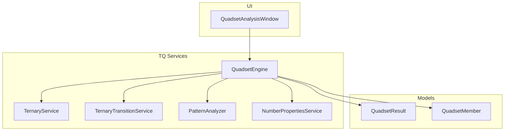
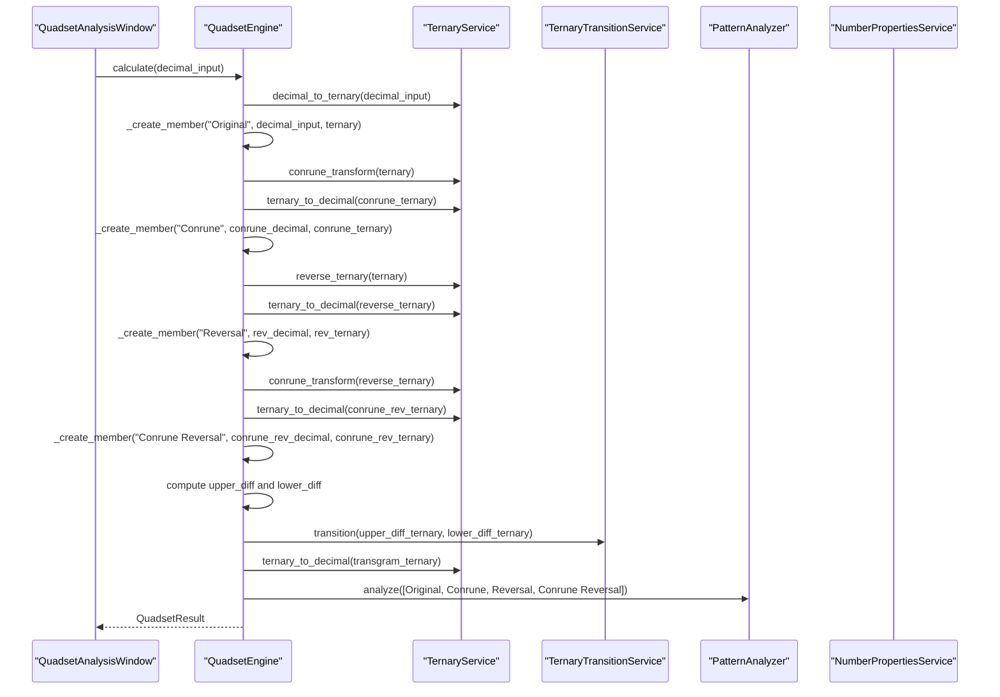
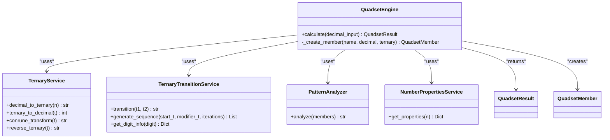
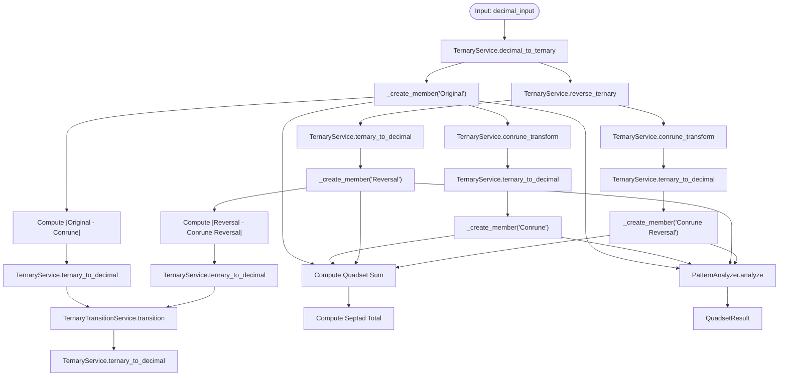

# Quadset Engine

<cite>
**Referenced Files in This Document**
- [quadset_engine.py](file://src/pillars/tq/services/quadset_engine.py)
- [quadset_models.py](file://src/pillars/tq/models/quadset_models.py)
- [ternary_service.py](file://src/pillars/tq/services/ternary_service.py)
- [ternary_transition_service.py](file://src/pillars/tq/services/ternary_transition_service.py)
- [pattern_analyzer.py](file://src/pillars/tq/services/pattern_analyzer.py)
- [number_properties.py](file://src/pillars/tq/services/number_properties.py)
- [quadset_analysis_window.py](file://src/pillars/tq/ui/quadset_analysis_window.py)
</cite>

## Table of Contents
1. [Introduction](#introduction)
2. [Project Structure](#project-structure)
3. [Core Components](#core-components)
4. [Architecture Overview](#architecture-overview)
5. [Detailed Component Analysis](#detailed-component-analysis)
6. [Dependency Analysis](#dependency-analysis)
7. [Performance Considerations](#performance-considerations)
8. [Troubleshooting Guide](#troubleshooting-guide)
9. [Conclusion](#conclusion)
10. [Appendices](#appendices)

## Introduction
This document describes the Quadset Engine, the core analysis engine of the TQ pillar. It orchestrates a full Quadset analysis on a decimal input, producing a structured QuadsetResult that includes Original, Conrune, Reversal, Conrune Reversal, Differentials, Transgram, and Septad Total. The engine integrates with:
- TernaryService for base-3 conversions and transformations
- TernaryTransitionService for transition logic between ternary strings
- PatternAnalyzer for pattern detection across the four main members
It also enriches results with number properties via NumberPropertiesService and exposes a public API for external consumers.

## Project Structure
The Quadset Engine resides under the TQ pillar’s services layer and collaborates with models, UI windows, and supporting services.

**Diagram sources**
- [quadset_engine.py](file://src/pillars/tq/services/quadset_engine.py#L1-L87)
- [quadset_models.py](file://src/pillars/tq/models/quadset_models.py#L1-L41)
- [ternary_service.py](file://src/pillars/tq/services/ternary_service.py#L1-L114)
- [ternary_transition_service.py](file://src/pillars/tq/services/ternary_transition_service.py#L1-L70)
- [pattern_analyzer.py](file://src/pillars/tq/services/pattern_analyzer.py#L1-L163)
- [number_properties.py](file://src/pillars/tq/services/number_properties.py#L1-L230)
- [quadset_analysis_window.py](file://src/pillars/tq/ui/quadset_analysis_window.py#L1-L986)

**Section sources**
- [quadset_engine.py](file://src/pillars/tq/services/quadset_engine.py#L1-L87)
- [quadset_models.py](file://src/pillars/tq/models/quadset_models.py#L1-L41)
- [ternary_service.py](file://src/pillars/tq/services/ternary_service.py#L1-L114)
- [ternary_transition_service.py](file://src/pillars/tq/services/ternary_transition_service.py#L1-L70)
- [pattern_analyzer.py](file://src/pillars/tq/services/pattern_analyzer.py#L1-L163)
- [number_properties.py](file://src/pillars/tq/services/number_properties.py#L1-L230)
- [quadset_analysis_window.py](file://src/pillars/tq/ui/quadset_analysis_window.py#L1-L986)

## Core Components
- QuadsetEngine: Central orchestrator that computes the full Quadset pipeline and returns a QuadsetResult.
- QuadsetResult and QuadsetMember: Data models representing the analysis results and individual members.
- TernaryService: Base-3 conversion and transformations (decimal-to-ternary, ternary-to-decimal, Conrune transform, reverse).
- TernaryTransitionService: Applies transition logic between two ternary strings.
- PatternAnalyzer: Computes statistical and mathematical patterns across the four main members.
- NumberPropertiesService: Provides number-theoretic properties used to enrich QuadsetMember entries.

**Section sources**
- [quadset_engine.py](file://src/pillars/tq/services/quadset_engine.py#L1-L87)
- [quadset_models.py](file://src/pillars/tq/models/quadset_models.py#L1-L41)
- [ternary_service.py](file://src/pillars/tq/services/ternary_service.py#L1-L114)
- [ternary_transition_service.py](file://src/pillars/tq/services/ternary_transition_service.py#L1-L70)
- [pattern_analyzer.py](file://src/pillars/tq/services/pattern_analyzer.py#L1-L163)
- [number_properties.py](file://src/pillars/tq/services/number_properties.py#L1-L230)

## Architecture Overview
The Quadset Engine is a pure service with no external dependencies beyond its collaborators. It composes transformations and aggregations, then delegates pattern analysis and property enrichment. The UI consumes the engine’s output to render results.

**Diagram sources**
- [quadset_engine.py](file://src/pillars/tq/services/quadset_engine.py#L19-L81)
- [ternary_service.py](file://src/pillars/tq/services/ternary_service.py#L65-L114)
- [ternary_transition_service.py](file://src/pillars/tq/services/ternary_transition_service.py#L27-L48)
- [pattern_analyzer.py](file://src/pillars/tq/services/pattern_analyzer.py#L12-L163)
- [number_properties.py](file://src/pillars/tq/services/number_properties.py#L195-L230)
- [quadset_analysis_window.py](file://src/pillars/tq/ui/quadset_analysis_window.py#L948-L986)

## Detailed Component Analysis

### QuadsetEngine.calculate
Public API that orchestrates the full Quadset pipeline:
- Computes Original, Conrune, Reversal, Conrune Reversal members
- Calculates Differentials (upper and lower)
- Produces Transgram via transition logic and converts back to decimal
- Computes Quadset Sum and Septad Total
- Runs PatternAnalyzer over the four main members
- Returns a QuadsetResult populated with all fields

Key behaviors:
- Uses TernaryService for conversions and transformations
- Uses TernaryTransitionService for Transgram computation
- Uses PatternAnalyzer for pattern summary
- Enriches each member with NumberPropertiesService

**Section sources**
- [quadset_engine.py](file://src/pillars/tq/services/quadset_engine.py#L19-L81)

### _create_member helper
Internal helper that enriches a QuadsetMember with computed properties:
- Calls NumberPropertiesService.get_properties on the decimal value
- Returns a QuadsetMember with name, decimal, ternary, and properties

**Section sources**
- [quadset_engine.py](file://src/pillars/tq/services/quadset_engine.py#L83-L87)
- [number_properties.py](file://src/pillars/tq/services/number_properties.py#L195-L230)

### Data Models: QuadsetMember and QuadsetResult
- QuadsetMember: Holds name, decimal, ternary, and properties
- QuadsetResult: Aggregates all members, differentials, transgram, totals, and pattern summary; includes a convenience members property for the four main members

**Section sources**
- [quadset_models.py](file://src/pillars/tq/models/quadset_models.py#L8-L41)

### TernaryService
Provides:
- decimal_to_ternary
- ternary_to_decimal
- conrune_transform (maps 0->0, 1->2, 2->1)
- reverse_ternary

Error handling:
- Validates ternary strings for conversion and raises ValueError for invalid characters

**Section sources**
- [ternary_service.py](file://src/pillars/tq/services/ternary_service.py#L1-L114)

### TernaryTransitionService
Implements transition logic between two ternary strings:
- Pads shorter strings with leading zeros
- Applies a deterministic map for each digit pair
- Exposes helper to generate transition sequences and to get digit philosophy info

**Section sources**
- [ternary_transition_service.py](file://src/pillars/tq/services/ternary_transition_service.py#L1-L70)

### PatternAnalyzer
Analyzes the four main QuadsetMember entries and produces a formatted report covering:
- LCM/GCD of decimals
- Parity counts
- Shared divisor
- Prime presence and density
- Factor counts
- Abundance status
- Digit sums and digital roots
- Decimal and ternary palindromes
- Arithmetic/geometric progressions
- Modular congruences
- Ternary digit frequencies

**Section sources**
- [pattern_analyzer.py](file://src/pillars/tq/services/pattern_analyzer.py#L1-L163)

### UI Integration: QuadsetAnalysisWindow
- Instantiates QuadsetEngine
- On input change, parses integer and calls engine.calculate
- Renders results across overview, detail, advanced, and gematria tabs
- Populates property cards with enriched number properties

**Section sources**
- [quadset_analysis_window.py](file://src/pillars/tq/ui/quadset_analysis_window.py#L175-L986)

## Dependency Analysis
The Quadset Engine depends on:
- TernaryService for base-3 conversions and transformations
- TernaryTransitionService for Transgram computation
- PatternAnalyzer for pattern detection
- NumberPropertiesService for member enrichment

**Diagram sources**
- [quadset_engine.py](file://src/pillars/tq/services/quadset_engine.py#L1-L87)
- [ternary_service.py](file://src/pillars/tq/services/ternary_service.py#L1-L114)
- [ternary_transition_service.py](file://src/pillars/tq/services/ternary_transition_service.py#L1-L70)
- [pattern_analyzer.py](file://src/pillars/tq/services/pattern_analyzer.py#L1-L163)
- [number_properties.py](file://src/pillars/tq/services/number_properties.py#L195-L230)
- [quadset_models.py](file://src/pillars/tq/models/quadset_models.py#L8-L41)

**Section sources**
- [quadset_engine.py](file://src/pillars/tq/services/quadset_engine.py#L1-L87)

## Performance Considerations
- NumberPropertiesService.get_prime_ordinal uses a sieve up to n; for very large inputs, this can become expensive. The service returns a sentinel value for inputs above a threshold to avoid heavy computation.
- PatternAnalyzer performs multiple passes over lists and uses factorization and property lookups; typical gematria usage stays below large thresholds.
- QuadsetEngine performs a fixed number of arithmetic and string operations per call; complexity is linear in the size of the ternary representation for conversions and transitions.
- Batch processing: The engine is stateless and can be invoked concurrently. For high-throughput scenarios, consider pooling QuadsetEngine instances or using thread pools to parallelize calls.

[No sources needed since this section provides general guidance]

## Troubleshooting Guide
Common issues and resolutions:
- Invalid ternary string during conversion: TernaryService.ternary_to_decimal raises ValueError for invalid characters. Ensure inputs are valid ternary strings or sanitize before conversion.
- Empty or malformed inputs in UI: QuadsetAnalysisWindow catches ValueError and ignores incomplete input; ensure the input field contains a valid integer.
- Large prime ordinal computations: NumberPropertiesService.get_prime_ordinal caps computation for very large n; expect a sentinel value indicating the ordinal could not be computed quickly.
- PatternAnalyzer edge cases: Zero values are handled explicitly in several analyzers (e.g., factor counts, geometric progression); confirm expectations for zero inputs.

**Section sources**
- [ternary_service.py](file://src/pillars/tq/services/ternary_service.py#L35-L63)
- [quadset_analysis_window.py](file://src/pillars/tq/ui/quadset_analysis_window.py#L948-L961)
- [number_properties.py](file://src/pillars/tq/services/number_properties.py#L95-L126)
- [pattern_analyzer.py](file://src/pillars/tq/services/pattern_analyzer.py#L114-L124)

## Conclusion
The Quadset Engine is a focused, composable service that transforms a decimal input into a comprehensive Quadset analysis. It integrates cleanly with TernaryService, TernaryTransitionService, PatternAnalyzer, and NumberPropertiesService, returning a rich, structured result suitable for both programmatic consumption and UI rendering. Its design supports scalability and safe concurrent usage.

[No sources needed since this section summarizes without analyzing specific files]

## Appendices

### API Definition: QuadsetEngine.calculate
- Purpose: Perform a full Quadset analysis on a decimal number
- Input: decimal_input (int)
- Output: QuadsetResult
- Behavior:
  - Computes Original, Conrune, Reversal, Conrune Reversal
  - Computes Upper Diff and Lower Diff
  - Computes Transgram via transition and converts to decimal
  - Computes Quadset Sum and Septad Total
  - Runs PatternAnalyzer over the four main members
  - Enriches members with number properties

**Section sources**
- [quadset_engine.py](file://src/pillars/tq/services/quadset_engine.py#L19-L81)

### Data Flow Diagram

**Diagram sources**
- [quadset_engine.py](file://src/pillars/tq/services/quadset_engine.py#L19-L81)
- [ternary_service.py](file://src/pillars/tq/services/ternary_service.py#L65-L114)
- [ternary_transition_service.py](file://src/pillars/tq/services/ternary_transition_service.py#L27-L48)
- [pattern_analyzer.py](file://src/pillars/tq/services/pattern_analyzer.py#L12-L163)

### Usage Examples
- Analyze a single number:
  - Call QuadsetEngine.calculate with an integer
  - Receive QuadsetResult and render via QuadsetAnalysisWindow
- Analyze numerical sequences:
  - Iterate over a list of integers and call calculate for each
  - Aggregate QuadsetResult fields (e.g., quadset_sum, septad_total) as needed
- Thread safety:
  - QuadsetEngine is stateless; safe for concurrent use
  - UI updates should marshal to the UI thread if invoked from background threads

**Section sources**
- [quadset_analysis_window.py](file://src/pillars/tq/ui/quadset_analysis_window.py#L948-L986)
- [quadset_engine.py](file://src/pillars/tq/services/quadset_engine.py#L19-L81)