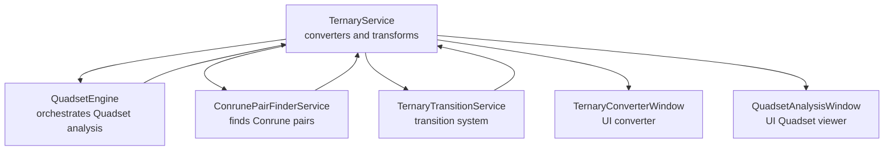
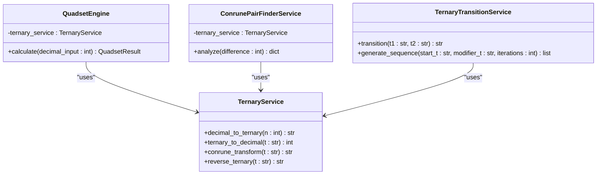
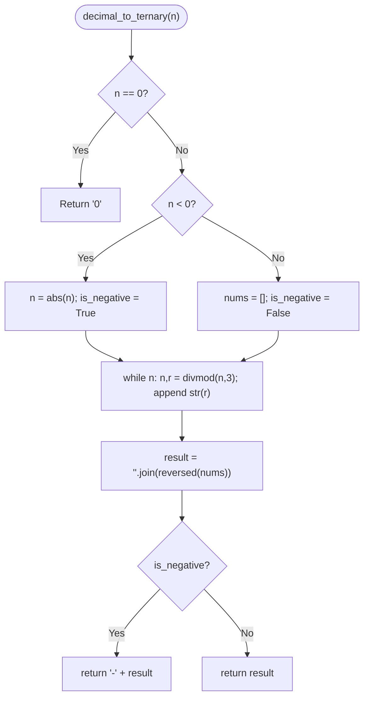
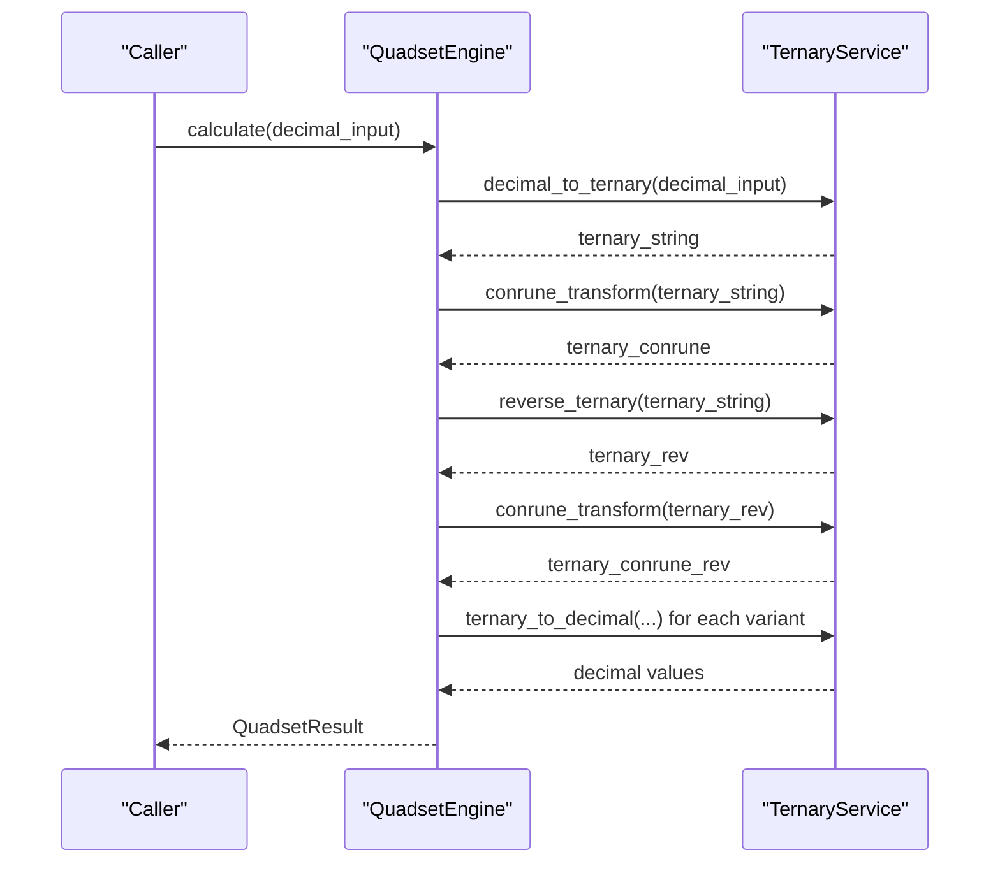
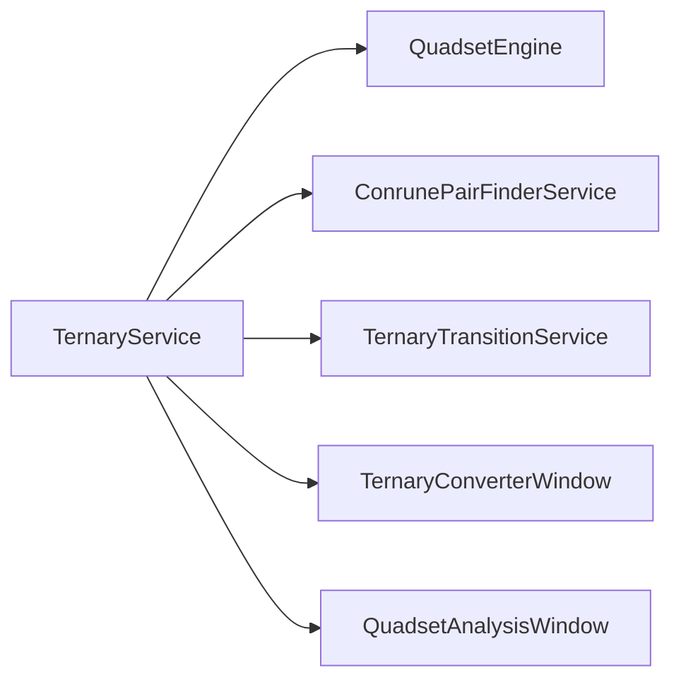

# Ternary Service

<cite>
**Referenced Files in This Document**
- [ternary_service.py](file://src/pillars/tq/services/ternary_service.py)
- [quadset_engine.py](file://src/pillars/tq/services/quadset_engine.py)
- [conrune_pair_finder_service.py](file://src/pillars/tq/services/conrune_pair_finder_service.py)
- [ternary_transition_service.py](file://src/pillars/tq/services/ternary_transition_service.py)
- [ternary_converter_window.py](file://src/pillars/tq/ui/ternary_converter_window.py)
- [quadset_analysis_window.py](file://src/pillars/tq/ui/quadset_analysis_window.py)
</cite>

## Table of Contents
1. [Introduction](#introduction)
2. [Project Structure](#project-structure)
3. [Core Components](#core-components)
4. [Architecture Overview](#architecture-overview)
5. [Detailed Component Analysis](#detailed-component-analysis)
6. [Dependency Analysis](#dependency-analysis)
7. [Performance Considerations](#performance-considerations)
8. [Troubleshooting Guide](#troubleshooting-guide)
9. [Conclusion](#conclusion)
10. [Appendices](#appendices)

## Introduction
This document provides API documentation for the TernaryService, the foundational utility for base-3 number operations in the project. It covers:
- Converting integers to ternary strings (including negative number handling)
- Converting ternary strings back to integers with input validation
- Applying the Conrune transformation rule (0→0, 1→2, 2→1)
- Reversing ternary strings while preserving sign
It also explains the internal algorithms, error handling, performance characteristics, and the service’s critical role as a dependency for higher-level TQ operations such as Quadset analysis and geometric transitions.

## Project Structure
The TernaryService resides in the TQ pillar and is consumed by multiple services and UI components:
- Services: QuadsetEngine, ConrunePairFinderService, TernaryTransitionService
- UI: TernaryConverterWindow, QuadsetAnalysisWindow

**Diagram sources**
- [ternary_service.py](file://src/pillars/tq/services/ternary_service.py#L1-L114)
- [quadset_engine.py](file://src/pillars/tq/services/quadset_engine.py#L1-L87)
- [conrune_pair_finder_service.py](file://src/pillars/tq/services/conrune_pair_finder_service.py#L1-L82)
- [ternary_transition_service.py](file://src/pillars/tq/services/ternary_transition_service.py#L1-L68)
- [ternary_converter_window.py](file://src/pillars/tq/ui/ternary_converter_window.py#L1-L154)
- [quadset_analysis_window.py](file://src/pillars/tq/ui/quadset_analysis_window.py#L540-L570)

**Section sources**
- [ternary_service.py](file://src/pillars/tq/services/ternary_service.py#L1-L114)
- [quadset_engine.py](file://src/pillars/tq/services/quadset_engine.py#L1-L87)
- [conrune_pair_finder_service.py](file://src/pillars/tq/services/conrune_pair_finder_service.py#L1-L82)
- [ternary_transition_service.py](file://src/pillars/tq/services/ternary_transition_service.py#L1-L68)
- [ternary_converter_window.py](file://src/pillars/tq/ui/ternary_converter_window.py#L1-L154)
- [quadset_analysis_window.py](file://src/pillars/tq/ui/quadset_analysis_window.py#L540-L570)

## Core Components
- TernaryService: Static methods for decimal-to-ternary conversion, ternary-to-decimal conversion, Conrune transformation, and ternary reversal.
- QuadsetEngine: Orchestrates Quadset analysis using TernaryService.
- ConrunePairFinderService: Uses TernaryService to compute Conrune pairs.
- TernaryTransitionService: Uses TernaryService for transition operations.
- UI windows: TernaryConverterWindow and QuadsetAnalysisWindow consume TernaryService for user-facing operations.

**Section sources**
- [ternary_service.py](file://src/pillars/tq/services/ternary_service.py#L1-L114)
- [quadset_engine.py](file://src/pillars/tq/services/quadset_engine.py#L1-L87)
- [conrune_pair_finder_service.py](file://src/pillars/tq/services/conrune_pair_finder_service.py#L1-L82)
- [ternary_transition_service.py](file://src/pillars/tq/services/ternary_transition_service.py#L1-L68)
- [ternary_converter_window.py](file://src/pillars/tq/ui/ternary_converter_window.py#L1-L154)
- [quadset_analysis_window.py](file://src/pillars/tq/ui/quadset_analysis_window.py#L540-L570)

## Architecture Overview
The TernaryService is a pure utility layer that exposes static methods. Higher-level services depend on it to perform number-theoretic transformations and validations.

**Diagram sources**
- [ternary_service.py](file://src/pillars/tq/services/ternary_service.py#L1-L114)
- [quadset_engine.py](file://src/pillars/tq/services/quadset_engine.py#L1-L87)
- [conrune_pair_finder_service.py](file://src/pillars/tq/services/conrune_pair_finder_service.py#L1-L82)
- [ternary_transition_service.py](file://src/pillars/tq/services/ternary_transition_service.py#L1-L68)

## Detailed Component Analysis

### TernaryService API
- decimal_to_ternary(n: int) -> str
  - Converts an integer to its base-3 representation as a string.
  - Handles zero and negative inputs.
  - Internal algorithm: repeated division by 3 using divmod, collects remainders, reverses collected digits, and prepends a minus sign for negatives.
  - Complexity: O(log_3 |n|) time, O(log_3 |n|) space.
- ternary_to_decimal(t: str) -> int
  - Converts a base-3 string to an integer.
  - Validates that the string contains only characters 0, 1, 2.
  - Supports negative inputs by stripping a leading minus sign before conversion.
  - Raises ValueError for invalid inputs.
  - Complexity: O(k) where k is the length of the string.
- conrune_transform(t: str) -> str
  - Applies the Conrune mapping: 0→0, 1→2, 2→1.
  - Preserves a leading minus sign.
  - Complexity: O(k) time, O(k) space.
- reverse_ternary(t: str) -> str
  - Reverses the ternary string while preserving the sign.
  - Complexity: O(k) time, O(k) space.

**Diagram sources**
- [ternary_service.py](file://src/pillars/tq/services/ternary_service.py#L6-L31)

**Section sources**
- [ternary_service.py](file://src/pillars/tq/services/ternary_service.py#L6-L114)

### Example Workflows

#### Converting 42 to ternary
- Steps:
  - Call decimal_to_ternary(42).
  - Internally computes remainders via repeated divmod by 3.
  - Builds the string from least significant to most significant digit.
  - Returns the ternary representation.
- Expected result: a base-3 string representing 42.

**Section sources**
- [ternary_service.py](file://src/pillars/tq/services/ternary_service.py#L6-L31)

#### Transforming '1201' via Conrune
- Steps:
  - Call conrune_transform("1201").
  - Mapping: 0→0, 1→2, 2→1.
  - Produces "2102".
- Negative inputs: If the input were "-1201", the result would be "-2102".

**Section sources**
- [ternary_service.py](file://src/pillars/tq/services/ternary_service.py#L64-L89)

#### Reversing '210'
- Steps:
  - Call reverse_ternary("210").
  - Produces "012".
- Negative inputs: If the input were "-210", the result would be "-012".

**Section sources**
- [ternary_service.py](file://src/pillars/tq/services/ternary_service.py#L91-L114)

### Integration Points and Higher-Level Usage

#### Quadset analysis
- QuadsetEngine uses TernaryService to:
  - Convert the input decimal to ternary
  - Compute Conrune, Reversal, and Conrune-Reversal variants
  - Convert back to decimal for downstream analysis
- The engine orchestrates these steps and feeds results into pattern analysis and transition computations.

**Diagram sources**
- [quadset_engine.py](file://src/pillars/tq/services/quadset_engine.py#L19-L81)
- [ternary_service.py](file://src/pillars/tq/services/ternary_service.py#L6-L114)

**Section sources**
- [quadset_engine.py](file://src/pillars/tq/services/quadset_engine.py#L19-L81)
- [quadset_analysis_window.py](file://src/pillars/tq/ui/quadset_analysis_window.py#L540-L570)

#### Conrune pair computation
- ConrunePairFinderService constructs balanced ternary representations and converts them to standard ternary using TernaryService, then applies conrune_transform and validates differences.

**Section sources**
- [conrune_pair_finder_service.py](file://src/pillars/tq/services/conrune_pair_finder_service.py#L1-L82)
- [ternary_service.py](file://src/pillars/tq/services/ternary_service.py#L64-L89)

#### Transition system
- TernaryTransitionService uses TernaryService for conversions and validation during transition sequences.

**Section sources**
- [ternary_transition_service.py](file://src/pillars/tq/services/ternary_transition_service.py#L1-L68)
- [ternary_service.py](file://src/pillars/tq/services/ternary_service.py#L34-L63)

## Dependency Analysis
- TernaryService is a pure utility with no external dependencies.
- QuadsetEngine depends on TernaryService, TernaryTransitionService, and NumberPropertiesService.
- ConrunePairFinderService depends on TernaryService.
- UI components depend on TernaryService for live conversions.

**Diagram sources**
- [ternary_service.py](file://src/pillars/tq/services/ternary_service.py#L1-L114)
- [quadset_engine.py](file://src/pillars/tq/services/quadset_engine.py#L1-L87)
- [conrune_pair_finder_service.py](file://src/pillars/tq/services/conrune_pair_finder_service.py#L1-L82)
- [ternary_transition_service.py](file://src/pillars/tq/services/ternary_transition_service.py#L1-L68)
- [ternary_converter_window.py](file://src/pillars/tq/ui/ternary_converter_window.py#L1-L154)
- [quadset_analysis_window.py](file://src/pillars/tq/ui/quadset_analysis_window.py#L540-L570)

**Section sources**
- [quadset_engine.py](file://src/pillars/tq/services/quadset_engine.py#L1-L87)
- [conrune_pair_finder_service.py](file://src/pillars/tq/services/conrune_pair_finder_service.py#L1-L82)
- [ternary_transition_service.py](file://src/pillars/tq/services/ternary_transition_service.py#L1-L68)
- [ternary_converter_window.py](file://src/pillars/tq/ui/ternary_converter_window.py#L1-L154)
- [quadset_analysis_window.py](file://src/pillars/tq/ui/quadset_analysis_window.py#L540-L570)

## Performance Considerations
- decimal_to_ternary: O(log_3 |n|) time and space due to digit extraction and reversal.
- ternary_to_decimal: O(k) time where k is the length of the ternary string; uses base-3 parsing.
- conrune_transform: O(k) time due to character-by-character mapping.
- reverse_ternary: O(k) time due to string slicing and concatenation.
- Error handling is constant-time checks and raises exceptions early, avoiding unnecessary work.

[No sources needed since this section provides general guidance]

## Troubleshooting Guide
- Invalid ternary strings:
  - ternary_to_decimal raises ValueError if the input contains characters outside {0, 1, 2}.
  - UI components display user-friendly messages for invalid inputs.
- Negative numbers:
  - All methods preserve the sign consistently. Ensure inputs with leading minus signs are handled by stripping the sign before operations when appropriate.
- Zero handling:
  - decimal_to_ternary returns "0" for input 0.
  - ternary_to_decimal returns 0 for empty input.

**Section sources**
- [ternary_service.py](file://src/pillars/tq/services/ternary_service.py#L34-L63)
- [ternary_converter_window.py](file://src/pillars/tq/ui/ternary_converter_window.py#L100-L148)

## Conclusion
The TernaryService provides a compact, efficient, and robust foundation for base-3 arithmetic and transformations. Its clean API enables higher-level services like QuadsetEngine and ConrunePairFinderService to build complex analyses and transitions reliably. The documented algorithms, error handling, and performance characteristics support safe and predictable usage across the system.

[No sources needed since this section summarizes without analyzing specific files]

## Appendices

### API Reference

- decimal_to_ternary(n: int) -> str
  - Converts an integer to its base-3 representation.
  - Handles zero and negative inputs.
  - Complexity: O(log_3 |n|).
- ternary_to_decimal(t: str) -> int
  - Converts a base-3 string to an integer.
  - Validates characters {0, 1, 2}; raises ValueError otherwise.
  - Complexity: O(k).
- conrune_transform(t: str) -> str
  - Applies mapping 0→0, 1→2, 2→1.
  - Preserves leading minus sign.
  - Complexity: O(k).
- reverse_ternary(t: str) -> str
  - Reverses the ternary string while preserving sign.
  - Complexity: O(k).

**Section sources**
- [ternary_service.py](file://src/pillars/tq/services/ternary_service.py#L6-L114)