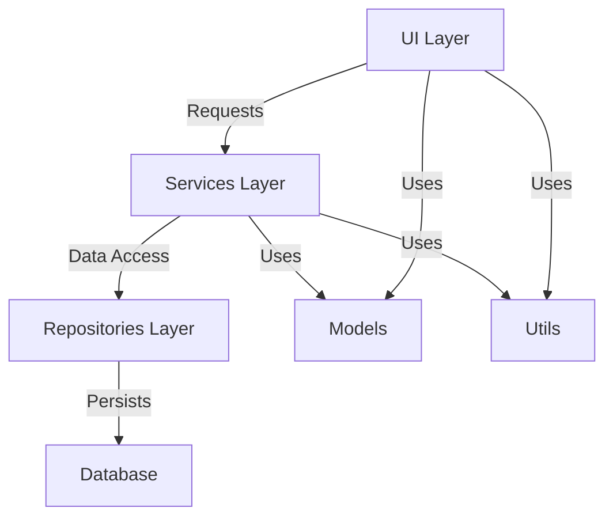
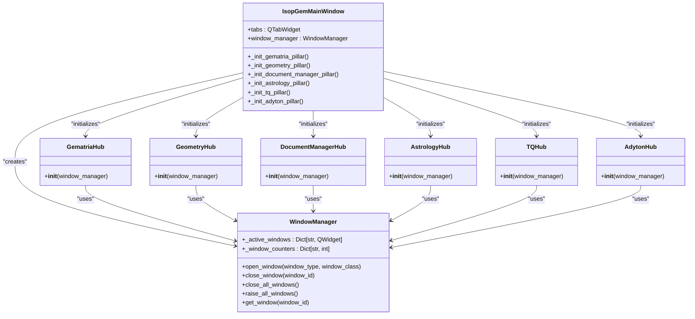
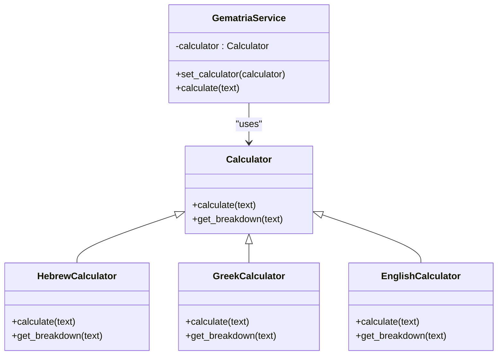

# Architecture Overview

<cite>
**Referenced Files in This Document**   
- [main.py](file://src/main.py)
- [ARCHITECTURE.md](file://config/ARCHITECTURE.md)
- [architectural_doctrine.md](file://Docs/architecture/architectural_doctrine.md)
- [window_manager.py](file://src/shared/ui/window_manager.py)
- [database.py](file://src/shared/database.py)
- [theme.py](file://src/shared/ui/theme.py)
- [GematriaHub](file://src/pillars/gematria/ui/adyton_hub.py)
- [GeometryHub](file://src/pillars/geometry/ui/geometry_hub.py)
- [DocumentManagerHub](file://src/pillars/document_manager/ui/document_manager_hub.py)
- [AstrologyHub](file://src/pillars/astrology/ui/astrology_hub.py)
- [TQHub](file://src/pillars/tq/ui/tq_hub.py)
- [AdytonHub](file://src/pillars/adyton/ui/adyton_hub.py)
</cite>

## Table of Contents
1. [Introduction](#introduction)
2. [Pillar-Based Architecture](#pillar-based-architecture)
3. [Pillar Internal Structure](#pillar-internal-structure)
4. [System Context and Window Management](#system-context-and-window-management)
5. [Cross-Cutting Concerns](#cross-cutting-concerns)
6. [Architectural Patterns](#architectural-patterns)
7. [Technical Decisions and Trade-offs](#technical-decisions-and-trade-offs)
8. [Extensibility and New Pillar Integration](#extensibility-and-new-pillar-integration)
9. [Conclusion](#conclusion)

## Introduction

The isopgem application implements a domain-driven, pillar-based architecture designed for esoteric analysis across multiple disciplines. The system is structured around six main pillars: Gematria, Geometry, Document Manager, Astrology, TQ (Trigrammaton QBLH), and Adyton. Each pillar represents a distinct domain of knowledge and analysis, while sharing a consistent internal structure and integration pattern with the core application framework. This documentation provides a comprehensive overview of the architectural principles, component interactions, and design patterns that govern the system.

**Section sources**
- [ARCHITECTURE.md](file://config/ARCHITECTURE.md#L1-L51)
- [architectural_doctrine.md](file://Docs/architecture/architectural_doctrine.md#L1-L88)

## Pillar-Based Architecture

The isopgem application follows a modular pillar-based architecture where each major domain of functionality is encapsulated within its own pillar. This approach provides clear separation of concerns while enabling consistent patterns across domains. The six main pillars are:

- **Gematria**: Hebrew, Greek, and English numerical analysis tools
- **Geometry**: Sacred geometry visualization and calculation tools
- **Document Manager**: Analysis and organization of texts and documents
- **Astrology**: Cosmic calendar and zodiacal mappings
- **TQ (Trigrammaton QBLH)**: Integration and pattern analysis
- **Adyton**: 3D sacred geometry and spatial analysis

Each pillar operates as an independent module with its own UI, services, models, repositories, and utilities, while integrating with the central application through standardized interfaces. This architecture enables focused development within each domain while maintaining system-wide consistency.

```mermaid
graph TD
A[Main Application] --> B[Gematria Pillar]
A --> C[Geometry Pillar]
A --> D[Document Manager Pillar]
A --> E[Astrology Pillar]
A --> F[TQ Pillar]
A --> G[Adyton Pillar]
B --> H[UI Components]
B --> I[Services]
B --> J[Models]
B --> K[Repositories]
B --> L[Utils]
C --> M[UI Components]
C --> N[Services]
C --> O[Models]
C --> P[Repositories]
C --> Q[Utils]
D --> R[UI Components]
D --> S[Services]
D --> T[Models]
D --> U[Repositories]
D --> V[Utils]
E --> W[UI Components]
E --> X[Services]
E --> Y[Models]
E --> Z[Repositories]
E --> AA[Utils]
F --> AB[UI Components]
F --> AC[Services]
F --> AD[Models]
F --> AE[Repositories]
F --> AF[Utils]
G --> AG[UI Components]
G --> AH[Services]
G --> AI[Models]
G --> AJ[Repositories]
G --> AK[Utils]
```



**Diagram sources**
- [ARCHITECTURE.md](file://config/ARCHITECTURE.md#L32-L43)
- [architectural_doctrine.md](file://Docs/architecture/architectural_doctrine.md#L35-L40)

**Section sources**
- [ARCHITECTURE.md](file://config/ARCHITECTURE.md#L7-L31)
- [architectural_doctrine.md](file://Docs/architecture/architectural_doctrine.md#L35-L40)

## Pillar Internal Structure

Each pillar follows a consistent internal structure that enforces separation of concerns and promotes maintainability. The standard structure includes five main directories:

```
pillar/
├── ui/              # PyQt6-based interface components
├── services/        # Business logic and core functionality
├── models/          # Data structures and type definitions
├── repositories/    # Data access and persistence
└── utils/           # Helper functions and utilities
```

This structure implements a layered architecture within each pillar:

- **Presentation Layer (UI)**: Handles user interface rendering and input events
- **Business Logic Layer (Services)**: Contains the core domain logic and processing
- **Persistence Layer (Repositories)**: Manages data storage and retrieval
- **Data Layer (Models)**: Defines the data structures and entities
- **Utility Layer (Utils)**: Provides shared helper functions

The architecture strictly enforces the principle that UI components should not contain business logic ("The View shall not Calculate"), ensuring that all complex processing occurs in the services layer.



**Diagram sources**
- [ARCHITECTURE.md](file://config/ARCHITECTURE.md#L36-L43)
- [architectural_doctrine.md](file://Docs/architecture/architectural_doctrine.md#L61-L69)

**Section sources**
- [ARCHITECTURE.md](file://config/ARCHITECTURE.md#L32-L43)
- [architectural_doctrine.md](file://Docs/architecture/architectural_doctrine.md#L61-L69)

## System Context and Window Management

The isopgem application is built on a centralized window management system that coordinates the lifecycle of all UI components. The main application window serves as the central hub, containing tabs for each pillar that provide access to their respective functionality.

The `WindowManager` class in the shared UI components manages all tool windows across the application, handling their creation, positioning, and lifecycle. This ensures consistent behavior across all pillars and prevents window management code from being duplicated. The window manager supports both single-instance and multiple-instance window types, with appropriate tracking and cleanup mechanisms.

The main window initializes all pillar hubs during startup and coordinates their integration through the tabbed interface. When a user switches between pillars, the window manager raises all associated tool windows to maintain context.



**Diagram sources**
- [main.py](file://src/main.py#L26-L111)
- [window_manager.py](file://src/shared/ui/window_manager.py#L15-L221)

**Section sources**
- [main.py](file://src/main.py#L1-L156)
- [window_manager.py](file://src/shared/ui/window_manager.py#L1-L221)

## Cross-Cutting Concerns

The isopgem architecture addresses several cross-cutting concerns through shared components and standardized patterns.

### Configuration Management
Configuration is managed through a combination of environment variables, configuration files, and runtime settings. The architecture doctrine establishes clear guidelines for where configuration should be stored and accessed, ensuring consistency across pillars.

### Database Initialization
The application uses SQLAlchemy for database persistence, with a centralized initialization process in the shared database module. The `init_db()` function creates all necessary tables and ensures the database schema is properly initialized before any pillar attempts to access it.

### Shared UI Components
The `shared/ui` directory contains common UI widgets and utilities used across multiple pillars, including:
- Theme and styling system
- Virtual keyboard for esoteric character input
- Window management framework
- Standardized UI components

These shared components ensure visual and behavioral consistency throughout the application while reducing code duplication.

```mermaid
graph TD
A[Configuration] --> B[Environment Variables]
A --> C[Configuration Files]
A --> D[Runtime Settings]
E[Database] --> F[SQLAlchemy]
E --> G[init_db()]
E --> H[Session Management]
I[Shared UI] --> J[Theme System]
I --> K[Virtual Keyboard]
I --> L[Window Manager]
I --> M[Common Widgets]
N[Main Application] --> A
N --> E
N --> I
```

**Diagram sources**
- [database.py](file://src/shared/database.py#L1-L53)
- [theme.py](file://src/shared/ui/theme.py#L1-L372)
- [virtual_keyboard.py](file://src/shared/ui/virtual_keyboard.py#L1-L379)

**Section sources**
- [database.py](file://src/shared/database.py#L1-L53)
- [theme.py](file://src/shared/ui/theme.py#L1-L372)
- [virtual_keyboard.py](file://src/shared/ui/virtual_keyboard.py#L1-L379)

## Architectural Patterns

The isopgem application implements several key architectural patterns to support its complex functionality.

### Strategy Pattern in Gematria
The Gematria pillar uses the Strategy pattern to support multiple calculation systems (Hebrew, Greek, English). Different calculator implementations can be selected at runtime, allowing users to switch between systems without changing the core UI or service logic.

### Scene Graph in Adyton
The Adyton pillar implements a scene graph architecture for 3D sacred geometry visualization. This hierarchical structure allows complex geometric compositions to be built from simpler components, with transformations and properties inherited through the hierarchy.

### Hub-and-Spoke Pattern
Each pillar follows a hub-and-spoke pattern, with a central hub component that provides access to all functionality within that domain. The hub serves as the entry point for the pillar and coordinates communication between its various components.

### Dependency Injection
The architecture uses dependency injection to provide services and utilities to UI components, particularly through the window manager which is passed to each pillar hub during initialization. This promotes loose coupling and makes components easier to test.



**Diagram sources**
- [architectural_doctrine.md](file://Docs/architecture/architectural_doctrine.md#L41-L42)
- [main.py](file://src/main.py#L18-L23)

**Section sources**
- [architectural_doctrine.md](file://Docs/architecture/architectural_doctrine.md#L41-L42)
- [main.py](file://src/main.py#L18-L23)

## Technical Decisions and Trade-offs

The isopgem architecture reflects several important technical decisions and trade-offs:

### PyQt6 vs Web Frameworks
The decision to use PyQt6 for the UI rather than a web framework enables rich desktop functionality and better performance for complex visualizations, at the cost of platform specificity and deployment complexity.

### SQLite vs Client-Server Databases
SQLite was chosen for its simplicity and zero-configuration deployment, making the application easy to distribute and use. This trades off some scalability and concurrent access capabilities for ease of use.

### Monolithic vs Microservices
The pillar-based architecture represents a middle ground between monolithic and microservices approaches. While all pillars run in the same process, they are loosely coupled and can be developed independently, balancing development agility with deployment simplicity.

### Python vs Compiled Languages
Python was selected for its rich ecosystem of scientific and mathematical libraries, rapid development cycle, and accessibility to domain experts. This trades off some performance and type safety for development speed and domain alignment.

## Extensibility and New Pillar Integration

The architecture is designed to support the addition of new pillars following established patterns. To add a new pillar:

1. Create a new directory under `src/pillars/` with the pillar name
2. Implement the standard structure with ui, services, models, repositories, and utils directories
3. Create a hub component that inherits from the base hub pattern
4. Register the pillar in the main application window
5. Add documentation following the architectural doctrine

The consistent structure and clear separation of concerns make it straightforward to add new domains of analysis while maintaining system integrity.

## Conclusion

The isopgem application's architecture successfully balances domain specialization with system-wide consistency. The pillar-based approach allows each domain of esoteric analysis to develop its own specialized tools and interfaces, while the shared infrastructure ensures a cohesive user experience and maintainable codebase. The strict separation of concerns, standardized patterns, and comprehensive documentation make the system both powerful and extensible, providing a solid foundation for continued development and expansion.