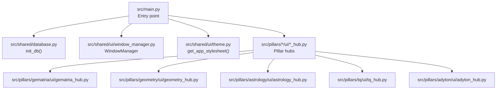
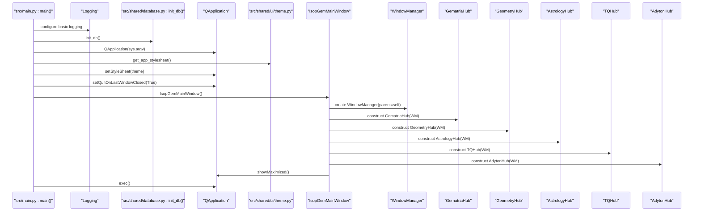
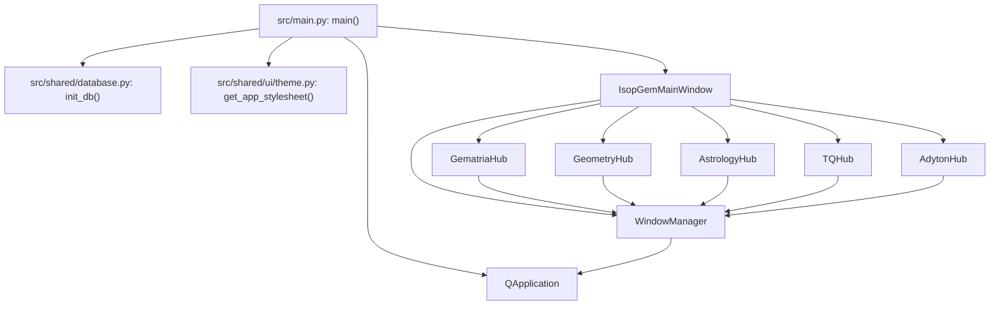

# Application Initialization Sequence

<cite>
**Referenced Files in This Document**
- [src/main.py](file://src/main.py)
- [src/shared/database.py](file://src/shared/database.py)
- [src/shared/ui/window_manager.py](file://src/shared/ui/window_manager.py)
- [src/shared/ui/theme.py](file://src/shared/ui/theme.py)
- [src/ui/main_window.py](file://src/ui/main_window.py)
- [src/pillars/gematria/ui/gematria_hub.py](file://src/pillars/gematria/ui/gematria_hub.py)
- [src/pillars/geometry/ui/geometry_hub.py](file://src/pillars/geometry/ui/geometry_hub.py)
- [src/pillars/astrology/ui/astrology_hub.py](file://src/pillars/astrology/ui/astrology_hub.py)
- [src/pillars/tq/ui/tq_hub.py](file://src/pillars/tq/ui/tq_hub.py)
- [src/pillars/adyton/ui/adyton_hub.py](file://src/pillars/adyton/ui/adyton_hub.py)
- [README.md](file://README.md)
- [run.sh](file://run.sh)
</cite>

## Table of Contents
1. [Introduction](#introduction)
2. [Project Structure](#project-structure)
3. [Core Components](#core-components)
4. [Architecture Overview](#architecture-overview)
5. [Detailed Component Analysis](#detailed-component-analysis)
6. [Dependency Analysis](#dependency-analysis)
7. [Performance Considerations](#performance-considerations)
8. [Troubleshooting Guide](#troubleshooting-guide)
9. [Conclusion](#conclusion)

## Introduction
This document explains the application initialization sequence for the isopgem application, starting from the main entry point. It covers logging configuration, database initialization, QApplication setup, the instantiation and configuration of the main window with a tabbed interface, the centralized WindowManager, and the initialization of each pillar’s hub. It also highlights the importance of the QT_QPA_PLATFORM environment variable for platform stability and provides debugging tips for common initialization issues.

## Project Structure
The initialization flow spans several modules:
- Entry point and main window: src/main.py
- Database initialization: src/shared/database.py
- Centralized window management: src/shared/ui/window_manager.py
- Theme and styling: src/shared/ui/theme.py
- Example standalone UI (not part of the main window): src/ui/main_window.py
- Per-pillar hub widgets: src/pillars/*/ui/*_hub.py

**Diagram sources**
- [src/main.py](file://src/main.py#L113-L156)
- [src/shared/database.py](file://src/shared/database.py#L25-L30)
- [src/shared/ui/window_manager.py](file://src/shared/ui/window_manager.py#L15-L28)
- [src/shared/ui/theme.py](file://src/shared/ui/theme.py#L39-L120)
- [src/pillars/gematria/ui/gematria_hub.py](file://src/pillars/gematria/ui/gematria_hub.py#L49-L62)
- [src/pillars/geometry/ui/geometry_hub.py](file://src/pillars/geometry/ui/geometry_hub.py#L1-L20)
- [src/pillars/astrology/ui/astrology_hub.py](file://src/pillars/astrology/ui/astrology_hub.py#L13-L26)
- [src/pillars/tq/ui/tq_hub.py](file://src/pillars/tq/ui/tq_hub.py#L17-L30)
- [src/pillars/adyton/ui/adyton_hub.py](file://src/pillars/adyton/ui/adyton_hub.py#L8-L21)

**Section sources**
- [src/main.py](file://src/main.py#L113-L156)
- [README.md](file://README.md#L79-L93)

## Core Components
- Logging configuration: Basic logging is configured at application start.
- Database initialization: The database engine and tables are created via init_db().
- QApplication setup: The Qt application is created, themed, and configured for graceful shutdown.
- IsopGemMainWindow: The main window initializes a central tabbed interface and creates the WindowManager.
- WindowManager: Centralized lifecycle management for tool windows across pillars.
- Pillar hubs: Each hub is constructed with the WindowManager and added as a tab.

**Section sources**
- [src/main.py](file://src/main.py#L113-L156)
- [src/shared/database.py](file://src/shared/database.py#L25-L30)
- [src/shared/ui/window_manager.py](file://src/shared/ui/window_manager.py#L15-L28)
- [src/shared/ui/theme.py](file://src/shared/ui/theme.py#L39-L120)

## Architecture Overview
The initialization sequence enforces a layered architecture:
- Entry point configures logging and environment, initializes the database, and constructs QApplication.
- The main window composes a tabbed UI and injects a single WindowManager instance to coordinate all tool windows.
- Each pillar hub receives the WindowManager and opens its own tool windows through it, ensuring consistent behavior across the UI.

**Diagram sources**
- [src/main.py](file://src/main.py#L113-L156)
- [src/shared/database.py](file://src/shared/database.py#L25-L30)
- [src/shared/ui/theme.py](file://src/shared/ui/theme.py#L39-L120)
- [src/shared/ui/window_manager.py](file://src/shared/ui/window_manager.py#L15-L28)
- [src/pillars/gematria/ui/gematria_hub.py](file://src/pillars/gematria/ui/gematria_hub.py#L49-L62)
- [src/pillars/geometry/ui/geometry_hub.py](file://src/pillars/geometry/ui/geometry_hub.py#L1-L20)
- [src/pillars/astrology/ui/astrology_hub.py](file://src/pillars/astrology/ui/astrology_hub.py#L13-L26)
- [src/pillars/tq/ui/tq_hub.py](file://src/pillars/tq/ui/tq_hub.py#L17-L30)
- [src/pillars/adyton/ui/adyton_hub.py](file://src/pillars/adyton/ui/adyton_hub.py#L8-L21)

## Detailed Component Analysis

### Entry Point and Application Setup
- Logging: Basic logging is configured at the start of main().
- Environment: The QT_QPA_PLATFORM environment variable is set to ensure platform stability on Linux.
- Database: init_db() is invoked to create tables.
- QApplication: Created with sys.argv, themed, and configured to quit when the last window closes.
- Signal handling: SIGINT is handled to gracefully shut down the app.
- Main window: IsopGemMainWindow is instantiated and shown maximized; the event loop is started.

Key behaviors:
- The main window sets WA_QuitOnClose and app.setQuitOnLastWindowClosed(True) to ensure clean exit semantics.
- The main window sets an application icon and applies a global stylesheet.

**Section sources**
- [src/main.py](file://src/main.py#L113-L156)
- [README.md](file://README.md#L79-L93)
- [run.sh](file://run.sh#L12-L13)

### Database Initialization
- init_db() defines the database path and creates tables for registered models.
- Models are imported lazily to ensure SQLAlchemy registers all mappings before creating tables.

Operational notes:
- The database file is created under a data/ directory relative to the project root.
- Sessions are provided via a session factory and a context manager.

**Section sources**
- [src/shared/database.py](file://src/shared/database.py#L12-L30)

### IsopGemMainWindow: Tabbed Interface and WindowManager
- The main window creates a central QTabWidget and sets it as the central widget.
- A WindowManager is instantiated with itself as the parent, enabling coordinated window management across all tool windows.
- Tabs are added for each pillar hub, and tab changes trigger raising all managed windows.

Lifecycle hooks:
- changeEvent raises all windows when the main window becomes active.
- closeEvent delegates to the WindowManager to close all managed windows.

**Section sources**
- [src/main.py](file://src/main.py#L26-L112)

### WindowManager: Centralized Window Coordination
- Responsibilities:
  - Open windows with configurable reuse vs. multiple instances.
  - Track active windows and manage their lifecycle.
  - Provide methods to close specific windows, close all windows, or close windows by type.
  - Raise all windows to the front when the active tab changes.
- Behavior:
  - Windows are configured as separate top-level windows with appropriate flags and attributes.
  - Destroyed signals are connected to internal cleanup.
  - Unique identifiers are attached to windows for tracking.

Integration pattern:
- Each hub passes the WindowManager to its tool windows and uses it to open new tool windows.

**Section sources**
- [src/shared/ui/window_manager.py](file://src/shared/ui/window_manager.py#L15-L221)

### Pillar Hubs: Injection and Registration
- Each hub receives the WindowManager in its constructor and uses it to open tool windows.
- The main window adds each hub as a tab with a descriptive label.

Hub specifics:
- GematriaHub: Provides calculators and tools; uses the WindowManager to open calculator windows and other dialogs.
- GeometryHub: Offers geometry tools and 3D visualization; uses the WindowManager to open calculators and viewers.
- AstrologyHub: Exposes astrology tools; uses the WindowManager to open natal charts, transit viewers, and position tables.
- TQHub: Integrates ternary conversion, transitions, and Kamea tools; uses the WindowManager to open specialized windows.
- AdytonHub: Provides access to the 3D engine; uses the WindowManager to open the sanctuary engine window.

**Section sources**
- [src/pillars/gematria/ui/gematria_hub.py](file://src/pillars/gematria/ui/gematria_hub.py#L49-L62)
- [src/pillars/geometry/ui/geometry_hub.py](file://src/pillars/geometry/ui/geometry_hub.py#L1-L20)
- [src/pillars/astrology/ui/astrology_hub.py](file://src/pillars/astrology/ui/astrology_hub.py#L13-L26)
- [src/pillars/tq/ui/tq_hub.py](file://src/pillars/tq/ui/tq_hub.py#L17-L30)
- [src/pillars/adyton/ui/adyton_hub.py](file://src/pillars/adyton/ui/adyton_hub.py#L8-L21)

### Theme and Styling
- The application-wide stylesheet is generated by get_app_stylesheet() and applied to the QApplication.
- Styles cover global fonts, buttons, inputs, combo boxes, checkboxes, tables, tabs, scrollbars, labels, splitters, message boxes, and tooltips.

**Section sources**
- [src/shared/ui/theme.py](file://src/shared/ui/theme.py#L39-L313)

### Example: Standalone UI (Not Part of the Main Window)
- An example MainWindow demonstrates a typical PyQt6 UI with layouts, controls, and event handling.
- This illustrates how individual tool windows are structured, though it is not the main window.

**Section sources**
- [src/ui/main_window.py](file://src/ui/main_window.py#L1-L153)

## Dependency Analysis
The initialization sequence exhibits clear separation of concerns:
- Entry point depends on database initialization and UI subsystems.
- The main window depends on WindowManager and each hub.
- Each hub depends on WindowManager and its own tool windows.
- WindowManager depends on PyQt6 widgets and QtCore.

**Diagram sources**
- [src/main.py](file://src/main.py#L113-L156)
- [src/shared/database.py](file://src/shared/database.py#L25-L30)
- [src/shared/ui/window_manager.py](file://src/shared/ui/window_manager.py#L15-L28)
- [src/pillars/gematria/ui/gematria_hub.py](file://src/pillars/gematria/ui/gematria_hub.py#L49-L62)
- [src/pillars/geometry/ui/geometry_hub.py](file://src/pillars/geometry/ui/geometry_hub.py#L1-L20)
- [src/pillars/astrology/ui/astrology_hub.py](file://src/pillars/astrology/ui/astrology_hub.py#L13-L26)
- [src/pillars/tq/ui/tq_hub.py](file://src/pillars/tq/ui/tq_hub.py#L17-L30)
- [src/pillars/adyton/ui/adyton_hub.py](file://src/pillars/adyton/ui/adyton_hub.py#L8-L21)

**Section sources**
- [src/main.py](file://src/main.py#L113-L156)
- [src/shared/ui/window_manager.py](file://src/shared/ui/window_manager.py#L15-L221)

## Performance Considerations
- Lazy model imports in init_db() prevent premature table creation and ensure efficient registration.
- Using a single WindowManager reduces overhead and simplifies window lifecycle management.
- Applying a single stylesheet avoids per-window style recomputation.
- Avoiding parent-child ownership for tool windows helps prevent Wayland-related issues and improves window manager behavior.

[No sources needed since this section provides general guidance]

## Troubleshooting Guide
Common initialization failures and resolutions:
- Database path errors:
  - Symptom: Database file not found or permission denied.
  - Resolution: Verify the data/ directory exists and is writable; ensure absolute path resolution is correct.
  - Section sources
    - [src/shared/database.py](file://src/shared/database.py#L12-L20)

- Missing assets (icons):
  - Symptom: Application icon not displayed.
  - Resolution: Ensure the icon path exists relative to the main module; the main window checks for the icon file before setting it.
  - Section sources
    - [src/main.py](file://src/main.py#L35-L40)

- Qt platform instability on Linux:
  - Symptom: Wayland/Xwayland warnings or unstable UI behavior.
  - Resolution: Set QT_QPA_PLATFORM to xcb either via the entry point or the run script.
  - Section sources
    - [src/main.py](file://src/main.py#L7-L12)
    - [run.sh](file://run.sh#L12-L13)
    - [README.md](file://README.md#L79-L93)

- Application does not quit cleanly:
  - Symptom: App remains running after closing the main window.
  - Resolution: Ensure app.setQuitOnLastWindowClosed(True) is set and the main window has WA_QuitOnClose enabled.
  - Section sources
    - [src/main.py](file://src/main.py#L135-L140)
    - [src/main.py](file://src/main.py#L47-L49)

- Tool windows not appearing or overlapping incorrectly:
  - Symptom: Tool windows close unexpectedly or fail to stay on top.
  - Resolution: Confirm WindowManager is passed to tool windows and that window flags and attributes are set appropriately.
  - Section sources
    - [src/shared/ui/window_manager.py](file://src/shared/ui/window_manager.py#L86-L112)

- Signal handling not responding:
  - Symptom: Ctrl+C does not shut down the app.
  - Resolution: Ensure the signal handler is installed before exec() and that sys.exit(app.exec()) is reached.
  - Section sources
    - [src/main.py](file://src/main.py#L138-L151)

## Conclusion
The isopgem initialization sequence establishes a robust, modular startup:
- Logging and environment are configured early.
- The database is initialized with lazy model registration.
- QApplication is created, themed, and prepared for graceful shutdown.
- The main window composes a tabbed UI and injects a centralized WindowManager.
- Each pillar hub is constructed with the WindowManager and added as a tab.
- Platform stability is addressed via QT_QPA_PLATFORM, and the run script documents recommended environment setup.

[No sources needed since this section summarizes without analyzing specific files]