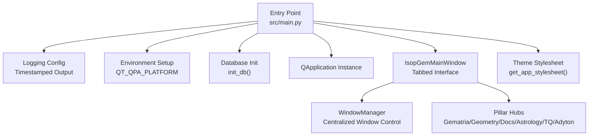
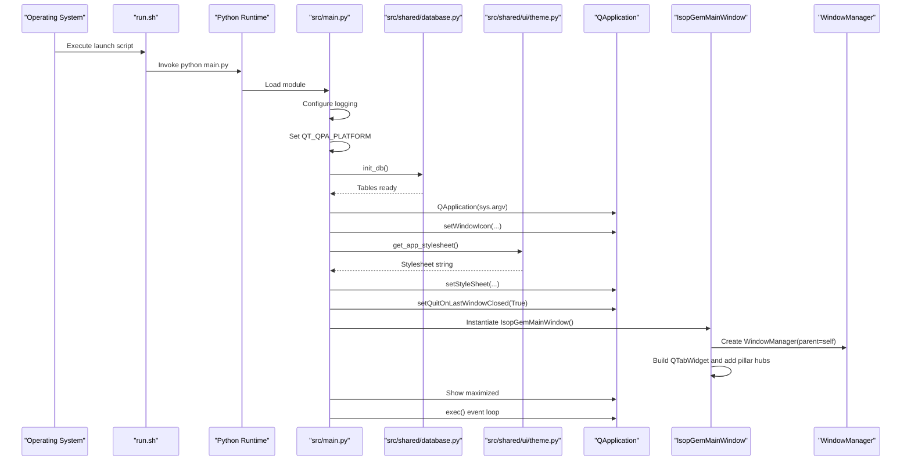
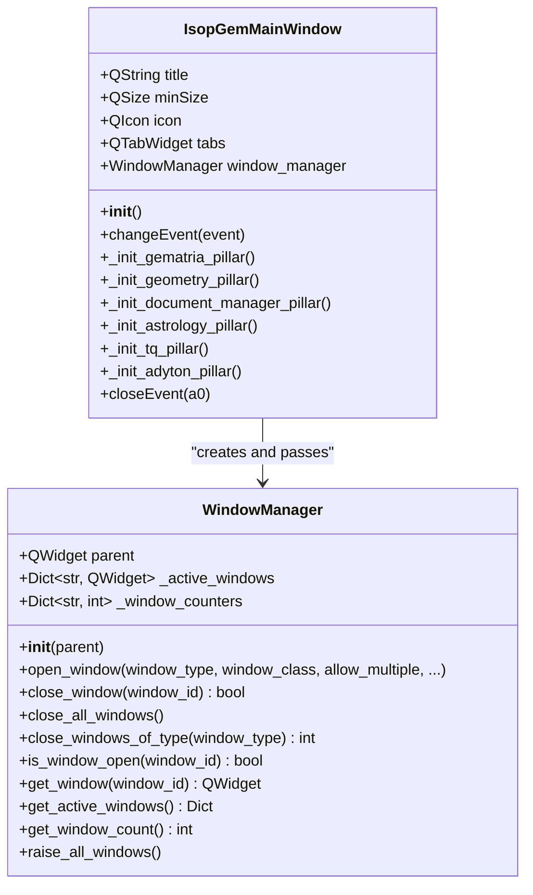
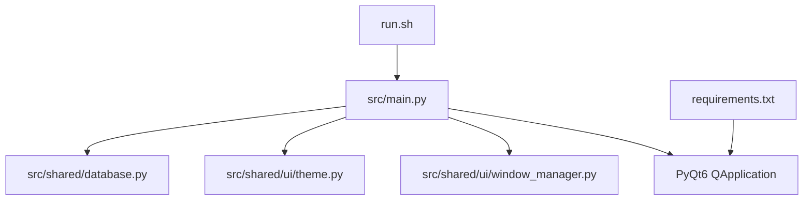

# Application Startup Sequence

<cite>
**Referenced Files in This Document**
- [src/main.py](file://src/main.py)
- [src/shared/ui/window_manager.py](file://src/shared/ui/window_manager.py)
- [src/shared/database.py](file://src/shared/database.py)
- [src/shared/ui/theme.py](file://src/shared/ui/theme.py)
- [run.sh](file://run.sh)
- [requirements.txt](file://requirements.txt)
</cite>

## Table of Contents
1. [Introduction](#introduction)
2. [Project Structure](#project-structure)
3. [Core Components](#core-components)
4. [Architecture Overview](#architecture-overview)
5. [Detailed Component Analysis](#detailed-component-analysis)
6. [Dependency Analysis](#dependency-analysis)
7. [Performance Considerations](#performance-considerations)
8. [Troubleshooting Guide](#troubleshooting-guide)
9. [Conclusion](#conclusion)

## Introduction
This document explains the application startup sequence for the isopgem application, focusing on the execution flow from the main entry point. It covers logging initialization with timestamped file output, environment variable configuration for Qt platform compatibility, QApplication instantiation, the creation of the central WindowManager instance, the construction of the IsopGemMainWindow with its tabbed interface and pillar hubs, and error handling considerations for GUI initialization and platform plugin selection. It also provides debugging strategies for common startup failures such as missing dependencies, database lock issues, and graphics backend incompatibilities.

## Project Structure
The startup sequence centers on the main entry point and a small set of foundational modules:
- Entry point: src/main.py
- Central window manager: src/shared/ui/window_manager.py
- Database initialization: src/shared/database.py
- Application theme/stylesheet: src/shared/ui/theme.py
- Launch script (optional): run.sh
- Dependencies: requirements.txt

**Diagram sources**
- [src/main.py](file://src/main.py#L113-L155)
- [src/shared/database.py](file://src/shared/database.py#L25-L30)
- [src/shared/ui/theme.py](file://src/shared/ui/theme.py#L39-L200)
- [src/shared/ui/window_manager.py](file://src/shared/ui/window_manager.py#L15-L112)

**Section sources**
- [src/main.py](file://src/main.py#L1-L156)
- [src/shared/database.py](file://src/shared/database.py#L1-L53)
- [src/shared/ui/theme.py](file://src/shared/ui/theme.py#L1-L200)
- [run.sh](file://run.sh#L1-L23)
- [requirements.txt](file://requirements.txt#L1-L40)

## Core Components
- Logging configuration sets timestamped console logs at DEBUG level.
- Environment variable QT_QPA_PLATFORM is set to ensure X11 compatibility for Qt/Wayland stability.
- Database initialization creates the SQLite database and tables.
- QApplication is instantiated with icon and stylesheet applied.
- IsopGemMainWindow constructs a tabbed interface and registers pillar hubs.
- WindowManager centralizes tool window lifecycle management.

**Section sources**
- [src/main.py](file://src/main.py#L113-L155)
- [src/shared/database.py](file://src/shared/database.py#L25-L30)
- [src/shared/ui/window_manager.py](file://src/shared/ui/window_manager.py#L15-L112)

## Architecture Overview
The startup flow is linear and deterministic:
1. Logging configured with timestamped output.
2. Environment variable for Qt platform set to xcb.
3. Database initialized (SQLite).
4. QApplication created and configured with icon and stylesheet.
5. IsopGemMainWindow instantiated and shown maximized.
6. Event loop started.

**Diagram sources**
- [src/main.py](file://src/main.py#L113-L155)
- [src/shared/database.py](file://src/shared/database.py#L25-L30)
- [src/shared/ui/theme.py](file://src/shared/ui/theme.py#L39-L200)
- [src/shared/ui/window_manager.py](file://src/shared/ui/window_manager.py#L15-L112)

## Detailed Component Analysis

### Logging Initialization
- The application configures logging with timestamped entries and DEBUG level output.
- This ensures verbose diagnostics during startup and runtime.

**Section sources**
- [src/main.py](file://src/main.py#L113-L120)

### Environment Variable Configuration (Qt Platform)
- The environment variable QT_QPA_PLATFORM is set to xcb to force X11 usage, improving stability on systems where Wayland causes issues.
- The launch script also exports this variable for consistency.

**Section sources**
- [src/main.py](file://src/main.py#L7-L12)
- [run.sh](file://run.sh#L12-L14)

### Database Initialization
- The database is initialized by creating the SQLite file and tables.
- The initialization imports model modules to register SQLAlchemy mappings before creating tables.

**Section sources**
- [src/shared/database.py](file://src/shared/database.py#L25-L30)

### QApplication Instantiation and Application-Level Configuration
- QApplication is created with argv.
- An application-wide icon is set if present.
- The modern theme stylesheet is applied globally.
- Quit behavior is configured to allow quitting when the last window closes.

**Section sources**
- [src/main.py](file://src/main.py#L124-L137)
- [src/shared/ui/theme.py](file://src/shared/ui/theme.py#L39-L200)

### IsopGemMainWindow Construction and Tabbed Interface
- The main window sets window properties, icon, and stylesheet.
- A central WindowManager instance is created and passed to each pillar hub.
- A QTabWidget is created and set as the central widget.
- Pillar hubs are registered as tabs in the order: Gematria, Geometry, Documents, Astrology, TQ, Adyton.
- The window connects tab changes and activation changes to raise all managed windows.

**Diagram sources**
- [src/main.py](file://src/main.py#L26-L112)
- [src/shared/ui/window_manager.py](file://src/shared/ui/window_manager.py#L15-L221)

**Section sources**
- [src/main.py](file://src/main.py#L26-L112)
- [src/shared/ui/window_manager.py](file://src/shared/ui/window_manager.py#L15-L112)

### Pillar Hub Registration
- Each pillar hub is instantiated with the central WindowManager and added as a tab.
- The tabs are labeled consistently across pillars.

**Section sources**
- [src/main.py](file://src/main.py#L75-L104)

### Signal Handling and Event Loop
- A SIGINT handler prints a message and quits the application gracefully.
- The main window is shown maximized and the event loop is started.

**Section sources**
- [src/main.py](file://src/main.py#L138-L151)

## Dependency Analysis
- The main entry point depends on:
  - Database initialization for schema readiness.
  - Theme stylesheet for UI styling.
  - WindowManager for tool window lifecycle.
  - Qt widgets for GUI construction.
- The launch script ensures the Qt platform is set prior to invoking Python.

**Diagram sources**
- [src/main.py](file://src/main.py#L113-L155)
- [src/shared/database.py](file://src/shared/database.py#L25-L30)
- [src/shared/ui/theme.py](file://src/shared/ui/theme.py#L39-L200)
- [src/shared/ui/window_manager.py](file://src/shared/ui/window_manager.py#L15-L112)
- [run.sh](file://run.sh#L1-L23)
- [requirements.txt](file://requirements.txt#L1-L40)

**Section sources**
- [src/main.py](file://src/main.py#L1-L156)
- [src/shared/database.py](file://src/shared/database.py#L1-L53)
- [src/shared/ui/theme.py](file://src/shared/ui/theme.py#L1-L200)
- [src/shared/ui/window_manager.py](file://src/shared/ui/window_manager.py#L1-L221)
- [run.sh](file://run.sh#L1-L23)
- [requirements.txt](file://requirements.txt#L1-L40)

## Performance Considerations
- Using xcb avoids Wayland-related rendering overhead and improves stability on Linux desktop environments.
- Applying the stylesheet once at application startup reduces per-widget style computation.
- Creating the database schema early prevents repeated checks during runtime.

[No sources needed since this section provides general guidance]

## Troubleshooting Guide

### Missing Dependencies
Symptoms:
- ImportError or ModuleNotFoundError during startup.

Actions:
- Verify installed packages match requirements.
- Ensure the virtual environment is activated before launching.

References:
- [requirements.txt](file://requirements.txt#L1-L40)
- [run.sh](file://run.sh#L7-L11)

**Section sources**
- [requirements.txt](file://requirements.txt#L1-L40)
- [run.sh](file://run.sh#L7-L11)

### Graphics Backend Incompatibility (Wayland/X11)
Symptoms:
- Qt warnings or unstable rendering on Wayland.
- Windows not appearing or behaving erratically.

Actions:
- Confirm QT_QPA_PLATFORM is set to xcb.
- Use the launch script to ensure environment is set before invoking Python.

References:
- [src/main.py](file://src/main.py#L7-L12)
- [run.sh](file://run.sh#L12-L14)

**Section sources**
- [src/main.py](file://src/main.py#L7-L12)
- [run.sh](file://run.sh#L12-L14)

### Database Lock Issues
Symptoms:
- OperationalError related to database locks or busy states.

Actions:
- Ensure no other process holds a lock on the SQLite file.
- Verify the application has write permissions to the data directory.
- Confirm the database initialization completes successfully before UI creation.

References:
- [src/shared/database.py](file://src/shared/database.py#L12-L30)
- [src/main.py](file://src/main.py#L121-L123)

**Section sources**
- [src/shared/database.py](file://src/shared/database.py#L12-L30)
- [src/main.py](file://src/main.py#L121-L123)

### GUI Initialization Failures
Symptoms:
- Application exits immediately after QApplication creation.
- Missing icons or stylesheet not applied.

Actions:
- Check that assets exist and are readable.
- Validate that QApplication is created and shown before entering the event loop.
- Confirm signal handlers are attached to handle graceful shutdown.

References:
- [src/main.py](file://src/main.py#L124-L151)

**Section sources**
- [src/main.py](file://src/main.py#L124-L151)

### Debugging Strategies
- Enable verbose logging at DEBUG level to capture startup events.
- Temporarily suppress Qt warnings if desired to reduce noise.
- Use the launch script to preserve terminal state and ensure environment variables are set.

References:
- [src/main.py](file://src/main.py#L113-L120)
- [run.sh](file://run.sh#L17-L22)

**Section sources**
- [src/main.py](file://src/main.py#L113-L120)
- [run.sh](file://run.sh#L17-L22)

## Conclusion
The isopgem startup sequence is intentionally minimal and robust. It prioritizes Qt/Wayland compatibility, ensures database readiness, applies a consistent theme, and initializes the main window with a centralized window manager and tabbed interface. By following the troubleshooting steps and leveraging the provided environment and logging configurations, most startup issues can be quickly diagnosed and resolved.