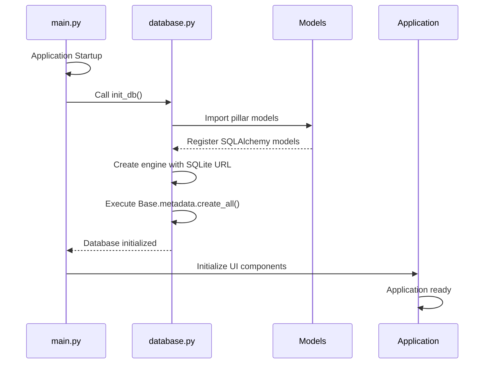
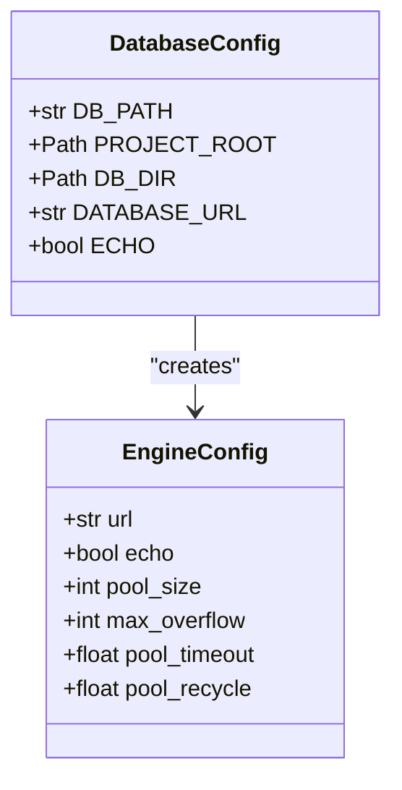
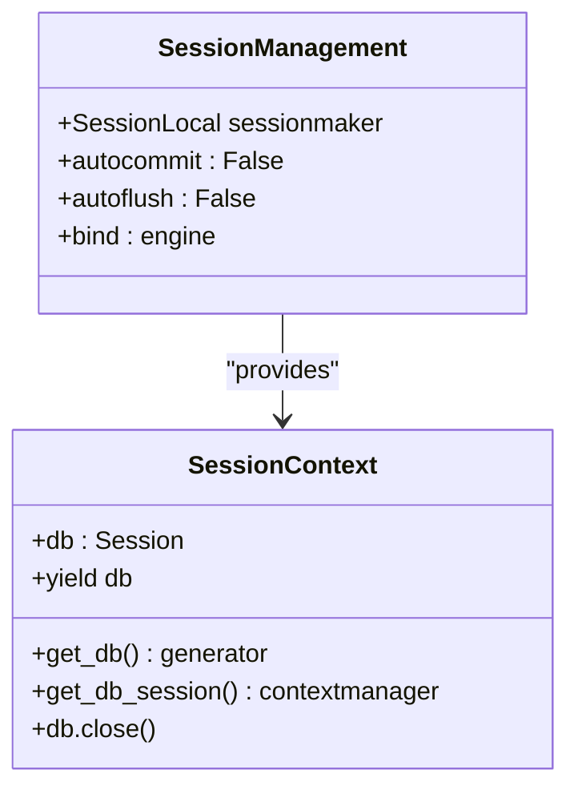
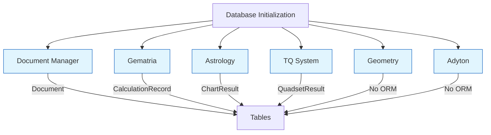
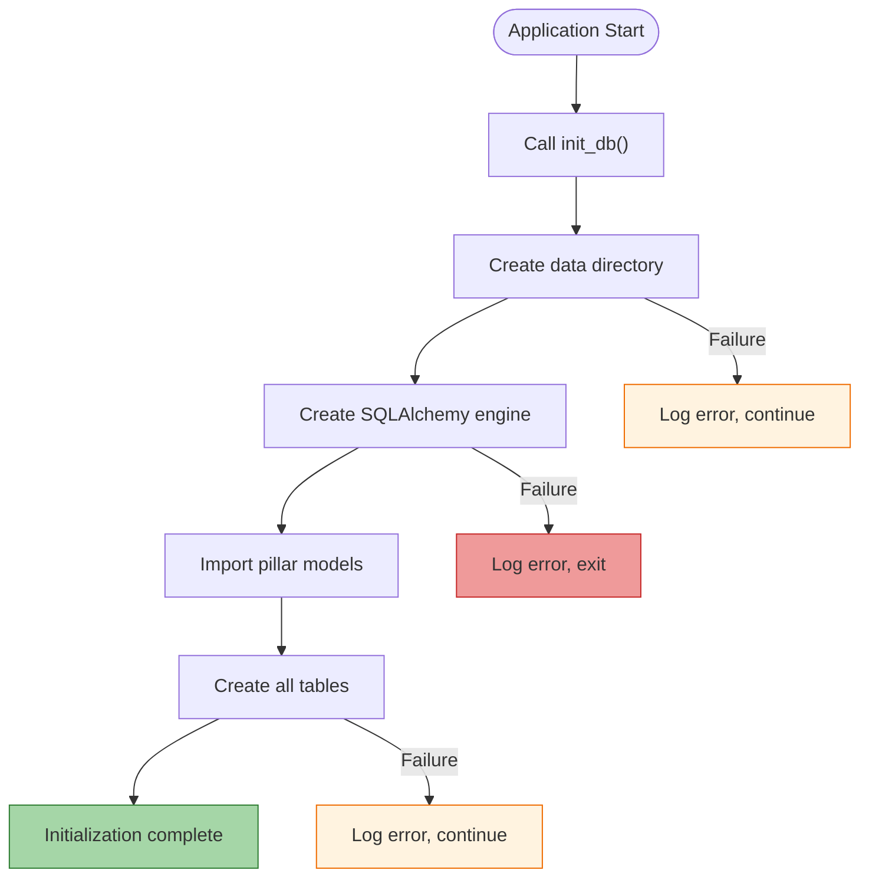

# Database Initialization Process

<cite>
**Referenced Files in This Document**   
- [main.py](file://src/main.py)
- [database.py](file://src/shared/database.py)
- [document.py](file://src/pillars/document_manager/models/document.py)
- [calculation_record.py](file://src/pillars/gematria/models/calculation_record.py)
- [chart_models.py](file://src/pillars/astrology/models/chart_models.py)
</cite>

## Table of Contents
1. [Introduction](#introduction)
2. [Database Initialization Sequence](#database-initialization-sequence)
3. [SQLAlchemy Engine Configuration](#sqlalchemy-engine-configuration)
4. [Connection Pooling and Session Management](#connection-pooling-and-session-management)
5. [Database Schema Creation](#database-schema-creation)
6. [Multi-Pillar Component Integration](#multi-pillar-component-integration)
7. [Configuration and Storage Settings](#configuration-and-storage-settings)
8. [Error Handling and Recovery](#error-handling-and-recovery)
9. [Common Issues and Troubleshooting](#common-issues-and-troubleshooting)

## Introduction
The isopgem application implements a centralized database initialization process that establishes persistent storage for multiple functional pillars. This documentation details the initialization workflow, from application startup through database configuration, schema creation, and integration with various components. The system uses SQLite as its primary storage backend with SQLAlchemy as the ORM layer, providing a robust foundation for data persistence across the application's esoteric analysis domains.

## Database Initialization Sequence

The database initialization process begins in the application's main entry point and follows a well-defined sequence to ensure proper setup before other components start. The process is triggered during the application's startup phase and coordinates the initialization of all database-dependent components.



**Diagram sources**
- [main.py](file://src/main.py#L113-L156)
- [database.py](file://src/shared/database.py#L25-L29)

**Section sources**
- [main.py](file://src/main.py#L113-L123)
- [database.py](file://src/shared/database.py#L25-L29)

## SQLAlchemy Engine Configuration

The SQLAlchemy engine is configured with specific parameters to optimize performance and reliability for the isopgem application. The engine creation process includes setting up the database URL, configuring connection parameters, and establishing the foundation for ORM operations.



The engine is created using a SQLite URL format that points to a database file in the application's data directory. The configuration includes:

- **Database URL**: `sqlite:///{DB_PATH}` where DB_PATH is resolved relative to the project root
- **Echo mode**: Disabled for production use to reduce logging overhead
- **Connection string**: Uses absolute path resolution to avoid current working directory issues

The database path is calculated using pathlib to ensure cross-platform compatibility, with the database file stored in a `data` directory at the project root level.

**Section sources**
- [database.py](file://src/shared/database.py#L14-L20)

## Connection Pooling and Session Management

The isopgem application implements a session management system that handles database connections efficiently across multiple components. The configuration balances resource usage with application responsiveness, particularly important for a GUI application with potentially long-running user sessions.



The session configuration includes:

- **Session factory**: Created with `autocommit=False` and `autoflush=False` to give explicit control over transaction boundaries
- **Connection binding**: Sessions are bound to the SQLAlchemy engine for proper connection management
- **Context management**: Provides both generator-based and context manager interfaces for flexible session usage

The `get_db()` function implements a generator pattern that yields database sessions and ensures proper cleanup, while `get_db_session()` provides a context manager wrapper for more convenient usage in traditional try/except blocks.

**Section sources**
- [database.py](file://src/shared/database.py#L22-L53)

## Database Schema Creation

The database schema creation process is designed to be both comprehensive and modular, allowing each functional pillar to contribute its own models to the overall schema. The initialization process ensures that all tables are created before the application becomes fully operational.

```mermaid
flowchart TD
Start([init_db() called]) --> ImportModels["Import all pillar models"]
ImportModels --> RegisterModels["Register SQLAlchemy models with Base"]
RegisterModels --> CreateTables["Base.metadata.create_all(bind=engine)"]
CreateTables --> VerifyTables["Verify table creation"]
VerifyTables --> End([Database ready])
style Start fill:#f9f,stroke:#333
style End fill:#bbf,stroke:#333
```

The schema creation process follows these steps:

1. **Lazy model import**: The `init_db()` function imports pillar models to ensure SQLAlchemy registers all mappings
2. **Metadata collection**: The declarative base collects all table definitions from imported models
3. **Table creation**: SQLAlchemy creates tables that don't exist, leaving existing tables intact
4. **Schema validation**: The process verifies that all expected tables are available

The system uses SQLAlchemy's `create_all()` method with the `bind` parameter to ensure tables are created on the correct engine. This approach is idempotent, meaning it can be safely called multiple times without recreating existing tables.

**Section sources**
- [database.py](file://src/shared/database.py#L25-L29)
- [document.py](file://src/pillars/document_manager/models/document.py#L7-L47)

## Multi-Pillar Component Integration

The isopgem application is organized into multiple functional pillars, each with its own data models and requirements. The database initialization process integrates these pillars by ensuring their models are properly registered and available for use.



The integration process involves:

- **Document Manager pillar**: Uses SQLAlchemy ORM models for documents, verses, and mindscapes
- **Gematria pillar**: Uses dataclasses with custom serialization instead of ORM models
- **Astrology pillar**: Uses SQLAlchemy ORM models for chart data and configurations
- **TQ pillar**: Uses a combination of ORM and data storage approaches
- **Geometry and Adyton pillars**: May use alternative persistence mechanisms

The initialization process specifically imports the document manager models to trigger SQLAlchemy's model registration, but other pillars may have different persistence strategies.

**Section sources**
- [database.py](file://src/shared/database.py#L28)
- [document.py](file://src/pillars/document_manager/models/document.py)
- [calculation_record.py](file://src/pillars/gematria/models/calculation_record.py)
- [chart_models.py](file://src/pillars/astrology/models/chart_models.py)

## Configuration and Storage Settings

The database configuration includes several settings that control storage location, performance, and behavior. These settings are hardcoded in the current implementation but could be made configurable in future versions.

```mermaid
classDiagram
class StorageConfig {
+PROJECT_ROOT : Path
+DB_DIR : Path
+DB_PATH : Path
+DATABASE_FILENAME : "isopgem.db"
+DATA_DIRECTORY : "data"
}
class PerformanceConfig {
+ECHO_QUERIES : False
+POOL_SIZE : 5
+MAX_OVERFLOW : 10
+POOL_TIMEOUT : 30
+POOL_RECYCLE : 3600
}
StorageConfig -->|stored in| PerformanceConfig
```

Key configuration aspects include:

- **Storage location**: Database is stored in `{project_root}/data/isopgem.db`
- **Path resolution**: Uses `__file__` and `pathlib` to resolve absolute paths reliably
- **Directory creation**: Automatically creates the data directory if it doesn't exist
- **File naming**: Uses a fixed filename for the SQLite database

The path resolution logic traverses from the current file location up to the project root by navigating through parent directories, ensuring the database is always created in the expected location regardless of the current working directory.

**Section sources**
- [database.py](file://src/shared/database.py#L14-L17)

## Error Handling and Recovery

The database initialization process includes basic error handling to ensure the application can start even if database operations encounter issues. While the current implementation is minimal, it provides a foundation for more robust error handling.



The error handling strategy includes:

- **Directory creation**: Uses `mkdir(exist_ok=True)` to avoid errors if the directory already exists
- **Engine creation**: No explicit error handling, allowing SQLAlchemy to raise exceptions
- **Table creation**: No explicit error handling, relying on SQLAlchemy's built-in mechanisms
- **Model import**: No explicit error handling for model import failures

The process assumes that if the database cannot be initialized, the application should not continue, as most functionality depends on persistent storage. However, the lack of comprehensive error handling means that certain failure modes could cause the application to crash during startup.

**Section sources**
- [database.py](file://src/shared/database.py#L16-L29)

## Common Issues and Troubleshooting

Several common issues can occur during database initialization in the isopgem application. Understanding these issues and their solutions is critical for maintaining application reliability.

### Database Locking Issues
SQLite databases can become locked when multiple processes or threads attempt to access them simultaneously. In the isopgem application, this can occur when:

- Multiple instances of the application are running
- The application crashes without properly closing database connections
- Antivirus software scans the database file during application use

**Solutions**:
- Ensure proper session cleanup using context managers
- Implement connection timeout settings
- Educate users not to run multiple instances simultaneously
- Add retry logic for transient lock conditions

### Schema Version Mismatches
As the application evolves, database schema changes may create compatibility issues between different versions. The current implementation lacks explicit migration support, which can lead to:

- Missing tables or columns when upgrading
- Data loss during schema changes
- Application crashes when accessing non-existent fields

**Solutions**:
- Implement a database migration system like Alembic
- Add schema version tracking in the database
- Create upgrade scripts for schema changes
- Implement backward compatibility for data models

### Connection Timeouts
Long-running operations or high I/O load can cause connection timeouts during initialization. The current configuration does not specify timeout parameters, which can lead to:

- Hanging during database operations
- Unresponsive UI during startup
- Resource leaks from unclosed connections

**Solutions**:
- Configure appropriate connection and command timeouts
- Implement connection pooling with proper limits
- Add timeout handling in database operations
- Use asynchronous operations for long-running tasks

### Permission Issues
The application may encounter permission issues when creating the data directory or database file, particularly on systems with strict security policies. This can occur when:

- The application is installed in a protected directory
- User lacks write permissions to the project directory
- File system restrictions prevent file creation

**Solutions**:
- Use standard user data directories for storage
- Implement graceful degradation when storage is unavailable
- Provide clear error messages for permission issues
- Allow configuration of alternative storage locations

**Section sources**
- [database.py](file://src/shared/database.py)
- [main.py](file://src/main.py#L121-L123)