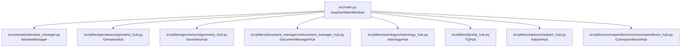
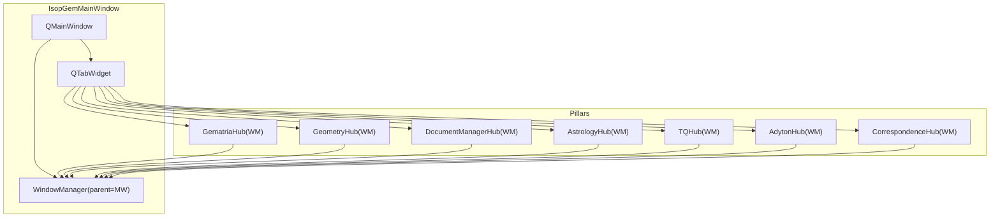
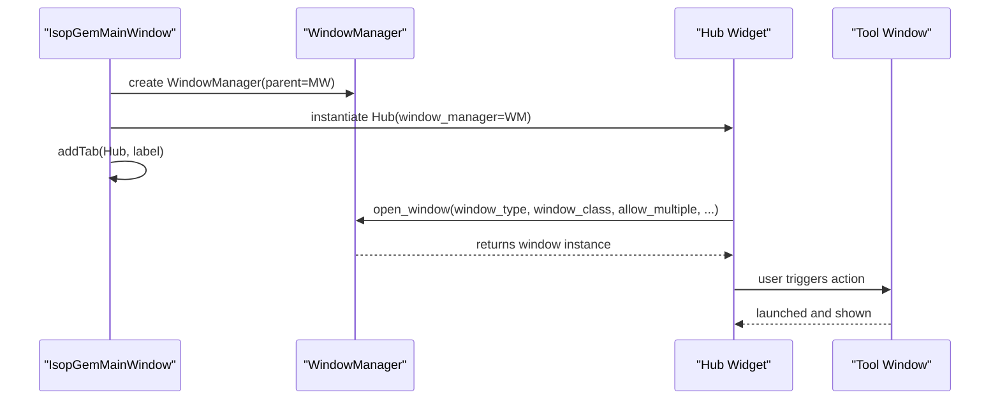
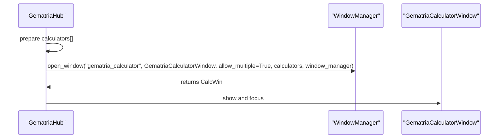
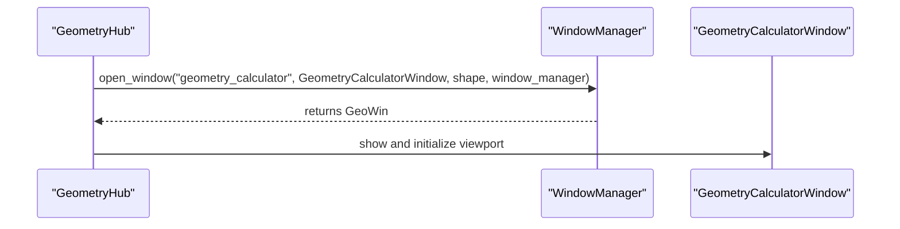
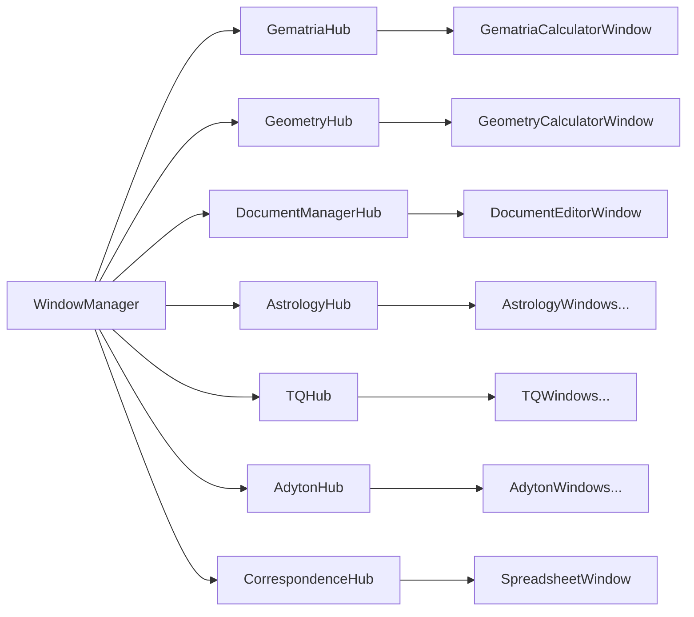

# Pillar Hub Registration and Tab Integration

<cite>
**Referenced Files in This Document**
- [main.py](file://src/main.py)
- [window_manager.py](file://src/shared/ui/window_manager.py)
- [gematria_hub.py](file://src/pillars/gematria/ui/gematria_hub.py)
- [geometry_hub.py](file://src/pillars/geometry/ui/geometry_hub.py)
- [document_manager_hub.py](file://src/pillars/document_manager/ui/document_manager_hub.py)
- [astrology_hub.py](file://src/pillars/astrology/ui/astrology_hub.py)
- [tq_hub.py](file://src/pillars/tq/ui/tq_hub.py)
- [adyton_hub.py](file://src/pillars/adyton/ui/adyton_hub.py)
- [correspondence_hub.py](file://src/pillars/correspondences/ui/correspondence_hub.py)
- [gematria_calculator_window.py](file://src/pillars/gematria/ui/gematria_calculator_window.py)
- [geometry_calculator_window.py](file://src/pillars/geometry/ui/geometry_calculator_window.py)
- [theme.py](file://src/shared/ui/theme.py)
</cite>

## Table of Contents
1. [Introduction](#introduction)
2. [Project Structure](#project-structure)
3. [Core Components](#core-components)
4. [Architecture Overview](#architecture-overview)
5. [Detailed Component Analysis](#detailed-component-analysis)
6. [Dependency Analysis](#dependency-analysis)
7. [Performance Considerations](#performance-considerations)
8. [Troubleshooting Guide](#troubleshooting-guide)
9. [Conclusion](#conclusion)

## Introduction
This document explains how the IsopGem application registers and integrates the “pillar” hubs into the main window as tabs. Each hub (GematriaHub, GeometryHub, etc.) is instantiated with a shared WindowManager and added to a QTabWidget inside IsopGemMainWindow. It also covers the common patterns across hubs, initialization order, dependency requirements, error handling during hub registration, visual design considerations for tab organization, and mechanisms for lazy vs. eager initialization. Finally, it outlines strategies for handling hub startup failures and recovery.

## Project Structure
The main entry point initializes the application, sets up the global WindowManager, and adds each pillar hub as a tab page. Each hub is a QWidget subclass that exposes a set of tool windows via the shared WindowManager.

**Diagram sources**
- [main.py](file://src/main.py#L27-L111)
- [window_manager.py](file://src/shared/ui/window_manager.py#L15-L112)
- [gematria_hub.py](file://src/pillars/gematria/ui/gematria_hub.py#L48-L117)
- [geometry_hub.py](file://src/pillars/geometry/ui/geometry_hub.py#L1110-L1170)
- [document_manager_hub.py](file://src/pillars/document_manager/ui/document_manager_hub.py#L13-L40)
- [astrology_hub.py](file://src/pillars/astrology/ui/astrology_hub.py#L12-L40)
- [tq_hub.py](file://src/pillars/tq/ui/tq_hub.py#L16-L45)
- [adyton_hub.py](file://src/pillars/adyton/ui/adyton_hub.py#L11-L40)
- [correspondence_hub.py](file://src/pillars/correspondences/ui/correspondence_hub.py#L63-L90)

**Section sources**
- [main.py](file://src/main.py#L27-L111)

## Core Components
- IsopGemMainWindow: Creates the main window, a shared WindowManager, and a QTabWidget. It registers each pillar hub as a tab page.
- WindowManager: Centralized manager for tool windows across pillars. Handles instantiation, reuse, and lifecycle of child windows.
- Hub widgets: Each pillar hub is a QWidget that provides a launcher UI and opens tool windows via WindowManager. They all accept a WindowManager instance in their constructor.

Key patterns:
- All hub constructors accept a single WindowManager argument.
- Each hub builds its own UI and routes actions to WindowManager.open_window with a window_type and window_class.
- Tabs are added in a deterministic order in IsopGemMainWindow.

**Section sources**
- [main.py](file://src/main.py#L27-L111)
- [window_manager.py](file://src/shared/ui/window_manager.py#L15-L112)
- [gematria_hub.py](file://src/pillars/gematria/ui/gematria_hub.py#L48-L117)
- [geometry_hub.py](file://src/pillars/geometry/ui/geometry_hub.py#L1110-L1170)
- [document_manager_hub.py](file://src/pillars/document_manager/ui/document_manager_hub.py#L13-L40)
- [astrology_hub.py](file://src/pillars/astrology/ui/astrology_hub.py#L12-L40)
- [tq_hub.py](file://src/pillars/tq/ui/tq_hub.py#L16-L45)
- [adyton_hub.py](file://src/pillars/adyton/ui/adyton_hub.py#L11-L40)
- [correspondence_hub.py](file://src/pillars/correspondences/ui/correspondence_hub.py#L63-L90)

## Architecture Overview
The main window composes a QTabWidget and adds each hub as a tab. Each hub encapsulates its tool launchers and delegates actual window creation to WindowManager. This design enforces:
- Loose coupling between main window and individual pillars.
- Centralized window lifecycle management.
- Consistent UX across pillars via shared WindowManager behavior.

**Diagram sources**
- [main.py](file://src/main.py#L27-L111)
- [window_manager.py](file://src/shared/ui/window_manager.py#L15-L112)
- [gematria_hub.py](file://src/pillars/gematria/ui/gematria_hub.py#L48-L117)
- [geometry_hub.py](file://src/pillars/geometry/ui/geometry_hub.py#L1110-L1170)
- [document_manager_hub.py](file://src/pillars/document_manager/ui/document_manager_hub.py#L13-L40)
- [astrology_hub.py](file://src/pillars/astrology/ui/astrology_hub.py#L12-L40)
- [tq_hub.py](file://src/pillars/tq/ui/tq_hub.py#L16-L45)
- [adyton_hub.py](file://src/pillars/adyton/ui/adyton_hub.py#L11-L40)
- [correspondence_hub.py](file://src/pillars/correspondences/ui/correspondence_hub.py#L63-L90)

## Detailed Component Analysis

### IsopGemMainWindow Initialization and Tab Registration
- Creates a shared WindowManager bound to itself as parent.
- Builds a QTabWidget and adds each hub as a tab page in a fixed order.
- Connects tab change events to raise all managed windows.

Initialization order:
1. Gematria
2. Geometry
3. Document Manager
4. Astrology
5. TQ
6. Adyton
7. Correspondences

This order determines the tab bar order and is defined in the main window’s initialization.

**Section sources**
- [main.py](file://src/main.py#L27-L111)

### Hub Construction and Registration Flow
Each hub follows a consistent pattern:
- Accepts a WindowManager instance in __init__.
- Builds a UI with tool launchers.
- On user action, calls WindowManager.open_window with:
  - window_type: a stable string identifying the tool category.
  - window_class: the target window class to instantiate.
  - allow_multiple: whether to permit multiple instances.
  - Additional constructor args/kwargs as needed.

**Diagram sources**
- [main.py](file://src/main.py#L51-L111)
- [window_manager.py](file://src/shared/ui/window_manager.py#L29-L112)
- [gematria_hub.py](file://src/pillars/gematria/ui/gematria_hub.py#L137-L188)
- [geometry_hub.py](file://src/pillars/geometry/ui/geometry_hub.py#L1110-L1170)

**Section sources**
- [window_manager.py](file://src/shared/ui/window_manager.py#L29-L112)
- [gematria_hub.py](file://src/pillars/gematria/ui/gematria_hub.py#L137-L188)
- [geometry_hub.py](file://src/pillars/geometry/ui/geometry_hub.py#L1110-L1170)

### Common Hub Interface and Responsibilities
- Constructor signature: __init__(self, window_manager: WindowManager)
- UI setup: _setup_ui builds a consistent header and tool launcher layout.
- Tool launching: Methods like _open_* delegate to WindowManager.open_window with window_type and window_class.
- Some hubs also pass additional constructor arguments (e.g., calculators lists, services) to the target windows.

Examples:
- GematriaHub: constructs calculator instances and passes them to the calculator window via WindowManager.
- TQHub: constructs a service instance and passes it to the Kamea window via WindowManager.
- DocumentManagerHub: connects signals from library/search windows to open editors.

**Section sources**
- [gematria_hub.py](file://src/pillars/gematria/ui/gematria_hub.py#L137-L357)
- [tq_hub.py](file://src/pillars/tq/ui/tq_hub.py#L305-L326)
- [document_manager_hub.py](file://src/pillars/document_manager/ui/document_manager_hub.py#L136-L205)

### Visual Design and Tab Organization
- Tabs are labeled consistently across hubs (e.g., “📖 Gematria”, “📐 Geometry”, “📚 Documents”, “⭐ Astrology”, “🔺 TQ”, “🏛️ Adyton”, “🟢 Emerald Tablet”).
- Theme styling is applied at the application level via get_app_stylesheet, ensuring consistent fonts, colors, and widget styles across the main window and tabs.

**Section sources**
- [main.py](file://src/main.py#L77-L111)
- [theme.py](file://src/shared/ui/theme.py#L39-L120)

### Lazy Loading vs. Eager Initialization
- Eager initialization: Each hub is constructed when IsopGemMainWindow initializes and added as a tab. The hub’s UI is built immediately.
- Lazy loading: Tool windows are created on-demand when the user clicks a launcher. WindowManager.open_window instantiates the target window class only when requested.
- Exceptions:
  - Some hubs construct heavy resources (e.g., calculator lists, services) upon tool launch rather than at hub construction. This keeps the initial tab load fast while deferring expensive setup until needed.

**Section sources**
- [main.py](file://src/main.py#L77-L111)
- [gematria_hub.py](file://src/pillars/gematria/ui/gematria_hub.py#L137-L357)
- [tq_hub.py](file://src/pillars/tq/ui/tq_hub.py#L305-L326)

### Navigation Integration
- Tabs are the primary navigation surface. Switching tabs triggers WindowManager.raise_all_windows to bring all managed tool windows to the foreground.
- Tool windows are owned by the main window but remain independent, allowing users to tile and manage them separately.

**Section sources**
- [main.py](file://src/main.py#L67-L76)
- [window_manager.py](file://src/shared/ui/window_manager.py#L205-L221)

### Example: Gematria Hub Tool Launch
- The Gematria hub prepares a list of calculator instances and passes them to the calculator window via WindowManager.
- It distinguishes between multiple-instance and single-instance tools by setting allow_multiple accordingly.

**Diagram sources**
- [gematria_hub.py](file://src/pillars/gematria/ui/gematria_hub.py#L137-L188)
- [gematria_calculator_window.py](file://src/pillars/gematria/ui/gematria_calculator_window.py#L18-L36)

**Section sources**
- [gematria_hub.py](file://src/pillars/gematria/ui/gematria_hub.py#L137-L188)
- [gematria_calculator_window.py](file://src/pillars/gematria/ui/gematria_calculator_window.py#L18-L36)

### Example: Geometry Hub Tool Launch
- The Geometry hub defines categories and tools; clicking a tool opens the corresponding window via WindowManager.
- Some tools may construct services or load data lazily when opened.

**Diagram sources**
- [geometry_hub.py](file://src/pillars/geometry/ui/geometry_hub.py#L1110-L1170)
- [geometry_calculator_window.py](file://src/pillars/geometry/ui/geometry_calculator_window.py#L19-L48)

**Section sources**
- [geometry_hub.py](file://src/pillars/geometry/ui/geometry_hub.py#L1110-L1170)
- [geometry_calculator_window.py](file://src/pillars/geometry/ui/geometry_calculator_window.py#L19-L48)

## Dependency Analysis
- Coupling:
  - IsopGemMainWindow depends on WindowManager and all hub classes.
  - Each hub depends on WindowManager and its tool window classes.
  - Tool windows depend on services and models as needed.
- Cohesion:
  - Each hub encapsulates its own tool launchers and UI, increasing cohesion within pillars.
- External dependencies:
  - WindowManager centralizes window ownership and lifecycle, reducing cross-pilar coupling.

**Diagram sources**
- [main.py](file://src/main.py#L51-L111)
- [window_manager.py](file://src/shared/ui/window_manager.py#L29-L112)
- [gematria_hub.py](file://src/pillars/gematria/ui/gematria_hub.py#L137-L188)
- [geometry_hub.py](file://src/pillars/geometry/ui/geometry_hub.py#L1110-L1170)
- [document_manager_hub.py](file://src/pillars/document_manager/ui/document_manager_hub.py#L136-L205)
- [astrology_hub.py](file://src/pillars/astrology/ui/astrology_hub.py#L87-L127)
- [tq_hub.py](file://src/pillars/tq/ui/tq_hub.py#L251-L326)
- [adyton_hub.py](file://src/pillars/adyton/ui/adyton_hub.py#L116-L149)
- [correspondence_hub.py](file://src/pillars/correspondences/ui/correspondence_hub.py#L239-L256)

**Section sources**
- [main.py](file://src/main.py#L51-L111)
- [window_manager.py](file://src/shared/ui/window_manager.py#L29-L112)

## Performance Considerations
- Keep hub UI lightweight: Build minimal UI in hub constructors; defer heavy initialization to tool windows.
- Use allow_multiple judiciously: Multiple instances improve flexibility but increase memory usage. Single-instance tools reduce overhead.
- Avoid blocking UI: Use WindowManager.open_window to create windows asynchronously; avoid long-running tasks in hub constructors.
- Theme and styling: Centralized theme reduces per-window styling overhead.

[No sources needed since this section provides general guidance]

## Troubleshooting Guide
Common issues and recovery strategies:
- Hub fails to appear in tabs:
  - Verify IsopGemMainWindow._init_* methods are present and called in order.
  - Ensure the hub constructor accepts a WindowManager and calls super().__init__().
- Tool window does not open:
  - Confirm window_type is unique and allow_multiple is set appropriately.
  - Check that window_class is importable and does not require hidden dependencies.
- Multiple windows not created:
  - Ensure allow_multiple=True is passed when multiple instances are desired.
- Windows not raised when switching tabs:
  - Confirm tabs.currentChanged is connected to window_manager.raise_all_windows.
- Startup failures:
  - Wrap hub initialization in try/except blocks where appropriate.
  - Log errors and provide fallback UI (e.g., disabled buttons with explanatory tooltips).
  - On fatal errors, disable the affected tab and notify the user.

**Section sources**
- [main.py](file://src/main.py#L67-L76)
- [window_manager.py](file://src/shared/ui/window_manager.py#L29-L112)

## Conclusion
The IsopGem application integrates pillar hubs into a unified main window by constructing each hub with a shared WindowManager and adding them as tabs. The design emphasizes loose coupling, centralized window lifecycle management, and consistent UX across pillars. Initialization is eager for hub UIs but lazy for tool windows, balancing responsiveness with functionality. Clear patterns and robust error handling enable reliable operation and straightforward maintenance.