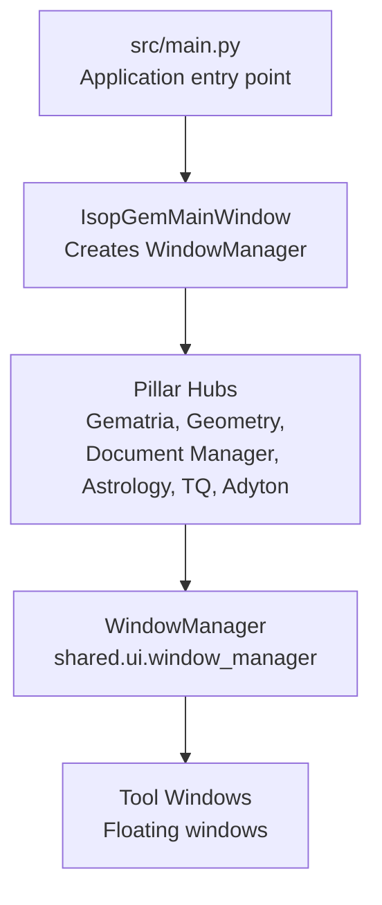
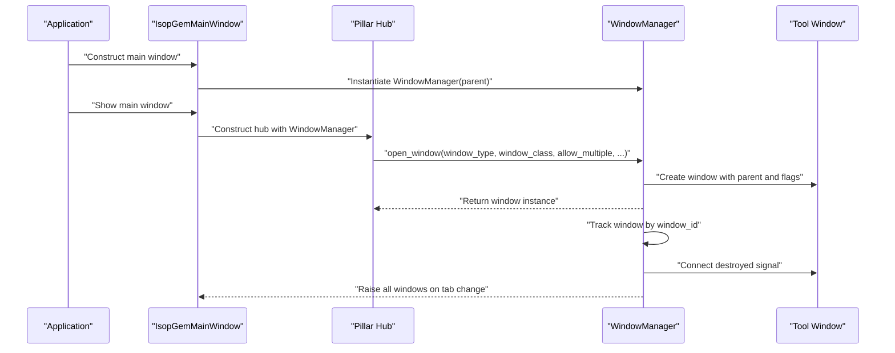
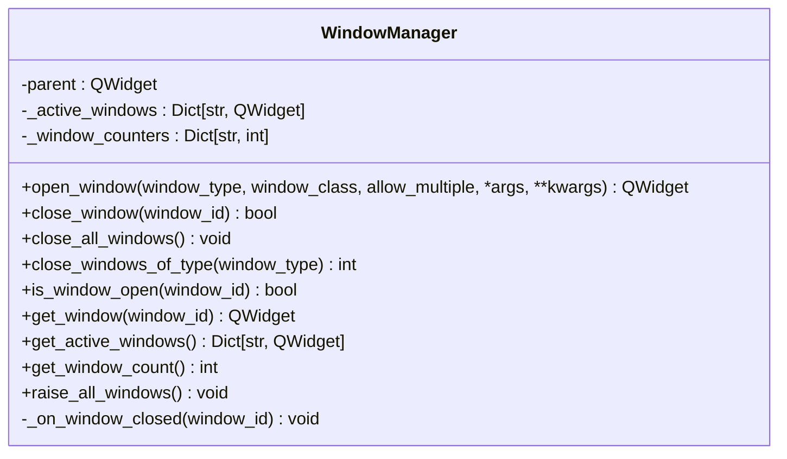
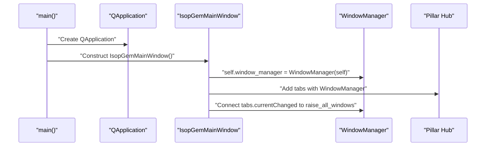
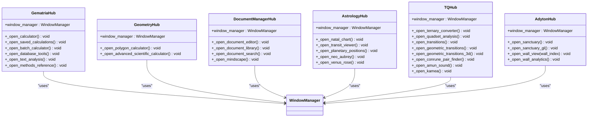
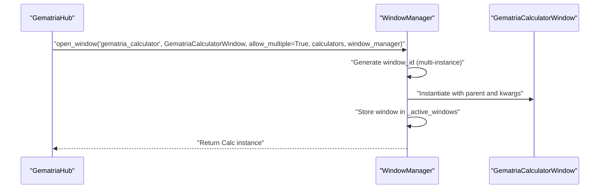
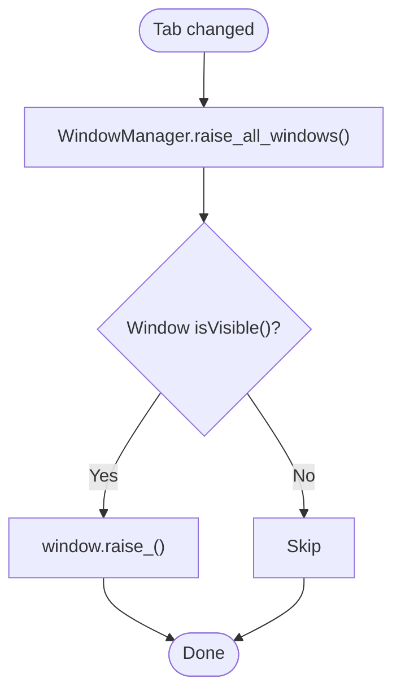
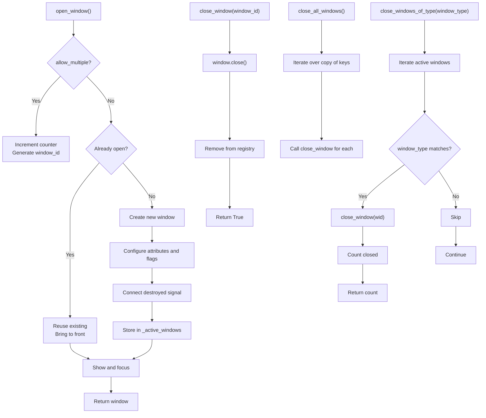
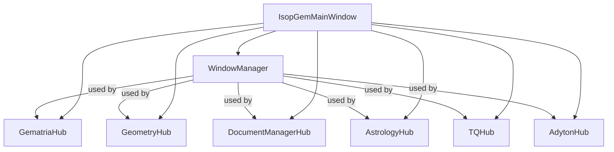

# Window Manager Initialization and Injection

<cite>
**Referenced Files in This Document**
- [src/main.py](file://src/main.py)
- [src/shared/ui/window_manager.py](file://src/shared/ui/window_manager.py)
- [src/shared/ui/__init__.py](file://src/shared/ui/__init__.py)
- [src/pillars/gematria/ui/gematria_hub.py](file://src/pillars/gematria/ui/gematria_hub.py)
- [src/pillars/geometry/ui/geometry_hub.py](file://src/pillars/geometry/ui/geometry_hub.py)
- [src/pillars/document_manager/ui/document_manager_hub.py](file://src/pillars/document_manager/ui/document_manager_hub.py)
- [src/pillars/astrology/ui/astrology_hub.py](file://src/pillars/astrology/ui/astrology_hub.py)
- [src/pillars/tq/ui/tq_hub.py](file://src/pillars/tq/ui/tq_hub.py)
- [src/pillars/adyton/ui/adyton_hub.py](file://src/pillars/adyton/ui/adyton_hub.py)
- [test/test_window_manager.py](file://test/test_window_manager.py)
</cite>

## Table of Contents
1. [Introduction](#introduction)
2. [Project Structure](#project-structure)
3. [Core Components](#core-components)
4. [Architecture Overview](#architecture-overview)
5. [Detailed Component Analysis](#detailed-component-analysis)
6. [Dependency Analysis](#dependency-analysis)
7. [Performance Considerations](#performance-considerations)
8. [Troubleshooting Guide](#troubleshooting-guide)
9. [Conclusion](#conclusion)

## Introduction
This document explains the Window Manager initialization and dependency injection mechanism in the isopgem application. It focuses on how the WindowManager singleton is created early in the application lifecycle, passed to the main window, and then injected into each pillar hub. It also details how the WindowManager coordinates floating tool windows, maintains UI state across pillars, and enables cross-component communication. Thread-safety considerations, event propagation patterns, and lifecycle management are covered, along with practical examples of how UI components register with and utilize the window manager for window coordination.

## Project Structure
The window manager sits in a shared UI module and is consumed by the main application entry point and all pillar hubs. The main entry point constructs the WindowManager and passes it to the main window, which in turn passes it to each hub. Hubs then use the WindowManager to open tool windows and coordinate their lifecycle.

**Diagram sources**
- [src/main.py](file://src/main.py#L120-L163)
- [src/shared/ui/window_manager.py](file://src/shared/ui/window_manager.py#L15-L112)
- [src/pillars/gematria/ui/gematria_hub.py](file://src/pillars/gematria/ui/gematria_hub.py#L49-L70)
- [src/pillars/geometry/ui/geometry_hub.py](file://src/pillars/geometry/ui/geometry_hub.py#L12-L20)
- [src/pillars/document_manager/ui/document_manager_hub.py](file://src/pillars/document_manager/ui/document_manager_hub.py#L14-L27)
- [src/pillars/astrology/ui/astrology_hub.py](file://src/pillars/astrology/ui/astrology_hub.py#L13-L26)
- [src/pillars/tq/ui/tq_hub.py](file://src/pillars/tq/ui/tq_hub.py#L17-L30)
- [src/pillars/adyton/ui/adyton_hub.py](file://src/pillars/adyton/ui/adyton_hub.py#L114-L148)

**Section sources**
- [src/main.py](file://src/main.py#L120-L163)
- [src/shared/ui/window_manager.py](file://src/shared/ui/window_manager.py#L15-L112)
- [src/shared/ui/__init__.py](file://src/shared/ui/__init__.py#L1-L6)

## Core Components
- WindowManager: Centralized coordinator for tool windows across the application. It tracks active windows, manages single-instance vs. multi-instance behavior, and raises windows on tab changes.
- Main Application Entry Point: Creates the QApplication, initializes the database, applies stylesheets, and constructs the main window with a WindowManager instance.
- Main Window: Holds the WindowManager and passes it to each pillar hub when constructing tabs.
- Pillar Hubs: Receive the WindowManager via constructor and use it to open tool windows. They encapsulate UI actions and delegate window creation to the WindowManager.

Key responsibilities:
- Early instantiation: WindowManager is created in the main window constructor before any hub tabs are initialized.
- Dependency injection: Each hub receives the WindowManager in its constructor and stores it for later use.
- Lifecycle management: WindowManager handles open/close/reuse semantics, window identification, and cleanup.
- Cross-component communication: Hubs can pass the WindowManager to tool windows to enable coordinated behavior.

**Section sources**
- [src/main.py](file://src/main.py#L51-L69)
- [src/shared/ui/window_manager.py](file://src/shared/ui/window_manager.py#L15-L112)
- [src/pillars/gematria/ui/gematria_hub.py](file://src/pillars/gematria/ui/gematria_hub.py#L49-L70)
- [src/pillars/geometry/ui/geometry_hub.py](file://src/pillars/geometry/ui/geometry_hub.py#L12-L20)
- [src/pillars/document_manager/ui/document_manager_hub.py](file://src/pillars/document_manager/ui/document_manager_hub.py#L14-L27)
- [src/pillars/astrology/ui/astrology_hub.py](file://src/pillars/astrology/ui/astrology_hub.py#L13-L26)
- [src/pillars/tq/ui/tq_hub.py](file://src/pillars/tq/ui/tq_hub.py#L17-L30)
- [src/pillars/adyton/ui/adyton_hub.py](file://src/pillars/adyton/ui/adyton_hub.py#L114-L148)

## Architecture Overview
The WindowManager acts as a façade for window lifecycle operations. It is constructed in the main window and injected into each hub. Hubs call open_window with a window type, window class, and options to either reuse an existing window or create a new one. The WindowManager sets attributes, flags, and connects destruction signals to keep internal state consistent.

**Diagram sources**
- [src/main.py](file://src/main.py#L51-L69)
- [src/shared/ui/window_manager.py](file://src/shared/ui/window_manager.py#L29-L112)
- [src/pillars/gematria/ui/gematria_hub.py](file://src/pillars/gematria/ui/gematria_hub.py#L178-L188)

## Detailed Component Analysis

### WindowManager Class
The WindowManager centralizes window lifecycle management:
- Tracks active windows in a dictionary keyed by window_id.
- Maintains per-type counters for multi-instance windows.
- Supports single-instance reuse by checking existing active windows.
- Configures window attributes and flags appropriate for floating tool windows.
- Provides APIs to close specific windows, close all windows, close by type, query state, and raise all windows.

**Diagram sources**
- [src/shared/ui/window_manager.py](file://src/shared/ui/window_manager.py#L15-L221)

**Section sources**
- [src/shared/ui/window_manager.py](file://src/shared/ui/window_manager.py#L15-L221)

### Main Application Entry Point and Main Window
- The main entry point initializes the database, creates the QApplication, applies stylesheets, and constructs the main window.
- The main window creates the WindowManager and passes it to each hub when adding tabs.
- The main window connects tab changes to raise all managed windows, ensuring floating tool windows remain visible when switching tabs.

**Diagram sources**
- [src/main.py](file://src/main.py#L120-L163)
- [src/main.py](file://src/main.py#L51-L69)

**Section sources**
- [src/main.py](file://src/main.py#L120-L163)
- [src/main.py](file://src/main.py#L51-L69)

### Dependency Injection Pattern Across Pillars
Each hub receives the WindowManager via its constructor and stores it as an instance attribute. This enables:
- Consistent window creation semantics across pillars.
- Uniform behavior for single-instance vs. multi-instance windows.
- Cross-component communication through shared window references.

Examples:
- GematriaHub: Stores the WindowManager and opens calculator windows with allow_multiple=True or False depending on the tool.
- GeometryHub: Uses the WindowManager to open geometry-related windows and 3D viewers.
- DocumentManagerHub: Opens editor, library, search, and mindscape windows via the WindowManager.
- AstrologyHub: Opens natal charts, transit viewers, and planetary positions windows.
- TQHub: Opens ternary converters, quadset analyzers, transitions, and sound widgets.
- AdytonHub: Opens sanctuary engines, GL viewports, wall windows, and analytics windows.

**Diagram sources**
- [src/pillars/gematria/ui/gematria_hub.py](file://src/pillars/gematria/ui/gematria_hub.py#L49-L70)
- [src/pillars/geometry/ui/geometry_hub.py](file://src/pillars/geometry/ui/geometry_hub.py#L12-L20)
- [src/pillars/document_manager/ui/document_manager_hub.py](file://src/pillars/document_manager/ui/document_manager_hub.py#L14-L27)
- [src/pillars/astrology/ui/astrology_hub.py](file://src/pillars/astrology/ui/astrology_hub.py#L13-L26)
- [src/pillars/tq/ui/tq_hub.py](file://src/pillars/tq/ui/tq_hub.py#L17-L30)
- [src/pillars/adyton/ui/adyton_hub.py](file://src/pillars/adyton/ui/adyton_hub.py#L114-L148)
- [src/shared/ui/window_manager.py](file://src/shared/ui/window_manager.py#L15-L112)

**Section sources**
- [src/pillars/gematria/ui/gematria_hub.py](file://src/pillars/gematria/ui/gematria_hub.py#L137-L188)
- [src/pillars/geometry/ui/geometry_hub.py](file://src/pillars/geometry/ui/geometry_hub.py#L12-L20)
- [src/pillars/document_manager/ui/document_manager_hub.py](file://src/pillars/document_manager/ui/document_manager_hub.py#L136-L183)
- [src/pillars/astrology/ui/astrology_hub.py](file://src/pillars/astrology/ui/astrology_hub.py#L87-L127)
- [src/pillars/tq/ui/tq_hub.py](file://src/pillars/tq/ui/tq_hub.py#L17-L30)
- [src/pillars/adyton/ui/adyton_hub.py](file://src/pillars/adyton/ui/adyton_hub.py#L114-L148)

### Example: Opening a Tool Window via WindowManager
- A hub calls open_window with a window_type, window_class, and allow_multiple flag.
- WindowManager either reuses an existing window (single-instance mode) or creates a new one (multi-instance mode).
- The WindowManager sets window attributes, flags, and connects the destroyed signal to keep internal state consistent.
- The hub receives the window instance and can pass additional parameters (e.g., calculators, window_manager references).

**Diagram sources**
- [src/pillars/gematria/ui/gematria_hub.py](file://src/pillars/gematria/ui/gematria_hub.py#L178-L188)
- [src/shared/ui/window_manager.py](file://src/shared/ui/window_manager.py#L29-L112)

**Section sources**
- [src/pillars/gematria/ui/gematria_hub.py](file://src/pillars/gematria/ui/gematria_hub.py#L178-L188)
- [src/shared/ui/window_manager.py](file://src/shared/ui/window_manager.py#L29-L112)

### Event Propagation Patterns
- Tab change event in the main window triggers WindowManager.raise_all_windows, ensuring floating windows remain visible when the user switches tabs.
- Window destruction is tracked via the destroyed signal connected during window creation, allowing the WindowManager to remove entries from its internal registry.
- Some hubs connect signals emitted by windows (e.g., document_opened) to trigger subsequent window opening, demonstrating cross-component communication enabled by the shared WindowManager reference.

**Diagram sources**
- [src/main.py](file://src/main.py#L67-L76)
- [src/shared/ui/window_manager.py](file://src/shared/ui/window_manager.py#L213-L221)

**Section sources**
- [src/main.py](file://src/main.py#L67-L76)
- [src/shared/ui/window_manager.py](file://src/shared/ui/window_manager.py#L186-L195)
- [src/pillars/document_manager/ui/document_manager_hub.py](file://src/pillars/document_manager/ui/document_manager_hub.py#L136-L175)

### Lifecycle Management
- Creation: open_window constructs windows with appropriate attributes and flags, sets window_type and window_id properties, and registers them in _active_windows.
- Visibility: show, raise_, activateWindow ensure windows are brought to the front.
- Closing: close_window closes a specific window and proactively removes it from the registry; close_all_windows iterates over copies of keys to avoid mutation during iteration; close_windows_of_type closes all windows of a given type.
- Cleanup: destroyed signal triggers _on_window_closed to remove the window from the registry.

**Diagram sources**
- [src/shared/ui/window_manager.py](file://src/shared/ui/window_manager.py#L29-L112)
- [src/shared/ui/window_manager.py](file://src/shared/ui/window_manager.py#L113-L161)
- [src/shared/ui/window_manager.py](file://src/shared/ui/window_manager.py#L136-L161)

**Section sources**
- [src/shared/ui/window_manager.py](file://src/shared/ui/window_manager.py#L29-L112)
- [src/shared/ui/window_manager.py](file://src/shared/ui/window_manager.py#L113-L161)
- [src/shared/ui/window_manager.py](file://src/shared/ui/window_manager.py#L136-L161)

### Thread Safety Considerations
- The WindowManager uses Python dictionaries and basic integer counters for tracking windows and instance counts. These are not inherently thread-safe.
- The application uses a single-threaded Qt event loop. All window operations occur on the main thread, minimizing race conditions.
- Recommendations:
  - Avoid invoking WindowManager methods from worker threads. If threading is introduced, guard shared state with locks or post events to the main thread.
  - Ensure window creation and destruction occur on the main thread to respect Qt’s thread affinity.

[No sources needed since this section provides general guidance]

### Cross-Component Communication Examples
- DocumentManagerHub demonstrates cross-component communication by connecting a signal from a search window to a library window, which then opens the editor window via the WindowManager.
- AdytonHub passes the WindowManager to a window constructor, enabling that window to coordinate with others.

**Section sources**
- [src/pillars/document_manager/ui/document_manager_hub.py](file://src/pillars/document_manager/ui/document_manager_hub.py#L136-L175)
- [src/pillars/adyton/ui/adyton_hub.py](file://src/pillars/adyton/ui/adyton_hub.py#L141-L148)

## Dependency Analysis
- Coupling: Hubs depend on WindowManager for window creation and coordination. This is a controlled dependency injection pattern.
- Cohesion: WindowManager encapsulates window lifecycle concerns, keeping hubs focused on UI orchestration.
- External dependencies: WindowManager relies on PyQt6 for window attributes, flags, and signals.
- No circular dependencies observed between main, hubs, and WindowManager.

**Diagram sources**
- [src/main.py](file://src/main.py#L51-L69)
- [src/pillars/gematria/ui/gematria_hub.py](file://src/pillars/gematria/ui/gematria_hub.py#L49-L70)
- [src/pillars/geometry/ui/geometry_hub.py](file://src/pillars/geometry/ui/geometry_hub.py#L12-L20)
- [src/pillars/document_manager/ui/document_manager_hub.py](file://src/pillars/document_manager/ui/document_manager_hub.py#L14-L27)
- [src/pillars/astrology/ui/astrology_hub.py](file://src/pillars/astrology/ui/astrology_hub.py#L13-L26)
- [src/pillars/tq/ui/tq_hub.py](file://src/pillars/tq/ui/tq_hub.py#L17-L30)
- [src/pillars/adyton/ui/adyton_hub.py](file://src/pillars/adyton/ui/adyton_hub.py#L114-L148)
- [src/shared/ui/window_manager.py](file://src/shared/ui/window_manager.py#L15-L112)

**Section sources**
- [src/main.py](file://src/main.py#L51-L69)
- [src/shared/ui/window_manager.py](file://src/shared/ui/window_manager.py#L15-L112)
- [src/pillars/gematria/ui/gematria_hub.py](file://src/pillars/gematria/ui/gematria_hub.py#L49-L70)
- [src/pillars/geometry/ui/geometry_hub.py](file://src/pillars/geometry/ui/geometry_hub.py#L12-L20)
- [src/pillars/document_manager/ui/document_manager_hub.py](file://src/pillars/document_manager/ui/document_manager_hub.py#L14-L27)
- [src/pillars/astrology/ui/astrology_hub.py](file://src/pillars/astrology/ui/astrology_hub.py#L13-L26)
- [src/pillars/tq/ui/tq_hub.py](file://src/pillars/tq/ui/tq_hub.py#L17-L30)
- [src/pillars/adyton/ui/adyton_hub.py](file://src/pillars/adyton/ui/adyton_hub.py#L114-L148)

## Performance Considerations
- Window creation overhead: Creating many windows can increase memory usage. Prefer single-instance windows for heavy tools.
- Visibility operations: Raising windows is lightweight, but excessive calls can cause flicker. The main window raises windows on tab changes; avoid redundant calls from hubs.
- Registry size: Large numbers of open windows increase dictionary lookups. Consider periodically cleaning up closed windows if needed.

[No sources needed since this section provides general guidance]

## Troubleshooting Guide
- Windows not appearing: Ensure WA_DeleteOnClose and WA_QuitOnClose are configured appropriately for tool windows.
- Duplicate windows: Use allow_multiple=False for single-instance tools to reuse existing windows.
- Windows not closing cleanly: Confirm destroyed signal is connected and _on_window_closed removes entries from the registry.
- Testing lifecycle: Unit tests demonstrate reuse and multi-instance behavior, as well as closing by type.

**Section sources**
- [test/test_window_manager.py](file://test/test_window_manager.py#L1-L63)
- [src/shared/ui/window_manager.py](file://src/shared/ui/window_manager.py#L80-L112)
- [src/shared/ui/window_manager.py](file://src/shared/ui/window_manager.py#L186-L195)

## Conclusion
The isopgem application employs a clean dependency injection pattern: the WindowManager is instantiated early in the main window and passed to each pillar hub. This design centralizes window lifecycle management, ensures consistent behavior across pillars, and enables cross-component communication. The WindowManager’s APIs support single-instance and multi-instance windows, visibility management, and robust cleanup. While the application remains single-threaded, future enhancements should preserve main-thread-only operations for window management to maintain stability.