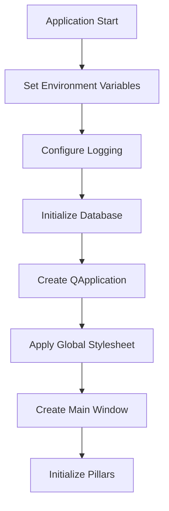
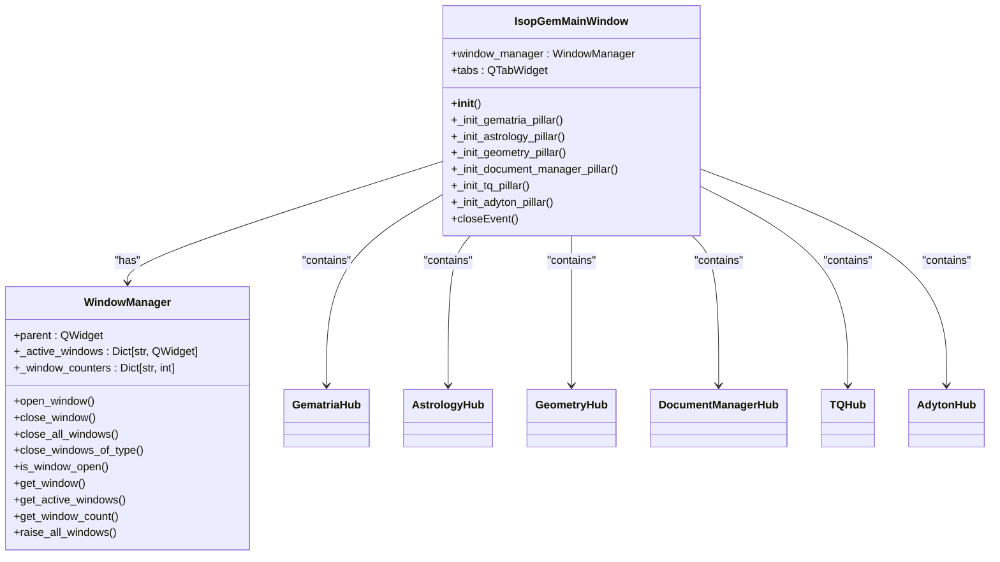
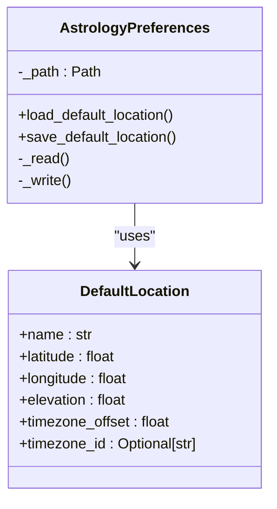
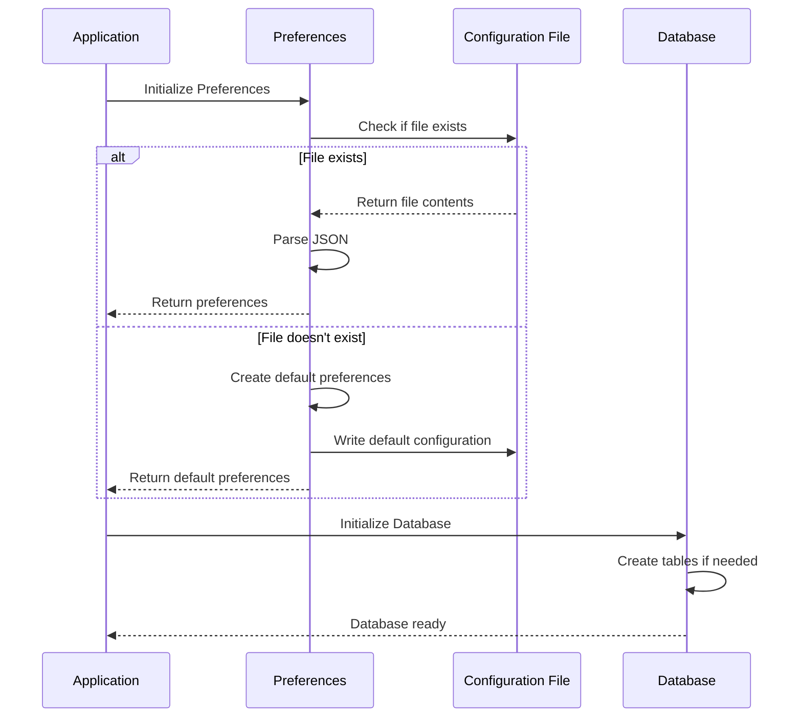
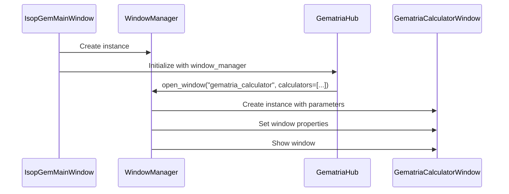

# Configuration Management

<cite>
**Referenced Files in This Document**   
- [main.py](file://src/main.py)
- [window_manager.py](file://src/shared/ui/window_manager.py)
- [preferences.py](file://src/pillars/astrology/utils/preferences.py)
- [theme.py](file://src/shared/ui/theme.py)
- [database.py](file://src/shared/database.py)
- [gematria_hub.py](file://src/pillars/gematria/ui/gematria_hub.py)
- [current_transit_window.py](file://src/pillars/astrology/ui/current_transit_window.py)
- [geometry_calculator_window.py](file://src/pillars/geometry/ui/geometry_calculator_window.py)
</cite>

## Table of Contents
1. [Introduction](#introduction)
2. [Configuration Initialization and Application-Wide Settings](#configuration-initialization-and-application-wide-settings)
3. [Main Window and Pillar-Specific Configuration](#main-window-and-pillar-specific-configuration)
4. [Preference Systems in Pillars](#preference-systems-in-pillars)
5. [Configuration State Persistence](#configuration-state-persistence)
6. [Configuration Injection Patterns](#configuration-injection-patterns)
7. [Extending Configuration Options](#extending-configuration-options)
8. [Conclusion](#conclusion)

## Introduction
The isopgem application implements a comprehensive configuration management system that enables flexible initialization, access, and persistence of application-wide settings across multiple specialized pillars. This documentation details how configuration is managed throughout the application, focusing on the main window's role in coordinating pillar-specific configurations, the implementation of preference systems within individual pillars like Astrology, and the mechanisms for maintaining configuration state across sessions. The system employs various patterns for configuration injection and state persistence, allowing for extensible configuration options that can be accessed consistently across different components.

## Configuration Initialization and Application-Wide Settings
The isopgem application initializes its configuration through a well-defined entry point in `main.py`, where the application-wide settings are established before the main window is created. The initialization process begins with setting environment variables for Qt platform preferences, ensuring consistent behavior across different operating systems.

Application-wide settings are initialized in the `main()` function, which configures logging, initializes the database, and sets up the application's global stylesheet. The `get_app_stylesheet()` function from `theme.py` provides a consistent visual theme across all components, defining color palettes, font families, and UI element styling that are applied application-wide.

**Diagram sources**
- [main.py](file://src/main.py#L113-L156)
- [theme.py](file://src/shared/ui/theme.py#L39-L313)

**Section sources**
- [main.py](file://src/main.py#L1-L156)
- [theme.py](file://src/shared/ui/theme.py#L1-L372)

## Main Window and Pillar-Specific Configuration
The main window serves as the central coordinator for configuration management across all pillars in the isopgem application. The `IsopGemMainWindow` class in `main.py` acts as the container for all pillar-specific configurations, managing their initialization and lifecycle.

Each pillar is initialized through dedicated methods such as `_init_gematria_pillar()`, `_init_astrology_pillar()`, and others, which create instances of pillar-specific hub classes and add them as tabs to the main window. The window manager is passed to each pillar during initialization, enabling consistent window management and configuration sharing across the application.

The main window also handles application-level configuration such as window sizing, title setting, and icon management. It establishes the tab-based navigation system that allows users to switch between different pillars, each with their own configuration context.

**Diagram sources**
- [main.py](file://src/main.py#L26-L111)
- [window_manager.py](file://src/shared/ui/window_manager.py#L15-L221)

**Section sources**
- [main.py](file://src/main.py#L26-L111)
- [window_manager.py](file://src/shared/ui/window_manager.py#L1-L221)

## Preference Systems in Pillars
The isopgem application implements pillar-specific preference systems to manage configuration settings relevant to each domain. The Astrology pillar provides a clear example of this approach with its dedicated preferences system in `src/pillars/astrology/utils/preferences.py`.

The `AstrologyPreferences` class uses a JSON-backed storage system to persist user preferences, with a dedicated `DefaultLocation` dataclass to structure location-related settings. This preference system allows users to save and retrieve default location information, including name, coordinates, elevation, and timezone details.

Other pillars implement similar preference patterns tailored to their specific needs. For example, the Geometry pillar includes configuration options for measurement display, such as font size, line color, and text color, which are managed through UI controls in the `geometry_calculator_window.py` file.

**Diagram sources**
- [preferences.py](file://src/pillars/astrology/utils/preferences.py#L24-L59)

**Section sources**
- [preferences.py](file://src/pillars/astrology/utils/preferences.py#L1-L59)
- [geometry_calculator_window.py](file://src/pillars/geometry/ui/geometry_calculator_window.py#L678-L877)

## Configuration State Persistence
The isopgem application employs multiple strategies for persisting configuration state across sessions. The primary mechanism is file-based persistence using JSON format for user preferences, as demonstrated by the Astrology pillar's preference system.

The application creates a dedicated data directory at startup, ensuring that configuration files are stored in a consistent location. The `AstrologyPreferences` class automatically creates the necessary directory structure and handles file I/O operations with appropriate error handling for cases where the preferences file doesn't exist or contains invalid JSON.

Database persistence is used for more complex configuration and user data through the SQLAlchemy ORM system defined in `src/shared/database.py`. This system initializes an SQLite database at application startup and manages connections through a session factory, allowing for persistent storage of user data and application state.

**Diagram sources**
- [preferences.py](file://src/pillars/astrology/utils/preferences.py#L24-L59)
- [database.py](file://src/shared/database.py#L1-L53)

**Section sources**
- [preferences.py](file://src/pillars/astrology/utils/preferences.py#L1-L59)
- [database.py](file://src/shared/database.py#L1-L53)

## Configuration Injection Patterns
The isopgem application employs several patterns for injecting configuration into components, with the window manager serving as a central mechanism for configuration sharing. The window manager is passed to each pillar during initialization, allowing all components to access shared services and configuration state.

Configuration injection occurs through constructor parameters, as seen in the `GematriaHub` class which receives the window manager as a parameter. This pattern enables dependency injection without creating tight coupling between components.

The application also uses configuration injection through method parameters, particularly when opening new windows. The `open_window()` method of the `WindowManager` class accepts arbitrary arguments and keyword arguments that are passed to the window constructor, allowing for flexible configuration of new components.

**Diagram sources**
- [main.py](file://src/main.py#L26-L111)
- [window_manager.py](file://src/shared/ui/window_manager.py#L15-L221)
- [gematria_hub.py](file://src/pillars/gematria/ui/gematria_hub.py#L49-L352)

**Section sources**
- [main.py](file://src/main.py#L26-L111)
- [window_manager.py](file://src/shared/ui/window_manager.py#L15-L221)
- [gematria_hub.py](file://src/pillars/gematria/ui/gematria_hub.py#L49-L352)

## Extending Configuration Options
Adding new configuration options in the isopgem application follows a consistent pattern across pillars. New options can be added by extending existing preference classes or creating new ones for specialized needs.

To add a new configuration option, developers typically:
1. Define the new configuration parameter in the appropriate preference class
2. Implement methods to load and save the new option
3. Add UI controls to allow users to modify the setting
4. Connect the UI controls to the underlying configuration model

For example, adding a new preference to the Astrology pillar would involve extending the `AstrologyPreferences` class with a new method pair for the specific setting, similar to the existing `load_default_location()` and `save_default_location()` methods.

Configuration options are accessed across components through the shared window manager or by direct instantiation of preference classes with appropriate file paths. This ensures consistent access to configuration state regardless of the component's location in the application hierarchy.

**Section sources**
- [preferences.py](file://src/pillars/astrology/utils/preferences.py#L24-L59)
- [window_manager.py](file://src/shared/ui/window_manager.py#L15-L221)

## Conclusion
The isopgem application implements a robust configuration management system that effectively balances application-wide settings with pillar-specific preferences. The main window serves as the central coordinator, initializing and managing configuration for all pillars while providing a consistent user experience. The preference system, exemplified by the Astrology pillar's JSON-backed storage, enables persistent configuration state across sessions. Configuration injection through the window manager and constructor parameters allows for flexible and maintainable code organization. The architecture supports easy extension of configuration options, making it adaptable to future requirements while maintaining consistency across the application.