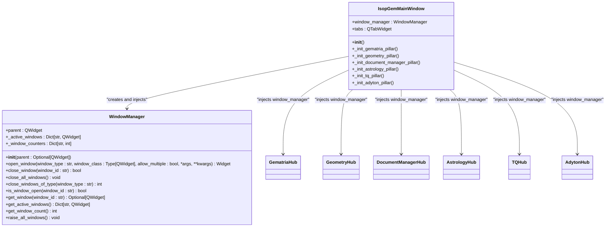

# Cross-Cutting Concerns and Integration

<cite>
**Referenced Files in This Document**   
- [main.py](file://src/main.py)
- [database.py](file://src/shared/database.py)
- [window_manager.py](file://src/shared/ui/window_manager.py)
- [theme.py](file://src/shared/ui/theme.py)
- [openastro_service.py](file://src/pillars/astrology/services/openastro_service.py)
- [sqlite_calculation_repository.py](file://src/pillars/gematria/repositories/sqlite_calculation_repository.py)
- [preferences.py](file://src/pillars/astrology/utils/preferences.py)
- [ARCHITECTURE.md](file://config/ARCHITECTURE.md)
- [solid_payload.py](file://src/pillars/geometry/shared/solid_payload.py)
</cite>

## Table of Contents
1. [Introduction](#introduction)
2. [Shared Resource Injection](#shared-resource-injection)
3. [Shared Directory and Common Components](#shared-directory-and-common-components)
4. [Configuration Management](#configuration-management)
5. [Error Handling Strategies](#error-handling-strategies)
6. [External System Integration](#external-system-integration)
7. [Extension Guidance](#extension-guidance)
8. [Conclusion](#conclusion)

## Introduction
The isopgem application implements a domain-pillar architecture with five main pillars: Gematria, Geometry, Document Manager, Astrology, and TQ (Trigrammaton QBLH). This architectural documentation focuses on the cross-cutting concerns and integration patterns that enable these pillars to share resources, maintain consistency, and reduce duplication. The system employs a centralized approach to managing shared resources such as database connections and window management, while providing a common foundation through the shared/ directory for UI components, utilities, and models.

**Section sources**
- [ARCHITECTURE.md](file://config/ARCHITECTURE.md#L1-L51)

## Shared Resource Injection
The isopgem application implements a dependency injection pattern for shared resources, primarily through the window manager and database connection. The main application entry point in main.py creates a centralized window manager instance that is injected into each pillar during initialization. This ensures consistent window lifecycle management across all pillars.

**Diagram sources **
- [main.py](file://src/main.py#L26-L111)
- [window_manager.py](file://src/shared/ui/window_manager.py#L15-L221)

The window manager provides a comprehensive API for opening, closing, and managing tool windows across the application. Each pillar receives the same window manager instance, ensuring that window lifecycle operations are coordinated and consistent. The window manager tracks active windows by ID, supports multiple instances of the same window type, and provides methods to close all windows or windows of a specific type.

Database connection management is similarly centralized through the shared/database.py module. The database module creates a single SQLAlchemy engine and session factory that are used throughout the application. The init_db() function initializes the database tables and is called from the main application entry point, ensuring that the database is set up before any pillar attempts to use it.

**Diagram sources **
- [database.py](file://src/shared/database.py#L1-L53)
- [sqlite_calculation_repository.py](file://src/pillars/gematria/repositories/sqlite_calculation_repository.py#L1-L143)

**Section sources**
- [main.py](file://src/main.py#L122-L122)
- [database.py](file://src/shared/database.py#L1-L53)
- [window_manager.py](file://src/shared/ui/window_manager.py#L15-L221)

## Shared Directory and Common Components
The shared/ directory serves as the central repository for components used across multiple pillars, promoting code reuse and consistency. This directory is organized into subdirectories for models, UI components, and utilities, each containing modules that can be imported by any pillar.

The shared/ui directory contains common UI components and services, including the window manager, theme, and virtual keyboard. The window manager, as previously discussed, provides centralized window lifecycle management. The theme module defines a consistent visual style for the entire application, including color palettes and widget styling. The virtual keyboard provides a customizable keyboard interface that can be configured for different esoteric systems.

**Diagram sources **
- [theme.py](file://src/shared/ui/theme.py#L1-L372)
- [keyboard_layouts.py](file://src/shared/ui/keyboard_layouts.py#L1-L69)

The shared/models directory contains data models that are used across multiple pillars. While the current implementation shows only an empty __init__.py file, the architecture supports the addition of shared data structures that can be imported by any pillar. This promotes consistency in data representation and reduces duplication of model definitions.

The shared/utils directory contains general utility functions that can be used throughout the application. Like the models directory, this is currently empty but provides a designated location for utility functions that don't belong to a specific pillar.

**Section sources**
- [theme.py](file://src/shared/ui/theme.py#L1-L372)
- [keyboard_layouts.py](file://src/shared/ui/keyboard_layouts.py#L1-L69)
- [models/__init__.py](file://src/shared/models/__init__.py)
- [utils/__init__.py](file://src/shared/utils/__init__.py)

## Configuration Management
Configuration management in the isopgem application is handled through a combination of application-wide settings and pillar-specific preferences. The main application entry point in main.py applies a global stylesheet to the entire application, ensuring a consistent visual theme across all pillars.

Pillar-specific configuration is managed through dedicated preferences modules. For example, the astrology pillar has a preferences.py module that provides a JSON-backed store for user preferences. This module defines a DefaultLocation dataclass and an AstrologyPreferences class that handles reading and writing preferences to a JSON file.

**Diagram sources **
- [preferences.py](file://src/pillars/astrology/utils/preferences.py#L1-L59)

The OpenAstroService class in the astrology pillar also manages configuration through its default_settings mechanism. The service maintains a dictionary of default settings that can be overridden by user preferences. This allows the application to provide sensible defaults while still supporting customization.

**Diagram sources **
- [openastro_service.py](file://src/pillars/astrology/services/openastro_service.py#L1-L254)

**Section sources**
- [preferences.py](file://src/pillars/astrology/utils/preferences.py#L1-L59)
- [openastro_service.py](file://src/pillars/astrology/services/openastro_service.py#L1-L254)

## Error Handling Strategies
The isopgem application implements a comprehensive error handling strategy that spans multiple layers and pillars. At the UI level, exceptions are caught and displayed to the user through QMessageBox dialogs. This pattern is consistently applied across different pillars to ensure a uniform user experience when errors occur.

In the astrology pillar, window classes such as NatalChartWindow and CurrentTransitWindow implement try-except blocks around critical operations. When an exception occurs, it is caught and displayed to the user through a QMessageBox critical dialog. This prevents the application from crashing while still informing the user of the error.

**Diagram sources **
- [natal_chart_window.py](file://src/pillars/astrology/ui/natal_chart_window.py)
- [current_transit_window.py](file://src/pillars/astrology/ui/current_transit_window.py)

At the service level, the OpenAstroService class wraps low-level exceptions from the OpenAstro2 library in custom exception types. This provides a clean API surface for the UI layer while still preserving the underlying error information. The ChartComputationError exception is raised when the OpenAstro2 library fails to compute a chart, allowing the UI layer to handle the error appropriately.

The repository layer also implements error handling through the use of context managers and transaction management. The SQLiteCalculationRepository class uses a context manager to ensure that database transactions are properly committed or rolled back. If an exception occurs during a database operation, the transaction is rolled back and the exception is propagated to the caller.

**Section sources**
- [openastro_service.py](file://src/pillars/astrology/services/openastro_service.py#L1-L254)
- [sqlite_calculation_repository.py](file://src/pillars/gematria/repositories/sqlite_calculation_repository.py#L1-L143)
- [document_editor_window.py](file://src/pillars/document_manager/ui/document_editor_window.py)
- [document_library.py](file://src/pillars/document_manager/ui/document_library.py)

## External System Integration
The isopgem application integrates with external systems for astrology calculations and persistent storage. The primary external integration is with the OpenAstro2 library, which provides the core functionality for generating astrological charts. This integration is managed through the OpenAstroService class in the astrology pillar.

The OpenAstroService class acts as a wrapper around the OpenAstro2 library, isolating the application from direct dependencies on the library. This allows for easier testing and provides a clean API surface for the rest of the application. The service handles the conversion of application-specific data structures to the format expected by OpenAstro2 and vice versa.

**Diagram sources **
- [openastro_service.py](file://src/pillars/astrology/services/openastro_service.py#L1-L254)

For persistent storage, the application uses SQLite through SQLAlchemy. The shared/database.py module creates a single database engine that is used by all pillars. Each pillar that requires persistent storage implements a repository pattern to interact with the database. For example, the gematria pillar uses the SQLiteCalculationRepository class to store and retrieve calculation records.

The repository pattern provides a clean separation between the business logic and the data access layer. This allows the application to change the underlying storage mechanism without affecting the rest of the codebase. The SQLiteCalculationRepository class implements CRUD operations and search functionality for calculation records, providing a consistent API for accessing the database.

**Section sources**
- [openastro_service.py](file://src/pillars/astrology/services/openastro_service.py#L1-L254)
- [database.py](file://src/shared/database.py#L1-L53)
- [sqlite_calculation_repository.py](file://src/pillars/gematria/repositories/sqlite_calculation_repository.py#L1-L143)

## Extension Guidance
To extend the cross-cutting concerns in the isopgem application, developers should follow the established patterns for shared resource injection, configuration management, and error handling. When adding new features that require shared resources, the existing window manager and database connection should be used rather than creating new instances.

For new UI components that will be used across multiple pillars, the shared/ui directory should be extended with the appropriate module. This ensures that the component is available to all pillars and promotes consistency in the user interface. Similarly, shared data models should be added to the shared/models directory, and general utility functions should be placed in the shared/utils directory.

When integrating with external systems, a service class should be created to wrap the external library and provide a clean API surface. This service should handle any necessary data conversion and error handling, isolating the rest of the application from the complexities of the external system. Configuration for the service should be managed through a preferences module, following the pattern established by the astrology pillar.

For persistent storage, the repository pattern should be followed. A new repository class should be created that implements the necessary CRUD operations and search functionality. This class should use the shared database connection and session factory to ensure consistency with the rest of the application.

**Section sources**
- [main.py](file://src/main.py#L1-L156)
- [database.py](file://src/shared/database.py#L1-L53)
- [window_manager.py](file://src/shared/ui/window_manager.py#L1-L221)
- [openastro_service.py](file://src/pillars/astrology/services/openastro_service.py#L1-L254)
- [sqlite_calculation_repository.py](file://src/pillars/gematria/repositories/sqlite_calculation_repository.py#L1-L143)

## Conclusion
The isopgem application demonstrates a well-structured approach to managing cross-cutting concerns and integration patterns. By centralizing shared resources such as the window manager and database connection, the application promotes consistency and reduces duplication across its five main pillars. The shared/ directory provides a foundation for common UI components, utilities, and models, while the repository pattern ensures a clean separation between business logic and data access.

Configuration management is handled through a combination of application-wide settings and pillar-specific preferences, allowing for both consistency and customization. Error handling strategies span multiple layers and pillars, providing a robust user experience even when errors occur. Integration with external systems is managed through service classes that wrap external libraries and provide clean API surfaces.

These patterns provide a solid foundation for extending the application with new features while maintaining consistency and reducing technical debt.