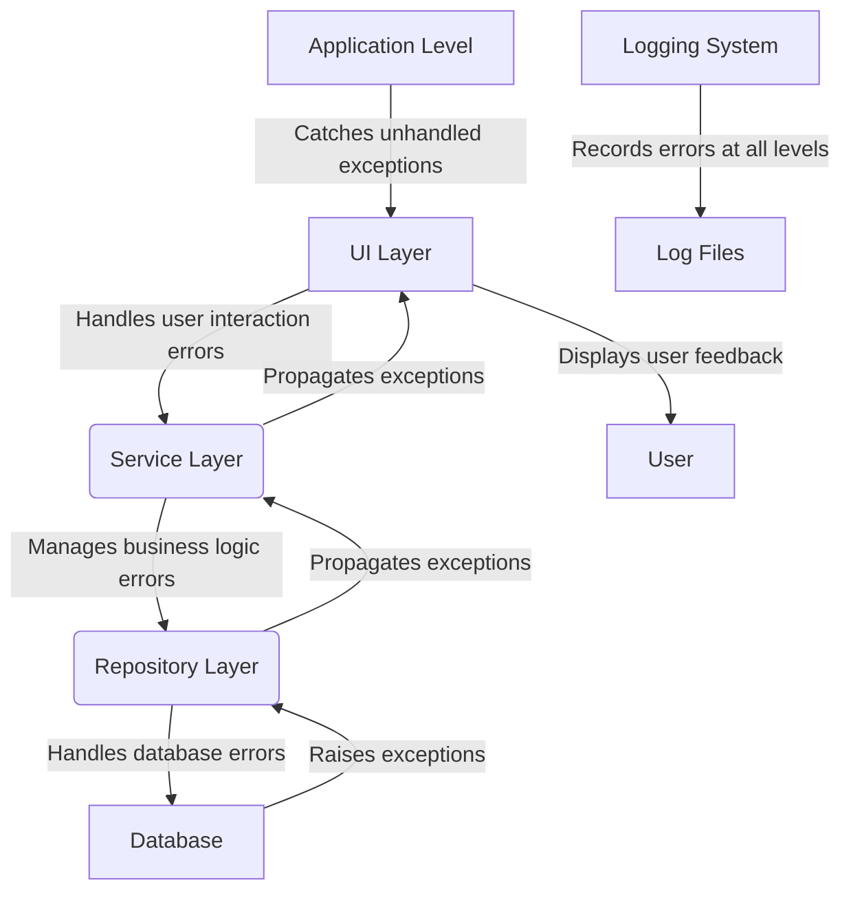

# Error Handling Strategy

<cite>
**Referenced Files in This Document**   
- [main.py](file://src/main.py)
- [database.py](file://src/shared/database.py)
- [calculation_service.py](file://src/pillars/gematria/services/calculation_service.py)
- [sqlite_calculation_repository.py](file://src/pillars/gematria/repositories/sqlite_calculation_repository.py)
- [document_service.py](file://src/pillars/document_manager/services/document_service.py)
- [chart_storage_service.py](file://src/pillars/astrology/services/chart_storage_service.py)
- [document_editor_window.py](file://src/pillars/document_manager/ui/document_editor_window.py)
- [verification_seal.py](file://scripts/verification_seal.py)
- [AUDIT_REPORT.md](file://AUDIT_REPORT.md)
</cite>

## Table of Contents
1. [Introduction](#introduction)
2. [Error Handling Architecture](#error-handling-architecture)
3. [Layered Error Handling Strategy](#layered-error-handling-strategy)
4. [Logging Practices](#logging-practices)
5. [UI Error Feedback](#ui-error-feedback)
6. [Service Layer Error Handling](#service-layer-error-handling)
7. [Repository Layer Error Handling](#repository-layer-error-handling)
8. [Application-Level Exception Management](#application-level-exception-management)
9. [Best Practices for New Features](#best-practices-for-new-features)
10. [Known Issues and Recommendations](#known-issues-and-recommendations)

## Introduction

The isopgem application implements a comprehensive error handling strategy across its architecture, with distinct patterns at different layers of the application. The system follows a layered approach to exception management, with specific handling mechanisms at the UI, service, and repository layers. This document provides a detailed analysis of the error handling strategy, including logging practices, UI feedback mechanisms, and cross-layer exception propagation patterns.

The application uses Python's built-in logging module for diagnostic information and employs try-except blocks throughout the codebase to manage exceptions at appropriate levels. Error states are communicated to users through various UI feedback mechanisms, while unhandled exceptions are managed at the application level to prevent crashes and ensure graceful degradation.

**Section sources**
- [main.py](file://src/main.py#L1-L163)
- [AUDIT_REPORT.md](file://AUDIT_REPORT.md#L108-L135)

## Error Handling Architecture

The isopgem application follows a layered architecture with distinct error handling responsibilities at each level. The system implements a consistent pattern of exception handling that propagates errors from lower layers (repository) to higher layers (service, UI) while maintaining appropriate separation of concerns.

At the core of the error handling architecture is the use of context managers and proper exception propagation. The repository layer handles database-specific exceptions and ensures transaction integrity, while the service layer manages business logic exceptions and coordinates between different components. The UI layer is responsible for presenting user-friendly error messages and handling user interaction exceptions.

The application also implements application-level exception handling through the main entry point, which catches unhandled exceptions and prevents the application from crashing unexpectedly. This multi-layered approach ensures that errors are handled appropriately at each level of the application stack.



**Diagram sources**
- [main.py](file://src/main.py#L1-L163)
- [database.py](file://src/shared/database.py#L1-L54)

**Section sources**
- [main.py](file://src/main.py#L1-L163)
- [database.py](file://src/shared/database.py#L1-L54)

## Layered Error Handling Strategy

The isopgem application implements a layered error handling strategy with distinct patterns at each architectural level. Each layer has specific responsibilities for catching, handling, and propagating exceptions based on its role in the application.

### UI Layer Error Handling

The UI layer is responsible for handling user interaction errors and providing appropriate feedback to users. UI components use try-except blocks to catch exceptions that might occur during user interactions, such as invalid input or failed operations. When an error occurs, the UI layer typically displays a user-friendly message using dialog boxes or status indicators.

For example, in the document editor window, when fetching documents for a wiki link selector, the code uses a try-except block to handle potential exceptions:

```python
try:
    with document_service_context() as service:
        docs = service.get_all_documents_metadata()
except Exception as e:
    print(f"Error fetching docs: {e}")
    return
```

This pattern ensures that a failure to fetch documents doesn't crash the application but instead fails gracefully.

### Service Layer Error Handling

The service layer handles business logic exceptions and coordinates between different components. Service classes typically don't catch exceptions from repository calls but instead allow them to propagate upward, as they represent failures in business logic that need to be handled at a higher level.

Service methods often include validation logic and raise appropriate exceptions when business rules are violated. For example, the calculation service validates input parameters and raises exceptions when required data is missing or invalid.

### Repository Layer Error Handling

The repository layer is responsible for handling database-specific exceptions and ensuring transaction integrity. Repository classes use context managers to manage database sessions and transactions, ensuring that changes are properly committed or rolled back in case of errors.

The SQLite calculation repository implements a context manager that automatically handles transaction management:

```python
@contextmanager
def _session(self) -> Iterator[Session]:
    session = self._session_factory()
    try:
        yield session
        session.commit()
    except Exception:
        session.rollback()
        raise
    finally:
        session.close()
```

This pattern ensures that database transactions are properly managed, with automatic rollback in case of exceptions.

**Section sources**
- [document_editor_window.py](file://src/pillars/document_manager/ui/document_editor_window.py#L1-L329)
- [calculation_service.py](file://src/pillars/gematria/services/calculation_service.py#L1-L273)
- [sqlite_calculation_repository.py](file://src/pillars/gematria/repositories/sqlite_calculation_repository.py#L1-L143)

## Logging Practices

The isopgem application uses Python's built-in logging module for diagnostic information and error tracking. The logging configuration is set up in the main application entry point, with a DEBUG level and a specific format that includes timestamps, log levels, logger names, and messages.

### Logging Configuration

The main.py file configures the logging system with the following settings:

```python
logging.basicConfig(
    level=logging.DEBUG,
    format="%(asctime)s [%(levelname)s] %(name)s: %(message)s",
    force=True,
)
```

This configuration ensures that all log messages are captured with detailed information, including timestamps and the source module.

### Service Layer Logging

Service classes use logging to record important operations and potential issues. For example, the DocumentService class creates a logger instance and uses it to record various operations:

```python
logger = logging.getLogger(__name__)

# Used throughout the service methods
logger.debug("DocumentService: imported '%s' in %.1f ms", path.name, duration)
logger.info("DocumentService: Skipping import, file already exists: %s", path)
```

The service logs different levels of information:
- DEBUG: Detailed information about operations, typically used for debugging
- INFO: Confirmation that things are working as expected
- WARNING: Indication of potential issues that don't prevent operation
- ERROR: Error events that might still allow the application to continue
- CRITICAL: Very serious errors that might lead to application failure

### Logging Patterns

The application follows several consistent logging patterns:
1. Timing operations: Many service methods log the duration of operations to help identify performance issues
2. Input validation: Logging when invalid inputs are detected
3. State changes: Recording important state changes in the application
4. External interactions: Logging interactions with external systems like databases

The logging system provides valuable diagnostic information for troubleshooting issues and understanding application behavior.

**Section sources**
- [main.py](file://src/main.py#L122-L126)
- [document_service.py](file://src/pillars/document_manager/services/document_service.py#L1-L257)

## UI Error Feedback

The isopgem application implements several mechanisms to communicate error states to users through the UI. These mechanisms ensure that users are aware of issues without being overwhelmed by technical details.

### Dialog-Based Feedback

The application uses QMessageBox dialogs to present important error information to users. For example, when there are unsaved changes and the user attempts to close the document editor, a confirmation dialog is displayed:

```python
reply = QMessageBox.question(
    self, 
    "Unsaved Changes",
    "You have unsaved changes. Do you want to save them?",
    QMessageBox.StandardButton.Save | 
    QMessageBox.StandardButton.Discard | 
    QMessageBox.StandardButton.Cancel
)
```

This pattern provides users with clear choices and prevents accidental data loss.

### Status Indicators

Some UI components use status labels or indicators to show error states. For example, the 3D geometry window includes a status label that displays information about the current solid:

```python
self._status_label.setText(f"{vertex_count} vertices · {edge_count} edges · {face_count} faces")
```

While this example shows normal status information, similar patterns could be used to display error states.

### Silent Failures with Logging

In some cases, the application handles errors silently while logging the issue for diagnostic purposes. For example, when persisting node positions asynchronously, if an error occurs, it is logged but doesn't interrupt the user experience:

```python
except Exception as exc:  # pragma: no cover - defensive logging only
    print(f"Error saving node position: {exc}")
```

This approach prevents minor issues from disrupting the user workflow while still recording the problem for troubleshooting.

### Contextual Error Handling

The application handles errors in a context-appropriate manner. For example, when parsing user input, specific validation errors are caught and handled:

```python
try:
    value = int(item.text())
except ValueError:
    return
```

This prevents invalid input from causing application errors while providing immediate feedback by simply ignoring the invalid input.

**Section sources**
- [document_editor_window.py](file://src/pillars/document_manager/ui/document_editor_window.py#L1-L329)
- [wall_analytics_window.py](file://src/pillars/adyton/ui/wall_analytics_window.py#L290-L340)
- [mindscape_view.py](file://src/pillars/document_manager/ui/mindscape_view.py#L348-L359)

## Service Layer Error Handling

The service layer in the isopgem application implements a consistent pattern of error handling that focuses on business logic validation and exception propagation. Service classes are responsible for coordinating operations between different components and ensuring that business rules are enforced.

### Calculation Service Error Handling

The CalculationService class demonstrates typical service layer error handling patterns. The service methods include validation logic and handle specific exceptions that might occur during operation.

For example, the `get_breakdown_from_record` method includes error handling for JSON parsing:

```python
def get_breakdown_from_record(self, record: CalculationRecord) -> List[tuple]:
    if not record.breakdown:
        return []
    
    try:
        breakdown_data = json.loads(record.breakdown)
        # ... processing logic
        return parsed
    except Exception:
        # Any parsing problem -> return empty breakdown for robustness
        return []
```

This pattern ensures that a corrupted or invalid breakdown doesn't prevent the application from functioning, instead returning a safe default value.

### Document Service Error Handling

The DocumentService class implements more comprehensive error handling, including proper exception handling for file operations:

```python
def import_document(self, file_path: str, tags: Optional[str] = None, collection: Optional[str] = None) -> Document:
    start = time.perf_counter()
    path = Path(file_path)
    if not path.exists():
        raise FileNotFoundError(f"File not found: {file_path}")
```

The service validates inputs and raises appropriate exceptions when preconditions are not met. It also uses logging to record operations and potential issues.

### Error Propagation

Service classes typically don't catch exceptions from repository calls but instead allow them to propagate upward. This pattern ensures that database-level issues are handled at an appropriate level in the application stack. For example:

```python
def save_calculation(self, text: str, value: int, calculator: GematriaCalculator, ...) -> CalculationRecord:
    # ... preparation logic
    return self.repository.save(record)
```

The method doesn't include a try-except block around the repository call, allowing any exceptions to propagate to the caller.

### Transaction Management

While transaction management is primarily handled at the repository layer, service methods that perform multiple operations often coordinate transactions across multiple repositories. The service layer ensures that related operations are completed successfully or rolled back appropriately.

**Section sources**
- [calculation_service.py](file://src/pillars/gematria/services/calculation_service.py#L1-L273)
- [document_service.py](file://src/pillars/document_manager/services/document_service.py#L1-L257)

## Repository Layer Error Handling

The repository layer in the isopgem application is responsible for handling data access errors and ensuring data integrity. Repository classes implement patterns that protect against data corruption and ensure transactional consistency.

### Database Session Management

The shared database module provides context managers for managing database sessions:

```python
@contextmanager
def get_db_session():
    """Context manager wrapper around get_db() that always closes the session."""
    generator = get_db()
    db = next(generator)
    try:
        yield db
    finally:
        # Ensure generator cleanup runs even if user forgets
        try:
            generator.close()
        except StopIteration:
            pass
```

This pattern ensures that database sessions are always properly closed, even if an exception occurs.

### Transaction Management

Repository classes use context managers to manage transactions and ensure data consistency. The SQLite calculation repository implements a session context manager that automatically handles commits and rollbacks:

```python
@contextmanager
def _session(self) -> Iterator[Session]:
    session = self._session_factory()
    try:
        yield session
        session.commit()
    except Exception:
        session.rollback()
        raise
    finally:
        session.close()
```

This pattern ensures that:
1. Successful operations are committed to the database
2. Failed operations are rolled back, preventing partial updates
3. The session is always closed, preventing resource leaks
4. Exceptions are re-raised after rollback, allowing higher layers to handle them

### Error Handling in CRUD Operations

Repository methods implement specific error handling for different operations:

```python
def get_by_id(self, record_id: str) -> Optional[CalculationRecord]:
    """Fetch a record by primary key."""
    with self._session() as session:
        entity = session.get(CalculationEntity, record_id)
        return entity.to_record() if entity else None
```

The method returns None when a record is not found, which is a common pattern for handling expected "not found" conditions without raising exceptions.

For delete operations, the repository returns a boolean indicating success:

```python
def delete(self, record_id: str) -> bool:
    """Remove a record by ID."""
    with self._session() as session:
        entity = session.get(CalculationEntity, record_id)
        if not entity:
            return False
        session.delete(entity)
        session.flush()
        return True
```

This pattern allows callers to handle the "not found" case appropriately.

### Search and Query Error Handling

The repository implements robust error handling for search operations, particularly when filtering by tags:

```python
if tags:
    normalized_tags = {tag.strip().lower() for tag in tags if tag}
    records = [
        record
        for record in records
        if normalized_tags.intersection({t.lower() for t in record.tags})
    ]
```

The method handles edge cases like empty tags and performs case-insensitive matching, making the search functionality more robust.

**Section sources**
- [sqlite_calculation_repository.py](file://src/pillars/gematria/repositories/sqlite_calculation_repository.py#L1-L143)
- [database.py](file://src/shared/database.py#L1-L54)

## Application-Level Exception Management

The isopgem application implements application-level exception management to prevent crashes and ensure graceful degradation when unhandled exceptions occur.

### Main Application Error Handling

The main.py file sets up the application and includes error handling for the main event loop:

```python
def main():
    """Initialize and run the application."""
    logging.basicConfig(
        level=logging.DEBUG,
        format="%(asctime)s [%(levelname)s] %(name)s: %(message)s",
        force=True,
    )
    
    # Initialize Database
    init_db()
    
    # Create application instance
    app = QApplication(sys.argv)
    
    # Set up signal handler for Ctrl+C
    def signal_handler(sig, frame):
        """Handle interrupt signal (Ctrl+C)."""
        print("\nReceived interrupt signal, shutting down...")
        app.quit()
    
    signal.signal(signal.SIGINT, signal_handler)
    
    # Create and show main window
    window = IsopGemMainWindow()
    window.showMaximized()
    
    # Run application event loop
    sys.exit(app.exec())
```

The application configures a signal handler for Ctrl+C, allowing for graceful shutdown when the user interrupts the process.

### Test Framework Error Handling

The verification_seal.py script implements a comprehensive error handling pattern for test execution:

```python
def execute(self):
    Scribe.section(f"BEGINNING RITE: {self.name}")
    try:
        self.prepare()
        start_time = time.perf_counter()
        self.perform()
        end_time = time.perf_counter()
        
        duration = (end_time - start_time) * 1000
        Scribe.success(f"{self.name} completed in {duration:.2f}ms")
        
    except AssertionError as e:
        Scribe.failure(f"Logic Flaw Detected -> {str(e)}")
    except Exception as e:
        Scribe.failure(f"Catastrophic Error -> {str(e)}")
        traceback.print_exc()
    finally:
        self.cleanse()
```

This pattern:
1. Executes setup code in the try block
2. Handles assertion failures specifically, indicating logic flaws
3. Catches all other exceptions as "catastrophic errors"
4. Always executes cleanup code in the finally block
5. Prints the full traceback for catastrophic errors to aid debugging

### Graceful Degradation

The application implements graceful degradation in several areas. For example, when loading UI components, if a component fails to initialize, the application continues with the remaining components:

```python
def _init_gematria_pillar(self):
    """Initialize the Gematria pillar."""
    gematria_hub = GematriaHub(self.window_manager)
    self.tabs.addTab(gematria_hub, "📖 Gematria")
```

If the GematriaHub initialization fails, it would raise an exception that might prevent the entire application from starting. However, the pattern suggests that each pillar is initialized independently, allowing for potential isolation of failures.

### Unhandled Exception Prevention

The application uses several strategies to prevent unhandled exceptions:
1. Comprehensive logging to capture diagnostic information
2. Graceful error handling in UI components
3. Transaction management to prevent data corruption
4. Input validation to prevent invalid data from causing errors
5. Default values for potentially problematic operations

These strategies work together to create a robust application that can handle unexpected conditions without crashing.

**Section sources**
- [main.py](file://src/main.py#L1-L163)
- [verification_seal.py](file://scripts/verification_seal.py#L50-L87)

## Best Practices for New Features

When implementing new features in the isopgem application, developers should follow established error handling patterns to maintain consistency and reliability.

### Consistent Exception Handling

New code should follow the established patterns for exception handling:
1. Use specific exception types rather than bare `except:` clauses
2. Handle exceptions at the appropriate layer
3. Use logging to record important operations and errors
4. Provide meaningful error messages to users
5. Ensure resource cleanup in finally blocks or context managers

### Logging Guidelines

When adding logging to new features:
1. Use the appropriate log level (DEBUG, INFO, WARNING, ERROR, CRITICAL)
2. Include relevant context in log messages
3. Log operation durations for performance monitoring
4. Use consistent formatting and terminology
5. Avoid logging sensitive information

### UI Error Feedback

When implementing UI error handling:
1. Use QMessageBox for important user notifications
2. Provide clear, actionable error messages
3. Handle input validation gracefully
4. Use status indicators for ongoing operations
5. Consider the user experience when handling errors

### Service Layer Patterns

When implementing service methods:
1. Validate inputs and raise appropriate exceptions
2. Use logging to record important operations
3. Allow repository exceptions to propagate when appropriate
4. Implement transaction management for multi-step operations
5. Return meaningful results even when operations partially fail

### Repository Layer Patterns

When implementing repository methods:
1. Use context managers for database sessions
2. Implement proper transaction management
3. Handle database-specific exceptions appropriately
4. Return consistent results for "not found" conditions
5. Ensure resource cleanup in all code paths

By following these best practices, developers can ensure that new features integrate seamlessly with the existing error handling strategy and maintain the application's reliability and user experience.

**Section sources**
- [main.py](file://src/main.py#L1-L163)
- [calculation_service.py](file://src/pillars/gematria/services/calculation_service.py#L1-L273)
- [document_service.py](file://src/pillars/document_manager/services/document_service.py#L1-L257)

## Known Issues and Recommendations

Based on the code analysis, several issues and areas for improvement have been identified in the current error handling strategy.

### Current Issues

1. **Use of bare `except:` clauses**: The AUDIT_REPORT.md identifies the use of bare `except:` clauses which can catch system exceptions like KeyboardInterrupt and SystemExit, potentially preventing graceful shutdown.

2. **Debug prints in production**: The application contains numerous `print()` statements in UI modules, which can slow down UI interactions and make logs noisy. The AUDIT_REPORT.md recommends converting these to proper logging statements.

3. **Inconsistent error handling**: Some components use `print()` for error reporting while others use proper logging, leading to inconsistent diagnostic information.

4. **Missing specific exception handling**: In some cases, broad exception handling is used instead of catching specific exception types, making it difficult to distinguish between different error conditions.

### Recommendations

1. **Replace bare except clauses**: Replace bare `except:` clauses with specific exception types to avoid catching system exceptions and to provide more targeted error handling.

2. **Convert print statements to logging**: Replace all `print()` statements with appropriate logging calls using the logging module. This will provide better control over log levels and output.

3. **Implement rate-limited logging**: For operations that might generate frequent log messages (such as mouse events), implement rate limiting to prevent log flooding.

4. **Standardize error handling patterns**: Establish and document standard error handling patterns for each layer of the application to ensure consistency.

5. **Improve error message clarity**: Ensure that error messages provide clear, actionable information for users and sufficient context for developers.

6. **Implement structured logging**: Consider implementing structured logging with additional context information to make log analysis easier.

7. **Add error monitoring**: Implement a system for monitoring and alerting on critical errors in production.

8. **Enhance user feedback**: Improve UI error feedback by providing more detailed information about errors and suggested actions when appropriate.

By addressing these issues and implementing the recommendations, the application can improve its reliability, maintainability, and user experience.

**Section sources**
- [AUDIT_REPORT.md](file://AUDIT_REPORT.md#L108-L135)
- [mindscape_view.py](file://src/pillars/document_manager/ui/mindscape_view.py#L348-L359)
- [document_editor_window.py](file://src/pillars/document_manager/ui/document_editor_window.py#L54-L56)