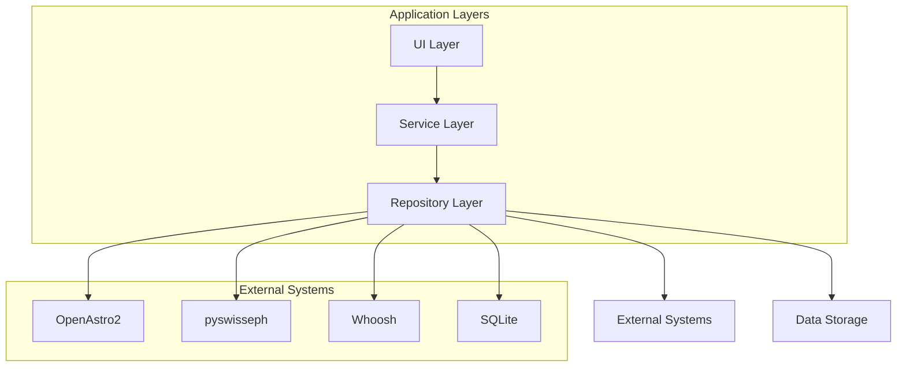
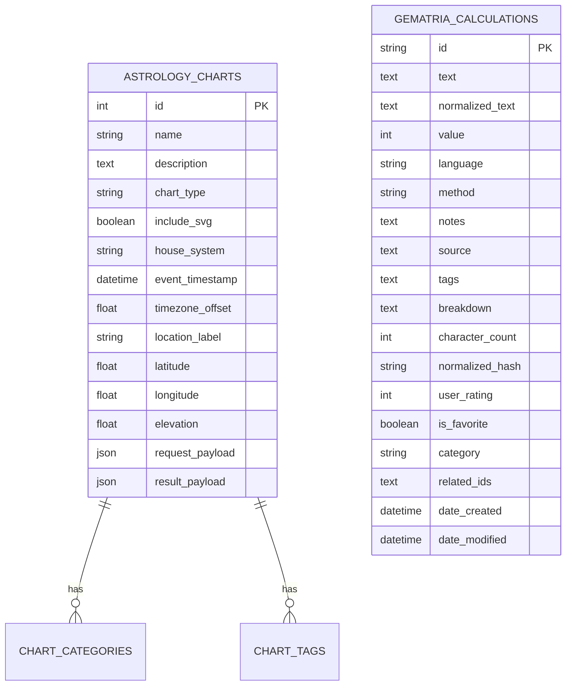

# External System Integrations

<cite>
**Referenced Files in This Document**   
- [openastro_service.py](file://src/pillars/astrology/services/openastro_service.py)
- [chart_repository.py](file://src/pillars/astrology/repositories/chart_repository.py)
- [calculation_repository.py](file://src/pillars/gematria/repositories/calculation_repository.py)
- [sqlite_calculation_repository.py](file://src/pillars/gematria/repositories/sqlite_calculation_repository.py)
- [search_repository.py](file://src/pillars/document_manager/repositories/search_repository.py)
- [database.py](file://src/shared/database.py)
- [chart_models.py](file://src/pillars/astrology/models/chart_models.py)
- [chart_record.py](file://src/pillars/astrology/models/chart_record.py)
- [calculation_entity.py](file://src/pillars/gematria/models/calculation_entity.py)
- [calculation_record.py](file://src/pillars/gematria/models/calculation_record.py)
- [chart_storage_service.py](file://src/pillars/astrology/services/chart_storage_service.py)
- [calculation_service.py](file://src/pillars/gematria/services/calculation_service.py)
- [document_repository.py](file://src/pillars/document_manager/repositories/document_repository.py)
- [requirements.txt](file://requirements.txt)
</cite>

## Table of Contents
1. [Introduction](#introduction)
2. [Integration Architecture](#integration-architecture)
3. [OpenAstro2 Integration](#openastro2-integration)
4. [pyswisseph Integration](#pyswisseph-integration)
5. [Whoosh Integration](#whoosh-integration)
6. [SQLite Integration](#sqlite-integration)
7. [Service Layer Abstraction](#service-layer-abstraction)
8. [Data Exchange Formats](#data-exchange-formats)
9. [Error Handling](#error-handling)
10. [Configuration Requirements](#configuration-requirements)
11. [Extensibility and Replacement](#extensibility-and-replacement)
12. [Conclusion](#conclusion)

## Introduction

The isopgem application integrates with several external systems to provide specialized functionality for astrological calculations, celestial data processing, full-text search, and persistent storage. This document details how these integrations are implemented, focusing on the abstraction layers that separate the core application logic from the external dependencies. The integration points are designed to be modular, allowing for potential replacement of backend systems while maintaining a consistent interface for the application.

The primary external systems integrated into isopgem are:
- **OpenAstro2**: For generating astrological charts and calculations
- **pyswisseph**: For providing celestial data used by OpenAstro2
- **Whoosh**: For full-text search capabilities across gematria calculations and documents
- **SQLite**: For persistent storage of application data

These integrations are abstracted through service layers and repository patterns, ensuring that the application can function with different backend implementations and providing resilience against external system failures.

**Section sources**
- [requirements.txt](file://requirements.txt#L21-L24)

## Integration Architecture

The integration architecture in isopgem follows a layered approach with clear separation of concerns. At the core is the repository pattern, which provides an abstraction layer between the application's business logic and the external systems. This pattern allows the application to interact with data storage and external services through a consistent interface, regardless of the underlying implementation.

The architecture consists of three main layers:
1. **Service Layer**: Provides high-level business logic and coordinates operations across multiple repositories
2. **Repository Layer**: Abstracts the interaction with external systems and data storage
3. **Model Layer**: Defines the data structures used throughout the application

This layered approach enables the application to maintain a clean separation between business logic and infrastructure concerns, making it easier to test, maintain, and extend the system.



**Diagram sources**
- [openastro_service.py](file://src/pillars/astrology/services/openastro_service.py#L31-L254)
- [calculation_repository.py](file://src/pillars/gematria/repositories/calculation_repository.py#L16-L329)
- [sqlite_calculation_repository.py](file://src/pillars/gematria/repositories/sqlite_calculation_repository.py#L16-L143)
- [search_repository.py](file://src/pillars/document_manager/repositories/search_repository.py#L15-L201)

**Section sources**
- [openastro_service.py](file://src/pillars/astrology/services/openastro_service.py#L31-L254)
- [calculation_repository.py](file://src/pillars/gematria/repositories/calculation_repository.py#L16-L329)
- [sqlite_calculation_repository.py](file://src/pillars/gematria/repositories/sqlite_calculation_repository.py#L16-L143)

## OpenAstro2 Integration

The integration with OpenAstro2 is implemented through the `OpenAstroService` class, which serves as a wrapper around the OpenAstro2 library. This service provides a clean API for generating astrological charts while handling the complexities of the underlying library.

The service is responsible for:
- Converting application-specific data models to the format expected by OpenAstro2
- Managing the lifecycle of chart generation
- Extracting relevant data from the generated charts
- Handling errors that occur during chart computation

The integration uses a request-response pattern, where a `ChartRequest` object is passed to the `generate_chart` method, which returns a `ChartResult` object containing the computed chart data.

```python
class OpenAstroService:
    def generate_chart(self, request: ChartRequest) -> ChartResult:
        """Generate a chart with OpenAstro2 based on the supplied request."""
        primary = self._to_openastro_event(request.primary_event)
        secondary = (
            self._to_openastro_event(request.reference_event)
            if request.reference_event
            else None
        )
        
        chart_settings = (
            copy.deepcopy(request.settings)
            if request.settings is not None
            else self.default_settings()
        )
        
        try:
            chart_args: List[Any] = [primary]
            if secondary is not None:
                chart_args.append(secondary)
            chart = openAstro(*chart_args, type=request.chart_type, settings=chart_settings)
            self._prime_chart(chart)
        except Exception as exc:
            raise ChartComputationError("OpenAstro2 failed to compute the chart") from exc
        
        return self._build_chart_result(chart, request)
```

The service also provides methods for listing supported house systems and accessing default settings, making it easy for the UI layer to present options to users.

**Section sources**
- [openastro_service.py](file://src/pillars/astrology/services/openastro_service.py#L31-L254)
- [chart_models.py](file://src/pillars/astrology/models/chart_models.py#L74-L133)

## pyswisseph Integration

The pyswisseph library is used as the underlying engine for celestial calculations in OpenAstro2. While isopgem does not interact with pyswisseph directly, it is a critical dependency for the OpenAstro2 integration.

pyswisseph provides the astronomical algorithms and ephemeris data needed to calculate planetary positions, aspects, and other astrological elements. OpenAstro2 uses pyswisseph to perform the actual computations, while isopgem interacts with OpenAstro2 through the `OpenAstroService` wrapper.

The integration is transparent to the isopgem application, as all interactions with celestial data are mediated through the OpenAstro2 service. This abstraction allows the application to benefit from the accuracy and reliability of pyswisseph without having to manage its API directly.

The dependency on pyswisseph is declared in the `requirements.txt` file, ensuring that it is installed alongside OpenAstro2.

**Section sources**
- [requirements.txt](file://requirements.txt#L23)
- [openastro_service.py](file://src/pillars/astrology/services/openastro_service.py#L17-L20)

## Whoosh Integration

Whoosh is integrated into isopgem to provide full-text search capabilities for gematria calculations and documents. The integration is implemented through two repository classes: `CalculationRepository` for gematria calculations and `DocumentSearchRepository` for document search.

The `CalculationRepository` uses Whoosh to index and search gematria calculation records, allowing users to search by text, notes, source, and other metadata fields. The repository defines a schema that specifies which fields should be indexed and how they should be stored.

```python
class CalculationRepository:
    def __init__(self, index_dir: Optional[str] = None):
        self.schema = Schema(
            id=ID(stored=True, unique=True),
            text=TEXT(stored=True),
            normalized_text=TEXT(stored=True),
            value=NUMERIC(stored=True, sortable=True),
            language=TEXT(stored=True),
            method=TEXT(stored=True),
            date_created=DATETIME(stored=True, sortable=True),
            date_modified=DATETIME(stored=True, sortable=True),
            notes=TEXT(stored=True),
            source=TEXT(stored=True),
            tags=KEYWORD(stored=True, commas=True, scorable=True),
            breakdown=TEXT(stored=True),
            character_count=NUMERIC(stored=True),
            user_rating=NUMERIC(stored=True),
            is_favorite=BOOLEAN(stored=True),
            category=TEXT(stored=True),
            related_ids=TEXT(stored=True),
        )
```

The `DocumentSearchRepository` provides similar functionality for documents, with a schema optimized for document metadata such as title, content, author, and tags. Both repositories support advanced search features like stemming, which allows searches for "running" to match documents containing "run".

The search functionality is exposed through service layers that provide a clean API for the UI components to use.

**Section sources**
- [calculation_repository.py](file://src/pillars/gematria/repositories/calculation_repository.py#L16-L329)
- [search_repository.py](file://src/pillars/document_manager/repositories/search_repository.py#L15-L201)
- [requirements.txt](file://requirements.txt#L2)

## SQLite Integration

SQLite is used as the primary persistent storage system in isopgem, implemented through SQLAlchemy as an ORM layer. The integration is managed through the `shared/database.py` module, which configures the database connection and session management.

The database is initialized with a path relative to the project root, ensuring consistent behavior across different environments:

```python
PROJECT_ROOT = Path(__file__).resolve().parent.parent.parent
DB_DIR = PROJECT_ROOT / "data"
DB_DIR.mkdir(exist_ok=True)
DB_PATH = DB_DIR / "isopgem.db"
engine = create_engine(f"sqlite:///{DB_PATH}", echo=False)
```

The application defines several models that map to database tables, including `AstrologyChart` for storing astrological charts and `CalculationEntity` for storing gematria calculations. These models use SQLAlchemy's declarative base system to define the table structure and relationships.

The integration also includes a repository pattern implementation with the `SQLiteCalculationRepository` class, which provides CRUD operations for gematria calculations. This repository uses SQLAlchemy sessions to manage database transactions and ensure data consistency.



**Diagram sources**
- [database.py](file://src/shared/database.py#L1-L54)
- [chart_record.py](file://src/pillars/astrology/models/chart_record.py#L37-L99)
- [calculation_entity.py](file://src/pillars/gematria/models/calculation_entity.py#L18-L92)

**Section sources**
- [database.py](file://src/shared/database.py#L1-L54)
- [chart_record.py](file://src/pillars/astrology/models/chart_record.py#L37-L99)
- [calculation_entity.py](file://src/pillars/gematria/models/calculation_entity.py#L18-L92)
- [sqlite_calculation_repository.py](file://src/pillars/gematria/repositories/sqlite_calculation_repository.py#L16-L143)

## Service Layer Abstraction

The service layer in isopgem provides a high-level abstraction over the repository layer, encapsulating business logic and coordinating operations across multiple repositories. This layer is responsible for translating application-specific concepts into operations on the underlying data storage and external systems.

The service layer follows a consistent pattern across different domains, with services like `ChartStorageService` for astrology charts and `CalculationService` for gematria calculations. These services provide a clean API that hides the complexity of the underlying implementations.

For example, the `ChartStorageService` provides methods for saving, loading, and searching astrology charts, while internally coordinating with the `ChartRepository` and handling data serialization:

```python
class ChartStorageService:
    def save_chart(
        self,
        *,
        name: str,
        request: ChartRequest,
        result: ChartResult,
        categories: Sequence[str] = (),
        tags: Sequence[str] = (),
        description: Optional[str] = None,
    ) -> int:
        payload = self._serialize_request(request)
        result_payload = result.to_dict()
        primary_event = request.primary_event
        
        with self._session_factory() as session:
            repo = ChartRepository(session)
            record = repo.create_chart(
                name=name,
                description=description,
                chart_type=request.chart_type,
                include_svg=request.include_svg,
                house_system=self._extract_house_system(request),
                event_timestamp=primary_event.timestamp,
                timezone_offset=primary_event.resolved_timezone_offset(),
                location_label=primary_event.location.name,
                latitude=primary_event.location.latitude,
                longitude=primary_event.location.longitude,
                elevation=primary_event.location.elevation,
                request_payload=payload,
                result_payload=result_payload,
                categories=categories,
                tags=tags,
            )
            return record.id
```

This abstraction allows the UI layer to interact with the application through a simple, consistent API, without needing to understand the details of data persistence or external system integrations.

**Section sources**
- [chart_storage_service.py](file://src/pillars/astrology/services/chart_storage_service.py#L39-L205)
- [calculation_service.py](file://src/pillars/gematria/services/calculation_service.py#L11-L273)

## Data Exchange Formats

The integration points in isopgem use well-defined data exchange formats to ensure consistency and reliability. These formats are implemented through dataclasses and JSON serialization, providing a structured way to pass data between different components of the system.

For astrological calculations, the `ChartRequest` and `ChartResult` classes define the format for requesting and receiving chart data:

```python
@dataclass(slots=True)
class ChartRequest:
    primary_event: AstrologyEvent
    chart_type: str = "Radix"
    reference_event: Optional[AstrologyEvent] = None
    include_svg: bool = True
    settings: Optional[Dict[str, Any]] = None

@dataclass(slots=True)
class ChartResult:
    chart_type: str
    planet_positions: List[PlanetPosition] = field(default_factory=list)
    house_positions: List[HousePosition] = field(default_factory=list)
    aspect_summary: Dict[str, Any] = field(default_factory=dict)
    svg_document: Optional[str] = None
    raw_payload: Dict[str, Any] = field(default_factory=dict)
```

For persistent storage, the application uses JSON serialization to store complex data structures in the database. The `to_dict` method on the `ChartResult` class converts the result into a JSON-serializable dictionary:

```python
def to_dict(self) -> Dict[str, Any]:
    """Serialize the result into primitives for persistence or transport."""
    return {
        "chart_type": self.chart_type,
        "planet_positions": [self._serialize_dataclass(pos) for pos in self.planet_positions],
        "house_positions": [self._serialize_dataclass(house) for house in self.house_positions],
        "aspect_summary": self.aspect_summary,
        "svg_document": self.svg_document,
        "raw_payload": self.raw_payload,
    }
```

For gematria calculations, the `CalculationRecord` class defines the structure of stored calculations, with a `to_dict` method that converts the record to a dictionary for storage:

```python
def to_dict(self) -> Dict:
    """Convert to dictionary for storage."""
    return {
        'id': self.id,
        'text': self.text,
        'value': self.value,
        'language': self.language,
        'method': self.method,
        'date_created': self.date_created.isoformat(),
        'date_modified': self.date_modified.isoformat(),
        'notes': self.notes,
        'source': self.source,
        'tags': json.dumps(self.tags),
        'breakdown': self.breakdown,
        'character_count': self.character_count,
        'normalized_text': self.normalized_text,
        'user_rating': self.user_rating,
        'is_favorite': self.is_favorite,
        'category': self.category,
        'related_ids': json.dumps(self.related_ids),
    }
```

These standardized formats ensure that data can be reliably passed between different parts of the system and persisted to storage.

**Section sources**
- [chart_models.py](file://src/pillars/astrology/models/chart_models.py#L74-L133)
- [calculation_record.py](file://src/pillars/gematria/models/calculation_record.py#L8-L89)

## Error Handling

The integration points in isopgem include comprehensive error handling to ensure resilience against failures in external systems. Each integration has specific error handling strategies tailored to the characteristics of the external system.

For the OpenAstro2 integration, the `OpenAstroService` class defines custom exceptions to handle different types of failures:

```python
class OpenAstroNotAvailableError(RuntimeError):
    """Raised when openastro2 is not available in the current environment."""

class ChartComputationError(RuntimeError):
    """Wrap low-level exceptions that occur during chart generation."""
```

The service checks for the availability of OpenAstro2 during initialization and raises `OpenAstroNotAvailableError` if the library is not installed. During chart generation, any exceptions from the underlying library are caught and wrapped in a `ChartComputationError`, providing a consistent error interface for the rest of the application.

```python
def __init__(self, default_settings: Optional[Dict[str, Any]] = None) -> None:
    if openAstro is None:
        raise OpenAstroNotAvailableError(
            "openastro2 is not installed. Ensure 'pip install openastro2' "
            "has been run on this system."
        )
    self._logger = logging.getLogger(self.__class__.__name__)
    self._default_settings = default_settings or self._build_default_settings()

def generate_chart(self, request: ChartRequest) -> ChartResult:
    try:
        chart_args: List[Any] = [primary]
        if secondary is not None:
            chart_args.append(secondary)
        chart = openAstro(*chart_args, type=request.chart_type, settings=chart_settings)
        self._prime_chart(chart)
    except Exception as exc:
        self._logger.exception("OpenAstro2 raised an error")
        raise ChartComputationError("OpenAstro2 failed to compute the chart") from exc
```

For the Whoosh integration, the repositories use try-except blocks to handle exceptions during index operations, ensuring that failures in the search functionality do not crash the application:

```python
def save(self, record: CalculationRecord) -> CalculationRecord:
    writer = self.ix.writer()
    try:
        # Add/update document
        writer.update_document(
            id=record.id,
            text=record.text,
            # ... other fields
        )
        writer.commit()
        return record
    except Exception as e:
        writer.cancel()
        raise e
```

The SQLite integration uses SQLAlchemy's transaction management to ensure data consistency, with automatic rollback in case of errors:

```python
@contextmanager
def _session(self) -> Iterator[Session]:
    session = self._session_factory()
    try:
        yield session
        session.commit()
    except Exception:
        session.rollback()
        raise
    finally:
        session.close()
```

These error handling strategies ensure that the application can gracefully handle failures in external systems, providing meaningful error messages to users and maintaining data integrity.

**Section sources**
- [openastro_service.py](file://src/pillars/astrology/services/openastro_service.py#L23-L28)
- [calculation_repository.py](file://src/pillars/gematria/repositories/calculation_repository.py#L77-L117)
- [sqlite_calculation_repository.py](file://src/pillars/gematria/repositories/sqlite_calculation_repository.py#L22-L32)

## Configuration Requirements

The external system integrations in isopgem have specific configuration requirements that must be met for the application to function correctly. These requirements are documented in the `requirements.txt` file and implemented through the application's initialization process.

The primary dependencies are specified in `requirements.txt`:

```
# Astrology stack
openastro2 @ git+https://github.com/dimmastro/openastro2.git@dev
pyswisseph==2.10.3.2
pytz>=2024.1
jsonpickle>=3.0.0
requests>=2.31.0,<2.32.0
requests-cache>=1.2.0
pydantic>=2.12.0,<2.13.0
terminaltables>=3.1.10
skyfield>=1.51,<2.0.0
pydeck==0.8.0
certifi==2023.11.17
svgwrite==1.4.3
ephem==4.2
geographiclib==2.0
```

The OpenAstro2 library is installed directly from a GitHub repository, ensuring that the application uses the specific development version required for compatibility.

The application also has runtime configuration requirements for the external systems:

- **OpenAstro2**: Requires the library to be installed and available in the Python environment
- **pyswisseph**: Automatically installed as a dependency of OpenAstro2
- **Whoosh**: Used for full-text search, with indexes stored in the user's home directory under `~/.isopgem/calculations` and `~/.isopgem/documents`
- **SQLite**: Database file is created in the `data` directory relative to the project root

The application handles the initialization of these systems automatically, creating necessary directories and database files as needed:

```python
# In shared/database.py
PROJECT_ROOT = Path(__file__).resolve().parent.parent.parent
DB_DIR = PROJECT_ROOT / "data"
DB_DIR.mkdir(exist_ok=True)
DB_PATH = DB_DIR / "isopgem.db"
```

For Whoosh, the repositories create their index directories if they don't exist:

```python
def __init__(self, index_dir: Optional[str] = None):
    if index_dir is None:
        home = Path.home()
        index_dir = str(home / '.isopgem' / 'calculations')
    
    self.index_dir = Path(index_dir)
    self.index_dir.mkdir(parents=True, exist_ok=True)
```

These configuration requirements ensure that the application can be deployed and run in different environments with minimal setup.

**Section sources**
- [requirements.txt](file://requirements.txt#L21-L35)
- [database.py](file://src/shared/database.py#L1-L54)
- [calculation_repository.py](file://src/pillars/gematria/repositories/calculation_repository.py#L19-L32)
- [search_repository.py](file://src/pillars/document_manager/repositories/search_repository.py#L18-L31)

## Extensibility and Replacement

The integration architecture in isopgem is designed to be extensible, allowing for the replacement of backend systems with alternative implementations. This is achieved through the use of interfaces and dependency injection, which decouple the application logic from specific implementations.

The repository pattern is the key to this extensibility, with abstract interfaces that can be implemented by different backend systems. For example, the gematria calculation functionality can be stored in either a Whoosh-based repository or an SQLite-based repository:

```python
class CalculationRepository:
    """Repository for managing gematria calculation storage and retrieval using Whoosh."""
    
class SQLiteCalculationRepository:
    """Repository implementation that stores data in SQLite via SQLAlchemy."""
```

Both repositories implement the same set of methods (`save`, `get_by_id`, `delete`, `search`, etc.), allowing them to be used interchangeably. The `CalculationService` can accept any implementation of the repository interface:

```python
class CalculationService:
    def __init__(self, repository: Optional[CalculationRepository] = None):
        self.repository = repository or CalculationRepository()
```

This design allows for easy replacement of the backend storage system by simply injecting a different repository implementation. For example, to switch from Whoosh to SQLite, the application could be configured to use `SQLiteCalculationRepository` instead of `CalculationRepository`.

Similarly, the `ChartStorageService` uses dependency injection for the database session factory, allowing for different database configurations:

```python
class ChartStorageService:
    def __init__(self, session_factory: ChartSessionFactory = get_db_session):
        self._session_factory = session_factory
```

The OpenAstro2 integration could also be replaced with an alternative astrology calculation library by implementing a new service class that conforms to the same interface as `OpenAstroService`. This would require implementing methods like `generate_chart`, `list_house_systems`, and `default_settings` with the same signatures and return types.

The application could also be extended to support additional search backends by implementing new repository classes that conform to the same interface as `DocumentSearchRepository`. For example, an Elasticsearch or Solr backend could be implemented as an alternative to Whoosh.

This extensibility ensures that the application can adapt to changing requirements and technology landscapes without requiring major architectural changes.

**Section sources**
- [calculation_repository.py](file://src/pillars/gematria/repositories/calculation_repository.py#L16-L329)
- [sqlite_calculation_repository.py](file://src/pillars/gematria/repositories/sqlite_calculation_repository.py#L16-L143)
- [calculation_service.py](file://src/pillars/gematria/services/calculation_service.py#L14-L21)
- [chart_storage_service.py](file://src/pillars/astrology/services/chart_storage_service.py#L42-L43)

## Conclusion

The isopgem application demonstrates a well-architected approach to integrating with external systems, using abstraction layers and design patterns to create a flexible and maintainable system. The integration points with OpenAstro2, pyswisseph, Whoosh, and SQLite are carefully designed to provide specialized functionality while maintaining separation from the core application logic.

Key strengths of the integration architecture include:
- Clear separation of concerns through the repository and service layers
- Consistent error handling that provides resilience against external system failures
- Well-defined data exchange formats that ensure reliability and consistency
- Extensibility that allows for replacement of backend systems with minimal impact

The use of the repository pattern enables the application to support multiple storage backends for gematria calculations, while the service layer provides a clean API for the UI components to use. This architecture makes it possible to replace or extend the external system integrations without affecting the rest of the application.

The configuration requirements are clearly documented and handled automatically by the application, ensuring that the system can be deployed and run in different environments with minimal setup. The error handling strategies provide robust protection against failures in external systems, maintaining data integrity and providing meaningful feedback to users.

Overall, the integration architecture in isopgem represents a mature and well-considered approach to building a complex application that depends on multiple external systems. The design principles applied here could serve as a model for similar applications that need to integrate with specialized external services.