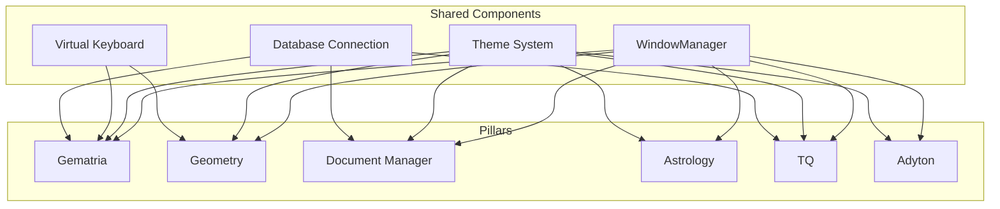
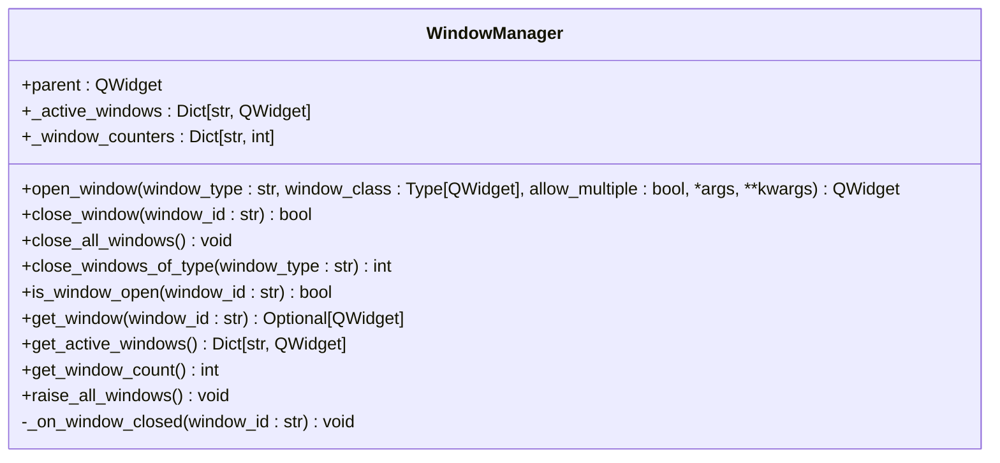
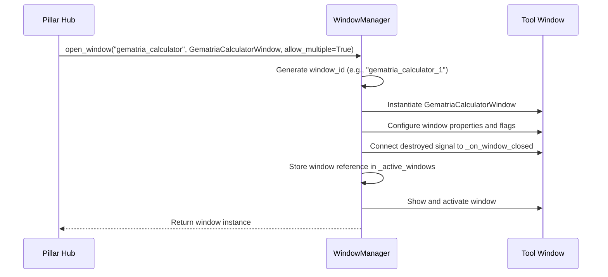
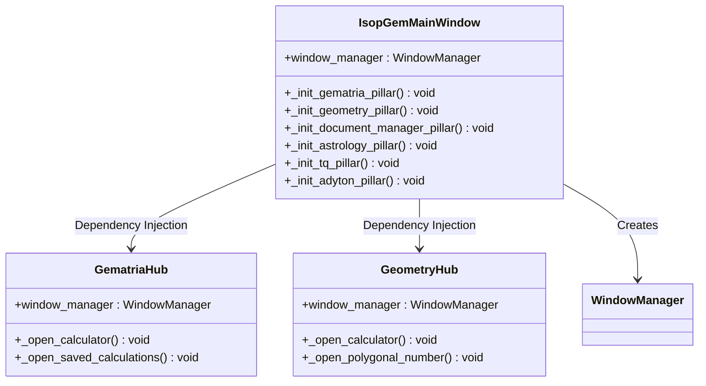

# Shared Components and Utilities

<cite>
**Referenced Files in This Document**   
- [window_manager.py](file://src/shared/ui/window_manager.py)
- [theme.py](file://src/shared/ui/theme.py)
- [virtual_keyboard.py](file://src/shared/ui/virtual_keyboard.py)
- [database.py](file://src/shared/database.py)
- [gematria_hub.py](file://src/pillars/gematria/ui/gematria_hub.py)
- [geometry_hub.py](file://src/pillars/geometry/ui/geometry_hub.py)
- [astrology_hub.py](file://src/pillars/astrology/ui/astrology_hub.py)
- [document_manager_hub.py](file://src/pillars/document_manager/ui/document_manager_hub.py)
- [tq_hub.py](file://src/pillars/tq/ui/tq_hub.py)
- [main.py](file://src/main.py)
</cite>

## Table of Contents
1. [Introduction](#introduction)
2. [Shared Components Overview](#shared-components-overview)
3. [WindowManager Class Design](#windowmanager-class-design)
4. [Dependency Injection Pattern](#dependency-injection-pattern)
5. [Best Practices for Extending Shared Components](#best-practices-for-extending-shared-components)
6. [Conclusion](#conclusion)

## Introduction
The isopgem application implements a modular architecture with shared components that provide cross-cutting utilities and UI elements across all pillars. This documentation details the design and implementation of the shared components, with a particular focus on the WindowManager class that manages tool window lifecycle across the application. The shared components are designed to promote consistency, reduce code duplication, and enable centralized control of application behavior.

**Section sources**
- [window_manager.py](file://src/shared/ui/window_manager.py#L1-L221)
- [theme.py](file://src/shared/ui/theme.py#L1-L372)

## Shared Components Overview
The shared components in the isopgem application are organized within the `src/shared/` directory and provide essential utilities and UI elements used across all pillars. These components include:

- **WindowManager**: Centralized management of tool window lifecycle
- **Theme system**: Consistent UI styling across all components
- **Virtual keyboard**: Input assistance for Hebrew and Greek text
- **Database connection**: Shared database session management

The shared components are designed to be imported and utilized by each pillar's hub and tool windows, ensuring a consistent user experience and reducing code duplication. The components are structured to be easily extensible while maintaining application-wide consistency.



**Diagram sources **
- [window_manager.py](file://src/shared/ui/window_manager.py#L1-L221)
- [theme.py](file://src/shared/ui/theme.py#L1-L372)
- [virtual_keyboard.py](file://src/shared/ui/virtual_keyboard.py#L1-L379)
- [database.py](file://src/shared/database.py#L1-L53)

**Section sources**
- [window_manager.py](file://src/shared/ui/window_manager.py#L1-L221)
- [theme.py](file://src/shared/ui/theme.py#L1-L372)
- [virtual_keyboard.py](file://src/shared/ui/virtual_keyboard.py#L1-L379)
- [database.py](file://src/shared/database.py#L1-L53)

## WindowManager Class Design
The WindowManager class is the cornerstone of the shared components, providing centralized control over tool window lifecycle across the entire application. The class manages window creation, tracking, and destruction, preventing duplicate windows and enabling consistent window behavior.

### Core Functionality
The WindowManager class provides several key methods for window management:

- **open_window**: Creates or reuses tool windows based on type and configuration
- **close_window**: Closes a specific window by ID
- **close_all_windows**: Closes all managed windows
- **is_window_open**: Checks if a window is currently open
- **get_window**: Retrieves a reference to an open window

The class maintains two dictionaries to track window state:
- `_active_windows`: Maps window IDs to window instances
- `_window_counters`: Tracks instance counts for each window type



**Diagram sources **
- [window_manager.py](file://src/shared/ui/window_manager.py#L15-L221)

**Section sources**
- [window_manager.py](file://src/shared/ui/window_manager.py#L15-L221)

### Window Lifecycle Management
The WindowManager implements sophisticated window lifecycle management to ensure consistent behavior across the application. When opening a window, the manager can either create a new instance or reuse an existing one based on the `allow_multiple` parameter:

- **Single instance mode** (`allow_multiple=False`): Reuses an existing window if open, bringing it to the front
- **Multiple instance mode** (`allow_multiple=True`): Creates a new window instance each time

The window manager also handles window closure by tracking the `destroyed` signal from each window and removing references from its internal dictionaries. This prevents memory leaks and ensures accurate state tracking.



**Diagram sources **
- [window_manager.py](file://src/shared/ui/window_manager.py#L29-L111)
- [gematria_hub.py](file://src/pillars/gematria/ui/gematria_hub.py#L137-L186)

**Section sources**
- [window_manager.py](file://src/shared/ui/window_manager.py#L29-L111)
- [gematria_hub.py](file://src/pillars/gematria/ui/gematria_hub.py#L137-L186)

## Dependency Injection Pattern
The isopgem application uses dependency injection to provide shared components to pillar hubs and tool windows. This pattern ensures that all components have access to the same instance of shared services, enabling centralized control and consistent behavior.

### Centralized Instantiation
The WindowManager instance is created in the main application window and passed to each pillar hub during initialization:



**Diagram sources **
- [main.py](file://src/main.py#L51-L52)
- [gematria_hub.py](file://src/pillars/gematria/ui/gematria_hub.py#L52-L61)
- [geometry_hub.py](file://src/pillars/geometry/ui/geometry_hub.py#L13-L14)

**Section sources**
- [main.py](file://src/main.py#L51-L52)
- [gematria_hub.py](file://src/pillars/gematria/ui/gematria_hub.py#L52-L61)
- [geometry_hub.py](file://src/pillars/geometry/ui/geometry_hub.py#L13-L14)

### Usage in Pillar Hubs
Each pillar hub receives the WindowManager instance through its constructor and uses it to manage tool windows. For example, the GematriaHub uses the window manager to open various calculator windows:

```python
def _open_calculator(self):
    """Open the Gematria Calculator window."""
    calculators = [...]  # Calculator instances
    self.window_manager.open_window(
        window_type="gematria_calculator",
        window_class=GematriaCalculatorWindow,
        allow_multiple=True,
        calculators=calculators
    )
```

This pattern is consistent across all pillars, ensuring that window management is centralized and consistent. The window manager is also used to close windows and check their status, providing a unified interface for window operations.

**Section sources**
- [gematria_hub.py](file://src/pillars/gematria/ui/gematria_hub.py#L137-L186)
- [geometry_hub.py](file://src/pillars/geometry/ui/geometry_hub.py#L141-L148)
- [astrology_hub.py](file://src/pillars/astrology/ui/astrology_hub.py#L87-L93)
- [document_manager_hub.py](file://src/pillars/document_manager/ui/document_manager_hub.py#L140-L144)
- [tq_hub.py](file://src/pillars/tq/ui/tq_hub.py#L253-L256)

## Best Practices for Extending Shared Components
When extending shared components in the isopgem application, several best practices should be followed to maintain consistency and ensure proper integration with the existing architecture.

### Component Extension Guidelines
1. **Maintain backward compatibility**: Ensure that changes to shared components do not break existing functionality in pillar components
2. **Follow existing patterns**: Use the same design patterns and coding style as existing components
3. **Document new functionality**: Update documentation to reflect changes and new features
4. **Test thoroughly**: Ensure that new components work correctly across all pillars

### Window Management Best Practices
When creating new tool windows, follow these guidelines for window management:

1. **Use descriptive window types**: Choose clear and consistent window type identifiers
2. **Consider instance requirements**: Determine whether a window should allow multiple instances
3. **Pass necessary dependencies**: Include required services and data through the kwargs parameter
4. **Handle window closure properly**: Ensure that windows clean up resources when closed

### Theme and Styling Consistency
To maintain visual consistency across the application:

1. **Use the shared theme system**: Leverage the predefined color palette and styles
2. **Avoid custom styling**: Use the provided theme functions rather than defining custom styles
3. **Test in different contexts**: Ensure that components look consistent across different pillars

These best practices ensure that shared components remain maintainable and that new features integrate seamlessly with the existing application architecture.

**Section sources**
- [window_manager.py](file://src/shared/ui/window_manager.py#L1-L221)
- [theme.py](file://src/shared/ui/theme.py#L1-L372)
- [gematria_hub.py](file://src/pillars/gematria/ui/gematria_hub.py#L137-L186)

## Conclusion
The shared components in the isopgem application provide essential utilities and UI elements that are used across all pillars. The WindowManager class is a key component that enables centralized control of tool window lifecycle, preventing duplicates and ensuring consistent behavior. The dependency injection pattern used throughout the application ensures that all components have access to the same instance of shared services, promoting consistency and reducing code duplication. By following the best practices outlined in this documentation, developers can extend shared components while maintaining application-wide consistency and reliability.