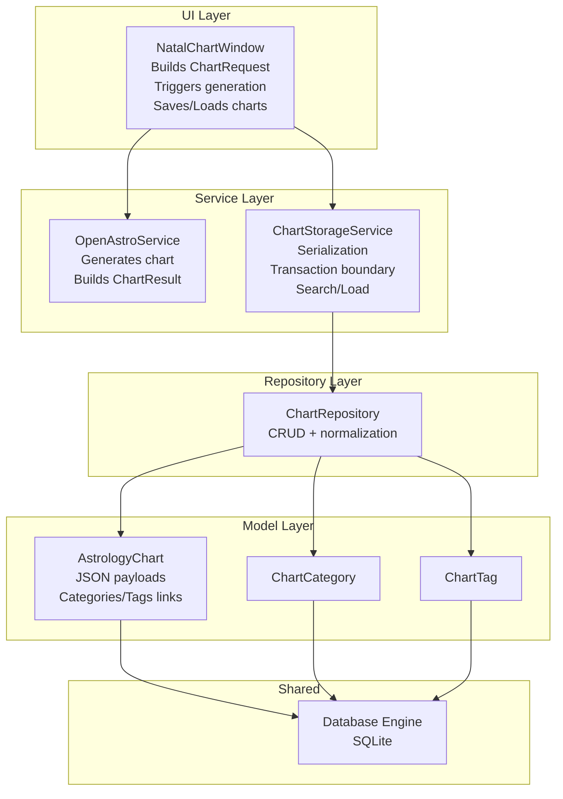
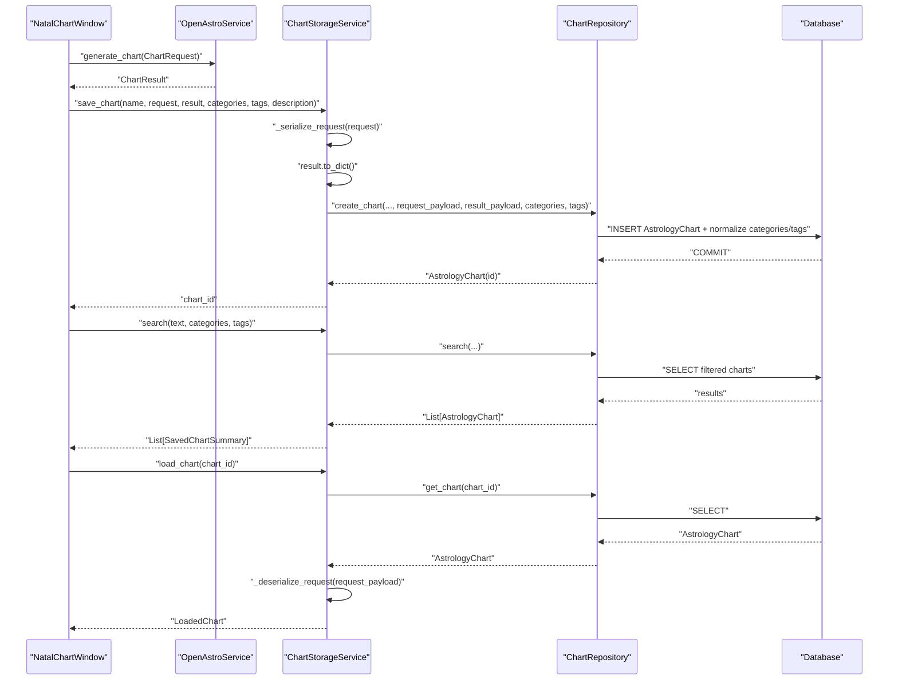
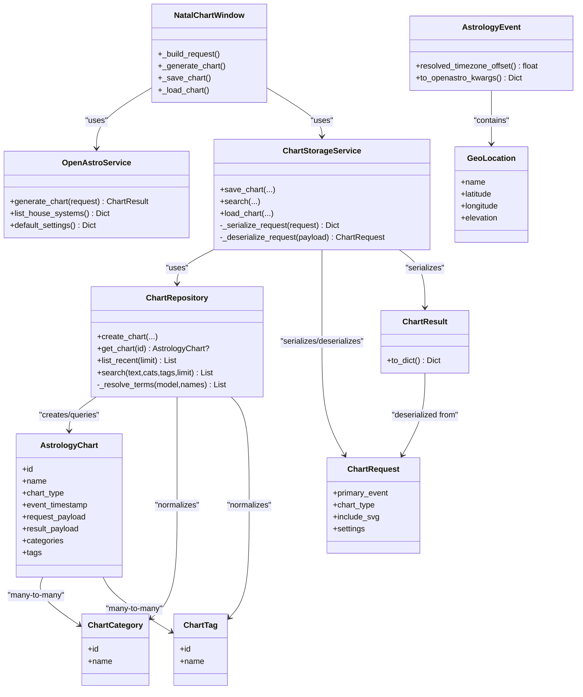

# Astrology Chart Data Flow

<cite>
**Referenced Files in This Document**
- [natal_chart_window.py](file://src/pillars/astrology/ui/natal_chart_window.py)
- [openastro_service.py](file://src/pillars/astrology/services/openastro_service.py)
- [chart_storage_service.py](file://src/pillars/astrology/services/chart_storage_service.py)
- [chart_repository.py](file://src/pillars/astrology/repositories/chart_repository.py)
- [chart_record.py](file://src/pillars/astrology/models/chart_record.py)
- [chart_models.py](file://src/pillars/astrology/models/chart_models.py)
- [database.py](file://src/shared/database.py)
- [test_chart_storage_service.py](file://test/test_chart_storage_service.py)
- [test_astrology_service.py](file://test/test_astrology_service.py)
</cite>

## Table of Contents
1. [Introduction](#introduction)
2. [Project Structure](#project-structure)
3. [Core Components](#core-components)
4. [Architecture Overview](#architecture-overview)
5. [Detailed Component Analysis](#detailed-component-analysis)
6. [Dependency Analysis](#dependency-analysis)
7. [Performance Considerations](#performance-considerations)
8. [Troubleshooting Guide](#troubleshooting-guide)
9. [Conclusion](#conclusion)

## Introduction
This document describes the end-to-end data flow for the Astrology pillar, from creating a natal chart in the UI, through computation and orchestration, to persistence and retrieval. It explains how ChartRequest and ChartResult objects are serialized into JSON payloads for storage in the chart_record model, how categorical data (tags, categories) is normalized and linked, and how the service layer manages transaction boundaries. It also documents the retrieval flow for loading saved charts, including deserialization of complex astrology data structures, and the search functionality that filters by text, categories, and tags.

## Project Structure
The Astrology pillar’s data flow spans UI, service, repository, and model layers, plus shared database utilities. The UI constructs a ChartRequest from user inputs, delegates chart generation to the OpenAstro service, then persists the resulting ChartResult via the ChartStorageService and ChartRepository to the SQLAlchemy-backed AstrologyChart model.

**Diagram sources**
- [natal_chart_window.py](file://src/pillars/astrology/ui/natal_chart_window.py#L316-L411)
- [openastro_service.py](file://src/pillars/astrology/services/openastro_service.py#L64-L139)
- [chart_storage_service.py](file://src/pillars/astrology/services/chart_storage_service.py#L48-L116)
- [chart_repository.py](file://src/pillars/astrology/repositories/chart_repository.py#L21-L107)
- [chart_record.py](file://src/pillars/astrology/models/chart_record.py#L37-L99)
- [database.py](file://src/shared/database.py#L12-L54)

**Section sources**
- [natal_chart_window.py](file://src/pillars/astrology/ui/natal_chart_window.py#L316-L411)
- [chart_storage_service.py](file://src/pillars/astrology/services/chart_storage_service.py#L48-L116)
- [chart_repository.py](file://src/pillars/astrology/repositories/chart_repository.py#L21-L107)
- [chart_record.py](file://src/pillars/astrology/models/chart_record.py#L37-L99)
- [database.py](file://src/shared/database.py#L12-L54)

## Core Components
- UI (NatalChartWindow): Collects inputs, builds ChartRequest, triggers generation, saves and loads charts, and renders results.
- OpenAstroService: Integrates with external OpenAstro2 library, converts events, computes chart, and produces ChartResult.
- ChartStorageService: Orchestrates persistence, serializes/deserializes requests/results, manages transactions, and exposes search/load APIs.
- ChartRepository: Performs CRUD and normalization of categories/tags, and executes search queries.
- Models: ChartRequest, ChartResult, AstrologyEvent, GeoLocation define the domain; AstrologyChart, ChartCategory, ChartTag define persistence.
- Shared Database: Provides SQLite engine and session factory.

**Section sources**
- [natal_chart_window.py](file://src/pillars/astrology/ui/natal_chart_window.py#L316-L411)
- [openastro_service.py](file://src/pillars/astrology/services/openastro_service.py#L64-L139)
- [chart_storage_service.py](file://src/pillars/astrology/services/chart_storage_service.py#L48-L116)
- [chart_repository.py](file://src/pillars/astrology/repositories/chart_repository.py#L21-L107)
- [chart_models.py](file://src/pillars/astrology/models/chart_models.py#L74-L133)
- [chart_record.py](file://src/pillars/astrology/models/chart_record.py#L37-L99)
- [database.py](file://src/shared/database.py#L12-L54)

## Architecture Overview
The flow begins in the UI, which constructs a ChartRequest from user inputs and passes it to OpenAstroService. The service computes a ChartResult and returns it to the UI. The UI then delegates persistence to ChartStorageService, which serializes the ChartRequest and ChartResult into JSON payloads and writes them into AstrologyChart along with normalized categories and tags via ChartRepository. Retrieval works in reverse: ChartStorageService loads the record, deserializes ChartRequest, and returns a LoadedChart object to the UI for display.

**Diagram sources**
- [natal_chart_window.py](file://src/pillars/astrology/ui/natal_chart_window.py#L316-L411)
- [openastro_service.py](file://src/pillars/astrology/services/openastro_service.py#L64-L139)
- [chart_storage_service.py](file://src/pillars/astrology/services/chart_storage_service.py#L48-L116)
- [chart_repository.py](file://src/pillars/astrology/repositories/chart_repository.py#L21-L107)
- [chart_record.py](file://src/pillars/astrology/models/chart_record.py#L37-L99)

## Detailed Component Analysis

### UI: NatalChartWindow
- Builds ChartRequest from form inputs (name, date/time, timezone, location, house system, SVG flag, notes).
- Calls OpenAstroService.generate_chart(request) and renders results.
- On save, collects categories/tags from UI and invokes ChartStorageService.save_chart.
- On load, prompts for search text or lists recent, selects a chart, and loads it via ChartStorageService.load_chart.

Key behaviors:
- Request construction and house system extraction.
- Saving with tokenization of categories/tags and optional description.
- Loading and repopulating UI from LoadedChart.

**Section sources**
- [natal_chart_window.py](file://src/pillars/astrology/ui/natal_chart_window.py#L355-L411)
- [natal_chart_window.py](file://src/pillars/astrology/ui/natal_chart_window.py#L611-L669)

### Service: OpenAstroService
- Converts AstrologyEvent to OpenAstro-compatible kwargs.
- Invokes OpenAstro2 to compute chart, primes computed attributes, extracts planets, houses, aspects, optional SVG, and raw payload.
- Produces ChartResult with structured data and raw payload.

**Section sources**
- [openastro_service.py](file://src/pillars/astrology/services/openastro_service.py#L64-L139)
- [openastro_service.py](file://src/pillars/astrology/services/openastro_service.py#L141-L254)

### Service: ChartStorageService
- Transaction boundary: Uses a session factory to wrap operations in a single transaction.
- Serialization:
  - Serializes ChartRequest into a dict containing chart_type, include_svg, settings, and serialized events.
  - Serializes ChartResult via ChartResult.to_dict().
- Deserialization:
  - Reconstructs ChartRequest from persisted request_payload.
- Search and Load:
  - search(text, categories, tags) returns SavedChartSummary list.
  - load_chart(chart_id) returns LoadedChart with deserialized request and metadata.

**Section sources**
- [chart_storage_service.py](file://src/pillars/astrology/services/chart_storage_service.py#L48-L116)
- [chart_storage_service.py](file://src/pillars/astrology/services/chart_storage_service.py#L120-L205)

### Repository: ChartRepository
- create_chart: Adds AstrologyChart, assigns normalized categories/tags, commits, and refreshes.
- list_recent: Orders by event_timestamp descending.
- search:
  - Filters by lowercase text match against name and location_label.
  - Filters by categories/tags using case-insensitive equality checks.
  - Applies limit and orders by event_timestamp desc.
- Normalization:
  - _resolve_terms: Normalizes names by stripping whitespace and lowercasing; upserts missing entries; returns mapped instances.

**Section sources**
- [chart_repository.py](file://src/pillars/astrology/repositories/chart_repository.py#L21-L107)
- [chart_repository.py](file://src/pillars/astrology/repositories/chart_repository.py#L111-L139)

### Models: ChartRequest, ChartResult, AstrologyEvent, GeoLocation
- ChartRequest: primary_event, chart_type, optional reference_event, include_svg, settings.
- ChartResult: chart_type, planet_positions, house_positions, aspect_summary, optional svg_document, raw_payload; includes to_dict() for serialization.
- AstrologyEvent: name, timestamp, location, optional timezone_offset, metadata; provides resolved_timezone_offset and to_openastro_kwargs.
- GeoLocation: name, latitude, longitude, elevation, optional country_code.

**Section sources**
- [chart_models.py](file://src/pillars/astrology/models/chart_models.py#L74-L133)

### Persistence Model: AstrologyChart, ChartCategory, ChartTag
- AstrologyChart stores:
  - Metadata: name, description, chart_type, include_svg, house_system, timestamps, timezone_offset, location_label, coordinates, elevation.
  - JSON payloads: request_payload and result_payload.
  - Many-to-many relationships to ChartCategory and ChartTag via association tables.
- Association tables: chart_category_links and chart_tag_links.

**Section sources**
- [chart_record.py](file://src/pillars/astrology/models/chart_record.py#L22-L73)
- [chart_record.py](file://src/pillars/astrology/models/chart_record.py#L75-L99)

### Shared Database: Session Factory and Engine
- SQLite engine configured with a persistent data directory.
- get_db_session yields a session and ensures cleanup.

**Section sources**
- [database.py](file://src/shared/database.py#L12-L54)

## Dependency Analysis
The following diagram shows the code-level dependencies among the major components involved in the data flow.

**Diagram sources**
- [natal_chart_window.py](file://src/pillars/astrology/ui/natal_chart_window.py#L316-L411)
- [openastro_service.py](file://src/pillars/astrology/services/openastro_service.py#L64-L139)
- [chart_storage_service.py](file://src/pillars/astrology/services/chart_storage_service.py#L48-L116)
- [chart_repository.py](file://src/pillars/astrology/repositories/chart_repository.py#L21-L107)
- [chart_record.py](file://src/pillars/astrology/models/chart_record.py#L37-L99)
- [chart_models.py](file://src/pillars/astrology/models/chart_models.py#L74-L133)

## Performance Considerations
- JSON payloads: request_payload and result_payload are stored as JSON; keep ChartResult compact to minimize storage overhead.
- Indexing: chart_categories.name and chart_tags.name are indexed; ensure category/tag names are normalized consistently to leverage lookups efficiently.
- Search: Text search uses lowercased LIKE clauses; consider adding full-text indexes if the dataset grows large.
- Transactions: All persistence operations are wrapped in a single transaction via the session factory, minimizing commit overhead and ensuring atomicity.

[No sources needed since this section provides general guidance]

## Troubleshooting Guide
Common issues and where to investigate:

- OpenAstro2 not available:
  - Symptoms: UI shows “OpenAstro2 is not available” and disables generation.
  - Cause: Missing openastro2 package.
  - Resolution: Install the dependency as indicated by the service error.
  
  **Section sources**
  - [natal_chart_window.py](file://src/pillars/astrology/ui/natal_chart_window.py#L316-L345)
  - [openastro_service.py](file://src/pillars/astrology/services/openastro_service.py#L23-L30)

- Chart computation errors:
  - Symptoms: UI displays “Calculation Error”.
  - Cause: Exceptions raised by OpenAstroService during chart generation.
  - Resolution: Inspect logs and verify inputs (date/timezone/location).
  
  **Section sources**
  - [natal_chart_window.py](file://src/pillars/astrology/ui/natal_chart_window.py#L336-L345)
  - [openastro_service.py](file://src/pillars/astrology/services/openastro_service.py#L83-L94)

- Persistence failures:
  - Symptoms: Save fails with an exception dialog.
  - Causes: Database errors, invalid payloads, or transaction rollback.
  - Resolution: Check database connectivity and payload validity; confirm transaction boundary.
  
  **Section sources**
  - [chart_storage_service.py](file://src/pillars/astrology/services/chart_storage_service.py#L48-L82)
  - [chart_repository.py](file://src/pillars/astrology/repositories/chart_repository.py#L21-L60)

- Retrieval/loading issues:
  - Symptoms: Load returns None or deserialization fails.
  - Causes: Missing record or malformed request_payload.
  - Resolution: Verify chart_id and inspect request_payload structure.
  
  **Section sources**
  - [chart_storage_service.py](file://src/pillars/astrology/services/chart_storage_service.py#L102-L116)
  - [chart_repository.py](file://src/pillars/astrology/repositories/chart_repository.py#L62-L67)

- Search not returning expected results:
  - Symptoms: No matches for text/category/tag filters.
  - Causes: Case sensitivity in normalization, empty or malformed inputs.
  - Resolution: Ensure category/tag names are normalized and trimmed; verify text search inputs.
  
  **Section sources**
  - [chart_repository.py](file://src/pillars/astrology/repositories/chart_repository.py#L77-L107)
  - [chart_storage_service.py](file://src/pillars/astrology/services/chart_storage_service.py#L89-L101)

## Conclusion
The Astrology pillar implements a clean separation of concerns: the UI constructs and renders chart data, the OpenAstro service performs computation, and the storage service orchestrates serialization, normalization, and persistence. Categories and tags are normalized and linked via association tables, enabling robust search and retrieval. Transactions are managed at the service layer, ensuring atomicity. The design supports extensibility for additional filters and richer payloads while maintaining clear data boundaries.