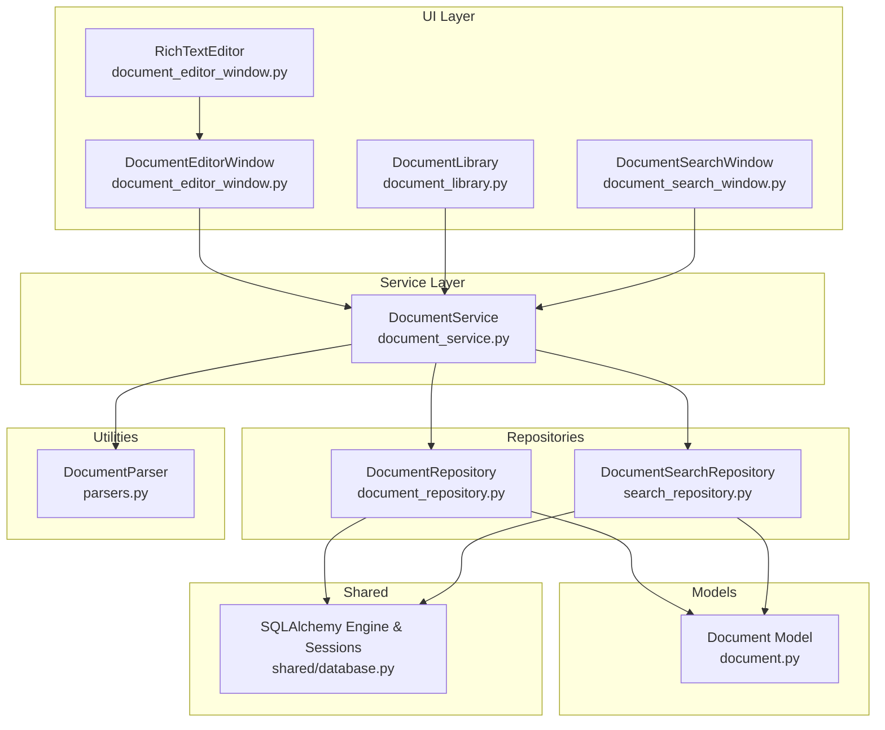
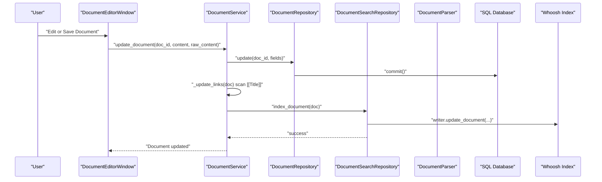
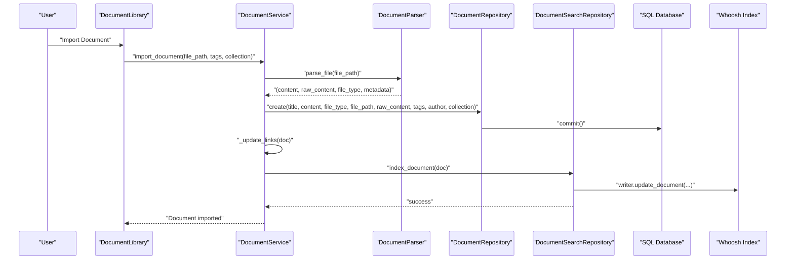
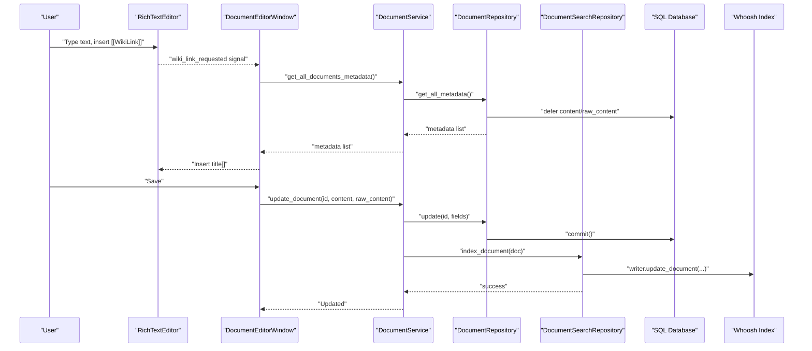
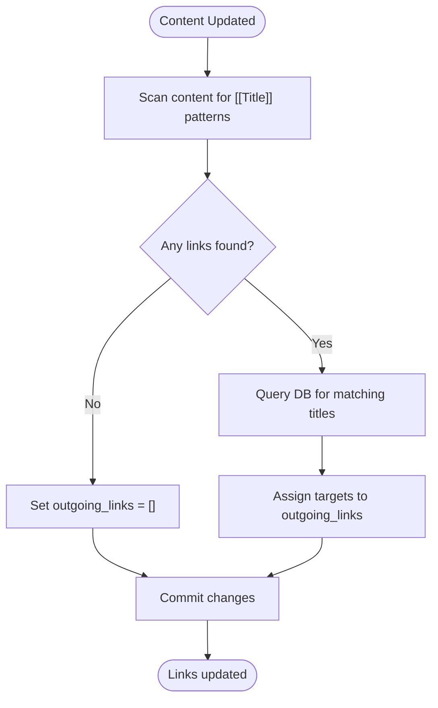
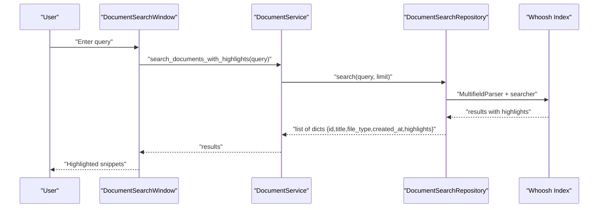
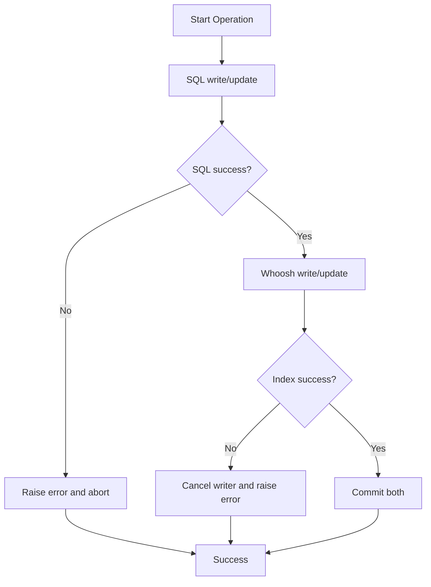
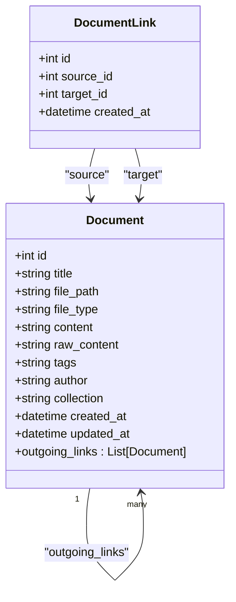
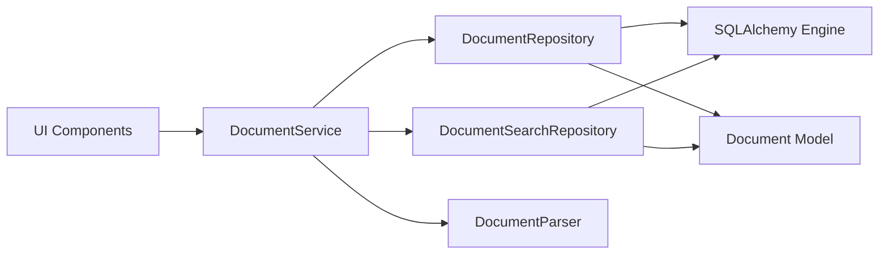

# Document Management Data Flow

<cite>
**Referenced Files in This Document**
- [README.md](file://README.md)
- [src/shared/database.py](file://src/shared/database.py)
- [src/pillars/document_manager/models/document.py](file://src/pillars/document_manager/models/document.py)
- [src/pillars/document_manager/ui/rich_text_editor.py](file://src/pillars/document_manager/ui/rich_text_editor.py)
- [src/pillars/document_manager/ui/document_editor_window.py](file://src/pillars/document_manager/ui/document_editor_window.py)
- [src/pillars/document_manager/ui/document_library.py](file://src/pillars/document_manager/ui/document_library.py)
- [src/pillars/document_manager/ui/document_search_window.py](file://src/pillars/document_manager/ui/document_search_window.py)
- [src/pillars/document_manager/utils/parsers.py](file://src/pillars/document_manager/utils/parsers.py)
- [src/pillars/document_manager/services/document_service.py](file://src/pillars/document_manager/services/document_service.py)
- [src/pillars/document_manager/repositories/document_repository.py](file://src/pillars/document_manager/repositories/document_repository.py)
- [src/pillars/document_manager/repositories/search_repository.py](file://src/pillars/document_manager/repositories/search_repository.py)
</cite>

## Table of Contents
1. [Introduction](#introduction)
2. [Project Structure](#project-structure)
3. [Core Components](#core-components)
4. [Architecture Overview](#architecture-overview)
5. [Detailed Component Analysis](#detailed-component-analysis)
6. [Dependency Analysis](#dependency-analysis)
7. [Performance Considerations](#performance-considerations)
8. [Troubleshooting Guide](#troubleshooting-guide)
9. [Conclusion](#conclusion)

## Introduction
This document traces the end-to-end data flow for the Document Manager pillar, from user actions in the editor and library to the orchestration in the service layer and dual persistence across the SQL database and the Whoosh search index. It explains how file parsing extracts content and metadata, how WikiLinks are processed to create document relationships, and how full-text indexing enables fast search. It also covers transaction management and error handling across the two persistence systems, and the search flow from query input to result highlighting and display.

## Project Structure
The Document Manager follows a layered architecture:
- UI layer: Rich text editor, document editor window, document library, and search window
- Service layer: Orchestrates import/update/search operations and coordinates repositories
- Repositories: SQL repository for database persistence and Whoosh repository for search index
- Utilities: File parsing utilities for extracting text and HTML from various formats
- Models: Document entity and association table for WikiLink relationships
- Shared database: SQLAlchemy engine and session management

**Diagram sources**
- [src/pillars/document_manager/ui/rich_text_editor.py](file://src/pillars/document_manager/ui/rich_text_editor.py#L1-L561)
- [src/pillars/document_manager/ui/document_editor_window.py](file://src/pillars/document_manager/ui/document_editor_window.py#L1-L329)
- [src/pillars/document_manager/ui/document_library.py](file://src/pillars/document_manager/ui/document_library.py#L1-L599)
- [src/pillars/document_manager/ui/document_search_window.py](file://src/pillars/document_manager/ui/document_search_window.py#L1-L125)
- [src/pillars/document_manager/services/document_service.py](file://src/pillars/document_manager/services/document_service.py#L1-L257)
- [src/pillars/document_manager/repositories/document_repository.py](file://src/pillars/document_manager/repositories/document_repository.py#L1-L86)
- [src/pillars/document_manager/repositories/search_repository.py](file://src/pillars/document_manager/repositories/search_repository.py#L1-L201)
- [src/pillars/document_manager/utils/parsers.py](file://src/pillars/document_manager/utils/parsers.py#L1-L275)
- [src/pillars/document_manager/models/document.py](file://src/pillars/document_manager/models/document.py#L1-L47)
- [src/shared/database.py](file://src/shared/database.py#L1-L53)

**Section sources**
- [README.md](file://README.md#L94-L117)
- [src/shared/database.py](file://src/shared/database.py#L1-L53)

## Core Components
- RichTextEditor: Provides rich text editing with signals for text changes and WikiLink triggers, and exposes get/set HTML/plain text APIs used by the editor window.
- DocumentEditorWindow: Integrates the editor, handles file operations, and delegates persistence to DocumentService via a managed session context.
- DocumentLibrary: Manages document listing, filtering, importing, and batch operations, using DocumentService for metadata and search.
- DocumentSearchWindow: Performs search queries and displays highlighted snippets using DocumentService.
- DocumentService: Orchestrates import, update, delete, and search operations, coordinating SQL and Whoosh repositories and managing link relationships.
- DocumentRepository: SQL repository for CRUD operations against the Document model and metadata queries.
- DocumentSearchRepository: Whoosh repository for indexing and searching documents, including schema management and result highlighting.
- DocumentParser: Extracts text and HTML from supported file formats and returns metadata.
- Document model: Defines the Document entity and outgoing/incoming link relationships via an association table.

**Section sources**
- [src/pillars/document_manager/ui/rich_text_editor.py](file://src/pillars/document_manager/ui/rich_text_editor.py#L1-L561)
- [src/pillars/document_manager/ui/document_editor_window.py](file://src/pillars/document_manager/ui/document_editor_window.py#L1-L329)
- [src/pillars/document_manager/ui/document_library.py](file://src/pillars/document_manager/ui/document_library.py#L1-L599)
- [src/pillars/document_manager/ui/document_search_window.py](file://src/pillars/document_manager/ui/document_search_window.py#L1-L125)
- [src/pillars/document_manager/services/document_service.py](file://src/pillars/document_manager/services/document_service.py#L1-L257)
- [src/pillars/document_manager/repositories/document_repository.py](file://src/pillars/document_manager/repositories/document_repository.py#L1-L86)
- [src/pillars/document_manager/repositories/search_repository.py](file://src/pillars/document_manager/repositories/search_repository.py#L1-L201)
- [src/pillars/document_manager/utils/parsers.py](file://src/pillars/document_manager/utils/parsers.py#L1-L275)
- [src/pillars/document_manager/models/document.py](file://src/pillars/document_manager/models/document.py#L1-L47)

## Architecture Overview
The Document Manager implements a hybrid persistence strategy:
- SQL database (SQLite via SQLAlchemy) stores document metadata and content for durable persistence.
- Whoosh search index stores searchable fields for fast full-text search and highlighting.

The service layer ensures consistency by:
- Parsing files into normalized text and HTML
- Creating/updating documents in SQL
- Updating the Whoosh index accordingly
- Managing WikiLink relationships by scanning content for [[Title]] patterns and resolving targets

**Diagram sources**
- [src/pillars/document_manager/ui/document_editor_window.py](file://src/pillars/document_manager/ui/document_editor_window.py#L243-L266)
- [src/pillars/document_manager/services/document_service.py](file://src/pillars/document_manager/services/document_service.py#L152-L172)
- [src/pillars/document_manager/repositories/document_repository.py](file://src/pillars/document_manager/repositories/document_repository.py#L64-L71)
- [src/pillars/document_manager/repositories/search_repository.py](file://src/pillars/document_manager/repositories/search_repository.py#L67-L91)

## Detailed Component Analysis

### Import Pipeline: File Parsing to SQL and Index
- File parsing: DocumentParser reads supported formats and returns extracted text, raw HTML, file type, and metadata. It uses optional libraries for DOCX, PDF, RTF, and HTML, with fallbacks and error handling.
- SQL creation: DocumentService creates a Document record with parsed content and metadata, then commits to the database.
- Whoosh indexing: DocumentService indexes the newly created document into the Whoosh index.

**Diagram sources**
- [src/pillars/document_manager/ui/document_library.py](file://src/pillars/document_manager/ui/document_library.py#L377-L403)
- [src/pillars/document_manager/services/document_service.py](file://src/pillars/document_manager/services/document_service.py#L50-L96)
- [src/pillars/document_manager/utils/parsers.py](file://src/pillars/document_manager/utils/parsers.py#L63-L99)
- [src/pillars/document_manager/repositories/document_repository.py](file://src/pillars/document_manager/repositories/document_repository.py#L47-L62)
- [src/pillars/document_manager/repositories/search_repository.py](file://src/pillars/document_manager/repositories/search_repository.py#L67-L91)

**Section sources**
- [src/pillars/document_manager/utils/parsers.py](file://src/pillars/document_manager/utils/parsers.py#L63-L99)
- [src/pillars/document_manager/services/document_service.py](file://src/pillars/document_manager/services/document_service.py#L50-L96)
- [src/pillars/document_manager/repositories/document_repository.py](file://src/pillars/document_manager/repositories/document_repository.py#L47-L62)
- [src/pillars/document_manager/repositories/search_repository.py](file://src/pillars/document_manager/repositories/search_repository.py#L67-L91)

### Editing Pipeline: Rich Text to SQL and Index
- RichTextEditor emits signals when text changes and when a WikiLink trigger is detected.
- DocumentEditorWindow captures edits, obtains HTML and plain text, and calls DocumentService.update_document.
- DocumentService updates the SQL record and re-indexes the Whoosh document.

**Diagram sources**
- [src/pillars/document_manager/ui/rich_text_editor.py](file://src/pillars/document_manager/ui/rich_text_editor.py#L26-L31)
- [src/pillars/document_manager/ui/document_editor_window.py](file://src/pillars/document_manager/ui/document_editor_window.py#L49-L108)
- [src/pillars/document_manager/services/document_service.py](file://src/pillars/document_manager/services/document_service.py#L152-L172)
- [src/pillars/document_manager/repositories/document_repository.py](file://src/pillars/document_manager/repositories/document_repository.py#L64-L71)
- [src/pillars/document_manager/repositories/search_repository.py](file://src/pillars/document_manager/repositories/search_repository.py#L67-L91)

**Section sources**
- [src/pillars/document_manager/ui/rich_text_editor.py](file://src/pillars/document_manager/ui/rich_text_editor.py#L26-L31)
- [src/pillars/document_manager/ui/document_editor_window.py](file://src/pillars/document_manager/ui/document_editor_window.py#L49-L108)
- [src/pillars/document_manager/services/document_service.py](file://src/pillars/document_manager/services/document_service.py#L152-L172)

### WikiLink Processing: Relationship Extraction and Resolution
- DocumentService scans content for [[Title]] patterns and resolves targets by querying the database for matching titles.
- It updates outgoing_links on the document model and commits the change.
- The relationship is represented by an association table and exposed via SQLAlchemy relationships.

**Diagram sources**
- [src/pillars/document_manager/services/document_service.py](file://src/pillars/document_manager/services/document_service.py#L24-L49)
- [src/pillars/document_manager/models/document.py](file://src/pillars/document_manager/models/document.py#L7-L47)

**Section sources**
- [src/pillars/document_manager/services/document_service.py](file://src/pillars/document_manager/services/document_service.py#L24-L49)
- [src/pillars/document_manager/models/document.py](file://src/pillars/document_manager/models/document.py#L7-L47)

### Full-Text Search Flow: Query to Results with Highlighting
- DocumentSearchWindow accepts a query and delegates to DocumentService.search_documents_with_highlights.
- DocumentService calls DocumentSearchRepository.search, which uses Whoosh to search across title, content, tags, and author.
- Whoosh returns scored results with fragments; DocumentSearchWindow renders highlighted snippets in a table.

**Diagram sources**
- [src/pillars/document_manager/ui/document_search_window.py](file://src/pillars/document_manager/ui/document_search_window.py#L78-L125)
- [src/pillars/document_manager/services/document_service.py](file://src/pillars/document_manager/services/document_service.py#L131-L134)
- [src/pillars/document_manager/repositories/search_repository.py](file://src/pillars/document_manager/repositories/search_repository.py#L133-L164)

**Section sources**
- [src/pillars/document_manager/ui/document_search_window.py](file://src/pillars/document_manager/ui/document_search_window.py#L78-L125)
- [src/pillars/document_manager/services/document_service.py](file://src/pillars/document_manager/services/document_service.py#L131-L134)
- [src/pillars/document_manager/repositories/search_repository.py](file://src/pillars/document_manager/repositories/search_repository.py#L133-L164)

### Transaction Management and Error Handling Across Systems
- SQL operations are committed per operation (create/update/delete) in DocumentRepository.
- Whoosh writes are wrapped in a writer with commit/cancel semantics; exceptions cancel the writer to avoid partial updates.
- There is no explicit cross-system transaction manager; failures in Whoosh indexing do not roll back SQL changes. The service logs and surfaces errors, leaving callers to decide whether to retry or alert the user.

**Diagram sources**
- [src/pillars/document_manager/repositories/document_repository.py](file://src/pillars/document_manager/repositories/document_repository.py#L64-L71)
- [src/pillars/document_manager/repositories/search_repository.py](file://src/pillars/document_manager/repositories/search_repository.py#L67-L91)

**Section sources**
- [src/pillars/document_manager/repositories/document_repository.py](file://src/pillars/document_manager/repositories/document_repository.py#L64-L71)
- [src/pillars/document_manager/repositories/search_repository.py](file://src/pillars/document_manager/repositories/search_repository.py#L67-L91)

### Data Models and Relationships

**Diagram sources**
- [src/pillars/document_manager/models/document.py](file://src/pillars/document_manager/models/document.py#L7-L47)

**Section sources**
- [src/pillars/document_manager/models/document.py](file://src/pillars/document_manager/models/document.py#L7-L47)

## Dependency Analysis
- UI components depend on DocumentService via a managed session context to ensure proper resource lifecycle and isolation.
- DocumentService depends on DocumentRepository for SQL operations and DocumentSearchRepository for Whoosh operations.
- DocumentParser is used by DocumentService during import to normalize content and metadata.
- Shared database module provides the SQLAlchemy engine and session factory used by repositories.

**Diagram sources**
- [src/pillars/document_manager/services/document_service.py](file://src/pillars/document_manager/services/document_service.py#L1-L25)
- [src/pillars/document_manager/repositories/document_repository.py](file://src/pillars/document_manager/repositories/document_repository.py#L1-L13)
- [src/pillars/document_manager/repositories/search_repository.py](file://src/pillars/document_manager/repositories/search_repository.py#L1-L20)
- [src/shared/database.py](file://src/shared/database.py#L1-L53)

**Section sources**
- [src/pillars/document_manager/services/document_service.py](file://src/pillars/document_manager/services/document_service.py#L1-L25)
- [src/pillars/document_manager/repositories/document_repository.py](file://src/pillars/document_manager/repositories/document_repository.py#L1-L13)
- [src/pillars/document_manager/repositories/search_repository.py](file://src/pillars/document_manager/repositories/search_repository.py#L1-L20)
- [src/shared/database.py](file://src/shared/database.py#L1-L53)

## Performance Considerations
- Metadata-only queries: DocumentRepository defers loading heavy content fields to reduce memory and IO overhead when listing documents.
- Batch indexing: DocumentSearchRepository supports indexing multiple documents in a single writer transaction to improve throughput.
- Deferred content loading: UI components that do not require full content (e.g., library lists) rely on metadata queries to keep the UI responsive.
- Search fragment sizing: Whoosh fragmenter limits snippet size and surrounding context to balance readability and performance.

[No sources needed since this section provides general guidance]

## Troubleshooting Guide
- Import failures: Verify supported file extensions and optional dependencies (DOCX, PDF, RTF). DocumentParser raises explicit errors for unsupported types and missing dependencies.
- PDF parsing issues: If pdf2docx/mammoth pipeline fails, the code falls back to PyMuPDF or pypdf; encrypted PDFs are handled with decryption attempts.
- Whoosh index corruption: The repository recreates the index if schema mismatches or exceptions occur during opening.
- WikiLink resolution: If a target title does not exist, outgoing_links will not include that link; ensure titles match exactly.

**Section sources**
- [src/pillars/document_manager/utils/parsers.py](file://src/pillars/document_manager/utils/parsers.py#L91-L99)
- [src/pillars/document_manager/utils/parsers.py](file://src/pillars/document_manager/utils/parsers.py#L153-L241)
- [src/pillars/document_manager/repositories/search_repository.py](file://src/pillars/document_manager/repositories/search_repository.py#L52-L66)

## Conclusion
The Document Manager’s end-to-end flow integrates a robust import pipeline, rich editing experience, and fast full-text search. The service layer orchestrates SQL and Whoosh persistence, manages WikiLink relationships, and provides efficient metadata queries. While there is no cross-system transaction manager, the design ensures that SQL changes are atomic per operation and Whoosh writes are safely committed or canceled, with clear error signaling for resilient user workflows.