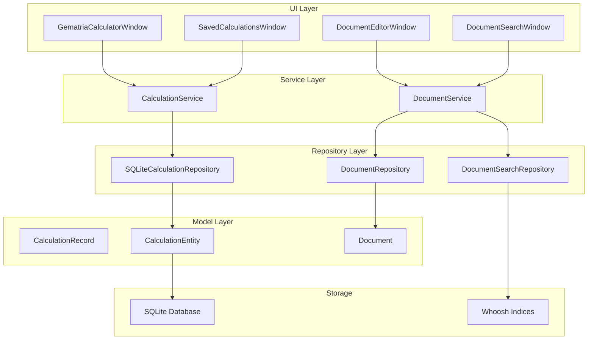
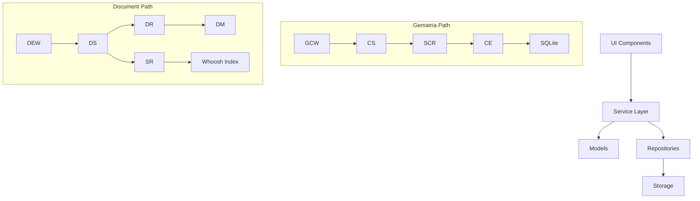
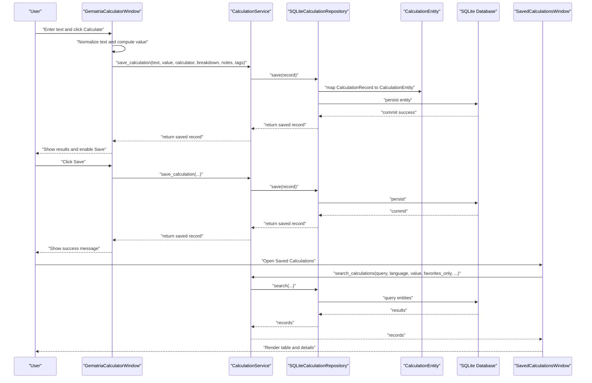
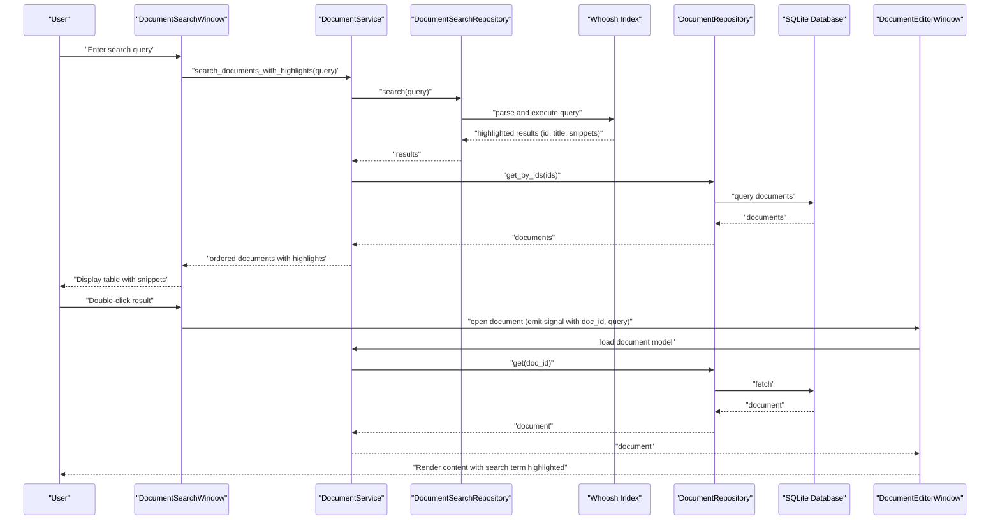
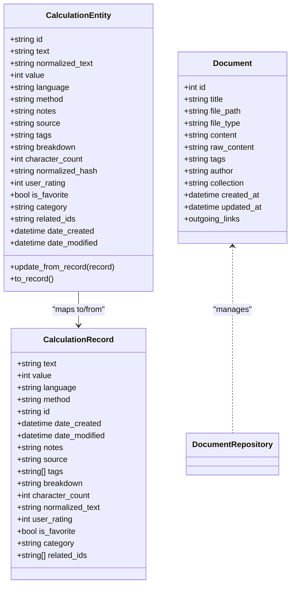
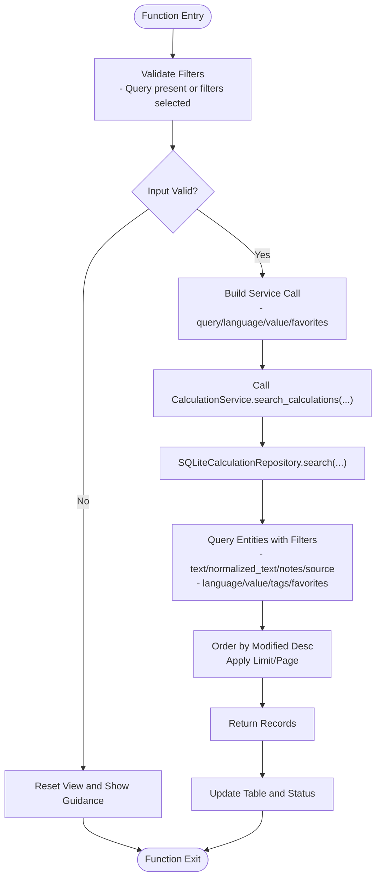
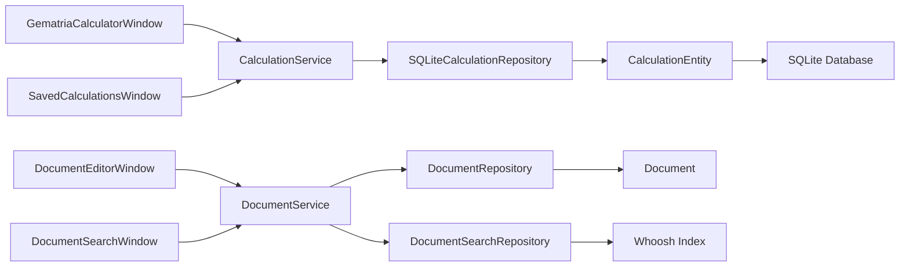

# End-to-End Data Flow Pathways

<cite>
**Referenced Files in This Document**
- [gematria_calculator_window.py](file://src/pillars/gematria/ui/gematria_calculator_window.py)
- [calculation_service.py](file://src/pillars/gematria/services/calculation_service.py)
- [sqlite_calculation_repository.py](file://src/pillars/gematria/repositories/sqlite_calculation_repository.py)
- [calculation_entity.py](file://src/pillars/gematria/models/calculation_entity.py)
- [calculation_record.py](file://src/pillars/gematria/models/calculation_record.py)
- [base_calculator.py](file://src/pillars/gematria/services/base_calculator.py)
- [database.py](file://src/shared/database.py)
- [saved_calculations_window.py](file://src/pillars/gematria/ui/saved_calculations_window.py)
- [document_editor_window.py](file://src/pillars/document_manager/ui/document_editor_window.py)
- [document_service.py](file://src/pillars/document_manager/services/document_service.py)
- [document_repository.py](file://src/pillars/document_manager/repositories/document_repository.py)
- [document.py](file://src/pillars/document_manager/models/document.py)
- [search_repository.py](file://src/pillars/document_manager/repositories/search_repository.py)
- [document_search_window.py](file://src/pillars/document_manager/ui/document_search_window.py)
</cite>

## Table of Contents
1. [Introduction](#introduction)
2. [Project Structure](#project-structure)
3. [Core Components](#core-components)
4. [Architecture Overview](#architecture-overview)
5. [Detailed Component Analysis](#detailed-component-analysis)
6. [Dependency Analysis](#dependency-analysis)
7. [Performance Considerations](#performance-considerations)
8. [Troubleshooting Guide](#troubleshooting-guide)
9. [Conclusion](#conclusion)

## Introduction
This document explains the end-to-end data flow pathways in the isopgem application, focusing on two concrete scenarios:
- A gematria calculation flow from the UI through the service layer, persistence, and back to UI updates.
- A document search operation from the UI through the service layer, search index, and back to UI results.

It maps the complete journey: User Input → UI Component → Service Layer → Model → Repository → Storage → Service Layer → UI Update. It also details how services orchestrate business logic, repositories handle persistence, and models act as data carriers between layers. Error handling and data validation are highlighted at each stage.

## Project Structure
The application follows a layered architecture:
- UI layer: PyQt6 windows and widgets.
- Service layer: Business logic orchestrators.
- Model layer: Data carriers and ORM entities.
- Repository layer: Persistence abstractions.
- Storage: SQLite for relational data and Whoosh indices for search.

**Diagram sources**
- [gematria_calculator_window.py](file://src/pillars/gematria/ui/gematria_calculator_window.py#L1-L500)
- [saved_calculations_window.py](file://src/pillars/gematria/ui/saved_calculations_window.py#L1-L384)
- [calculation_service.py](file://src/pillars/gematria/services/calculation_service.py#L1-L273)
- [sqlite_calculation_repository.py](file://src/pillars/gematria/repositories/sqlite_calculation_repository.py#L1-L143)
- [calculation_entity.py](file://src/pillars/gematria/models/calculation_entity.py#L1-L92)
- [calculation_record.py](file://src/pillars/gematria/models/calculation_record.py#L1-L89)
- [document_editor_window.py](file://src/pillars/document_manager/ui/document_editor_window.py#L1-L329)
- [document_search_window.py](file://src/pillars/document_manager/ui/document_search_window.py#L1-L125)
- [document_service.py](file://src/pillars/document_manager/services/document_service.py#L1-L257)
- [document_repository.py](file://src/pillars/document_manager/repositories/document_repository.py#L1-L86)
- [document.py](file://src/pillars/document_manager/models/document.py#L1-L47)
- [search_repository.py](file://src/pillars/document_manager/repositories/search_repository.py#L1-L201)
- [database.py](file://src/shared/database.py#L1-L53)

**Section sources**
- [gematria_calculator_window.py](file://src/pillars/gematria/ui/gematria_calculator_window.py#L1-L500)
- [saved_calculations_window.py](file://src/pillars/gematria/ui/saved_calculations_window.py#L1-L384)
- [document_editor_window.py](file://src/pillars/document_manager/ui/document_editor_window.py#L1-L329)
- [document_search_window.py](file://src/pillars/document_manager/ui/document_search_window.py#L1-L125)
- [calculation_service.py](file://src/pillars/gematria/services/calculation_service.py#L1-L273)
- [sqlite_calculation_repository.py](file://src/pillars/gematria/repositories/sqlite_calculation_repository.py#L1-L143)
- [calculation_entity.py](file://src/pillars/gematria/models/calculation_entity.py#L1-L92)
- [calculation_record.py](file://src/pillars/gematria/models/calculation_record.py#L1-L89)
- [document_service.py](file://src/pillars/document_manager/services/document_service.py#L1-L257)
- [document_repository.py](file://src/pillars/document_manager/repositories/document_repository.py#L1-L86)
- [document.py](file://src/pillars/document_manager/models/document.py#L1-L47)
- [search_repository.py](file://src/pillars/document_manager/repositories/search_repository.py#L1-L201)
- [database.py](file://src/shared/database.py#L1-L53)

## Core Components
- UI Components: Windows/widgets that capture user input and render results.
- Services: Orchestrate business logic, coordinate repositories, and transform data between layers.
- Models: Data carriers (CalculationRecord, Document) and ORM entities (CalculationEntity).
- Repositories: Encapsulate persistence logic for databases and search indices.
- Storage: SQLite for relational data and Whoosh indices for full-text search.

Key responsibilities:
- UI captures user input and triggers actions.
- Services validate inputs, apply business rules, and call repositories.
- Models carry data between UI and persistence.
- Repositories persist and retrieve data, handling transactions and indexing.
- Storage persists data and maintains search indices.

**Section sources**
- [gematria_calculator_window.py](file://src/pillars/gematria/ui/gematria_calculator_window.py#L1-L500)
- [saved_calculations_window.py](file://src/pillars/gematria/ui/saved_calculations_window.py#L1-L384)
- [calculation_service.py](file://src/pillars/gematria/services/calculation_service.py#L1-L273)
- [sqlite_calculation_repository.py](file://src/pillars/gematria/repositories/sqlite_calculation_repository.py#L1-L143)
- [calculation_record.py](file://src/pillars/gematria/models/calculation_record.py#L1-L89)
- [calculation_entity.py](file://src/pillars/gematria/models/calculation_entity.py#L1-L92)
- [document_editor_window.py](file://src/pillars/document_manager/ui/document_editor_window.py#L1-L329)
- [document_search_window.py](file://src/pillars/document_manager/ui/document_search_window.py#L1-L125)
- [document_service.py](file://src/pillars/document_manager/services/document_service.py#L1-L257)
- [document_repository.py](file://src/pillars/document_manager/repositories/document_repository.py#L1-L86)
- [document.py](file://src/pillars/document_manager/models/document.py#L1-L47)
- [search_repository.py](file://src/pillars/document_manager/repositories/search_repository.py#L1-L201)
- [database.py](file://src/shared/database.py#L1-L53)

## Architecture Overview
The system enforces separation of concerns:
- UI components depend on services, not repositories.
- Services depend on repositories and models.
- Repositories depend on models and storage.
- Storage is abstracted behind repositories.

**Diagram sources**
- [gematria_calculator_window.py](file://src/pillars/gematria/ui/gematria_calculator_window.py#L1-L500)
- [calculation_service.py](file://src/pillars/gematria/services/calculation_service.py#L1-L273)
- [sqlite_calculation_repository.py](file://src/pillars/gematria/repositories/sqlite_calculation_repository.py#L1-L143)
- [calculation_entity.py](file://src/pillars/gematria/models/calculation_entity.py#L1-L92)
- [database.py](file://src/shared/database.py#L1-L53)
- [document_editor_window.py](file://src/pillars/document_manager/ui/document_editor_window.py#L1-L329)
- [document_service.py](file://src/pillars/document_manager/services/document_service.py#L1-L257)
- [document_repository.py](file://src/pillars/document_manager/repositories/document_repository.py#L1-L86)
- [document.py](file://src/pillars/document_manager/models/document.py#L1-L47)
- [search_repository.py](file://src/pillars/document_manager/repositories/search_repository.py#L1-L201)

## Detailed Component Analysis

### Gematria Calculation Flow: UI → Service → Model → Repository → Storage → Service → UI
This pathway demonstrates how user input is transformed into persisted records and later retrieved for display.

**Diagram sources**
- [gematria_calculator_window.py](file://src/pillars/gematria/ui/gematria_calculator_window.py#L341-L500)
- [calculation_service.py](file://src/pillars/gematria/services/calculation_service.py#L23-L79)
- [sqlite_calculation_repository.py](file://src/pillars/gematria/repositories/sqlite_calculation_repository.py#L37-L54)
- [calculation_entity.py](file://src/pillars/gematria/models/calculation_entity.py#L44-L92)
- [saved_calculations_window.py](file://src/pillars/gematria/ui/saved_calculations_window.py#L191-L228)
- [calculation_record.py](file://src/pillars/gematria/models/calculation_record.py#L1-L89)
- [database.py](file://src/shared/database.py#L1-L53)

**Section sources**
- [gematria_calculator_window.py](file://src/pillars/gematria/ui/gematria_calculator_window.py#L341-L500)
- [calculation_service.py](file://src/pillars/gematria/services/calculation_service.py#L23-L79)
- [sqlite_calculation_repository.py](file://src/pillars/gematria/repositories/sqlite_calculation_repository.py#L37-L54)
- [calculation_entity.py](file://src/pillars/gematria/models/calculation_entity.py#L44-L92)
- [saved_calculations_window.py](file://src/pillars/gematria/ui/saved_calculations_window.py#L191-L228)
- [calculation_record.py](file://src/pillars/gematria/models/calculation_record.py#L1-L89)
- [database.py](file://src/shared/database.py#L1-L53)

### Document Search Operation: UI → Service → Repository → Storage → Service → UI
This pathway illustrates how search queries traverse the UI, service, repository, and storage layers, then return enriched results to the UI.

**Diagram sources**
- [document_search_window.py](file://src/pillars/document_manager/ui/document_search_window.py#L78-L125)
- [document_service.py](file://src/pillars/document_manager/services/document_service.py#L98-L134)
- [search_repository.py](file://src/pillars/document_manager/repositories/search_repository.py#L133-L164)
- [document_repository.py](file://src/pillars/document_manager/repositories/document_repository.py#L14-L19)
- [document.py](file://src/pillars/document_manager/models/document.py#L1-L47)
- [document_editor_window.py](file://src/pillars/document_manager/ui/document_editor_window.py#L164-L188)

**Section sources**
- [document_search_window.py](file://src/pillars/document_manager/ui/document_search_window.py#L78-L125)
- [document_service.py](file://src/pillars/document_manager/services/document_service.py#L98-L134)
- [search_repository.py](file://src/pillars/document_manager/repositories/search_repository.py#L133-L164)
- [document_repository.py](file://src/pillars/document_manager/repositories/document_repository.py#L14-L19)
- [document.py](file://src/pillars/document_manager/models/document.py#L1-L47)
- [document_editor_window.py](file://src/pillars/document_manager/ui/document_editor_window.py#L164-L188)

### Data Validation and Error Handling Across Layers
- UI layer validates user input and displays feedback:
  - Gematria calculator checks for empty input and toggles save availability.
  - Saved calculations validates numeric value input and shows warnings.
  - Document search validates query presence and handles exceptions.
- Service layer applies business rules and coordinates repositories:
  - Calculation service converts breakdown to JSON and sets timestamps.
  - Document service updates links and reindexes documents.
- Repository layer ensures transaction safety and raises exceptions on failures:
  - SQLite repository wraps operations in sessions with rollback on error.
  - Whoosh writers cancel on failure to keep index consistent.
- Storage layer persists data and maintains index integrity:
  - SQLite database enforces constraints and cascades.
  - Whoosh indices are rebuilt or cleared when needed.

**Section sources**
- [gematria_calculator_window.py](file://src/pillars/gematria/ui/gematria_calculator_window.py#L341-L500)
- [saved_calculations_window.py](file://src/pillars/gematria/ui/saved_calculations_window.py#L191-L228)
- [sqlite_calculation_repository.py](file://src/pillars/gematria/repositories/sqlite_calculation_repository.py#L22-L33)
- [search_repository.py](file://src/pillars/document_manager/repositories/search_repository.py#L118-L132)
- [document_service.py](file://src/pillars/document_manager/services/document_service.py#L152-L172)

### Processing Logic and Data Structures
- Calculation flow:
  - Models: CalculationRecord holds core data and metadata; CalculationEntity maps to database columns.
  - Service: Orchestrates normalization, breakdown serialization, and repository calls.
  - Repository: Uses SQLAlchemy ORM to persist entities and supports search with pagination and filtering.
- Document search flow:
  - Models: Document defines schema and relationships; DocumentSearchRepository indexes fields for full-text search.
  - Service: Coordinates Whoosh search and DB retrieval to preserve relevance ordering.
  - Repository: Whoosh index supports multifield queries with stemming and highlight fragments.

**Diagram sources**
- [calculation_record.py](file://src/pillars/gematria/models/calculation_record.py#L1-L89)
- [calculation_entity.py](file://src/pillars/gematria/models/calculation_entity.py#L1-L92)
- [document.py](file://src/pillars/document_manager/models/document.py#L1-L47)

**Section sources**
- [calculation_record.py](file://src/pillars/gematria/models/calculation_record.py#L1-L89)
- [calculation_entity.py](file://src/pillars/gematria/models/calculation_entity.py#L1-L92)
- [document.py](file://src/pillars/document_manager/models/document.py#L1-L47)

### Algorithmic Flow: Saved Calculations Search

**Diagram sources**
- [saved_calculations_window.py](file://src/pillars/gematria/ui/saved_calculations_window.py#L191-L228)
- [calculation_service.py](file://src/pillars/gematria/services/calculation_service.py#L151-L188)
- [sqlite_calculation_repository.py](file://src/pillars/gematria/repositories/sqlite_calculation_repository.py#L75-L117)

**Section sources**
- [saved_calculations_window.py](file://src/pillars/gematria/ui/saved_calculations_window.py#L191-L228)
- [calculation_service.py](file://src/pillars/gematria/services/calculation_service.py#L151-L188)
- [sqlite_calculation_repository.py](file://src/pillars/gematria/repositories/sqlite_calculation_repository.py#L75-L117)

## Dependency Analysis
- UI depends on services for business operations.
- Services depend on repositories and models.
- Repositories depend on models and storage.
- Storage is abstracted behind repositories.

**Diagram sources**
- [gematria_calculator_window.py](file://src/pillars/gematria/ui/gematria_calculator_window.py#L1-L500)
- [saved_calculations_window.py](file://src/pillars/gematria/ui/saved_calculations_window.py#L1-L384)
- [document_editor_window.py](file://src/pillars/document_manager/ui/document_editor_window.py#L1-L329)
- [document_search_window.py](file://src/pillars/document_manager/ui/document_search_window.py#L1-L125)
- [calculation_service.py](file://src/pillars/gematria/services/calculation_service.py#L1-L273)
- [sqlite_calculation_repository.py](file://src/pillars/gematria/repositories/sqlite_calculation_repository.py#L1-L143)
- [calculation_entity.py](file://src/pillars/gematria/models/calculation_entity.py#L1-L92)
- [database.py](file://src/shared/database.py#L1-L53)
- [document_service.py](file://src/pillars/document_manager/services/document_service.py#L1-L257)
- [document_repository.py](file://src/pillars/document_manager/repositories/document_repository.py#L1-L86)
- [document.py](file://src/pillars/document_manager/models/document.py#L1-L47)
- [search_repository.py](file://src/pillars/document_manager/repositories/search_repository.py#L1-L201)

**Section sources**
- [gematria_calculator_window.py](file://src/pillars/gematria/ui/gematria_calculator_window.py#L1-L500)
- [saved_calculations_window.py](file://src/pillars/gematria/ui/saved_calculations_window.py#L1-L384)
- [document_editor_window.py](file://src/pillars/document_manager/ui/document_editor_window.py#L1-L329)
- [document_search_window.py](file://src/pillars/document_manager/ui/document_search_window.py#L1-L125)
- [calculation_service.py](file://src/pillars/gematria/services/calculation_service.py#L1-L273)
- [sqlite_calculation_repository.py](file://src/pillars/gematria/repositories/sqlite_calculation_repository.py#L1-L143)
- [calculation_entity.py](file://src/pillars/gematria/models/calculation_entity.py#L1-L92)
- [database.py](file://src/shared/database.py#L1-L53)
- [document_service.py](file://src/pillars/document_manager/services/document_service.py#L1-L257)
- [document_repository.py](file://src/pillars/document_manager/repositories/document_repository.py#L1-L86)
- [document.py](file://src/pillars/document_manager/models/document.py#L1-L47)
- [search_repository.py](file://src/pillars/document_manager/repositories/search_repository.py#L1-L201)

## Performance Considerations
- Use summary-only records for large result sets to reduce memory overhead.
- Apply pagination and limit results to avoid long-running queries.
- Leverage Whoosh indexing for fast full-text search; rebuild indices when schemas change.
- Minimize ORM overhead by deferring large content fields when listing metadata.
- Batch operations for bulk updates to reduce commit overhead.

[No sources needed since this section provides general guidance]

## Troubleshooting Guide
Common issues and resolutions:
- Whoosh index corruption or schema mismatch:
  - Rebuild the index using the service’s rebuild method or clear the index and reindex.
- Database session errors:
  - Ensure repositories wrap operations in sessions with rollback on exceptions.
- UI freezes during search:
  - Use background threads or async patterns for long-running operations.
- Validation failures:
  - Validate inputs early in UI and service layers; show user-friendly messages.

**Section sources**
- [search_repository.py](file://src/pillars/document_manager/repositories/search_repository.py#L50-L66)
- [sqlite_calculation_repository.py](file://src/pillars/gematria/repositories/sqlite_calculation_repository.py#L22-L33)
- [document_service.py](file://src/pillars/document_manager/services/document_service.py#L226-L236)

## Conclusion
The isopgem application implements a clean layered architecture where UI components trigger service-layer logic, which coordinates repositories and models to persist and retrieve data. Whoosh indices power efficient document search, while SQLite stores structured gematria records. Robust error handling and validation ensure reliability across all stages of the data flow.