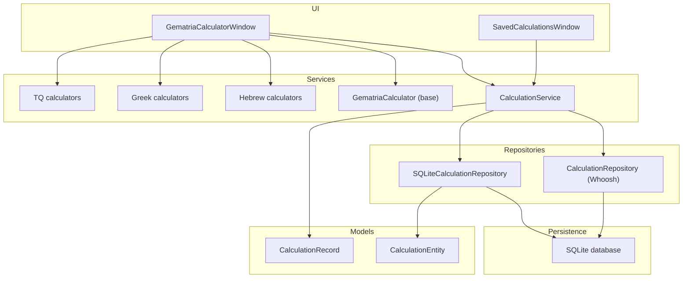
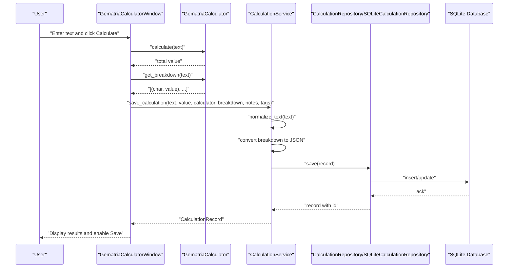
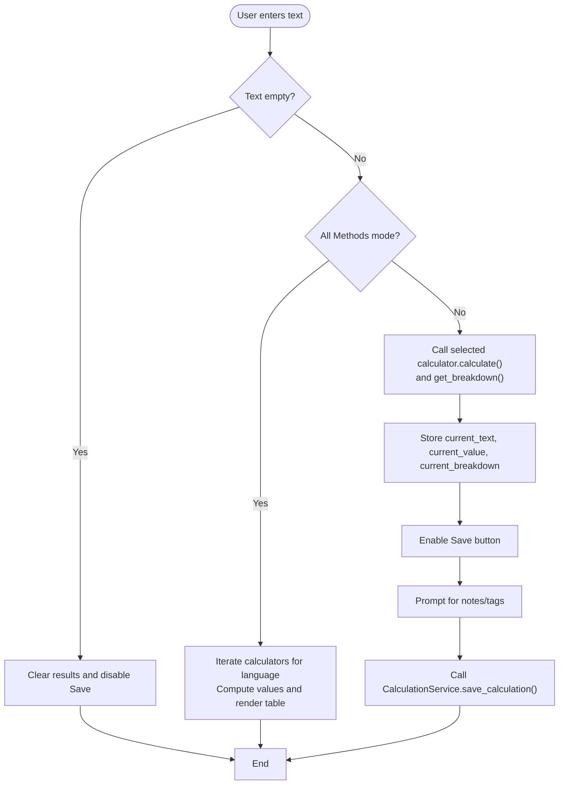
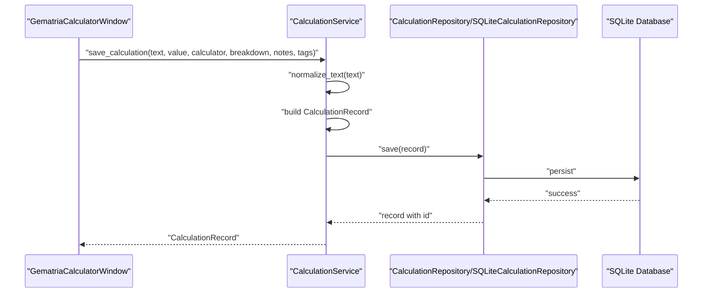
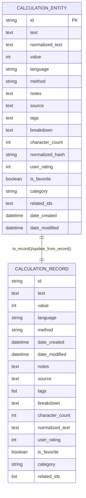
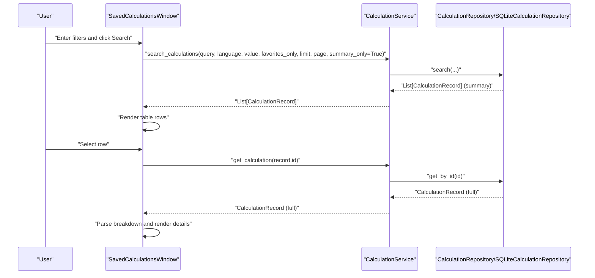
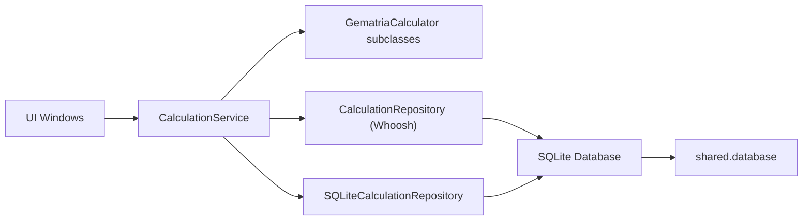

# Gematria Calculation Data Flow

<cite>
**Referenced Files in This Document**
- [gematria_calculator_window.py](file://src/pillars/gematria/ui/gematria_calculator_window.py)
- [base_calculator.py](file://src/pillars/gematria/services/base_calculator.py)
- [hebrew_calculator.py](file://src/pillars/gematria/services/hebrew_calculator.py)
- [greek_calculator.py](file://src/pillars/gematria/services/greek_calculator.py)
- [tq_calculator.py](file://src/pillars/gematria/services/tq_calculator.py)
- [calculation_service.py](file://src/pillars/gematria/services/calculation_service.py)
- [calculation_repository.py](file://src/pillars/gematria/repositories/calculation_repository.py)
- [sqlite_calculation_repository.py](file://src/pillars/gematria/repositories/sqlite_calculation_repository.py)
- [calculation_record.py](file://src/pillars/gematria/models/calculation_record.py)
- [calculation_entity.py](file://src/pillars/gematria/models/calculation_entity.py)
- [database.py](file://src/shared/database.py)
- [gematria_hub.py](file://src/pillars/gematria/ui/gematria_hub.py)
- [saved_calculations_window.py](file://src/pillars/gematria/ui/saved_calculations_window.py)
</cite>

## Table of Contents
1. [Introduction](#introduction)
2. [Project Structure](#project-structure)
3. [Core Components](#core-components)
4. [Architecture Overview](#architecture-overview)
5. [Detailed Component Analysis](#detailed-component-analysis)
6. [Dependency Analysis](#dependency-analysis)
7. [Performance Considerations](#performance-considerations)
8. [Troubleshooting Guide](#troubleshooting-guide)
9. [Conclusion](#conclusion)

## Introduction
This document explains the end-to-end data flow for the Gematria pillar, from user text input through the calculators, service orchestration, and persistence. It covers how Hebrew, Greek, and English (TQ) calculators process text and produce value/breakdown data, how the service layer validates and transforms this into a CalculationRecord model, and how the repository persists and retrieves data. It also illustrates the reverse flow for saved calculation retrieval and display, including error handling for invalid inputs and persistence failures. Finally, it highlights how the service layer decouples the UI from business logic and data access.

## Project Structure
The Gematria pillar is organized by concerns:
- UI: Calculator window and saved calculations browser
- Services: Calculator engines and CalculationService orchestration
- Models: CalculationRecord and SQLAlchemy entity
- Repositories: Whoosh and SQLite persistence
- Shared: Database configuration

**Diagram sources**
- [gematria_calculator_window.py](file://src/pillars/gematria/ui/gematria_calculator_window.py#L1-L120)
- [saved_calculations_window.py](file://src/pillars/gematria/ui/saved_calculations_window.py#L1-L120)
- [calculation_service.py](file://src/pillars/gematria/services/calculation_service.py#L1-L120)
- [base_calculator.py](file://src/pillars/gematria/services/base_calculator.py#L1-L107)
- [hebrew_calculator.py](file://src/pillars/gematria/services/hebrew_calculator.py#L1-L120)
- [greek_calculator.py](file://src/pillars/gematria/services/greek_calculator.py#L1-L120)
- [tq_calculator.py](file://src/pillars/gematria/services/tq_calculator.py#L1-L120)
- [calculation_repository.py](file://src/pillars/gematria/repositories/calculation_repository.py#L1-L120)
- [sqlite_calculation_repository.py](file://src/pillars/gematria/repositories/sqlite_calculation_repository.py#L1-L80)
- [calculation_record.py](file://src/pillars/gematria/models/calculation_record.py#L1-L89)
- [calculation_entity.py](file://src/pillars/gematria/models/calculation_entity.py#L1-L92)
- [database.py](file://src/shared/database.py#L1-L53)

**Section sources**
- [gematria_calculator_window.py](file://src/pillars/gematria/ui/gematria_calculator_window.py#L1-L120)
- [saved_calculations_window.py](file://src/pillars/gematria/ui/saved_calculations_window.py#L1-L120)
- [calculation_service.py](file://src/pillars/gematria/services/calculation_service.py#L1-L120)
- [calculation_repository.py](file://src/pillars/gematria/repositories/calculation_repository.py#L1-L120)
- [sqlite_calculation_repository.py](file://src/pillars/gematria/repositories/sqlite_calculation_repository.py#L1-L80)
- [calculation_record.py](file://src/pillars/gematria/models/calculation_record.py#L1-L89)
- [calculation_entity.py](file://src/pillars/gematria/models/calculation_entity.py#L1-L92)
- [database.py](file://src/shared/database.py#L1-L53)

## Core Components
- GematriaCalculator (base): Defines the abstract interface and shared normalization/diagnostic logic.
- Hebrew/Greek/TQ calculators: Implement specific letter-to-value mappings and derived variants (e.g., square, triangular, ordinal).
- CalculationService: Orchestrates saving/loading/searching, normalizes text, converts breakdown to JSON, and manages metadata.
- Repositories: Whoosh-based and SQLite-based implementations for storage and search.
- Models: CalculationRecord (application model) and CalculationEntity (SQLAlchemy ORM entity).
- UI: GematriaCalculatorWindow (input, calculation, save) and SavedCalculationsWindow (browse, search, edit).

**Section sources**
- [base_calculator.py](file://src/pillars/gematria/services/base_calculator.py#L1-L107)
- [hebrew_calculator.py](file://src/pillars/gematria/services/hebrew_calculator.py#L1-L120)
- [greek_calculator.py](file://src/pillars/gematria/services/greek_calculator.py#L1-L120)
- [tq_calculator.py](file://src/pillars/gematria/services/tq_calculator.py#L1-L120)
- [calculation_service.py](file://src/pillars/gematria/services/calculation_service.py#L1-L120)
- [calculation_repository.py](file://src/pillars/gematria/repositories/calculation_repository.py#L1-L120)
- [sqlite_calculation_repository.py](file://src/pillars/gematria/repositories/sqlite_calculation_repository.py#L1-L80)
- [calculation_record.py](file://src/pillars/gematria/models/calculation_record.py#L1-L89)
- [calculation_entity.py](file://src/pillars/gematria/models/calculation_entity.py#L1-L92)

## Architecture Overview
The system follows a layered architecture:
- UI layer: Presents input, triggers calculations, and saves results.
- Service layer: Validates inputs, orchestrates calculators, builds CalculationRecord, and delegates persistence.
- Persistence layer: Whoosh for fast text search and SQLite for structured relational storage.
- Model layer: CalculationRecord and CalculationEntity unify data representation across layers.

**Diagram sources**
- [gematria_calculator_window.py](file://src/pillars/gematria/ui/gematria_calculator_window.py#L341-L500)
- [base_calculator.py](file://src/pillars/gematria/services/base_calculator.py#L58-L107)
- [calculation_service.py](file://src/pillars/gematria/services/calculation_service.py#L23-L79)
- [calculation_repository.py](file://src/pillars/gematria/repositories/calculation_repository.py#L67-L117)
- [sqlite_calculation_repository.py](file://src/pillars/gematria/repositories/sqlite_calculation_repository.py#L37-L54)
- [database.py](file://src/shared/database.py#L12-L24)

## Detailed Component Analysis

### UI: GematriaCalculatorWindow
- Accepts user input, selects calculator (single or “All Methods” per language), and triggers calculation.
- Calls calculator.calculate() and calculator.get_breakdown() to compute total and per-character values.
- Stores current calculation state and enables Save when applicable.
- On Save, prompts for notes/tags, then calls CalculationService.save_calculation(), displaying success/failure.

**Section sources**
- [gematria_calculator_window.py](file://src/pillars/gematria/ui/gematria_calculator_window.py#L341-L500)

### Calculator Engines: Base and Variants
- Base class:
  - normalize_text(): Removes diacritical marks and normalizes Unicode for consistent comparison.
  - calculate(): Sums letter values from normalized text.
  - get_breakdown(): Returns ordered (char, value) pairs for display.
- Hebrew calculators: Standard, Sofit, Letter Value, Ordinal, Small Value, AtBash, Kolel, Square, Cube, Triangular, and others.
- Greek calculators: Standard Isopsephy, Letter Value, Ordinal, Small Value, Kolel, Square, Cube, Triangular, Digital, Reverse Substitution, Pair Matching, and others.
- TQ calculators: TQ (0–25), Reduced (digital root), Square, Triangular, Position (positional weighting).

```mermaid
classDiagram
class GematriaCalculator {
+normalize_text(text) str
+calculate(text) int
+get_breakdown(text) list
+get_letter_value(char) int
+name str
}
class HebrewGematriaCalculator
class HebrewSofitCalculator
class HebrewLetterValueCalculator
class HebrewOrdinalCalculator
class HebrewSmallValueCalculator
class HebrewAtBashCalculator
class HebrewKolelCalculator
class HebrewSquareCalculator
class HebrewCubeCalculator
class HebrewTriangularCalculator
class GreekGematriaCalculator
class GreekLetterValueCalculator
class GreekOrdinalCalculator
class GreekSmallValueCalculator
class GreekKolelCalculator
class GreekSquareCalculator
class GreekCubeCalculator
class GreekTriangularCalculator
class GreekDigitalCalculator
class GreekReverseSubstitutionCalculator
class GreekPairMatchingCalculator
class TQGematriaCalculator
class TQReducedCalculator
class TQSquareCalculator
class TQTriangularCalculator
class TQPositionCalculator
GematriaCalculator <|-- HebrewGematriaCalculator
GematriaCalculator <|-- HebrewSofitCalculator
GematriaCalculator <|-- HebrewLetterValueCalculator
GematriaCalculator <|-- HebrewOrdinalCalculator
GematriaCalculator <|-- HebrewSmallValueCalculator
GematriaCalculator <|-- HebrewAtBashCalculator
GematriaCalculator <|-- HebrewKolelCalculator
GematriaCalculator <|-- HebrewSquareCalculator
GematriaCalculator <|-- HebrewCubeCalculator
GematriaCalculator <|-- HebrewTriangularCalculator
GematriaCalculator <|-- GreekGematriaCalculator
GematriaCalculator <|-- GreekLetterValueCalculator
GematriaCalculator <|-- GreekOrdinalCalculator
GematriaCalculator <|-- GreekSmallValueCalculator
GematriaCalculator <|-- GreekKolelCalculator
GematriaCalculator <|-- GreekSquareCalculator
GematriaCalculator <|-- GreekCubeCalculator
GematriaCalculator <|-- GreekTriangularCalculator
GematriaCalculator <|-- GreekDigitalCalculator
GematriaCalculator <|-- GreekReverseSubstitutionCalculator
GematriaCalculator <|-- GreekPairMatchingCalculator
GematriaCalculator <|-- TQGematriaCalculator
GematriaCalculator <|-- TQReducedCalculator
GematriaCalculator <|-- TQSquareCalculator
GematriaCalculator <|-- TQTriangularCalculator
GematriaCalculator <|-- TQPositionCalculator
```

**Diagram sources**
- [base_calculator.py](file://src/pillars/gematria/services/base_calculator.py#L1-L107)
- [hebrew_calculator.py](file://src/pillars/gematria/services/hebrew_calculator.py#L1-L120)
- [greek_calculator.py](file://src/pillars/gematria/services/greek_calculator.py#L1-L120)
- [tq_calculator.py](file://src/pillars/gematria/services/tq_calculator.py#L1-L120)

**Section sources**
- [base_calculator.py](file://src/pillars/gematria/services/base_calculator.py#L30-L107)
- [hebrew_calculator.py](file://src/pillars/gematria/services/hebrew_calculator.py#L1-L120)
- [greek_calculator.py](file://src/pillars/gematria/services/greek_calculator.py#L1-L120)
- [tq_calculator.py](file://src/pillars/gematria/services/tq_calculator.py#L1-L120)

### Service Layer: CalculationService
- save_calculation(): Converts breakdown to JSON, normalizes text via calculator.normalize_text(), constructs CalculationRecord, and delegates to repository.save().
- update_calculation()/delete_calculation()/get_calculation(): CRUD helpers.
- search_calculations()/get_all_calculations()/get_calculations_by_value()/get_favorite_calculations()/toggle_favorite(): Query and metadata management.
- get_breakdown_from_record(): Parses JSON breakdown into (char, value) tuples with defensive fallback.

**Diagram sources**
- [calculation_service.py](file://src/pillars/gematria/services/calculation_service.py#L23-L79)
- [calculation_repository.py](file://src/pillars/gematria/repositories/calculation_repository.py#L67-L117)
- [sqlite_calculation_repository.py](file://src/pillars/gematria/repositories/sqlite_calculation_repository.py#L37-L54)

**Section sources**
- [calculation_service.py](file://src/pillars/gematria/services/calculation_service.py#L1-L273)

### Persistence: Repositories and Models
- Whoosh-based CalculationRepository:
  - save(): Generates UUID if missing, updates timestamps, writes fields to Whoosh index.
  - get_by_id()/delete()/search()/get_all()/get_by_value()/get_favorites()/get_by_tags(): Query and conversion helpers.
  - _result_to_summary/_result_to_record(): Convert Whoosh hits to CalculationRecord.
- SQLite-based SQLiteCalculationRepository:
  - save(): Upserts CalculationEntity, sets timestamps, flushes, returns record.
  - get_by_id()/delete()/search()/get_all()/get_by_value()/get_favorites()/get_by_tags(): Query helpers with SQLAlchemy.
- Models:
  - CalculationRecord: Application data model with to_dict/from_dict and string representation.
  - CalculationEntity: SQLAlchemy ORM mapped to gematria_calculations table with JSON fields for tags/breakdown/related_ids.

**Diagram sources**
- [calculation_entity.py](file://src/pillars/gematria/models/calculation_entity.py#L18-L92)
- [calculation_record.py](file://src/pillars/gematria/models/calculation_record.py#L8-L89)

**Section sources**
- [calculation_repository.py](file://src/pillars/gematria/repositories/calculation_repository.py#L1-L329)
- [sqlite_calculation_repository.py](file://src/pillars/gematria/repositories/sqlite_calculation_repository.py#L1-L143)
- [calculation_entity.py](file://src/pillars/gematria/models/calculation_entity.py#L18-L92)
- [calculation_record.py](file://src/pillars/gematria/models/calculation_record.py#L8-L89)
- [database.py](file://src/shared/database.py#L12-L24)

### Reverse Flow: Saved Calculation Retrieval and Display
- SavedCalculationsWindow:
  - Provides search/filter controls (text, value, language, favorites).
  - Calls CalculationService.search_calculations(query, language, value, favorites_only, limit, page, summary_only=True) to fetch lightweight summaries.
  - On selection, fetches full record via get_calculation(record.id) and displays details including parsed breakdown via get_breakdown_from_record(record).
  - Supports toggling favorite and deleting records.

**Diagram sources**
- [saved_calculations_window.py](file://src/pillars/gematria/ui/saved_calculations_window.py#L191-L333)
- [calculation_service.py](file://src/pillars/gematria/services/calculation_service.py#L140-L200)
- [calculation_repository.py](file://src/pillars/gematria/repositories/calculation_repository.py#L156-L228)
- [sqlite_calculation_repository.py](file://src/pillars/gematria/repositories/sqlite_calculation_repository.py#L56-L117)

**Section sources**
- [saved_calculations_window.py](file://src/pillars/gematria/ui/saved_calculations_window.py#L191-L333)
- [calculation_service.py](file://src/pillars/gematria/services/calculation_service.py#L140-L200)

### Role of the Service Layer
- Decouples UI from calculators and repositories:
  - UI depends on CalculationService for orchestration and persistence.
  - CalculationService depends on calculators and repositories via abstractions.
- Centralizes validation and transformation:
  - normalize_text() ensures consistent input across languages.
  - JSON serialization of breakdown for portability.
  - Metadata enrichment (character_count, timestamps, tags).
- Enables pluggable persistence:
  - Whoosh for fast text search and SQLite for relational storage.
  - Easy to swap implementations without changing UI.

**Section sources**
- [gematria_calculator_window.py](file://src/pillars/gematria/ui/gematria_calculator_window.py#L341-L500)
- [calculation_service.py](file://src/pillars/gematria/services/calculation_service.py#L1-L120)
- [calculation_repository.py](file://src/pillars/gematria/repositories/calculation_repository.py#L1-L120)
- [sqlite_calculation_repository.py](file://src/pillars/gematria/repositories/sqlite_calculation_repository.py#L1-L80)

## Dependency Analysis
- UI depends on CalculationService and calculators.
- CalculationService depends on calculators and repositories.
- Repositories depend on models and database configuration.
- Database configuration defines SQLite path and session factory.

**Diagram sources**
- [gematria_calculator_window.py](file://src/pillars/gematria/ui/gematria_calculator_window.py#L1-L120)
- [saved_calculations_window.py](file://src/pillars/gematria/ui/saved_calculations_window.py#L1-L120)
- [calculation_service.py](file://src/pillars/gematria/services/calculation_service.py#L1-L120)
- [calculation_repository.py](file://src/pillars/gematria/repositories/calculation_repository.py#L1-L120)
- [sqlite_calculation_repository.py](file://src/pillars/gematria/repositories/sqlite_calculation_repository.py#L1-L80)
- [database.py](file://src/shared/database.py#L12-L24)

**Section sources**
- [gematria_hub.py](file://src/pillars/gematria/ui/gematria_hub.py#L140-L186)
- [database.py](file://src/shared/database.py#L12-L24)

## Performance Considerations
- Text normalization occurs in calculators and service layer; keep input sizes reasonable to avoid long loops.
- JSON breakdown serialization/deserialization is lightweight but avoid excessive re-parsing in UI loops.
- Whoosh indexing is efficient for text search; ensure query filters (language/value/tags) are used to narrow results.
- SQLite operations use transactions and commit/rollback contexts; batch operations can leverage session reuse.
- UI rendering of large breakdowns can be expensive; consider lazy loading full records on selection.

[No sources needed since this section provides general guidance]

## Troubleshooting Guide
Common issues and handling:
- Invalid inputs:
  - Empty text clears results and disables Save. See [gematria_calculator_window.py](file://src/pillars/gematria/ui/gematria_calculator_window.py#L341-L392).
  - Non-numeric value filter in SavedCalculationsWindow shows a warning. See [saved_calculations_window.py](file://src/pillars/gematria/ui/saved_calculations_window.py#L200-L208).
- Persistence failures:
  - Whoosh writer.commit() exceptions are caught and canceled; errors bubble to UI. See [calculation_repository.py](file://src/pillars/gematria/repositories/calculation_repository.py#L114-L117).
  - SQLite session rollback on exceptions; errors surfaced to UI. See [sqlite_calculation_repository.py](file://src/pillars/gematria/repositories/sqlite_calculation_repository.py#L22-L33).
- Parsing breakdown:
  - get_breakdown_from_record() gracefully returns empty list on malformed JSON. See [calculation_service.py](file://src/pillars/gematria/services/calculation_service.py#L241-L273).
- UI feedback:
  - Save success/failure dialogs and error messages are shown in GematriaCalculatorWindow. See [gematria_calculator_window.py](file://src/pillars/gematria/ui/gematria_calculator_window.py#L443-L500).
  - SavedCalculationsWindow shows critical error dialogs for search/delete failures. See [saved_calculations_window.py](file://src/pillars/gematria/ui/saved_calculations_window.py#L226-L228).

**Section sources**
- [gematria_calculator_window.py](file://src/pillars/gematria/ui/gematria_calculator_window.py#L341-L500)
- [saved_calculations_window.py](file://src/pillars/gematria/ui/saved_calculations_window.py#L200-L228)
- [calculation_repository.py](file://src/pillars/gematria/repositories/calculation_repository.py#L114-L117)
- [sqlite_calculation_repository.py](file://src/pillars/gematria/repositories/sqlite_calculation_repository.py#L22-L33)
- [calculation_service.py](file://src/pillars/gematria/services/calculation_service.py#L241-L273)

## Conclusion
The Gematria pillar cleanly separates concerns:
- UI focuses on user interaction and display.
- Service layer encapsulates business logic, normalization, and persistence orchestration.
- Repositories abstract storage mechanisms (Whoosh and SQLite).
- Models unify data representation across layers.

This design enables extensibility (new calculators, repositories), maintainability (clear boundaries), and robustness (defensive parsing and error handling).