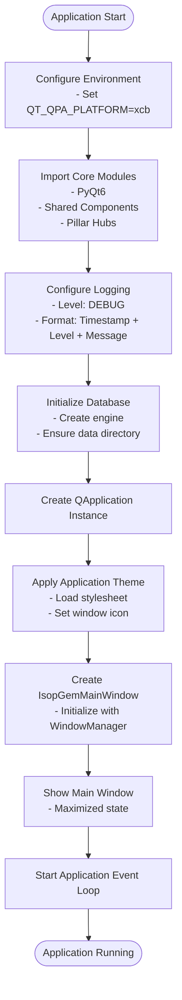
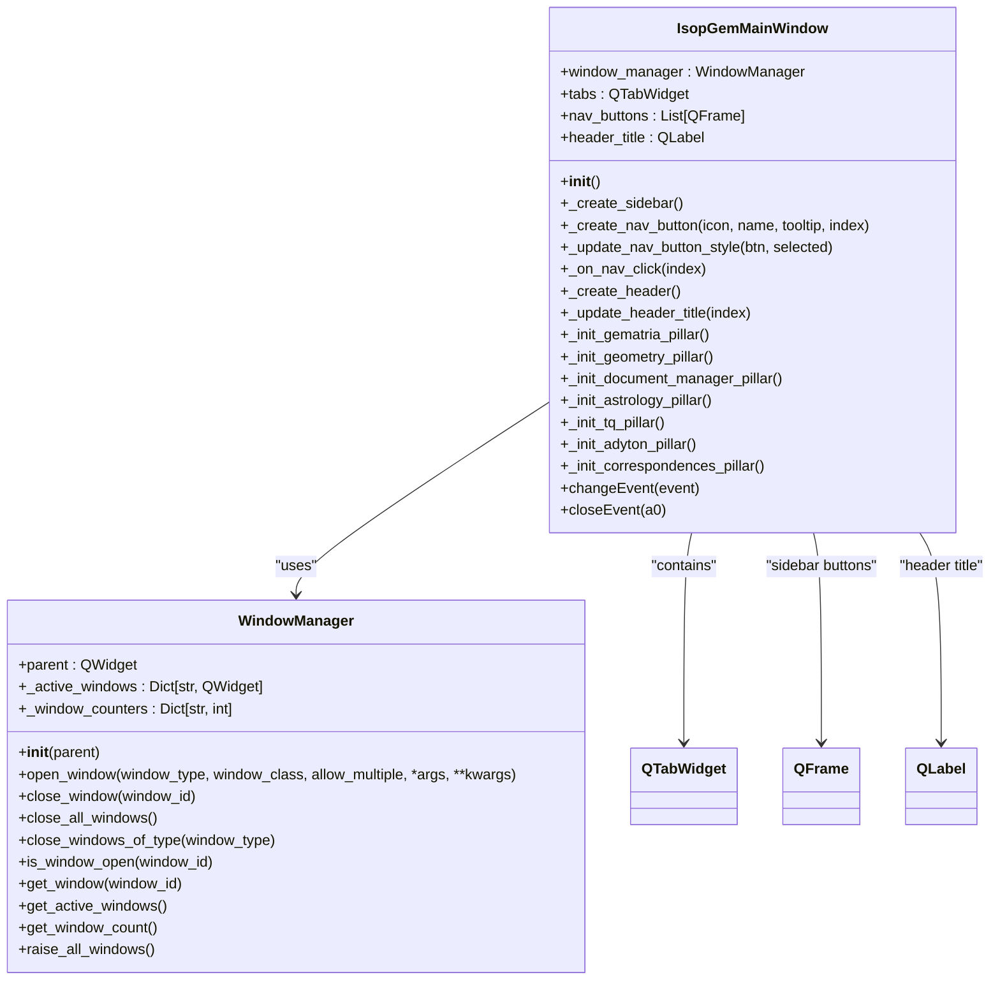
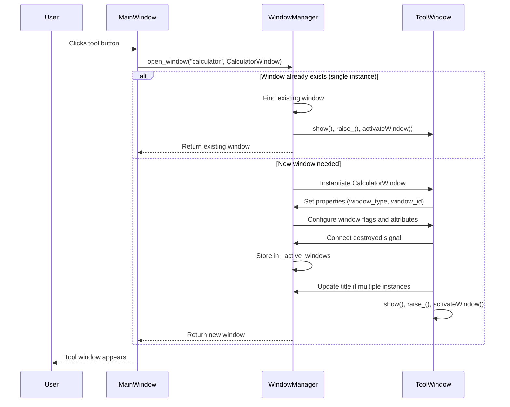
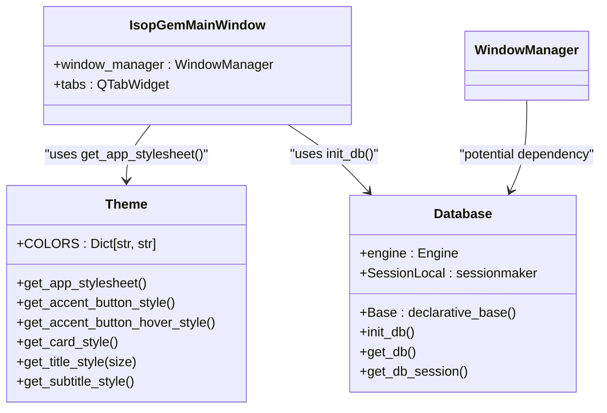

# Main Application Shell

<cite>
**Referenced Files in This Document**   
- [main.py](file://src/main.py)
- [window_manager.py](file://src/shared/ui/window_manager.py)
- [theme.py](file://src/shared/ui/theme.py)
- [database.py](file://src/shared/database.py)
- [run.sh](file://run.sh)
- [test.sh](file://test.sh)
- [SYSTEM_MAP.md](file://wiki/SYSTEM_MAP.md)
</cite>

## Table of Contents
1. [Introduction](#introduction)
2. [Application Entry Point](#application-entry-point)
3. [Main Window Architecture](#main-window-architecture)
4. [Window Management System](#window-management-system)
5. [Shared Services](#shared-services)
6. [Application Lifecycle](#application-lifecycle)
7. [Shell Scripting](#shell-scripting)
8. [Conclusion](#conclusion)

## Introduction
The IsopGem application features a sophisticated main application shell that serves as the central orchestrator for its seven specialized pillars of esoteric analysis. This document provides a comprehensive analysis of the main application shell, detailing its architecture, component interactions, and lifecycle management. The shell implements a modern PyQt6-based interface with a centralized window management system, shared services for database and UI styling, and robust application lifecycle controls.

**Section sources**
- [main.py](file://src/main.py)
- [SYSTEM_MAP.md](file://wiki/SYSTEM_MAP.md)

## Application Entry Point

The application entry point is defined in `src/main.py`, which serves as the "Big Bang" for the entire IsopGem system. This module initializes the core application components and launches the seven sovereign pillars that constitute the integrated esoteric analysis platform.

The entry point follows a structured initialization pattern:
1. Environment configuration (setting Qt platform to X11 for stability)
2. Import of core dependencies and pillar components
3. Creation of the main application window class
4. Definition of the main execution function
5. Conditional execution when run as the primary module

The main function handles critical initialization tasks including logging configuration, database setup, and application-wide styling. It also establishes signal handlers for graceful shutdown on interrupt signals (Ctrl+C), ensuring proper cleanup of resources.

**Diagram sources**
- [main.py](file://src/main.py#L340-L382)

**Section sources**
- [main.py](file://src/main.py#L340-L382)
- [SYSTEM_MAP.md](file://wiki/SYSTEM_MAP.md#L32-L34)

## Main Window Architecture

The `IsopGemMainWindow` class implements a sophisticated multi-pillar interface with a modern, immersive design. The window architecture follows a clean separation of concerns with distinct components for navigation, content display, and window management.

### Core Components

The main window consists of several key architectural components:

- **Sidebar Navigation**: A fixed-width sidebar with gradient background featuring seven navigation buttons, each representing a pillar of the application
- **Content Area**: A tabbed interface that displays the active pillar's content without visible tab headers (managed by the sidebar)
- **Header Bar**: A top header that dynamically updates to reflect the currently active pillar
- **Window Manager**: A centralized system for managing floating tool windows across all pillars

### Navigation System

The navigation system employs a clean, icon-based interface with seven distinct pillars represented by unique icons and tooltips. The sidebar uses a dark gradient theme with subtle shadow effects to create depth. Navigation is handled through mouse event listeners on custom QFrame buttons, which update both the tab index and visual selection state.

The navigation items include:
- 📖 Gematria (Sacred numerology)
- 📐 Geometry (Sacred geometry)
- 📚 Documents (Document manager)
- ⭐ Astrology (Celestial charts)
- 🔺 TQ (Ternary quadsets)
- 🏛️ Adyton (Inner sanctuary)
- 💎 Emerald (Correspondences)

### Tab Management

The tab system uses a QTabWidget with the tab bar hidden, as navigation is controlled exclusively through the sidebar. This creates a seamless, immersive experience where the user interacts with the application through the sidebar rather than traditional tabs. The current tab index is synchronized with the navigation buttons, ensuring visual consistency.

**Diagram sources**
- [main.py](file://src/main.py#L27-L338)

**Section sources**
- [main.py](file://src/main.py#L27-L338)

## Window Management System

The window management system is a critical component of the IsopGem application, providing centralized control over all floating tool windows across the seven pillars. Implemented in `src/shared/ui/window_manager.py`, this system ensures consistent window behavior, proper lifecycle management, and coordinated interactions between the main application and its tools.

### Key Features

The WindowManager class provides several essential features:

- **Centralized Tracking**: Maintains a dictionary of all active windows with unique identifiers
- **Instance Management**: Supports both single-instance and multiple-instance window types
- **Lifecycle Control**: Handles window opening, closing, and cleanup
- **Z-Order Management**: Provides methods to raise all windows to the front
- **Cross-Pillar Coordination**: Enables windows from different pillars to interact seamlessly

### Window Opening Process

The window opening process follows a well-defined sequence:

1. Generate a unique window ID based on type and instance counter
2. For single-instance windows, check if an instance already exists and reuse it
3. Create a new window instance with proper parent references
4. Configure window properties and event handlers
5. Store the window reference in the active windows dictionary
6. Display and activate the window

The system uses Qt's WA_DeleteOnClose attribute to ensure proper cleanup and prevents tool windows from inadvertently closing the entire application through the WA_QuitOnClose attribute.

### Window Types and Identification

Windows are identified by type identifiers (e.g., 'gematria_calculator') and unique IDs. The system tracks instance counts for each window type, allowing for numbered instances when multiple windows of the same type are permitted. Window properties are used to store metadata, making it easy to query and manage windows by type.

**Diagram sources**
- [window_manager.py](file://src/shared/ui/window_manager.py#L15-L221)

**Section sources**
- [window_manager.py](file://src/shared/ui/window_manager.py#L15-L221)
- [main.py](file://src/main.py#L52)
- [test.sh](file://test.sh#L57-L58)

## Shared Services

The IsopGem application shell provides several shared services that are utilized across all pillars, ensuring consistency and reducing code duplication.

### UI Styling and Theming

The theme system, implemented in `src/shared/ui/theme.py`, provides a comprehensive stylesheet for the entire application. The theme defines a modern color palette with primary, accent, and neutral colors, along with consistent styling for all Qt widgets including buttons, input fields, combo boxes, tables, and scroll bars.

The theme system includes utility functions for generating specific styles:
- `get_app_stylesheet()`: Returns the complete application stylesheet
- `get_accent_button_style()`: Provides styling for accent/success buttons
- `get_card_style()`: Defines styles for card-like containers
- `get_title_style()`: Configures title label appearance
- `get_subtitle_style()`: Sets subtitle label styling

### Database Management

The database service, located in `src/shared/database.py`, handles all database connections and session management. It uses SQLAlchemy with SQLite as the backend, creating a database file in the `data/` directory. The service provides:

- A global engine instance for database connections
- A session factory for creating database sessions
- An initialization function to create all tables
- A context manager for safe session handling
- Lazy model imports to ensure proper table creation

The database path is calculated relative to the source file, ensuring portability across different deployment environments.

**Diagram sources**
- [theme.py](file://src/shared/ui/theme.py#L39-L333)
- [database.py](file://src/shared/database.py#L1-L54)

**Section sources**
- [theme.py](file://src/shared/ui/theme.py#L39-L333)
- [database.py](file://src/shared/database.py#L1-L54)
- [main.py](file://src/main.py#L360)
- [main.py](file://src/main.py#L349)

## Application Lifecycle

The application lifecycle is carefully managed to ensure proper initialization, operation, and cleanup of all components.

### Startup Sequence

The startup sequence follows a precise order:

1. Environment variables are set (Qt platform to X11)
2. Logging is configured with debug level and timestamp formatting
3. Database is initialized, creating tables if necessary
4. QApplication instance is created
5. Application-wide stylesheet and icon are applied
6. Main window is instantiated and displayed maximized
7. Event loop begins processing user interactions

### Shutdown Process

The shutdown process is handled through multiple mechanisms:

- **Main Window Close**: When the main window is closed, it triggers the closeEvent which closes all managed windows before accepting the close
- **Application Quit**: The application is configured to quit when the last window is closed
- **Signal Handling**: Ctrl+C interrupts are caught and handled gracefully, allowing for proper cleanup

The window manager plays a crucial role in shutdown by ensuring all tool windows are properly closed before the application exits.

### Event Handling

The main window implements several event handlers to maintain proper state:

- `changeEvent`: Detects window activation changes and raises all managed windows to ensure visibility
- `closeEvent`: Coordinates the closing of all managed windows before allowing the main window to close

## Shell Scripting

The application includes two shell scripts that facilitate development and deployment.

### Run Script (run.sh)

The `run.sh` script provides a convenient way to launch the application with proper environment setup:

- Determines the script directory for relative path resolution
- Activates the virtual environment if present
- Sets the Qt platform to XCB
- Changes to the source directory
- Preserves terminal state during execution
- Ensures proper exit code propagation

The script uses stty and reset commands to maintain terminal integrity, preventing issues that can arise from interrupted applications.

### Test Script (test.sh)

The `test.sh` script provides a robust testing interface:

- Validates the presence of the virtual environment
- Provides helpful usage information
- Supports quiet and verbose output modes
- Allows passing arbitrary pytest arguments
- Ensures unbuffered Python output
- Maintains isolation by not modifying the shell environment

The script follows best practices for error handling and provides clear feedback when prerequisites are not met.

```mermaid
flowchart TD
subgraph "run.sh"
A[Start] --> B["Get script directory"]
B --> C{"Virtual environment exists?"}
C --> |Yes| D["Activate virtual environment"]
C --> |No| E["Continue without activation"]
D --> F["Set QT_QPA_PLATFORM=xcb"]
F --> G["Change to src directory"]
G --> H["Preserve terminal state"]
H --> I["Execute python main.py"]
I --> J["Capture exit code"]
J --> K["Restore terminal state"]
K --> L["Reset terminal"]
L --> M["Exit with captured code"]
end
subgraph "test.sh"
N[Start] --> O["Validate virtual environment"]
O --> P{"Environment valid?"}
P --> |No| Q["Display error and exit"]
P --> |Yes| R["Process arguments"]
R --> S{"Arguments provided?"}
S --> |No| T["Run pytest -q"]
S --> |Yes| U["Run pytest with provided arguments"]
U --> V["Exit"]
T --> V
end
```

**Diagram sources**
- [run.sh](file://run.sh#L1-L24)
- [test.sh](file://test.sh#L1-L43)

**Section sources**
- [run.sh](file://run.sh#L1-L24)
- [test.sh](file://test.sh#L1-L43)
- [main.py](file://src/main.py#L8)

## Conclusion

The IsopGem main application shell represents a sophisticated and well-architected foundation for a complex esoteric analysis platform. By implementing a centralized window management system, shared services for UI styling and database access, and robust lifecycle controls, the shell provides a cohesive and immersive user experience across seven distinct domains of study.

The architecture demonstrates several best practices in desktop application development, including proper separation of concerns, consistent UI design, and graceful error handling. The use of a modern Python stack with PyQt6, SQLAlchemy, and industry-standard development practices ensures both functionality and maintainability.

The shell's design enables the seamless integration of specialized tools while maintaining a unified interface, allowing users to transition smoothly between different modes of esoteric analysis. This cohesive approach enhances the overall user experience and supports the application's mission as an integrated platform for advanced research and exploration.