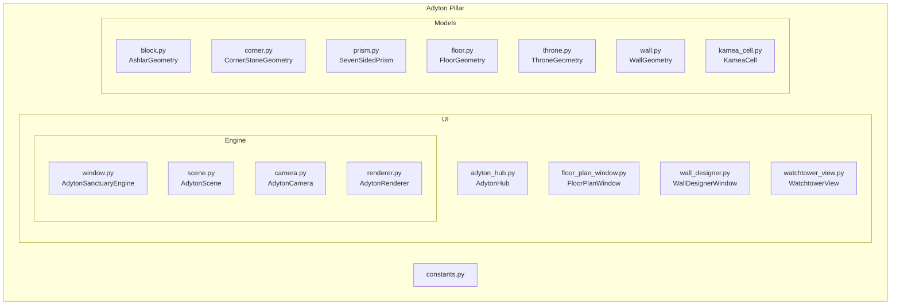
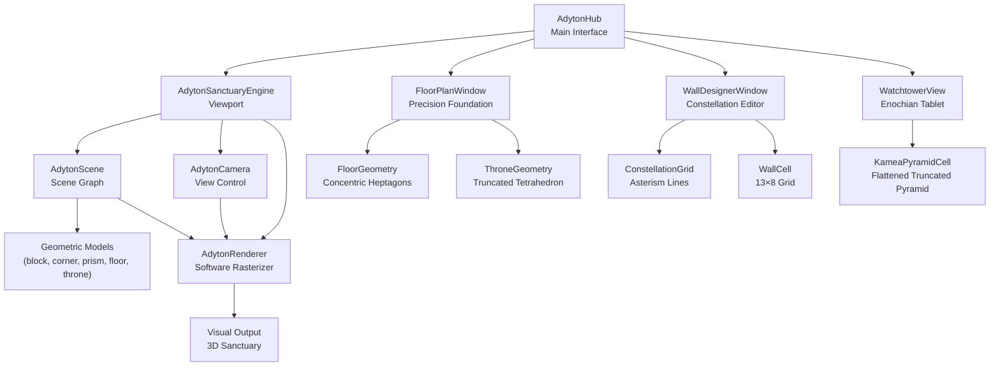
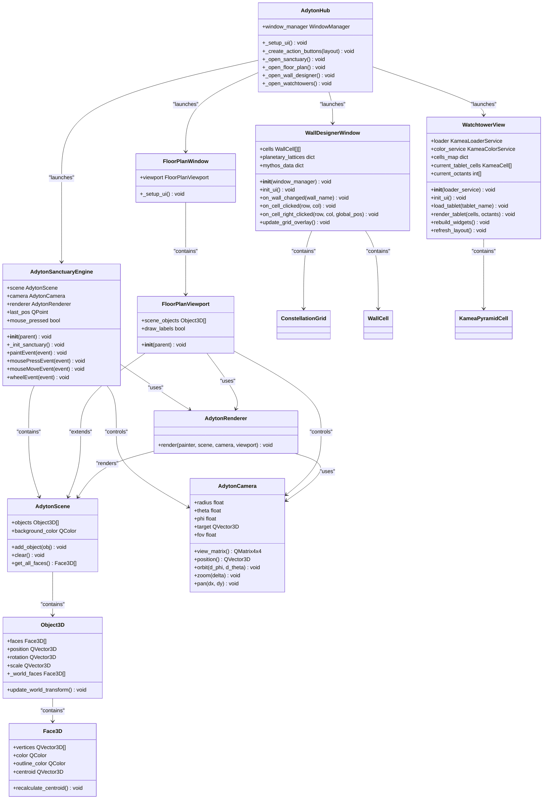
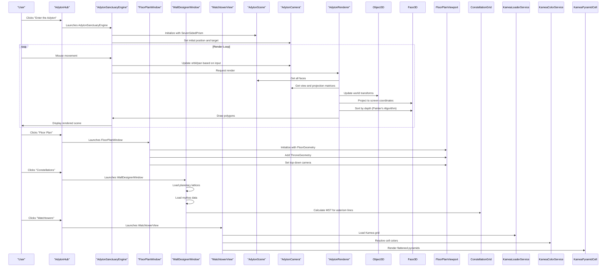
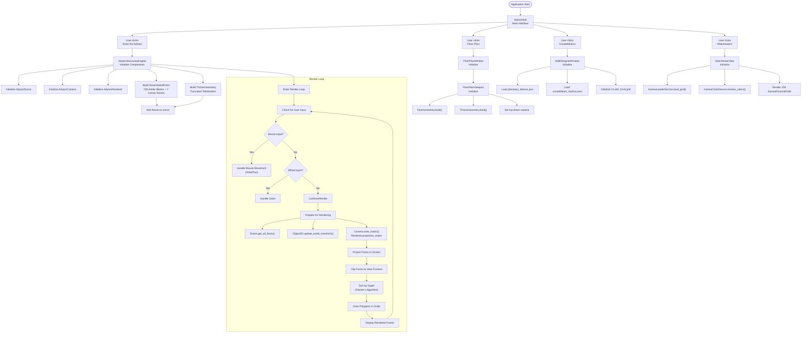
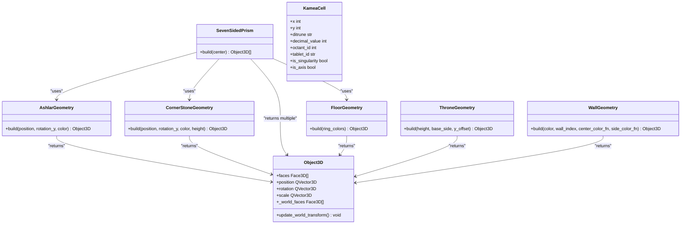
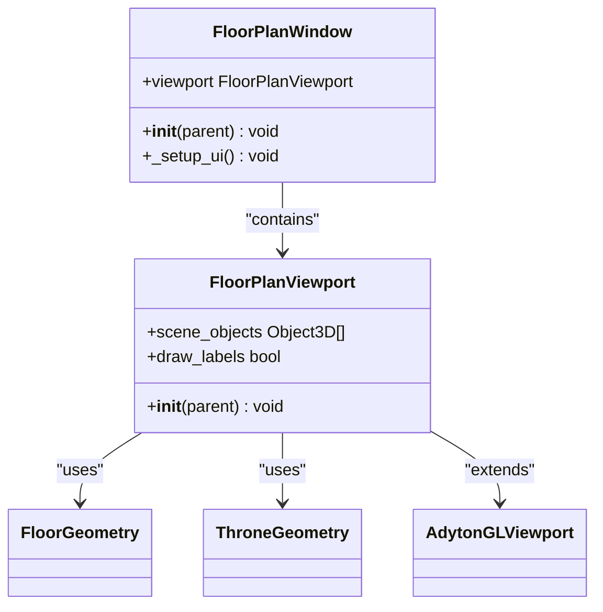
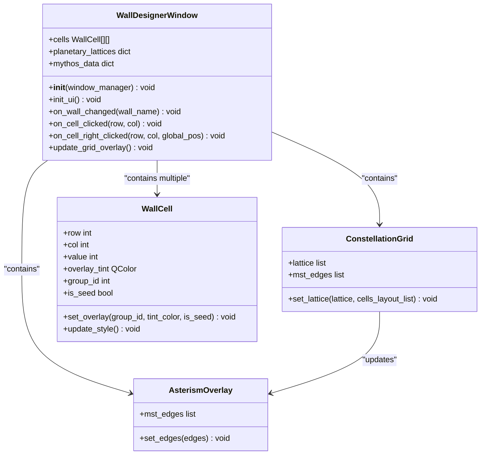
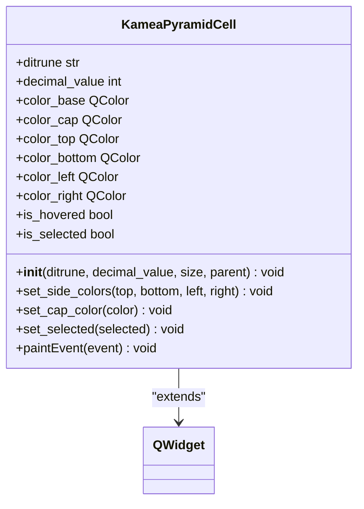
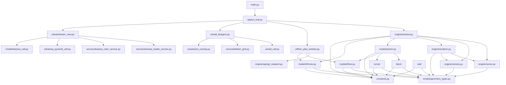

# Adyton Pillar

<cite>
**Referenced Files in This Document**   
- [adyton_hub.py](file://src/pillars/adyton/ui/adyton_hub.py)
- [window.py](file://src/pillars/adyton/ui/engine/window.py)
- [scene.py](file://src/pillars/adyton/ui/engine/scene.py)
- [camera.py](file://src/pillars/adyton/ui/engine/camera.py)
- [renderer.py](file://src/pillars/adyton/ui/engine/renderer.py)
- [block.py](file://src/pillars/adyton/models/block.py)
- [corner.py](file://src/pillars/adyton/models/corner.py)
- [prism.py](file://src/pillars/adyton/models/prism.py)
- [geometry_types.py](file://src/pillars/adyton/models/geometry_types.py)
- [constants.py](file://src/pillars/adyton/constants.py)
- [main.py](file://src/main.py)
- [adyton_concept.md](file://Docs/architecture/adyton_concept.md)
- [floor_plan_window.py](file://src/pillars/adyton/ui/floor_plan_window.py)
- [floor.py](file://src/pillars/adyton/models/floor.py)
- [throne.py](file://src/pillars/adyton/models/throne.py)
- [wall_designer.py](file://src/pillars/adyton/ui/wall_designer.py)
- [kamea_pyramid_cell.py](file://src/pillars/adyton/ui/kamea_pyramid_cell.py)
- [kamea_cell.py](file://src/pillars/adyton/models/kamea_cell.py)
- [wall.py](file://src/pillars/adyton/models/wall.py)
- [watchtower_view.py](file://src/pillars/adyton/ui/watchtower_view.py)
</cite>

## Update Summary
**Changes Made**   
- Updated core components to include new visualization tools: throne, floor plan window, kamea pyramid cell, and wall designer
- Added new sections for the throne geometry, floor plan visualization, and wall designer functionality
- Enhanced architectural overview with new component interactions
- Updated detailed component analysis to reflect new UI and model classes
- Added new diagrams for the expanded component structure and data flow

## Table of Contents
1. [Introduction](#introduction)
2. [Project Structure](#project-structure)
3. [Core Components](#core-components)
4. [Architecture Overview](#architecture-overview)
5. [Detailed Component Analysis](#detailed-component-analysis)
6. [Dependency Analysis](#dependency-analysis)
7. [Performance Considerations](#performance-considerations)
8. [Troubleshooting Guide](#troubleshooting-guide)
9. [Conclusion](#conclusion)

## Introduction
The Adyton pillar serves as the 3D inner sanctuary engine within the isopgem application, providing an immersive visualization layer for esoteric geometries and sacred spaces. This architectural documentation details the engine's structure, components, and functionality, focusing on its role as a visualization system for complex mathematical and metaphysical concepts from other pillars of the application. The Adyton functions as a chamber of contemplation and analysis, rendering intricate geometric models that represent spiritual and mathematical principles. Recent updates have enhanced the visualization capabilities with new components including the throne, floor plan window, kamea pyramid cell, and wall designer.

## Project Structure
The Adyton pillar is organized within the src/pillars/adyton directory with a clear separation between models, UI components, and constants. The structure follows a modular design pattern with distinct components for scene management, camera control, rendering, and geometric modeling.

**Diagram sources**
- [adyton_hub.py](file://src/pillars/adyton/ui/adyton_hub.py)
- [window.py](file://src/pillars/adyton/ui/engine/window.py)
- [scene.py](file://src/pillars/adyton/ui/engine/scene.py)
- [camera.py](file://src/pillars/adyton/ui/engine/camera.py)
- [renderer.py](file://src/pillars/adyton/ui/engine/renderer.py)
- [block.py](file://src/pillars/adyton/models/block.py)
- [corner.py](file://src/pillars/adyton/models/corner.py)
- [prism.py](file://src/pillars/adyton/models/prism.py)
- [floor.py](file://src/pillars/adyton/models/floor.py)
- [throne.py](file://src/pillars/adyton/models/throne.py)
- [wall.py](file://src/pillars/adyton/models/wall.py)
- [kamea_cell.py](file://src/pillars/adyton/models/kamea_cell.py)
- [constants.py](file://src/pillars/adyton/constants.py)

**Section sources**
- [adyton_hub.py](file://src/pillars/adyton/ui/adyton_hub.py)
- [window.py](file://src/pillars/adyton/ui/engine/window.py)
- [scene.py](file://src/pillars/adyton/ui/engine/scene.py)
- [camera.py](file://src/pillars/adyton/ui/engine/camera.py)
- [renderer.py](file://src/pillars/adyton/ui/engine/renderer.py)
- [block.py](file://src/pillars/adyton/models/block.py)
- [corner.py](file://src/pillars/adyton/models/corner.py)
- [prism.py](file://src/pillars/adyton/models/prism.py)
- [floor.py](file://src/pillars/adyton/models/floor.py)
- [throne.py](file://src/pillars/adyton/models/throne.py)
- [wall.py](file://src/pillars/adyton/models/wall.py)
- [kamea_cell.py](file://src/pillars/adyton/models/kamea_cell.py)
- [constants.py](file://src/pillars/adyton/constants.py)

## Core Components
The Adyton pillar consists of several core components that work together to create an immersive 3D visualization environment. The adyton_hub serves as the main interface, providing access to the 3D engine. The scene.py module manages the 3D scene graph, camera.py handles viewpoint control, and renderer.py is responsible for visual output. These components work in concert with geometric models (block, corner, prism) that construct the sacred spaces visualized in the engine. Recent updates have expanded the component set to include specialized visualization tools: the throne geometry representing the seat of the adept, the floor plan window for precision foundation visualization, the kamea pyramid cell for 2D representation of truncated pyramids, and the wall designer for constellation map editing.

**Section sources**
- [adyton_hub.py](file://src/pillars/adyton/ui/adyton_hub.py)
- [window.py](file://src/pillars/adyton/ui/engine/window.py)
- [scene.py](file://src/pillars/adyton/ui/engine/scene.py)
- [camera.py](file://src/pillars/adyton/ui/engine/camera.py)
- [renderer.py](file://src/pillars/adyton/ui/engine/renderer.py)
- [block.py](file://src/pillars/adyton/models/block.py)
- [corner.py](file://src/pillars/adyton/models/corner.py)
- [prism.py](file://src/pillars/adyton/models/prism.py)
- [floor.py](file://src/pillars/adyton/models/floor.py)
- [throne.py](file://src/pillars/adyton/models/throne.py)
- [wall.py](file://src/pillars/adyton/models/wall.py)
- [kamea_cell.py](file://src/pillars/adyton/models/kamea_cell.py)
- [wall_designer.py](file://src/pillars/adyton/ui/wall_designer.py)
- [kamea_pyramid_cell.py](file://src/pillars/adyton/ui/kamea_pyramid_cell.py)
- [floor_plan_window.py](file://src/pillars/adyton/ui/floor_plan_window.py)

## Architecture Overview
The Adyton engine follows a classic 3D graphics architecture with distinct components for scene management, camera control, and rendering. The system uses a software rasterization approach with the Painter's Algorithm for depth sorting, implemented through PyQt6's QPainter. The architecture is designed to visualize complex esoteric geometries and sacred spaces, serving as a visualization layer for mathematical and metaphysical concepts from other pillars of the application. Recent updates have expanded the architecture to include specialized visualization tools for different aspects of the sanctuary.

**Diagram sources**
- [adyton_hub.py](file://src/pillars/adyton/ui/adyton_hub.py)
- [window.py](file://src/pillars/adyton/ui/engine/window.py)
- [floor_plan_window.py](file://src/pillars/adyton/ui/floor_plan_window.py)
- [wall_designer.py](file://src/pillars/adyton/ui/wall_designer.py)
- [watchtower_view.py](file://src/pillars/adyton/ui/watchtower_view.py)
- [scene.py](file://src/pillars/adyton/ui/engine/scene.py)
- [camera.py](file://src/pillars/adyton/ui/engine/camera.py)
- [renderer.py](file://src/pillars/adyton/ui/engine/renderer.py)
- [block.py](file://src/pillars/adyton/models/block.py)
- [corner.py](file://src/pillars/adyton/models/corner.py)
- [prism.py](file://src/pillars/adyton/models/prism.py)
- [floor.py](file://src/pillars/adyton/models/floor.py)
- [throne.py](file://src/pillars/adyton/models/throne.py)
- [wall.py](file://src/pillars/adyton/models/wall.py)
- [kamea_cell.py](file://src/pillars/adyton/models/kamea_cell.py)
- [kamea_pyramid_cell.py](file://src/pillars/adyton/ui/kamea_pyramid_cell.py)

## Detailed Component Analysis

### Component A Analysis
The Adyton pillar's components work together to create an immersive visualization environment for esoteric geometries. The system is designed to render sacred spaces based on precise mathematical and metaphysical principles.

#### For Object-Oriented Components:

**Diagram sources**
- [adyton_hub.py](file://src/pillars/adyton/ui/adyton_hub.py)
- [window.py](file://src/pillars/adyton/ui/engine/window.py)
- [floor_plan_window.py](file://src/pillars/adyton/ui/floor_plan_window.py)
- [wall_designer.py](file://src/pillars/adyton/ui/wall_designer.py)
- [watchtower_view.py](file://src/pillars/adyton/ui/watchtower_view.py)
- [scene.py](file://src/pillars/adyton/ui/engine/scene.py)
- [camera.py](file://src/pillars/adyton/ui/engine/camera.py)
- [renderer.py](file://src/pillars/adyton/ui/engine/renderer.py)
- [geometry_types.py](file://src/pillars/adyton/models/geometry_types.py)

#### For API/Service Components:

**Diagram sources**
- [adyton_hub.py](file://src/pillars/adyton/ui/adyton_hub.py)
- [window.py](file://src/pillars/adyton/ui/engine/window.py)
- [floor_plan_window.py](file://src/pillars/adyton/ui/floor_plan_window.py)
- [wall_designer.py](file://src/pillars/adyton/ui/wall_designer.py)
- [watchtower_view.py](file://src/pillars/adyton/ui/watchtower_view.py)
- [scene.py](file://src/pillars/adyton/ui/engine/scene.py)
- [camera.py](file://src/pillars/adyton/ui/engine/camera.py)
- [renderer.py](file://src/pillars/adyton/ui/engine/renderer.py)

#### For Complex Logic Components:

**Diagram sources**
- [adyton_hub.py](file://src/pillars/adyton/ui/adyton_hub.py)
- [window.py](file://src/pillars/adyton/ui/engine/window.py)
- [floor_plan_window.py](file://src/pillars/adyton/ui/floor_plan_window.py)
- [wall_designer.py](file://src/pillars/adyton/ui/wall_designer.py)
- [watchtower_view.py](file://src/pillars/adyton/ui/watchtower_view.py)
- [scene.py](file://src/pillars/adyton/ui/engine/scene.py)
- [camera.py](file://src/pillars/adyton/ui/engine/camera.py)
- [renderer.py](file://src/pillars/adyton/ui/engine/renderer.py)
- [prism.py](file://src/pillars/adyton/models/prism.py)
- [floor.py](file://src/pillars/adyton/models/floor.py)
- [throne.py](file://src/pillars/adyton/models/throne.py)

### Geometric Models
The Adyton pillar utilizes specific geometric models to construct sacred spaces based on esoteric principles. These models include the Ashlar block, Corner stone, Seven-Sided Prism, Floor, and Throne that form the complete sanctuary.

**Diagram sources**
- [block.py](file://src/pillars/adyton/models/block.py)
- [corner.py](file://src/pillars/adyton/models/corner.py)
- [prism.py](file://src/pillars/adyton/models/prism.py)
- [floor.py](file://src/pillars/adyton/models/floor.py)
- [throne.py](file://src/pillars/adyton/models/throne.py)
- [wall.py](file://src/pillars/adyton/models/wall.py)
- [kamea_cell.py](file://src/pillars/adyton/models/kamea_cell.py)
- [geometry_types.py](file://src/pillars/adyton/models/geometry_types.py)

**Section sources**
- [block.py](file://src/pillars/adyton/models/block.py)
- [corner.py](file://src/pillars/adyton/models/corner.py)
- [prism.py](file://src/pillars/adyton/models/prism.py)
- [floor.py](file://src/pillars/adyton/models/floor.py)
- [throne.py](file://src/pillars/adyton/models/throne.py)
- [wall.py](file://src/pillars/adyton/models/wall.py)
- [kamea_cell.py](file://src/pillars/adyton/models/kamea_cell.py)
- [constants.py](file://src/pillars/adyton/constants.py)
- [adyton_concept.md](file://Docs/architecture/adyton_concept.md)

### New Component: Floor Plan Window
The FloorPlanWindow provides a dedicated viewport for visualizing the precision foundation of the Adyton sanctuary. It displays the concentric heptagonal floor with the central throne, offering a top-down view of the sacred geometry.

**Diagram sources**
- [floor_plan_window.py](file://src/pillars/adyton/ui/floor_plan_window.py)
- [floor.py](file://src/pillars/adyton/models/floor.py)
- [throne.py](file://src/pillars/adyton/models/throne.py)
- [opengl_viewport.py](file://src/pillars/adyton/ui/engine/opengl_viewport.py)

**Section sources**
- [floor_plan_window.py](file://src/pillars/adyton/ui/floor_plan_window.py)
- [floor.py](file://src/pillars/adyton/models/floor.py)
- [throne.py](file://src/pillars/adyton/models/throne.py)

### New Component: Wall Designer
The WallDesignerWindow enables users to visualize and interact with planetary wall grids, displaying constellation patterns and providing detailed information about each constellation.

**Diagram sources**
- [wall_designer.py](file://src/pillars/adyton/ui/wall_designer.py)
- [wall.py](file://src/pillars/adyton/models/wall.py)

**Section sources**
- [wall_designer.py](file://src/pillars/adyton/ui/wall_designer.py)
- [wall.py](file://src/pillars/adyton/models/wall.py)

### New Component: Kamea Pyramid Cell
The KameaPyramidCell represents a 2D visualization of a flattened truncated pyramid, used to display cells in the Enochian watchtowers and kamea grids.

**Diagram sources**
- [kamea_pyramid_cell.py](file://src/pillars/adyton/ui/kamea_pyramid_cell.py)

**Section sources**
- [kamea_pyramid_cell.py](file://src/pillars/adyton/ui/kamea_pyramid_cell.py)
- [kamea_cell.py](file://src/pillars/adyton/models/kamea_cell.py)

## Dependency Analysis
The Adyton pillar has a well-defined dependency structure with clear relationships between components. The system follows a layered architecture where higher-level components depend on lower-level ones without circular dependencies.

**Diagram sources**
- [adyton_hub.py](file://src/pillars/adyton/ui/adyton_hub.py)
- [window.py](file://src/pillars/adyton/ui/engine/window.py)
- [floor_plan_window.py](file://src/pillars/adyton/ui/floor_plan_window.py)
- [wall_designer.py](file://src/pillars/adyton/ui/wall_designer.py)
- [watchtower_view.py](file://src/pillars/adyton/ui/watchtower_view.py)
- [scene.py](file://src/pillars/adyton/ui/engine/scene.py)
- [camera.py](file://src/pillars/adyton/ui/engine/camera.py)
- [renderer.py](file://src/pillars/adyton/ui/engine/renderer.py)
- [block.py](file://src/pillars/adyton/models/block.py)
- [corner.py](file://src/pillars/adyton/models/corner.py)
- [prism.py](file://src/pillars/adyton/models/prism.py)
- [floor.py](file://src/pillars/adyton/models/floor.py)
- [throne.py](file://src/pillars/adyton/models/throne.py)
- [wall.py](file://src/pillars/adyton/models/wall.py)
- [kamea_cell.py](file://src/pillars/adyton/models/kamea_cell.py)
- [kamea_pyramid_cell.py](file://src/pillars/adyton/ui/kamea_pyramid_cell.py)
- [geometry_types.py](file://src/pillars/adyton/models/geometry_types.py)
- [constants.py](file://src/pillars/adyton/constants.py)
- [main.py](file://src/main.py)

**Section sources**
- [adyton_hub.py](file://src/pillars/adyton/ui/adyton_hub.py)
- [window.py](file://src/pillars/adyton/ui/engine/window.py)
- [floor_plan_window.py](file://src/pillars/adyton/ui/floor_plan_window.py)
- [wall_designer.py](file://src/pillars/adyton/ui/wall_designer.py)
- [watchtower_view.py](file://src/pillars/adyton/ui/watchtower_view.py)
- [scene.py](file://src/pillars/adyton/ui/engine/scene.py)
- [camera.py](file://src/pillars/adyton/ui/engine/camera.py)
- [renderer.py](file://src/pillars/adyton/ui/engine/renderer.py)
- [block.py](file://src/pillars/adyton/models/block.py)
- [corner.py](file://src/pillars/adyton/models/corner.py)
- [prism.py](file://src/pillars/adyton/models/prism.py)
- [floor.py](file://src/pillars/adyton/models/floor.py)
- [throne.py](file://src/pillars/adyton/models/throne.py)
- [wall.py](file://src/pillars/adyton/models/wall.py)
- [kamea_cell.py](file://src/pillars/adyton/models/kamea_cell.py)
- [kamea_pyramid_cell.py](file://src/pillars/adyton/ui/kamea_pyramid_cell.py)
- [geometry_types.py](file://src/pillars/adyton/models/geometry_types.py)
- [constants.py](file://src/pillars/adyton/constants.py)
- [main.py](file://src/main.py)

## Performance Considerations
The Adyton engine implements several performance optimizations for real-time 3D rendering. The software rasterization approach using QPainter is optimized through efficient data structures and algorithms. The system uses the Painter's Algorithm for depth sorting, which is efficient for the types of scenes rendered in the Adyton. Object transformations are cached in the Object3D._world_faces field to avoid redundant calculations during rendering. The camera system implements orbit, pan, and zoom controls that provide smooth navigation through the 3D space. For complex scenes with many objects, the system could benefit from additional optimizations such as frustum culling or level-of-detail rendering, but the current implementation is sufficient for the intended use cases. The new components (floor plan window, wall designer, watchtower view) use specialized rendering approaches optimized for their specific visualization needs, with the wall designer using a minimum spanning tree algorithm to generate asterism lines and the watchtower view using efficient layout algorithms for the 156-cell display.

**Section sources**
- [renderer.py](file://src/pillars/adyton/ui/engine/renderer.py)
- [geometry_types.py](file://src/pillars/adyton/models/geometry_types.py)
- [window.py](file://src/pillars/adyton/ui/engine/window.py)
- [wall_designer.py](file://src/pillars/adyton/ui/wall_designer.py)
- [watchtower_view.py](file://src/pillars/adyton/ui/watchtower_view.py)

## Troubleshooting Guide
When encountering issues with the Adyton pillar, consider the following common problems and solutions:

1. **Rendering artifacts or incorrect geometry**: Verify that the transformation matrices are being applied correctly in the Object3D.update_world_transform method. Check that the vertex order for faces follows the correct winding order (counter-clockwise).

2. **Camera navigation issues**: Ensure that the camera's spherical coordinate system is properly converted to Cartesian coordinates in the position() method. Verify that the orbit, pan, and zoom controls are responding to user input correctly.

3. **Performance problems with complex scenes**: The current implementation creates individual Object3D instances for each geometric element. For very large scenes, consider batching similar objects or implementing view frustum culling to reduce the number of objects processed during rendering.

4. **Incorrect scene initialization**: Verify that the SevenSidedPrism.build method is correctly calculating the positions and rotations of the Ashlar blocks and Corner stones based on the heptagonal geometry.

5. **Floor plan visualization issues**: Check that the FloorGeometry.build method is correctly calculating the concentric heptagons and that the throne is positioned at the correct y-offset to avoid z-fighting.

6. **Wall designer grid problems**: Ensure that the planetary_lattices.json file is correctly formatted and that the constellation grid is properly calculating the minimum spanning tree for asterism lines.

7. **Kamea cell display errors**: Verify that the kamea_maut_ternary.csv file is present and correctly formatted, and that the KameaLoaderService is properly parsing the coordinate system.

**Section sources**
- [renderer.py](file://src/pillars/adyton/ui/engine/renderer.py)
- [camera.py](file://src/pillars/adyton/ui/engine/camera.py)
- [scene.py](file://src/pillars/adyton/ui/engine/scene.py)
- [prism.py](file://src/pillars/adyton/models/prism.py)
- [geometry_types.py](file://src/pillars/adyton/models/geometry_types.py)
- [floor.py](file://src/pillars/adyton/models/floor.py)
- [throne.py](file://src/pillars/adyton/models/throne.py)
- [wall_designer.py](file://src/pillars/adyton/ui/wall_designer.py)
- [kamea_loader_service.py](file://src/pillars/adyton/services/kamea_loader_service.py)

## Conclusion
The Adyton pillar serves as a sophisticated 3D visualization engine for esoteric geometries within the isopgem application. Its architecture combines a clean separation of concerns with efficient rendering techniques to create an immersive environment for exploring sacred spaces. The system's design reflects its purpose as a visualization layer for complex mathematical and metaphysical concepts, with geometric models based on precise measurements and proportions. Recent updates have enhanced the visualization capabilities with new components including the throne, floor plan window, kamea pyramid cell, and wall designer, expanding the ways users can interact with and understand the sacred geometries. The integration of the Adyton with other pillars of the application allows for a comprehensive exploration of esoteric knowledge through interactive 3D visualization.