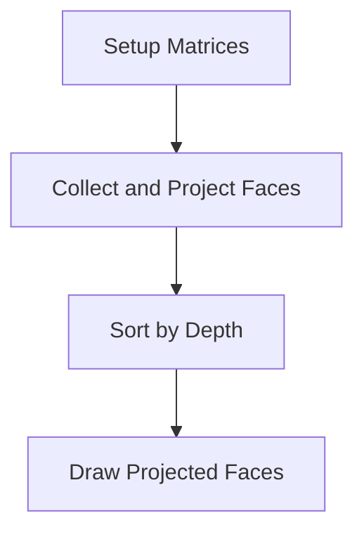
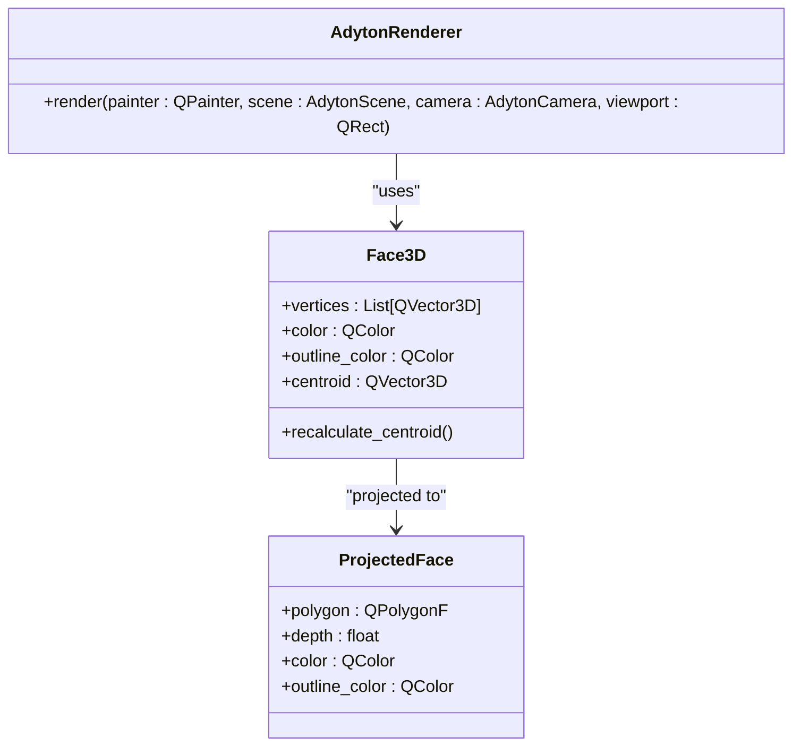
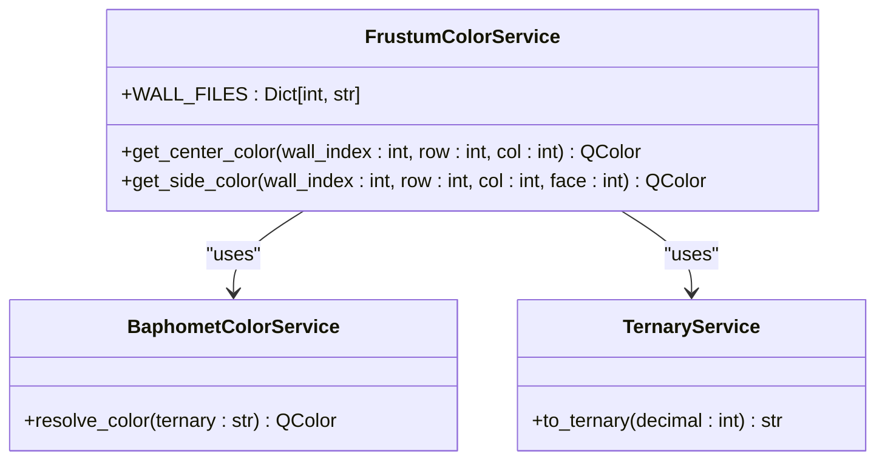
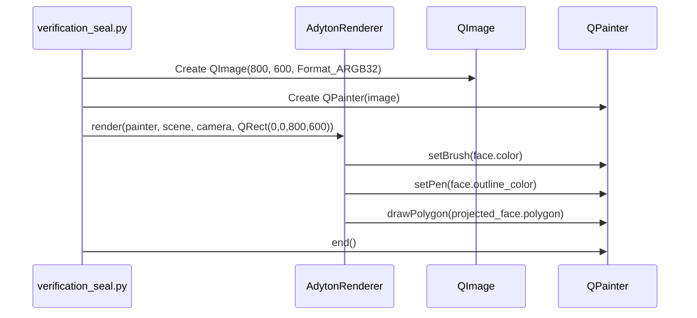
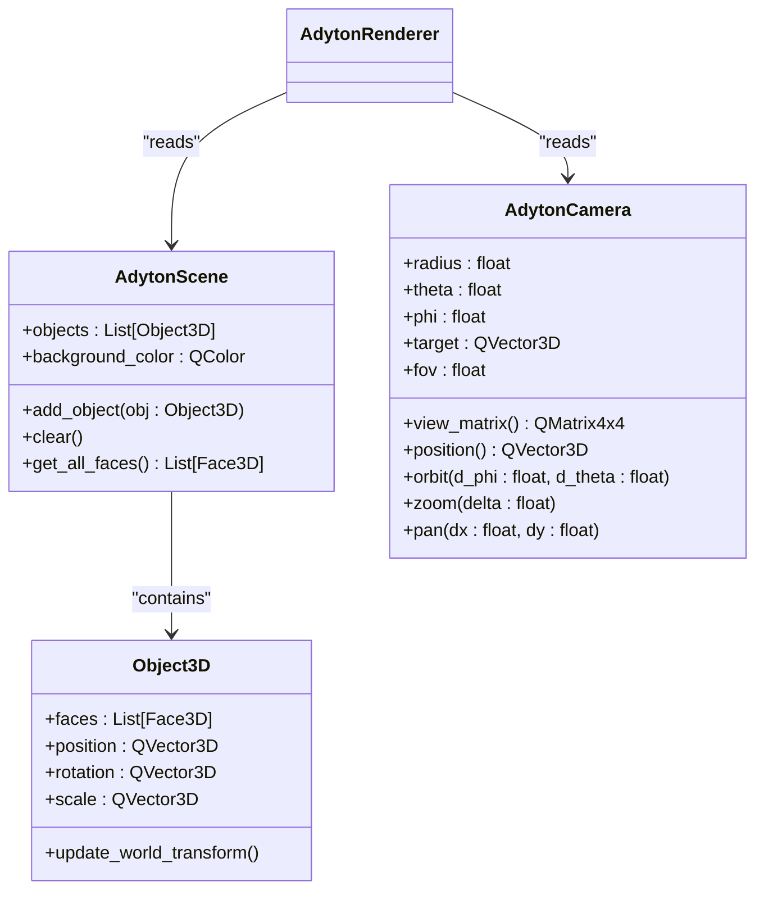
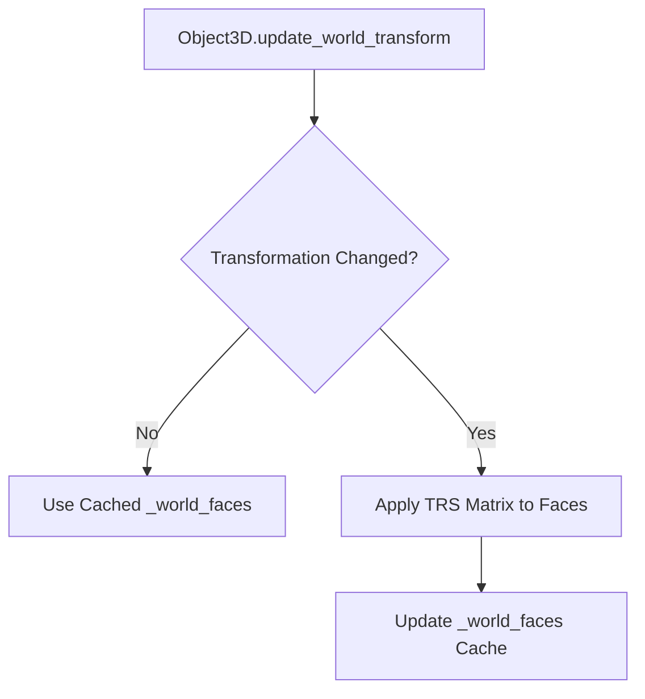
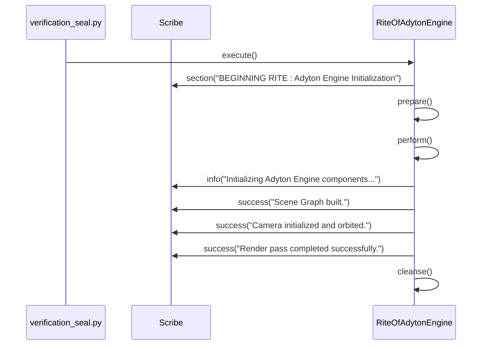

# Rendering Engine

<cite>
**Referenced Files in This Document**   
- [renderer.py](file://src/pillars/adyton/ui/engine/renderer.py)
- [verification_seal.py](file://scripts/verification_seal.py)
- [window.py](file://src/pillars/adyton/ui/engine/window.py)
- [camera.py](file://src/pillars/adyton/ui/engine/camera.py)
- [scene.py](file://src/pillars/adyton/ui/engine/scene.py)
- [geometry_types.py](file://src/pillars/adyton/models/geometry_types.py)
- [block.py](file://src/pillars/adyton/models/block.py)
- [prism.py](file://src/pillars/adyton/models/prism.py)
- [wall.py](file://src/pillars/adyton/models/wall.py)
- [corner.py](file://src/pillars/adyton/models/corner.py)
- [floor.py](file://src/pillars/adyton/models/floor.py)
- [constants.py](file://src/pillars/adyton/constants.py)
- [frustum_color_service.py](file://src/pillars/adyton/services/frustum_color_service.py)
</cite>

## Table of Contents
1. [Introduction](#introduction)
2. [Rendering Pipeline](#rendering-pipeline)
3. [Face Sorting and Depth Management](#face-sorting-and-depth-management)
4. [Back-Face Culling](#back-face-culling)
5. [Color Application Based on Sacred Geometry](#color-application-based-on-sacred-geometry)
6. [Qt Integration and QImage Management](#qt-integration-and-qimage-management)
7. [Scene Graph and Camera State Interaction](#scene-graph-and-camera-state-interaction)
8. [Lighting Simulation and Material Properties](#lighting-simulation-and-material-properties)
9. [Performance Optimization Techniques](#performance-optimization-techniques)
10. [Debugging Strategies and Smoke Testing](#debugging-strategies-and-smoke-testing)
11. [Integration Challenges with Other Pillars](#integration-challenges-with-other-pillars)
12. [Conclusion](#conclusion)

## Introduction
The Adyton Rendering Engine is responsible for visualizing the 3D sanctuary, a complex esoteric structure composed of geometric elements such as blocks, prisms, and walls. The engine implements a software rasterizer using the Painter's Algorithm to project 3D faces onto a 2D canvas. It integrates with Qt's QPainter system for rendering and manages an image buffer through QImage. The rendering process involves interaction with a scene graph and camera state to produce the final output within a QRect viewport. This document details the rendering pipeline, including face sorting, back-face culling, color application based on sacred geometry principles, and performance optimization techniques for real-time rendering.

## Rendering Pipeline
The rendering pipeline in the Adyton Rendering Engine is implemented in the `render` method of the `AdytonRenderer` class. The pipeline consists of four main stages: setup of transformation matrices, collection and projection of faces, sorting by depth, and drawing the projected faces.

**Diagram sources**
- [renderer.py](file://src/pillars/adyton/ui/engine/renderer.py#L33-L96)

**Section sources**
- [renderer.py](file://src/pillars/adyton/ui/engine/renderer.py#L29-L96)

### Setup Matrices
The first stage involves setting up the view and projection matrices. The view matrix is obtained from the camera's `view_matrix` method, which calculates the transformation from world coordinates to camera coordinates. The projection matrix is created using the camera's field of view (fov), aspect ratio of the viewport, and near and far clipping planes. These matrices are combined into a single view-projection (VP) matrix for efficient transformation of vertices.

### Collect and Project Faces
The second stage collects all faces from the scene using the `get_all_faces` method of the `AdytonScene` class. Each face is then projected onto the 2D canvas by applying the VP matrix to its vertices. The projection involves transforming vertices to clip space, performing perspective division to obtain normalized device coordinates (NDC), and then transforming to screen coordinates. A simple near-plane clipping is performed by checking the w-component of the clip-space coordinates.

### Sort by Depth
The third stage sorts the projected faces by their depth, which is determined by the z-coordinate in view space. The sorting is done in ascending order, implementing the Painter's Algorithm where faces farther from the camera are drawn first.

### Draw Projected Faces
The final stage draws the sorted faces on the canvas. The background is filled with the scene's background color, and each face is drawn using its color and outline color. The QPainter's antialiasing render hint is typically set by the widget hosting the renderer.

## Face Sorting and Depth Management
Face sorting is a critical component of the rendering pipeline, ensuring correct visibility of overlapping faces. The Adyton Renderer uses the Painter's Algorithm, which requires sorting faces by their depth before rendering. The depth of a face is calculated as the z-coordinate of its centroid in view space. The centroid is computed as the average of the face's vertices in world coordinates and then transformed to view space using the view matrix.

**Diagram sources**
- [geometry_types.py](file://src/pillars/adyton/models/geometry_types.py#L10-L31)
- [renderer.py](file://src/pillars/adyton/ui/engine/renderer.py#L17-L24)

**Section sources**
- [geometry_types.py](file://src/pillars/adyton/models/geometry_types.py#L10-L31)
- [renderer.py](file://src/pillars/adyton/ui/engine/renderer.py#L85-L86)

## Back-Face Culling
The current implementation of the Adyton Renderer does not explicitly perform back-face culling. However, the projection stage includes a simple near-plane clipping that discards faces whose vertices have a w-component less than or equal to 0.1. This clipping effectively removes faces that are behind the near clipping plane, which can be considered a form of culling. Implementing explicit back-face culling would involve calculating the dot product of the face's normal with the view direction and discarding faces with a positive dot product (assuming a right-handed coordinate system).

## Color Application Based on Sacred Geometry
Colors in the Adyton sanctuary are applied based on sacred geometry principles and esoteric correspondences. The color of each face is determined by its role in the structure and its position within the sanctuary. For example, the walls are colored using a palette derived from planetary correspondences, with each wall assigned a color based on the planet it represents. The frustums within the walls have their colors determined by a combination of the wall's color and a ternary encoding system that maps numerical values to colors via the BaphometColorService.

**Diagram sources**
- [frustum_color_service.py](file://src/pillars/adyton/services/frustum_color_service.py#L27-L38)
- [wall.py](file://src/pillars/adyton/models/wall.py#L22-L150)

**Section sources**
- [frustum_color_service.py](file://src/pillars/adyton/services/frustum_color_service.py#L27-L38)
- [wall.py](file://src/pillars/adyton/models/wall.py#L22-L150)

## Qt Integration and QImage Management
The Adyton Rendering Engine integrates with Qt's graphics system through the QPainter and QImage classes. The renderer operates on a QPainter object, which can be associated with a QImage or a QWidget. The QImage serves as the off-screen buffer where the 3D scene is rendered before being displayed on the screen. The integration is demonstrated in the `RiteOfAdytonEngine` class in the `verification_seal.py` script, where a QImage is created, a QPainter is initialized with the image, and the renderer's `render` method is called to draw the scene.

**Diagram sources**
- [verification_seal.py](file://scripts/verification_seal.py#L130-L156)
- [renderer.py](file://src/pillars/adyton/ui/engine/renderer.py#L29-L96)

**Section sources**
- [verification_seal.py](file://scripts/verification_seal.py#L130-L156)

## Scene Graph and Camera State Interaction
The rendering process involves close interaction between the scene graph and the camera state. The scene graph, represented by the `AdytonScene` class, contains a list of 3D objects and a background color. Each object in the scene is an instance of the `Object3D` class, which contains a list of faces and transformation properties (position, rotation, scale). The camera, represented by the `AdytonCamera` class, defines the viewer's position and orientation in the 3D space through spherical coordinates (radius, theta, phi) and a target point.

**Diagram sources**
- [scene.py](file://src/pillars/adyton/ui/engine/scene.py#L13-L33)
- [camera.py](file://src/pillars/adyton/ui/engine/camera.py#L15-L74)
- [geometry_types.py](file://src/pillars/adyton/models/geometry_types.py#L33-L71)

**Section sources**
- [scene.py](file://src/pillars/adyton/ui/engine/scene.py#L13-L33)
- [camera.py](file://src/pillars/adyton/ui/engine/camera.py#L15-L74)

## Lighting Simulation and Material Properties
The current implementation of the Adyton Rendering Engine does not include a lighting simulation system. Instead, material properties such as color and shininess are directly assigned to faces based on their geometric and symbolic roles. For example, the frustum caps are colored with a lighter shade of the wall's color to simulate a highlight, and the frame around the frustum is colored with a slightly lighter shade to create a sense of depth. The absence of dynamic lighting simplifies the rendering process but limits the visual realism of the scene.

## Performance Optimization Techniques
Several performance optimization techniques are employed in the Adyton Rendering Engine to enable real-time rendering of complex esoteric structures:

1. **Caching of Transformed Faces**: The `Object3D` class caches the world-space faces in the `_world_faces` attribute and only updates them when the object's transformation properties change. This avoids redundant matrix multiplications for static objects.

2. **Efficient Data Structures**: The use of dataclasses and lists for storing geometric data ensures memory efficiency and fast access.

3. **Batched Drawing Operations**: The renderer batches the drawing of all faces after sorting, minimizing the number of state changes in the QPainter.

4. **Simple Clipping**: The near-plane clipping is implemented with a simple w-component check, which is computationally inexpensive.

5. **View Frustum Culling**: Although not explicitly implemented, the projection matrix inherently performs view frustum culling by clipping faces outside the viewing volume.

**Diagram sources**
- [geometry_types.py](file://src/pillars/adyton/models/geometry_types.py#L46-L71)

**Section sources**
- [geometry_types.py](file://src/pillars/adyton/models/geometry_types.py#L46-L71)

## Debugging Strategies and Smoke Testing
Debugging the Adyton Rendering Engine is facilitated by the `verification_seal.py` script, which implements a smoke testing pattern. The script contains a series of "Rites" that test specific components of the engine in isolation. For example, the `RiteOfAdytonEngine` class tests the initialization of the scene, camera, and renderer, and performs a render pass to verify that the components work together correctly.

**Diagram sources**
- [verification_seal.py](file://scripts/verification_seal.py#L45-L80)

**Section sources**
- [verification_seal.py](file://scripts/verification_seal.py#L125-L157)

## Integration Challenges with Other Pillars
Integrating the Adyton Rendering Engine with other pillars' visualization requirements presents several challenges:

1. **Coordinate System Alignment**: Ensuring that the coordinate systems of different pillars (e.g., astrology, gematria) align with the Adyton's 3D space requires careful transformation and scaling.

2. **Color Scheme Consistency**: Maintaining a consistent color scheme across pillars that use different esoteric systems (e.g., planetary colors, gematria values) requires a unified color mapping service.

3. **Performance Synchronization**: Real-time rendering of complex structures from multiple pillars may require synchronization of update rates and optimization of shared resources.

4. **Data Interoperability**: Converting data between different formats (e.g., CSV files for frustum colors, geometric models for solids) requires robust parsing and validation mechanisms.

## Conclusion
The Adyton Rendering Engine effectively visualizes the 3D sanctuary using a software rasterizer based on the Painter's Algorithm. The engine integrates with Qt's graphics system, manages a scene graph, and interacts with a camera to produce the final output. While the current implementation lacks advanced features like lighting simulation and explicit back-face culling, it employs several performance optimizations to handle complex esoteric structures in real time. Debugging is supported by a comprehensive smoke testing framework, and integration with other pillars is facilitated by modular design and clear interfaces. Future enhancements could include the addition of lighting models, more sophisticated culling techniques, and improved interoperability with other components of the system.