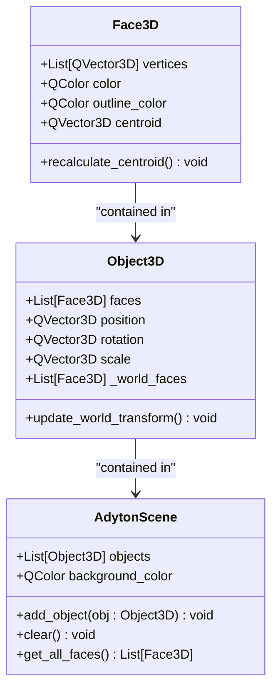
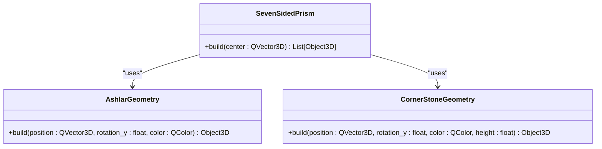
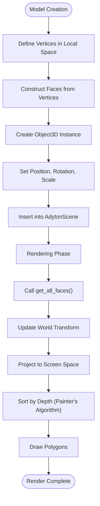
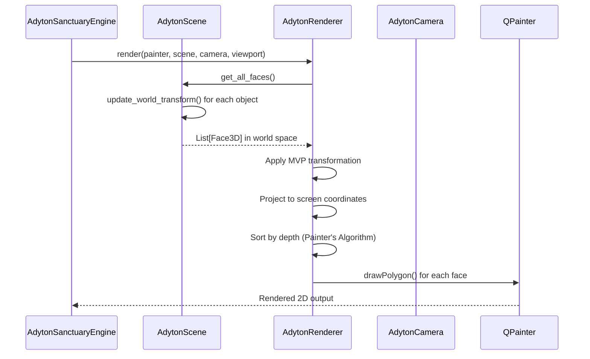
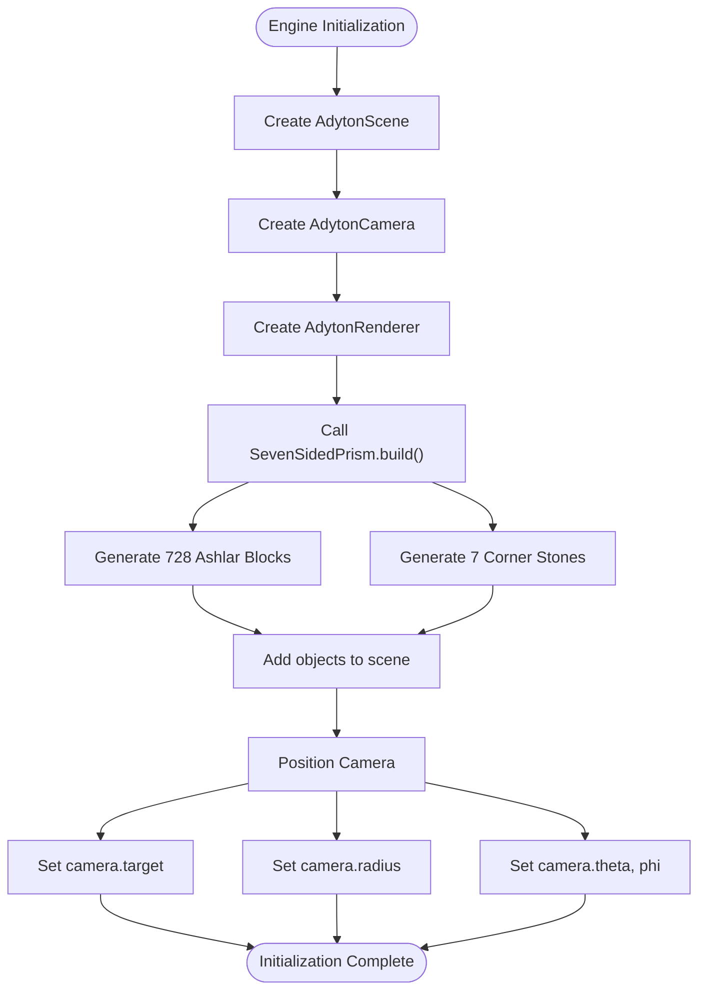
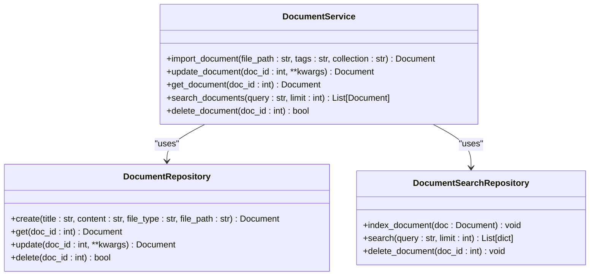

# Scene Management

<cite>
**Referenced Files in This Document**   
- [scene.py](file://src/pillars/adyton/ui/engine/scene.py)
- [block.py](file://src/pillars/adyton/models/block.py)
- [prism.py](file://src/pillars/adyton/models/prism.py)
- [geometry_types.py](file://src/pillars/adyton/models/geometry_types.py)
- [constants.py](file://src/pillars/adyton/constants.py)
- [renderer.py](file://src/pillars/adyton/ui/engine/renderer.py)
- [window.py](file://src/pillars/adyton/ui/engine/window.py)
- [camera.py](file://src/pillars/adyton/ui/engine/camera.py)
- [corner.py](file://src/pillars/adyton/models/corner.py)
- [document_service.py](file://src/pillars/document_manager/services/document_service.py)
</cite>

## Table of Contents
1. [Introduction](#introduction)
2. [Core Data Structures](#core-data-structures)
3. [Scene Graph Architecture](#scene-graph-architecture)
4. [Geometric Model Implementation](#geometric-model-implementation)
5. [Data Flow and Transformation Pipeline](#data-flow-and-transformation-pipeline)
6. [Rendering Integration](#rendering-integration)
7. [Object Lifecycle and Real-time Updates](#object-lifecycle-and-real-time-updates)
8. [Test Geometry Initialization](#test-geometry-initialization)
9. [Performance Considerations](#performance-considerations)
10. [Persistent Storage Integration](#persistent-storage-integration)

## Introduction
The Adyton Scene Management subsystem provides a comprehensive 3D scene graph implementation for managing sacred geometry assemblies within the Adyton Sanctuary. This system serves as the foundation for visualizing complex geometric structures, particularly the seven-sided Adyton chamber constructed from Ashlar blocks and corner stones. The architecture follows a component-based design where the AdytonScene acts as a container for 3D objects, managing their spatial relationships, transformations, and rendering state. The system integrates geometric model creation, scene composition, camera navigation, and software-based rendering to create an immersive environment for exploring sacred geometry. This documentation details the implementation of the scene graph, the data flow from model creation to rendering, and the integration with persistent storage systems.

## Core Data Structures

The Adyton scene management system is built upon a foundation of core data structures that represent 3D geometry and spatial relationships. These structures are designed to efficiently manage complex sacred geometry assemblies while maintaining clarity and extensibility.



**Diagram sources**
- [geometry_types.py](file://src/pillars/adyton/models/geometry_types.py#L10-L57)
- [scene.py](file://src/pillars/adyton/ui/engine/scene.py#L13-L38)

**Section sources**
- [geometry_types.py](file://src/pillars/adyton/models/geometry_types.py#L10-L57)
- [scene.py](file://src/pillars/adyton/ui/engine/scene.py#L13-L38)

## Scene Graph Architecture

The scene graph architecture in the Adyton system follows a hierarchical container pattern where the AdytonScene serves as the root container for all 3D objects in the sanctuary. This container manages a collection of Object3D instances, each representing a distinct geometric entity in the 3D space. The scene provides essential operations for adding, removing, and querying objects, as well as aggregating their geometric data for rendering purposes. The architecture supports real-time updates through the update_world_transform method, which applies transformation matrices to convert local coordinates to world space. This design enables efficient scene management by decoupling the logical representation of objects from their rendered appearance, allowing for complex transformations while maintaining a clean separation of concerns between scene management and rendering responsibilities.

```mermaid
graph TB
subgraph "Scene Graph"
AdytonScene[AdytonScene]
Object3D[Object3D]
Face3D[Face3D]
end
AdytonScene --> Object3D : "contains"
Object3D --> Face3D : "composed of"
subgraph "Rendering Pipeline"
Renderer[AdytonRenderer]
Camera[AdytonCamera]
end
AdytonScene --> Renderer : "provides faces"
Camera --> Renderer : "provides view"
Renderer --> Output["2D Render Output"]
```

**Diagram sources**
- [scene.py](file://src/pillars/adyton/ui/engine/scene.py#L13-L38)
- [renderer.py](file://src/pillars/adyton/ui/engine/renderer.py#L24-L102)
- [camera.py](file://src/pillars/adyton/ui/engine/camera.py#L14-L75)

**Section sources**
- [scene.py](file://src/pillars/adyton/ui/engine/scene.py#L13-L38)

## Geometric Model Implementation

The geometric model implementation in the Adyton system centers around specialized classes that generate precise sacred geometry forms according to specific architectural principles. The AshlarGeometry class creates composite blocks consisting of a base cube with an inner-facing pyramidal frustum, following Phi-based proportions derived from sacred geometry principles. Each Ashlar block is constructed with specific dimensions where the frustum base and top are calculated using the golden ratio (PHI ≈ 1.618), creating harmonious proportions that reflect sacred geometry principles. The SevenSidedPrism class orchestrates the construction of the complete Adyton chamber by arranging 728 Ashlar blocks and 7 corner stones in a precise heptagonal configuration. This arrangement follows exact mathematical calculations to ensure perfect joinery between components, with the geometry derived from a 14-sided irregular polygon that accommodates both corner stones and wall segments. The CornerStoneGeometry class generates trapezoidal prisms that bridge the 128.57-degree angles between adjacent walls, ensuring structural continuity throughout the chamber.



**Diagram sources**
- [block.py](file://src/pillars/adyton/models/block.py#L19-L115)
- [prism.py](file://src/pillars/adyton/models/prism.py#L15-L174)
- [corner.py](file://src/pillars/adyton/models/corner.py#L19-L145)

**Section sources**
- [block.py](file://src/pillars/adyton/models/block.py#L19-L115)
- [prism.py](file://src/pillars/adyton/models/prism.py#L15-L174)
- [corner.py](file://src/pillars/adyton/models/corner.py#L19-L145)

## Data Flow and Transformation Pipeline

The data flow from model creation to scene insertion follows a well-defined pipeline that ensures geometric accuracy and efficient rendering. When a geometric model is instantiated, it begins with the creation of vertices in local coordinate space, followed by the construction of faces that define the surface topology. These faces are then organized into Object3D instances, which encapsulate both the geometric data and transformation properties. The transformation pipeline applies a series of operations to convert local coordinates to world space, including translation, rotation, and scaling, using a standard TRS (Translation-Rotation-Scale) matrix composition. During rendering, the scene graph flattens all objects into world-space faces through the get_all_faces method, which triggers the update_world_transform operation on each object to ensure their transformations are current. This pipeline supports real-time updates by recalculating world-space coordinates before each render pass, enabling dynamic scene modifications while maintaining geometric integrity.



**Diagram sources**
- [geometry_types.py](file://src/pillars/adyton/models/geometry_types.py#L43-L57)
- [scene.py](file://src/pillars/adyton/ui/engine/scene.py#L29-L38)
- [renderer.py](file://src/pillars/adyton/ui/engine/renderer.py#L48-L92)

**Section sources**
- [geometry_types.py](file://src/pillars/adyton/models/geometry_types.py#L43-L57)
- [scene.py](file://src/pillars/adyton/ui/engine/scene.py#L29-L38)
- [renderer.py](file://src/pillars/adyton/ui/engine/renderer.py#L48-L92)

## Rendering Integration

The rendering integration in the Adyton system connects the scene graph with the visualization pipeline through a software rasterization approach that implements the Painter's Algorithm for depth sorting. The AdytonRenderer class serves as the bridge between the 3D scene data and the 2D rendering output, processing world-space faces and projecting them onto the screen coordinates. The rendering process begins with the construction of view and projection matrices based on the camera's position and orientation, followed by the transformation of 3D vertices into clip space and then screen space. After projection, faces are sorted by their distance from the camera to ensure proper depth ordering, with farther objects rendered first to allow closer objects to overwrite them. The system supports camera navigation through an orbit, pan, and zoom interface, enabling users to explore the 3D space from multiple perspectives. The integration is designed to handle complex sacred geometry assemblies efficiently, with optimizations such as backface culling (optional) and near-plane clipping to improve performance.



**Diagram sources**
- [window.py](file://src/pillars/adyton/ui/engine/window.py#L18-L98)
- [scene.py](file://src/pillars/adyton/ui/engine/scene.py#L29-L38)
- [renderer.py](file://src/pillars/adyton/ui/engine/renderer.py#L28-L102)
- [camera.py](file://src/pillars/adyton/ui/engine/camera.py#L14-L75)

**Section sources**
- [window.py](file://src/pillars/adyton/ui/engine/window.py#L18-L98)
- [renderer.py](file://src/pillars/adyton/ui/engine/renderer.py#L28-L102)

## Object Lifecycle and Real-time Updates

The object lifecycle in the Adyton scene management system follows a well-defined pattern from creation to destruction, with support for real-time updates and transformations. Objects are created through factory methods in geometric model classes like AshlarGeometry and CornerStoneGeometry, which generate Object3D instances with predefined geometry and initial transformation properties. These objects are then added to the AdytonScene container using the add_object method, which maintains a reference to the object for rendering and manipulation. The system supports real-time updates through the update_world_transform method, which recalculates world-space coordinates whenever an object's position, rotation, or scale changes. This transformation is applied during the rendering phase, ensuring that all visual updates are synchronized with the render loop. The lifecycle concludes when objects are removed from the scene through the clear method or when the scene itself is destroyed, allowing for efficient memory management and dynamic scene composition.

**Section sources**
- [scene.py](file://src/pillars/adyton/ui/engine/scene.py#L23-L27)
- [geometry_types.py](file://src/pillars/adyton/models/geometry_types.py#L43-L57)
- [block.py](file://src/pillars/adyton/models/block.py#L24-L115)

## Test Geometry Initialization

The initialization of test geometries in the Adyton system is handled by the AdytonSanctuaryEngine class, which serves as the primary interface for setting up the 3D environment. During initialization, the engine creates an instance of the SevenSidedPrism and calls its build method to generate the complete Adyton chamber geometry. This process involves the creation of 728 Ashlar blocks and 7 corner stones, arranged according to the precise mathematical specifications of the heptagonal chamber. Each generated object is then added to the scene through the add_object method, building up the complete scene graph. Following geometry creation, the camera is positioned to provide an optimal viewing angle of the structure, with the target set to the center of the chamber at half its height and the radius set to provide a comprehensive external view. This initialization process demonstrates the integration of geometric model creation, scene composition, and camera setup into a cohesive workflow for preparing the 3D environment.



**Diagram sources**
- [window.py](file://src/pillars/adyton/ui/engine/window.py#L37-L53)
- [prism.py](file://src/pillars/adyton/models/prism.py#L20-L174)

**Section sources**
- [window.py](file://src/pillars/adyton/ui/engine/window.py#L37-L53)

## Performance Considerations

The Adyton scene management system incorporates several performance considerations to handle complex sacred geometry assemblies efficiently. The architecture balances geometric accuracy with rendering performance by using a flat list of objects in the scene graph, which enables straightforward iteration during rendering but may impact performance with very large numbers of objects. The system employs a software rasterization approach with the Painter's Algorithm for depth sorting, which provides reliable rendering results but has O(n log n) complexity due to the sorting step. To optimize rendering, the system implements near-plane clipping to avoid processing geometry that would be behind the camera, and supports optional backface culling to reduce the number of polygons that need to be processed. The transformation pipeline updates world-space coordinates for all objects during each render pass, which ensures visual consistency but represents a potential bottleneck for scenes with many moving objects. Memory usage is optimized through the use of dataclasses and efficient storage of geometric data, with vertex positions stored as QVector3D objects and face data organized to minimize redundancy.

**Section sources**
- [renderer.py](file://src/pillars/adyton/ui/engine/renderer.py#L54-L75)
- [scene.py](file://src/pillars/adyton/ui/engine/scene.py#L35-L36)
- [geometry_types.py](file://src/pillars/adyton/models/geometry_types.py#L43-L57)

## Persistent Storage Integration

The integration with the document manager for persistent storage of 3D configurations is facilitated through the document service layer, which provides a comprehensive API for saving and retrieving structured data. While the scene management system itself focuses on runtime representation of 3D geometry, the document manager handles the persistence of configuration data, metadata, and related content. The DocumentService class provides methods for importing, updating, and searching documents, with support for rich text content, tags, and collections. When saving 3D configurations, the system can serialize scene state information and store it as document content, preserving the arrangement of objects, camera settings, and other relevant parameters. The search functionality enables retrieval of saved configurations through text-based queries, with indexing provided by the search repository. This integration allows users to save and recall complex sacred geometry assemblies, maintaining a persistent record of their work that can be shared, annotated, and retrieved as needed.



**Diagram sources**
- [document_service.py](file://src/pillars/document_manager/services/document_service.py#L18-L257)

**Section sources**
- [document_service.py](file://src/pillars/document_manager/services/document_service.py#L18-L257)