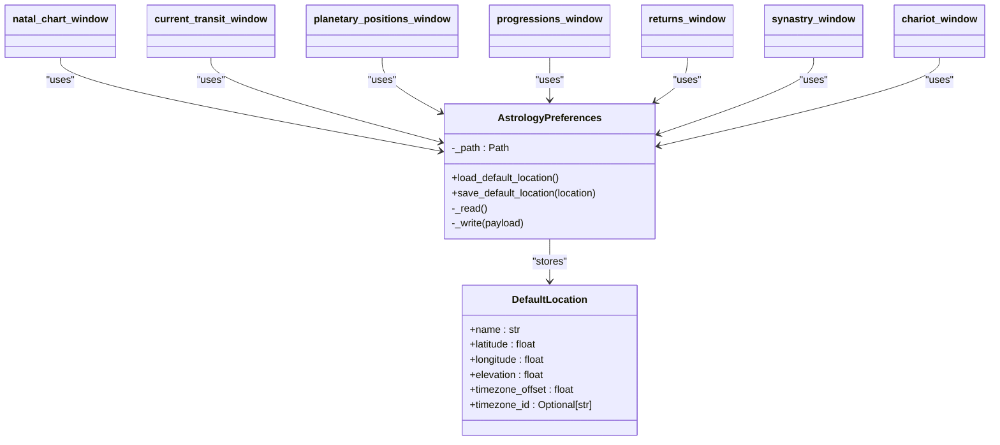

# Astrology Pillar

<cite>
**Referenced Files in This Document**   
- [astrology_hub.py](file://src/pillars/astrology/ui/astrology_hub.py)
- [chart_storage_service.py](file://src/pillars/astrology/services/chart_storage_service.py)
- [chart_record.py](file://src/pillars/astrology/models/chart_record.py)
- [openastro_service.py](file://src/pillars/astrology/services/openastro_service.py)
- [natal_chart_window.py](file://src/pillars/astrology/ui/natal_chart_window.py)
- [current_transit_window.py](file://src/pillars/astrology/ui/current_transit_window.py)
- [planetary_positions_window.py](file://src/pillars/astrology/ui/planetary_positions_window.py)
- [venus_rose_window.py](file://src/pillars/astrology/ui/venus_rose_window.py)
- [preferences.py](file://src/pillars/astrology/utils/preferences.py)
- [location_lookup.py](file://src/pillars/astrology/services/location_lookup.py)
- [chart_models.py](file://src/pillars/astrology/models/chart_models.py)
- [chart_repository.py](file://src/pillars/astrology/repositories/chart_repository.py)
- [conversions.py](file://src/pillars/astrology/utils/conversions.py)
- [ephemeris_provider.py](file://src/pillars/astrology/repositories/ephemeris_provider.py)
- [progressions_service.py](file://src/pillars/astrology/services/progressions_service.py)
- [returns_service.py](file://src/pillars/astrology/services/returns_service.py)
- [synastry_service.py](file://src/pillars/astrology/services/synastry_service.py)
- [chariot_service.py](file://src/pillars/astrology/services/chariot_service.py)
- [progressions_window.py](file://src/pillars/astrology/ui/progressions_window.py)
- [returns_window.py](file://src/pillars/astrology/ui/returns_window.py)
- [synastry_window.py](file://src/pillars/astrology/ui/synastry_window.py)
- [chariot_window.py](file://src/pillars/astrology/ui/chariot_window.py)
</cite>

## Update Summary
**Changes Made**   
- Added new sections for chariot midpoints, progressions, returns, and synastry analysis
- Updated architecture overview to include new services and UI components
- Added detailed component analysis for new services and windows
- Added new workflows for progressions, returns, and synastry analysis
- Updated UI components section to include new windows
- Added new diagrams for new services and workflows

## Table of Contents
1. [Introduction](#introduction)
2. [Core Components](#core-components)
3. [Architecture Overview](#architecture-overview)
4. [Detailed Component Analysis](#detailed-component-analysis)
5. [Data Flow and Workflows](#data-flow-and-workflows)
6. [UI Components](#ui-components)
7. [Integration with Preferences System](#integration-with-preferences-system)
8. [Connection to Esoteric Analysis](#connection-to-esoteric-analysis)
9. [Conclusion](#conclusion)

## Introduction
The Astrology pillar of the isopgem application serves as a comprehensive astrological analysis platform that integrates with external calculation engines OpenAstro2 and pyswisseph for precise celestial calculations. This documentation provides a detailed architectural overview of the system, focusing on its component structure, data flow, user interface elements, and integration points. The pillar enables users to generate natal charts, analyze planetary positions, visualize transit patterns, and explore specialized astrological phenomena such as the Venus Rose. The system handles complex astronomical calculations while providing intuitive interfaces for both novice and advanced users. Recent enhancements have expanded the platform's capabilities to include chariot midpoints, progressions, returns, and synastry analysis with corresponding UI windows and services.

## Core Components
The Astrology pillar consists of several key components that work together to provide a complete astrological analysis environment. The main interface is the astrology_hub, which serves as the central launcher for all astrology tools. The chart_storage_service manages the persistence of astrological charts, allowing users to save, retrieve, and organize their analyses. The chart_record model represents the core data structure for storing astrological information, including planetary positions, house cusps, and aspect data. The openastro_service acts as an integration layer between the application and the external OpenAstro2 calculation engine, handling the complex mathematical computations required for accurate astrological predictions. New components include the chariot_service for calculating chariot midpoints, progressions_service for secondary progressions and solar arc directions, returns_service for planetary returns, and synastry_service for relationship astrology calculations.

**Section sources**
- [astrology_hub.py](file://src/pillars/astrology/ui/astrology_hub.py)
- [chart_storage_service.py](file://src/pillars/astrology/services/chart_storage_service.py)
- [chart_record.py](file://src/pillars/astrology/models/chart_record.py)
- [openastro_service.py](file://src/pillars/astrology/services/openastro_service.py)
- [progressions_service.py](file://src/pillars/astrology/services/progressions_service.py)
- [returns_service.py](file://src/pillars/astrology/services/returns_service.py)
- [synastry_service.py](file://src/pillars/astrology/services/synastry_service.py)
- [chariot_service.py](file://src/pillars/astrology/services/chariot_service.py)

## Architecture Overview
The Astrology pillar follows a layered architecture with clear separation between user interface, business logic, and data persistence layers. The system is designed around a service-oriented approach where specialized services handle specific aspects of astrological computation and data management. The enhanced architecture now includes additional services for advanced astrological techniques.

**Diagram sources**
- [astrology_hub.py](file://src/pillars/astrology/ui/astrology_hub.py)
- [openastro_service.py](file://src/pillars/astrology/services/openastro_service.py)
- [chart_storage_service.py](file://src/pillars/astrology/services/chart_storage_service.py)
- [chart_repository.py](file://src/pillars/astrology/repositories/chart_repository.py)
- [chart_record.py](file://src/pillars/astrology/models/chart_record.py)
- [preferences.py](file://src/pillars/astrology/utils/preferences.py)
- [location_lookup.py](file://src/pillars/astrology/services/location_lookup.py)
- [progressions_service.py](file://src/pillars/astrology/services/progressions_service.py)
- [returns_service.py](file://src/pillars/astrology/services/returns_service.py)
- [synastry_service.py](file://src/pillars/astrology/services/synastry_service.py)
- [chariot_service.py](file://src/pillars/astrology/services/chariot_service.py)
- [midpoints_service.py](file://src/pillars/astrology/services/midpoints_service.py)

## Detailed Component Analysis

### astrology_hub Analysis
The astrology_hub serves as the main interface for the Astrology pillar, providing a centralized launch point for all astrological tools. It presents users with a clean interface that includes buttons for accessing the natal chart generator, current transit viewer, planetary positions table, Neo-Aubrey Eclipse Clock, and the Cytherean Rose visualization. The hub has been enhanced to include new buttons for the progressions, returns, synastry, and chariot analysis windows.

**Diagram sources**
- [astrology_hub.py](file://src/pillars/astrology/ui/astrology_hub.py)

### chart_storage_service Analysis
The chart_storage_service provides a high-level persistence facade for natal charts, handling the storage and retrieval of astrological data. It works in conjunction with the chart_repository to manage database operations while providing a clean API for other components. The service has been updated to support storage and retrieval of charts used in the new analysis types.

**Diagram sources**
- [chart_storage_service.py](file://src/pillars/astrology/services/chart_storage_service.py)
- [chart_repository.py](file://src/pillars/astrology/repositories/chart_repository.py)

### chart_record Analysis
The chart_record module defines the SQLAlchemy models for persisting astrology charts in the database. It includes the main AstrologyChart entity along with supporting entities for categories and tags, enabling rich organization and filtering of stored charts. The model has been updated to support new chart types for the enhanced features.

**Diagram sources**
- [chart_record.py](file://src/pillars/astrology/models/chart_record.py)

### openastro_service Analysis
The openastro_service acts as a high-level orchestration layer for OpenAstro2 usage, isolating direct dependencies on the external library while providing a clean API surface for the UI components. It handles chart generation, house system management, and error handling. The service serves as the foundation for the new specialized services.

**Diagram sources**
- [openastro_service.py](file://src/pillars/astrology/services/openastro_service.py)
- [chart_models.py](file://src/pillars/astrology/models/chart_models.py)

### progressions_service Analysis
The progressions_service calculates Secondary Progressions (1 Day = 1 Year) and Solar Arc Directions. Secondary Progressions advance the natal chart by one day for each year of life, while Solar Arc Directions move all planets by the arc between the natal Sun and progressed Sun.

**Diagram sources**
- [progressions_service.py](file://src/pillars/astrology/services/progressions_service.py)
- [ephemeris_provider.py](file://src/pillars/astrology/repositories/ephemeris_provider.py)
- [openastro_service.py](file://src/pillars/astrology/services/openastro_service.py)

### returns_service Analysis
The returns_service calculates the exact moment when a planet returns to its natal longitude, such as Solar Returns (annual birthday charts) and Lunar Returns (monthly mood indicators). The service uses iterative solving to find the precise return time.

**Diagram sources**
- [returns_service.py](file://src/pillars/astrology/services/returns_service.py)
- [ephemeris_provider.py](file://src/pillars/astrology/repositories/ephemeris_provider.py)

### synastry_service Analysis
The synastry_service calculates relationship charts including Synastry (bi-wheel comparison), Composite (midpoint of corresponding planets), and Davison (chart cast for time/space midpoint). The service provides the mathematical foundation for relationship astrology.

**Diagram sources**
- [synastry_service.py](file://src/pillars/astrology/services/synastry_service.py)
- [openastro_service.py](file://src/pillars/astrology/services/openastro_service.py)

### chariot_service Analysis
The chariot_service calculates the Chariot Midpoints System, synthesizing planetary midpoints into Major Arcana correspondences, grouping them into functional Trios, deriving Axles of Will, and computing the ultimate Chariot Point. The service builds upon midpoints_service and maat_symbols_service.

**Diagram sources**
- [chariot_service.py](file://src/pillars/astrology/services/chariot_service.py)
- [midpoints_service.py](file://src/pillars/astrology/services/midpoints_service.py)
- [maat_symbols_service.py](file://src/pillars/astrology/services/maat_symbols_service.py)

## Data Flow and Workflows

### Natal Chart Generation Workflow
The process of generating a natal chart follows a well-defined sequence from user input through calculation to visualization. This workflow demonstrates the integration between UI components, service layers, and external calculation engines.

**Diagram sources**
- [natal_chart_window.py](file://src/pillars/astrology/ui/natal_chart_window.py)
- [openastro_service.py](file://src/pillars/astrology/services/openastro_service.py)
- [chart_storage_service.py](file://src/pillars/astrology/services/chart_storage_service.py)
- [chart_repository.py](file://src/pillars/astrology/repositories/chart_repository.py)

### Transit Analysis Workflow
The transit analysis workflow enables users to compare current planetary positions with a natal chart, providing insights into current astrological influences. This process leverages the same calculation engine but with different input parameters.

**Diagram sources**
- [current_transit_window.py](file://src/pillars/astrology/ui/current_transit_window.py)
- [openastro_service.py](file://src/pillars/astrology/services/openastro_service.py)
- [preferences.py](file://src/pillars/astrology/utils/preferences.py)

### Progressions Workflow
The progressions workflow allows users to calculate Secondary Progressions or Solar Arc Directions for a natal chart at a target date, providing insights into personal development and timing of events.

**Diagram sources**
- [progressions_window.py](file://src/pillars/astrology/ui/progressions_window.py)
- [progressions_service.py](file://src/pillars/astrology/services/progressions_service.py)
- [openastro_service.py](file://src/pillars/astrology/services/openastro_service.py)
- [chart_storage_service.py](file://src/pillars/astrology/services/chart_storage_service.py)

### Returns Workflow
The returns workflow calculates the exact time when a planet returns to its natal position, creating a chart for that moment which provides insights into the themes of the coming year (Solar Return) or month (Lunar Return).

**Diagram sources**
- [returns_window.py](file://src/pillars/astrology/ui/returns_window.py)
- [returns_service.py](file://src/pillars/astrology/services/returns_service.py)
- [ephemeris_provider.py](file://src/pillars/astrology/repositories/ephemeris_provider.py)
- [openastro_service.py](file://src/pillars/astrology/services/openastro_service.py)

### Synastry Analysis Workflow
The synastry analysis workflow enables users to compare two charts for relationship analysis, supporting three different models: Synastry (bi-wheel), Composite (midpoint chart), and Davison (time/space midpoint chart).

**Diagram sources**
- [synastry_window.py](file://src/pillars/astrology/ui/synastry_window.py)
- [synastry_service.py](file://src/pillars/astrology/services/synastry_service.py)
- [openastro_service.py](file://src/pillars/astrology/services/openastro_service.py)

### Chariot Analysis Workflow
The chariot analysis workflow calculates the complete Chariot Midpoints system from a natal chart, including the 21 midpoints, 7 axles, and the Chariot Point, providing a synthesis of the soul's will and purpose.

**Diagram sources**
- [chariot_window.py](file://src/pillars/astrology/ui/chariot_window.py)
- [chariot_service.py](file://src/pillars/astrology/services/chariot_service.py)
- [midpoints_service.py](file://src/pillars/astrology/services/midpoints_service.py)
- [maat_symbols_service.py](file://src/pillars/astrology/services/maat_symbols_service.py)
- [openastro_service.py](file://src/pillars/astrology/services/openastro_service.py)
- [chart_storage_service.py](file://src/pillars/astrology/services/chart_storage_service.py)

## UI Components

### Natal Chart Generator
The natal chart generator provides a comprehensive interface for creating birth charts. Users can input personal information including name, birth date and time, location, and timezone offset. The interface includes features for saving charts with categories and tags, searching for locations via the Open-Meteo geocoding API, and setting default locations for future use.

**Section sources**
- [natal_chart_window.py](file://src/pillars/astrology/ui/natal_chart_window.py)

### Planetary Positions Table
The planetary positions table (ephemeris viewer) allows users to analyze planetary movements over time. Users can configure the time range, step size, and select specific planets to track. The interface supports exporting data to CSV format and displays positions in zodiacal notation with retrograde indicators.

**Section sources**
- [planetary_positions_window.py](file://src/pillars/astrology/ui/planetary_positions_window.py)

### Transit Dashboard
The transit dashboard provides a real-time view of current planetary positions relative to a user's default location. It includes controls for generating current transits, exporting SVG visualizations, and opening charts in external browsers. The interface automatically applies the user's saved default location and timezone settings.

**Section sources**
- [current_transit_window.py](file://src/pillars/astrology/ui/current_transit_window.py)

### Venus Rose Visualization
The Venus Rose visualization is a specialized tool that illustrates the Pentagram of Venus, showing the 13:8 orbital resonance between Earth and Venus. The interface includes animation controls, physics mode toggling (ideal vs. real), and predictive event tracking for inferior and superior conjunctions.

**Diagram sources**
- [venus_rose_window.py](file://src/pillars/astrology/ui/venus_rose_window.py)

**Section sources**
- [venus_rose_window.py](file://src/pillars/astrology/ui/venus_rose_window.py)

### Progressions Window
The progressions window provides a focused interface for calculating Secondary Progressions and Solar Arc Directions. Users can input natal data and a target date to generate progressed charts, with options to display the results as a bi-wheel comparison with the natal chart.

**Section sources**
- [progressions_window.py](file://src/pillars/astrology/ui/progressions_window.py)

### Returns Window
The returns window enables users to calculate planetary returns such as Solar Returns and Lunar Returns. The interface allows for relocation of the return chart to a different location and provides precise calculation of the return moment.

**Section sources**
- [returns_window.py](file://src/pillars/astrology/ui/returns_window.py)

### Synastry Window
The synastry window provides a comprehensive interface for relationship astrology analysis. Users can input data for two individuals and choose between three analysis models: Synastry (bi-wheel), Composite (midpoint chart), and Davison (time/space midpoint chart). The window includes multiple tabs for different aspects of the analysis.

**Section sources**
- [synastry_window.py](file://src/pillars/astrology/ui/synastry_window.py)

### Chariot Window
The chariot window displays the complete Chariot Midpoints analysis, showing the 21 midpoints organized by their 7 Trios, the calculated Axles, the Chariot Point, and the Egyptian degree symbols from the Sacred Landscape. The interface features a tri-panel layout with a tree view, summary information, and degree symbol display.

**Section sources**
- [chariot_window.py](file://src/pillars/astrology/ui/chariot_window.py)

## Integration with Preferences System
The Astrology pillar integrates with a preferences system that allows users to save and recall their default settings, particularly their default location for transit calculations. This system uses JSON-based persistence to store user preferences across sessions.

**Diagram sources**
- [preferences.py](file://src/pillars/astrology/utils/preferences.py)

**Section sources**
- [preferences.py](file://src/pillars/astrology/utils/preferences.py)
- [natal_chart_window.py](file://src/pillars/astrology/ui/natal_chart_window.py)
- [current_transit_window.py](file://src/pillars/astrology/ui/current_transit_window.py)
- [planetary_positions_window.py](file://src/pillars/astrology/ui/planetary_positions_window.py)
- [progressions_window.py](file://src/pillars/astrology/ui/progressions_window.py)
- [returns_window.py](file://src/pillars/astrology/ui/returns_window.py)
- [synastry_window.py](file://src/pillars/astrology/ui/synastry_window.py)
- [chariot_window.py](file://src/pillars/astrology/ui/chariot_window.py)

## Connection to Esoteric Analysis
The Astrology pillar connects to broader esoteric analysis through planetary correspondences in gematria and TQ systems. These connections are facilitated through shared data models and integration points that allow astrological data to be used in conjunction with other esoteric calculations. The enhanced features deepen these connections, particularly through the Chariot system's integration with Egyptian degree symbols and the synastry analysis's connections to relationship dynamics in gematria.

**Diagram sources**
- [astrology_hub.py](file://src/pillars/astrology/ui/astrology_hub.py)

**Section sources**
- [astrology_hub.py](file://src/pillars/astrology/ui/astrology_hub.py)

## Conclusion
The Astrology pillar of the isopgem application provides a robust and comprehensive platform for astrological analysis, integrating external calculation engines OpenAstro2 and pyswisseph to deliver accurate celestial calculations. The system's architecture features a clear separation of concerns with well-defined components for user interface, service logic, and data persistence. Key features include natal chart generation, transit analysis, planetary position tracking, and specialized visualizations like the Venus Rose. Recent enhancements have significantly expanded the platform's capabilities with the addition of chariot midpoints, progressions, returns, and synastry analysis, each with corresponding UI windows and services. The integration with user preferences allows for personalized settings, while the connection to broader esoteric analysis systems enables holistic interpretation of astrological data. The pillar demonstrates a sophisticated approach to handling complex astronomical calculations while maintaining an accessible user interface for both novice and advanced practitioners.