# Natal Charts

<cite>
**Referenced Files in This Document**   
- [natal_chart_window.py](file://src/pillars/astrology/ui/natal_chart_window.py)
- [openastro_service.py](file://src/pillars/astrology/services/openastro_service.py)
- [chart_storage_service.py](file://src/pillars/astrology/services/chart_storage_service.py)
- [chart_models.py](file://src/pillars/astrology/models/chart_models.py)
- [chart_record.py](file://src/pillars/astrology/models/chart_record.py)
- [preferences.py](file://src/pillars/astrology/utils/preferences.py)
- [location_lookup.py](file://src/pillars/astrology/services/location_lookup.py)
- [conversions.py](file://src/pillars/astrology/utils/conversions.py)
- [astrology_hub.py](file://src/pillars/astrology/ui/astrology_hub.py)
- [arabic_parts_service.py](file://src/pillars/astrology/services/arabic_parts_service.py)
- [aspects_service.py](file://src/pillars/astrology/services/aspects_service.py)
- [fixed_stars_service.py](file://src/pillars/astrology/services/fixed_stars_service.py)
- [harmonics_service.py](file://src/pillars/astrology/services/harmonics_service.py)
- [midpoints_service.py](file://src/pillars/astrology/services/midpoints_service.py)
</cite>

## Update Summary
**Changes Made**   
- Added documentation for the new Advanced tab and its five sub-tabs: Fixed Stars, Arabic Parts, Midpoints, Harmonics, and Aspects
- Updated component analysis to include new services for Arabic Parts, aspects, fixed stars, harmonics, and midpoints
- Added new sections for each of the advanced calculation services
- Updated the architecture overview and component analysis to reflect the new UI structure and service integrations

## Table of Contents
1. [Introduction](#introduction)
2. [Project Structure](#project-structure)
3. [Core Components](#core-components)
4. [Architecture Overview](#architecture-overview)
5. [Detailed Component Analysis](#detailed-component-analysis)
6. [Dependency Analysis](#dependency-analysis)
7. [Performance Considerations](#performance-considerations)
8. [Troubleshooting Guide](#troubleshooting-guide)
9. [Conclusion](#conclusion)

## Introduction
The Natal Chart feature is a core component of the Astrology pillar in the IsopGem system, designed to generate and visualize birth charts based on user-provided birth data including date, time, and location. This documentation details the implementation of the natal chart functionality, focusing on the integration between the UI component `natal_chart_window.py`, the `openastro_service` for celestial calculations, and the `chart_storage_service` for persistence. The system handles data flow from input validation through ephemeris lookup to chart rendering, with support for aspect detection, house system configuration, and planetary placement interpretation. The feature integrates with the preferences system for default settings and uses timezone handling via location lookup to address common issues like daylight saving time discrepancies and geolocation accuracy. Recent updates have added an Advanced tab with five sub-tabs for specialized astrological calculations.

## Project Structure
The Natal Chart feature is organized within the astrology pillar of the IsopGem project, following a modular architecture that separates concerns between UI, services, models, and repositories. The core components are located in the `src/pillars/astrology/` directory, with specific subdirectories for UI components, services, models, and repositories. The UI is implemented in the `ui/` subdirectory with `natal_chart_window.py` as the primary interface, while business logic is encapsulated in the `services/` directory with `openastro_service.py` and `chart_storage_service.py`. Data models are defined in `models/` and database interactions are handled by repositories in the `repositories/` directory. This structure enables clear separation of concerns and facilitates maintenance and extension of the feature.

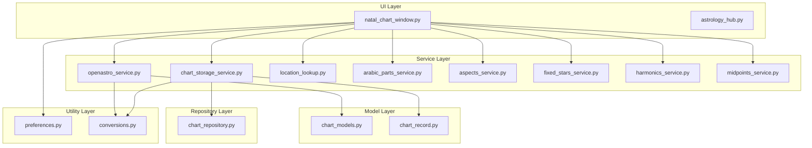

**Diagram sources**
- [natal_chart_window.py](file://src/pillars/astrology/ui/natal_chart_window.py)
- [openastro_service.py](file://src/pillars/astrology/services/openastro_service.py)
- [chart_storage_service.py](file://src/pillars/astrology/services/chart_storage_service.py)
- [arabic_parts_service.py](file://src/pillars/astrology/services/arabic_parts_service.py)
- [aspects_service.py](file://src/pillars/astrology/services/aspects_service.py)
- [fixed_stars_service.py](file://src/pillars/astrology/services/fixed_stars_service.py)
- [harmonics_service.py](file://src/pillars/astrology/services/harmonics_service.py)
- [midpoints_service.py](file://src/pillars/astrology/services/midpoints_service.py)
- [chart_models.py](file://src/pillars/astrology/models/chart_models.py)
- [chart_record.py](file://src/pillars/astrology/models/chart_record.py)
- [chart_repository.py](file://src/pillars/astrology/repositories/chart_repository.py)
- [preferences.py](file://src/pillars/astrology/utils/preferences.py)
- [conversions.py](file://src/pillars/astrology/utils/conversions.py)

**Section sources**
- [natal_chart_window.py](file://src/pillars/astrology/ui/natal_chart_window.py)
- [openastro_service.py](file://src/pillars/astrology/services/openastro_service.py)
- [chart_storage_service.py](file://src/pillars/astrology/services/chart_storage_service.py)
- [arabic_parts_service.py](file://src/pillars/astrology/services/arabic_parts_service.py)
- [aspects_service.py](file://src/pillars/astrology/services/aspects_service.py)
- [fixed_stars_service.py](file://src/pillars/astrology/services/fixed_stars_service.py)
- [harmonics_service.py](file://src/pillars/astrology/services/harmonics_service.py)
- [midpoints_service.py](file://src/pillars/astrology/services/midpoints_service.py)
- [chart_models.py](file://src/pillars/astrology/models/chart_models.py)
- [chart_record.py](file://src/pillars/astrology/models/chart_record.py)
- [chart_repository.py](file://src/pillars/astrology/repositories/chart_repository.py)
- [preferences.py](file://src/pillars/astrology/utils/preferences.py)
- [conversions.py](file://src/pillars/astrology/utils/conversions.py)

## Core Components
The Natal Chart feature consists of several core components that work together to provide a complete birth chart generation and visualization system. The primary UI component is `natal_chart_window.py`, which provides a comprehensive interface for users to input birth data and view chart results. This component integrates with `openastro_service.py` to perform celestial calculations using the OpenAstro2 library, and with `chart_storage_service.py` to persist charts in the database. The system uses data models defined in `chart_models.py` to represent chart data in memory and `chart_record.py` to define the database schema for persistent storage. Utility components like `preferences.py` and `location_lookup.py` provide additional functionality for managing user preferences and geolocation data. Recent updates have added five new services for advanced astrological calculations: `arabic_parts_service.py`, `aspects_service.py`, `fixed_stars_service.py`, `harmonics_service.py`, and `midpoints_service.py`.

**Section sources**
- [natal_chart_window.py](file://src/pillars/astrology/ui/natal_chart_window.py)
- [openastro_service.py](file://src/pillars/astrology/services/openastro_service.py)
- [chart_storage_service.py](file://src/pillars/astrology/services/chart_storage_service.py)
- [arabic_parts_service.py](file://src/pillars/astrology/services/arabic_parts_service.py)
- [aspects_service.py](file://src/pillars/astrology/services/aspects_service.py)
- [fixed_stars_service.py](file://src/pillars/astrology/services/fixed_stars_service.py)
- [harmonics_service.py](file://src/pillars/astrology/services/harmonics_service.py)
- [midpoints_service.py](file://src/pillars/astrology/services/midpoints_service.py)
- [chart_models.py](file://src/pillars/astrology/models/chart_models.py)
- [chart_record.py](file://src/pillars/astrology/models/chart_record.py)
- [preferences.py](file://src/pillars/astrology/utils/preferences.py)
- [location_lookup.py](file://src/pillars/astrology/services/location_lookup.py)

## Architecture Overview
The Natal Chart feature follows a layered architecture with clear separation between presentation, business logic, and data access layers. The UI layer handles user interaction and display, the service layer orchestrates business logic and external integrations, and the data layer manages persistence. This architecture enables the system to handle the complex data flow required for natal chart generation, from input validation through ephemeris lookup to chart rendering. The system integrates with external services like OpenAstro2 for celestial calculations and Open-Meteo for geolocation lookup, while providing a robust persistence mechanism for storing and retrieving charts. The recent addition of the Advanced tab with five sub-tabs has expanded the service layer to include specialized calculation services for Arabic Parts, aspects, fixed stars, harmonics, and midpoints.

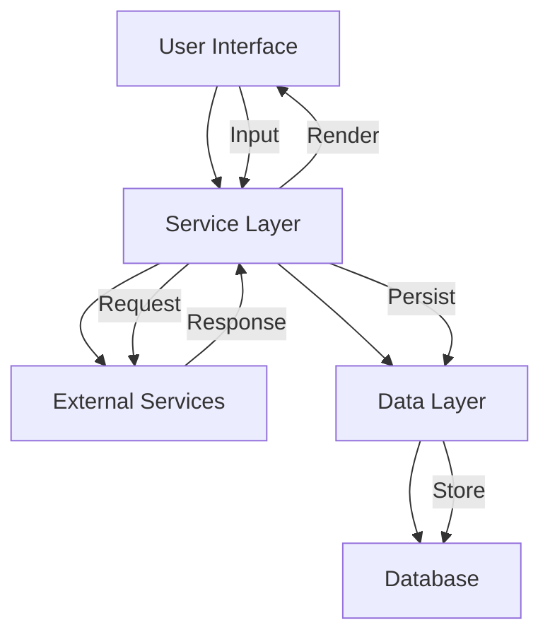

**Diagram sources**
- [natal_chart_window.py](file://src/pillars/astrology/ui/natal_chart_window.py)
- [openastro_service.py](file://src/pillars/astrology/services/openastro_service.py)
- [chart_storage_service.py](file://src/pillars/astrology/services/chart_storage_service.py)
- [arabic_parts_service.py](file://src/pillars/astrology/services/arabic_parts_service.py)
- [aspects_service.py](file://src/pillars/astrology/services/aspects_service.py)
- [fixed_stars_service.py](file://src/pillars/astrology/services/fixed_stars_service.py)
- [harmonics_service.py](file://src/pillars/astrology/services/harmonics_service.py)
- [midpoints_service.py](file://src/pillars/astrology/services/midpoints_service.py)
- [chart_repository.py](file://src/pillars/astrology/repositories/chart_repository.py)

## Detailed Component Analysis

### Natal Chart Window Analysis
The `natal_chart_window.py` file implements the primary UI for creating natal charts within the astrology pillar. It provides a comprehensive interface with tabs for configuration and results, allowing users to input birth data including name, date, time, location, and preferences. The window integrates with multiple services to provide location lookup, chart generation, and persistence functionality. It handles user interactions through a series of methods that validate input, generate charts, and manage the display of results. The component also provides functionality for saving and loading charts, viewing SVG visualizations, and managing default locations. The recent update has added an Advanced tab with five sub-tabs: Fixed Stars, Arabic Parts, Midpoints, Harmonics, and Aspects, each providing specialized astrological calculations.

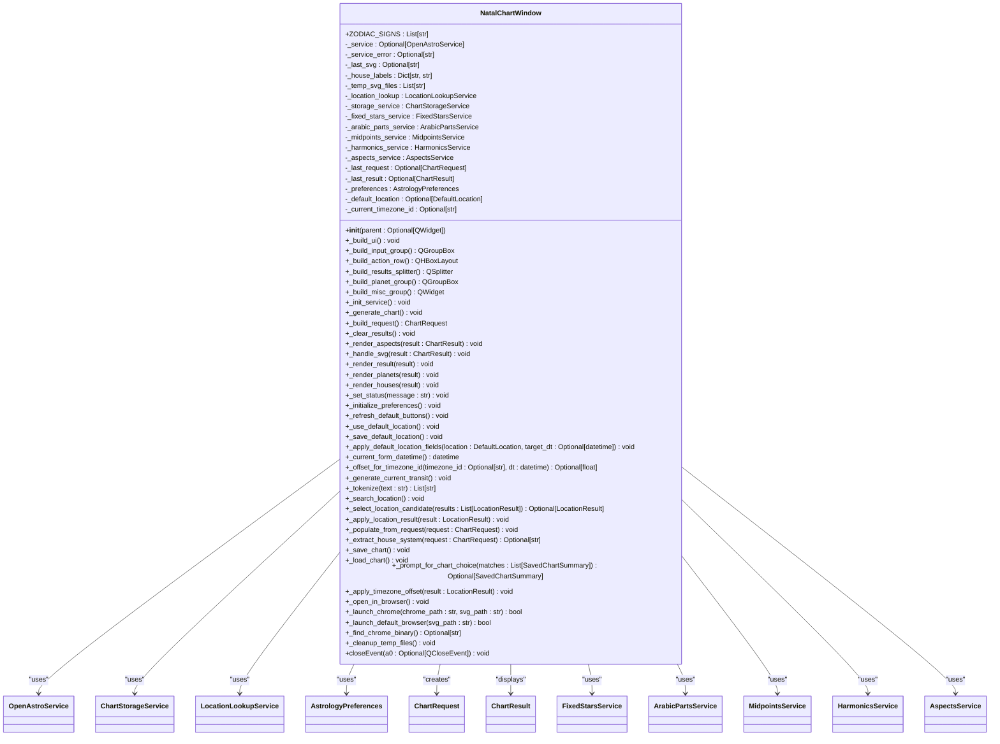

**Diagram sources**
- [natal_chart_window.py](file://src/pillars/astrology/ui/natal_chart_window.py)
- [openastro_service.py](file://src/pillars/astrology/services/openastro_service.py)
- [chart_storage_service.py](file://src/pillars/astrology/services/chart_storage_service.py)
- [location_lookup.py](file://src/pillars/astrology/services/location_lookup.py)
- [preferences.py](file://src/pillars/astrology/utils/preferences.py)
- [chart_models.py](file://src/pillars/astrology/models/chart_models.py)
- [arabic_parts_service.py](file://src/pillars/astrology/services/arabic_parts_service.py)
- [aspects_service.py](file://src/pillars/astrology/services/aspects_service.py)
- [fixed_stars_service.py](file://src/pillars/astrology/services/fixed_stars_service.py)
- [harmonics_service.py](file://src/pillars/astrology/services/harmonics_service.py)
- [midpoints_service.py](file://src/pillars/astrology/services/midpoints_service.py)

**Section sources**
- [natal_chart_window.py](file://src/pillars/astrology/ui/natal_chart_window.py)

### OpenAstro Service Analysis
The `openastro_service.py` file implements a high-level orchestration layer for OpenAstro2 usage, isolating direct dependencies on the external library while providing a clean API surface for the UI. The service handles chart generation by converting user requests into the format expected by OpenAstro2, executing the calculations, and converting the results back into a normalized format. It provides methods for generating charts, listing supported house systems, and accessing default settings. The service includes error handling to wrap low-level exceptions that occur during chart generation, providing meaningful error messages to the user interface.

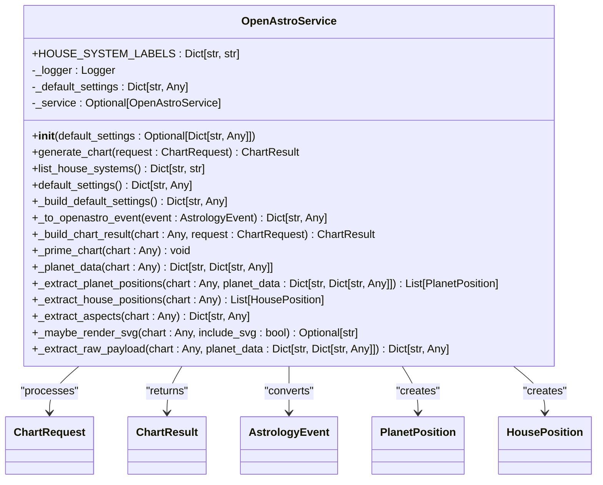

**Diagram sources**
- [openastro_service.py](file://src/pillars/astrology/services/openastro_service.py)
- [chart_models.py](file://src/pillars/astrology/models/chart_models.py)

**Section sources**
- [openastro_service.py](file://src/pillars/astrology/services/openastro_service.py)

### Chart Storage Service Analysis
The `chart_storage_service.py` file implements a high-level persistence facade for natal charts, providing methods for saving, loading, and searching charts in the database. The service uses a repository pattern to separate the business logic from the data access layer, with `ChartRepository` handling the direct database interactions. It provides methods for saving charts with associated metadata, listing recent charts, searching charts by text or tags, and loading specific charts by ID. The service handles serialization and deserialization of chart data, converting between in-memory objects and database records.

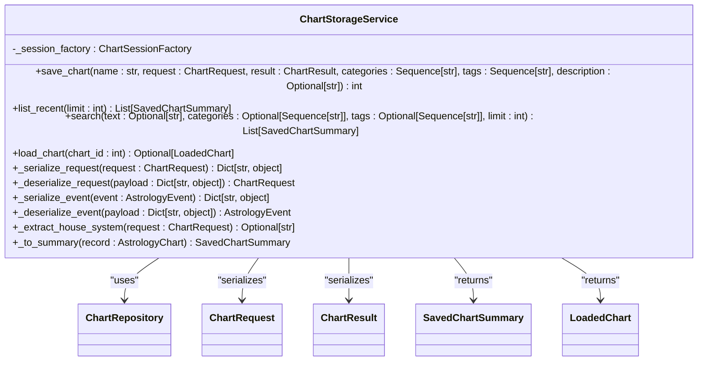

**Diagram sources**
- [chart_storage_service.py](file://src/pillars/astrology/services/chart_storage_service.py)
- [chart_repository.py](file://src/pillars/astrology/repositories/chart_repository.py)
- [chart_models.py](file://src/pillars/astrology/models/chart_models.py)
- [chart_record.py](file://src/pillars/astrology/models/chart_record.py)

**Section sources**
- [chart_storage_service.py](file://src/pillars/astrology/services/chart_storage_service.py)

### Data Models Analysis
The `chart_models.py` file defines the core data models used throughout the Natal Chart feature, providing a consistent representation of chart data across the system. These models use Python dataclasses to define structured data with type hints, ensuring type safety and clarity. The models include `GeoLocation` for geographic coordinates, `AstrologyEvent` for event descriptors, `ChartRequest` for user requests, `PlanetPosition` and `HousePosition` for celestial positions, and `ChartResult` for the final chart output. These models serve as the contract between different components of the system, ensuring consistent data representation.

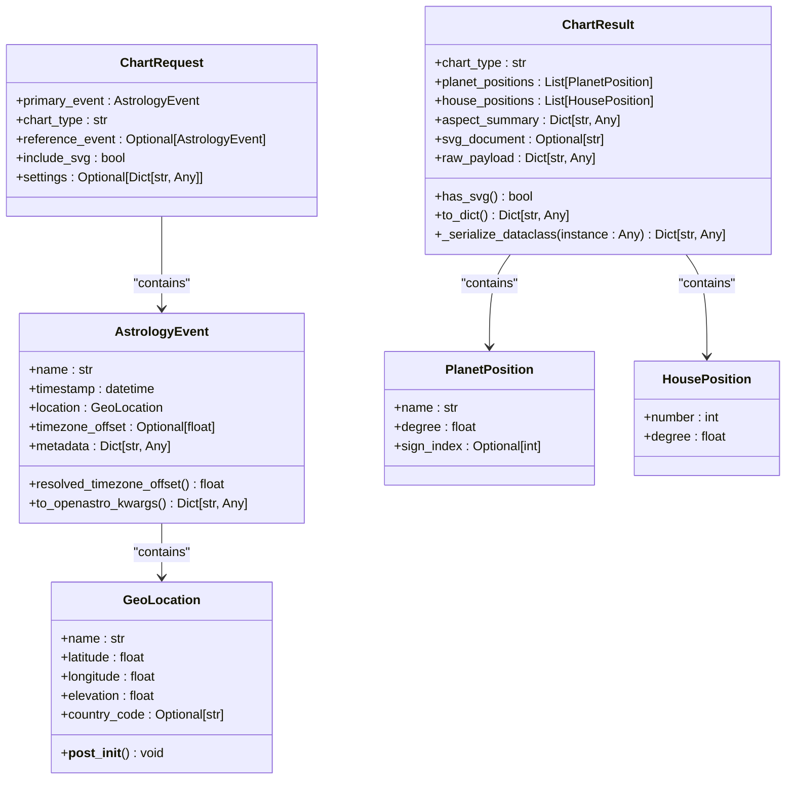

**Diagram sources**
- [chart_models.py](file://src/pillars/astrology/models/chart_models.py)

**Section sources**
- [chart_models.py](file://src/pillars/astrology/models/chart_models.py)

### Chart Record Analysis
The `chart_record.py` file defines the SQLAlchemy models used for persisting astrology charts in the database. These models define the schema for storing chart data, including the main `AstrologyChart` table and related tables for categories and tags. The models use SQLAlchemy's ORM features to define relationships between tables, with foreign keys and join tables to handle many-to-many relationships. The models include fields for chart metadata, event details, and serialized request and result data, allowing complete chart information to be stored and retrieved.

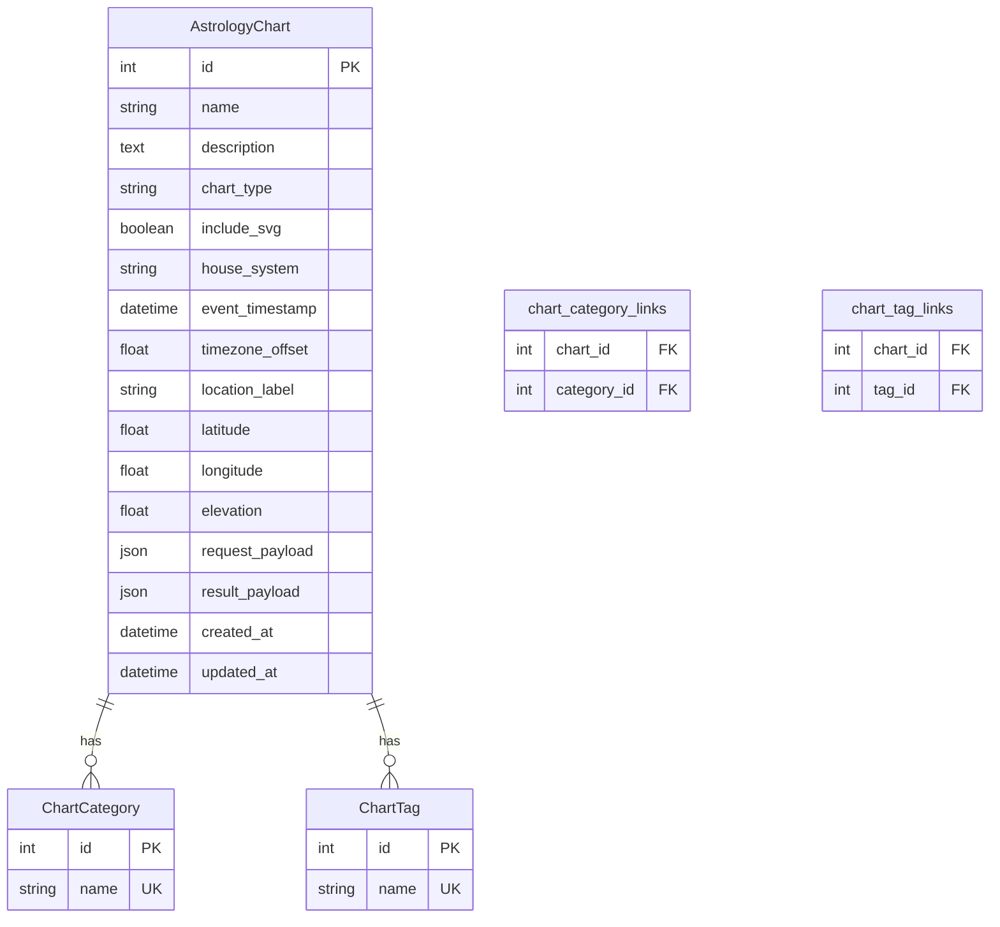

**Diagram sources**
- [chart_record.py](file://src/pillars/astrology/models/chart_record.py)

**Section sources**
- [chart_record.py](file://src/pillars/astrology/models/chart_record.py)

### Preferences System Analysis
The `preferences.py` file implements a simple JSON-backed preference store for the astrology pillar, allowing users to save and retrieve default location settings. The system uses a `DefaultLocation` dataclass to represent location preferences and an `AstrologyPreferences` class to manage reading and writing preferences to a JSON file. This enables users to save their default location once and use it for multiple chart generations, improving usability and reducing input errors. The preferences are stored in a file within the application's data directory, with automatic creation of the directory if it doesn't exist.

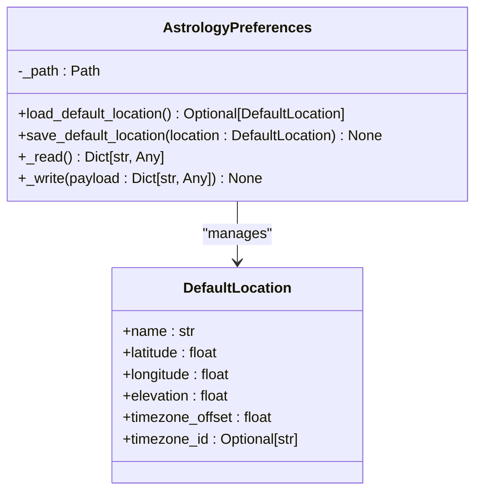

**Diagram sources**
- [preferences.py](file://src/pillars/astrology/utils/preferences.py)

**Section sources**
- [preferences.py](file://src/pillars/astrology/utils/preferences.py)

### Location Lookup Service Analysis
The `location_lookup.py` file implements a service for querying the Open-Meteo geocoding API to obtain coordinates for city names. This service allows users to search for locations by name and select from a list of matching results, improving accuracy and reducing input errors. The service handles network requests to the geocoding API, parses the response, and returns a list of `LocationResult` objects with coordinates, elevation, and timezone information. This integration enables automatic timezone detection based on location, addressing common issues with manual timezone input.

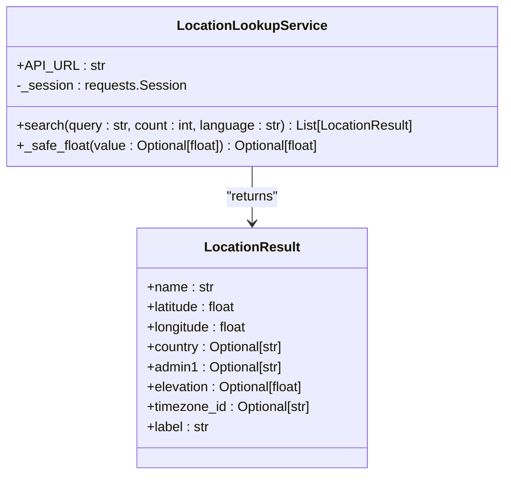

**Diagram sources**
- [location_lookup.py](file://src/pillars/astrology/services/location_lookup.py)

**Section sources**
- [location_lookup.py](file://src/pillars/astrology/services/location_lookup.py)

### Conversions Utility Analysis
The `conversions.py` file provides utility functions for converting between different coordinate systems and formatting astronomical data for display. The primary function `to_zodiacal_string` converts absolute degrees (0-360) to zodiacal degree notation (Deg Sign Min), which is the standard format used in astrology. This function takes a degree value and returns a formatted string showing the degree, sign name, and minutes, making it easier for users to interpret planetary positions. The function uses a lookup table of zodiac signs to determine the appropriate sign name based on the degree value.

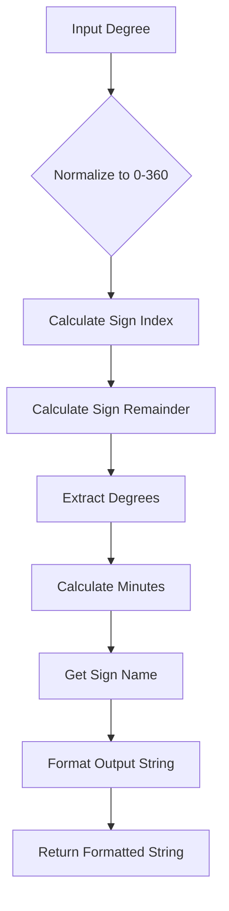

**Diagram sources**
- [conversions.py](file://src/pillars/astrology/utils/conversions.py)

**Section sources**
- [conversions.py](file://src/pillars/astrology/utils/conversions.py)

### Arabic Parts Service Analysis
The `arabic_parts_service.py` file implements a service for calculating Arabic Parts (Lots), which are sensitive points in a natal chart derived from mathematical formulas involving planets, angles, and houses. The service provides a comprehensive list of traditional, hermetic, and esoteric parts, each with its own formula and category. The service calculates parts based on the chart's planetary positions and house cusps, taking into account whether the chart is diurnal (day) or nocturnal (night) to apply the correct formula variations. The service returns a list of calculated parts with their positions, formulas, and categories.

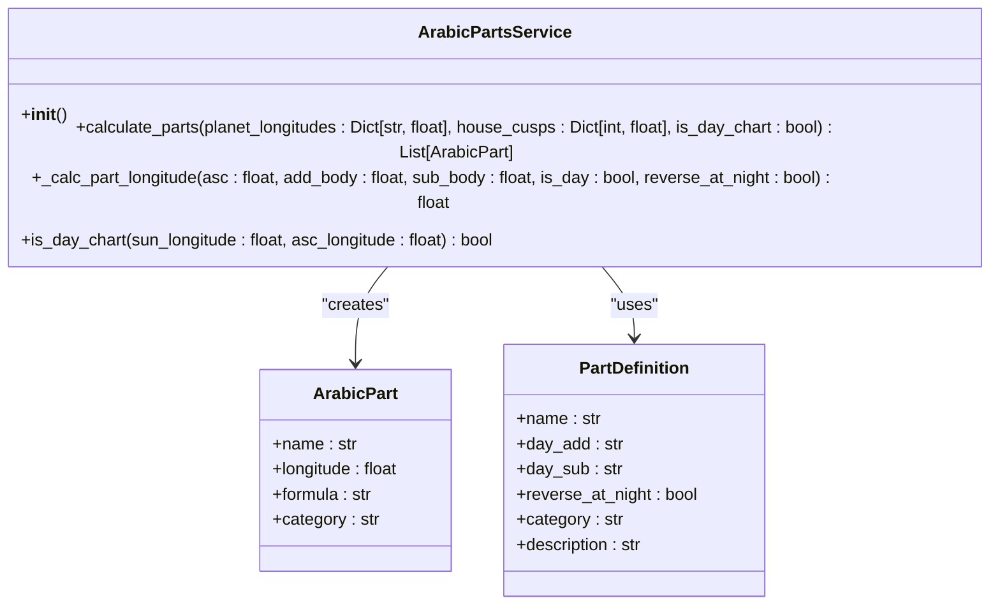

**Diagram sources**
- [arabic_parts_service.py](file://src/pillars/astrology/services/arabic_parts_service.py)

**Section sources**
- [arabic_parts_service.py](file://src/pillars/astrology/services/arabic_parts_service.py)

### Aspects Service Analysis
The `aspects_service.py` file implements a service for calculating planetary aspects, which are angular relationships between planets that indicate how their energies interact. The service supports both major aspects (Conjunction, Sextile, Square, Trine, Opposition) and minor aspects (Semi-sextile, Semi-square, Quintile, Sesquiquadrate, Quincunx). The service allows users to configure the orb (tolerance) for aspect detection and includes options to include minor aspects. The service returns a list of calculated aspects with their planets, aspect type, orb, and whether they are applying or separating.

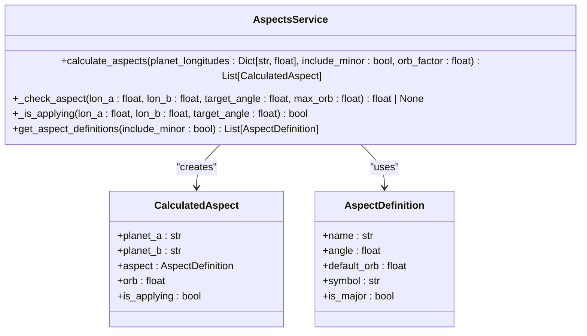

**Diagram sources**
- [aspects_service.py](file://src/pillars/astrology/services/aspects_service.py)

**Section sources**
- [aspects_service.py](file://src/pillars/astrology/services/aspects_service.py)

### Fixed Stars Service Analysis
The `fixed_stars_service.py` file implements a service for calculating the positions of notable fixed stars at a given time. The service uses the Swiss Ephemeris library to compute the precise positions of fixed stars, including their longitude, latitude, distance, magnitude, and traditional planetary nature. The service maintains a curated list of astrologically significant stars and provides methods to retrieve their positions and find conjunctions with planets. The service handles ephemeris path configuration and error cases when stars cannot be calculated.

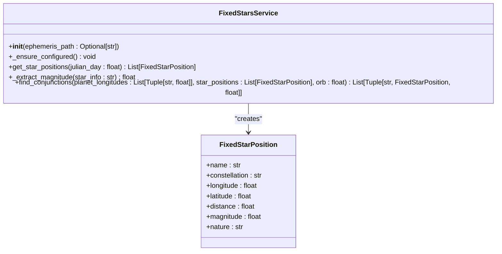

**Diagram sources**
- [fixed_stars_service.py](file://src/pillars/astrology/services/fixed_stars_service.py)

**Section sources**
- [fixed_stars_service.py](file://src/pillars/astrology/services/fixed_stars_service.py)

### Harmonics Service Analysis
The `harmonics_service.py` file implements a service for calculating harmonic charts, which are transformational charts that multiply the natal planetary positions by a harmonic number to reveal underlying patterns and themes. The service supports various harmonic presets with specific meanings (e.g., harmonic 4 for challenges, harmonic 5 for creativity, harmonic 7 for destiny). The service calculates the harmonic positions by multiplying each planet's natal longitude by the harmonic number and normalizing to 0-360 degrees. The service returns a list of harmonic positions with both natal and harmonic longitudes for comparison.

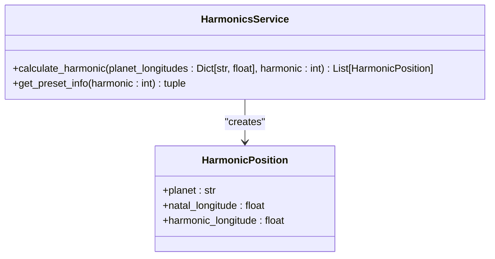

**Diagram sources**
- [harmonics_service.py](file://src/pillars/astrology/services/harmonics_service.py)

**Section sources**
- [harmonics_service.py](file://src/pillars/astrology/services/harmonics_service.py)

### Midpoints Service Analysis
The `midpoints_service.py` file implements a service for calculating planetary midpoints, which are points exactly halfway between two planets or points in the chart. The service calculates midpoints for all pairs of planets, with options to include only the classical seven planets (Sun through Saturn) or to include modern planets. The service uses the shorter arc method to calculate midpoints, handling cases where the arc crosses 0°. The service returns a list of midpoints sorted by longitude, providing insight into the dynamic relationships between planetary energies.

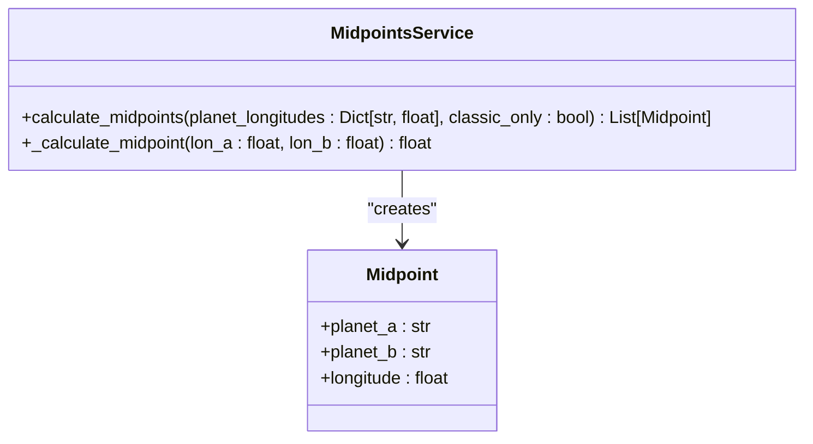

**Diagram sources**
- [midpoints_service.py](file://src/pillars/astrology/services/midpoints_service.py)

**Section sources**
- [midpoints_service.py](file://src/pillars/astrology/services/midpoints_service.py)

## Dependency Analysis
The Natal Chart feature has a well-defined dependency structure that follows the dependency inversion principle, with higher-level modules depending on abstractions rather than concrete implementations. The UI component `natal_chart_window.py` depends on service interfaces rather than directly on external libraries, allowing for easier testing and maintenance. The service layer depends on data models and external APIs, while the data layer depends on the database schema and ORM. This structure enables the system to be modular and extensible, with clear boundaries between components. The addition of the Advanced tab has introduced new dependencies on specialized calculation services for Arabic Parts, aspects, fixed stars, harmonics, and midpoints.

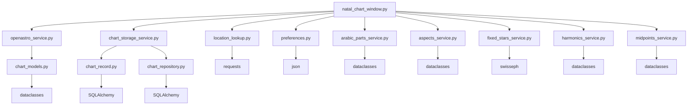

**Diagram sources**
- [natal_chart_window.py](file://src/pillars/astrology/ui/natal_chart_window.py)
- [openastro_service.py](file://src/pillars/astrology/services/openastro_service.py)
- [chart_storage_service.py](file://src/pillars/astrology/services/chart_storage_service.py)
- [location_lookup.py](file://src/pillars/astrology/services/location_lookup.py)
- [preferences.py](file://src/pillars/astrology/utils/preferences.py)
- [arabic_parts_service.py](file://src/pillars/astrology/services/arabic_parts_service.py)
- [aspects_service.py](file://src/pillars/astrology/services/aspects_service.py)
- [fixed_stars_service.py](file://src/pillars/astrology/services/fixed_stars_service.py)
- [harmonics_service.py](file://src/pillars/astrology/services/harmonics_service.py)
- [midpoints_service.py](file://src/pillars/astrology/services/midpoints_service.py)
- [chart_models.py](file://src/pillars/astrology/models/chart_models.py)
- [chart_record.py](file://src/pillars/astrology/models/chart_record.py)
- [chart_repository.py](file://src/pillars/astrology/repositories/chart_repository.py)

## Performance Considerations
The Natal Chart feature is designed with performance in mind, minimizing unnecessary computations and optimizing data access patterns. The system uses efficient data structures and algorithms for handling chart data, with dataclasses providing fast attribute access and JSON serialization for persistence. The service layer caches frequently accessed data, such as house system labels, to reduce redundant computations. Database queries are optimized with appropriate indexing and query patterns, with recent charts loaded in descending order of event timestamp. Network requests are handled asynchronously where possible, with timeouts and error handling to prevent UI blocking. The system also includes mechanisms for cleaning up temporary files, such as SVG files created for browser viewing, to prevent disk space issues. The addition of advanced calculation services may impact performance, particularly for fixed stars which require external ephemeris data, so these calculations are performed only when the Advanced tab is accessed.

## Troubleshooting Guide
Common issues with the Natal Chart feature typically relate to external dependencies, configuration, or data input. If OpenAstro2 is not available, the system will display an error message indicating that the library needs to be installed. Geolocation lookup issues may occur if the Open-Meteo API is unreachable or returns no results, which can be addressed by checking network connectivity or trying alternative search terms. Timezone discrepancies can occur due to daylight saving time rules or incorrect location input, which can be mitigated by using the location lookup service to automatically detect timezone information. Database issues may arise from file permissions or schema mismatches, which can be resolved by checking the database file location and running any necessary migration scripts. Users experiencing issues with chart generation should verify their input data, particularly the date, time, and location, and ensure that the OpenAstro2 library is properly installed and configured. For the new Advanced tab features, users should ensure that the Swiss Ephemeris data is properly configured for fixed stars calculations, and that sufficient system resources are available for the additional calculations.

**Section sources**
- [natal_chart_window.py](file://src/pillars/astrology/ui/natal_chart_window.py)
- [openastro_service.py](file://src/pillars/astrology/services/openastro_service.py)
- [chart_storage_service.py](file://src/pillars/astrology/services/chart_storage_service.py)
- [location_lookup.py](file://src/pillars/astrology/services/location_lookup.py)
- [arabic_parts_service.py](file://src/pillars/astrology/services/arabic_parts_service.py)
- [aspects_service.py](file://src/pillars/astrology/services/aspects_service.py)
- [fixed_stars_service.py](file://src/pillars/astrology/services/fixed_stars_service.py)
- [harmonics_service.py](file://src/pillars/astrology/services/harmonics_service.py)
- [midpoints_service.py](file://src/pillars/astrology/services/midpoints_service.py)

## Conclusion
The Natal Chart feature provides a comprehensive system for generating and visualizing birth charts based on user-provided birth data. The implementation follows a clean, modular architecture with clear separation of concerns between UI, services, models, and data access layers. The system integrates with external services for celestial calculations and geolocation lookup, while providing robust persistence for chart data. The recent addition of the Advanced tab with five sub-tabs for Fixed Stars, Arabic Parts, Midpoints, Harmonics, and Aspects has significantly expanded the analytical capabilities of the feature, integrating new services for specialized astrological calculations. While the current implementation does not show direct integration with gematria values and TQ systems for cross-pillar analysis, the architecture is extensible and could support such integrations in the future through additional service components or data model extensions.