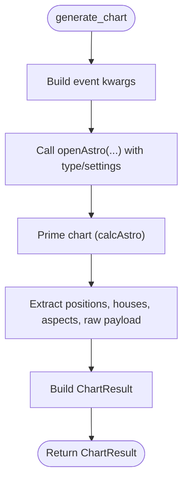

# Planetary Positions

<cite>
**Referenced Files in This Document**
- [planetary_positions_window.py](file://src/pillars/astrology/ui/planetary_positions_window.py)
- [openastro_service.py](file://src/pillars/astrology/services/openastro_service.py)
- [chart_models.py](file://src/pillars/astrology/models/chart_models.py)
- [conversions.py](file://src/pillars/astrology/utils/conversions.py)
- [preferences.py](file://src/pillars/astrology/utils/preferences.py)
- [ephemeris_provider.py](file://src/pillars/astrology/repositories/ephemeris_provider.py)
- [correspondence_hub.py](file://src/pillars/correspondences/ui/correspondence_hub.py)
- [venus_rose_window.py](file://src/pillars/astrology/ui/venus_rose_window.py)
- [tq_calculator.py](file://src/pillars/gematria/services/tq_calculator.py)
</cite>

## Table of Contents
1. [Introduction](#introduction)
2. [Project Structure](#project-structure)
3. [Core Components](#core-components)
4. [Architecture Overview](#architecture-overview)
5. [Detailed Component Analysis](#detailed-component-analysis)
6. [Dependency Analysis](#dependency-analysis)
7. [Performance Considerations](#performance-considerations)
8. [Troubleshooting Guide](#troubleshooting-guide)
9. [Conclusion](#conclusion)
10. [Appendices](#appendices)

## Introduction
The Planetary Positions feature in the Astrology pillar provides a comprehensive ephemeris-style viewer for celestial bodies. It displays precise longitudinal and latitudinal ecliptic coordinates, zodiacal signs, declination-like quantities, motion speeds, and retrograde status for major and minor planets. The UI component generates time-series tables over configurable ranges, exports tabular data for external analysis, and integrates with the broader system by sending results to the Emerald Tablet (Correspondence Hub). It sources data from OpenAstro2 via a service wrapper and also leverages Skyfield-based ephemeris providers for geocentric/heliocentric ecliptic longitude, speed, and retrograde detection.

## Project Structure
The Planetary Positions feature spans UI, service, model, conversion, preferences, and ephemeris provider layers, plus integration with the Correspondence Hub for data export.

**Diagram sources**
- [planetary_positions_window.py](file://src/pillars/astrology/ui/planetary_positions_window.py#L1-L518)
- [openastro_service.py](file://src/pillars/astrology/services/openastro_service.py#L1-L254)
- [chart_models.py](file://src/pillars/astrology/models/chart_models.py#L1-L133)
- [conversions.py](file://src/pillars/astrology/utils/conversions.py#L1-L37)
- [preferences.py](file://src/pillars/astrology/utils/preferences.py#L1-L59)
- [ephemeris_provider.py](file://src/pillars/astrology/repositories/ephemeris_provider.py#L1-L178)
- [correspondence_hub.py](file://src/pillars/correspondences/ui/correspondence_hub.py#L1-L256)

**Section sources**
- [planetary_positions_window.py](file://src/pillars/astrology/ui/planetary_positions_window.py#L1-L518)
- [openastro_service.py](file://src/pillars/astrology/services/openastro_service.py#L1-L254)
- [chart_models.py](file://src/pillars/astrology/models/chart_models.py#L1-L133)
- [conversions.py](file://src/pillars/astrology/utils/conversions.py#L1-L37)
- [preferences.py](file://src/pillars/astrology/utils/preferences.py#L1-L59)
- [ephemeris_provider.py](file://src/pillars/astrology/repositories/ephemeris_provider.py#L1-L178)
- [correspondence_hub.py](file://src/pillars/correspondences/ui/correspondence_hub.py#L1-L256)

## Core Components
- PlanetaryPositionsWindow: The main UI that builds the form controls, collects user inputs, generates ephemeris tables, formats results, exports CSV, and sends data to the Correspondence Hub.
- OpenAstroService: Wraps OpenAstro2, converting events and requests, invoking chart computation, extracting positions, and returning structured results.
- Models: Data structures for events, requests, results, and positions used across the pipeline.
- Conversions: Utility for zodiacal DMS formatting.
- Preferences: Stores default location for quick application.
- EphemerisProvider: Skyfield-based provider for geocentric/heliocentric ecliptic longitude, speed, and retrograde status.
- CorrespondenceHub: Receives imported data and opens spreadsheet windows.

**Section sources**
- [planetary_positions_window.py](file://src/pillars/astrology/ui/planetary_positions_window.py#L1-L518)
- [openastro_service.py](file://src/pillars/astrology/services/openastro_service.py#L1-L254)
- [chart_models.py](file://src/pillars/astrology/models/chart_models.py#L1-L133)
- [conversions.py](file://src/pillars/astrology/utils/conversions.py#L1-L37)
- [preferences.py](file://src/pillars/astrology/utils/preferences.py#L1-L59)
- [ephemeris_provider.py](file://src/pillars/astrology/repositories/ephemeris_provider.py#L1-L178)
- [correspondence_hub.py](file://src/pillars/correspondences/ui/correspondence_hub.py#L1-L256)

## Architecture Overview
The Planetary Positions feature orchestrates a request-response flow:
- The UI constructs an AstrologyEvent and ChartRequest for each timestamp.
- The OpenAstroService invokes OpenAstro2, extracts PlanetPosition lists, and returns ChartResult.
- The UI formats the results into an ephemeris matrix and presents them in a table dialog.
- Export and integration send the formatted data to the Correspondence Hub.

**Diagram sources**
- [planetary_positions_window.py](file://src/pillars/astrology/ui/planetary_positions_window.py#L295-L455)
- [openastro_service.py](file://src/pillars/astrology/services/openastro_service.py#L64-L139)
- [chart_models.py](file://src/pillars/astrology/models/chart_models.py#L74-L133)

## Detailed Component Analysis

### PlanetaryPositionsWindow
Responsibilities:
- Builds the UI with time range, planet selection, and location controls.
- Validates inputs and enforces a maximum number of timestamps for responsiveness.
- Generates ChartRequest objects per timestamp and calls OpenAstroService.
- Extracts positions, retrograde flags, and speeds from ChartResult.
- Formats cells using zodiacal DMS strings and appends retrograde/speed indicators.
- Exports CSV and sends data to the Correspondence Hub.

Key behaviors:
- Timestamp generation and bounds enforcement.
- Planet selection normalization and canonical name mapping.
- Retrograde and speed extraction from raw payload and detail dictionaries.
- Formatting and status reporting.

**Diagram sources**
- [planetary_positions_window.py](file://src/pillars/astrology/ui/planetary_positions_window.py#L119-L518)
- [openastro_service.py](file://src/pillars/astrology/services/openastro_service.py#L64-L139)
- [chart_models.py](file://src/pillars/astrology/models/chart_models.py#L85-L133)
- [preferences.py](file://src/pillars/astrology/utils/preferences.py#L24-L59)

**Section sources**
- [planetary_positions_window.py](file://src/pillars/astrology/ui/planetary_positions_window.py#L119-L518)

### OpenAstroService
Responsibilities:
- Validates presence of OpenAstro2 and raises a specific error if unavailable.
- Converts AstrologyEvent to OpenAstro2 kwargs and constructs chart objects.
- Ensures chart computation completes, then extracts positions, houses, aspects, and raw payload.
- Provides default settings and house system labels.

Important extraction logic:
- Planet positions from either a detailed planet dictionary or fallback arrays.
- Houses and aspects via attribute inspection.
- Raw payload aggregation for downstream UI consumption.

**Diagram sources**
- [openastro_service.py](file://src/pillars/astrology/services/openastro_service.py#L64-L139)
- [chart_models.py](file://src/pillars/astrology/models/chart_models.py#L85-L133)

**Section sources**
- [openastro_service.py](file://src/pillars/astrology/services/openastro_service.py#L1-L254)
- [chart_models.py](file://src/pillars/astrology/models/chart_models.py#L1-L133)

### EphemerisProvider (Skyfield)
Responsibilities:
- Loads ephemeris data (de421/de441) and exposes a singleton instance.
- Computes geocentric and heliocentric ecliptic longitude for a given body/time.
- Estimates daily speed by differencing longitude over a 1-hour interval.
- Determines retrograde status by checking whether geocentric longitude decreases.
- Computes elongation between Sun and body as seen from Earth.

**Diagram sources**
- [ephemeris_provider.py](file://src/pillars/astrology/repositories/ephemeris_provider.py#L1-L178)

**Section sources**
- [ephemeris_provider.py](file://src/pillars/astrology/repositories/ephemeris_provider.py#L1-L178)

### Integration with Correspondence Hub
The Planetary Positions window can send generated ephemeris data to the Emerald Tablet (Correspondence Hub). The hub receives structured data and opens a spreadsheet window for further analysis.

**Diagram sources**
- [planetary_positions_window.py](file://src/pillars/astrology/ui/planetary_positions_window.py#L466-L508)
- [correspondence_hub.py](file://src/pillars/correspondences/ui/correspondence_hub.py#L153-L200)

**Section sources**
- [planetary_positions_window.py](file://src/pillars/astrology/ui/planetary_positions_window.py#L466-L508)
- [correspondence_hub.py](file://src/pillars/correspondences/ui/correspondence_hub.py#L1-L256)

## Dependency Analysis
- UI depends on OpenAstroService for chart generation and on conversions for display formatting.
- OpenAstroService depends on models for request/result structures and on OpenAstro2 for computations.
- UI also uses preferences for default location and ephemeris provider for geocentric/heliocentric data in other contexts.
- Integration with the Correspondence Hub is via window manager and hub’s public import API.

**Diagram sources**
- [planetary_positions_window.py](file://src/pillars/astrology/ui/planetary_positions_window.py#L1-L518)
- [openastro_service.py](file://src/pillars/astrology/services/openastro_service.py#L1-L254)
- [chart_models.py](file://src/pillars/astrology/models/chart_models.py#L1-L133)
- [conversions.py](file://src/pillars/astrology/utils/conversions.py#L1-L37)
- [preferences.py](file://src/pillars/astrology/utils/preferences.py#L1-L59)
- [ephemeris_provider.py](file://src/pillars/astrology/repositories/ephemeris_provider.py#L1-L178)
- [correspondence_hub.py](file://src/pillars/correspondences/ui/correspondence_hub.py#L1-L256)

**Section sources**
- [planetary_positions_window.py](file://src/pillars/astrology/ui/planetary_positions_window.py#L1-L518)
- [openastro_service.py](file://src/pillars/astrology/services/openastro_service.py#L1-L254)
- [chart_models.py](file://src/pillars/astrology/models/chart_models.py#L1-L133)
- [conversions.py](file://src/pillars/astrology/utils/conversions.py#L1-L37)
- [preferences.py](file://src/pillars/astrology/utils/preferences.py#L1-L59)
- [ephemeris_provider.py](file://src/pillars/astrology/repositories/ephemeris_provider.py#L1-L178)
- [correspondence_hub.py](file://src/pillars/correspondences/ui/correspondence_hub.py#L1-L256)

## Performance Considerations
- Responsiveness: The UI enforces a maximum number of timestamps to prevent excessive UI updates and memory pressure.
- Cursor feedback: The UI switches to a busy cursor during generation to indicate ongoing work.
- Batch processing: The service computes charts sequentially per timestamp; consider batching or threading if performance becomes a bottleneck.
- Data extraction: The service uses attribute inspection and fallbacks to ensure robustness against upstream changes.
- Export: CSV writing occurs synchronously; for very large datasets, consider background threads.

[No sources needed since this section provides general guidance]

## Troubleshooting Guide
Common issues and resolutions:
- OpenAstro2 not installed: The service raises a specific error when the dependency is missing. Install the package to enable chart generation.
- No data returned: Verify that at least one planet is selected and that the time range is reasonable.
- Default location not applied: Save a default location in the transit or natal view; the UI enables the “Use Default” action when available.
- Export failures: Ensure write permissions and a valid destination path; errors are surfaced via message boxes.
- Integration with Correspondence Hub: Confirm the window manager is provided and that the hub’s import method is available.

**Section sources**
- [openastro_service.py](file://src/pillars/astrology/services/openastro_service.py#L23-L57)
- [planetary_positions_window.py](file://src/pillars/astrology/ui/planetary_positions_window.py#L143-L149)
- [planetary_positions_window.py](file://src/pillars/astrology/ui/planetary_positions_window.py#L295-L364)
- [planetary_positions_window.py](file://src/pillars/astrology/ui/planetary_positions_window.py#L411-L429)
- [planetary_positions_window.py](file://src/pillars/astrology/ui/planetary_positions_window.py#L466-L508)

## Conclusion
The Planetary Positions feature delivers a flexible, extensible ephemeris viewer that integrates tightly with OpenAstro2 and Skyfield. It supports customizable time ranges, selectable planetary groups, and export/import workflows. While the UI focuses on longitudinal positions and retrograde/speed indicators, the underlying ephemeris provider supplies geocentric/heliocentric ecliptic longitude, speed, and retrograde status, enabling deeper analyses. The integration with the Correspondence Hub allows seamless transfer of results for external analysis and visualization.

[No sources needed since this section summarizes without analyzing specific files]

## Appendices

### Displayed Data Elements
- Longitudinal position: Absolute degrees normalized modulo 360, formatted as zodiacal DMS.
- Zodiacal sign: Determined from the longitudinal degree.
- Latitudinal position: Provided via raw payload and detail dictionaries; included in the ephemeris matrix.
- Declination: Not explicitly computed here; the UI consumes available raw payload fields.
- Speed: Daily motion derived from longitude differences over a 1-hour interval.
- Retrograde status: Determined by geocentric longitude change direction.

**Section sources**
- [planetary_positions_window.py](file://src/pillars/astrology/ui/planetary_positions_window.py#L365-L410)
- [openastro_service.py](file://src/pillars/astrology/services/openastro_service.py#L237-L254)
- [ephemeris_provider.py](file://src/pillars/astrology/repositories/ephemeris_provider.py#L112-L178)

### View Modes and Filtering
- View mode: The service’s default settings include a geocentric position type and Placidus house system; adjust settings to influence chart generation.
- Filtering: Planet selection is controlled via checkboxes; the UI filters results to selected bodies only.

**Section sources**
- [openastro_service.py](file://src/pillars/astrology/services/openastro_service.py#L99-L118)
- [planetary_positions_window.py](file://src/pillars/astrology/ui/planetary_positions_window.py#L195-L217)

### Unit Selection and Precision
- Units: The UI displays zodiacal DMS strings and degrees; the underlying service returns degrees and sign indices.
- Precision: Formatting uses integer degrees and truncated minutes; adjust conversion logic if higher precision is required.

**Section sources**
- [conversions.py](file://src/pillars/astrology/utils/conversions.py#L18-L37)
- [planetary_positions_window.py](file://src/pillars/astrology/ui/planetary_positions_window.py#L456-L465)

### Exporting Data
- CSV export writes a header row with timestamps and planetary labels, followed by per-timestamp rows containing formatted ephemeris entries.
- Integration export sends structured data to the Correspondence Hub, which creates a new table and opens a spreadsheet window.

**Section sources**
- [planetary_positions_window.py](file://src/pillars/astrology/ui/planetary_positions_window.py#L411-L429)
- [planetary_positions_window.py](file://src/pillars/astrology/ui/planetary_positions_window.py#L466-L508)
- [correspondence_hub.py](file://src/pillars/correspondences/ui/correspondence_hub.py#L153-L200)

### Accuracy and Ephemeris Versions
- The ephemeris provider loads de421 or de441; ensure the appropriate file is present or available for download. The provider estimates speed and retrograde using 1-hour deltas and handles longitude wrap-around.

**Section sources**
- [ephemeris_provider.py](file://src/pillars/astrology/repositories/ephemeris_provider.py#L36-L68)
- [ephemeris_provider.py](file://src/pillars/astrology/repositories/ephemeris_provider.py#L112-L178)

### Leap Second Handling
- The AstrologyEvent serializer passes timezone offsets to OpenAstro2; timezone-aware datetimes are normalized to UTC before serialization. The ephemeris provider uses Skyfield’s timescale, which internally manages leap seconds.

**Section sources**
- [chart_models.py](file://src/pillars/astrology/models/chart_models.py#L33-L71)
- [ephemeris_provider.py](file://src/pillars/astrology/repositories/ephemeris_provider.py#L120-L129)

### Relationship to Other Features
- Venus Rose Window demonstrates the use of the ephemeris provider for conjunction refinement and orbital data, complementing the Planetary Positions feature’s static ephemeris generation.

**Section sources**
- [venus_rose_window.py](file://src/pillars/astrology/ui/venus_rose_window.py#L495-L531)
- [ephemeris_provider.py](file://src/pillars/astrology/repositories/ephemeris_provider.py#L112-L178)

### Feeding into Gematria and TQ Transitions
- Planetary positions can inform gematria calculations and geometric transition triggers in the TQ system. The TQ calculator suite provides multiple value schemes (standard, reduced, square, triangular, positional) that can be applied to textual content or derived from positional data.

**Section sources**
- [tq_calculator.py](file://src/pillars/gematria/services/tq_calculator.py#L1-L350)